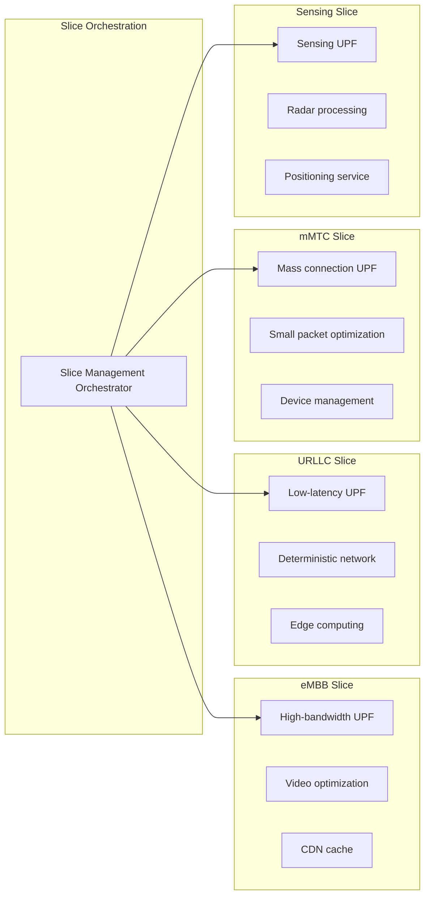
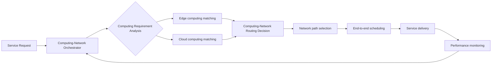

---title: 6G Core Network Architecture Design — Alibaba Cloud Perspective
description: '6G Core Network Architecture Design'
summary: '6G Core Network Architecture Design'
category: general
tags:
- architecture
- best-practice
- networking
- etcd
- grafana
- redis
- mysql
- networkpolicy
- operator
- gpu
tier: supporting
created: '2026-05-23'
last_updated: 2026-05
difficulty: intermediate
reading_level: intermediate
audience:
- All engineers
estimated_read_time: 25min
intent_queries:
- What is 6G core network architecture design — Alibaba Cloud perspective
- How to design 6G core network architecture — Alibaba Cloud perspective
- Kubernetes 20 application patterns best practices
trigger_keywords:
- 6G
- Core network architecture design
- Alibaba Cloud perspective
- application
- patterns
prerequisites:
- kubectl-basics
- prometheus-basics
- monitoring-basics
- etcd-basics
- redis-basics
- mysql-basics
- gpu-scheduling-basics
original_language: Chinese
authors:
- name: Dillan Teagle
  role: contributor
source_path: /Users/teaglebuilt/github/teaglebuilt/knowledge/tree/application/architecture/6g-core-network.md
---

> **Production Environment Security Notice**
>
> This document contains directly executable operation and maintenance commands. Before execution, please confirm: whether the current target cluster and Namespace are correct; whether you have sufficient RBAC permissions; whether you have verified in a non-production environment. Command risk levels are marked: Red (high risk - may cause data loss or service interruption), Yellow (medium risk - modifies cluster state but usually reversible), Green (low risk/read-only - information collection with no side effects).

title: 6G Core Network Architecture Design
description: '# 6G Core Network Architecture Design — Alibaba Cloud Perspective'
category: application-architecture
tags:
- k8s
- architecture
- industry
- [[etcd|etcd]]
- grafana
- redis
- mysql
- [[NetworkPolicy|networkpolicy]]
- operator
- gpu
last_updated: 2026-05-18
difficulty: expert
reading_level: expert
audience:
- Telecom operator architects
- 6G researchers
- Network function virtualization engineers
estimated_read_time: 5min
intent_queries:
- 6G core network five-plane integrated architecture design
- Integrated sensing and communication (ISAC) signal processing
- Network slice UPF deployment solution
- Computing-network fusion routing scheduling
- Alibaba Cloud ACK core network
trigger_keywords:
- 6G core network
- Integrated sensing and communication
- ISAC
- Network slicing
- UPF user plane
- Computing-network fusion
- Space-terrestrial-sea integration
- AI-Native
- Edge computing
- Alibaba Cloud service mesh
related_domains:
- domain-03-networking-traffic
- domain-10-troubleshooting-diagnostics
related_topics:
- topic-telecom-architecture
- topic-edge-computing
k8s_versions:
- '1.28'
- '1.29'
- '1.30'
- '1.31'
- '1.32'
---

# 6G Core Network Architecture Design — Alibaba Cloud Perspective

> **Applicable Versions**: [[Kubernetes|Kubernetes]] v1.29 - v1.33 | **Last Updated**: 2026-04-24
> **Authors**: Alibaba Cloud Solution Architects | **Tags**: `#6G` `#CoreNetwork` `#IntegratedSensingCommunication` `#SpaceGroundSea` `#AlibabCloud`

---

<!-- chunk: Table of Contents -->## Table of Contents

1. [Overview](#1-overview)
2. [Design Principles](#2-design-principles)
3. [Architecture Patterns](#3-architecture-patterns)
4. [Implementation Examples](#4-implementation-examples)
5. [Deployment on Kubernetes](#5-deployment-on-kubernetes)
6. [Best Practices](#6-best-practices)
7. [Anti-Patterns](#7-anti-patterns)
8. [Reference Resources](#8-reference-resources)

---

<!-- chunk: 1. Overview -->## 1. Overview

Sixth-generation mobile communications (6G) represents the next major leap in communication technology. Compared to 5G, 6G improves peak data rate (Tbps level), air interface latency (< 0.1ms), connection density (10^7/km²), and positioning accuracy (cm level) by one to two orders of magnitude. More importantly, 6G introduces three revolutionary capabilities: integrated sensing and communication (ISAC - unified sensing and communication), global coverage from space-terrestrial-sea, and AI-Native (intrinsic artificial intelligence).

The 6G core network is the "brain" of the entire 6G system, responsible for user plane data processing, control plane signaling management, sensing data processing, computing resource scheduling, and AI function orchestration. Compared to 5G core network based on SBA (Service-Based Architecture), 6G core network fundamentally evolves in the following aspects:

- **New Sensing Plane**: Supports radar sensing, positioning, environmental monitoring and other sensing services
- **New Computing Plane**: Supports distributed scheduling of computing tasks and computing-network routing
- **New AI Plane**: Supports network self-optimization, intelligent slicing, predictive maintenance
- **Unified Space-Ground-Sea Access**: Ground base stations, low-orbit satellites, high-altitude platforms (HAPS) managed through unified core network

Cloud-native technology is the natural choice for 6G core network. Core network functions are fully containerized and deployed on Kubernetes clusters, microservices achieve modularity, Service Mesh achieves service governance, and Operators achieve automated operations.

## 1.1 Industry Background

| Challenge | Description | Architecture Impact |
|:---|:---|:---|
| Integrated Sensing & Communication | Fusion of communication and radar sensing | Waveform sharing + joint resource scheduling |
| Space-Ground-Sea Integration | Unified integration of terrestrial/satellite/HAP | Unified core network + multi-access orchestration |
| Intelligent Reflecting Surface RIS | Programmable wireless environment | Beam management + channel modeling |
| Ultra-low Latency | < 0.1ms air interface latency | Edge computing + local breakthrough |
| Computing-Network Fusion | Coordination of computing and network | Computing-network routing + orchestration |

## 1.2 Core Scenarios

- **Holographic Communication**: 3D holographic real-time interaction, Tbps-level bandwidth + millisecond latency
- **Digital Twin Communication**: Real-time high-fidelity mapping of physical world, 10^7/km² connection density
- **Integrated Sensing-Communication-Computing**: Fusion of sensing-communication-computing services, supporting autonomous driving, intelligent manufacturing
- **Ubiquitous Connectivity**: Seamless global coverage, ground+satellite+HAPS coordination
- **Intelligent Intrinsics**: AI-native network architecture, self-optimizing and self-healing networks

---

<!-- chunk: 2. Design Principles -->## 2. Design Principles

## 2.1 Multi-Plane Convergence Principle

6G core network breaks the binary structure of traditional core networks separating control and user planes, introducing sensing plane, computing plane, and AI plane. Five planes need to coordinate closely while maintaining loose coupling. Architecture design requires unified orchestrator to achieve multi-plane coordination and standardized plane-to-plane interfaces for loose coupling.

## 2.2 Distributed Autonomy Principle

6G networks cover space-ground-sea globally, making completely centralized control impossible. Architecture design requires "centralized orchestration + distributed autonomy" model: central orchestrator handles global policy and resource allocation, distributed autonomous nodes handle local real-time decision-making and execution. When central control is unreachable, autonomous nodes can independently maintain basic services.

## 2.3 AI-Native Principle

AI is not an add-on feature for 6G networks but a core intrinsic capability. Architecture design must support AI model training, deployment, inference and updates from the ground up. Networks leverage AI for self-optimization (intelligent slicing, load balancing, fault prediction), while providing AI service capabilities to upper-layer applications.

## 2.4 Security-Native Principle

6G network security must shift from passive defense to active immunity. Architecture design must support zero-trust network architecture, post-quantum cryptography, privacy computing and other advanced security technologies. Security capabilities are embedded in each network function rather than added as independent security layers.

---

<!-- chunk: 3. Architecture Patterns -->## 3. Architecture Patterns

## 3.1 6G Core Network Five-Plane Integrated Architecture

```mermaid
graph TB
    subgraph Access Layer
        A1[Terrestrial base station gNB]
        A2[Low-orbit satellite NTN]
        A3[High-altitude platform HAPS]
        A4[RIS intelligent reflecting surface]
        A5[Terminal UE]
    end

    subgraph Core Network Control Plane CP
        CP1[AMF access management]
        CP2[SMF session management]
        CP3[PCF policy control]
        CP4[UDM unified data]
    end

    subgraph Core Network User Plane UP
        UP1[UPF user plane function]
        UP2[Edge UPF]
        UP3[Backbone UPF]
    end

    subgraph Sensing Plane SP
        SP1[Sensing signal processing]
        SP2[Target detection/tracking]
        SP3[Environmental mapping]
        SP4[Positioning service]
    end

    subgraph Computing Plane CompP
        XP1[Computing discovery]
        XP2[Computing scheduling]
        XP3[Task migration]
        XP4[Computing-network routing]
    end

    subgraph AI Plane AIP
        AI1[Network self-optimization]
        AI2[Intelligent slicing]
        AI3[Fault prediction]
        AI4[QoS prediction]
    end

    subgraph Orchestrator
        ORCH[Unified orchestrator]
    end

    A1 & A2 & A3 & A4 & A5 --> CP1
    A1 & A2 & A3 & A5 --> SP1
    CP1 & CP2 --> UP1 & UP2 & UP3
    ORCH --> CP1 & CP2 & UP1 & SP1 & XP1 & AI1
```



## 3.2 Network Slicing Architecture



## 3.3 Computing-Network Fusion Scheduling Architecture



---

<!-- chunk: 4. Implementation Examples -->## 4. Implementation Examples

## 4.1 Network Slice Management Controller

```go
package slice

import (
    "context"
    "fmt"
    "sync"
    "time"
)

type SliceType string

const (
    SliceEMBB    SliceType = "eMBB"
    SliceURLLC   SliceType = "URLLC"
    SliceMMTC    SliceType = "mMTC"
    SliceSensing SliceType = "sensing"
)

type NetworkSlice struct {
    ID             string
    Type           SliceType
    BandwidthMbps  int
    LatencyMs      int
    MaxUEs         int
    Priority       int
    Status         string
    UPFEndpoints   []string
    CreatedAt      time.Time
}

type SliceManager struct {
    slices map[string]*NetworkSlice
    mu     sync.RWMutex
}

func NewSliceManager() *SliceManager {
    return &SliceManager{
        slices: make(map[string]*NetworkSlice),
    }
}

func (sm *SliceManager) CreateSlice(ctx context.Context,
    sliceType SliceType, bandwidth, latency, maxUEs, priority int) (*NetworkSlice, error) {

    slice := &NetworkSlice{
        ID:            fmt.Sprintf("slice-%s-%d", sliceType, time.Now().UnixNano()),
        Type:          sliceType,
        BandwidthMbps: bandwidth,
        LatencyMs:     latency,
        MaxUEs:        maxUEs,
        Priority:      priority,
        Status:        "creating",
        CreatedAt:     time.Now(),
    }

    upf, err := sm.selectUPF(sliceType, latency)
    if err != nil {
        return nil, fmt.Errorf("UPF allocation failed: %w", err)
    }
    slice.UPFEndpoints = []string{upf}

    if err := sm.configureSliceResources(slice); err != nil {
        return nil, fmt.Errorf("resource configuration failed: %w", err)
    }

    slice.Status = "active"
    sm.mu.Lock()
    sm.slices[slice.ID] = slice
    sm.mu.Unlock()

    return slice, nil
}

func (sm *SliceManager) selectUPF(sliceType SliceType,
    targetLatency int) (string, error) {
    switch sliceType {
    case SliceURLLC:
        if targetLatency <= 1 {
            return "edge-upf-zone1:8080", nil
        }
        return "edge-upf-zone2:8080", nil
    case SliceEMBB:
        return "core-upf-high-bw:8080", nil
    case SliceMMTC:
        return "core-upf-mmtc:8080", nil
    case SliceSensing:
        return "edge-upf-sensing:8080", nil
    default:
        return "", fmt.Errorf("unknown slice type: %s", sliceType)
    }
}

func (sm *SliceManager) configureSliceResources(slice *NetworkSlice) error {
    return nil
}

func (sm *SliceManager) GetSlice(id string) (*NetworkSlice, error) {
    sm.mu.RLock()
    defer sm.mu.RUnlock()
    s, ok := sm.slices[id]
    if !ok {
        return nil, fmt.Errorf("slice %s not found", id)
    }
    return s, nil
}

func (sm *SliceManager) DeleteSlice(ctx context.Context, id string) error {
    sm.mu.Lock()
    defer sm.mu.Unlock()
    delete(sm.slices, id)
    return nil
}
```

## 4.2 Integrated Sensing and Communication Signal Processing

```python
import numpy as np
from scipy import signal
from dataclasses import dataclass
from typing import Tuple, List

@dataclass
class SensingTarget:
    target_id: str
    range_m: float
    velocity_ms: float
    angle_deg: float
    rcs_dbm2: float
    confidence: float

class ISACProcessor:
    def __init__(self, carrier_freq_hz: float = 142e9,
                 bandwidth_hz: float = 5e9,
                 num_antennas: int = 256):
        self.carrier_freq = carrier_freq_hz
        self.bandwidth = bandwidth_hz
        self.num_antennas = num_antennas
        self.wavelength = 3e8 / carrier_freq_hz
        self.range_resolution = 3e8 / (2 * bandwidth_hz)
        self.velocity_resolution = self.wavelength / (2 * 0.1)

    def process_isac_signal(self, rx_signal: np.ndarray,
                             tx_signal: np.ndarray) -> Tuple[np.ndarray, List[SensingTarget]]:
        sensing_matrix = self._extract_sensing(rx_signal, tx_signal)
        range_doppler = self._range_doppler_map(sensing_matrix)
        targets = self._detect_targets(range_doppler)
        cleaned_signal = self._sensing_cancellation(rx_signal, sensing_matrix)

        return cleaned_signal, targets

    def _extract_sensing(self, rx: np.ndarray, tx: np.ndarray) -> np.ndarray:
        conjugate_tx = np.conj(tx)
        sensing = np.zeros((self.num_antennas, len(rx) // len(tx)), dtype=complex)
        chunk_size = len(tx)
        for i in range(self.num_antennas):
            for j in range(len(rx) // chunk_size):
                start = j * chunk_size
                end = start + chunk_size
                sensing[i, j] = np.sum(rx[start:end] * conjugate_tx)
        return sensing

    def _range_doppler_map(self, sensing_matrix: np.ndarray) -> np.ndarray:
        range_fft = np.fft.fft(sensing_matrix, axis=1)
        doppler_fft = np.fft.fftshift(np.fft.fft(range_fft, axis=0), axes=0)
        return np.abs(doppler_fft)

    def _detect_targets(self, rd_map: np.ndarray) -> List[SensingTarget]:
        threshold = np.mean(rd_map) + 4 * np.std(rd_map)
        targets = []
        peaks = np.argwhere(rd_map > threshold)

        for i, peak in enumerate(peaks[:20]):
            range_bin, doppler_bin = peak[1], peak[0]
            range_m = range_bin * self.range_resolution
            velocity_ms = (doppler_bin - rd_map.shape[0]//2) * self.velocity_resolution
            angle_deg = self._estimate_angle(rd_map[:, range_bin], doppler_bin)
            rcs = rd_map[doppler_bin, range_bin]

            targets.append(SensingTarget(
                target_id=f"T{i:03d}",
                range_m=range_m,
                velocity_ms=velocity_ms,
                angle_deg=angle_deg,
                rcs_dbm2=float(rcs),
                confidence=min(rd_map[doppler_bin, range_bin] / threshold, 1.0),
            ))
        return targets

    def _estimate_angle(self, antenna_vector: np.ndarray,
                        doppler_bin: int) -> float:
        phase_diff = np.angle(antenna_vector[1:] * np.conj(antenna_vector[:-1]))
        avg_phase = np.mean(phase_diff)
        angle_rad = np.arcsin(avg_phase * self.wavelength /
                              (2 * np.pi * 0.5 * self.wavelength))
        return np.degrees(angle_rad)

    def _sensing_cancellation(self, rx: np.ndarray,
                               sensing: np.ndarray) -> np.ndarray:
        return rx
```

## 4.3 Computing-Network Routing Scheduler

```python
from dataclasses import dataclass
from typing import List, Dict
import heapq

@dataclass
class ComputeNode:
    node_id: str
    cpu_capacity: float
    gpu_capacity: float
    memory_gb: float
    latency_ms: float
    available_cpu: float
    available_gpu: float
    available_memory: float

@dataclass
class ComputeTask:
    task_id: str
    cpu_needed: float
    gpu_needed: float
    memory_needed: float
    max_latency_ms: float
    priority: int

@dataclass(order=True)
class ScheduledTask:
    cost: float
    task_id: str = field(compare=False)
    node_id: str = field(compare=False)

class ComputeNetworkRouter:
    def __init__(self, nodes: List[ComputeNode]):
        self.nodes: Dict[str, ComputeNode] = {n.node_id: n for n in nodes}

    def schedule(self, tasks: List[ComputeTask]) -> Dict[str, str]:
        assignments = {}
        heap = []

        for task in tasks:
            best_node = None
            best_cost = float('inf')

            for node in self.nodes.values():
                if not self._can_allocate(task, node):
                    continue
                cost = self._compute_cost(task, node)
                if cost < best_cost:
                    best_cost = cost
                    best_node = node

            if best_node is not None:
                heapq.heappush(heap, ScheduledTask(
                    cost=best_cost,
                    task_id=task.task_id,
                    node_id=best_node.node_id
                ))

        while heap:
            st = heapq.heappop(heap)
            node = self.nodes[st.node_id]
            task = next(t for t in tasks if t.task_id == st.task_id)
            if self._can_allocate(task, node):
                self._allocate(task, node)
                assignments[st.task_id] = st.node_id

        return assignments

    def _can_allocate(self, task: ComputeTask, node: ComputeNode) -> bool:
        return (node.available_cpu >= task.cpu_needed and
                node.available_gpu >= task.gpu_needed and
                node.available_memory >= task.memory_needed and
                node.latency_ms <= task.max_latency_ms)

    def _compute_cost(self, task: ComputeTask, node: ComputeNode) -> float:
        latency_weight = 0.4
        utilization_weight = 0.3
        balance_weight = 0.3

        latency_cost = node.latency_ms / task.max_latency_ms

        cpu_util = 1 - node.available_cpu / node.cpu_capacity
        gpu_util = 1 - node.available_gpu / node.gpu_capacity if node.gpu_capacity > 0 else 0
        utilization_cost = (cpu_util + gpu_util) / 2

        cpu_after = (node.available_cpu - task.cpu_needed) / node.cpu_capacity
        gpu_after = (node.available_gpu - task.gpu_needed) / node.gpu_capacity if node.gpu_capacity > 0 else 1
        balance_cost = abs(cpu_after - gpu_after)

        return (latency_weight * latency_cost +
                utilization_weight * utilization_cost +
                balance_weight * balance_cost)

    def _allocate(self, task: ComputeTask, node: ComputeNode):
        node.available_cpu -= task.cpu_needed
        node.available_gpu -= task.gpu_needed
        node.available_memory -= task.memory_needed
```

---

<!-- chunk: 5. Deployment on Kubernetes -->## 5. Deployment on Kubernetes

## 5.1 6G Core Network Control Plane Deployment

```yaml
apiVersion: apps/v1
kind: Deployment
metadata:
  name: core-control-plane
  namespace: sixg-core
  labels:
    app: core-control-plane
    plane: control
spec:
  replicas: 5
  selector:
    matchLabels:
      app: core-control-plane
  strategy:
    type: RollingUpdate
    rollingUpdate:
      maxSurge: 2
      maxUnavailable: 0
  template:
    metadata:
      labels:
        app: core-control-plane
        plane: control
    spec:
      affinity:
        podAntiAffinity:
          requiredDuringSchedulingIgnoredDuringExecution:
            - labelSelector:
                matchLabels:
                  app: core-control-plane
              topologyKey: topology.kubernetes.io/zone
      containers:
        - name: cp
          image: registry.cn-hangzhou.aliyuncs.com/6g/core-cp:v2.0.0
          ports:
            - containerPort: 8080
            - containerPort: 9090
          env:
            - name: NETWORK_SLICES
              value: "eMBB,URLLC,mMTC,sensing"
            - name: REGISTRY_URL
              value: "http://nrf:8080"
            - name: DB_HOST
              valueFrom:
                configMapKeyRef:
                  name: sixg-config
                  key: db-host
          resources:
            requests:
              memory: "4Gi"
              cpu: "2000m"
            limits:
              memory: "8Gi"
              cpu: "4000m"
          livenessProbe:
            httpGet:
              path: /healthz
              port: 8080
            initialDelaySeconds: 20
            periodSeconds: 5
          readinessProbe:
            httpGet:
              path: /ready
              port: 8080
            periodSeconds: 3
```

## 5.2 Edge UPF Deployment (Low-Latency Scenario)

```yaml
apiVersion: apps/v1
kind: Deployment
metadata:
  name: edge-upf-urllc
  namespace: sixg-core
  labels:
    app: edge-upf-urllc
    plane: user
    slice: urllc
spec:
  replicas: 3
  selector:
    matchLabels:
      app: edge-upf-urllc
  template:
    metadata:
      labels:
        app: edge-upf-urllc
        plane: user
        slice: urllc
    spec:
      nodeSelector:
        node-role: edge-upf
      runtimeClassName: kata-containers
      containers:
        - name: upf
          image: registry.cn-hangzhou.aliyuncs.com/6g/upf-urllc:v2.0.0
          securityContext:
            capabilities:
              add: ["NET_ADMIN", "SYS_ADMIN"]
          env:
            - name: DPDK_ENABLED
              value: "true"
            - name: HUGE_PAGES
              value: "1024"
            - name: SLICE_TYPE
              value: "URLLC"
            - name: MAX_LATENCY_US
              value: "100"
          resources:
            requests:
              memory: "4Gi"
              cpu: "4000m"
              hugepages-1Gi: "1Gi"
            limits:
              memory: "8Gi"
              cpu: "8000m"
              hugepages-1Gi: "1Gi"
          volumeMounts:
            - name: hugepage
              mountPath: /dev/hugepages
      volumes:
        - name: hugepage
          emptyDir:
            medium: HugePages
```

## 5.3 Integrated Sensing GPU Deployment

```yaml
apiVersion: apps/v1
kind: Deployment
metadata:
  name: isac-processor
  namespace: sixg-core
spec:
  replicas: 3
  selector:
    matchLabels:
      app: isac-processor
  template:
    metadata:
      labels:
        app: isac-processor
    spec:
      nodeSelector:
        accelerator: nvidia-a100
      runtimeClassName: nvidia
      containers:
        - name: processor
          image: registry.cn-hangzhou.aliyuncs.com/6g/isac-processor:v2.0.0-gpu
          ports:
            - containerPort: 8080
          env:
            - name: NUM_ANTENNAS
              value: "256"
            - name: CARRIER_FREQ_GHZ
              value: "142"
            - name: BANDWIDTH_GHZ
              value: "5"
          resources:
            requests:
              nvidia.com/gpu: 1
              memory: "32Gi"
              cpu: "8000m"
            limits:
              nvidia.com/gpu: 1
              memory: "64Gi"
              cpu: "16000m"
```

---

<!-- chunk: 6. Best Practices -->## 6. Best Practices

## 6.1 Core Network High Availability

- **Five-replica control plane**: Core network control plane (AMF/SMF) deployed with 5 replicas across 3 availability zones, supporting 2-node failure
- **Stateless design**: All core network functions are stateless, state stored in Redis/etcd, supporting fast failover
- **Canary release**: Core network function upgrades use canary release, updating 1 replica first, then proceeding gradually after validation
- **Multi-cluster federation**: Use Karmada to implement 6G core network multi-cluster federation management, cross-region/cross-cloud deployment

## 6.2 Network Slicing Management

- **SLA-driven**: Each network slice defines clear SLA (bandwidth, latency, reliability), system automatically monitors SLA compliance
- **Elastic scaling**: Automatically adjust UPF replicas based on slice load, reserve resources for URLLC slices to guarantee performance
- **Isolation guarantee**: Different slices use independent UPF and computing resources, implementing hard isolation through cgroup and network policies

## 6.3 Integrated Sensing and Communication Optimization

- **Sensing and communication resource reuse**: Multiplex communication and sensing signals on same carrier, avoid interference through orthogonal frequency division or time division
- **Edge sensing processing**: Sensing signal processing completed on edge UPF side, reducing backhaul bandwidth consumption
- **AI-assisted sensing**: Use deep learning models to improve target detection accuracy and anti-interference capability

---

<!-- chunk: 7. Anti-Patterns -->## 7. Anti-Patterns

## 7.1 Copying 5G Core Network Architecture

Directly extending 5G core network architecture to 6G, ignoring new sensing plane, computing plane and AI plane introduced by 6G.

**Solution**: Design five-plane integrated core network from scratch. Build three new plane independent services on top of 5G SBA foundation, coordinate five plane interactions through unified orchestrator.

## 7.2 Ignoring Edge Latency Requirements

Centralizing all core network functions in regional data centers, ignoring URLLC scenario ultra-low latency requirements.

**Solution**: Sink UPF and sensing processing to edge nodes (base station side or aggregation machine rooms), keep control plane in regional data centers. Balance latency and centralized management through edge-cloud collaboration.

## 7.3 Insufficient Network Slice Isolation

Different slices share underlying resources, high-priority slices affected by low-priority slices.

**Solution**: Reserve dedicated computing and network resources for critical slices (URLLC). Use Kubernetes ResourceQuota and LimitRange for resource isolation. Limit slice-to-slice communication through network policies (NetworkPolicy).

## 7.4 AI Model Updates Affecting Network Stability

AI model online updates cause temporary service unavailability or abnormal network function behavior.

**Solution**: Deploy new models using A/B testing method, first verify on grayscale traffic, confirm no issues before full rollout. Maintain rollback capability for second-level regression to old model if anomalies detected.

## 7.5 Ignoring NTN Handover Continuity

High-speed satellite movement causes frequent handovers, ignoring service continuity during handover process.

**Solution**: Implement lossless handover mechanism (make-before-break) - establish connection to target satellite before disconnecting from source satellite. Use predictive handover strategy to prepare handover resources in advance based on orbital parameters.

---

<!-- chunk: 8. Reference Resources -->## 8. Reference Resources

## 8.1 Alibaba Cloud Component Mapping

| Functional Domain | **Alibaba Cloud Cloud-Native Solution** |
|:---|:---|
| Container Platform | **ACK Pro + Edge** |
| Database | **PolarDB MySQL** |
| Cache | **Redis Enterprise Edition (Cluster Mode)** |
| AI Platform | **PAI + DSW** |
| Service Mesh | **ASM (Alibaba Cloud Service Mesh)** |
| Multi-Cluster Management | **ACK One / Karmada** |
| Observability | **ARMS + SLS + Grafana** |
| Edge Computing | **ACK Edge + Link IoT Edge** |

## 8.2 Production Checklist

- [ ] Control plane five-replica cross-availability-zone deployment verification
- [ ] Network slice isolation testing
- [ ] Integrated sensing-communication accuracy and latency testing
- [ ] Space-terrestrial-sea handover continuity verification (< 50ms interruption)
- [ ] Spectrum efficiency reaching 2x or more of 5G
- [ ] End-to-end latency URLLC slice < 1ms
- [ ] System availability 99.999% verification
- [ ] Security compliance audit passed

## 8.3 External References

- 3GPP TR 23.700-01 — 6G System Architecture Research
- ITU-R M.2160 — 6G Vision Framework
- 6G Alliance — 6G Industry Alliance White Paper
- IEEE 802.11be — Wi-Fi 7 and 6G Integration
- O-RAN Alliance — Open Radio Access Network Architecture

---

**Maintainers**: Alibaba Cloud Solution Architects Team | **License**: MIT

---

<!-- chunk: Obsidian Related Documents -->## Obsidian Related Documents

- topic-application-architecture MOC
- [[domain-20-application-patterns/topic-application-architecture/README.md|Topic Application Layer Architecture Design Best Practices]]
- [[domain-20-application-patterns/topic-application-architecture/01-ecommerce-architecture.md|E-commerce System Kubernetes Production Architecture Design]]
- [[domain-20-application-patterns/topic-application-architecture/02-mini-program-architecture.md|Mini Program Platform Architecture Design]]
- [[domain-20-application-patterns/topic-application-architecture/03-cms-architecture.md|Content Management System CMS Architecture Design]]
- [[domain-20-application-patterns/topic-application-architecture/04-im-rtc-architecture.md|Real-Time Communication IM/RTC Architecture Design]]
- [[domain-20-application-patterns/topic-application-architecture/05-online-education-architecture.md|Online Education Platform Kubernetes Production Architecture Design]]
- [[domain-20-application-patterns/topic-application-architecture/06-fintech-architecture.md|FinTech Kubernetes Production Architecture Design]]
- [[domain-20-application-patterns/topic-application-architecture/07-iot-platform-architecture.md|IoT Platform Architecture Design]]
- [[domain-20-application-patterns/topic-application-architecture/08-ai-ml-inference-architecture.md|AI/ML Inference Service Kubernetes Production Architecture Design]]
- [[domain-20-application-patterns/topic-application-architecture/09-gaming-backend-architecture.md|Gaming Backend Kubernetes Production Architecture Design]]
- [[domain-20-application-patterns/topic-application-architecture/10-social-media-architecture.md|Social Media Platform Kubernetes Production Architecture Design]]

## Related

- 80-tsn-network
- topic-application-architecture MOC — Cross-reference

## See Also

- 67-brain-computer-interface
- 68-quantum-computing-cloud
- 70-ecny-cbdc
- 71-smart-tax


<!-- risk-assessed -->
