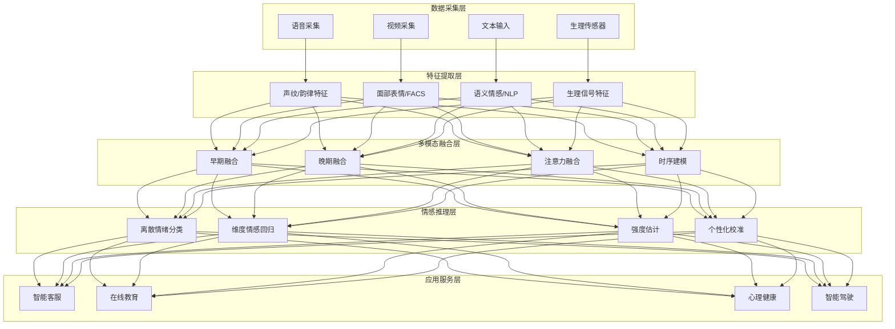
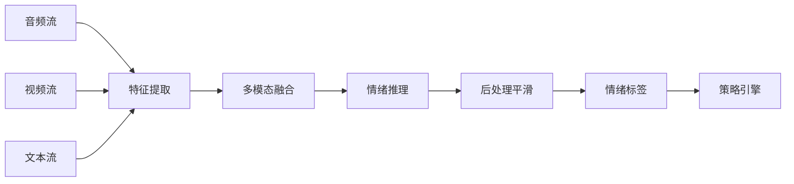
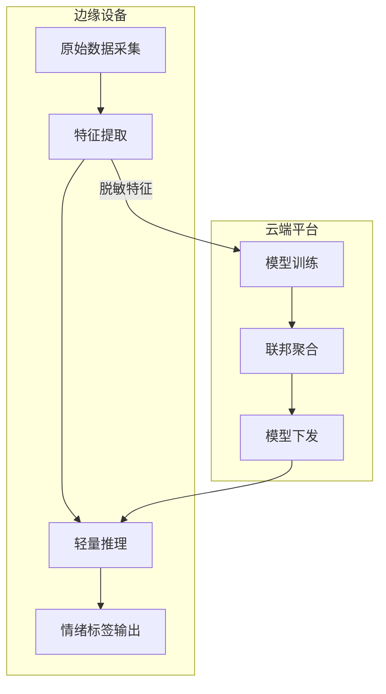

---title: 情感计算 AI 架构设计 — 阿里云视角
description: 'title: 情感计算 AI 架构设计'
summary: 'title: 情感计算 AI 架构设计'
category: general
tags:
- architecture
- best-practice
- gpu
- nvidia
- agent
tier: supporting
created: '2026-05-23'
last_updated: 2026-05
difficulty: intermediate
reading_level: intermediate
audience:
- 所有工程师
estimated_read_time: 15min
intent_queries:
- 情感计算 AI 架构设计 — 阿里云视角 是什么
- 如何 情感计算 AI 架构设计 — 阿里云视角
- Kubernetes 20 application patterns 最佳实践
trigger_keywords:
- 情感计算
- AI
- 架构设计
- 阿里云视角
- application
- patterns
prerequisites:
- kubectl-basics
- prometheus-basics
- gpu-scheduling-basics
authors:
- name: Dillan Teagle
  role: contributor

---

> **生产环境安全提示**
>
> 本文档包含可直接执行的运维命令。执行前请确认：当前目标集群与 Namespace 是否正确；是否具备足够的 RBAC 权限；是否已在非生产环境验证。命令风险等级标注：🔴 高风险（可能造成数据丢失或服务中断）、🟡 中风险（会修改集群状态，但通常可回滚）、🟢 低风险/只读（信息收集，无副作用）。


title: 情感计算 AI 架构设计
description: '# 情感计算 AI 架构设计 — 阿里云视角'
category: application-architecture
tags:
- k8s
- architecture
- industry
- gpu
- nvidia
- agent
last_updated: 2026-05-18
difficulty: advanced
reading_level: advanced
audience:
- AI架构师
- 多模态算法工程师
- 人机交互设计师
estimated_read_time: 5min
intent_queries:
- 情感计算 AI [[Kubernetes|Kubernetes]] GPU部署
- 多模态情绪识别 Kubernetes
- 智能客服 情绪分析 K8s
- 隐私保护 边缘计算 AI
- 联邦学习 情感计算 Kubernetes
trigger_keywords:
- 情感计算
- 情绪识别
- 心理评估
- 多模态
- AI
- Kubernetes
- GPU
- 隐私计算
- 联邦学习
- 阿里云
related_domains:
- domain-01-cluster-fundamentals
- domain-11-ai-infra
- domain-11-production-operations
related_topics:
- 08-ai-ml-inference-architecture
- 67-brain-computer-interface
- 57-digital-therapeutics
k8s_versions:
- '1.28'
- '1.29'
- '1.30'
- '1.31'
- '1.32'
---

# 情感计算 AI 架构设计 — 阿里云视角

> **适用版本**: Kubernetes v1.29 - v1.33 | **最后更新**: 2026-04-24
> **作者**: 阿里云解决方案架构师 | **标签**: `#情感计算` `#情绪识别` `#心理评估` `#阿里云`

---

<!-- chunk: 目录 -->## 目录

1. [概述](#1-概述)
2. [设计原则](#2-设计原则)
3. [架构模式](#3-架构模式)
4. [实现示例](#4-实现示例)
5. [在 Kubernetes 上的部署](#5-在-kubernetes-上的部署)
6. [最佳实践](#6-最佳实践)
7. [反模式](#7-反模式)
8. [参考资源](#8-参考资源)

---

<!-- chunk: 1. 概述 -->## 1. 概述

情感计算（Affective Computing）是通过计算机技术识别人类情绪、理解情感状态并做出情感响应的交叉学科。情感计算 AI 通过分析语音、面部表情、文本语义、生理信号（心率、皮肤电导、脑电）等多模态数据，推断用户的情绪状态（如喜怒哀乐、压力水平、注意力集中度等），并据此调整交互策略。

情感计算的应用场景广泛：智能客服中根据用户情绪调整话术和转人工策略；在线教育中监测学生注意力和困惑状态；医疗健康中辅助抑郁症和焦虑症筛查；智能驾驶中监测驾驶员疲劳和分心状态；市场研究中分析消费者对产品的情感反应。

从架构角度看，情感计算 AI 系统的核心挑战是**多模态融合**和**实时推理**。不同模态的数据（音频、视频、文本、生理信号）具有不同的采样率和特征空间，需要在时间维度上对齐并在语义层面融合。实时交互场景要求端到端推理延迟 < 200ms。此外，情感数据的隐私敏感性要求系统在数据采集、存储、处理的每个环节都满足隐私保护要求。

## 1.1 行业背景

| 挑战 | 说明 | 架构影响 |
|:---|:---|:---|
| 多模态融合 | 语音/表情/文本/生理信号 | 多分支网络 + 融合层 |
| 文化差异 | 不同文化情绪表达差异 | 地域化模型 + 增量学习 |
| 实时处理 | 对话中实时情绪识别 | 流式推理 + GPU 加速 |
| 隐私敏感 | 情绪数据高度个人化 | 边缘计算 + 联邦学习 |
| 场景多样 | 客服/教育/医疗/驾驶 | 场景适配 + 迁移学习 |

## 1.2 核心场景

- **智能客服**: 实时识别来电用户情绪，自动调整话术、触发安抚策略、智能转人工
- **在线教育**: 监测学生注意力、困惑、疲劳状态，自适应调整教学内容
- **心理健康**: 辅助抑郁症/焦虑症/自闭症筛查，长期情绪追踪
- **智能驾驶**: 驾驶员疲劳检测、分心监测、路怒预警
- **内容审核**: 视频情绪合规检测，识别暴力、仇恨等负面情绪内容

---

<!-- chunk: 2. 设计原则 -->## 2. 设计原则

## 2.1 多模态协同原则

单一模态的情绪识别准确率有限（语音约 70%、面部表情约 75%、文本约 65%）。多模态融合可以显著提升准确率（可达 85-90%）。架构设计需要支持灵活的模态组合——根据场景可用性选择模态子集，动态调整融合策略。

## 2.2 隐私保护原则

情感数据（面部图像、语音录音、生理信号）是高度个人化的敏感数据。系统设计必须遵循"最小采集"和"本地优先"原则：原始数据在边缘设备上处理，只上传脱敏后的情绪标签；数据采集前获得用户明确同意；支持用户随时撤销授权和删除数据。

## 2.3 实时性原则

交互式场景要求系统在用户说话或表情变化的同时给出情绪判断。端到端延迟（采集→预处理→推理→输出）需要控制在 200ms 以内。这要求优化推理流水线的每个环节：模型轻量化（知识蒸馏、量化）、推理引擎优化（TensorRT、ONNX Runtime）、计算就近部署。

## 2.4 公平性原则

情感计算模型在不同人群（年龄、性别、种族、文化背景）上的表现可能存在差异。模型训练需要确保数据集的多样性和代表性，定期进行公平性评估，避免对特定群体的系统性偏见。

---

<!-- chunk: 3. 架构模式 -->## 3. 架构模式

## 3.1 情感计算 AI 平台全景架构



## 3.2 实时推理流水线



## 3.3 隐私保护推理架构



---

<!-- chunk: 4. 实现示例 -->## 4. 实现示例

## 4.2 多模态情感推理服务

```python
import numpy as np
from dataclasses import dataclass
from typing import List, Optional

@dataclass
class EmotionResult:
    timestamp: float
    valence: float        # -1 to 1 (negative to positive)
    arousal: float        # 0 to 1 (calm to excited)
    dominance: float      # 0 to 1 (submissive to dominant)
    discrete: dict        # {emotion: probability}
    confidence: float

class MultimodalEmotionEngine:
    EMOTIONS = ['happy', 'sad', 'angry', 'fear', 'surprise',
                'disgust', 'neutral']

    def __init__(self):
        self.audio_model = None
        self.video_model = None
        self.text_model = None
        self.fusion_weights = {'audio': 0.3, 'video': 0.4, 'text': 0.3}

    def predict(self, audio_features: Optional[dict] = None,
                video_features: Optional[dict] = None,
                text_features: Optional[dict] = None) -> EmotionResult:
        predictions = {}
        active_weights = {}

        if audio_features:
            predictions['audio'] = self._predict_audio(audio_features)
            active_weights['audio'] = self.fusion_weights['audio']
        if video_features:
            predictions['video'] = self._predict_video(video_features)
            active_weights['video'] = self.fusion_weights['video']
        if text_features:
            predictions['text'] = self._predict_text(text_features)
            active_weights['text'] = self.fusion_weights['text']

        if not predictions:
            return EmotionResult(0, 0, 0, {}, 0, 0.0)

        total_w = sum(active_weights.values())
        fused = {}
        for emotion in self.EMOTIONS:
            fused[emotion] = sum(
                predictions[modality].get(emotion, 0) * active_weights[modality]
                for modality in predictions
            ) / total_w

        dominant = max(fused, key=fused.get)
        valence = fused.get('happy', 0) - fused.get('sad', 0) - \
                  fused.get('angry', 0) * 0.5
        arousal = fused.get('angry', 0) + fused.get('surprise', 0) + \
                  fused.get('fear', 0)
        confidence = max(fused.values())

        return EmotionResult(
            timestamp=0,
            valence=np.clip(valence, -1, 1),
            arousal=np.clip(arousal, 0, 1),
            dominance=0.5,
            discrete=fused,
            confidence=confidence,
        )

    def _predict_audio(self, features: dict) -> dict:
        return {e: 1.0/len(self.EMOTIONS) for e in self.EMOTIONS}

    def _predict_video(self, features: dict) -> dict:
        return {e: 1.0/len(self.EMOTIONS) for e in self.EMOTIONS}

    def _predict_text(self, features: dict) -> dict:
        return {e: 1.0/len(self.EMOTIONS) for e in self.EMOTIONS}
```

## 4.3 客服情绪策略引擎

```go
package affective

import (
    "fmt"
    "sync"
)

type EmotionState string

const (
    EmotionPositive  EmotionState = "positive"
    EmotionNeutral   EmotionState = "neutral"
    EmotionFrustrated EmotionState = "frustrated"
    EmotionAngry     EmotionState = "angry"
)

type Strategy struct {
    Name        string
    Actions     []string
    EscalateTo  string
    Priority    int
}

type CustomerEmotionTracker struct {
    mu          sync.Mutex
    sessionID   string
    history     []EmotionResult
    currentState EmotionState
    consecutiveNegative int
}

type EmotionResult struct {
    Timestamp   float64
    Emotion     string
    Confidence  float64
    Valence     float64
}

func NewTracker(sessionID string) *CustomerEmotionTracker {
    return &CustomerEmotionTracker{
        sessionID: sessionID,
        history:   make([]EmotionResult, 0),
    }
}

func (t *CustomerEmotionTracker) Update(result EmotionResult) Strategy {
    t.mu.Lock()
    defer t.mu.Unlock()

    t.history = append(t.history, result)
    if len(t.history) > 100 {
        t.history = t.history[len(t.history)-100:]
    }

    state := t._classify(result)
    t.currentState = state

    if state == EmotionFrustrated || state == EmotionAngry {
        t.consecutiveNegative++
    } else {
        t.consecutiveNegative = 0
    }

    return t._selectStrategy(state)
}

func (t *CustomerEmotionTracker) _classify(r EmotionResult) EmotionState {
    if r.Valence < -0.5 && r.Confidence > 0.7 {
        return EmotionAngry
    }
    if r.Valence < -0.2 && r.Confidence > 0.6 {
        return EmotionFrustrated
    }
    if r.Valence > 0.3 {
        return EmotionPositive
    }
    return EmotionNeutral
}

func (t *CustomerEmotionTracker) _selectStrategy(state EmotionState) Strategy {
    switch state {
    case EmotionAngry:
        if t.consecutiveNegative >= 3 {
            return Strategy{
                Name: "escalate_to_human",
                Actions: []string{"apologize", "transfer_to_senior_agent"},
                EscalateTo: "senior_agent",
                Priority: 1,
            }
        }
        return Strategy{
            Name: "calm_and_assist",
            Actions: []string{"acknowledge_frustration", "offer_immediate_help"},
            Priority: 2,
        }
    case EmotionFrustrated:
        return Strategy{
            Name: "empathetic_help",
            Actions: []string{"show_empathy", "simplify_process"},
            Priority: 3,
        }
    default:
        return Strategy{
            Name: "standard_service",
            Actions: []string{"proceed_normally"},
            Priority: 5,
        }
    }
}
```

---

<!-- chunk: 5. 在 Kubernetes 上的部署 -->## 5. 在 Kubernetes 上的部署

```yaml
apiVersion: apps/v1
kind: Deployment
metadata:
  name: emotion-inference
  namespace: affective-computing
spec:
  replicas: 3
  selector:
    matchLabels:
      app: emotion-inference
  template:
    metadata:
      labels:
        app: emotion-inference
    spec:
      nodeSelector:
        accelerator: nvidia-t4
      runtimeClassName: nvidia
      containers:
        - name: inference
          image: registry.cn-hangzhou.aliyuncs.com/affective/emotion-inference:v2.0.0-gpu
          ports:
            - containerPort: 8080
          env:
            - name: MODALITIES
              value: "face,voice,text"
            - name: FUSION_METHOD
              value: "attention"
            - name: MODEL_PATH
              value: "/models/emotion-v3"
          resources:
            requests:
              nvidia.com/gpu: 1
              memory: "8Gi"
              cpu: "4000m"
            limits:
              nvidia.com/gpu: 1
              memory: "16Gi"
              cpu: "8000m"
```

---

<!-- chunk: 6. 最佳实践 -->## 6. 最佳实践

- **模型轻量化**: 使用知识蒸馏将大型多模态模型压缩为可在边缘部署的轻量模型
- **流式推理**: 音频和视频采用流式处理，避免等待完整片段
- **时序平滑**: 对连续帧的情绪结果进行滑动平均，避免结果跳变
- **数据增强**: 使用数据增强（语音变速、面部遮挡、文本同义替换）提升模型鲁棒性
- **公平性审计**: 定期评估模型在不同人群上的表现差异

<!-- chunk: 7. 反模式 -->## 7. 反模式

## 7.1 单模态决策

仅依赖单一模态（如面部表情）做情绪判断，忽视其他可用信息。

**解决方案**: 采用多模态融合策略。当某些模态不可用时，动态调整融合权重，利用可用模态给出最优估计。

## 7.2 忽视文化差异

使用西方数据训练的模型直接应用于东方文化场景，面部表情和语音表达的文化差异导致误判。

**解决方案**: 收集目标文化的标注数据，进行领域适配。在推理时加入文化上下文因子。

## 7.3 情绪数据明文存储

将用户的原始面部图像、语音录音以明文形式存储在云端。

**解决方案**: 原始数据在边缘设备处理后立即删除。只上传脱敏后的情绪标签。确需存储的数据使用 AES-256 加密。

## 7.4 用于歧视性决策

将情绪识别结果用于招聘筛选、信用评估等歧视性场景。

**解决方案**: 明确限制情感计算的应用范围，建立伦理审查机制。不将情绪数据用于任何可能对用户造成不利的自动化决策。

---

<!-- chunk: 8. 参考资源 -->## 8. 参考资源

## 8.1 阿里云组件映射

| 功能域 | **阿里云云原生方案** |
|:---|:---|
| 容器平台 | **ACK Pro + GPU** |
| AI 平台 | **PAI + 视觉智能 + 语音智能** |
| 数据库 | **PolarDB** |
| 对象存储 | **OSS（加密）** |
| 可观测性 | **ARMS + SLS** |

## 8.2 生产检查清单

- [ ] 多模态识别准确率 > 85%（F1-[[Score|Score]]）
- [ ] 端到端推理延迟 P99 < 200ms
- [ ] 情绪数据端到端加密
- [ ] 伦理审查委员会审批通过
- [ ] 跨人群公平性测试
- [ ] 用户知情同意机制

---

**维护者**: 阿里云解决方案架构师团队 | **许可证**: MIT

---

<!-- chunk: Obsidian 相关文档 -->## Obsidian 相关文档

- topic-application-architecture KUDIG Database — Global MOC
- [[domain-20-application-patterns/topic-application-architecture/README.md|Topic 应用层架构设计最佳实践]]
- [[domain-20-application-patterns/topic-application-architecture/01-ecommerce-architecture.md|电商系统 Kubernetes 生产架构设计]]
- [[domain-20-application-patterns/topic-application-architecture/02-mini-program-architecture.md|小程序平台架构设计]]
- [[domain-20-application-patterns/topic-application-architecture/03-cms-architecture.md|内容管理系统 CMS 架构设计]]
- [[domain-20-application-patterns/topic-application-architecture/04-im-rtc-architecture.md|实时通信 IM/RTC 架构设计]]
- [[domain-20-application-patterns/topic-application-architecture/05-online-education-architecture.md|在线教育平台 Kubernetes 生产架构设计]]
- [[domain-20-application-patterns/topic-application-architecture/06-fintech-architecture.md|金融科技FinTech Kubernetes生产架构设计]]
- [[domain-20-application-patterns/topic-application-architecture/07-iot-platform-architecture.md|物联网 IoT 平台架构设计]]
- [[domain-20-application-patterns/topic-application-architecture/08-ai-ml-inference-architecture.md|AI/ML 推理服务 Kubernetes 生产架构设计]]
- [[domain-20-application-patterns/topic-application-architecture/09-gaming-backend-architecture.md|游戏后端 Kubernetes 生产架构设计]]
- [[domain-20-application-patterns/topic-application-architecture/10-social-media-architecture.md|社交媒体平台Kubernetes生产架构设计]]

## See Also

- 73-smart-firefighting
- 74-immersive-xr
- 76-synthetic-biology
- 77-fusion-energy-monitoring

## Related

- topic-application-architecture MOC — Cross-reference


<!-- risk-assessed -->
