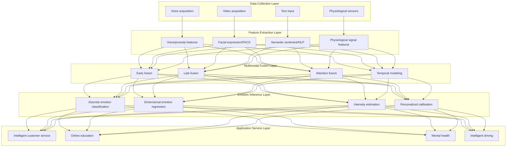
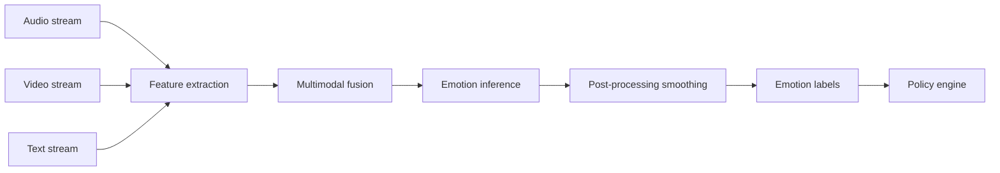
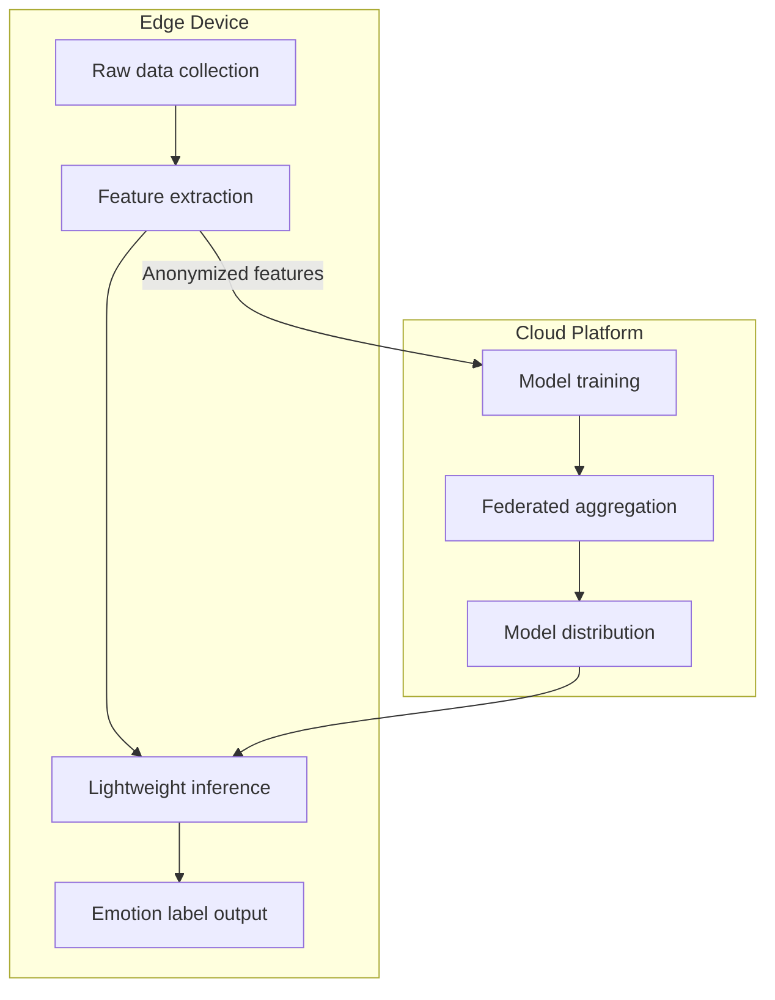

> **Production Environment Security Notice**
>
> This document contains directly executable operation and maintenance commands. Before execution, please confirm: whether the current target cluster and Namespace are correct; whether you have sufficient RBAC permissions; whether you have verified in a non-production environment. Command risk levels are marked: Red (high risk, may cause data loss or service interruption), Yellow (medium risk, modifies cluster state but usually reversible), Green (low risk/read-only, information collection with no side effects).

title: Affective Computing AI Architecture Design
description: '# Affective Computing AI Architecture Design — Alibaba Cloud Perspective'
category: application-architecture
tags:
- k8s
- architecture
- industry
- gpu
- nvidia
- agent
last_updated: 2026-05-18
difficulty: advanced
reading_level: advanced
audience:
- AI architects
- Multimodal algorithm engineers
- Human-computer interaction designers
estimated_read_time: 5min
intent_queries:
- Affective Computing AI Kubernetes GPU deployment
- Multimodal emotion recognition Kubernetes
- Intelligent customer service emotion analysis K8s
- Privacy-preserving edge computing AI
- Federated learning affective computing Kubernetes
trigger_keywords:
- Affective computing
- Emotion recognition
- Psychological assessment
- Multimodal
- AI
- Kubernetes
- GPU
- Privacy computing
- Federated learning
- Alibaba Cloud
related_domains:
- domain-01-cluster-fundamentals
- domain-11-ai-infra
- domain-11-production-operations
related_topics:
- 08-ai-ml-inference-architecture
- 67-brain-computer-interface
- 57-digital-therapeutics
k8s_versions:
- '1.28'
- '1.29'
- '1.30'
- '1.31'
- '1.32'
---

# Affective Computing AI Architecture Design — Alibaba Cloud Perspective

> **Applicable Versions**: Kubernetes v1.29 - v1.33 | **Last Updated**: 2026-04-24
> **Author**: Alibaba Cloud Solution Architects | **Tags**: `#AffectiveComputing` `#EmotionRecognition` `#PsychologicalAssessment` `#AlibabCloud`

---

<!-- chunk: table-of-contents -->## Table of Contents

1. [Overview](#1-overview)
2. [Design Principles](#2-design-principles)
3. [Architecture Patterns](#3-architecture-patterns)
4. [Implementation Examples](#4-implementation-examples)
5. [Kubernetes Deployment](#5-kubernetes-deployment)
6. [Best Practices](#6-best-practices)
7. [Anti-Patterns](#7-anti-patterns)
8. [Reference Resources](#8-reference-resources)

---

<!-- chunk: 1-overview -->## 1. Overview

Affective Computing is an interdisciplinary field that uses computer technology to recognize human emotions, understand emotional states, and provide emotional responses. Affective Computing AI analyzes multimodal data including voice, facial expressions, text semantics, and physiological signals (heart rate, skin conductance, EEG) to infer user emotional states (such as happiness, anger, sadness, stress levels, attention levels, etc.), and adjusts interaction strategies accordingly.

Affective Computing has broad application scenarios: intelligent customer service can adjust dialogue strategies and transfer-to-human policies based on user emotions; online education can monitor student attention and confusion states; medical health can assist in depression and anxiety screening; intelligent driving can detect driver fatigue and distraction; market research can analyze consumer emotional responses to products.

From an architecture perspective, the core challenges of Affective Computing AI systems are **multimodal fusion** and **real-time inference**. Different modalities of data (audio, video, text, physiological signals) have different sampling rates and feature spaces, requiring temporal alignment and semantic-level fusion. Real-time interactive scenarios require end-to-end inference latency < 200ms. Additionally, the privacy sensitivity of emotional data requires the system to satisfy privacy protection requirements at every stage of data collection, storage, and processing.

## 1.1 Industry Background

| Challenge | Description | Architecture Impact |
|:---|:---|:---|
| Multimodal fusion | Voice/expression/text/physiological signals | Multi-branch network + fusion layer |
| Cultural differences | Emotion expression varies across cultures | Localized models + incremental learning |
| Real-time processing | Real-time emotion recognition in conversation | Streaming inference + GPU acceleration |
| Privacy sensitivity | Emotion data highly personalized | Edge computing + federated learning |
| Scenario diversity | Customer service/education/medical/driving | Scenario adaptation + transfer learning |

## 1.2 Core Scenarios

- **Intelligent Customer Service**: Real-time identification of caller emotions, automatic adjustment of dialogue, emotion-soothing strategy triggering, intelligent human transfer
- **Online Education**: Monitoring student attention, confusion, fatigue states; adaptive content adjustment
- **Mental Health**: Assisting depression/anxiety/autism screening; long-term emotion tracking
- **Intelligent Driving**: Driver fatigue detection, distraction monitoring, road rage warning
- **Content Moderation**: Video emotion compliance detection, identifying violent and hateful emotional content

---

<!-- chunk: 2-design-principles -->## 2. Design Principles

## 2.1 Multimodal Collaboration Principle

Single-modality emotion recognition accuracy is limited (voice ~70%, facial expression ~75%, text ~65%). Multimodal fusion can significantly improve accuracy (up to 85-90%). Architecture design must support flexible modality combinations—selecting modality subsets based on scenario availability and dynamically adjusting fusion strategies.

## 2.2 Privacy Protection Principle

Emotional data (facial images, voice recordings, physiological signals) is highly personalized sensitive data. System design must follow "minimal collection" and "local-first" principles: process raw data on edge devices, upload only anonymized emotion labels; obtain explicit user consent before data collection; support users to revoke authorization and delete data anytime.

## 2.3 Real-Time Principle

Interactive scenarios require the system to provide emotion judgments while users speak or change expressions. End-to-end latency (collection → preprocessing → inference → output) must be controlled within 200ms. This requires optimizing every step of the inference pipeline: model lightweight (knowledge distillation, quantization), inference engine optimization (TensorRT, ONNX Runtime), computing deployment near the edge.

## 2.4 Fairness Principle

Affective Computing models may perform differently across different populations (age, gender, race, cultural background). Model training must ensure dataset diversity and representativeness, conduct regular fairness evaluations, and avoid systematic bias against specific groups.

---

<!-- chunk: 3-architecture-patterns -->## 3. Architecture Patterns

## 3.1 Affective Computing AI Platform Full-Landscape Architecture



## 3.2 Real-Time Inference Pipeline



## 3.3 Privacy-Preserving Inference Architecture



---

<!-- chunk: 4-implementation-examples -->## 4. Implementation Examples

## 4.2 Multimodal Emotion Inference Service

```python
import numpy as np
from dataclasses import dataclass
from typing import List, Optional

@dataclass
class EmotionResult:
    timestamp: float
    valence: float        # -1 to 1 (negative to positive)
    arousal: float        # 0 to 1 (calm to excited)
    dominance: float      # 0 to 1 (submissive to dominant)
    discrete: dict        # {emotion: probability}
    confidence: float

class MultimodalEmotionEngine:
    EMOTIONS = ['happy', 'sad', 'angry', 'fear', 'surprise',
                'disgust', 'neutral']

    def __init__(self):
        self.audio_model = None
        self.video_model = None
        self.text_model = None
        self.fusion_weights = {'audio': 0.3, 'video': 0.4, 'text': 0.3}

    def predict(self, audio_features: Optional[dict] = None,
                video_features: Optional[dict] = None,
                text_features: Optional[dict] = None) -> EmotionResult:
        predictions = {}
        active_weights = {}

        if audio_features:
            predictions['audio'] = self._predict_audio(audio_features)
            active_weights['audio'] = self.fusion_weights['audio']
        if video_features:
            predictions['video'] = self._predict_video(video_features)
            active_weights['video'] = self.fusion_weights['video']
        if text_features:
            predictions['text'] = self._predict_text(text_features)
            active_weights['text'] = self.fusion_weights['text']

        if not predictions:
            return EmotionResult(0, 0, 0, {}, 0, 0.0)

        total_w = sum(active_weights.values())
        fused = {}
        for emotion in self.EMOTIONS:
            fused[emotion] = sum(
                predictions[modality].get(emotion, 0) * active_weights[modality]
                for modality in predictions
            ) / total_w

        dominant = max(fused, key=fused.get)
        valence = fused.get('happy', 0) - fused.get('sad', 0) - \
                  fused.get('angry', 0) * 0.5
        arousal = fused.get('angry', 0) + fused.get('surprise', 0) + \
                  fused.get('fear', 0)
        confidence = max(fused.values())

        return EmotionResult(
            timestamp=0,
            valence=np.clip(valence, -1, 1),
            arousal=np.clip(arousal, 0, 1),
            dominance=0.5,
            discrete=fused,
            confidence=confidence,
        )

    def _predict_audio(self, features: dict) -> dict:
        return {e: 1.0/len(self.EMOTIONS) for e in self.EMOTIONS}

    def _predict_video(self, features: dict) -> dict:
        return {e: 1.0/len(self.EMOTIONS) for e in self.EMOTIONS}

    def _predict_text(self, features: dict) -> dict:
        return {e: 1.0/len(self.EMOTIONS) for e in self.EMOTIONS}
```

## 4.3 Customer Service Emotion Strategy Engine

```go
package affective

import (
    "fmt"
    "sync"
)

type EmotionState string

const (
    EmotionPositive  EmotionState = "positive"
    EmotionNeutral   EmotionState = "neutral"
    EmotionFrustrated EmotionState = "frustrated"
    EmotionAngry     EmotionState = "angry"
)

type Strategy struct {
    Name        string
    Actions     []string
    EscalateTo  string
    Priority    int
}

type CustomerEmotionTracker struct {
    mu          sync.Mutex
    sessionID   string
    history     []EmotionResult
    currentState EmotionState
    consecutiveNegative int
}

type EmotionResult struct {
    Timestamp   float64
    Emotion     string
    Confidence  float64
    Valence     float64
}

func NewTracker(sessionID string) *CustomerEmotionTracker {
    return &CustomerEmotionTracker{
        sessionID: sessionID,
        history:   make([]EmotionResult, 0),
    }
}

func (t *CustomerEmotionTracker) Update(result EmotionResult) Strategy {
    t.mu.Lock()
    defer t.mu.Unlock()

    t.history = append(t.history, result)
    if len(t.history) > 100 {
        t.history = t.history[len(t.history)-100:]
    }

    state := t._classify(result)
    t.currentState = state

    if state == EmotionFrustrated || state == EmotionAngry {
        t.consecutiveNegative++
    } else {
        t.consecutiveNegative = 0
    }

    return t._selectStrategy(state)
}

func (t *CustomerEmotionTracker) _classify(r EmotionResult) EmotionState {
    if r.Valence < -0.5 && r.Confidence > 0.7 {
        return EmotionAngry
    }
    if r.Valence < -0.2 && r.Confidence > 0.6 {
        return EmotionFrustrated
    }
    if r.Valence > 0.3 {
        return EmotionPositive
    }
    return EmotionNeutral
}

func (t *CustomerEmotionTracker) _selectStrategy(state EmotionState) Strategy {
    switch state {
    case EmotionAngry:
        if t.consecutiveNegative >= 3 {
            return Strategy{
                Name: "escalate_to_human",
                Actions: []string{"apologize", "transfer_to_senior_agent"},
                EscalateTo: "senior_agent",
                Priority: 1,
            }
        }
        return Strategy{
            Name: "calm_and_assist",
            Actions: []string{"acknowledge_frustration", "offer_immediate_help"},
            Priority: 2,
        }
    case EmotionFrustrated:
        return Strategy{
            Name: "empathetic_help",
            Actions: []string{"show_empathy", "simplify_process"},
            Priority: 3,
        }
    default:
        return Strategy{
            Name: "standard_service",
            Actions: []string{"proceed_normally"},
            Priority: 5,
        }
    }
}
```

---

<!-- chunk: 5-kubernetes-deployment -->## 5. Kubernetes Deployment

```yaml
apiVersion: apps/v1
kind: Deployment
metadata:
  name: emotion-inference
  namespace: affective-computing
spec:
  replicas: 3
  selector:
    matchLabels:
      app: emotion-inference
  template:
    metadata:
      labels:
        app: emotion-inference
    spec:
      nodeSelector:
        accelerator: nvidia-t4
      runtimeClassName: nvidia
      containers:
        - name: inference
          image: registry.cn-hangzhou.aliyuncs.com/affective/emotion-inference:v2.0.0-gpu
          ports:
            - containerPort: 8080
          env:
            - name: MODALITIES
              value: "face,voice,text"
            - name: FUSION_METHOD
              value: "attention"
            - name: MODEL_PATH
              value: "/models/emotion-v3"
          resources:
            requests:
              nvidia.com/gpu: 1
              memory: "8Gi"
              cpu: "4000m"
            limits:
              nvidia.com/gpu: 1
              memory: "16Gi"
              cpu: "8000m"
```

---

<!-- chunk: 6-best-practices -->## 6. Best Practices

- **Model Lightweight**: Use knowledge distillation to compress large multimodal models into lightweight models deployable at edge
- **Streaming Inference**: Adopt streaming processing for audio and video, avoiding waiting for complete segments
- **Temporal Smoothing**: Apply sliding average to emotion results of continuous frames, avoiding result jitter
- **Data Augmentation**: Use data augmentation (voice speed variation, face occlusion, text synonym replacement) to improve model robustness
- **Fairness Audit**: Regularly evaluate performance differences across different populations

<!-- chunk: 7-anti-patterns -->## 7. Anti-Patterns

## 7.1 Single-Modality Decision

Relying solely on a single modality (such as facial expression) for emotion judgment, ignoring other available information.

**Solution**: Adopt multimodal fusion strategy. Dynamically adjust fusion weights when certain modalities are unavailable, using available modalities for optimal estimation.

## 7.2 Ignoring Cultural Differences

Directly applying models trained on Western data to Eastern cultural scenarios, where cultural differences in facial expressions and voice result in misclassification.

**Solution**: Collect annotated data for target culture and perform domain adaptation. Incorporate cultural context factors during inference.

## 7.3 Plaintext Emotion Data Storage

Storing users' raw facial images and voice recordings in plaintext on cloud servers.

**Solution**: Process raw data on edge devices and delete immediately. Only upload anonymized emotion labels. Encrypt any data requiring storage with AES-256.

## 7.4 Use for Discriminatory Decision-Making

Using emotion recognition results for hiring screening, credit assessment and other discriminatory scenarios.

**Solution**: Clearly limit application scope of affective computing and establish ethics review mechanisms. Do not use emotion data for any automated decision-making that may harm users.

---

<!-- chunk: 8-reference-resources -->## 8. Reference Resources

## 8.1 Alibaba Cloud Component Mapping

| Functional Domain | **Alibaba Cloud Cloud-Native Solution** |
|:---|:---|
| Container Platform | **ACK Pro + GPU** |
| AI Platform | **PAI + Vision Intelligence + Speech Intelligence** |
| Database | **PolarDB** |
| Object Storage | **OSS (Encrypted)** |
| Observability | **ARMS + SLS** |

## 8.2 Production Checklist

- [ ] Multimodal recognition accuracy > 85% (F1-Score)
- [ ] End-to-end inference latency P99 < 200ms
- [ ] Emotion data end-to-end encrypted
- [ ] Ethics review committee approval obtained
- [ ] Cross-population fairness testing passed
- [ ] User informed consent mechanism established

---

**Maintainers**: Alibaba Cloud Solution Architects Team | **License**: MIT

---

<!-- chunk: obsidian-references -->## Obsidian Related Documentation

- topic-application-architecture KUDIG Database — Global MOC
- [[domain-20-application-patterns/topic-application-architecture/README.md|Topic Application Layer Architecture Design Best Practices]]
- [[domain-20-application-patterns/topic-application-architecture/01-ecommerce-architecture.md|E-commerce Systems Kubernetes Production Architecture Design]]
- [[domain-20-application-patterns/topic-application-architecture/02-mini-program-architecture.md|Mini Program Platform Architecture Design]]
- [[domain-20-application-patterns/topic-application-architecture/03-cms-architecture.md|Content Management System CMS Architecture Design]]
- [[domain-20-application-patterns/topic-application-architecture/04-im-rtc-architecture.md|Real-time Communication IM/RTC Architecture Design]]
- [[domain-20-application-patterns/topic-application-architecture/05-online-education-architecture.md|Online Education Platform Kubernetes Production Architecture Design]]
- [[domain-20-application-patterns/topic-application-architecture/06-fintech-architecture.md|Financial Technology FinTech Kubernetes Production Architecture Design]]
- [[domain-20-application-patterns/topic-application-architecture/07-iot-platform-architecture.md|Internet of Things IoT Platform Architecture Design]]
- [[domain-20-application-patterns/topic-application-architecture/08-ai-ml-inference-architecture.md|AI/ML Inference Service Kubernetes Production Architecture Design]]
- [[domain-20-application-patterns/topic-application-architecture/09-gaming-backend-architecture.md|Gaming Backend Kubernetes Production Architecture Design]]
- [[domain-20-application-patterns/topic-application-architecture/10-social-media-architecture.md|Social Media Platform Kubernetes Production Architecture Design]]

## See Also

- 73-smart-firefighting
- 74-immersive-xr
- 76-synthetic-biology
- 77-fusion-energy-monitoring

## Related

- topic-application-architecture MOC — Cross-reference


<!-- risk-assessed -->
