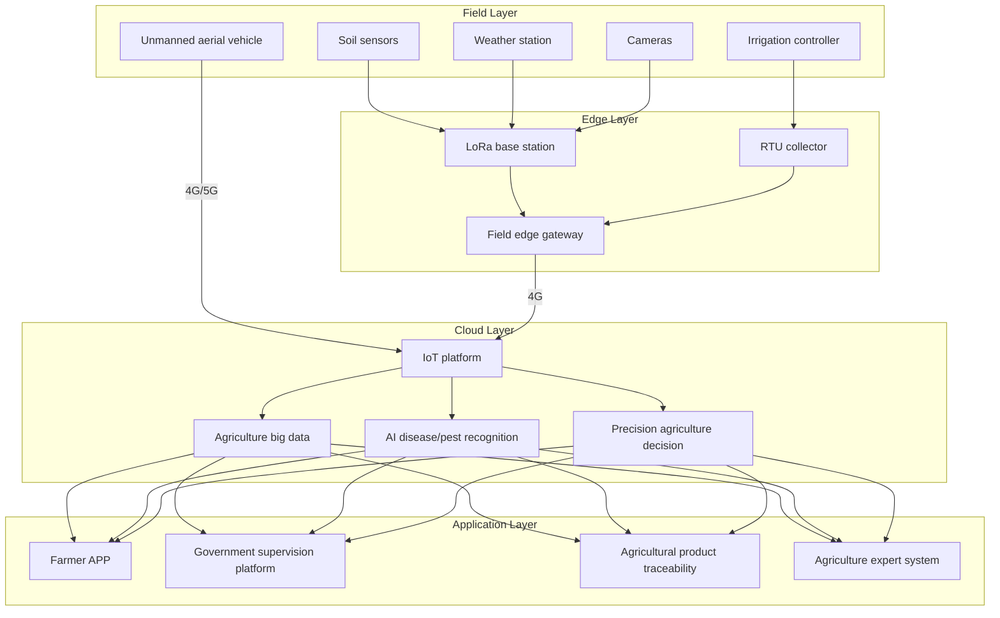
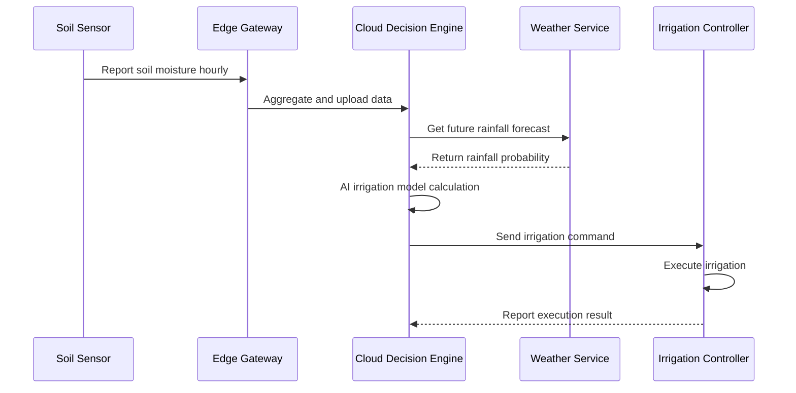
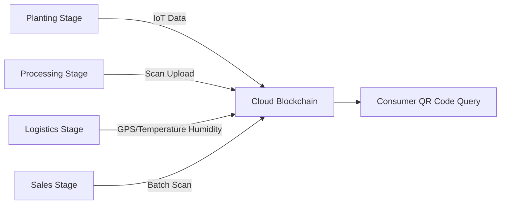

---title: Agricultural IoT Architecture Design — Alibaba Cloud Perspective
description: 'Agricultural IoT Architecture Design'
summary: 'Agricultural IoT Architecture Design'
category: general
tags:
- architecture
- best-practice
- mysql
- daemonset
- gateway
- operator
- agent
tier: supporting
created: '2026-05-23'
last_updated: 2026-05
difficulty: intermediate
reading_level: intermediate
audience:
- All engineers
estimated_read_time: 5min
intent_queries:
- What is agricultural IoT architecture design — Alibaba Cloud perspective
- How to design agricultural IoT architecture — Alibaba Cloud perspective
- Kubernetes 20 application patterns best practices
trigger_keywords:
- Agricultural IoT architecture design
- Alibaba Cloud perspective
- application
- patterns
prerequisites:
- kubectl-basics
- prometheus-basics
- mysql-basics
original_language: Chinese
authors:
- name: Dillan Teagle
  role: contributor
source_path: /Users/teaglebuilt/github/teaglebuilt/knowledge/tree/application/architecture/agritech-iot.md
---

> **Production Environment Security Notice**
>
> This document contains directly executable operation and maintenance commands. Before execution, please confirm: whether the current target cluster and Namespace are correct; whether you have sufficient RBAC permissions; whether you have verified in a non-production environment. Command risk levels are marked: Red (high risk - may cause data loss or service interruption), Yellow (medium risk - modifies cluster state but usually reversible), Green (low risk/read-only - information collection with no side effects).

title: Agricultural IoT Architecture Design
description: '# Agricultural IoT Architecture Design — Alibaba Cloud Perspective'
category: application-architecture
tags:
- k8s
- architecture
- industry
- mysql
- [[DaemonSet|daemonset]]
- gateway
- operator
- agent
last_updated: '2026-05-18'
difficulty: advanced
reading_level: advanced
audience:
- Agricultural technology architects
- IoT platform engineers
- Precision agriculture developers
- Alibaba Cloud solution architects
estimated_read_time: 5min
intent_queries:
- Agricultural IoT system architecture design
- Smart agriculture edge gateway K8s
- Precision irrigation AI decision
- Agricultural product traceability blockchain
- Unmanned agricultural pest control system
trigger_keywords:
- Agricultural IoT
- Smart agriculture
- Precision agriculture
- LoRa
- Edge gateway
- Precision irrigation
- Traceability
- [[KubeEdge|KubeEdge]]
- Unmanned agricultural pest control
- Agriculture big data
related_domains:
- domain-01-cluster-fundamentals
- domain-5-iot-edge-computing
- domain-9-ai-ml
- domain-7-observability
related_topics:
- domain-20-application-patterns/topic-application-architecture/47-smart-mining
- domain-20-application-patterns/topic-application-architecture/12-smart-logistics-architecture
- domain-02-workloads-applications/topic-functions/05-iot-edge-computing
- domain-02-workloads-applications/topic-functions/09-data-security-privacy
k8s_versions:
- '1.28'
- '1.29'
- '1.30'
- '1.31'
- '1.32'
---

# Agricultural IoT Architecture Design — Alibaba Cloud Perspective

> **Applicable Versions**: Kubernetes v1.29 - v1.33 | **Last Updated**: 2026-04-24
> **Authors**: Alibaba Cloud Solution Architects | **Tags**: `#AgriculturalIoT` `#SmartAgriculture` `#PrecisionAgriculture` `#AlibabCloud`

---

## Table of Contents

1. [Industry Background](#1-industry-background)
2. [Business Architecture](#2-business-architecture)
3. [Technical Architecture](#3-technical-architecture)
4. [Core Data Flow](#4-core-data-flow)
5. [Security and Compliance](#5-security-and-compliance)
6. [Observability](#6-observability)
7. [Alibaba Cloud Component Mapping](#7-alibaba-cloud-component-mapping)
8. [Production Checklist](#8-production-checklist)

---

## 1. Industry Background

### 1.1 Business Characteristics

Agricultural IoT faces challenges of complex environments, poor network coverage, and dispersed devices:

| Challenge | Description | Architecture Impact |
|:---|:---|:---|
| Harsh Environment | High temperature/humidity in fields | Industrial-grade devices + edge gateways |
| Network Coverage | Weak 4G in remote areas | Satellite communication + LoRa |
| Device Dispersal | Devices distributed across thousands of acres | Zone-based management + edge autonomy |
| Low-Frequency Data | Soil data changes hourly | Low-power collection + batch upload |
| Seasonal Peaks | Data explosion during planting/harvesting | Elastic scaling |

### 1.2 Core Scenarios

- **Environmental Monitoring**: Soil moisture, weather, disease/pest monitoring
- **Precision Irrigation**: AI-based intelligent water-nutrient integration
- **Unmanned Aerial Spraying**: Flight planning, spray calculation
- **Agricultural Product Traceability**: Farm-to-table full-chain tracking
- **Smart Greenhouse**: Automated temperature/humidity/light/CO2 control

---

## 2. Business Architecture

### 2.1 Smart Agriculture Full-Landscape Architecture



### 2.2 Precision Irrigation Decision Flow



---

## 3. Technical Architecture

### 3.1 K8s Deployment

```yaml
# Agricultural IoT data processing Deployment
apiVersion: apps/v1
kind: Deployment
metadata:
  name: agri-iot-processor
  namespace: agritech
spec:
  replicas: 3
  selector:
    matchLabels:
      app: agri-iot-processor
  template:
    metadata:
      labels:
        app: agri-iot-processor
    spec:
      containers:
        - name: processor
          image: registry.cn-hangzhou.aliyuncs.com/agri/iot-processor:v1.5.0
          ports:
            - containerPort: 8080
          env:
            - name: MQTT_BROKER
              value: "mqtt://iot-platform:1883"
            - name: RULE_ENGINE_URL
              value: "http://rule-engine:8080"
          resources:
            requests:
              memory: "1Gi"
              cpu: "500m"
            limits:
              memory: "2Gi"
              cpu: "1000m"
```

```yaml
# Edge node KubeEdge configuration
apiVersion: apps/v1
kind: DaemonSet
metadata:
  name: edge-gateway-agent
  namespace: agritech
spec:
  selector:
    matchLabels:
      app: edge-gateway-agent
  template:
    metadata:
      labels:
        app: edge-gateway-agent
    spec:
      hostNetwork: true
      nodeSelector:
        node-type: edge-gateway
      tolerations:
        - key: "dedicated"
          operator: "Equal"
          value: "edge"
          effect: "NoSchedule"
      containers:
        - name: edge-agent
          image: registry.cn-hangzhou.aliyuncs.com/agri/edge-agent:v1.0.0
          resources:
            requests:
              memory: "256Mi"
              cpu: "250m"
```

---

## 4. Core Data Flow

### 4.1 Agricultural Product Traceability Data Flow



---

## 5. Security and Compliance

- **Agricultural Product Safety**: Pesticide residue data compliance
- **Data Security**: Farmer privacy protection
- **Food Safety Law**: Traceability data immutable

---

## 6. Observability

- **Sensor Online Rate**: > 95%
- **Data Report Latency**: < 5min
- **Irrigation Water Saving Rate**: > 20%

---

## 7. Alibaba Cloud Component Mapping

| Functional Domain | **Alibaba Cloud Cloud-Native Solution** |
|:---|:---|
| Container Platform | **ACK + ACK Edge** |
| IoT Platform | **Alibaba Cloud IoT Platform** |
| Database | **PolarDB MySQL + Lindorm** |
| Object Storage | **OSS** |
| Real-Time Computing | **Flink** |
| AI | **PAI / Visual Intelligence** |
| Blockchain | **Ant Chain BaaS** |
| Observability | **ARMS + SLS** |

---

## 8. Production Checklist

- [ ] Field network coverage testing
- [ ] Sensor data calibration verification
- [ ] Edge gateway offline autonomy testing
- [ ] Irrigation control safety verification
- [ ] Traceability data on-chain completeness

---

**Maintainers**: Alibaba Cloud Solution Architects Team | **License**: MIT

---

## Obsidian Related Documents

- topic-application-architecture MOC
- [[domain-20-application-patterns/topic-application-architecture/README.md|Topic Application Layer Architecture Design Best Practices]]
- [[domain-20-application-patterns/topic-application-architecture/01-ecommerce-architecture.md|E-commerce System Kubernetes Production Architecture Design]]
- [[domain-20-application-patterns/topic-application-architecture/02-mini-program-architecture.md|Mini Program Platform Architecture Design]]
- [[domain-20-application-patterns/topic-application-architecture/03-cms-architecture.md|Content Management System CMS Architecture Design]]
- [[domain-20-application-patterns/topic-application-architecture/04-im-rtc-architecture.md|Real-Time Communication IM/RTC Architecture Design]]
- [[domain-20-application-patterns/topic-application-architecture/05-online-education-architecture.md|Online Education Platform Kubernetes Production Architecture Design]]
- [[domain-20-application-patterns/topic-application-architecture/06-fintech-architecture.md|FinTech Kubernetes Production Architecture Design]]
- [[domain-20-application-patterns/topic-application-architecture/07-iot-platform-architecture.md|IoT Platform Architecture Design]]
- [[domain-20-application-patterns/topic-application-architecture/08-ai-ml-inference-architecture.md|AI/ML Inference Service Kubernetes Production Architecture Design]]
- [[domain-20-application-patterns/topic-application-architecture/09-gaming-backend-architecture.md|Gaming Backend Kubernetes Production Architecture Design]]
- [[domain-20-application-patterns/topic-application-architecture/10-social-media-architecture.md|Social Media Platform Kubernetes Production Architecture Design]]

## See Also

- 27-hospitality-tourism
- 28-proptech
- 30-hrtech-saas
- 31-instant-retail


<!-- risk-assessed -->
