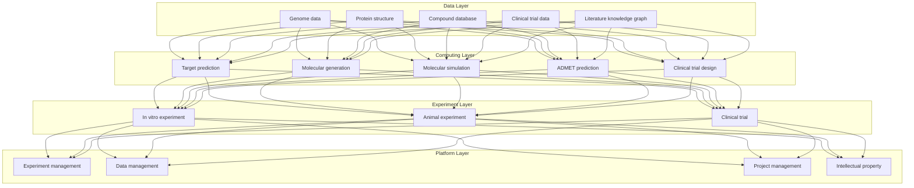
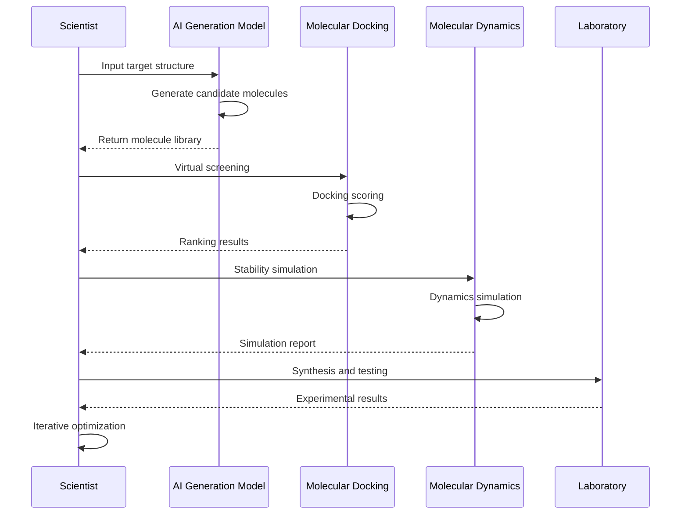
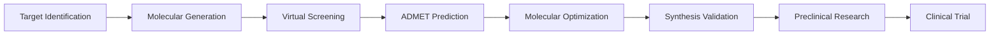

---title: AI Drug Discovery Architecture Design — Alibaba Cloud Perspective
description: 'AI Drug Discovery Architecture Design'
summary: 'AI Drug Discovery Architecture Design'
category: general
tags:
- architecture
- best-practice
- job
- gpu
- nvidia
tier: supporting
created: '2026-05-23'
last_updated: 2026-05
difficulty: intermediate
reading_level: intermediate
audience:
- All engineers
estimated_read_time: 5min
intent_queries:
- What is AI drug discovery architecture design — Alibaba Cloud perspective
- How to design AI drug discovery architecture — Alibaba Cloud perspective
- Kubernetes 20 application patterns best practices
trigger_keywords:
- AI
- Drug discovery architecture design
- Alibaba Cloud perspective
- application
- patterns
prerequisites:
- kubectl-basics
- prometheus-basics
- gpu-scheduling-basics
original_language: Chinese
authors:
- name: Dillan Teagle
  role: contributor
source_path: /Users/teaglebuilt/github/teaglebuilt/knowledge/tree/application/architecture/ai-drug-discovery.md
---

> **Production Environment Security Notice**
>
> This document contains directly executable operation and maintenance commands. Before execution, please confirm: whether the current target cluster and Namespace are correct; whether you have sufficient RBAC permissions; whether you have verified in a non-production environment. Command risk levels are marked: Red (high risk - may cause data loss or service interruption), Yellow (medium risk - modifies cluster state but usually reversible), Green (low risk/read-only - information collection with no side effects).

title: AI Drug Discovery Architecture Design
description: '# AI Drug Discovery Architecture Design — Alibaba Cloud Perspective'
category: application-architecture
tags:
- k8s
- architecture
- industry
- job
- gpu
- nvidia
last_updated: 2026-05-18
difficulty: expert
reading_level: expert
audience:
- AI drug discovery researchers
- Computational chemists
- Drug development engineers
estimated_read_time: 5min
intent_queries:
- AI drug discovery molecular generation and virtual screening
- GPU molecular dynamics simulation GROMACS
- Drug discovery deep learning models
- Target prediction and compound generation
- Alibaba Cloud PAI drug development
trigger_keywords:
- AI drug discovery
- Drug discovery
- Molecular generation
- Molecular docking
- Molecular dynamics
- Target discovery
- ADMET prediction
- Virtual screening
- GPU computing
- Clinical trials
related_domains:
- domain-03-networking-traffic
- domain-10-troubleshooting-diagnostics
related_topics:
- topic-ai-algorithm
- topic-hpc-architecture
k8s_versions:
- '1.28'
- '1.29'
- '1.30'
- '1.31'
- '1.32'
---

# AI Drug Discovery Architecture Design — Alibaba Cloud Perspective

> **Applicable Versions**: [[Kubernetes|Kubernetes]] v1.29 - v1.33 | **Last Updated**: 2026-04-24
> **Authors**: Alibaba Cloud Solution Architects | **Tags**: `#AIDrugDiscovery` `#DrugDiscovery` `#MolecularGeneration` `#AlibabCloud`

---

## Table of Contents

1. [Industry Background](#1-industry-background)
2. [Business Architecture](#2-business-architecture)
3. [Technical Architecture](#3-technical-architecture)
4. [Core Data Flow](#4-core-data-flow)
5. [Security and Compliance](#5-security-and-compliance)
6. [Observability](#6-observability)
7. [Alibaba Cloud Component Mapping](#7-alibaba-cloud-component-mapping)
8. [Production Checklist](#8-production-checklist)

---

## 1. Industry Background

### 1.1 Business Characteristics

AI drug discovery accelerates drug development through artificial intelligence technology:

| Challenge | Description | Architecture Impact |
|:---|:---|:---|
| Compute Intensive | Molecular simulation requires massive computing power | GPU cluster + parallel computing |
| Data Scarce | High-quality labeled data is rare | Transfer learning + data augmentation |
| Strict Compliance | FDA/NMPA approval | Complete experimental data traceability |
| Multi-modal Fusion | Gene/protein/compound | Multi-modal models |
| Intellectual Property | Compound patent protection | Data isolation + encryption |

### 1.2 Core Scenarios

- **Target Discovery**: Disease target prediction and validation
- **Molecular Generation**: AI-generated candidate compounds
- **Molecular Simulation**: Molecular dynamics/docking computation
- **Clinical Trials**: Patient recruitment/efficacy prediction
- **Drug Repurposing**: Discover new indications for existing drugs

---

## 2. Business Architecture

### 2.1 AI Drug Discovery Full-Landscape Architecture



### 2.2 Molecular Generation and Validation Timeline



---

## 3. Technical Architecture

### 3.1 K8s Deployment

```yaml
# Molecular Dynamics GPU Job
apiVersion: batch/v1
kind: Job
metadata:
  name: molecular-dynamics-001
  namespace: ai-drug-discovery
spec:
  parallelism: 10
  template:
    spec:
      nodeSelector:
        accelerator: nvidia-a100
      runtimeClassName: nvidia
      containers:
        - name: md
          image: registry.cn-hangzhou.aliyuncs.com/drug/gromacs:v2023.3-gpu
          command: ["gmx", "mdrun", "-deffnm", "md_001"]
          resources:
            requests:
              nvidia.com/gpu: 1
              memory: "32Gi"
              cpu: "8000m"
            limits:
              nvidia.com/gpu: 1
              memory: "64Gi"
              cpu: "16000m"
          volumeMounts:
            - name: md-input
              mountPath: /input
            - name: md-output
              mountPath: /output
      volumes:
        - name: md-input
          persistentVolumeClaim:
            claimName: md-input-pvc
        - name: md-output
          persistentVolumeClaim:
            claimName: md-output-pvc
      restartPolicy: Never
```

---

## 4. Core Data Flow

### 4.1 AI Drug Discovery Pipeline



---

## 5. Security and Compliance

- **Data Privacy**: Patient data de-identification
- **Intellectual Property**: Compound patent protection
- **GLP/GCP**: Drug non-clinical/clinical quality management standards

---

## 6. Observability

- **Molecular Simulation**: Nanoseconds/day
- **Model Training**: Distributed GPU acceleration
- **Experiment Progress**: Full process tracking

---

## 7. Alibaba Cloud Component Mapping

| Functional Domain | **Alibaba Cloud Cloud-Native Solution** |
|:---|:---|
| Container Platform | **ACK Pro + GPU** |
| GPU | **GN10/GN7 Instances** |
| High-Performance Computing | **E-HPC** |
| AI | **PAI** |
| Database | **PolarDB** |
| Object Storage | **OSS** |
| Observability | **ARMS + SLS** |

---

## 8. Production Checklist

- [ ] Molecular simulation computation accuracy verification
- [ ] AI model prediction accuracy
- [ ] Experimental data integrity audit
- [ ] Compound intellectual property isolation
- [ ] GLP/GCP compliance audit

---

**Maintainers**: Alibaba Cloud Solution Architects Team | **License**: MIT

---

## Obsidian Related Documents

- topic-application-architecture KUDIG Database — Global MOC
- [[domain-20-application-patterns/topic-application-architecture/README.md|Topic Application Layer Architecture Design Best Practices]]
- [[domain-20-application-patterns/topic-application-architecture/01-ecommerce-architecture.md|E-commerce System Kubernetes Production Architecture Design]]
- [[domain-20-application-patterns/topic-application-architecture/02-mini-program-architecture.md|Mini Program Platform Architecture Design]]
- [[domain-20-application-patterns/topic-application-architecture/03-cms-architecture.md|Content Management System CMS Architecture Design]]
- [[domain-20-application-patterns/topic-application-architecture/04-im-rtc-architecture.md|Real-Time Communication IM/RTC Architecture Design]]
- [[domain-20-application-patterns/topic-application-architecture/05-online-education-architecture.md|Online Education Platform Kubernetes Production Architecture Design]]
- [[domain-20-application-patterns/topic-application-architecture/06-fintech-architecture.md|FinTech Kubernetes Production Architecture Design]]
- [[domain-20-application-patterns/topic-application-architecture/07-iot-platform-architecture.md|IoT Platform Architecture Design]]
- [[domain-20-application-patterns/topic-application-architecture/08-ai-ml-inference-architecture.md|AI/ML Inference Service Kubernetes Production Architecture Design]]
- [[domain-20-application-patterns/topic-application-architecture/09-gaming-backend-architecture.md|Gaming Backend Kubernetes Production Architecture Design]]
- [[domain-20-application-patterns/topic-application-architecture/10-social-media-architecture.md|Social Media Platform Kubernetes Production Architecture Design]]

## See Also

- 62-distributed-energy
- 63-industrial-visual-inspection
- 65-autonomous-driving-sim
- 66-space-internet

## Related

- topic-application-architecture MOC — Cross-reference


<!-- risk-assessed -->
