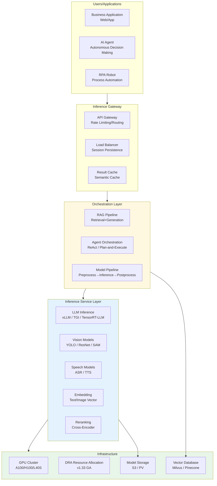
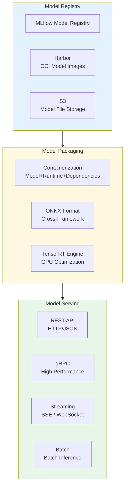
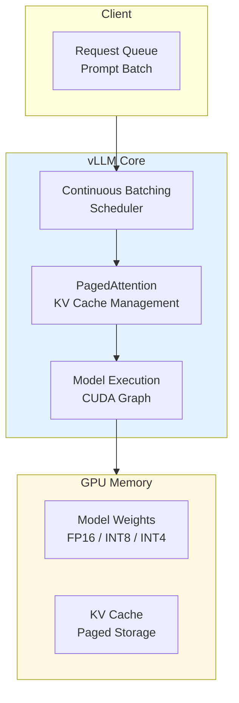
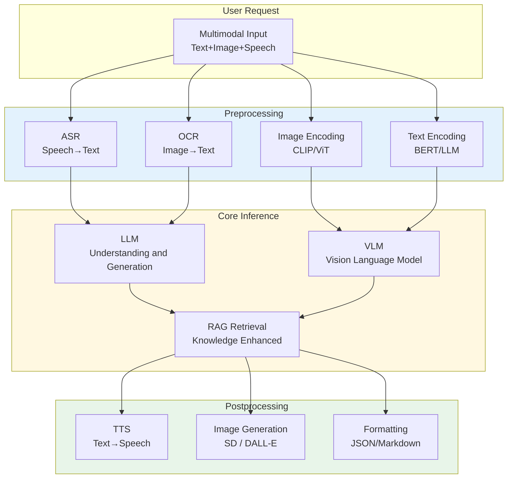

---title: AI/ML Inference Service Kubernetes Production Architecture Design (domain-20-application-patterns)
description: 'AI/ML Inference Service Kubernetes Production Architecture Design'
summary: 'AI/ML Inference Service Kubernetes Production Architecture Design'
category: general
tags:
- architecture
- best-practice
- scheduler
- prometheus
- grafana
- harbor
- minio
- job
- gateway
- crd
tier: core
created: '2026-05-23'
last_updated: 2026-05
difficulty: intermediate
reading_level: intermediate
audience:
- All engineers
estimated_read_time: 25min
intent_queries:
- What is AI/ML inference service Kubernetes production architecture design
- How to design AI/ML inference service Kubernetes production architecture
- Kubernetes 20 application patterns best practices
trigger_keywords:
- AI
- ML
- Inference service
- Kubernetes
- Production architecture design
- application
- patterns
prerequisites:
- kubectl-basics
- prometheus-basics
- monitoring-basics
- gpu-scheduling-basics
- observability-basics
original_language: Chinese
authors:
- name: Dillan Teagle
  role: contributor
source_path: /Users/teaglebuilt/github/teaglebuilt/knowledge/tree/application/architecture/ai-ml-inference-architecture.md
---

> **Production Environment Security Notice**
>
> This document contains directly executable operation and maintenance commands. Before execution, please confirm: whether the current target cluster and Namespace are correct; whether you have sufficient RBAC permissions; whether you have verified in a non-production environment. Command risk levels are marked: Red (high risk - may cause data loss or service interruption), Yellow (medium risk - modifies cluster state but usually reversible), Green (low risk/read-only - information collection with no side effects).

title: AI/ML Inference Service [[Kubernetes|Kubernetes]] Production Architecture Design
description: '# AI/ML Inference Service Kubernetes Production Architecture Design'
category: application-architecture
tags:
- k8s
- architecture
- industry
- scheduler
- [[Prometheus|prometheus]]
- [[Harbor|harbor]]
- job
- gateway
- operator
- gpu
last_updated: 2026-05
difficulty: advanced
reading_level: advanced
audience:
- Architects
- SRE
- Technical decision makers
estimated_read_time: 5min
intent_queries:
- What is AI/ML inference service Kubernetes production architecture design
- How to design AI/ML inference service Kubernetes production architecture
trigger_keywords:
- AI
- ML
- Inference service
- Kubernetes
- Production architecture design
- application
- architecture
k8s_versions:
- '1.28'
- '1.29'
- '1.30'
- '1.31'
- '1.32'
---

# AI/ML Inference Service Kubernetes Production Architecture Design

> **Applicable Scenarios**: LLM Large Model Inference / Image Recognition / Speech Synthesis / Recommendation Systems / Intelligent Customer Service / Autonomous Driving Perception  
> **Applicable Versions**: Kubernetes v1.29 - v1.33  
> **Last Updated**: 2026-04-24  
> **Target Readers**: MLOps Engineers, AI Platform Architects, Algorithm Engineering TL

---

<!-- chunk: Table of Contents -->## Table of Contents

- [1. Overall Architecture Landscape](#1-overall-architecture-landscape)
- [2. Model Servification Architecture](#2-model-servification-architecture)
- [3. GPU Cluster Scheduling Architecture](#3-gpu-cluster-scheduling-architecture)
- [4. LLM Large Model Inference Architecture](#4-llm-large-model-inference-architecture)
- [5. Multimodal Service Orchestration Architecture](#5-multimodal-service-orchestration-architecture)
- [6. A/B Testing and Model Iteration Architecture](#6-ab-testing-and-model-iteration-architecture)
- [7. Inference Performance Optimization Architecture](#7-inference-performance-optimization-architecture)
- [8. K8s Deployment Architecture](#8-k8s-deployment-architecture)

---

<!-- chunk: 1. Overall Architecture Landscape -->## 1. Overall Architecture Landscape



---

<!-- chunk: 2. Model Servification Architecture -->## 2. Model Servification Architecture



## KServe Model Service Configuration

```yaml
apiVersion: serving.kserve.io/v1beta1
kind: InferenceService
metadata:
  name: sentiment-classifier
  namespace: ai-platform
  annotations:
    serving.kserve.io/deploymentMode: Serverless
spec:
  predictor:
    model:
      modelFormat:
        name: sklearn
      storageUri: s3://ai-models/sentiment/v2/
      resources:
        requests:
          cpu: "1"
          memory: "2Gi"
        limits:
          cpu: "4"
          memory: "8Gi"
    minReplicas: 2
    maxReplicas: 10
    containerConcurrency: 100
    timeout: 30
---
apiVersion: serving.kserve.io/v1beta1
kind: InferenceService
metadata:
  name: image-classifier
  namespace: ai-platform
spec:
  predictor:
    model:
      modelFormat:
        name: pytorch
      storageUri: s3://ai-models/vision/resnet50/
      runtime: kserve-triton
      resources:
        requests:
          cpu: "2"
          memory: "8Gi"
          nvidia.com/gpu: "1"
        limits:
          cpu: "8"
          memory: "32Gi"
          nvidia.com/gpu: "1"
    nodeSelector:
      node-type: gpu
    tolerations:
      - key: nvidia.com/gpu
        operator: Exists
        effect: NoSchedule
```

---

<!-- chunk: 3. GPU Cluster Scheduling Architecture -->## 3. GPU Cluster Scheduling Architecture

```mermaid
flowchart TB
    subgraph SchedulerExt["Scheduler Extensions"]
        K8S_SCHED["kube-scheduler"]
        GPU_SCHED["GPU Scheduler<br/>NVIDIA / Volcano"]
        DRA_SCHED["DRA Plugin<br/>v1.33 GA"]
        GANG["Gang Scheduling<br">All-or-Nothing"]
    end

    subgraph NodePool["Node Pool"]
        GPU_A100["A100 Node Pool<br/>80GB VRAM"]
        GPU_H100["H100 Node Pool<br/>80GB VRAM"]
        GPU_L40S["L40S Node Pool<br/>48GB VRAM"]
        GPU_T4["T4 Node Pool<br/>16GB VRAM<br/>Inference Dedicated"]
    end

    subgraph Workloads["Workloads"]
        TRAIN["Training Job<br/>Multi-card Parallel"]
        INFER["Inference Service<br/>High Throughput"]
        FINETUNE["Fine-tuning Job<br/>LoRA / QLoRA"]
    end

    SchedulerExt --> NodePool --> Workloads

    style SchedulerExt fill:#e3f2fd
    style NodePool fill:#fff8e1
```

## DRA GPU Resource Allocation

```yaml
apiVersion: resource.k8s.io/v1beta1
kind: ResourceClaimTemplate
metadata:
  name: gpu-llm-claim-template
  namespace: ai-platform
spec:
  spec:
    resourceClassName: nvidia.com/gpu
    parametersRef:
      apiGroup: resource.nvidia.com
      kind: GpuConfig
      name: llm-gpu-params
---
apiVersion: resource.nvidia.com/v1alpha1
kind: GpuConfig
metadata:
  name: llm-gpu-params
  namespace: ai-platform
spec:
  memory: "80Gi"
  computeMode: "default"
  multiNodeEnabled: false
---
apiVersion: apps/v1
kind: Deployment
metadata:
  name: llm-inference-service
  namespace: ai-platform
spec:
  replicas: 2
  selector:
    matchLabels:
      app: llm-inference
  template:
    metadata:
      labels:
        app: llm-inference
    spec:
      containers:
        - name: vllm
          image: vllm/vllm-openai:v0.4.0
          args:
            - --model
            - /models/llama-3-70b
            - --tensor-parallel-size
            - "2"
            - --max-model-len
            - "8192"
          ports:
            - containerPort: 8000
              name: http
          resources:
            claims:
              - name: gpu
          volumeMounts:
            - name: model-storage
              mountPath: /models
      resourceClaims:
        - name: gpu
          source:
            resourceClaimTemplateName: gpu-llm-claim-template
      volumes:
        - name: model-storage
          persistentVolumeClaim:
            claimName: llm-model-pvc
```

---

<!-- chunk: 4. LLM Large Model Inference Architecture -->## 4. LLM Large Model Inference Architecture

## vLLM Inference Service Architecture



## vLLM K8s Deployment

```yaml
apiVersion: apps/v1
kind: Deployment
metadata:
  name: vllm-llama3-70b
  namespace: ai-platform
spec:
  replicas: 1
  selector:
    matchLabels:
      app: vllm-llama3-70b
  template:
    metadata:
      labels:
        app: vllm-llama3-70b
    spec:
      nodeSelector:
        node-type: gpu-a100
      tolerations:
        - key: nvidia.com/gpu
          operator: Exists
          effect: NoSchedule
      containers:
        - name: vllm
          image: vllm/vllm-openai:v0.4.0
          command:
            - python
            - -m
            - vllm.entrypoints.openai.api_server
          args:
            - --model
            - /models/Meta-Llama-3-70B-Instruct
            - --tensor-parallel-size
            - "2"
            - --pipeline-parallel-size
            - "1"
            - --max-num-seqs
            - "256"
            - --max-model-len
            - "8192"
            - --quantization
            - "awq"
            - --gpu-memory-utilization
            - "0.95"
            - --dtype
            - "half"
          ports:
            - containerPort: 8000
              name: http
          resources:
            requests:
              nvidia.com/gpu: "2"
              memory: "160Gi"
              cpu: "16"
            limits:
              nvidia.com/gpu: "2"
              memory: "160Gi"
              cpu: "32"
          volumeMounts:
            - name: model-storage
              mountPath: /models
            - name: shm
              mountPath: /dev/shm
          livenessProbe:
            httpGet:
              path: /health
              port: 8000
            initialDelaySeconds: 300
            periodSeconds: 30
          readinessProbe:
            httpGet:
              path: /health
              port: 8000
            initialDelaySeconds: 60
            periodSeconds: 10
      volumes:
        - name: model-storage
          persistentVolumeClaim:
            claimName: llama3-70b-pvc
        - name: shm
          emptyDir:
            medium: Memory
            sizeLimit: 32Gi
---
# Model preloading Job
apiVersion: batch/v1
kind: Job
metadata:
  name: model-preload
  namespace: ai-platform
spec:
  template:
    spec:
      nodeSelector:
        node-type: gpu-a100
      containers:
        - name: preload
          image: vllm/vllm-openai:v0.4.0
          command:
            - python
            - -c
            - |
              from vllm import LLM
              llm = LLM("/models/Meta-Llama-3-70B-Instruct",
                        tensor_parallel_size=2,
                        quantization="awq")
              print("Model preloaded successfully")
          resources:
            requests:
              nvidia.com/gpu: "2"
              memory: "160Gi"
      restartPolicy: Never
```

---

<!-- chunk: 5. Multimodal Service Orchestration Architecture -->## 5. Multimodal Service Orchestration Architecture



---

<!-- chunk: 6. A/B Testing and Model Iteration Architecture -->## 6. A/B Testing and Model Iteration Architecture

```mermaid
flowchart TB
    subgraph Experiment["Experiment Management"]
        DEFINE["Experiment Definition<br/>Traffic/Metrics/Duration"]
        SPLIT["Traffic Splitting<br/>Hash/UID"]
        TRACK["Metrics Tracking<br/>Accuracy/Latency/Cost"]
    end

    subgraph Models["Model Versions"]
        BASELINE["Baseline Model<br/>Current Production"]
        CANDIDATE["Candidate Model<br/>New Version"]
        SHADOW["Shadow Model<br">Comparison Validation"]
    end

    subgraph Decision["Decision"]
        PROMOTE["Full Rollout<br/>Performance Reached"]
        ROLLBACK["Rollback<br">Performance Dropped"]
        ITERATE["Iterative Optimization<br">Parameter Tuning"]
    end

    Experiment --> Models --> Decision
    DECISION --> DEFINE

    style Experiment fill:#e3f2fd
    style Decision fill:#fff8e1
```

---

<!-- chunk: 7. Inference Performance Optimization Architecture -->## 7. Inference Performance Optimization Architecture

```mermaid
flowchart TB
    subgraph Optimization["Optimization Strategies"]
        QUANT["Quantization<br/>FP16 → INT8 → INT4"]
        PRUNE["Pruning<br/>Sparsification"]
        DISTILL["Distillation<br">Small Model Learning Large Model"]
        SPEC_DECODE["Speculative Decoding<br">Draft + Verify"]
    end

    subgraph ServingOpt["Serving Optimization"]
        BATCHING["Continuous Batching<br/>Dynamic Batch Processing"]
        PREFILL["Prefix Caching<br/>Prompt Reuse"]
        STREAM["Streaming Response<br/>First Token Latency"]
        KV_REUSE["KV Cache Reuse<br/>Multi-turn Conversation"]
    end

    subgraph Hardware["Hardware Optimization"]
        TENSOR_CORE["Tensor Core<br/>FP8/BF16"]
        NVLINK["NVLink<br/>Multi-card Communication"]
        RDMA["RDMA<br/>Network Acceleration"]
    end

    Optimization --> ServingOpt --> Hardware

    style Optimization fill:#e3f2fd
    style ServingOpt fill:#fff8e1
    style Hardware fill:#e8f5e9
```

---

<!-- chunk: 8. K8s Deployment Architecture -->## 8. K8s Deployment Architecture

## GPU Node Pool and Auto-scaling

```yaml
apiVersion: karpenter.sh/v1
kind: NodePool
metadata:
  name: gpu-inference-pool
spec:
  template:
    spec:
      requirements:
        - key: node.kubernetes.io/instance-type
          operator: In
          values: ["p4d.24xlarge", "p5.48xlarge"]
        - key: karpenter.sh/capacity-type
          operator: In
          values: ["on-demand"]
        - key: nvidia.com/gpu.present
          operator: In
          values: ["true"]
      taints:
        - key: nvidia.com/gpu
          value: "true"
          effect: NoSchedule
      nodeClassRef:
        group: karpenter.k8s.aws
        kind: EC2NodeClass
        name: gpu-class
  limits:
    cpu: 1000
    memory: 4000Gi
    nvidia.com/gpu: 100
---
# KEDA-based auto-scaling for inference service based on queue length
apiVersion: keda.sh/v1alpha1
kind: ScaledObject
metadata:
  name: llm-inference-scaler
  namespace: ai-platform
spec:
  scaleTargetRef:
    name: vllm-llama3-70b
  minReplicaCount: 1
  maxReplicaCount: 10
  triggers:
    - type: prometheus
      metadata:
        serverAddress: http://prometheus.monitoring:9090
        metricName: vllm_gpu_cache_usage_perc
        threshold: "80"
        query: |
          avg(vllm_gpu_cache_usage_perc)
    - type: prometheus
      metadata:
        serverAddress: http://prometheus.monitoring:9090
        metricName: vllm_request_queue_time
        threshold: "5000"
        query: |
          histogram_quantile(0.99,
            sum(rate(vllm_request_queue_time_bucket[1m])) by (le)
          )
```

## Inference Service Monitoring and Alerting

```yaml
apiVersion: monitoring.coreos.com/v1
kind: PrometheusRule
metadata:
  name: ai-inference-alerts
  namespace: monitoring
spec:
  groups:
    - name: inference-quality
      rules:
        - alert: LLMHighQueueTime
          expr: |
            histogram_quantile(0.99,
              sum(rate(vllm_request_queue_time_bucket[5m])) by (le)
            ) > 10000
          for: 2m
          labels:
            severity: critical
          annotations:
            summary: "LLM inference queue P99 latency exceeds 10s, needs scale-up"

        - alert: GPUOutOfMemory
          expr: |
            nvidia_gpu_memory_used_bytes / nvidia_gpu_memory_total_bytes > 0.95
          for: 1m
          labels:
            severity: critical
          annotations:
            summary: "GPU memory usage exceeds 95%"

        - alert: ModelLoadFailure
          expr: |
            kube_deployment_status_replicas_unavailable{deployment=~"vllm-.*"} > 0
          for: 5m
          labels:
            severity: warning
          annotations:
            summary: "LLM inference service model loading failed"
```

---

<!-- chunk: Reference Links -->## Reference Links

- [vLLM Documentation](https://docs.vllm.ai/)
- [KServe Documentation](https://kserve.github.io/website/)
- [NVIDIA Triton Inference Server](https://docs.nvidia.com/deeplearning/triton-inference-server/)
- [TensorRT-LLM](https://github.com/NVIDIA/TensorRT-LLM)
- [Kubernetes DRA](https://kubernetes.io/docs/concepts/scheduling-eviction/dynamic-resource-allocation/)

---

<!-- chunk: Multi-cloud Deployment Solution -->## Multi-cloud Deployment Solution Comparison

## Cloud Service → Multi-cloud Mapping Table

| Capability Domain | AWS | GCP | Azure | Description |
|:---|:---|:---|:---|:---|
| K8s Container Orchestration | **EKS** | **GKE** | **AKS** | This document is based on native K8s, deployable on all clouds |
| GPU Instance (A100) | **p4d.24xlarge** | **a2-ultragpu-8g** | **ND A100 v4** | GPU models and specifications vary |
| GPU Instance (H100) | **p5.48xlarge** | **a3-highgpu-8g** | **ND H100 v5** | H100 availability affected by supply |
| GPU Instance (T4 Inference) | **g4dn.xlarge** | **n1-standard + T4** | **NC T4 v3** | Inference-dedicated, good performance/price ratio |
| Object Storage (Models) | **S3** | **GCS** | **Blob Storage** | Model file storage, using S3-compatible API |
| Image Registry | **ECR** | **Artifact Registry** | **ACR** | Model container image storage |
| Node Auto-scaling | **Karpenter** | **GKE Autopilot** | **Karpenter / Virtual Nodes** | GPU node elastic scaling |
| ML Platform | **SageMaker** | **Vertex AI** | **Azure ML** | Optional, can also use KServe instead |
| Inference Service | **SageMaker Endpoints** | **Vertex AI Endpoints** | **Azure ML Endpoints** | This document uses KServe, not cloud-specific |
| Logs/Monitoring | **CloudWatch** | **Cloud Monitoring** | **Monitor** | This document uses Prometheus + Grafana |
| Spot/Preemptive Instances | **Spot Instances** | **Preemptible VMs** | **Spot VMs** | GPU Spot instances can reduce costs 60-90% |
| Network Acceleration (RDMA) | **EFA** | **gVNIC** | **InfiniBand** | Multi-card/multi-node communication acceleration |

## Multi-cloud Deployment Considerations

1. **GPU Availability**: Different cloud GPU instance types, memory specifications, and supply vary. H100/A100 may be out of stock in some cloud Regions, evaluate target Region GPU inventory in advance.
2. **Karpenter Compatibility**: This document KarpenterNodePool uses AWS-specific EC2NodeClass. GCP uses GKE Autopilot or Karpenter GCP Provider, Azure uses Karpenter Azure Provider or Karpenter AKS Provider. Modify NodeClass CRD per target cloud.
3. **Model Storage**: Model files should store in S3-compatible object storage (each cloud native S3 API or MinIO). KServe storageUri supports s3://, gs://, azblob:// protocols, but configuration differs, needs adaptation.
4. **GPU Communication**: Multi-card inference (Tensor Parallelism) depends on NVLink / NVSwitch. Cross-cloud multi-node inference needs RDMA network, generally impossible across clouds, recommend single-cloud completion.
5. **Quantization and Optimization**: vLLM / TensorRT-LLM quantization models (AWQ/GPTQ) bind with GPU architecture. A100 (Ampere) and H100 (Hopper) quantization support differs, needs re-quantization during migration.
6. **Cost Management**: GPU instance cost varies significantly. AWS p4d.24xlarge (~$32/h) vs GCP a2-ultragpu (~$35/h) vs Azure ND A100 (~$30/h), evaluate TCO. Spot/preemptive instances are key cost reduction lever, but need handle interruptions.

## Cloud-Neutral Solution (Open Source Alternatives)

| Capability Domain | Open Source Solution | Description |
|:---|:---|:---|
| Container Orchestration | **Kubernetes** + **Karpenter** (multi-cloud) | Karpenter already supports AWS/GCP/Azure |
| Inference Service | **KServe** / **vLLM** / **TGI** | This document uses, fully cloud-neutral |
| Model Format | **ONNX** / **SafeTensors** | Cross-framework, cross-hardware universal format |
| Model Registry | **MLflow** (Model Registry) | This document mentioned |
| Model Images | **Harbor** (OCI Artifacts) | Support OCI Artifact storage models |
| Object Storage | **MinIO** | S3-compatible, self-built cluster storage models |
| GPU Scheduling | **Volcano** / **Kueue** | Gang Scheduling, multi-card parallelization |
| Auto-scaling | **KEDA** | This document uses, based on metrics auto-scaling |
| Monitoring | **Prometheus** + **Grafana** | This document uses |
| GPU Monitoring | **DCGM Exporter** | NVIDIA GPU metrics export to Prometheus |
| Vector Database | **Milvus** / **Qdrant** / **Weaviate** | RAG scenarios, not cloud-specific |
| Observability | **OpenTelemetry** | Unified trace/metric/log collection |
| GPU Sharing | **NVIDIA MIG** / **vGPU** / **Time-slicing** | Single-card multi-model sharing |

---

<!-- chunk: Obsidian Related Documents -->## Obsidian Related Documents

- topic-application-architecture MOC
- [[domain-20-application-patterns/topic-application-architecture/README.md|Topic Application Layer Architecture Design Best Practices]]
- [[domain-20-application-patterns/topic-application-architecture/01-ecommerce-architecture.md|E-commerce System Kubernetes Production Architecture Design]]
- [[domain-20-application-patterns/topic-application-architecture/02-mini-program-architecture.md|Mini Program Platform Architecture Design]]
- [[domain-20-application-patterns/topic-application-architecture/03-cms-architecture.md|Content Management System CMS Architecture Design]]
- [[domain-20-application-patterns/topic-application-architecture/04-im-rtc-architecture.md|Real-Time Communication IM/RTC Architecture Design]]
- [[domain-20-application-patterns/topic-application-architecture/05-online-education-architecture.md|Online Education Platform Kubernetes Production Architecture Design]]
- [[domain-20-application-patterns/topic-application-architecture/06-fintech-architecture.md|FinTech Kubernetes Production Architecture Design]]
- [[domain-20-application-patterns/topic-application-architecture/07-iot-platform-architecture.md|IoT Platform Architecture Design]]
- [[domain-20-application-patterns/topic-application-architecture/09-gaming-backend-architecture.md|Gaming Backend Kubernetes Production Architecture Design]]
- [[domain-20-application-patterns/topic-application-architecture/10-social-media-architecture.md|Social Media Platform Kubernetes Production Architecture Design]]
- [[domain-20-application-patterns/topic-application-architecture/11-smart-retail-architecture.md|Smart Retail and New Retail Kubernetes Production Architecture Design]]

## See Also

- 06-fintech-architecture
- 07-iot-platform-architecture
- 09-gaming-backend-architecture
- 10-social-media-architecture


<!-- risk-assessed -->
