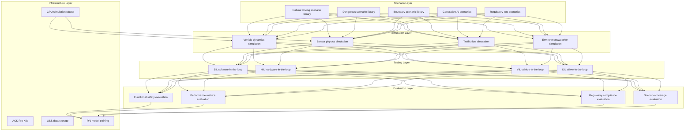
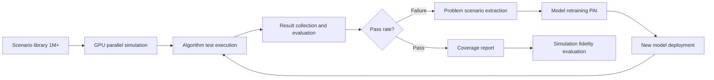

> **Production Environment Security Notice**
>
> This document contains directly executable operation and maintenance commands. Before execution, please confirm: whether the current target cluster and Namespace are correct; whether you have sufficient RBAC permissions; whether you have verified in a non-production environment. Command risk levels are marked: Red (high risk, may cause data loss or service interruption), Yellow (medium risk, modifies cluster state but usually reversible), Green (low risk/read-only, information collection with no side effects).

title: Autonomous Driving Simulation Architecture Design
description: '# Autonomous Driving Simulation Architecture Design — Alibaba Cloud Perspective'
category: application-architecture
tags:
- k8s
- architecture
- industry
- Prometheus
- grafana
- ArgoCD
- opa
- mysql
- job
- gpu
last_updated: 2026-05-18
difficulty: expert
reading_level: expert
audience:
- Autonomous driving algorithm engineers
- Simulation platform architects
- AI model training engineers
estimated_read_time: 5min
intent_queries:
- Autonomous driving simulation platform CARLA GPU cluster deployment
- SIL HIL hardware-in-the-loop simulation architecture
- Generative AI scenario auto-generation solution
- Autonomous driving perception planning algorithm testing
- Alibaba Cloud PAI model training simulation
trigger_keywords:
- Autonomous driving simulation
- CARLA
- SIL software-in-the-loop
- HIL hardware-in-the-loop
- Scenario generation
- GPU simulation
- Sensor simulation
- LiDAR point cloud
- Visual perception
- Data closed-loop
related_domains:
- domain-03-networking-traffic
- domain-10-troubleshooting-diagnostics
related_topics:
- topic-ai-algorithm
- topic-cloudnative-devops-architecture
k8s_versions:
- '1.28'
- '1.29'
- '1.30'
- '1.31'
- '1.32'
---

# Autonomous Driving Simulation Architecture Design — Alibaba Cloud Perspective

> **Applicable Versions**: Kubernetes v1.29 - v1.33 | **Last Updated**: 2026-04-24
> **Author**: Alibaba Cloud Solution Architects | **Tags**: `#AutonomousDriving` `#SimulationTesting` `#ScenarioGeneration` `#AlibabCloud`

---

<!-- chunk: table-of-contents -->## Table of Contents

1. [Industry Overview](#1-industry-overview)
2. [Business Scenarios](#2-business-scenarios)
3. [Architecture Design](#3-architecture-design)
4. [Core Technology Stack](#4-core-technology-stack)
5. [Kubernetes Deployment Solution](#5-kubernetes-deployment-solution)
6. [Data Architecture](#6-data-architecture)
7. [AI/ML Components](#7-aiml-components)
8. [Security and Compliance](#8-security-and-compliance)
9. [Best Practices](#9-best-practices)
10. [Anti-Patterns](#10-anti-patterns)
11. [Reference Resources](#11-reference-resources)

---

<!-- chunk: 1-industry-overview -->## 1. Industry Overview

## 1.1 Market Scale and Trends

Autonomous driving simulation accelerates algorithm validation through virtual environments and is core infrastructure for autonomous driving R&D. The global autonomous driving simulation market is projected to grow from 3.5 billion USD in 2024 to 20 billion USD in 2030. CARLA, LGSVL, PreScan, VTD and other simulation platforms are widely adopted. Core trends include generative AI scenario generation, large-scale parallel GPU simulation, and hardware-in-the-loop (HIL) testing.

| Metric | 2024 | 2026 (Projected) | 2030 (Projected) |
|:---|:---|:---|:---|
| Global simulation market | $3.5B | $8B | $20B |
| Parallel simulation GPU nodes | 100-500 | 500-2000 | 2000-10000 |
| Sensor simulation accuracy | Physics-level | Physics-level + Photorealism | Almost indistinguishable from reality |
| Scenario library scale | 100k+ | 1M+ | 10M+ |
| Simulation replacement for road testing percentage | 60% | 75% | 90% |

## 1.2 Industry Pain Points

| Pain Point | Description | Digital Transformation Driver |
|:---|:---|:---|
| Long-tail scenarios | Rare dangerous scenarios difficult to test on road | Generative AI + parameterized scenario library |
| Sensor simulation | Camera/LiDAR/Radar simulation accuracy | Physics-level rendering + ray tracing |
| Massive computation | Billions of kilometers virtual testing | Large-scale GPU parallelization |
| SIL/HIL | Software/hardware-in-the-loop hybrid testing | Hybrid simulation architecture |
| Data closed-loop | Simulation results driving model iteration | Automated data pipeline |
| Simulation fidelity | Simulation vs. real-world scene consistency | Simulation validation and calibration |

## 1.3 Digital Transformation Architecture Impact

Autonomous driving simulation architecture must cover scenario layer (natural driving/dangerous/boundary/generative scenarios), simulation layer (dynamics/sensor/traffic flow/environment simulation), testing layer (SIL/HIL/VIL/DIL), and evaluation layer (functional safety/performance/regulatory/coverage). Core challenges include sensor simulation physical realism and large-scale parallel simulation resource scheduling.

---

<!-- chunk: 2-business-scenarios -->## 2. Business Scenarios

## 2.1 Parameterized Scenario Generation

Generate massive test scenarios based on natural driving data and traffic rules. Support parameterized adjustment (weather/lighting/pedestrian behavior/vehicle density), automatically explore boundary conditions. Generative AI can automatically generate complex traffic scenarios from text descriptions.

## 2.2 Physics-Level Sensor Simulation

Simulate cameras (including lens distortion/noise/motion blur), LiDAR (including point cloud density/reflectivity/weather effects), and Radar. Use GPU ray-tracing to achieve physics-level rendering, simulated sensor data directly feeds autonomous driving algorithms.

## 2.3 SIL Software-in-the-Loop Testing

Autonomous driving algorithms (perception/planning/control) run in simulation environments, validating functional correctness. Support replay of real road-testing data (log replay) and pure simulation scenarios. Can run thousands of SIL tests for different scenarios in parallel.

## 2.4 HIL Hardware-in-the-Loop Testing

Real autonomous driving domain controllers are integrated with simulation systems. Simulation environments generate sensor data injected into controllers, controller outputs drive simulated vehicles. HIL testing validates real-time performance after software-hardware integration.

## 2.5 Data Closed-Loop

Scenarios failing in simulation are automatically extracted as regression test cases, problem scenarios used for model retraining. Forms "simulation → problem → training → validation" data closed-loop.

---

<!-- chunk: 3-architecture-design -->## 3. Architecture Design

## 3.1 Autonomous Driving Simulation Full-Landscape Architecture



---

<!-- chunk: 4-core-technology-stack -->## 4. Core Technology Stack

| Component | Purpose | Technology | License |
|:---|:---|:---|:---|
| Container Orchestration | GPU cluster management | ACK Pro + GPU | Proprietary |
| Sim Engine | Driving simulation | CARLA / LGSVL / Self-developed | MIT / Proprietary |
| Rendering | Sensor simulation | UE5 + Ray Tracing | Proprietary |
| Dynamics | Vehicle dynamics | CarSim / Dyna4 | Proprietary |
| AI Framework | Model training | PyTorch 2.x / PAI | BSD / Proprietary |
| GPU Instance | Simulation compute | GN7/GN10 (A10/A100) | Proprietary |
| Object Storage | Scenario & log storage | OSS | Proprietary |
| Relational DB | Test management | PolarDB MySQL | Proprietary |
| Message Queue | Job scheduling | RocketMQ 5.x | Apache 2.0 |
| Time-Series DB | Simulation metrics | Lindorm TSDB | Proprietary |
| Monitoring | Observability | ARMS + SLS + Grafana | Proprietary / Apache 2.0 |
| CI/CD | Automated testing | ArgoCD + CloudFlow | Apache 2.0 / Proprietary |

---

<!-- chunk: 5-kubernetes-deployment -->## 5. Kubernetes Deployment Solution

## 5.1 GPU Simulation Worker Deployment

```yaml
apiVersion: apps/v1
kind: Deployment
metadata:
  name: sim-worker-gpu
  namespace: ad-simulation
  labels:
    app: sim-worker-gpu
    tier: simulation
spec:
  replicas: 50
  selector:
    matchLabels:
      app: sim-worker-gpu
  strategy:
    rollingUpdate:
      maxSurge: 10
      maxUnavailable: 5
  template:
    metadata:
      labels:
        app: sim-worker-gpu
        tier: simulation
      annotations:
        prometheus.io/scrape: "true"
        prometheus.io/port: "9090"
    spec:
      nodeSelector:
        accelerator: nvidia-a10
        node-pool: sim-gpu
      runtimeClassName: nvidia
      priorityClassName: sim-high-priority
      containers:
        - name: worker
          image: registry.cn-hangzhou.aliyuncs.com/adsim/sim-worker:v3.0.0-gpu
          ports:
            - containerPort: 8080
              name: http
            - containerPort: 9090
              name: metrics
          env:
            - name: SIM_ENGINE
              value: "carla"
            - name: SENSOR_MODE
              value: "camera+lidar+radar"
            - name: RENDER_QUALITY
              value: "epic"
            - name: RAY_TRACING
              value: "true"
            - name: SIM_RATE_HZ
              value: "100"
            - name: MAX_EPISODE_STEPS
              value: "10000"
            - name: RESULTS_UPLOAD_URL
              value: "http://results-collector:8080/upload"
          resources:
            requests:
              nvidia.com/gpu: 1
              memory: "16Gi"
              cpu: "8000m"
            limits:
              nvidia.com/gpu: 1
              memory: "32Gi"
              cpu: "16000m"
          readinessProbe:
            httpGet:
              path: /health/ready
              port: 8080
            initialDelaySeconds: 30
            periodSeconds: 5
          livenessProbe:
            httpGet:
              path: /health/live
              port: 8080
            initialDelaySeconds: 60
            periodSeconds: 15
```

## 5.2 Simulation Orchestrator Deployment

```yaml
apiVersion: apps/v1
kind: Deployment
metadata:
  name: sim-orchestrator
  namespace: ad-simulation
spec:
  replicas: 3
  selector:
    matchLabels:
      app: sim-orchestrator
  template:
    metadata:
      labels:
        app: sim-orchestrator
    spec:
      containers:
        - name: orchestrator
          image: registry.cn-hangzhou.aliyuncs.com/adsim/orchestrator:v2.0.0
          ports:
            - containerPort: 8080
          env:
            - name: MAX_PARALLEL_SIMS
              value: "500"
            - name: SCENARIO_DB_URL
              value: "mysql://sim@polardb.sim.rds.aliyuncs.com:3306/scenario_db"
            - name: RESULTS_BUCKET
              value: "sim-results"
          resources:
            requests:
              memory: "4Gi"
              cpu: "2000m"
            limits:
              memory: "8Gi"
              cpu: "4000m"
```

## 5.3 ConfigMap, Service and Secret

```yaml
apiVersion: v1
kind: ConfigMap
metadata:
  name: sim-config
  namespace: ad-simulation
data:
  sensor-config: |
    {
      "cameras": [
        {"position": "front", "resolution": "1920x1080", "fov": 90},
        {"position": "front_left", "resolution": "1920x1080", "fov": 60}
      ],
      "lidar": {"channels": 64, "range_m": 100, "points_per_second": 1000000},
      "radar": {"range_m": 200, "fov_degrees": 60}
    }
  scenario-categories: |
    {
      "cut_in": 10000,
      "emergency_brake": 5000,
      "pedestrian_crossing": 8000,
      "intersection": 15000,
      "highway_merge": 6000,
      "adverse_weather": 3000
    }
  eval-metrics: |
    {
      "collision_rate": 0,
      "lane_invasion_rate": 0,
      "comfort_score_threshold": 0.8,
      "traffic_rule_compliance": 0.99
    }
---
apiVersion: v1
kind: Service
metadata:
  name: sim-worker-gpu
  namespace: ad-simulation
spec:
  selector:
    app: sim-worker-gpu
  ports:
    - name: http
      port: 8080
      targetPort: 8080
    - name: metrics
      port: 9090
      targetPort: 9090
  type: ClusterIP
---
apiVersion: v1
kind: Secret
metadata:
  name: sim-secrets
  namespace: ad-simulation
type: Opaque
stringData:
  db-password: "encrypted-password-placeholder"
  oss-access-key: "oss-key-placeholder"
  oss-secret-key: "oss-secret-placeholder"
  model-registry-token: "registry-token-placeholder"
```

---

<!-- chunk: 6-data-architecture -->## 6. Data Architecture

## 6.1 Simulation Data Closed-Loop



## 6.2 Data Flow Description

- **Scenario Distribution Flow**: Orchestrator distributes scenarios to GPU workers, each worker runs simulation independently
- **Sensor Data Flow**: Simulation engine generates sensor data injected into autonomous driving algorithms
- **Result Collection Flow**: Simulation results (trajectories/metrics/collisions/violations) collected uniformly for evaluation
- **Training Data Flow**: Failed scenarios automatically archived to training dataset for model retraining

---

<!-- chunk: 7-aiml-components -->## 7. AI/ML Components

## 7.1 Core Models

| Model | Purpose | Input | Output | Framework |
|:---|:---|:---|:---|---|
| Scenario Generation | Auto-generate test scenarios | Text description/parameter constraints | 3D traffic scenario | Diffusion + LLM |
| Perception Model | Object detection/segmentation | Sensor simulation data | Object list/semantic segmentation | BEVFormer / StreamPETR |
| Planning Model | Trajectory planning | Perception results/map | Driving trajectory | PnPNet / UniAD |
| Coverage Model | Scenario coverage analysis | Test results | Coverage metrics | Monte Carlo |
| Simulation Acceleration | Simulation speed optimization | Scenario complexity | Adaptive step size | RL |
| ODD Detection | Operational Design Domain recognition | Sensor data | ODD compliance | Classifier |

---

<!-- chunk: 8-security-compliance -->## 8. Security and Compliance

## 8.1 Industry Regulations and Standards

| Regulation/Standard | Applicable Scope | Architecture Requirements |
|:---|:---|:---|
| ISO 26262 | Functional safety | ASIL-D level simulation validation |
| ISO 21448 (SOTIF) | Intended functional safety | Long-tail scenario coverage |
| UN R157 | Automatic lane keeping | Regulatory scenario testing |
| GB/T Standards | Chinese autonomous driving standards | National standard compliance testing |
| NHTSA / Euro NCAP | Safety ratings | Collision/emergency scenario testing |
| Data Security Law | Simulation data security | Scenario data protection |

## 8.2 Security Architecture Key Points

- **Simulation Isolation**: SIL/HIL simulation environments isolated from production networks
- **Scenario Data Protection**: High-precision maps and scenario data encrypted at rest
- **Model Version Management**: Algorithm model versioning, each test bound to specific version
- **Audit Trail**: All simulation test results fully traceable

---

<!-- chunk: 9-best-practices -->## 9. Best Practices

1. **GPU Elastic Scheduling**: Simulation peaks require hundreds of GPUs, released during idle, using K8s auto-scaling
2. **Scenario Parameterization**: Parameterize weather/lighting/pedestrian behavior, automatically explore boundary conditions
3. **Simulation Acceleration Mode**: Use fast-forward mode for non-critical scenarios (10x-100x real-time), critical scenarios run in real-time
4. **Regression Test Automation**: Each algorithm update automatically runs regression test scenario set
5. **Sensor Noise Modeling**: Inject realistic noise models into simulated sensors, narrowing simulation-reality gap
6. **Multi-Sensor Fusion Simulation**: Simultaneously simulate camera+LiDAR+Radar, validate fusion algorithms
7. **Coverage-Driven Testing**: Define coverage metrics based on ODD (Operational Design Domain), ensure scenario coverage
8. **HIL Real-Time Guarantee**: HIL testing ensures end-to-end latency < 100ms
9. **Simulation Result Visualization**: 3D replay of failure scenarios for engineers' root cause analysis
10. **Data Closed-Loop Automation**: Full-chain automation of simulation failure → data extraction → model training → revalidation

---

<!-- chunk: 10-anti-patterns -->## 10. Anti-Patterns

1. **Ignoring Simulation Fidelity**: Large discrepancy between simulation results and real road testing, over-relying on simulation conclusions. Should continuously calibrate simulations
2. **Scenario Library Not Updated**: Scenario library not continuously expanded, unable to cover new long-tail scenarios. Should continuously extract new scenarios from road testing data
3. **GPU Resource Waste**: Simulation tasks queued waiting, low GPU utilization. Should use elastic scheduling and priority management
4. **SIL Only, No HIL**: Only software-in-the-loop testing, ignoring hardware real-time validation. Should combine SIL + HIL
5. **Ignoring Simulation Consistency**: Different simulation engine results inconsistent. Should unify simulation standards and calibration processes

---

<!-- chunk: 11-reference-resources -->## 11. Reference Resources

- [CARLA Open Simulator](https://carla.org/)
- [ISO 26262 Functional Safety Standard](https://www.iso.org/standard/68383.html)
- [ISO 21448 SOTIF Standard](https://www.iso.org/standard/71275.html)
- [NHTSA Automated Vehicles](https://www.nhtsa.gov/technology-innovation/automated-vehicles-safety)
- [OpenSCENARIO Format Specification](https://www.asam.net/standards/detail/openscenario/)
- [Alibaba Cloud GPU Instance Documentation](https://help.aliyun.com/document_detail/2539917.html)

---

**Maintainers**: Alibaba Cloud Solution Architects Team | **License**: MIT

---

<!-- chunk: obsidian-references -->## Obsidian Related Documentation

- topic-application-architecture MOC
- [[domain-20-application-patterns/topic-application-architecture/README.md|Topic Application Layer Architecture Design Best Practices]]
- [[domain-20-application-patterns/topic-application-architecture/01-ecommerce-architecture.md|E-commerce Systems Kubernetes Production Architecture Design]]
- [[domain-20-application-patterns/topic-application-architecture/02-mini-program-architecture.md|Mini Program Platform Architecture Design]]
- [[domain-20-application-patterns/topic-application-architecture/03-cms-architecture.md|Content Management System CMS Architecture Design]]
- [[domain-20-application-patterns/topic-application-architecture/04-im-rtc-architecture.md|Real-time Communication IM/RTC Architecture Design]]
- [[domain-20-application-patterns/topic-application-architecture/05-online-education-architecture.md|Online Education Platform Kubernetes Production Architecture Design]]
- [[domain-20-application-patterns/topic-application-architecture/06-fintech-architecture.md|Financial Technology FinTech Kubernetes Production Architecture Design]]
- [[domain-20-application-patterns/topic-application-architecture/07-iot-platform-architecture.md|Internet of Things IoT Platform Architecture Design]]
- [[domain-20-application-patterns/topic-application-architecture/08-ai-ml-inference-architecture.md|AI/ML Inference Service Kubernetes Production Architecture Design]]
- [[domain-20-application-patterns/topic-application-architecture/09-gaming-backend-architecture.md|Gaming Backend Kubernetes Production Architecture Design]]
- [[domain-20-application-patterns/topic-application-architecture/10-social-media-architecture.md|Social Media Platform Kubernetes Production Architecture Design]]

## See Also

- 63-industrial-visual-inspection
- 64-ai-drug-discovery
- 66-space-internet
- 67-brain-computer-interface

## Related

- topic-application-architecture MOC — Cross-reference


<!-- risk-assessed -->
