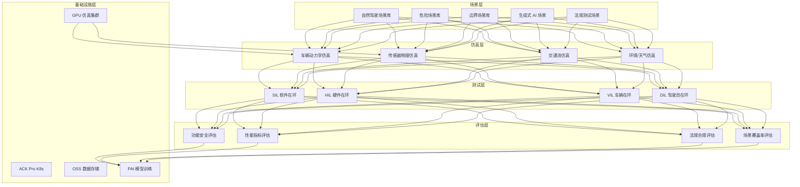
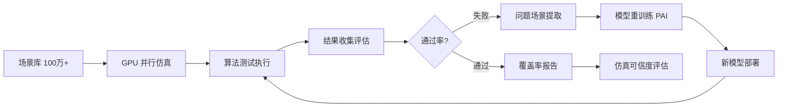

---title: 自动驾驶仿真架构设计 — 阿里云视角
description: 'title: 自动驾驶仿真架构设计'
summary: 'title: 自动驾驶仿真架构设计'
category: general
tags:
- architecture
- best-practice
- prometheus
- grafana
- argocd
- opa
- mysql
- job
- gpu
- nvidia
tier: supporting
created: '2026-05-23'
last_updated: 2026-05
difficulty: intermediate
reading_level: intermediate
audience:
- 所有工程师
estimated_read_time: 15min
intent_queries:
- 自动驾驶仿真架构设计 — 阿里云视角 是什么
- 如何 自动驾驶仿真架构设计 — 阿里云视角
- Kubernetes 20 application patterns 最佳实践
trigger_keywords:
- 自动驾驶仿真架构设计
- 阿里云视角
- application
- patterns
prerequisites:
- kubectl-basics
- prometheus-basics
- monitoring-basics
- gitops-basics
- mysql-basics
- gpu-scheduling-basics
- policy-basics
authors:
- name: Dillan Teagle
  role: contributor

---

> **生产环境安全提示**
>
> 本文档包含可直接执行的运维命令。执行前请确认：当前目标集群与 Namespace 是否正确；是否具备足够的 RBAC 权限；是否已在非生产环境验证。命令风险等级标注：🔴 高风险（可能造成数据丢失或服务中断）、🟡 中风险（会修改集群状态，但通常可回滚）、🟢 低风险/只读（信息收集，无副作用）。


title: 自动驾驶仿真架构设计
description: '# 自动驾驶仿真架构设计 — 阿里云视角'
category: application-architecture
tags:
- k8s
- architecture
- industry
- [[Prometheus|prometheus]]
- grafana
- [[ArgoCD|argocd]]
- opa
- mysql
- job
- gpu
last_updated: 2026-05-18
difficulty: expert
reading_level: expert
audience:
- 自动驾驶算法工程师
- 仿真平台架构师
- AI模型训练工程师
estimated_read_time: 5min
intent_queries:
- 自动驾驶仿真平台 CARLA GPU集群部署
- SIL HIL 硬件在环仿真架构
- 生成式AI场景自动生成方案
- 自动驾驶感知规划算法测试
- 阿里云PAI模型训练仿真
trigger_keywords:
- 自动驾驶仿真
- CARLA
- SIL软件在环
- HIL硬件在环
- 场景生成
- GPU仿真
- 传感器仿真
- 激光雷达点云
- 视觉感知
- 数据闭环
related_domains:
- domain-03-networking-traffic
- domain-10-troubleshooting-diagnostics
related_topics:
- topic-ai-algorithm
- topic-cloudnative-devops-architecture
k8s_versions:
- '1.28'
- '1.29'
- '1.30'
- '1.31'
- '1.32'
---

# 自动驾驶仿真架构设计 — 阿里云视角

> **适用版本**: Kubernetes v1.29 - v1.33 | **最后更新**: 2026-04-24
> **作者**: 阿里云解决方案架构师 | **标签**: `#自动驾驶` `#仿真测试` `#场景生成` `#阿里云`

---

<!-- chunk: 目录 -->## 目录

1. [行业概述](#1-行业概述)
2. [业务场景](#2-业务场景)
3. [架构设计](#3-架构设计)
4. [核心技术栈](#4-核心技术栈)
5. [Kubernetes 部署方案](#5-kubernetes-部署方案)
6. [数据架构](#6-数据架构)
7. [AI/ML 组件](#7-aiml-组件)
8. [安全与合规](#8-安全与合规)
9. [最佳实践](#9-最佳实践)
10. [反模式](#10-反模式)
11. [参考资源](#11-参考资源)

---

<!-- chunk: 1. 行业概述 -->## 1. 行业概述

## 1.1 市场规模与趋势

自动驾驶仿真通过虚拟环境加速算法验证，是自动驾驶研发的核心基础设施。全球自动驾驶仿真市场规模预计从 2024 年的 35 亿美元增长到 2030 年的 200 亿美元。CARLA、LGSVL、PreScan、VTD 等仿真平台广泛应用。核心趋势包括生成式 AI 场景生成、大规模并行 GPU 仿真和硬件在环（HIL）测试。

| 指标 | 2024 年 | 2026 年（预测） | 2030 年（预测） |
|:---|:---|:---|:---|
| 全球仿真市场 | $3.5B | $8B | $20B |
| 并行仿真 GPU 节点 | 100-500 | 500-2000 | 2000-10000 |
| 传感器仿真精度 | 物理级 | 物理级 + 真实感 | 几乎与真实无异 |
| 场景库规模 | 10 万+ | 100 万+ | 1000 万+ |
| 仿真替代路测比例 | 60% | 75% | 90% |

## 1.2 行业痛点

| 痛点 | 说明 | 数字化转型驱动 |
|:---|:---|:---|
| 长尾场景 | 罕见危险场景难以路测 | 生成式 AI + 参数化场景库 |
| 传感器仿真 | 相机/LiDAR/Radar 仿真精度 | 物理级渲染 + 光线追踪 |
| 海量计算 | 数十亿公里虚拟测试 | 大规模 GPU 并行 |
| SIL/HIL | 软件/硬件在环混合测试 | 混合仿真架构 |
| 数据闭环 | 仿真结果驱动模型迭代 | 自动化数据流水线 |
| 仿真可信度 | 仿真与真实场景一致性 | 仿真验证与校准 |

## 1.3 数字化转型架构影响

自动驾驶仿真架构需要覆盖场景层（自然驾驶/危险/边界/生成式场景）、仿真层（动力学/传感器/交通流/环境仿真）、测试层（SIL/HIL/VIL/DIL）和评估层（功能安全/性能/法规/覆盖率）。核心挑战是传感器仿真的物理真实感和大规模并行仿真的资源调度。

---

<!-- chunk: 2. 业务场景 -->## 2. 业务场景

## 2.1 参数化场景生成

基于自然驾驶数据和交通规则生成海量测试场景。支持参数化调整（天气/光照/行人行为/车辆密度），自动探索边界条件。生成式 AI 可从文本描述自动生成复杂交通场景。

## 2.2 物理级传感器仿真

仿真摄像头（包括镜头畸变/噪声/运动模糊）、LiDAR（包括点云密度/反射率/天气影响）和 Radar。使用 GPU 光线追踪实现物理级渲染，仿真传感器数据直接输入自动驾驶算法。

## 2.3 SIL 软件在环测试

自动驾驶算法（感知/规划/控制）在仿真环境中运行，验证功能正确性。支持回放真实路测数据（log replay）和纯仿真场景。可并行运行数千个场景的 SIL 测试。

## 2.4 HIL 硬件在环测试

真实自动驾驶域控制器接入仿真系统，仿真环境生成传感器数据注入控制器，控制器输出控制指令驱动仿真车辆。HIL 测试验证软硬件集成后的实时性能。

## 2.5 数据闭环

仿真发现的失败场景自动提取为回归测试用例，问题场景用于重训练感知/规划模型。形成"仿真→问题→训练→验证"的数据闭环。

---

<!-- chunk: 3. 架构设计 -->## 3. 架构设计

## 3.1 自动驾驶仿真全景架构



---

<!-- chunk: 4. 核心技术栈 -->## 4. 核心技术栈

| Component | Purpose | Technology | License |
|:---|:---|:---|:---|
| Container Orchestration | GPU cluster management | ACK Pro + GPU | Proprietary |
| Sim Engine | Driving simulation | CARLA / LGSVL / 自研 | MIT / Proprietary |
| Rendering | Sensor simulation | UE5 + Ray Tracing | Proprietary |
| Dynamics | Vehicle dynamics | CarSim / Dyna4 | Proprietary |
| AI Framework | Model training | PyTorch 2.x / PAI | BSD / Proprietary |
| GPU Instance | Simulation compute | GN7/GN10 (A10/A100) | Proprietary |
| Object Storage | Scenario & log storage | OSS | Proprietary |
| Relational DB | Test management | PolarDB MySQL | Proprietary |
| Message Queue | Job scheduling | RocketMQ 5.x | Apache 2.0 |
| Time-Series DB | Simulation metrics | Lindorm TSDB | Proprietary |
| Monitoring | Observability | ARMS + SLS + Grafana | Proprietary / Apache 2.0 |
| CI/CD | Automated testing | ArgoCD + CloudFlow | Apache 2.0 / Proprietary |

---

<!-- chunk: 5. Kubernetes 部署方案 -->## 5. Kubernetes 部署方案

## 5.1 GPU 仿真工作器 Deployment

```yaml
apiVersion: apps/v1
kind: Deployment
metadata:
  name: sim-worker-gpu
  namespace: ad-simulation
  labels:
    app: sim-worker-gpu
    tier: simulation
spec:
  replicas: 50
  selector:
    matchLabels:
      app: sim-worker-gpu
  strategy:
    rollingUpdate:
      maxSurge: 10
      maxUnavailable: 5
  template:
    metadata:
      labels:
        app: sim-worker-gpu
        tier: simulation
      annotations:
        prometheus.io/scrape: "true"
        prometheus.io/port: "9090"
    spec:
      nodeSelector:
        accelerator: nvidia-a10
        node-pool: sim-gpu
      runtimeClassName: nvidia
      priorityClassName: sim-high-priority
      containers:
        - name: worker
          image: registry.cn-hangzhou.aliyuncs.com/adsim/sim-worker:v3.0.0-gpu
          ports:
            - containerPort: 8080
              name: http
            - containerPort: 9090
              name: metrics
          env:
            - name: SIM_ENGINE
              value: "carla"
            - name: SENSOR_MODE
              value: "camera+lidar+radar"
            - name: RENDER_QUALITY
              value: "epic"
            - name: RAY_TRACING
              value: "true"
            - name: SIM_RATE_HZ
              value: "100"
            - name: MAX_EPISODE_STEPS
              value: "10000"
            - name: RESULTS_UPLOAD_URL
              value: "http://results-collector:8080/upload"
          resources:
            requests:
              nvidia.com/gpu: 1
              memory: "16Gi"
              cpu: "8000m"
            limits:
              nvidia.com/gpu: 1
              memory: "32Gi"
              cpu: "16000m"
          readinessProbe:
            httpGet:
              path: /health/ready
              port: 8080
            initialDelaySeconds: 30
            periodSeconds: 5
          livenessProbe:
            httpGet:
              path: /health/live
              port: 8080
            initialDelaySeconds: 60
            periodSeconds: 15
```

## 5.2 仿真编排器 Deployment

```yaml
apiVersion: apps/v1
kind: Deployment
metadata:
  name: sim-orchestrator
  namespace: ad-simulation
spec:
  replicas: 3
  selector:
    matchLabels:
      app: sim-orchestrator
  template:
    metadata:
      labels:
        app: sim-orchestrator
    spec:
      containers:
        - name: orchestrator
          image: registry.cn-hangzhou.aliyuncs.com/adsim/orchestrator:v2.0.0
          ports:
            - containerPort: 8080
          env:
            - name: MAX_PARALLEL_SIMS
              value: "500"
            - name: SCENARIO_DB_URL
              value: "mysql://sim@polardb.sim.rds.aliyuncs.com:3306/scenario_db"
            - name: RESULTS_BUCKET
              value: "sim-results"
          resources:
            requests:
              memory: "4Gi"
              cpu: "2000m"
            limits:
              memory: "8Gi"
              cpu: "4000m"
```

## 5.3 ConfigMap, Service 与 Secret

```yaml
apiVersion: v1
kind: ConfigMap
metadata:
  name: sim-config
  namespace: ad-simulation
data:
  sensor-config: |
    {
      "cameras": [
        {"position": "front", "resolution": "1920x1080", "fov": 90},
        {"position": "front_left", "resolution": "1920x1080", "fov": 60}
      ],
      "lidar": {"channels": 64, "range_m": 100, "points_per_second": 1000000},
      "radar": {"range_m": 200, "fov_degrees": 60}
    }
  scenario-categories: |
    {
      "cut_in": 10000,
      "emergency_brake": 5000,
      "pedestrian_crossing": 8000,
      "intersection": 15000,
      "highway_merge": 6000,
      "adverse_weather": 3000
    }
  eval-metrics: |
    {
      "collision_rate": 0,
      "lane_invasion_rate": 0,
      "comfort_score_threshold": 0.8,
      "traffic_rule_compliance": 0.99
    }
---
apiVersion: v1
kind: Service
metadata:
  name: sim-worker-gpu
  namespace: ad-simulation
spec:
  selector:
    app: sim-worker-gpu
  ports:
    - name: http
      port: 8080
      targetPort: 8080
    - name: metrics
      port: 9090
      targetPort: 9090
  type: ClusterIP
---
apiVersion: v1
kind: Secret
metadata:
  name: sim-secrets
  namespace: ad-simulation
type: Opaque
stringData:
  db-password: "encrypted-password-placeholder"
  oss-access-key: "oss-key-placeholder"
  oss-secret-key: "oss-secret-placeholder"
  model-registry-token: "registry-token-placeholder"
```

---

<!-- chunk: 6. 数据架构 -->## 6. 数据架构

## 6.1 仿真数据闭环



## 6.2 数据流说明

- **场景分发流**: 编排器将场景分发至 GPU 工作器，每个工作器独立运行仿真
- **传感器数据流**: 仿真引擎生成传感器数据注入自动驾驶算法
- **结果回收流**: 仿真结果（轨迹/指标/碰撞/违规）统一收集至评估系统
- **训练数据流**: 失败场景自动归档至训练数据集，用于模型重训练

---

<!-- chunk: 7. AI/ML 组件 -->## 7. AI/ML 组件

## 7.1 核心模型

| 模型 | 用途 | 输入 | 输出 | 框架 |
|:---|:---|:---|:---|---|
| 场景生成 | 自动生成测试场景 | 文本描述/参数约束 | 3D 交通场景 | Diffusion + LLM |
| 感知模型 | 目标检测/分割 | 传感器仿真数据 | 目标列表/语义分割 | BEVFormer / StreamPETR |
| 规划模型 | 轨迹规划 | 感知结果/地图 | 行驶轨迹 | PnPNet / UniAD |
| 覆盖率模型 | 场景覆盖率分析 | 测试结果 | 覆盖率指标 | Monte Carlo |
| 仿真加速 | 仿真速度优化 | 场景复杂度 | 自适应步长 | RL |
| ODD 检测 | 运行设计域识别 | 传感器数据 | ODD 合规性 | 分类器 |

---

<!-- chunk: 8. 安全与合规 -->## 8. 安全与合规

## 8.1 行业法规与标准

| 法规/标准 | 适用范围 | 架构要求 |
|:---|:---|:---|
| ISO 26262 | 功能安全 | ASIL-D 级仿真验证 |
| ISO 21448 (SOTIF) | 预期功能安全 | 长尾场景覆盖 |
| UN R157 | 自动车道保持 | 法规场景测试 |
| GB/T 标准 | 中国自动驾驶标准 | 国标合规测试 |
| NHTSA / Euro NCAP | 安全评级 | 碰撞/紧急场景测试 |
| 数据安全法 | 仿真数据安全 | 场景数据保护 |

## 8.2 安全架构要点

- **仿真隔离**: SIL/HIL 仿真环境与生产网络隔离
- **场景数据保护**: 高精地图和场景数据加密存储
- **模型版本管理**: 算法模型版本化，每次测试绑定具体版本
- **审计追踪**: 所有仿真测试结果完整追溯

---

<!-- chunk: 9. 最佳实践 -->## 9. 最佳实践

1. **GPU 弹性调度**: 仿真峰值需要数百个 GPU，闲时释放，使用 K8s 弹性伸缩
2. **场景参数化**: 将天气/光照/行人行为等参数化，自动探索边界条件
3. **仿真加速模式**: 对非关键场景使用快进模式（10x-100x 实时），关键场景实时运行
4. **回归测试自动化**: 每次算法更新自动运行回归测试场景集
5. **传感器噪声建模**: 仿真传感器加入真实噪声模型，缩小仿真与现实差距
6. **多传感器融合仿真**: 同时仿真相机+LiDAR+Radar，验证融合算法
7. **覆盖率驱动测试**: 基于 ODD（运行设计域）定义覆盖率指标，确保场景覆盖
8. **HIL 实时性保障**: HIL 测试确保端到端延迟 < 100ms
9. **仿真结果可视化**: 失败场景 3D 回放，便于工程师分析根因
10. **数据闭环自动化**: 仿真失败→数据提取→模型训练→重新验证全链路自动化

---

<!-- chunk: 10. 反模式 -->## 10. 反模式

1. **忽视仿真可信度**: 仿真结果与真实路测差异大，过度依赖仿真结论。应持续校准仿真
2. **场景库不更新**: 场景库不持续扩充，覆盖不了新的长尾场景。应持续从路测数据挖掘新场景
3. **GPU 资源浪费**: 仿真任务排队等待，GPU 利用率低。应使用弹性调度和优先级管理
4. **仅做 SIL 不做 HIL**: 只做软件在环测试，忽视硬件实时性验证。应 SIL + HIL 结合
5. **忽视仿真一致性**: 不同仿真引擎结果不一致。应统一仿真标准和校准流程

---

<!-- chunk: 11. 参考资源 -->## 11. 参考资源

- [CARLA 开源仿真器](https://carla.org/)
- [ISO 26262 功能安全标准](https://www.iso.org/standard/68383.html)
- [ISO 21448 SOTIF 标准](https://www.iso.org/standard/71275.html)
- [NHTSA Automated Vehicles](https://www.nhtsa.gov/technology-innovation/automated-vehicles-safety)
- [OpenSCENARIO 格式规范](https://www.asam.net/standards/detail/openscenario/)
- [阿里云 GPU 实例文档](https://help.aliyun.com/document_detail/2539917.html)

---

**维护者**: 阿里云解决方案架构师团队 | **许可证**: MIT

---

<!-- chunk: Obsidian 相关文档 -->## Obsidian 相关文档

- topic-application-architecture MOC
- [[domain-20-application-patterns/topic-application-architecture/README.md|Topic 应用层架构设计最佳实践]]
- [[domain-20-application-patterns/topic-application-architecture/01-ecommerce-architecture.md|电商系统 Kubernetes 生产架构设计]]
- [[domain-20-application-patterns/topic-application-architecture/02-mini-program-architecture.md|小程序平台架构设计]]
- [[domain-20-application-patterns/topic-application-architecture/03-cms-architecture.md|内容管理系统 CMS 架构设计]]
- [[domain-20-application-patterns/topic-application-architecture/04-im-rtc-architecture.md|实时通信 IM/RTC 架构设计]]
- [[domain-20-application-patterns/topic-application-architecture/05-online-education-architecture.md|在线教育平台 Kubernetes 生产架构设计]]
- [[domain-20-application-patterns/topic-application-architecture/06-fintech-architecture.md|金融科技FinTech Kubernetes生产架构设计]]
- [[domain-20-application-patterns/topic-application-architecture/07-iot-platform-architecture.md|物联网 IoT 平台架构设计]]
- [[domain-20-application-patterns/topic-application-architecture/08-ai-ml-inference-architecture.md|AI/ML 推理服务 Kubernetes 生产架构设计]]
- [[domain-20-application-patterns/topic-application-architecture/09-gaming-backend-architecture.md|游戏后端 Kubernetes 生产架构设计]]
- [[domain-20-application-patterns/topic-application-architecture/10-social-media-architecture.md|社交媒体平台Kubernetes生产架构设计]]

## See Also

- 63-industrial-visual-inspection
- 64-ai-drug-discovery
- 66-space-internet
- 67-brain-computer-interface

## Related

- topic-application-architecture MOC — Cross-reference


<!-- risk-assessed -->
