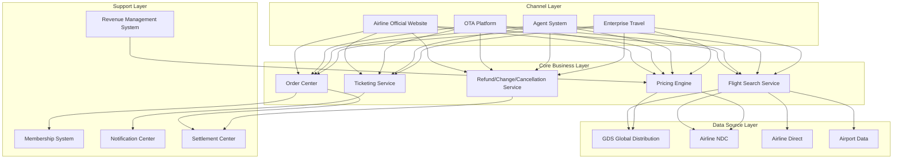
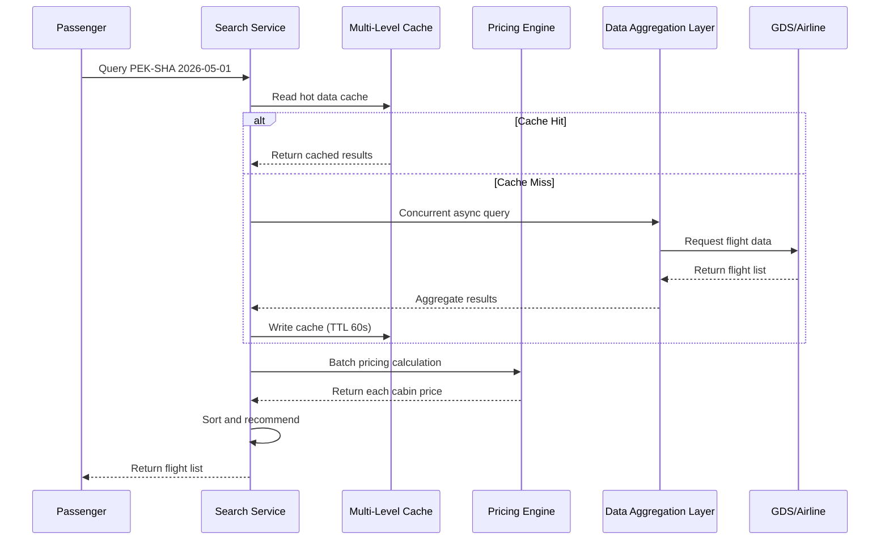
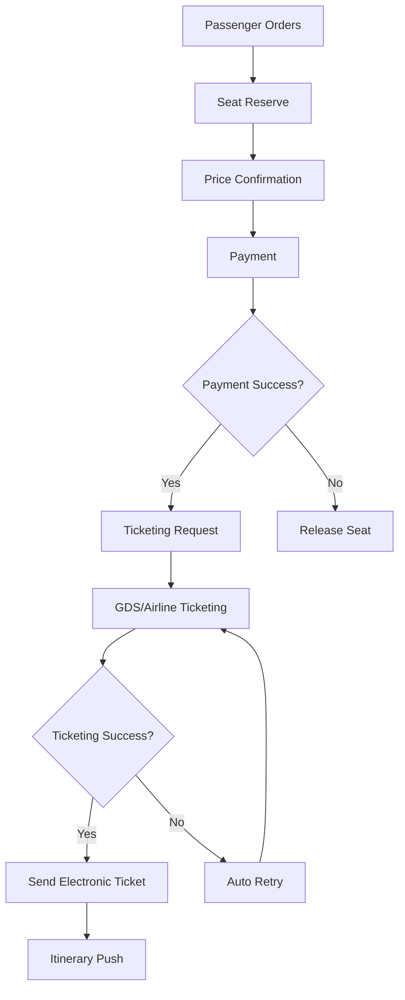

---title: Aviation Travel Architecture Design — Alibaba Cloud Perspective
description: 'Aviation Travel Architecture Design'
summary: 'Aviation Travel Architecture Design'
category: general
tags:
- architecture
- best-practice
- redis
- mysql
- statefulset
- operator
- rag
tier: supporting
created: '2026-05-23'
last_updated: 2026-05
difficulty: intermediate
reading_level: intermediate
audience:
- All engineers
estimated_read_time: 15min
intent_queries:
- What is aviation travel architecture design — Alibaba Cloud perspective
- How to design aviation travel architecture — Alibaba Cloud perspective
- Kubernetes 20 application patterns best practices
trigger_keywords:
- Aviation travel architecture design
- Alibaba Cloud perspective
- application
- patterns
prerequisites:
- kubectl-basics
- prometheus-basics
- redis-basics
- mysql-basics
original_language: Chinese
authors:
- name: Dillan Teagle
  role: contributor
source_path: /Users/teaglebuilt/github/teaglebuilt/knowledge/tree/application/architecture/aviation-travel.md
---

> **Production Environment Security Notice**
>
> This document contains directly executable operation and maintenance commands. Before execution, please confirm: whether the current target cluster and Namespace are correct; whether you have sufficient RBAC permissions; whether you have verified in a non-production environment. Command risk levels are marked: Red (high risk - may cause data loss or service interruption), Yellow (medium risk - modifies cluster state but usually reversible), Green (low risk/read-only - information collection with no side effects).

title: Aviation Travel Architecture Design
description: '# Aviation Travel Architecture Design — Alibaba Cloud Perspective'
category: application-architecture
tags:
- k8s
- architecture
- industry
- redis
- mysql
- [[StatefulSet|statefulset]]
- operator
last_updated: '2026-05-18'
difficulty: advanced
reading_level: advanced
audience:
- Aviation industry architects
- Ticketing system developers
- Cloud-native engineers
- Solution architects
estimated_read_time: 5min
intent_queries:
- Aviation travel system high-concurrency query architecture design
- GDS global distribution system K8s deployment
- Airline pricing engine dynamic pricing implementation
- Aviation overselling control and inventory consistency
- Flight booking order ticketing microservice architecture
trigger_keywords:
- Aviation travel
- GDS
- Flight booking
- Pricing engine
- Flight search
- NDC
- Revenue management
- Overselling control
- Electronic ticket
- Refund/Change/Cancellation
related_domains:
- domain-01-cluster-fundamentals
- domain-7-observability
- domain-8-storage
- domain-03-networking-traffic
related_topics:
- domain-20-application-patterns/topic-application-architecture/12-smart-logistics-architecture
- domain-20-application-patterns/topic-application-architecture/17-saas-multitenant-architecture
- domain-02-workloads-applications/topic-functions/04-high-concurrency-system
- domain-02-workloads-applications/topic-functions/07-distributed-transaction
k8s_versions:
- '1.28'
- '1.29'
- '1.30'
- '1.31'
- '1.32'
---

# Aviation Travel Architecture Design — Alibaba Cloud Perspective

> **Applicable Versions**: Kubernetes v1.29 - v1.33 | **Last Updated**: 2026-04-24
> **Authors**: Alibaba Cloud Solution Architects | **Tags**: `#Aviation` `#Ticketing` `#GDS` `#RevenueManagement` `#AlibabCloud`

---

## Table of Contents

1. [Industry Background](#1-industry-background)
2. [Business Architecture](#2-business-architecture)
3. [Technical Architecture](#3-technical-architecture)
4. [Core Data Flow](#4-core-data-flow)
5. [Security and Compliance](#5-security-and-compliance)
6. [Observability](#6-observability)
7. [Alibaba Cloud Component Mapping](#7-alibaba-cloud-component-mapping)
8. [Production Checklist](#8-production-checklist)

---

## 1. Industry Background

### 1.1 Business Characteristics

Aviation travel systems face challenges of high-concurrency queries, complex pricing calculations, real-time inventory synchronization:

| Challenge | Description | Architecture Impact |
|:---|:---|:---|
| High-Concurrency Queries | Flight query QPS 100k+ | Multi-level caching + asynchronous processing |
| Dynamic Pricing | Multi-dimensional pricing by cabin/date/route | Rules engine + cache warming |
| Inventory Consistency | Overselling control + real-time sync | Distributed transaction + locking mechanism |
| Complex Refund/Change/Cancellation | Multi-rule combination calculation | Workflow engine |
| Multi-Source Data | GDS/airline direct/OTA | Data aggregation layer |

### 1.2 Core Scenarios

- **Flight Search**: Multi-dimensional flight query and recommendation
- **Pricing Calculation**: Real-time cabin pricing and tax calculation
- **Order Ticketing**: Seat locking + payment + ticketing process
- **Revenue Management**: Dynamic pricing and overselling optimization
- **Flight Dynamics**: Real-time delay/cancellation notification

---

## 2. Business Architecture

### 2.1 Aviation Travel Full-Landscape Architecture



### 2.2 Flight Search Timeline



---

## 3. Technical Architecture

### 3.1 K8s Deployment

```yaml
# Flight Search Service Deployment
apiVersion: apps/v1
kind: Deployment
metadata:
  name: flight-search
  namespace: aviation
spec:
  replicas: 10
  selector:
    matchLabels:
      app: flight-search
  template:
    metadata:
      labels:
        app: flight-search
    spec:
      affinity:
        podAntiAffinity:
          preferredDuringSchedulingIgnoredDuringExecution:
            - weight: 100
              podAffinityTerm:
                labelSelector:
                  matchExpressions:
                    - key: app
                      operator: In
                      values: [flight-search]
                topologyKey: topology.kubernetes.io/zone
      containers:
        - name: search
          image: registry.cn-hangzhou.aliyuncs.com/aviation/flight-search:v3.1.0
          ports:
            - containerPort: 8080
          env:
            - name: REDIS_CLUSTER
              value: "redis-cluster:6379"
            - name: CACHE_TTL_SECONDS
              value: "60"
            - name: GDS_TIMEOUT_MS
              value: "3000"
          resources:
            requests:
              memory: "2Gi"
              cpu: "1000m"
            limits:
              memory: "4Gi"
              cpu: "2000m"
```

```yaml
# Pricing Engine StatefulSet
apiVersion: apps/v1
kind: StatefulSet
metadata:
  name: fare-engine
  namespace: aviation
spec:
  serviceName: fare-engine
  replicas: 3
  selector:
    matchLabels:
      app: fare-engine
  template:
    metadata:
      labels:
        app: fare-engine
    spec:
      containers:
        - name: engine
          image: registry.cn-hangzhou.aliyuncs.com/aviation/fare-engine:v2.5.0
          ports:
            - containerPort: 8080
          env:
            - name: RULES_REFRESH_INTERVAL
              value: "300"
          resources:
            requests:
              memory: "4Gi"
              cpu: "2000m"
            limits:
              memory: "8Gi"
              cpu: "4000m"
```

---

## 4. Core Data Flow

### 4.1 Ticketing Process



---

## 5. Security and Compliance

- **PCI-DSS**: Payment data compliance
- **IATA Standard**: NDC/ONE Order standard interface
- **Data Security**: Passenger PNR data encryption

---

## 6. Observability

- **Search Response**: P99 < 200ms
- **Ticketing Success Rate**: > 99.9%
- **System Availability**: 99.99%

---

## 7. Alibaba Cloud Component Mapping

| Functional Domain | **Alibaba Cloud Cloud-Native Solution** |
|:---|:---|
| Container Platform | **ACK Pro** |
| Cache | **Redis Enterprise Edition** |
| Database | **PolarDB MySQL** |
| Message Queue | **RocketMQ** |
| Search | **OpenSearch** |
| Observability | **ARMS + SLS** |

---

## 8. Production Checklist

- [ ] GDS interface connectivity verification
- [ ] Pricing cache consistency verification
- [ ] Overselling control strategy verification
- [ ] Refund/Change/Cancellation rules end-to-end testing
- [ ] Flight dynamics notification latency < 30s

---

**Maintainers**: Alibaba Cloud Solution Architects Team | **License**: MIT

---

## Obsidian Related Documents

- topic-application-architecture MOC
- [[domain-20-application-patterns/topic-application-architecture/README.md|Topic Application Layer Architecture Design Best Practices]]
- [[domain-20-application-patterns/topic-application-architecture/01-ecommerce-architecture.md|E-commerce System Kubernetes Production Architecture Design]]
- [[domain-20-application-patterns/topic-application-architecture/02-mini-program-architecture.md|Mini Program Platform Architecture Design]]
- [[domain-20-application-patterns/topic-application-architecture/03-cms-architecture.md|Content Management System CMS Architecture Design]]
- [[domain-20-application-patterns/topic-application-architecture/04-im-rtc-architecture.md|Real-Time Communication IM/RTC Architecture Design]]
- [[domain-20-application-patterns/topic-application-architecture/05-online-education-architecture.md|Online Education Platform Kubernetes Production Architecture Design]]
- [[domain-20-application-patterns/topic-application-architecture/06-fintech-architecture.md|FinTech Kubernetes Production Architecture Design]]
- [[domain-20-application-patterns/topic-application-architecture/07-iot-platform-architecture.md|IoT Platform Architecture Design]]
- [[domain-20-application-patterns/topic-application-architecture/08-ai-ml-inference-architecture.md|AI/ML Inference Service Kubernetes Production Architecture Design]]
- [[domain-20-application-patterns/topic-application-architecture/09-gaming-backend-architecture.md|Gaming Backend Kubernetes Production Architecture Design]]
- [[domain-20-application-patterns/topic-application-architecture/10-social-media-architecture.md|Social Media Platform Kubernetes Production Architecture Design]]

## See Also

- 24-insurtech
- 25-quantitative-trading
- 27-hospitality-tourism
- 28-proptech


<!-- risk-assessed -->
