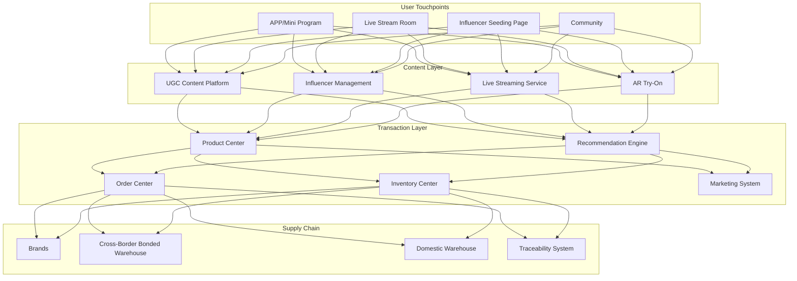
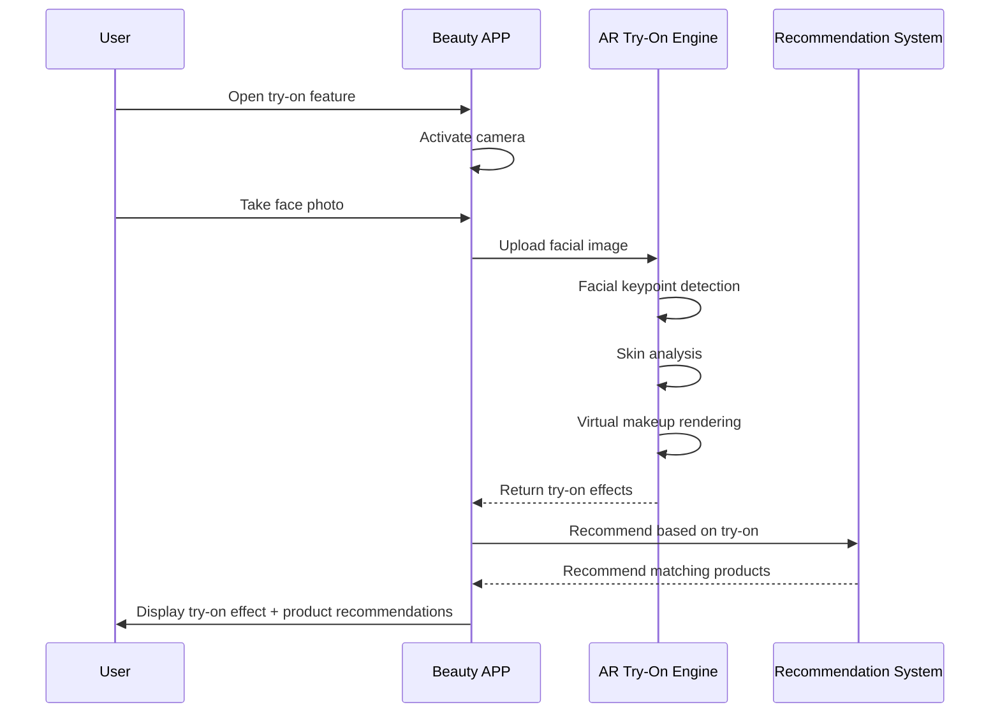

---title: Beauty E-commerce Architecture Design — Alibaba Cloud Perspective
description: 'Beauty E-commerce Architecture Design'
summary: 'Beauty E-commerce Architecture Design'
category: general
tags:
- architecture
- best-practice
- redis
- mysql
- hpa
- operator
- rag
tier: supporting
created: '2026-05-23'
last_updated: 2026-05
difficulty: intermediate
reading_level: intermediate
audience:
- All engineers
estimated_read_time: 5min
intent_queries:
- What is beauty e-commerce architecture design — Alibaba Cloud perspective
- How to design beauty e-commerce architecture — Alibaba Cloud perspective
- Kubernetes 20 application patterns best practices
trigger_keywords:
- Beauty e-commerce architecture design
- Alibaba Cloud perspective
- application
- patterns
prerequisites:
- kubectl-basics
- prometheus-basics
- redis-basics
- mysql-basics
original_language: Chinese
authors:
- name: Dillan Teagle
  role: contributor
source_path: /Users/teaglebuilt/github/teaglebuilt/knowledge/tree/application/architecture/beauty-ecommerce.md
---

> **Production Environment Security Notice**
>
> This document contains directly executable operation and maintenance commands. Before execution, please confirm: whether the current target cluster and Namespace are correct; whether you have sufficient RBAC permissions; whether you have verified in a non-production environment. Command risk levels are marked: Red (high risk), Yellow (medium risk), Green (low risk/read-only).

title: Beauty E-commerce Architecture Design
description: '# Beauty E-commerce Architecture Design — Alibaba Cloud Perspective'
category: application-architecture
tags:
- k8s
- architecture
- industry
- redis
- mysql
- hpa
- operator
- rag
last_updated: 2026-05-18
difficulty: intermediate
reading_level: intermediate
audience:
- E-commerce architects
- Cloud-native engineers
- SRE
- Solution architects
estimated_read_time: 5min
intent_queries:
- Alibaba Cloud beauty e-commerce solution live streaming K8s deployment
- Beauty e-commerce AR virtual try-on Kubernetes architecture
- Cross-border beauty bonded warehouse e-commerce architecture
- Personalized recommendation beauty e-commerce technical architecture
- Blockchain traceability cosmetics anti-counterfeiting architecture
trigger_keywords:
- Beauty e-commerce
- Content seeding
- Live streaming commerce
- AR virtual try-on
- Personalized recommendation
- Authentic product traceability
- Cross-border bonded
- Alibaba Cloud
related_domains:
- domain-01-cluster-fundamentals
- domain-11-production-operations
- domain-11-ai-infra
related_topics:
- 01-ecommerce-architecture
- 31-instant-retail
- 55-crossborder-dtc
k8s_versions:
- '1.28'
- '1.29'
- '1.30'
- '1.31'
- '1.32'
---

# Beauty E-commerce Architecture Design — Alibaba Cloud Perspective

> **Applicable Versions**: Kubernetes v1.29 - v1.33 | **Last Updated**: 2026-04-24
> **Authors**: Alibaba Cloud Solution Architects | **Tags**: `#BeautyEcommerce` `#ContentSeeding` `#LiveCommerce` `#AlibabCloud`

---

## Table of Contents

1. [Industry Background](#1-industry-background)
2. [Business Architecture](#2-business-architecture)
3. [Technical Architecture](#3-technical-architecture)
4. [Core Data Flow](#4-core-data-flow)
5. [Security and Compliance](#5-security-and-compliance)
6. [Observability](#6-observability)
7. [Alibaba Cloud Component Mapping](#7-alibaba-cloud-component-mapping)
8. [Production Checklist](#8-production-checklist)

---

## 1. Industry Background

### 1.1 Business Characteristics

Beauty e-commerce combines content seeding, live streaming commerce, personalized recommendations:

| Challenge | Description | Architecture Impact |
|:---|:---|:---|
| Content-Driven | Image/video content to product conversion | Content platform + CDN |
| Personalization | Skin type/complexion/preference differences | AI recommendation + smart try-on |
| Live Commerce Burst | 100x traffic spikes during events | Elastic scaling + warming |
| Counterfeit Risk | Cosmetics counterfeits widespread | Traceability + authenticity verification |
| Ingredient Compliance | Cosmetics regulations differ by country | Compliance engine |

### 1.2 Core Scenarios

- **Content Seeding**: UGC image/video + influencer recommendations
- **AI Virtual Try-On**: AR virtual makeup/color try-on
- **Live Commerce**: Beauty specialist livestreams
- **Personalized Recommendation**: Skin type/preference based product recommendations
- **Authentic Product Traceability**: Brand-to-consumer full-chain tracking

---

## 2. Business Architecture

### 2.1 Beauty E-commerce Full-Landscape Architecture



### 2.2 AI Virtual Try-On Timeline



---

## 3. Technical Architecture

### 3.1 K8s Deployment

```yaml
# Recommendation Engine Deployment
apiVersion: apps/v1
kind: Deployment
metadata:
  name: beauty-recommend
  namespace: beauty-ecommerce
spec:
  replicas: 8
  selector:
    matchLabels:
      app: beauty-recommend
  template:
    metadata:
      labels:
        app: beauty-recommend
    spec:
      containers:
        - name: recommend
          image: registry.cn-hangzhou.aliyuncs.com/beauty/recommend:v3.0.0
          ports:
            - containerPort: 8080
          env:
            - name: MODEL_PATH
              value: "/models/beauty-rec-v2"
            - name: REDIS_CLUSTER
              value: "redis-cluster:6379"
          resources:
            requests:
              memory: "4Gi"
              cpu: "2000m"
            limits:
              memory: "8Gi"
              cpu: "4000m"
```

```yaml
# Live Streaming Service HPA
apiVersion: autoscaling/v2
kind: HorizontalPodAutoscaler
metadata:
  name: live-stream-hpa
  namespace: beauty-ecommerce
spec:
  scaleTargetRef:
    apiVersion: apps/v1
    kind: Deployment
    name: live-stream-service
  minReplicas: 5
  maxReplicas: 100
  metrics:
    - type: Resource
      resource:
        name: cpu
        target:
          type: Utilization
          averageUtilization: 70
    - type: Pods
      pods:
        metric:
          name: concurrent_viewers
        target:
          type: AverageValue
          averageValue: "500"
```

---

## 4. Core Data Flow

### 4.1 Content-Conversion-Repurchase Closed Loop


---

## 5. Security and Compliance

- **Authentic Traceability**: Blockchain product traceability
- **Ingredient Compliance**: Multi-country cosmetics ingredient regulations
- **User Privacy**: Facial image data protection

---

## 6. Observability

- **Try-On Response**: P99 < 2s
- **Live Streaming Buffering**: < 1%
- **Recommendation CTR**: > 10%

---

## 7. Alibaba Cloud Component Mapping

| Functional Domain | **Alibaba Cloud Cloud-Native Solution** |
|:---|:---|
| Container Platform | **ACK Pro** |
| AI Virtual Try-On | **PAI / Visual Intelligence** |
| Live Streaming | **Video Live + CDN** |
| Database | **PolarDB MySQL** |
| Cache | **Redis Enterprise Edition** |
| Object Storage | **OSS + CDN** |
| Blockchain | **Ant Chain BaaS** |
| Observability | **ARMS + SLS** |

---

## 8. Production Checklist

- [ ] AR try-on accuracy verification
- [ ] Live streaming elastic scaling pressure test
- [ ] Authentic product traceability chain completeness
- [ ] Ingredient compliance database updates
- [ ] Facial image privacy encryption

---

**Maintainers**: Alibaba Cloud Solution Architects Team | **License**: MIT

---

## Obsidian Related Documents

- topic-application-architecture KUDIG Database — Global MOC
- [[domain-20-application-patterns/topic-application-architecture/README.md|Topic Application Layer Architecture Design Best Practices]]
- [[domain-20-application-patterns/topic-application-architecture/01-ecommerce-architecture.md|E-commerce System Kubernetes Production Architecture Design]]
- [[domain-20-application-patterns/topic-application-architecture/02-mini-program-architecture.md|Mini Program Platform Architecture Design]]
- [[domain-20-application-patterns/topic-application-architecture/03-cms-architecture.md|Content Management System CMS Architecture Design]]

## See Also

- 39-smart-campus
- 40-cloud-gaming
- 42-secondhand-circular
- 43-enterprise-im


<!-- risk-assessed -->
