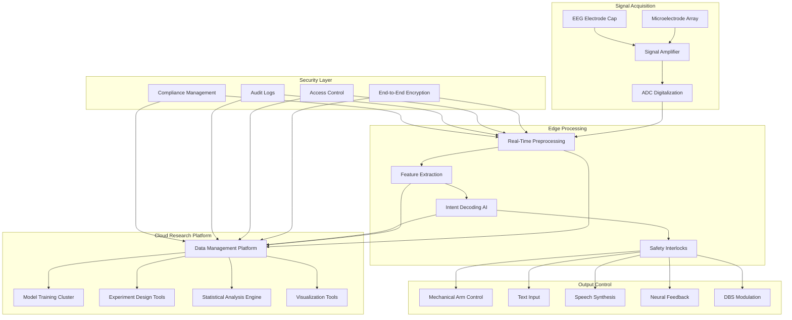

---title: Brain-Computer Interface Architecture Design — Alibaba Cloud Perspective
description: 'Brain-Computer Interface Architecture Design'
summary: 'Brain-Computer Interface Architecture Design'
category: general
tags:
- architecture
- best-practice
- opa
- job
- ingress
- rbac
- networkpolicy
- gpu
- nvidia
tier: supporting
created: '2026-05-23'
last_updated: 2026-05
difficulty: intermediate
reading_level: intermediate
audience:
- All engineers
estimated_read_time: 15min
intent_queries:
- What is brain-computer interface architecture design — Alibaba Cloud perspective
- How to design brain-computer interface architecture — Alibaba Cloud perspective
- Kubernetes 20 application patterns best practices
trigger_keywords:
- Brain-computer interface architecture design
- Alibaba Cloud perspective
- application
- patterns
prerequisites:
- kubectl-basics
- prometheus-basics
- gpu-scheduling-basics
- policy-basics
original_language: Chinese
authors:
- name: Dillan Teagle
  role: contributor
source_path: /Users/teaglebuilt/github/teaglebuilt/knowledge/tree/application/architecture/brain-computer-interface.md
---

> **Production Environment Security Notice**
>
> This document contains directly executable operation and maintenance commands. Before execution, please confirm: whether the current target cluster and Namespace are correct; whether you have sufficient RBAC permissions; whether you have verified in a non-production environment. Command risk levels are marked: Red (high risk), Yellow (medium risk), Green (low risk/read-only).

title: Brain-Computer Interface Architecture Design
description: '# Brain-Computer Interface Architecture Design — Alibaba Cloud Perspective'
category: application-architecture
tags:
- k8s
- architecture
- industry
- opa
- job
- [[Ingress|ingress]]
- rbac
- [[NetworkPolicy|networkpolicy]]
- gpu
- nvidia
last_updated: 2026-05-18
difficulty: expert
reading_level: expert
audience:
- BCI system architects
- Neuroscience computing researchers
- Medical AI developers
- Alibaba Cloud AI solution architects
estimated_read_time: 5min
intent_queries:
- Brain-computer interface BCI neural signal processing architecture
- Motor imagery decoding AI model deployment
- Neural signal real-time processing edge computing
- BCI data encryption privacy computing
- Brain-computer interface medical rehabilitation system
trigger_keywords:
- Brain-computer interface
- BCI
- Neural signal
- EEG
- Motor imagery
- Neuromodulation
- EEG signal
- Intent decoding
- Medical rehabilitation
- Cognitive enhancement
related_domains:
- domain-7-ai-ml-platform
- domain-9-security-compliance
- domain-03-networking-traffic
related_topics:
- domain-20-application-patterns/topic-application-architecture/90-neuromorphic-computing
- domain-20-application-patterns/topic-application-architecture/56-smart-elderly-care
k8s_versions:
- '1.28'
- '1.29'
- '1.30'
- '1.31'
- '1.32'
---

# Brain-Computer Interface Architecture Design — Alibaba Cloud Perspective

> **Applicable Versions**: Kubernetes v1.29 - v1.33 | **Last Updated**: 2026-05-18
> **Authors**: Alibaba Cloud Solution Architects | **Tags**: `#BCI` `#NeuralSignal` `#Neuralink` `#AlibabCloud`

---

## Table of Contents

1. [Overview](#1-overview)
2. [Design Principles](#2-design-principles)
3. [Architecture Patterns](#3-architecture-patterns)
4. [Implementation Examples](#4-implementation-examples)
5. [Kubernetes Deployment](#5-kubernetes-deployment)
6. [Best Practices](#6-best-practices)
7. [Anti-Patterns](#7-anti-patterns)
8. [Reference Resources](#8-reference-resources)

---

## 1. Overview

Brain-Computer Interface (BCI) establishes direct communication channels between the brain and external devices. BCI does not depend on peripheral nerves and muscles but directly interprets user intent from neural signals, or delivers external information directly to the brain. BCI technology has revolutionary applications in medical rehabilitation, assistive communication, neuromodulation, and cognitive enhancement.

BCI systems classify by signal acquisition method: non-invasive (EEG scalp electrodes), semi-invasive (ECoG subdural electrodes), invasive (microelectrode arrays implanted in cortex, like Neuralink N1 chip). Signal quality correlates with invasiveness: non-invasive has low SNR but is safe; invasive achieves high signal quality but requires surgery.

BCI information processing chain includes: signal acquisition (microvolt-level neural signals), amplification/digitalization (24-bit ADC, 20kHz sampling), preprocessing (50Hz notch, muscle artifact removal), feature extraction (band power, temporal features, spatial filtering), intent decoding (classification/regression models), output control (mechanical arm, text input, speech synthesis). The complete pipeline requires millisecond latency, demanding extreme real-time and reliability.

Cloud-native architecture applies to: research platforms (data management, model training, experiment design) and cloud analysis (large-scale neural data analysis, AI model training). Real-time decoding must complete at edge devices (< 50ms latency), cloud handles offline analysis and model optimization.

## 1.1 Industry Background

| Challenge | Description | Architecture Impact |
|:---|:---|:---|
| Signal Acquisition | Microvolt-level neural signals (5-500μV) | High-precision ADC + denoising |
| Real-Time Decoding | Millisecond-level intent decoding (< 50ms) | Edge AI + dedicated hardware |
| Individual Differences | Substantial signal variation across users | Personalized models + transfer learning |
| Data Privacy | Neural data extremely sensitive | End-to-end encryption + federated learning |
| Medical Compliance | Implantable devices Class III | Clinical trials + regulatory approval |

## 1.2 Core Scenarios

- **Medical Rehabilitation**: Paralyzed patients control mechanical arms, wheelchairs, computer cursors via BCI
- **Assistive Communication**: ALS patients perform text input and speech synthesis through BCI
- **Neuromodulation**: Parkinson's DBS, epilepsy prediction and intervention
- **Cognitive Enhancement**: Attention monitoring, memory assistance, emotional regulation
- **Human-Machine Interaction**: Mind-controlled devices, immersive VR/AR interaction

---

## 2. Design Principles

## 2.1 Real-Time Priority

BCI real-time performance directly affects user experience and safety. Motor imagery decoding latency must < 100ms, users perceive obvious control delay otherwise. Neuromodulation (epilepsy detection/stimulation) requires even lower latency (< 10ms). System design places real-time decoding on edge devices using specialized hardware (DSP/FPGA/GPU) for inference acceleration.

## 2.2 Privacy Protection

Neural signals are humans' most private data, containing thought activities, emotional states, subconscious information. BCI systems must establish strict privacy mechanisms: data end-to-end encryption, local processing priority, data upload minimization, user informed consent. Employ federated learning to achieve cross-user model optimization without sharing raw data.

## 2.3 Personalization Adaptation

Each person's brain signal patterns are unique, no universal BCI decoding model exists. System design supports rapid personalization calibration: new users need 10-30 minutes calibration data to achieve usable decoding; models continuously learn and adapt to user signal changes during use; transfer learning techniques leverage existing user data to accelerate new user calibration.

## 2.4 Safety Reliability

Implantable BCI lives in the human body, safety is life-critical. System design requires: hardware passes biocompatibility certification; implanted devices support wireless charging and data transmission; devices implement fail-safe modes; software meets medical device software (SaMD) quality standards.

---

## 3. Architecture Patterns

## 3.1 BCI System Full-Landscape Architecture



---

## 4. Implementation Examples

## 4.1 Neural Signal Preprocessing and Feature Extraction

```python
import numpy as np
from scipy import signal as sp_signal
from scipy.signal import butter, filtfilt, iirnotch

class NeuralSignalProcessor:
    def __init__(self, sampling_rate: int = 2048,
                 n_channels: int = 256):
        self.fs = sampling_rate
        self.n_channels = n_channels

    def preprocess(self, raw_signal: np.ndarray) -> np.ndarray:
        processed = self._notch_filter(raw_signal, freq=50)
        processed = self._bandpass_filter(processed, low=1.0, high=100.0)
        processed = self._remove_artifacts(processed)
        return processed

    def _notch_filter(self, data: np.ndarray,
                       freq: float = 50.0) -> np.ndarray:
        quality_factor = 30.0
        b, a = iirnotch(freq, quality_factor, self.fs)
        return filtfilt(b, a, data, axis=0)

    def extract_features(self, preprocessed: np.ndarray) -> dict:
        bands = {
            'delta': (1, 4),
            'theta': (4, 8),
            'alpha': (8, 13),
            'beta': (13, 30),
            'gamma': (30, 100),
        }

        features = {}
        for band_name, (low, high) in bands.items():
            b, a = butter(4, [low / (self.fs/2), high / (self.fs/2)],
                          btype='band')
            filtered = filtfilt(b, a, preprocessed, axis=0)
            power = np.mean(filtered ** 2, axis=0)
            features[f'{band_name}_power'] = power

        return features
```

## 4.2 Motor Imagery Decoder

```python
import numpy as np
from sklearn.discriminant_analysis import LinearDiscriminantAnalysis
from typing import Tuple

class MotorImageryDecoder:
    def __init__(self, n_classes: int = 4, sampling_rate: int = 2048):
        self.n_classes = n_classes
        self.fs = sampling_rate
        self.processor = NeuralSignalProcessor(sampling_rate)
        self.classifier = LinearDiscriminantAnalysis()
        self.trained = False

    def calibrate(self, calibration_data: np.ndarray,
                   labels: np.ndarray) -> dict:
        n_trials = calibration_data.shape[0]
        all_features = []

        for i in range(n_trials):
            trial = calibration_data[i]
            features = self._extract_trial_features(trial)
            all_features.append(features)

        X = np.array(all_features)
        self.classifier.fit(X, labels)
        self.trained = True

        train_acc = self.classifier.score(X, labels)
        return {
            'training_accuracy': train_acc,
            'n_trials': n_trials,
            'n_classes': len(np.unique(labels)),
        }

    def decode(self, neural_signal: np.ndarray) -> Tuple[int, float]:
        if not self.trained:
            raise RuntimeError("Decoder not calibrated")

        features = self._extract_trial_features(neural_signal)
        X = features.reshape(1, -1)
        prediction = self.classifier.predict(X)[0]
        probabilities = self.classifier.predict_proba(X)[0]
        confidence = float(np.max(probabilities))

        return int(prediction), confidence

    def _extract_trial_features(self, trial: np.ndarray) -> np.ndarray:
        preprocessed = self.processor.preprocess(trial)
        features = self.processor.extract_features(preprocessed)

        band_features = np.concatenate([
            features['delta_power'],
            features['theta_power'],
            features['alpha_power'],
            features['beta_power'],
            features['gamma_power'],
        ])

        return band_features
```

---

## 5. Kubernetes Deployment

## 5.1 Neural Signal Processing Service

```yaml
apiVersion: apps/v1
kind: Deployment
metadata:
  name: neural-signal-processor
  namespace: bci
  labels:
    app: neural-signal-processor
    tier: research
spec:
  replicas: 2
  selector:
    matchLabels:
      app: neural-signal-processor
  template:
    metadata:
      labels:
        app: neural-signal-processor
    spec:
      nodeSelector:
        accelerator: nvidia-t4
      runtimeClassName: nvidia
      containers:
        - name: processor
          image: registry.cn-hangzhou.aliyuncs.com/bci/neural-processor:v2.0.0-gpu
          ports:
            - containerPort: 8080
          env:
            - name: SAMPLING_RATE_HZ
              value: "2048"
            - name: CHANNEL_COUNT
              value: "256"
            - name: MODEL_PATH
              value: "/models/decoder-v3"
            - name: ENCRYPTION_ENABLED
              value: "true"
          resources:
            requests:
              nvidia.com/gpu: 1
              memory: "8Gi"
              cpu: "4000m"
            limits:
              nvidia.com/gpu: 1
              memory: "16Gi"
              cpu: "8000m"
          volumeMounts:
            - name: models
              mountPath: /models
      volumes:
        - name: models
          persistentVolumeClaim:
            claimName: bci-models-pvc
```

---

## 6. Best Practices

- **High-Precision ADC**: Use 24-bit ADC, sampling rate ≥ 20kHz, effective resolution ≥ 16 bit
- **Data Augmentation**: Enhance training data through temporal jittering, noise injection, channel dropout
- **Cross-Validation**: Use leave-one-trial-out evaluation for model performance assessment
- **Online Learning**: Continuously collect labeled data post-deployment, periodically retrain models

---

## 7. Anti-Patterns

## 7.1 Cloud-Based Real-Time Decoding

Placing real-time decoding in cloud causes network latency resulting in control latency > 200ms, users find unacceptable.

**Solution**: Execute real-time decoding on edge devices (implant chip or external processor) with latency < 50ms. Cloud handles offline analysis and model training.

## 7.2 Universal Decoding Model

Training one universal model for all users, ignoring individual differences.

**Solution**: Build personalized models for each user using transfer learning to reduce calibration time.

## 7.3 Neural Data Plaintext Storage

Storing neural data in plaintext poses serious privacy leakage risks.

**Solution**: All data end-to-end encryption. Edge devices encrypt before transmission, cloud stores encrypted. User controls decryption keys.

---

## 8. Reference Resources

## 8.1 Alibaba Cloud Component Mapping

| Functional Domain | **Alibaba Cloud Cloud-Native Solution** |
|:---|:---|
| Container Platform | **ACK Pro + GPU** |
| AI Platform | **PAI + DSW** |
| Database | **PolarDB** |
| Object Storage | **OSS (Encrypted Storage)** |
| Observability | **ARMS + SLS** |
| Security | **KMS + WAF** |
| Encrypted Computing | **Alibaba Cloud Encrypted Computing (TEE)** |

## 8.2 Production Checklist

- [ ] Neural signal acquisition quality verification (SNR > 10dB)
- [ ] Real-time decoding latency < 50ms end-to-end
- [ ] Decoding accuracy > 90% (4-class motor imagery)
- [ ] Neural data encryption transmission and storage
- [ ] Implant biocompatibility certification
- [ ] Ethics approval and informed consent form
- [ ] Data access control and audit logs
- [ ] Clinical trial protocol approval

---

**Maintainers**: Alibaba Cloud Solution Architects Team | **License**: MIT

---

## Obsidian Related Documents

- topic-application-architecture MOC
- [[domain-20-application-patterns/topic-application-architecture/README.md|Topic Application Layer Architecture Design Best Practices]]

## See Also

- 65-autonomous-driving-sim
- 66-space-internet
- 68-quantum-computing-cloud
- 69-6g-core-network


<!-- risk-assessed -->
