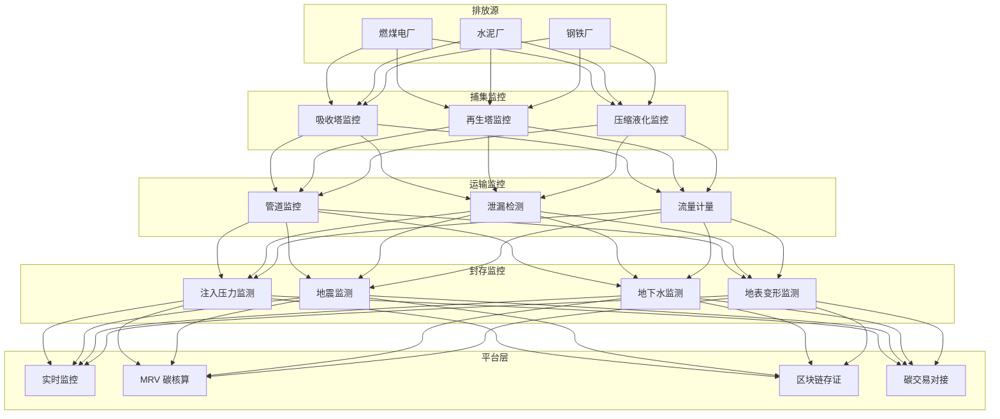

---title: 碳捕集利用与封存（CCUS）架构设计 — 阿里云视角
description: 'title: 碳捕集利用与封存CCUS架构设计'
summary: 'title: 碳捕集利用与封存CCUS架构设计'
category: general
tags:
- architecture
- best-practice
- rag
tier: supporting
created: '2026-05-23'
last_updated: 2026-05
difficulty: intermediate
reading_level: intermediate
audience:
- 所有工程师
estimated_read_time: 5min
intent_queries:
- 碳捕集利用与封存（CCUS）架构设计 — 阿里云视角 是什么
- 如何 碳捕集利用与封存（CCUS）架构设计 — 阿里云视角
- Kubernetes 20 application patterns 最佳实践
trigger_keywords:
- 碳捕集利用与封存
- CCUS
- 架构设计
- 阿里云视角
- application
- patterns
prerequisites:
- kubectl-basics
- prometheus-basics
authors:
- name: Dillan Teagle
  role: contributor

---

> **生产环境安全提示**
>
> 本文档包含可直接执行的运维命令。执行前请确认：当前目标集群与 Namespace 是否正确；是否具备足够的 RBAC 权限；是否已在非生产环境验证。命令风险等级标注：🔴 高风险（可能造成数据丢失或服务中断）、🟡 中风险（会修改集群状态，但通常可回滚）、🟢 低风险/只读（信息收集，无副作用）。


title: 碳捕集利用与封存CCUS架构设计
description: '# 碳捕集利用与封存（CCUS）架构设计 — 阿里云视角'
category: application-architecture
tags:
- k8s
- architecture
- industry
- rag
last_updated: '2026-05-18'
difficulty: advanced
reading_level: advanced
audience:
- 能源行业架构师
- 碳中和解决方案工程师
- 工业互联网开发者
- 阿里云解决方案架构师
estimated_read_time: 5min
intent_queries:
- 碳捕集CCUS系统架构设计
- CCUS区块链MRV碳核算
- CO2封存泄漏监测系统
- AI优化碳捕集工艺
- 碳交易对接架构
trigger_keywords:
- CCUS
- 碳捕集
- 碳封存
- 碳利用
- MRV
- 碳核算
- 区块链存证
- 碳交易
- 地质封存
- DAC
related_domains:
- domain-01-cluster-fundamentals
- domain-9-ai-ml
- domain-03-networking-traffic
- domain-7-observability
related_topics:
- domain-20-application-patterns/topic-application-architecture/61-smart-grid
- domain-20-application-patterns/topic-application-architecture/47-smart-mining
- domain-20-application-patterns/topic-application-architecture/51-smart-manufacturing-mes
- domain-02-workloads-applications/topic-functions/05-iot-edge-computing
k8s_versions:
- '1.28'
- '1.29'
- '1.30'
- '1.31'
- '1.32'
---

# 碳捕集利用与封存（CCUS）架构设计 — 阿里云视角

> **适用版本**: [[Kubernetes|Kubernetes]] v1.29 - v1.33 | **最后更新**: 2026-04-24
> **作者**: 阿里云解决方案架构师 | **标签**: `#CCUS` `#碳捕集` `#碳封存` `#碳利用` `#阿里云`

---

## 目录

1. [概述](#1-概述)
2. [设计原则](#2-设计原则)
3. [架构模式](#3-架构模式)
4. [实现示例](#4-实现示例)
5. [在 Kubernetes 上的部署](#5-在-kubernetes-上的部署)
6. [最佳实践](#6-最佳实践)
7. [反模式](#7-反模式)
8. [参考资源](#8-参考资源)

---

## 1. 概述

碳捕集利用与封存（Carbon Capture, Utilization and Storage，CCUS）是实现碳中和目标不可或缺的关键技术路径。CCUS 将工业排放源（燃煤电厂、水泥厂、钢铁厂、化工厂等）产生的 CO₂ 捕集、运输，要么用于工业利用（化工原料、矿化、强化采油 EOR），要么封存在深层地质构造中（咸水层、废弃油气田），实现 CO₂ 与大气的长期隔离。

CCUS 信息化平台的核心价值在于：**安全监控**（地质封存 CO₂ 泄漏监测、管道安全监控）、**碳核算**（MRV 监测报告核查体系，确保碳减排量可测量、可报告、可核查）、**工艺优化**（AI 优化捕集能耗，降低运行成本）、**碳交易对接**（将核证的碳减排量对接碳交易市场）。

### 1.1 行业背景

| 挑战 | 说明 | 架构影响 |
|:---|:---|:---|
| 高能耗 | 捕集过程能耗高（占发电量 15-30%） | AI 优化控制 + 实时调节 |
| 地质封存 | CO₂ 长期安全封存 1000 年+ | 实时监测网络 + 地质模型 |
| 泄漏风险 | 地下封存 CO₂ 泄漏到地表 | 传感器网格 + 异常检测 |
| 碳核算 | MRV 合规审计 | 区块链存证 + 数据溯源 |
| 经济性 | 高成本制约推广 | 碳交易对接 + 收益优化 |

### 1.2 核心场景

- **燃烧后捕集**: 烟气 CO₂ 化学吸收/膜分离/固体吸附
- **直接空气捕集 DAC**: 从大气中直接提取 CO₂
- **CO₂ 运输**: 管道/槽车/船舶运输监控
- **地质封存**: 咸水层/废弃油气田注入封存与长期监测
- **CO₂ 利用**: 化工原料/矿化/EOR/生物利用

---

## 2. 设计原则

### 2.1 安全第一原则

地质封存的 CO₂ 泄漏可能导致地下水污染、土壤酸化、地表变形等环境风险。监测系统需要 24/7 运行，传感器网络全覆盖，异常检测秒级告警。

### 2.2 数据可信原则

碳减排量的核算需要可审计、不可篡改的数据。采用区块链技术将关键数据（捕集量、运输量、封存量）上链存证，确保 MRV 数据的公信力。

### 2.3 全链条追溯原则

CCUS 涵盖捕集-运输-利用/封存全链条，每吨 CO₂ 从排放源到最终归宿需要全程追溯。建立统一的碳追踪 ID，关联全链条数据。

---

## 3. 架构模式

### 3.1 CCUS 平台全景架构



---

## 4. 实现示例

### 4.1 封存泄漏监测

```python
from dataclasses import dataclass
from typing import List

@dataclass
class SensorReading:
    sensor_id: str
    co2_concentration_ppm: float
    pressure_mpa: float
    temperature_c: float
    timestamp: float

class LeakageDetector:
    BASELINE_PPM = 400

    def detect(self, readings: List[SensorReading]) -> dict:
        alerts = []
        for r in readings:
            if r.co2_concentration_ppm > self.BASELINE_PPM * 1.5:
                alerts.append({
                    'sensor': r.sensor_id,
                    'concentration': r.co2_concentration_ppm,
                    'severity': 'high' if r.co2_concentration_ppm > 1000 else 'medium',
                })

        return {
            'leak_detected': len(alerts) > 0,
            'alerts': alerts,
            'total_sensors': len(readings),
            'anomalous_sensors': len(alerts),
        }
```

---

## 5. 在 Kubernetes 上的部署

```yaml
apiVersion: apps/v1
kind: Deployment
metadata:
  name: ccus-monitoring
  namespace: carbon-capture
spec:
  replicas: 3
  selector:
    matchLabels:
      app: ccus-monitoring
  template:
    metadata:
      labels:
        app: ccus-monitoring
    spec:
      containers:
        - name: monitor
          image: registry.cn-hangzhou.aliyuncs.com/ccus/monitoring:v2.0.0
          env:
            - name: BLOCKCHAIN_ENDPOINT
              value: "http://baas:8080"
            - name: TSDB_ENDPOINT
              value: "lindorm-proxy:8080"
          resources:
            requests:
              memory: "4Gi"
              cpu: "2000m"
            limits:
              memory: "8Gi"
              cpu: "4000m"
```

---

## 6. 最佳实践

- **传感器冗余**: 关键监测点部署多个传感器交叉验证
- **区块链存证**: 捕集量/封存量数据定期上链
- **地质模型更新**: 根据监测数据持续更新地下地质模型
- **AI 工艺优化**: 使用强化学习优化捕集过程能耗

## 7. 反模式

- **忽视长期监测**: 封存后停止监测。应建立 30 年以上的长期监测机制
- **单点传感器**: 关键位置只部署一个传感器。应冗余部署
- **数据不上链**: 碳核算数据存储在中心化数据库，公信力不足。应区块链存证

---

## 8. 参考资源

### 8.1 阿里云组件映射

| 功能域 | **阿里云云原生方案** |
|:---|:---|
| 容器平台 | **ACK Pro** |
| AI | **PAI** |
| 时序数据库 | **Lindorm TSDB** |
| 区块链 | **蚂蚁链 BaaS** |
| 数据库 | **PolarDB** |
| 可观测性 | **ARMS + SLS** |

### 8.2 生产检查清单

- [ ] 捕集效率 > 90%
- [ ] 封存泄漏监测全覆盖
- [ ] MRV 数据上链存证
- [ ] 应急响应预案演练
- [ ] 环境影响评估合规

---

**维护者**: 阿里云解决方案架构师团队 | **许可证**: MIT

---

## Obsidian 相关文档

- topic-application-architecture MOC
- [[domain-20-application-patterns/topic-application-architecture/README.md|Topic 应用层架构设计最佳实践]]
- [[domain-20-application-patterns/topic-application-architecture/01-ecommerce-architecture.md|电商系统 Kubernetes 生产架构设计]]
- [[domain-20-application-patterns/topic-application-architecture/02-mini-program-architecture.md|小程序平台架构设计]]
- [[domain-20-application-patterns/topic-application-architecture/03-cms-architecture.md|内容管理系统 CMS 架构设计]]
- [[domain-20-application-patterns/topic-application-architecture/04-im-rtc-architecture.md|实时通信 IM/RTC 架构设计]]
- [[domain-20-application-patterns/topic-application-architecture/05-online-education-architecture.md|在线教育平台 Kubernetes 生产架构设计]]
- [[domain-20-application-patterns/topic-application-architecture/06-fintech-architecture.md|金融科技FinTech Kubernetes生产架构设计]]
- [[domain-20-application-patterns/topic-application-architecture/07-iot-platform-architecture.md|物联网 IoT 平台架构设计]]
- [[domain-20-application-patterns/topic-application-architecture/08-ai-ml-inference-architecture.md|AI/ML 推理服务 Kubernetes 生产架构设计]]
- [[domain-20-application-patterns/topic-application-architecture/09-gaming-backend-architecture.md|游戏后端 Kubernetes 生产架构设计]]
- [[domain-20-application-patterns/topic-application-architecture/10-social-media-architecture.md|社交媒体平台Kubernetes生产架构设计]]

## See Also

- 94-smart-prison
- 95-industrial-metaverse
- 01-ecommerce-architecture
- 02-mini-program-architecture

## Related

- topic-application-architecture MOC — Cross-reference


<!-- risk-assessed -->
