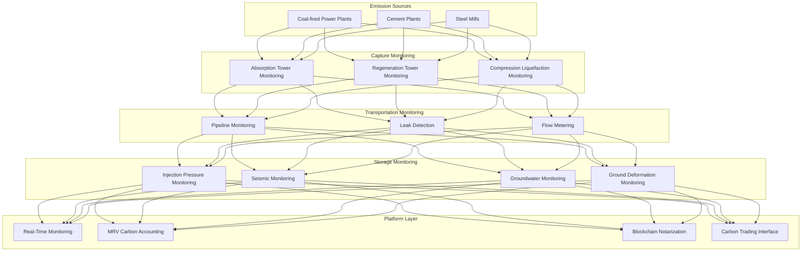

> **Production Environment Security Notice**
>
> This document contains directly executable operation and maintenance commands. Before execution, please confirm: whether the current target cluster and Namespace are correct; whether you have sufficient RBAC permissions; whether you have verified in a non-production environment. Command risk levels are marked: Red (high risk), Yellow (medium risk), Green (low risk/read-only).

# Carbon Capture, Utilization and Storage (CCUS) Architecture Design — Alibaba Cloud Perspective

> **Applicable Versions**: Kubernetes v1.29 - v1.33 | **Last Updated**: 2026-04-24
> **Authors**: Alibaba Cloud Solution Architects | **Tags**: `#CCUS` `#CarbonCapture` `#CarbonStorage` `#CarbonUtilization` `#AlibabCloud`

---

## Table of Contents

1. [Overview](#1-overview)
2. [Design Principles](#2-design-principles)
3. [Architecture Patterns](#3-architecture-patterns)
4. [Implementation Examples](#4-implementation-examples)
5. [Kubernetes Deployment](#5-kubernetes-deployment)
6. [Best Practices](#6-best-practices)
7. [Anti-Patterns](#7-anti-patterns)
8. [Reference Resources](#8-reference-resources)

---

## 1. Overview

Carbon Capture, Utilization and Storage (CCUS) is a critical technology pathway indispensable for achieving carbon neutrality goals. CCUS captures CO₂ from industrial emission sources (coal-fired power plants, cement plants, steel mills, chemical plants, etc.), transports it, either utilizing it in industrial applications (chemical raw materials, mineralization, enhanced oil recovery EOR), or storing it in deep geological formations (saline aquifers, abandoned oil/gas fields), achieving long-term isolation of CO₂ from the atmosphere.

The core value of CCUS informatization platforms lies in: **Safety monitoring** (geological storage CO₂ leak detection, pipeline safety monitoring), **Carbon accounting** (MRV monitoring, reporting, and verification system ensuring carbon reduction is measurable, reportable, and verifiable), **Process optimization** (AI-optimized capture energy consumption, reducing operation costs), **Carbon trading interface** (connecting verified carbon reduction to carbon trading markets).

### 1.1 Industry Background

| Challenge | Description | Architecture Impact |
|:---|:---|:---|
| High Energy Consumption | Capture process consumes high energy (15-30% of power output) | AI optimization + real-time adjustment |
| Geological Storage | Long-term safe CO₂ storage 1000+ years | Real-time monitoring network + geological models |
| Leak Risk | Underground stored CO₂ leaking to surface | Sensor grid + anomaly detection |
| Carbon Accounting | MRV compliance audit | Blockchain notarization + data traceability |
| Economics | High cost limiting promotion | Carbon trading interface + revenue optimization |

### 1.2 Core Scenarios

- **Post-Combustion Capture**: Flue gas CO₂ chemical absorption/membrane separation/solid adsorption
- **Direct Air Capture (DAC)**: Direct extraction of CO₂ from atmosphere
- **CO₂ Transportation**: Pipeline/tanker truck/ship transportation monitoring
- **Geological Storage**: Saline aquifer/abandoned oil/gas field injection and long-term monitoring
- **CO₂ Utilization**: Chemical raw materials/mineralization/EOR/biological utilization

---

## 2. Design Principles

### 2.1 Safety First Principle

Leaked CO₂ from geological storage may cause groundwater contamination, soil acidification, ground deformation and other environmental risks. Monitoring systems must operate 24/7, sensor networks provide full coverage, anomaly detection achieves second-level alerting.

### 2.2 Data Trustworthiness Principle

Carbon reduction accounting requires auditable, tamper-proof data. Employ blockchain technology to notarize key data (capture volume, transportation volume, storage volume), ensuring MRV data credibility.

### 2.3 Full Chain Traceability Principle

CCUS encompasses the entire chain from capture-transportation-utilization/storage. Every ton of CO₂ from emission source to final destination requires full process tracing. Establish unified carbon tracking ID linking full-chain data.

---

## 3. Architecture Patterns

### 3.1 CCUS Platform Full-Landscape Architecture



---

## 4. Implementation Examples

### 4.1 Storage Leak Detection

```python
from dataclasses import dataclass
from typing import List

@dataclass
class SensorReading:
    sensor_id: str
    co2_concentration_ppm: float
    pressure_mpa: float
    temperature_c: float
    timestamp: float

class LeakageDetector:
    BASELINE_PPM = 400

    def detect(self, readings: List[SensorReading]) -> dict:
        alerts = []
        for r in readings:
            if r.co2_concentration_ppm > self.BASELINE_PPM * 1.5:
                alerts.append({
                    'sensor': r.sensor_id,
                    'concentration': r.co2_concentration_ppm,
                    'severity': 'high' if r.co2_concentration_ppm > 1000 else 'medium',
                })

        return {
            'leak_detected': len(alerts) > 0,
            'alerts': alerts,
            'total_sensors': len(readings),
            'anomalous_sensors': len(alerts),
        }
```

---

## 5. Kubernetes Deployment

```yaml
apiVersion: apps/v1
kind: Deployment
metadata:
  name: ccus-monitoring
  namespace: carbon-capture
spec:
  replicas: 3
  selector:
    matchLabels:
      app: ccus-monitoring
  template:
    metadata:
      labels:
        app: ccus-monitoring
    spec:
      containers:
        - name: monitor
          image: registry.cn-hangzhou.aliyuncs.com/ccus/monitoring:v2.0.0
          env:
            - name: BLOCKCHAIN_ENDPOINT
              value: "http://baas:8080"
            - name: TSDB_ENDPOINT
              value: "lindorm-proxy:8080"
          resources:
            requests:
              memory: "4Gi"
              cpu: "2000m"
            limits:
              memory: "8Gi"
              cpu: "4000m"
```

---

## 6. Best Practices

- **Sensor Redundancy**: Deploy multiple sensors at critical monitoring points for cross-verification
- **Blockchain Notarization**: Regularly notarize capture/storage volume data on-chain
- **Geological Model Updates**: Continuously update underground geological models based on monitoring data
- **AI Process Optimization**: Use reinforcement learning to optimize capture process energy consumption

## 7. Anti-Patterns

- **Ignoring Long-Term Monitoring**: Stopping monitoring after storage. Should establish 30+ year long-term monitoring mechanisms
- **Single-Point Sensors**: Deploying only one sensor at critical locations. Should deploy sensors redundantly
- **Non-Notarized Data**: Storing carbon accounting data in centralized databases with insufficient credibility. Should notarize on blockchain

---

## 8. Reference Resources

### 8.1 Alibaba Cloud Component Mapping

| Functional Domain | **Alibaba Cloud Cloud-Native Solution** |
|:---|:---|
| Container Platform | **ACK Pro** |
| AI | **PAI** |
| Time-Series Database | **Lindorm TSDB** |
| Blockchain | **Ant Chain BaaS** |
| Database | **PolarDB** |
| Observability | **ARMS + SLS** |

### 8.2 Production Checklist

- [ ] Capture efficiency > 90%
- [ ] Storage leak detection full coverage
- [ ] MRV data notarized on-chain
- [ ] Emergency response drills completed
- [ ] Environmental impact assessment compliance

---

**Maintainers**: Alibaba Cloud Solution Architects Team | **License**: MIT

---

## Obsidian Related Documents

- topic-application-architecture MOC
- [[domain-20-application-patterns/topic-application-architecture/README.md|Topic Application Layer Architecture Design Best Practices]]

## See Also

- 94-smart-prison
- 95-industrial-metaverse
- 01-ecommerce-architecture
- 02-mini-program-architecture

<!-- risk-assessed -->
