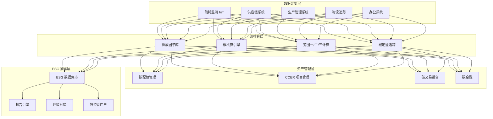
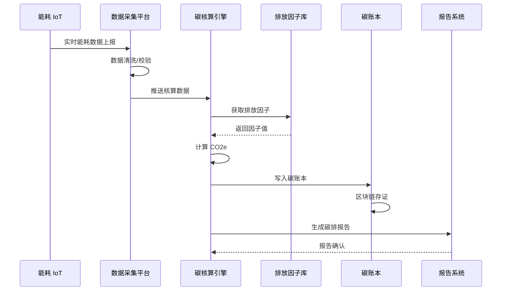
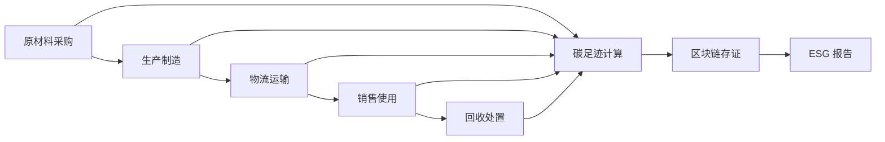

---title: 碳资产管理与 ESG 架构设计 — 阿里云视角
description: 'title: 碳资产管理与 ESG 架构设计'
summary: 'title: 碳资产管理与 ESG 架构设计'
category: general
tags:
- architecture
- best-practice
- postgresql
tier: supporting
created: '2026-05-23'
last_updated: 2026-05
difficulty: intermediate
reading_level: intermediate
audience:
- 所有工程师
estimated_read_time: 5min
intent_queries:
- 碳资产管理与 ESG 架构设计 — 阿里云视角 是什么
- 如何 碳资产管理与 ESG 架构设计 — 阿里云视角
- Kubernetes 20 application patterns 最佳实践
trigger_keywords:
- 碳资产管理与
- ESG
- 架构设计
- 阿里云视角
- application
- patterns
prerequisites:
- kubectl-basics
- prometheus-basics
authors:
- name: Dillan Teagle
  role: contributor

---

> **生产环境安全提示**
>
> 本文档包含可直接执行的运维命令。执行前请确认：当前目标集群与 Namespace 是否正确；是否具备足够的 RBAC 权限；是否已在非生产环境验证。命令风险等级标注：🔴 高风险（可能造成数据丢失或服务中断）、🟡 中风险（会修改集群状态，但通常可回滚）、🟢 低风险/只读（信息收集，无副作用）。


title: 碳资产管理与 ESG 架构设计
description: '# 碳资产管理与 ESG 架构设计 — 阿里云视角'
category: application-architecture
tags:
- k8s
- architecture
- industry
- postgresql
last_updated: 2026-05-18
difficulty: advanced
reading_level: advanced
audience:
- 可持续发展架构师
- 企业数字化转型负责人
- 区块链开发工程师
estimated_read_time: 5min
intent_queries:
- 企业碳中和 [[Kubernetes|Kubernetes]] 碳核算引擎
- 区块链碳排放存证溯源方案
- ESG报告自动化生成系统
- 碳交易与碳资产管理平台
- 供应链碳足迹追踪
trigger_keywords:
- 碳中和
- ESG环境社会治理
- 碳资产管理
- 碳核算
- 碳足迹
- 区块链存证
- 碳交易
- 蚂蚁链BaaS
- 碳信用CCER
related_domains:
- domain-03-networking-traffic
- domain-10-troubleshooting-diagnostics
related_topics:
- topic-blockchain-architecture
- topic-data-midplatform-architecture
k8s_versions:
- '1.28'
- '1.29'
- '1.30'
- '1.31'
- '1.32'
---

# 碳资产管理与 ESG 架构设计 — 阿里云视角

> **适用版本**: Kubernetes v1.29 - v1.33 | **最后更新**: 2026-04-24
> **作者**: 阿里云解决方案架构师 | **标签**: `#碳中和` `#ESG` `#碳资产` `#阿里云`

---

## 目录

1. [行业背景](#1-行业背景)
2. [业务架构](#2-业务架构)
3. [技术架构](#3-技术架构)
4. [核心数据流](#4-核心数据流)
5. [安全与合规](#5-安全与合规)
6. [可观测性](#6-可观测性)
7. [阿里云组件映射](#7-阿里云组件映射)
8. [生产检查清单](#8-生产检查清单)

---

## 1. 行业背景

### 1.1 业务特点

碳资产管理与 ESG（环境、社会、治理）是企业可持续发展的核心：

| 挑战 | 说明 | 架构影响 |
|:---|:---|:---|
| 多源数据采集 | 能耗/排放/供应链碳数据 | IoT + 数据集成 |
| 碳核算复杂 | 范围一/二/三排放计算 | 规则引擎 + 计算模型 |
| 合规报送 | 欧盟 CBAM / 国内碳市场 | 数据血缘 + 审计追踪 |
| 碳交易 | CCER / 碳配额交易 | 区块链存证 |
| ESG 评级 | 多标准框架披露 | 数据集市 + 报告引擎 |

### 1.2 核心场景

- **碳盘查**: 企业全价值链碳排放核算
- **碳监测**: 实时能耗与排放监测
- **碳交易**: 碳配额/CCER 交易管理
- **ESG 报告**: 自动化 ESG 信息披露
- **绿色金融**: 碳足迹与绿色信贷挂钩

---

## 2. 业务架构

### 2.1 碳资产管理全景架构



### 2.2 碳核算流程



---

## 3. 技术架构

### 3.1 K8s 部署

```yaml
# 碳核算引擎 Deployment
apiVersion: apps/v1
kind: Deployment
metadata:
  name: carbon-calculation-engine
  namespace: carbon-esg
spec:
  replicas: 3
  selector:
    matchLabels:
      app: carbon-calculation-engine
  template:
    metadata:
      labels:
        app: carbon-calculation-engine
    spec:
      containers:
        - name: engine
          image: registry.cn-hangzhou.aliyuncs.com/carbon/calc-engine:v2.0.0
          ports:
            - containerPort: 8080
          env:
            - name: EMISSION_FACTOR_DB
              value: "postgresql://carbon-db:5432/factors"
            - name: BLOCKCHAIN_NODE
              value: "http://antchain-baas:8080"
          resources:
            requests:
              memory: "4Gi"
              cpu: "2000m"
            limits:
              memory: "8Gi"
              cpu: "4000m"
```

---

## 4. 核心数据流

### 4.1 供应链碳足迹追踪



---

## 5. 安全与合规

- **数据可信**: 区块链存证防篡改
- **合规报送**: 欧盟 CSRD / 国内碳市场
- **审计追踪**: 全链路数据血缘

---

## 6. 可观测性

- **碳核算延迟**: < 1h
- **数据准确率**: > 99.5%
- **系统可用性**: 99.9%

---

## 7. 阿里云组件映射

| 功能域 | **阿里云云原生方案** |
|:---|:---|
| 容器平台 | **ACK Pro** |
| IoT | **IoT 平台** |
| 数据库 | **PolarDB + Lindorm** |
| 实时计算 | **Flink** |
| 区块链 | **蚂蚁链 BaaS** |
| AI | **PAI** |
| 可观测性 | **ARMS + SLS** |
| 对象存储 | **OSS** |

---

## 8. 生产检查清单

- [ ] 排放因子库版本管理
- [ ] 碳核算模型准确性校验
- [ ] 区块链存证完整性验证
- [ ] ESG 报告自动化生成测试
- [ ] 欧盟 CBAM 数据格式合规

---

**维护者**: 阿里云解决方案架构师团队 | **许可证**: MIT

---

## Obsidian 相关文档

- topic-application-architecture KUDIG Database — Global MOC
- [[domain-20-application-patterns/topic-application-architecture/README.md|[[Topic 应用层架构设计最佳实践|Topic 应用层架构设计最佳实践]]]]
- [[domain-20-application-patterns/topic-application-architecture/01-ecommerce-architecture.md|电商系统 Kubernetes 生产架构设计]]
- [[domain-20-application-patterns/topic-application-architecture/02-mini-program-architecture.md|小程序平台架构设计]]
- [[domain-20-application-patterns/topic-application-architecture/03-cms-architecture.md|内容管理系统 CMS 架构设计]]
- [[domain-20-application-patterns/topic-application-architecture/04-im-rtc-architecture.md|实时通信 IM/RTC 架构设计]]
- [[domain-20-application-patterns/topic-application-architecture/05-online-education-architecture.md|在线教育平台 Kubernetes 生产架构设计]]
- [[domain-20-application-patterns/topic-application-architecture/06-fintech-architecture.md|金融科技FinTech Kubernetes生产架构设计]]
- [[domain-20-application-patterns/topic-application-architecture/07-iot-platform-architecture.md|物联网 IoT 平台架构设计]]
- [[domain-20-application-patterns/topic-application-architecture/08-ai-ml-inference-architecture.md|AI/ML 推理服务 Kubernetes 生产架构设计]]
- [[domain-20-application-patterns/topic-application-architecture/09-gaming-backend-architecture.md|游戏后端 Kubernetes 生产架构设计]]
- [[domain-20-application-patterns/topic-application-architecture/10-social-media-architecture.md|社交媒体平台Kubernetes生产架构设计]]

## See Also

- 34-sportstech
- 35-metaverse-digital-twin
- 37-pet-economy
- 38-supply-chain-finance


<!-- risk-assessed -->
