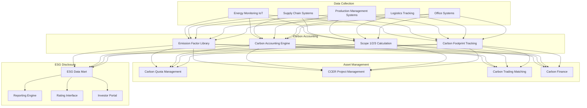
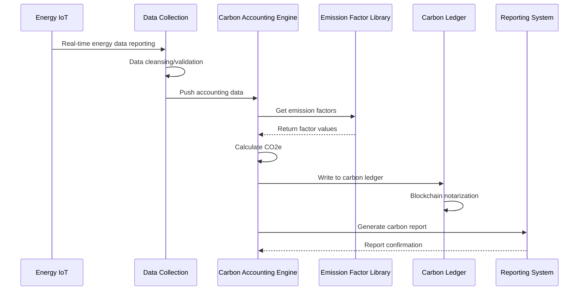
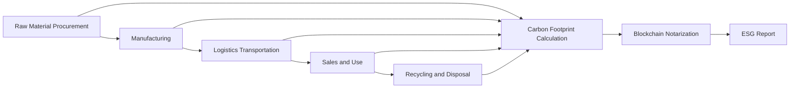

> **Production Environment Security Notice**
>
> This document contains directly executable operation and maintenance commands. Before execution, please confirm: whether the current target cluster and Namespace are correct; whether you have sufficient RBAC permissions; whether you have verified in a non-production environment. Command risk levels are marked: Red (high risk), Yellow (medium risk), Green (low risk/read-only).

# Carbon Asset Management and ESG Architecture Design — Alibaba Cloud Perspective

> **Applicable Versions**: Kubernetes v1.29 - v1.33 | **Last Updated**: 2026-04-24
> **Authors**: Alibaba Cloud Solution Architects | **Tags**: `#CarbonNeutrality` `#ESG` `#CarbonAsset` `#AlibabCloud`

---

## Table of Contents

1. [Industry Background](#1-industry-background)
2. [Business Architecture](#2-business-architecture)
3. [Technical Architecture](#3-technical-architecture)
4. [Core Data Flows](#4-core-data-flows)
5. [Security and Compliance](#5-security-and-compliance)
6. [Observability](#6-observability)
7. [Alibaba Cloud Component Mapping](#7-alibaba-cloud-component-mapping)
8. [Production Checklist](#8-production-checklist)

---

## 1. Industry Background

### 1.1 Business Characteristics

Carbon asset management and ESG (Environment, Social, Governance) are core to enterprise sustainable development:

| Challenge | Description | Architecture Impact |
|:---|:---|:---|
| Multi-Source Data Collection | Energy/emission/supply chain carbon data | IoT + data integration |
| Carbon Accounting Complexity | Scope 1/2/3 emissions calculation | Rules engine + calculation models |
| Compliance Reporting | EU CBAM / Domestic carbon market | Data lineage + audit trails |
| Carbon Trading | CCER / Carbon quota trading | Blockchain notarization |
| ESG Rating | Multi-standard framework disclosure | Data mart + reporting engine |

### 1.2 Core Scenarios

- **Carbon Inventory**: Enterprise full value chain carbon emissions accounting
- **Carbon Monitoring**: Real-time energy and emissions monitoring
- **Carbon Trading**: Carbon quota/CCER trading management
- **ESG Reporting**: Automated ESG information disclosure
- **Green Finance**: Carbon footprint linked to green credit

---

## 2. Business Architecture

### 2.1 Carbon Asset Management Full-Landscape Architecture



### 2.2 Carbon Accounting Process



---

## 3. Technical Architecture

### 3.1 Kubernetes Deployment

```yaml
# Carbon Accounting Engine Deployment
apiVersion: apps/v1
kind: Deployment
metadata:
  name: carbon-calculation-engine
  namespace: carbon-esg
spec:
  replicas: 3
  selector:
    matchLabels:
      app: carbon-calculation-engine
  template:
    metadata:
      labels:
        app: carbon-calculation-engine
    spec:
      containers:
        - name: engine
          image: registry.cn-hangzhou.aliyuncs.com/carbon/calc-engine:v2.0.0
          ports:
            - containerPort: 8080
          env:
            - name: EMISSION_FACTOR_DB
              value: "postgresql://carbon-db:5432/factors"
            - name: BLOCKCHAIN_NODE
              value: "http://antchain-baas:8080"
          resources:
            requests:
              memory: "4Gi"
              cpu: "2000m"
            limits:
              memory: "8Gi"
              cpu: "4000m"
```

---

## 4. Core Data Flows

### 4.1 Supply Chain Carbon Footprint Tracking



---

## 5. Security and Compliance

- **Data Trustworthiness**: Blockchain notarization prevents tampering
- **Compliance Reporting**: EU CSRD / Domestic carbon market
- **Audit Trails**: Full-chain data lineage

---

## 6. Observability

- **Carbon Accounting Latency**: < 1h
- **Data Accuracy Rate**: > 99.5%
- **System Availability**: 99.9%

---

## 7. Alibaba Cloud Component Mapping

| Functional Domain | **Alibaba Cloud Cloud-Native Solution** |
|:---|:---|
| Container Platform | **ACK Pro** |
| IoT | **IoT Platform** |
| Database | **PolarDB + Lindorm** |
| Real-Time Computing | **Flink** |
| Blockchain | **Ant Chain BaaS** |
| AI | **PAI** |
| Observability | **ARMS + SLS** |
| Object Storage | **OSS** |

---

## 8. Production Checklist

- [ ] Emission factor library version management
- [ ] Carbon accounting model accuracy validation
- [ ] Blockchain notarization integrity verification
- [ ] ESG report automated generation testing
- [ ] EU CBAM data format compliance

---

**Maintainers**: Alibaba Cloud Solution Architects Team | **License**: MIT

---

## Obsidian Related Documents

- topic-application-architecture MOC
- [[domain-20-application-patterns/topic-application-architecture/README.md|Topic Application Layer Architecture Design Best Practices]]

## See Also

- 34-sportstech
- 35-metaverse-digital-twin
- 37-pet-economy
- 38-supply-chain-finance

<!-- risk-assessed -->
