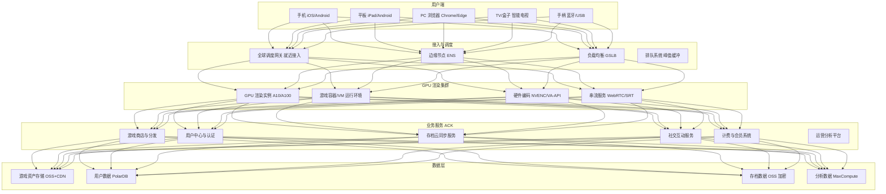
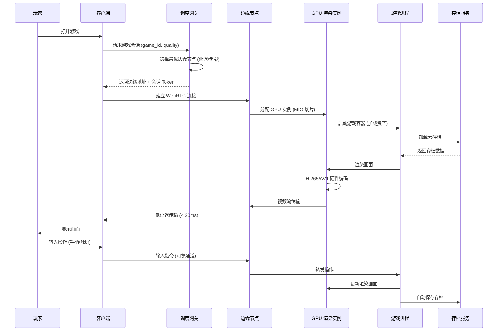

---title: 云游戏架构设计 — 阿里云视角
description: 'title: 云游戏架构设计'
summary: 'title: 云游戏架构设计'
category: general
tags:
- architecture
- best-practice
- containerd
- docker
- redis
- mysql
- kafka
- hpa
- gpu
- nvidia
tier: supporting
created: '2026-05-23'
last_updated: 2026-05
difficulty: intermediate
reading_level: intermediate
audience:
- 所有工程师
estimated_read_time: 15min
intent_queries:
- 云游戏架构设计 — 阿里云视角 是什么
- 如何 云游戏架构设计 — 阿里云视角
- Kubernetes 20 application patterns 最佳实践
trigger_keywords:
- 云游戏架构设计
- 阿里云视角
- application
- patterns
prerequisites:
- kubectl-basics
- prometheus-basics
- kafka-basics
- redis-basics
- mysql-basics
- gpu-scheduling-basics
authors:
- name: Dillan Teagle
  role: contributor

---

> **生产环境安全提示**
>
> 本文档包含可直接执行的运维命令。执行前请确认：当前目标集群与 Namespace 是否正确；是否具备足够的 RBAC 权限；是否已在非生产环境验证。命令风险等级标注：🔴 高风险（可能造成数据丢失或服务中断）、🟡 中风险（会修改集群状态，但通常可回滚）、🟢 低风险/只读（信息收集，无副作用）。


title: 云游戏架构设计
description: '# 云游戏架构设计 — 阿里云视角'
category: application-architecture
tags:
- k8s
- architecture
- industry
- [[containerd|containerd]]
- docker
- redis
- mysql
- kafka
- hpa
- gpu
last_updated: 2026-05-18
difficulty: advanced
reading_level: advanced
audience:
- 游戏架构师
- 云游戏技术负责人
- GPU计算工程师
estimated_read_time: 5min
intent_queries:
- 云游戏 [[Kubernetes|Kubernetes]] GPU渲染集群
- WebRTC云游戏 低延迟串流 K8s
- NVIDIA MIG GPU虚拟化 云游戏
- 游戏存档同步 OSS 加密 K8s
- 云游戏边缘节点 ENS 部署
trigger_keywords:
- 云游戏
- 串流
- GPU
- WebRTC
- NVIDIA MIG
- 云渲染
- 阿里云
- ACK
- ENS
- DRM
related_domains:
- domain-01-cluster-fundamentals
- domain-11-ai-infra
- domain-11-production-operations
related_topics:
- 09-gaming-backend-architecture
- 54-social-gaming-metaverse
- 58-web3-gamefi
k8s_versions:
- '1.28'
- '1.29'
- '1.30'
- '1.31'
- '1.32'
---

# 云游戏架构设计 — 阿里云视角

> **适用版本**: Kubernetes v1.29 - v1.33 | **最后更新**: 2026-04-24
> **作者**: 阿里云解决方案架构师 | **标签**: `#云游戏` `#串流` `#GPU` `#阿里云`

---

<!-- chunk: 目录 -->## 目录

1. [行业概述](#1-行业概述)
2. [业务场景](#2-业务场景)
3. [架构设计](#3-架构设计)
4. [核心技术栈](#4-核心技术栈)
5. [K8s 部署方案](#5-k8s-部署方案)
6. [数据架构](#6-数据架构)
7. [AI/ML 组件](#7-aiml-组件)
8. [安全合规](#8-安全合规)
9. [最佳实践](#9-最佳实践)
10. [反模式](#10-反模式)
11. [参考资源](#11-参考资源)

---

<!-- chunk: 1. 行业概述 -->## 1. 行业概述

## 1.1 行业背景

云游戏（Cloud Gaming）将游戏的渲染和计算过程从终端设备转移到云端服务器，玩家通过视频串流技术远程操控游戏。这一模式打破了终端硬件性能的限制，使得手机、平板、智能电视等轻量级设备也能运行 3A 级大作。全球云游戏市场规模在 2025 年已超过 60 亿美元，微软 xCloud、NVIDIA GeForce Now、Sony PlayStation Now 等平台已积累了数千万活跃用户。

中国云游戏市场呈现出独特的特征：移动端为主（占比 > 70%）、社交属性强（弹幕/观战/联机）、内容版权严格。腾讯 START 云游戏、网易云游戏、咪咕快游等平台正在快速扩张。5G 网络的普及为云游戏提供了低延迟、高带宽的传输基础，而 GPU 虚拟化技术（vGPU、MIG）的成熟使得单台服务器的并发路数持续提升。

## 1.2 行业挑战

| 挑战 | 说明 | 架构影响 |
|:---|:---|:---|
| 低延迟串流 | 端到端延迟 < 50ms 才可玩 | 边缘节点就近接入 + 网络优化 |
| GPU 成本高 | 每路游戏需要一个 GPU 实例 | GPU 共享（MIG）+ 分时复用 |
| 编码带宽 | 1080p60 需要 15-20Mbps 带宽 | 动态码率 ABR + H.265/AV1 压缩 |
| 游戏兼容性 | 数千款游戏适配不同系统环境 | 容器化/VM 化游戏运行环境 |
| 存档同步 | 跨设备无缝续玩需求 | 云存档服务 + 状态同步 |
| 高并发闪入 | 新游戏上线瞬时涌入大量玩家 | 预热 + 弹性伸缩 + 排队系统 |
| 版权保护 | 游戏内容防盗版防录屏 | DRM + 水印 + 安全执行环境 |
| 反作弊 | 云端渲染需防外挂 | 服务端渲染天然优势 + 行为检测 |

## 1.3 市场格局

全球云游戏市场由科技巨头主导：微软凭借 Xbox 生态和 Azure 云基础设施布局 xCloud；NVIDIA 以 GeForce Now 面向硬核玩家；Google Stadia 虽已关闭但留下了技术遗产。中国市场上，腾讯 START、网易云游戏依托自有游戏内容生态，咪咕快游依托运营商网络优势，各平台在内容、技术、渠道上展开差异化竞争。

---

<!-- chunk: 2. 业务场景 -->## 2. 业务场景

## 2.1 游戏串流

云端渲染 + 视频推流是云游戏的核心技术。游戏在云端 GPU 服务器上运行，渲染画面经过硬件编码器（NVENC）压缩为 H.264/H.265/AV1 视频流，通过 WebRTC/RTSP 协议传输到玩家终端。玩家的输入指令（手柄/键鼠/触屏）通过可靠传输通道回传到云端，游戏进程处理后更新画面。端到端延迟由采集→编码→传输→解码→显示五个环节组成。

## 2.2 游戏商店与分发

游戏版本管理和分发平台。核心功能包括：游戏库管理（元数据/截图/视频/评分）、版本管理（多版本并存/灰度更新）、资源预加载（游戏资产预分发到边缘节点）、数字版权管理（DRM 许可证分发）、游戏推荐（基于玩家画像的个性化推荐）。游戏资产（贴图/模型/音频）可达数十 GB，需要高效的 CDN 分发和边缘缓存策略。

## 2.3 社交互动

语音/文字/观战是云游戏的社交增强功能。场景包括：实时语音聊天（游戏内 VoIP）、弹幕互动（观众发弹幕与主播互动）、观战模式（观看好友游戏画面，延迟 < 3 秒）、联机匹配（跨平台多人匹配）。社交功能需要独立的信令服务器和媒体中继服务。

## 2.4 存档云同步

跨平台无缝续玩需要云存档服务。核心挑战：不同平台（PC/手机/主机）的游戏存档格式可能不同，需要标准化存档格式或平台适配层；存档同步需要保证一致性，避免冲突覆盖；存档数据涉及玩家隐私，需要加密存储。

## 2.5 多输入设备适配

手柄/键鼠/触屏的统一输入映射。不同输入设备的操作精度和方式差异大（手柄摇杆 vs 鼠标指针），需要智能映射算法。移动端触屏虚拟按键的布局和灵敏度需要可配置。

---

<!-- chunk: 3. 架构设计 -->## 3. 架构设计

## 3.1 云游戏全景架构



## 3.2 游戏串流时序



---

<!-- chunk: 4. 核心技术栈 -->## 4. 核心技术栈

| 类别 | 开源工具/技术 | 阿里云方案 | 说明 |
|:---|:---|:---|:---|
| 串流协议 | WebRTC, SRT, WHIP/WHEP | 阿里云 RTC | 低延迟音视频传输 |
| 视频编码 | H.264, H.265, AV1 | GPU 硬件编码 | NVENC/VA-API 硬件加速 |
| GPU 虚拟化 | NVIDIA MIG, vGPU, GPUoF | GN7/GN10 GPU 实例 | GPU 资源切分与共享 |
| 容器运行时 | Docker, containerd, Kata | ACK Pro 容器平台 | 游戏环境隔离 |
| 游戏环境 | Wine, Proton, Android Emu | 自研游戏适配层 | 跨平台游戏运行 |
| 边缘计算 | KubeEdge, OpenYurt | ENS 边缘节点服务 | 就近渲染部署 |
| CDN 分发 | Nginx, Varnish | 阿里云 CDN + DCDN | 游戏资产加速 |
| 实时通信 | Janus, Mediasoup | 阿里云 RTC | SFU/MCU 媒体路由 |
| 数据库 | MySQL, Redis | PolarDB + Redis 企业版 | 用户/会话数据 |
| 消息队列 | Kafka, Pulsar | RocketMQ | 异步事件处理 |

---

<!-- chunk: 5. K8s 部署方案 -->## 5. K8s 部署方案

## 5.1 游戏渲染 Pod

```yaml
apiVersion: v1
kind: Pod
metadata:
  name: game-session-{{SESSION_ID}}
  namespace: cloud-gaming
  labels:
    app: game-session
    game-id: "{{GAME_ID}}"
    user-id: "{{USER_ID}}"
    session-id: "{{SESSION_ID}}"
spec:
  nodeSelector:
    accelerator: nvidia-a10
  runtimeClassName: nvidia
  terminationGracePeriodSeconds: 60
  containers:
    - name: game-renderer
      image: registry.cn-hangzhou.aliyuncs.com/cloud-gaming/{{GAME_IMAGE}}:v3.2.0-gpu
      ports:
        - containerPort: 8080
          name: webrtc-signaling
        - containerPort: 3478
          name: stun
        - containerPort: 5000
          name: video-stream
          protocol: UDP
      env:
        - name: STREAM_RESOLUTION
          value: "1920x1080"
        - name: STREAM_FPS
          value: "60"
        - name: VIDEO_CODEC
          value: "h265"
        - name: MAX_BITRATE_MBPS
          value: "20"
        - name: MIN_BITRATE_MBPS
          value: "5"
        - name: AUDIO_CODEC
          value: "opus"
        - name: SESSION_ID
          value: "{{SESSION_ID}}"
        - name: SAVE_SERVICE_URL
          value: "http://save-service:8080"
      resources:
        requests:
          nvidia.com/gpu: 1
          memory: "8Gi"
          cpu: "4000m"
        limits:
          nvidia.com/gpu: 1
          memory: "16Gi"
          cpu: "8000m"
      volumeMounts:
        - name: game-assets
          mountPath: /game/assets
          readOnly: true
        - name: user-save
          mountPath: /game/saves
        - name: shm
          mountPath: /dev/shm
  volumes:
    - name: game-assets
      persistentVolumeClaim:
        claimName: game-assets-pvc
    - name: user-save
      emptyDir: {}
    - name: shm
      emptyDir:
        medium: Memory
        sizeLimit: 2Gi
```

## 5.2 自动伸缩

```yaml
apiVersion: autoscaling/v2
kind: HorizontalPodAutoscaler
metadata:
  name: game-session-hpa
  namespace: cloud-gaming
spec:
  scaleTargetRef:
    apiVersion: apps/v1
    kind: Deployment
    name: game-session-controller
  minReplicas: 10
  maxReplicas: 1000
  metrics:
    - type: Pods
      pods:
        metric:
          name: active_game_sessions
        target:
          type: AverageValue
          averageValue: "8"
    - type: Resource
      resource:
        name: nvidia.com/gpu
        target:
          type: Utilization
          averageUtilization: 80
  behavior:
    scaleUp:
      stabilizationWindowSeconds: 30
      policies:
        - type: Percent
          value: 50
          periodSeconds: 60
    scaleDown:
      stabilizationWindowSeconds: 300
      policies:
        - type: Percent
          value: 10
          periodSeconds: 120
```

## 5.3 存档同步服务

```yaml
apiVersion: apps/v1
kind: Deployment
metadata:
  name: save-sync-service
  namespace: cloud-gaming
spec:
  replicas: 5
  selector:
    matchLabels:
      app: save-sync-service
  template:
    metadata:
      labels:
        app: save-sync-service
    spec:
      affinity:
        podAntiAffinity:
          preferredDuringSchedulingIgnoredDuringExecution:
            - weight: 100
              podAffinityTerm:
                labelSelector:
                  matchLabels:
                    app: save-sync-service
                topologyKey: kubernetes.io/hostname
      containers:
        - name: save-service
          image: registry.cn-hangzhou.aliyuncs.com/cloud-gaming/save-sync:v2.0.0
          ports:
            - containerPort: 8080
          env:
            - name: OSS_BUCKET
              value: "cloud-gaming-saves"
            - name: OSS_ENDPOINT
              value: "oss-cn-hangzhou.aliyuncs.com"
            - name: ENCRYPTION_KEY_ID
              valueFrom:
                secretKeyRef:
                  name: save-encryption-key
                  key: key-id
            - name: REDIS_URL
              value: "redis://redis-cluster:6379"
          resources:
            requests:
              memory: "2Gi"
              cpu: "1000m"
            limits:
              memory: "4Gi"
              cpu: "2000m"
```

---

<!-- chunk: 6. 数据架构 -->## 6. 数据架构

## 6.1 数据分层

| 数据类型 | 存储方案 | 访问模式 | 数据量级 |
|:---|:---|:---|:---|
| 游戏资产 | OSS + CDN | 读密集，预加载 | TB-PB 级 |
| 用户账号 | PolarDB MySQL | 读写均衡 | GB 级 |
| 游戏存档 | OSS 加密 | 写密集，低频读 | TB 级 |
| 会话状态 | Redis | 超高频读写 | 内存级 |
| 运营日志 | SLS | 写密集，批量读 | TB/天 |
| 分析数据 | MaxCompute | 批量读写 | PB 级 |
| 计费数据 | PolarDB MySQL | 事务性强一致 | GB 级 |

---

<!-- chunk: 7. AI/ML 组件 -->## 7. AI/ML 组件

| AI 场景 | 模型/算法 | 输入 | 输出 | 用途 |
|:---|:---|:---|:---|:---|
| 码率自适应 | 强化学习 ABR | 网络状态/带宽 | 最优码率 | 保证画质同时降低延迟 |
| 画质增强 | 超分辨率 ESRGAN | 低分辨率帧 | 高分辨率帧 | 降低传输带宽 |
| 输入预测 | LSTM/Transformer | 操作序列 | 预测下一输入 | 补偿网络延迟 |
| 异常检测 | Autoencoder | 游戏进程指标 | 异常告警 | 游戏崩溃预警 |
| 游戏推荐 | 深度推荐模型 | 用户行为 | 推荐列表 | 提升游戏发现率 |
| 反作弊 | 行为分析模型 | 操作日志 | 作弊概率 | 检测异常操作模式 |

---

<!-- chunk: 8. 安全合规 -->## 8. 安全合规

| 安全层级 | 措施 | 技术实现 |
|:---|:---|:---|
| 游戏版权 | DRM 保护，防止录屏 | Widevine/FairPlay + 水印 |
| 外挂防护 | 服务端渲染天然防作弊 | 无客户端代码泄露 |
| 未成年人 | 实名认证 + 防沉迷 | 接入公安部实名认证 |
| 数据隐私 | 用户数据加密存储 | KMS + 字段级加密 |
| 通信安全 | 串流加密传输 | DTLS/SRTP |
| 运营合规 | 游戏版号/内容审查 | 合规审查工作流 |

---

<!-- chunk: 9. 最佳实践 -->## 9. 最佳实践

- **GPU 资源优化**: 使用 NVIDIA MIG 将 A100 切分为多个实例，单卡支持 2-4 路游戏并发
- **边缘就近接入**: 部署 ENS 边缘节点到全国主要城市，将网络延迟控制在 20ms 以内
- **游戏容器预热**: 热门游戏预启动容器实例，玩家进入时秒级分配，冷启动使用排队系统
- **动态码率 ABR**: 根据网络带宽实时调整视频码率和分辨率，保证流畅度优先
- **存档自动保存**: 每 30 秒自动保存游戏进度到 OSS，避免断线丢失进度
- **负载预测**: 根据历史数据和游戏上线计划预测 GPU 需求，提前预热资源

---

<!-- chunk: 10. 反模式 -->## 10. 反模式

## 10.1 所有游戏同一规格

所有游戏都分配完整的 GPU 实例，休闲游戏浪费 GPU 资源。

**解决方案**: 根据游戏的 GPU 需求分级（重度/中度/轻度），重度游戏分配完整 GPU，中度游戏使用 MIG 切分，轻度游戏使用 CPU 渲染。

## 10.2 忽视冷启动延迟

玩家点击游戏后需要等待数分钟加载，体验极差。

**解决方案**: 热门游戏预启动容器池（warm pool），新游戏使用快照技术加速启动，启动期间展示加载动画和游戏介绍。

## 10.3 单一数据中心部署

所有 GPU 渲染集中在单一区域，远离玩家的用户延迟过高。

**解决方案**: 使用 ENS 边缘节点服务在全国多城市部署渲染节点，GSLB 调度就近接入，端到端延迟控制在 50ms 以内。

---

<!-- chunk: 11. 参考资源 -->## 11. 参考资源

## 11.1 阿里云组件映射

| 功能域 | 阿里云云原生方案 | 说明 |
|:---|:---|:---|
| 容器平台 | **ACK Pro + GPU 节点池** | GPU 任务调度与管理 |
| GPU 计算 | **GN7/GN10 实例** | A10/A100 GPU 渲染 |
| 边缘节点 | **ENS 边缘节点服务** | 全国就近渲染部署 |
| 实时传输 | **阿里云 RTC** | WebRTC 低延迟串流 |
| 对象存储 | **OSS + CDN** | 游戏资产存储与分发 |
| 关系数据库 | **PolarDB MySQL** | 用户/计费/运营数据 |
| 缓存 | **Redis 企业版** | 会话状态/排行榜 |
| 可观测性 | **ARMS + SLS** | 全链路监控 |

## 11.2 生产检查清单

- [ ] GPU 实例负载均衡验证
- [ ] 边缘节点网络延迟 < 20ms 端到端测试
- [ ] 游戏容器启动时间 < 10s（预热池）
- [ ] 云存档同步完整性校验
- [ ] 防沉迷系统合规验证（未成年人限制）
- [ ] 游戏版权 DRM 保护测试
- [ ] 峰值弹性伸缩能力验证（10x 流量）
- [ ] 网络异常自动降级策略测试

---

**维护者**: 阿里云解决方案架构师团队 | **许可证**: MIT

---

<!-- chunk: Obsidian 相关文档 -->## Obsidian 相关文档

- topic-application-architecture MOC
- [[domain-20-application-patterns/topic-application-architecture/README.md|Topic 应用层架构设计最佳实践]]
- [[domain-20-application-patterns/topic-application-architecture/01-ecommerce-architecture.md|电商系统 Kubernetes 生产架构设计]]
- [[domain-20-application-patterns/topic-application-architecture/02-mini-program-architecture.md|小程序平台架构设计]]
- [[domain-20-application-patterns/topic-application-architecture/03-cms-architecture.md|内容管理系统 CMS 架构设计]]
- [[domain-20-application-patterns/topic-application-architecture/04-im-rtc-architecture.md|实时通信 IM/RTC 架构设计]]
- [[domain-20-application-patterns/topic-application-architecture/05-online-education-architecture.md|在线教育平台 Kubernetes 生产架构设计]]
- [[domain-20-application-patterns/topic-application-architecture/06-fintech-architecture.md|金融科技FinTech Kubernetes生产架构设计]]
- [[domain-20-application-patterns/topic-application-architecture/07-iot-platform-architecture.md|物联网 IoT 平台架构设计]]
- [[domain-20-application-patterns/topic-application-architecture/08-ai-ml-inference-architecture.md|AI/ML 推理服务 Kubernetes 生产架构设计]]
- [[domain-20-application-patterns/topic-application-architecture/09-gaming-backend-architecture.md|游戏后端 Kubernetes 生产架构设计]]
- [[domain-20-application-patterns/topic-application-architecture/10-social-media-architecture.md|社交媒体平台Kubernetes生产架构设计]]

## See Also

- 38-supply-chain-finance
- 39-smart-campus
- 41-beauty-ecommerce
- 42-secondhand-circular


<!-- risk-assessed -->
