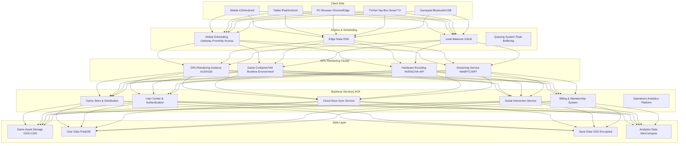
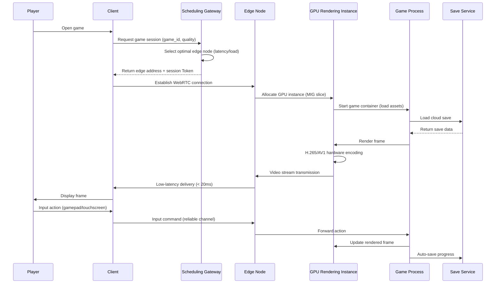

---title: Cloud Gaming Architecture Design — Alibaba Cloud Perspective
description: 'title: Cloud Gaming Architecture Design'
summary: 'title: Cloud Gaming Architecture Design'
category: general
tags:
- architecture
- best-practice
- containerd
- docker
- redis
- mysql
- kafka
- hpa
- gpu
- nvidia
tier: supporting
created: '2026-05-23'
last_updated: 2026-05
difficulty: intermediate
reading_level: intermediate
audience:
- All Engineers
estimated_read_time: 15min
intent_queries:
- What is Cloud Gaming Architecture Design — Alibaba Cloud Perspective
- How to Cloud Gaming Architecture Design — Alibaba Cloud Perspective
- Kubernetes 20 application patterns best practices
trigger_keywords:
- Cloud Gaming Architecture Design
- Alibaba Cloud Perspective
- application
- patterns
prerequisites:
- kubectl-basics
- prometheus-basics
- kafka-basics
- redis-basics
- mysql-basics
- gpu-scheduling-basics
authors:
- name: Dillan Teagle
  role: contributor

---

> **Production Environment Safety Notice**
>
> This document contains operational commands that can be executed directly. Before executing, please confirm: whether the current target cluster and Namespace are correct; whether you have sufficient RBAC permissions; whether you have verified in a non-production environment. Command risk levels are marked as: 🔴 High Risk (may cause data loss or service interruption), 🟡 Medium Risk (modifies cluster state, but generally reversible), 🟢 Low Risk/Read-Only (information gathering, no side effects).


title: Cloud Gaming Architecture Design
description: '# Cloud Gaming Architecture Design — Alibaba Cloud Perspective'
category: application-architecture
tags:
- k8s
- architecture
- industry
- [[containerd|containerd]]
- docker
- redis
- mysql
- kafka
- hpa
- gpu
last_updated: 2026-05-18
difficulty: advanced
reading_level: advanced
audience:
- Game Architects
- Cloud Gaming Technical Leads
- GPU Computing Engineers
estimated_read_time: 5min
intent_queries:
- Cloud gaming [[Kubernetes|Kubernetes]] GPU rendering cluster
- WebRTC cloud gaming low-latency streaming K8s
- NVIDIA MIG GPU virtualization cloud gaming
- Game save sync OSS encryption K8s
- Cloud gaming edge node ENS deployment
trigger_keywords:
- Cloud gaming
- Streaming
- GPU
- WebRTC
- NVIDIA MIG
- Cloud rendering
- Alibaba Cloud
- ACK
- ENS
- DRM
related_domains:
- domain-01-cluster-fundamentals
- domain-11-ai-infra
- domain-11-production-operations
related_topics:
- 09-gaming-backend-architecture
- 54-social-gaming-metaverse
- 58-web3-gamefi
k8s_versions:
- '1.28'
- '1.29'
- '1.30'
- '1.31'
- '1.32'
---
# Cloud Gaming Architecture Design — Alibaba Cloud Perspective

> **Applicable Versions**: Kubernetes v1.29 - v1.33 | **Last Updated**: 2026-04-24
> **Author**: Alibaba Cloud Solutions Architect | **Tags**: `#CloudGaming` `#Streaming` `#GPU` `#AlibabaCloud`

---

## Table of Contents

1. [Industry Overview](#1-industry-overview)
2. [Business Scenarios](#2-business-scenarios)
3. [Architecture Design](#3-architecture-design)
4. [Core Technology Stack](#4-core-technology-stack)
5. [K8s Deployment Plan](#5-k8s-deployment-solution)
6. [Data Architecture](#6-data-architecture)
7. [AI/ML Components](#7-aiml-components)
8. [Security & Compliance](#8-security-and-compliance)
9. [Best Practices](#9-best-practices)
10. [Anti-Patterns](#10-anti-patterns)
11. [Reference Resources](#11-reference-resources)

---

## 1. Industry Overview

## 1.1 Industry Background

Cloud Gaming shifts the rendering and computation of games from end-user devices to cloud servers, allowing players to control games remotely via video streaming technology. This model breaks the hardware performance constraints of terminal devices, enabling lightweight devices such as smartphones, tablets, and smart TVs to run AAA-tier titles. The global cloud gaming market exceeded $6 billion in 2025, with platforms such as Microsoft xCloud, NVIDIA GeForce Now, and Sony PlayStation Now accumulating tens of millions of active users.

The Chinese cloud gaming market exhibits unique characteristics: mobile-first (accounting for > 70%), strong social features (bullet comments/spectating/co-op), and strict content copyright enforcement. Platforms such as Tencent START Cloud Gaming, NetEase Cloud Gaming, and Migu Quick Play are expanding rapidly. The proliferation of 5G networks provides low-latency, high-bandwidth transmission infrastructure for cloud gaming, while the maturation of GPU virtualization technologies (vGPU, MIG) continues to increase the number of concurrent sessions per server.

## 1.2 Industry Challenges

| Challenge | Description | Architectural Impact |
|:---|:---|:---|
| Low-latency streaming | End-to-end latency < 50ms required for playability | Edge node proximity access + network optimization |
| High GPU cost | Each game session requires a dedicated GPU instance | GPU sharing (MIG) + time-division multiplexing |
| Encoding bandwidth | 1080p60 requires 15–20 Mbps bandwidth | Dynamic bitrate ABR + H.265/AV1 compression |
| Game compatibility | Thousands of games adapted to different system environments | Containerized/VM-based game runtime environments |
| Save-file synchronization | Seamless cross-device resume requirement | Cloud save service + state synchronization |
| High concurrent spike | Massive player influx when new games launch | Warm-up + elastic scaling + queuing system |
| Copyright protection | Anti-piracy and anti-screen-recording for game content | DRM + watermarking + secure execution environment |
| Anti-cheat | Server-side rendering must prevent cheating | Inherent server-side rendering advantage + behavior detection |

## 1.3 Market Landscape

The global cloud gaming market is dominated by tech giants: Microsoft leverages the Xbox ecosystem and Azure cloud infrastructure for xCloud; NVIDIA targets hardcore gamers with GeForce Now; Google Stadia, though shut down, left behind a technical legacy. In the Chinese market, Tencent START and NetEase Cloud Gaming rely on their proprietary game content ecosystems, while Migu Quick Play leverages carrier network advantages. Each platform differentiates itself through content, technology, and distribution channels.

---

## 2. Business Scenarios

## 2.1 Game Streaming

Cloud-side rendering + video push streaming is the core technology of cloud gaming. Games run on cloud GPU servers; rendered frames are compressed into H.264/H.265/AV1 video streams via hardware encoders (NVENC) and transmitted to player terminals via WebRTC/RTSP protocols. Player input commands (gamepad/keyboard-mouse/touchscreen) are sent back to the cloud over a reliable transport channel, where the game process handles them and updates the frame. End-to-end latency consists of five stages: capture → encode → transmit → decode → display.

## 2.2 Game Store & Distribution

A game version management and distribution platform. Core features include: game library management (metadata/screenshots/videos/ratings), version management (multiple concurrent versions/gray-scale updates), asset pre-loading (pre-distributing game assets to edge nodes), digital rights management (DRM license distribution), and game recommendations (personalized recommendations based on player profiles). Game assets (textures/models/audio) can reach tens of gigabytes, requiring efficient CDN distribution and edge caching strategies.

## 2.3 Social Interaction

Voice/text/spectating are social enhancement features of cloud gaming. Scenarios include: real-time voice chat (in-game VoIP), bullet comment interaction (viewers sending bullet comments to interact with streamers), spectator mode (watching a friend's gameplay, latency < 3 seconds), and online matchmaking (cross-platform multiplayer matching). Social features require dedicated signaling servers and media relay services.

## 2.4 Cloud Save Synchronization

Seamless cross-platform resume requires a cloud save service. Core challenges: game save formats may differ across platforms (PC/mobile/console), requiring a standardized save format or a platform adaptation layer; save synchronization must ensure consistency to avoid conflict overwriting; save data involves player privacy and must be stored encrypted.

## 2.5 Multi-Input Device Adaptation

A unified input mapping layer for gamepads/keyboard-mouse/touchscreens. Different input devices vary greatly in precision and interaction style (gamepad analog stick vs. mouse pointer), requiring intelligent mapping algorithms. The layout and sensitivity of virtual on-screen buttons for mobile touchscreens must be configurable.

---

## 3. Architecture Design

## 3.1 Cloud Gaming Panoramic Architecture


```mermaid
graph TB
    subgraph ClientSide["Client Side"]
        D1[Mobile iOS/Android]
        D2[Tablet iPad/Android]
        D3[PC Browser Chrome/Edge]
        D4[TV/Set-Top Box Smart TV]
        D5[Gamepad Bluetooth/USB]
    end

    subgraph AccessLayer["Access & Scheduling"]
        G1[Global Scheduling Gateway Proximity Access]
        G2[Edge Node ENS]
        G3[Load Balancer GSLB]
        G4[Queuing System Peak Buffering]
    end

    subgraph RenderLayer["GPU Rendering Cluster"]
        R1[GPU Rendering Instance A10/A100]
        R2[Game Container/VM Runtime Environment]
        R3[Hardware Encoding NVENC/VA-API]
        R4[Streaming Service WebRTC/SRT]
    end

    subgraph PlatformLayer["Business Services ACK"]
        P1[Game Store & Distribution]
        P2[User Center & Authentication]
        P3[Cloud Save Sync Service]
        P4[Social Interaction Service]
        P5[Billing & Membership System]
        P6[Operations Analytics Platform]
    end

    subgraph DataLayer["Data Layer"]
        DL1[Game Asset Storage OSS+CDN]
        DL2[User Data PolarDB]
        DL3[Save Data OSS Encrypted]
        DL4[Analytics Data MaxCompute]
    end

    D1 & D2 & D3 & D4 & D5 --> G1 & G2 & G3
    G1 & G2 & G3 --> R1 & R2 & R3 & R4
    R1 & R2 & R3 & R4 --> P1 & P2 & P3 & P4 & P5
    P1 & P2 & P3 & P4 & P5 --> DL1 & DL2 & DL3 & DL4
```
## 3.2 Game Streaming Sequence


```mermaid
sequenceDiagram
    participant USER as Player
    participant CLIENT as Client
    participant GATE as Scheduling Gateway
    participant EDGE as Edge Node
    participant GPU as GPU Rendering Instance
    participant GAME as Game Process
    participant SAVE as Save Service

    USER->>CLIENT: Open game
    CLIENT->>GATE: Request game session (game_id, quality)
    GATE->>GATE: Select optimal edge node (latency/load)
    GATE-->>CLIENT: Return edge address + session Token
    CLIENT->>EDGE: Establish WebRTC connection
    EDGE->>GPU: Allocate GPU instance (MIG slice)
    GPU->>GAME: Start game container (load assets)
    GAME->>SAVE: Load cloud save
    SAVE-->>GAME: Return save data
    GAME->>GPU: Render frame
    GPU->>GPU: H.265/AV1 hardware encoding
    GPU->>EDGE: Video stream transmission
    EDGE->>CLIENT: Low-latency delivery (< 20ms)
    CLIENT->>USER: Display frame
    USER->>CLIENT: Input action (gamepad/touchscreen)
    CLIENT->>EDGE: Input command (reliable channel)
    EDGE->>GAME: Forward action
    GAME->>GPU: Update rendered frame
    GAME->>SAVE: Auto-save progress
```

---

## 4. Core Technology Stack

| Category | Open-Source Tools/Technologies | Alibaba Cloud Solution | Description |
|:---|:---|:---|:---|
| Streaming Protocol | WebRTC, SRT, WHIP/WHEP | Alibaba Cloud RTC | Low-latency audio/video transmission |
| Video Encoding | H.264, H.265, AV1 | GPU hardware encoding | NVENC/VA-API hardware acceleration |
| GPU Virtualization | NVIDIA MIG, vGPU, GPUoF | GN7/GN10 GPU instances | GPU resource partitioning and sharing |
| Container Runtime | Docker, containerd, Kata | ACK Pro container platform | Game environment isolation |
| Game Environment | Wine, Proton, Android Emu | Proprietary game compatibility layer | Cross-platform game execution |
| Edge Computing | KubeEdge, OpenYurt | ENS Edge Node Service | Proximity rendering deployment |
| CDN Distribution | Nginx, Varnish | Alibaba Cloud CDN + DCDN | Game asset acceleration |
| Real-Time Communication | Janus, Mediasoup | Alibaba Cloud RTC | SFU/MCU media routing |
| Database | MySQL, Redis | PolarDB + Redis Enterprise Edition | User/session data |
| Message Queue | Kafka, Pulsar | RocketMQ | Asynchronous event processing |

---

## 5. K8s Deployment Solution

## 5.1 Game Rendering Pod

```yaml
apiVersion: v1
kind: Pod
metadata:
  name: game-session-{{SESSION_ID}}
  namespace: cloud-gaming
  labels:
    app: game-session
    game-id: "{{GAME_ID}}"
    user-id: "{{USER_ID}}"
    session-id: "{{SESSION_ID}}"
spec:
  nodeSelector:
    accelerator: nvidia-a10
  runtimeClassName: nvidia
  terminationGracePeriodSeconds: 60
  containers:
    - name: game-renderer
      image: registry.cn-hangzhou.aliyuncs.com/cloud-gaming/{{GAME_IMAGE}}:v3.2.0-gpu
      ports:
        - containerPort: 8080
          name: webrtc-signaling
        - containerPort: 3478
          name: stun
        - containerPort: 5000
          name: video-stream
          protocol: UDP
      env:
        - name: STREAM_RESOLUTION
          value: "1920x1080"
        - name: STREAM_FPS
          value: "60"
        - name: VIDEO_CODEC
          value: "h265"
        - name: MAX_BITRATE_MBPS
          value: "20"
        - name: MIN_BITRATE_MBPS
          value: "5"
        - name: AUDIO_CODEC
          value: "opus"
        - name: SESSION_ID
          value: "{{SESSION_ID}}"
        - name: SAVE_SERVICE_URL
          value: "http://save-service:8080"
      resources:
        requests:
          nvidia.com/gpu: 1
          memory: "8Gi"
          cpu: "4000m"
        limits:
          nvidia.com/gpu: 1
          memory: "16Gi"
          cpu: "8000m"
      volumeMounts:
        - name: game-assets
          mountPath: /game/assets
          readOnly: true
        - name: user-save
          mountPath: /game/saves
        - name: shm
          mountPath: /dev/shm
  volumes:
    - name: game-assets
      persistentVolumeClaim:
        claimName: game-assets-pvc
    - name: user-save
      emptyDir: {}
    - name: shm
      emptyDir:
        medium: Memory
        sizeLimit: 2Gi
```
## 5.2 Auto Scaling

```yaml
apiVersion: autoscaling/v2
kind: HorizontalPodAutoscaler
metadata:
  name: game-session-hpa
  namespace: cloud-gaming
spec:
  scaleTargetRef:
    apiVersion: apps/v1
    kind: Deployment
    name: game-session-controller
  minReplicas: 10
  maxReplicas: 1000
  metrics:
    - type: Pods
      pods:
        metric:
          name: active_game_sessions
        target:
          type: AverageValue
          averageValue: "8"
    - type: Resource
      resource:
        name: nvidia.com/gpu
        target:
          type: Utilization
          averageUtilization: 80
  behavior:
    scaleUp:
      stabilizationWindowSeconds: 30
      policies:
        - type: Percent
          value: 50
          periodSeconds: 60
    scaleDown:
      stabilizationWindowSeconds: 300
      policies:
        - type: Percent
          value: 10
          periodSeconds: 120
```

## 5.3 Save Sync Service

```yaml
apiVersion: apps/v1
kind: Deployment
metadata:
  name: save-sync-service
  namespace: cloud-gaming
spec:
  replicas: 5
  selector:
    matchLabels:
      app: save-sync-service
  template:
    metadata:
      labels:
        app: save-sync-service
    spec:
      affinity:
        podAntiAffinity:
          preferredDuringSchedulingIgnoredDuringExecution:
            - weight: 100
              podAffinityTerm:
                labelSelector:
                  matchLabels:
                    app: save-sync-service
                topologyKey: kubernetes.io/hostname
      containers:
        - name: save-service
          image: registry.cn-hangzhou.aliyuncs.com/cloud-gaming/save-sync:v2.0.0
          ports:
            - containerPort: 8080
          env:
            - name: OSS_BUCKET
              value: "cloud-gaming-saves"
            - name: OSS_ENDPOINT
              value: "oss-cn-hangzhou.aliyuncs.com"
            - name: ENCRYPTION_KEY_ID
              valueFrom:
                secretKeyRef:
                  name: save-encryption-key
                  key: key-id
            - name: REDIS_URL
              value: "redis://redis-cluster:6379"
          resources:
            requests:
              memory: "2Gi"
              cpu: "1000m"
            limits:
              memory: "4Gi"
              cpu: "2000m"
```

---

## 6. Data Architecture
## 6.1 Data Tiering

| Data Type | Storage Solution | Access Pattern | Data Volume |
|:---|:---|:---|:---|
| Game Assets | OSS + CDN | Read-intensive, preloading | TB–PB scale |
| User Accounts | PolarDB MySQL | Balanced read/write | GB scale |
| Game Save Files | OSS Encrypted | Write-intensive, infrequent reads | TB scale |
| Session State | Redis | Ultra-high-frequency read/write | Memory scale |
| Operational Logs | SLS | Write-intensive, batch reads | TB/day |
| Analytics Data | MaxCompute | Batch read/write | PB scale |
| Billing Data | PolarDB MySQL | Transactional strong consistency | GB scale |

---

## 7. AI/ML Components

| AI Scenario | Model/Algorithm | Input | Output | Purpose |
|:---|:---|:---|:---|:---|
| Adaptive Bitrate | Reinforcement Learning ABR | Network state/bandwidth | Optimal bitrate | Ensure quality while reducing latency |
| Image Enhancement | Super-resolution ESRGAN | Low-resolution frames | High-resolution frames | Reduce transmission bandwidth |
| Input Prediction | LSTM/Transformer | Operation sequence | Predicted next input | Compensate for network latency |
| Anomaly Detection | Autoencoder | Game process metrics | Anomaly alerts | Game crash early warning |
| Game Recommendation | Deep Recommendation Model | User behavior | Recommendation list | Improve game discoverability |
| Anti-Cheat | Behavior Analysis Model | Operation logs | Cheat probability | Detect abnormal operation patterns |

---

## 8. Security and Compliance

| Security Level | Measures | Technical Implementation |
|:---|:---|:---|
| Game Copyright | DRM protection, screen recording prevention | Widevine/FairPlay + Watermarking |
| Cheat Protection | Server-side rendering inherently prevents cheating | No client-side code exposure |
| Minors | Real-name authentication + anti-addiction | Integration with Ministry of Public Security real-name system |
| Data Privacy | Encrypted user data storage | KMS + field-level encryption |
| Communication Security | Encrypted stream transmission | DTLS/SRTP |
| Operational Compliance | Game license/content review | Compliance review workflow |

---

## 9. Best Practices

- **GPU Resource Optimization**: Use NVIDIA MIG to partition A100 into multiple instances, with a single card supporting 2–4 concurrent game sessions
- **Edge Proximity Access**: Deploy ENS edge nodes to major cities nationwide, keeping network latency within 20ms
- **Game Container Warm-up**: Pre-start container instances for popular games, enabling second-level allocation when players enter; use a queuing system for cold starts
- **Dynamic Bitrate ABR**: Dynamically adjust video bitrate and resolution based on network bandwidth in real time, prioritizing smoothness
- **Auto Save**: Automatically save game progress to OSS every 30 seconds to prevent progress loss on disconnection
- **Load Prediction**: Predict GPU demand based on historical data and game launch plans, warming up resources in advance

---

## 10. Anti-Patterns

## 10.1 Same Spec for All Games

All games are allocated full GPU instances, wasting GPU resources for casual games.

**Solution**: Tier GPU allocation based on each game's GPU requirements (heavy/medium/light). Allocate full GPUs for heavy games, use MIG partitioning for medium games, and use CPU rendering for light games.

## 10.2 Ignoring Cold Start Latency

Players have to wait several minutes after clicking a game before it loads, resulting in a very poor experience.

**Solution**: Maintain pre-started container warm pools for popular games, use snapshot technology to accelerate startup for new games, and display loading animations and game introductions during startup.

## 10.3 Single Data Center Deployment

All GPU rendering is concentrated in a single region, causing excessive latency for users far from that region.

**Solution**: Use ENS edge node services to deploy rendering nodes across multiple cities nationwide. Use GSLB scheduling for proximity-based access, keeping end-to-end latency within 50ms.

---

## 11. Reference Resources

## 11.1 Alibaba Cloud Component Mapping

| Functional Domain | Alibaba Cloud Native Solution | Description |
|:---|:---|:---|
| Container Platform | **ACK Pro + GPU Node Pool** | GPU task scheduling and management |
| GPU Compute | **GN7/GN10 Instances** | A10/A100 GPU rendering |
| Edge Nodes | **ENS Edge Node Service** | Nationwide proximity rendering deployment |
| Real-time Transport | **Alibaba Cloud RTC** | WebRTC low-latency streaming |
| Object Storage | **OSS + CDN** | Game asset storage and distribution |
| Relational Database | **PolarDB MySQL** | User/billing/operational data |
| Cache | **Redis Enterprise Edition** | Session state/leaderboards |
| Observability | **ARMS + SLS** | Full-chain monitoring |

## 11.2 Production Checklist

- [ ] GPU instance load balancing verification
- [ ] Edge node network latency < 20ms end-to-end testing
- [ ] Game container startup time < 10s (warm pool)
- [ ] Cloud save sync integrity verification
- [ ] Anti-addiction system compliance verification (minor restrictions)
- [ ] Game copyright DRM protection testing
- [ ] Peak elastic scaling capability verification (10x traffic)
- [ ] Network anomaly automatic fallback strategy testing

---

**Maintainer**: Alibaba Cloud Solution Architect Team | **License**: MIT

---
## Obsidian Related Documents

- topic-application-architecture MOC
- [[domain-20-application-patterns/topic-application-architecture/README.md|Topic Application Layer Architecture Design Best Practices]]
- [[domain-20-application-patterns/topic-application-architecture/01-ecommerce-architecture.md|E-commerce System Kubernetes Production Architecture Design]]
- [[domain-20-application-patterns/topic-application-architecture/02-mini-program-architecture.md|Mini Program Platform Architecture Design]]
- [[domain-20-application-patterns/topic-application-architecture/03-cms-architecture.md|Content Management System CMS Architecture Design]]
- [[domain-20-application-patterns/topic-application-architecture/04-im-rtc-architecture.md|Real-Time Communication IM/RTC Architecture Design]]
- [[domain-20-application-patterns/topic-application-architecture/05-online-education-architecture.md|Online Education Platform Kubernetes Production Architecture Design]]
- [[domain-20-application-patterns/topic-application-architecture/06-fintech-architecture.md|FinTech Kubernetes Production Architecture Design]]
- [[domain-20-application-patterns/topic-application-architecture/07-iot-platform-architecture.md|IoT Platform Architecture Design]]
- [[domain-20-application-patterns/topic-application-architecture/08-ai-ml-inference-architecture.md|AI/ML Inference Service Kubernetes Production Architecture Design]]
- [[domain-20-application-patterns/topic-application-architecture/09-gaming-backend-architecture.md|Gaming Backend Kubernetes Production Architecture Design]]
- [[domain-20-application-patterns/topic-application-architecture/10-social-media-architecture.md|Social Media Platform Kubernetes Production Architecture Design]]

## See Also

- 38-supply-chain-finance
- 39-smart-campus
- 41-beauty-ecommerce
- 42-secondhand-circular
