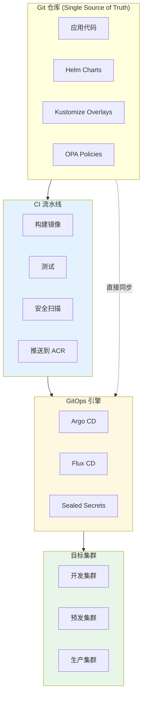
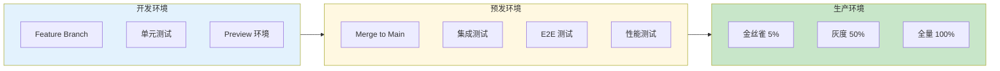

---title: 云原生 DevOps 平台 Kubernetes 生产架构设计
description: 'title: 云原生 DevOps 平台架构设计'
summary: 'title: 云原生 DevOps 平台架构设计'
category: general
tags:
- architecture
- best-practice
- daily-ops
- prometheus
- grafana
- jaeger
- istio
- helm
- argocd
- flux
tier: supporting
created: '2026-05-23'
last_updated: 2026-05
difficulty: intermediate
reading_level: intermediate
audience:
- 所有工程师
estimated_read_time: 15min
intent_queries:
- 云原生 DevOps 平台 Kubernetes 生产架构设计 是什么
- 如何 云原生 DevOps 平台 Kubernetes 生产架构设计
- Kubernetes 20 application patterns 最佳实践
trigger_keywords:
- 云原生
- DevOps
- 平台
- Kubernetes
- 生产架构设计
- application
- patterns
prerequisites:
- kubectl-basics
- prometheus-basics
- helm-basics
- service-mesh-basics
- monitoring-basics
- gitops-basics
- gpu-scheduling-basics
- policy-basics
- logging-basics
- tracing-basics
- observability-basics
authors:
- name: Dillan Teagle
  role: contributor

---

> **生产环境安全提示**
>
> 本文档包含可直接执行的运维命令。执行前请确认：当前目标集群与 Namespace 是否正确；是否具备足够的 RBAC 权限；是否已在非生产环境验证。命令风险等级标注：🔴 高风险（可能造成数据丢失或服务中断）、🟡 中风险（会修改集群状态，但通常可回滚）、🟢 低风险/只读（信息收集，无副作用）。


title: 云原生 DevOps 平台架构设计
description: '# 云原生 DevOps 平台 [[Kubernetes|Kubernetes]] 生产架构设计'
category: application-architecture
tags:
- k8s
- architecture
- industry
- [[Prometheus|prometheus]]
- grafana
- [[Helm|helm]]
- argocd
- flux
- docker
- harbor
last_updated: 2026-05-18
difficulty: advanced
reading_level: advanced
audience:
- DevOps架构师
- 平台工程师
- SRE工程师
- 云原生开发工程师
estimated_read_time: 5min
intent_queries:
- 企业级 DevOps 平台 GitOps 架构设计
- Kubernetes 多环境晋升 CI/CD 流水线
- Argo CD 渐进式发布与灰度发布
- SLSA 安全供应链架构
- 阿里云 ACK 云效 DevOps
trigger_keywords:
- DevOps
- GitOps
- ArgoCD
- CI/CD
- 持续交付
- 渐进式发布
- 金丝雀发布
- SLSA
- 安全供应链
- 平台工程
- IDP
- Backstage
- FinOps
related_domains:
- domain-03-networking-traffic
- domain-10-troubleshooting-diagnostics
related_topics:
- topic-cloudnative-devops-architecture
- topic-platform-architecture
k8s_versions:
- '1.28'
- '1.29'
- '1.30'
- '1.31'
- '1.32'
---

# 云原生 DevOps 平台 Kubernetes 生产架构设计

> **适用场景**: 企业级 DevOps 平台 / GitOps / 持续交付 / 平台工程 (Platform Engineering) / IDP 内部开发者平台  
> **云厂商**: 阿里云 ACK + 云效 / MSE / ARMS 产品体系  
> **适用版本**: Kubernetes v1.29 - v1.33  
> **最后更新**: 2026-04-24  
> **目标读者**: DevOps 架构师、平台工程师、SRE、阿里云解决方案架构师

---

<!-- chunk: 📋 目录 -->## 📋 目录

- [一、整体架构全景](#一整体架构全景)
- [二、GitOps 交付流水线架构](#二gitops-交付流水线架构)
- [三、多环境晋升架构](#三多环境晋升架构)
- [四、可观测性驱动发布架构](#四可观测性驱动发布架构)
- [五、安全供应链 (SLSA) 架构](#五安全供应链-slsa-架构)
- [六、平台工程 (IDP) 架构](#六平台工程-idp-架构)
- [七、成本治理与 FinOps 架构](#七成本治理与-finops-架构)
- [八、ACK 阿里云部署架构](#八ack-阿里云部署架构)

---

<!-- chunk: 一、整体架构全景 -->## 一、整体架构全景

```mermaid
flowchart TB
    subgraph Dev["开发者"]
        IDE_DEV["IDE<br/>VSCode/JetBrains"]
        CLI_DEV["CLI<br/>kubectl/helm"]
        PORTAL_DEV["开发者门户<br/>Backstage"]
    end

    subgraph Code["代码层"]
        GIT["Git 仓库<br/>GitHub/GitLab"]
        MR["Merge Request<br/>Code Review"]
        SCAN["代码扫描<br">SonarQube/SAST"]
    end

    subgraph CI["持续集成"]
        BUILD["镜像构建<br">Kaniko/BuildKit"]
        TEST["测试<br">单元/集成/E2E"]
        SIGN["镜像签名<br">cosign/notation"]
        PUSH["推送镜像<br">ACR 企业版"]
    end

    subgraph CD["持续交付"]
        ARGO_CD["Argo CD<br">GitOps 同步"]
        FLAGGER_CD["Flagger<br">渐进发布"]
        SECRET_OPS["External Secrets<br">Vault/KMS"]
    end

    subgraph Runtime["运行时"]
        ACK_DEV["ACK 开发集群"]
        ACK_STG["ACK 预发集群"]
        ACK_PROD["ACK 生产集群"]
    end

    subgraph ObservabilityDevOps["可观测性"]
        TRACE_DEV["链路追踪<br">ARMS/SkyWalking"]
        METRIC_DEV["指标<br">Prometheus/ARMS"]
        LOG_DEV["日志<br">SLS/Loki"]
        PROFILING["持续剖析<br">ARMS  Profiler"]
    end

    Dev --> Code --> CI --> CD --> Runtime
    CD --> ObservabilityDevOps
    Runtime --> ObservabilityDevOps

    style CI fill:#e3f2fd
    style CD fill:#fff8e1
    style ObservabilityDevOps fill:#e8f5e9
```

## 阿里云产品映射

| 架构层 | 阿里云方案 | 开源替代 |
|:---|:---|:---|
| 代码仓库 | **云效 Codeup** | GitLab / GitHub |
| CI/CD | **云效流水线** / **ACK + Argo** | Jenkins / Tekton |
| 镜像仓库 | **ACR 企业版** | Harbor |
| GitOps | **ACK + Argo CD** | Argo CD / Flux |
| 制品管理 | **云效制品库** | Nexus / Artifactory |
| 测试 | **云效测试管理** | SonarQube |
| 可观测性 | **ARMS** + **SLS** | Prometheus + Grafana + Loki |
| 安全 | **云安全中心** + **ACR 镜像扫描** | Trivy / Falco |

---

<!-- chunk: 二、GitOps 交付流水线架构 -->## 二、GitOps 交付流水线架构



## Argo CD Application 配置

```yaml
apiVersion: argoproj.io/v1alpha1
kind: Application
metadata:
  name: ecommerce-prod
  namespace: argocd
  finalizers:
    - resources-finalizer.argocd.argoproj.io
spec:
  project: production
  source:
    repoURL: https://github.com/org/gitops-manifests.git
    targetRevision: main
    path: overlays/production/ecommerce
    helm:
      valueFiles:
        - values-production.yaml
  destination:
    server: https://kubernetes.default.svc
    namespace: ecommerce-prod
  syncPolicy:
    automated:
      prune: true
      selfHeal: true
      allowEmpty: false
    syncOptions:
      - CreateNamespace=true
      - PrunePropagationPolicy=foreground
      - PruneLast=true
    retry:
      limit: 5
      backoff:
        duration: 5s
        factor: 2
        maxDuration: 3m
  revisionHistoryLimit: 10
---
# ApplicationSet 多环境/多租户批量部署
apiVersion: argoproj.io/v1alpha1
kind: ApplicationSet
metadata:
  name: saas-tenants
  namespace: argocd
spec:
  generators:
    - list:
        elements:
          - tenant: tenant-a
            env: production
            replicas: 10
          - tenant: tenant-b
            env: production
            replicas: 5
          - tenant: tenant-c
            env: staging
            replicas: 2
  template:
    metadata:
      name: '{{tenant}}-saas-app'
    spec:
      project: default
      source:
        repoURL: https://github.com/org/gitops-manifests.git
        targetRevision: main
        path: base/saas-app
        helm:
          parameters:
            - name: tenantId
              value: '{{tenant}}'
            - name: replicaCount
              value: '{{replicas}}'
      destination:
        server: https://kubernetes.default.svc
        namespace: '{{tenant}}'
      syncPolicy:
        automated:
          prune: true
          selfHeal: true
```

---

<!-- chunk: 三、多环境晋升架构 -->## 三、多环境晋升架构



---

<!-- chunk: 四、可观测性驱动发布架构 -->## 四、可观测性驱动发布架构

```mermaid
flowchart TB
    subgraph Deploy["部署触发"]
        NEW_VERSION["新版本发布"]
        CANARY_DEPLOY["金丝雀部署"]
    end

    subgraph Metrics["指标采集"]
        ERROR_RATE["错误率"]
        LATENCY_P99["P99 延迟"]
        THROUGHPUT["吞吐量"]
        CUSTOM_METRIC["业务指标"]
    end

    subgraph Analysis["自动分析"]
        BASELINE["基线对比<br">历史版本"]
        THRESHOLD["阈值检查<br">SLO"]
        ANOMALY["异常检测<br">AI 模型"]
    end

    subgraph Action["自动决策"]
        PROMOTE["自动晋升<br">指标正常"]
        ROLLBACK_AUTO["自动回滚<br">指标异常"]
        ALERT_OPS["告警人工介入<br">边界情况"]
    end

    Deploy --> Metrics --> Analysis --> Action

    style Analysis fill:#e3f2fd
    style Action fill:#e8f5e9
```

---

<!-- chunk: 五、安全供应链 (SLSA) 架构 -->## 五、安全供应链 (SLSA) 架构

```mermaid
flowchart TB
    subgraph Source["源码安全"]
        SAST["SAST 扫描<br">代码漏洞"]
        DEPENDENCY["依赖检查<br">SCA"]
        LICENSE["许可证合规<br">FOSSA"]
    end

    subgraph Build["构建安全"]
        SBOM["SBOM 生成<br">物料清单"]
        SIGN_BUILD["构建签名<br">Sigstore"]
        PROVENANCE["来源证明<br">SLSA Provenance"]
    end

    subgraph Image["镜像安全"]
        SCAN_IMAGE["镜像扫描<br">Trivy/ACR 扫描"]
        SIGN_IMAGE["镜像签名<br">cosign"]
        POLICY_IMAGE["准入策略<br">Kyverno/OPA"]
    end

    subgraph RuntimeSec["运行安全"]
        RUNTIME_SCAN["运行时扫描<br">Falco"]
        VULN_DB["漏洞数据库<br">持续监控"]
    end

    Source --> Build --> Image --> RuntimeSec

    style Source fill:#e3f2fd
    style Build fill:#fff8e1
    style Image fill:#e8f5e9
```

---

<!-- chunk: 六、平台工程 (IDP) 架构 -->## 六、平台工程 (IDP) 架构

```mermaid
flowchart TB
    subgraph Portal["开发者门户 (Backstage)"]
        CATALOG_SW["软件目录<br">服务/组件/资源"]
        TEMPLATE_SW["脚手架模板<br">快速创建"]
        DOC_SW["技术文档<br">API/架构"]
        COST_SW["成本看板<br">FinOps"]
    end

    subgraph PlatformServices["平台服务"]
        ENV_MGMT["环境管理<br">一键创建"]
        DB_MGMT["数据库自助<br">申请/扩容"]
        SECRET_MGMT["密钥管理<br">自动注入"]
        MONITORING_MGMT["监控自助<br">一键接入"]
    end

    subgraph GoldenPath["黄金路径"]
        CREATE_SERVICE["创建服务"]
        SETUP_CI["配置 CI/CD"]
        DEPLOY_AUTO["自动部署"]
        OBSERVE_AUTO["自动观测"]
    end

    Portal --> PlatformServices --> GoldenPath

    style Portal fill:#e3f2fd
    style PlatformServices fill:#fff8e1
    style GoldenPath fill:#e8f5e9
```

---

<!-- chunk: 七、成本治理与 FinOps 架构 -->## 七、成本治理与 FinOps 架构

```mermaid
flowchart TB
    subgraph CostData["成本数据"]
        K8S_COST["K8s 资源<br">CPU/内存/GPU"]
        STORAGE_COST["存储<br">块存储/对象存储"]
        NETWORK_COST["网络<br">公网/跨区"]
        LICENSE_COST["软件许可"]
    end

    subgraph Allocation["成本分摊"]
        LABEL_COST["标签分摊<br">团队/项目/环境"]
        NAMESPACE_COST["Namespace 分摊"]
        POD_COST["Pod 级分摊"]
    end

    subgraph Optimization["成本优化"]
        RIGHT_SIZE["Right-sizing<br">资源优化"]
        SPOT["Spot 实例<br">弹性负载"]
        AUTO_SCALE["自动扩缩<br">HPA/VPA/Karpenter"]
        SCHEDULE["定时启停<br">开发/测试环境"]
    end

    CostData --> Allocation --> Optimization

    style Allocation fill:#e3f2fd
    style Optimization fill:#e8f5e9
```

---

<!-- chunk: 八、ACK 阿里云部署架构 -->## 八、ACK 阿里云部署架构

## 多集群 GitOps 管理

```yaml
# ACK 多集群 kubeconfig Secret
apiVersion: v1
kind: Secret
metadata:
  name: ack-clusters
  namespace: argocd
  labels:
    argocd.argoproj.io/secret-type: cluster
type: Opaque
stringData:
  name: ack-prod-hangzhou
  server: https://cluster-api.aliyuncs.com:6443
  config: |
    {
      "bearerToken": "<token>",
      "tlsClientConfig": {
        "insecure": false,
        "caData": "<base64-ca>"
      }
    }
---
# 阿里云 ARMS 应用监控接入
apiVersion: arms.aliyun.com/v1beta1
kind: ArmsApplicationMonitor
metadata:
  name: ecommerce-monitor
  namespace: production
spec:
  appName: ecommerce-order-service
  language: java
  agentVersion: "3.0"
  enable: true
  configs:
    - name: sampling_rate
      value: "10"
    - name: slow_sql_threshold
      value: "500"
---
# SLS 日志采集配置
apiVersion: log.alibabacloud.com/v1alpha1
kind: AliyunLogConfig
metadata:
  name: app-logs
  namespace: production
spec:
  projectName: k8s-log-cluster-prod
  logstoreName: app-logs
  shardCount: 2
  lifeCycle: 30
  logtailConfig:
    inputType: file
    configName: app-logs
    inputDetail:
      logType: json_log
      logPath: /app/logs
      filePattern: "*.json.log"
      dockerFile: true
      dockerIncludeLabel:
        app: "*"
```

---

<!-- chunk: 参考链接 -->## 参考链接

- [阿里云云效](https://www.aliyun.com/product/yunxiao)
- [阿里云 ACR](https://www.aliyun.com/product/acr)
- [Argo CD 文档](https://argo-cd.readthedocs.io/)
- [Backstage 文档](https://backstage.io/docs/)
- [SLSA 框架](https://slsa.dev/)

---

<!-- chunk: 多云部署方案对照 -->## 多云部署方案对照

## 阿里云服务 → 多云映射表

| 能力域 | 阿里云服务 | AWS 对应 | GCP 对应 | Azure 对应 |
|:---|:---|:---|:---|:---|
| 容器编排 | **ACK** | **EKS** | **GKE** | **AKS** |
| 代码仓库 | **云效 Codeup** | **CodeCommit** | **Cloud Source Repos** | **Azure Repos** |
| CI/CD 流水线 | **云效流水线** | **CodePipeline / CodeBuild** | **Cloud Build** | **Azure Pipelines** |
| 镜像仓库 | **ACR 企业版** | **ECR** | **Artifact Registry** | **ACR (Azure)** |
| 制品管理 | **云效制品库** | **CodeArtifact** | **Artifact Registry** | **Azure Artifacts** |
| 应用监控 | **ARMS** | **CloudWatch / X-Ray** | **Cloud Monitoring / Trace** | **Application Insights** |
| 日志服务 | **SLS** | **CloudWatch Logs** | **Cloud Logging** | **Log Analytics** |
| 安全中心 | **云安全中心** | **Security Hub / Inspector** | **Security Command Center** | **Microsoft Defender** |
| 镜像扫描 | **ACR 镜像扫描** | **ECR Scan / Inspector** | **Artifact Analysis** | **ACR Tasks Scan** |
| 服务网格 | **MSE (微服务引擎)** | **App Mesh** | **Anthos Service Mesh** | **Istio (Azure)** |
| 配置中心 | **ACM** | **AppConfig** | **Config Connector** | **App Configuration** |
| 密钥管理 | **KMS** | **KMS / Secrets Manager** | **Secret Manager** | **Key Vault** |
| 测试管理 | **云效测试管理** | **CodeGuru** | **Cloud Test Lab** | **Azure Test Plans** |
| GitOps | **ACK + Argo CD** | **EKS + Argo CD** | **GKE + Argo CD** | **AKS + Argo CD** |

## 多云部署注意事项

1. **GitOps 跨云管理**: Argo CD 天然支持多集群管理。通过注册不同云的 K8s 集群为 Argo CD 的目标集群，可实现一套 Git 仓库管理多云部署。需确保各集群的 kubeconfig 和认证方式统一。
2. **CI/CD 流水线选择**: 若需多云部署，建议使用云中立的 CI/CD 工具（GitHub Actions / GitLab CI / Tekton），而非各云原生的 CI/CD 服务。这样只需维护一套流水线配置。
3. **镜像仓库同步**: 各云的镜像仓库（ECR / GCR / ACR）间不互通。建议使用 Harbor 作为中心仓库，或配置各云 Registry 的跨区域复制。镜像 Tag 需统一规范。
4. **可观测性统一**: 多云部署时，每朵云的监控/日志服务不同。建议使用 Prometheus Federation 或 OpenTelemetry Collector 统一采集，Grafana 作为统一可视化面板。
5. **网络策略**: 跨云 Pod 通信需通过 Service Mesh（Istio 多集群模式）或 VPN 打通。注意 MTU 差异和跨云延迟对微服务调用链的影响。
6. **成本分摊**: 各云计费模型不同（AWS 按小时、GCP 按秒、Azure 按分钟），FinOps 工具需支持多云成本聚合。OpenCost 可作为开源多云成本分析工具。

## 云中立方案（开源替代）

| 能力域 | 开源方案 | 说明 |
|:---|:---|:---|
| 容器编排 | **Kubernetes** (RKE2 / k3s / kind) | 本文档已以 K8s 为核心 |
| 代码仓库 | **GitLab** / **Gitea** | 自建 Git 服务 |
| CI/CD | **Tekton** / **GitHub Actions** / **GitLab CI** | 云中立 CI/CD |
| GitOps | **Argo CD** / **Flux** | 本文档已使用 Argo CD |
| 镜像仓库 | **Harbor** | 企业级开源，支持镜像扫描和签名 |
| 制品管理 | **Nexus** / **JFrog Artifactory (CE)** | 通用制品仓库 |
| 镜像构建 | **Kaniko** / **Buildah** / **BuildKit** | 本文档已提及 Kaniko/BuildKit |
| 镜像签名 | **cosign** (Sigstore) | 本文档已提及 |
| 镜像扫描 | **Trivy** / **Grype** | 开源镜像漏洞扫描 |
| 应用监控 | **Prometheus** + **Grafana** | 全栈开源可观测性 |
| 链路追踪 | **Jaeger** / **Tempo** | 本文档已提及 |
| 日志 | **Loki** + **Promtail** / **Fluent Bit** | 轻量级日志聚合 |
| 持续剖析 | **Pyroscope** / **Parca** | 替代 ARMS Profiler |
| 开发者门户 | **Backstage** | 本文档已使用 |
| 安全运行时 | **Falco** / **Tetragon** | 运行时安全监控 |
| 策略引擎 | **OPA / Kyverno** | K8s 准入策略 |
| 成本分析 | **OpenCost** / **Kubecost** | 多云 K8s 成本分析 |
| 渐进发布 | **Flagger** / **Argo Rollouts** | 金丝雀 / 蓝绿 / A/B 发布 |
| 密钥管理 | **HashiCorp Vault** + **External Secrets** | 本文档已提及 External Secrets |

---

<!-- chunk: Obsidian 相关文档 -->## Obsidian 相关文档

- topic-application-architecture MOC
- [[domain-20-application-patterns/topic-application-architecture/README.md|Topic 应用层架构设计最佳实践]]
- [[domain-20-application-patterns/topic-application-architecture/01-ecommerce-architecture.md|电商系统 Kubernetes 生产架构设计]]
- [[domain-20-application-patterns/topic-application-architecture/02-mini-program-architecture.md|小程序平台架构设计]]
- [[domain-20-application-patterns/topic-application-architecture/03-cms-architecture.md|内容管理系统 CMS 架构设计]]
- [[domain-20-application-patterns/topic-application-architecture/04-im-rtc-architecture.md|实时通信 IM/RTC 架构设计]]
- [[domain-20-application-patterns/topic-application-architecture/05-online-education-architecture.md|在线教育平台 Kubernetes 生产架构设计]]
- [[domain-20-application-patterns/topic-application-architecture/06-fintech-architecture.md|金融科技FinTech Kubernetes生产架构设计]]
- [[domain-20-application-patterns/topic-application-architecture/07-iot-platform-architecture.md|物联网 IoT 平台架构设计]]
- [[domain-20-application-patterns/topic-application-architecture/08-ai-ml-inference-architecture.md|AI/ML 推理服务 Kubernetes 生产架构设计]]
- [[domain-20-application-patterns/topic-application-architecture/09-gaming-backend-architecture.md|游戏后端 Kubernetes 生产架构设计]]
- [[domain-20-application-patterns/topic-application-architecture/10-social-media-architecture.md|社交媒体平台Kubernetes生产架构设计]]

## See Also

- 17-saas-multitenant-architecture
- 18-data-midplatform-architecture
- 20-microservice-governance-architecture
- 21-cross-border-ecommerce


<!-- risk-assessed -->
