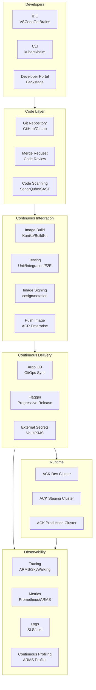
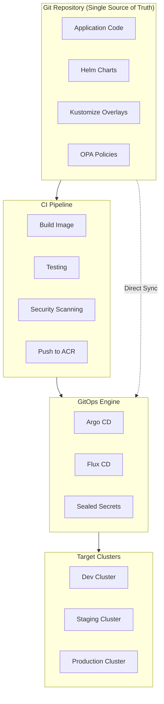
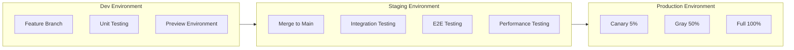
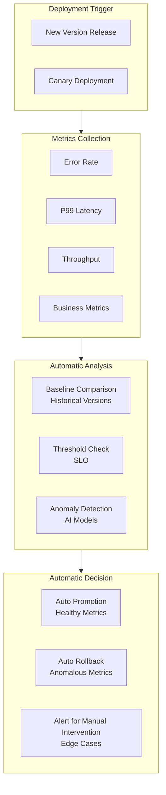
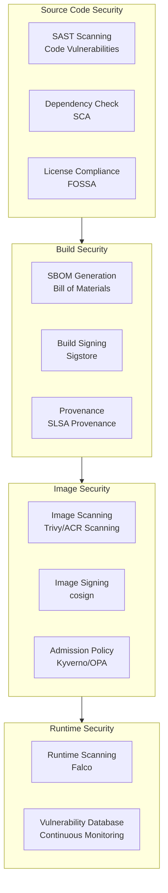
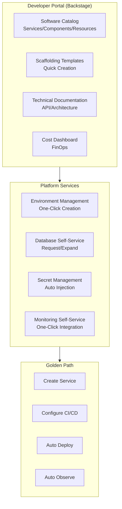
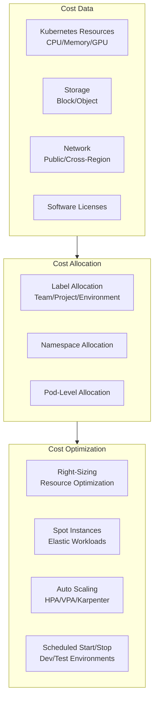

> **Production Environment Security Notice**
>
> This document contains directly executable operation and maintenance commands. Before execution, please confirm: whether the current target cluster and Namespace are correct; whether you have sufficient RBAC permissions; whether you have verified in a non-production environment. Command risk levels are marked: Red (high risk), Yellow (medium risk), Green (low risk/read-only).

# Cloud-Native DevOps Platform Kubernetes Production Architecture Design

> **Applicable Scenarios**: Enterprise-grade DevOps Platform / GitOps / Continuous Delivery / Platform Engineering / IDP Internal Developer Platform
> **Cloud Provider**: Alibaba Cloud ACK + Cloud Efficiency / MSE / ARMS Product Suite
> **Applicable Versions**: Kubernetes v1.29 - v1.33
> **Last Updated**: 2026-04-24
> **Target Audience**: DevOps Architects, Platform Engineers, SRE, Alibaba Cloud Solution Architects

---

## Table of Contents

- [1. Overall Architecture Overview](#1-overall-architecture-overview)
- [2. GitOps Delivery Pipeline Architecture](#2-gitops-delivery-pipeline-architecture)
- [3. Multi-Environment Promotion Architecture](#3-multi-environment-promotion-architecture)
- [4. Observability-Driven Release Architecture](#4-observability-driven-release-architecture)
- [5. Secure Supply Chain (SLSA) Architecture](#5-secure-supply-chain-slsa-architecture)
- [6. Platform Engineering (IDP) Architecture](#6-platform-engineering-idp-architecture)
- [7. Cost Governance and FinOps Architecture](#7-cost-governance-and-finops-architecture)
- [8. ACK Alibaba Cloud Deployment Architecture](#8-ack-alibaba-cloud-deployment-architecture)

---

## 1. Overall Architecture Overview



## Alibaba Cloud Product Mapping

| Architecture Layer | Alibaba Cloud Solution | Open Source Alternative |
|:---|:---|:---|
| Code Repository | **Cloud Efficiency Codeup** | GitLab / GitHub |
| CI/CD | **Cloud Efficiency Pipeline** / **ACK + Argo** | Jenkins / Tekton |
| Image Repository | **ACR Enterprise** | Harbor |
| GitOps | **ACK + Argo CD** | Argo CD / Flux |
| Artifact Management | **Cloud Efficiency Artifact Library** | Nexus / Artifactory |
| Testing | **Cloud Efficiency Test Management** | SonarQube |
| Observability | **ARMS** + **SLS** | Prometheus + Grafana + Loki |
| Security | **Cloud Security Center** + **ACR Image Scanning** | Trivy / Falco |

---

## 2. GitOps Delivery Pipeline Architecture



## Argo CD Application Configuration

```yaml
apiVersion: argoproj.io/v1alpha1
kind: Application
metadata:
  name: ecommerce-prod
  namespace: argocd
  finalizers:
    - resources-finalizer.argocd.argoproj.io
spec:
  project: production
  source:
    repoURL: https://github.com/org/gitops-manifests.git
    targetRevision: main
    path: overlays/production/ecommerce
    helm:
      valueFiles:
        - values-production.yaml
  destination:
    server: https://kubernetes.default.svc
    namespace: ecommerce-prod
  syncPolicy:
    automated:
      prune: true
      selfHeal: true
      allowEmpty: false
    syncOptions:
      - CreateNamespace=true
      - PrunePropagationPolicy=foreground
      - PruneLast=true
    retry:
      limit: 5
      backoff:
        duration: 5s
        factor: 2
        maxDuration: 3m
  revisionHistoryLimit: 10
```

---

## 3. Multi-Environment Promotion Architecture



---

## 4. Observability-Driven Release Architecture



---

## 5. Secure Supply Chain (SLSA) Architecture



---

## 6. Platform Engineering (IDP) Architecture



---

## 7. Cost Governance and FinOps Architecture



---

## 8. ACK Alibaba Cloud Deployment Architecture

## Multi-Cluster GitOps Management

```yaml
# ACK Multi-Cluster kubeconfig Secret
apiVersion: v1
kind: Secret
metadata:
  name: ack-clusters
  namespace: argocd
  labels:
    argocd.argoproj.io/secret-type: cluster
type: Opaque
stringData:
  name: ack-prod-hangzhou
  server: https://cluster-api.aliyuncs.com:6443
  config: |
    {
      "bearerToken": "<token>",
      "tlsClientConfig": {
        "insecure": false,
        "caData": "<base64-ca>"
      }
    }
---
# Alibaba Cloud ARMS Application Monitoring Integration
apiVersion: arms.aliyun.com/v1beta1
kind: ArmsApplicationMonitor
metadata:
  name: ecommerce-monitor
  namespace: production
spec:
  appName: ecommerce-order-service
  language: java
  agentVersion: "3.0"
  enable: true
  configs:
    - name: sampling_rate
      value: "10"
    - name: slow_sql_threshold
      value: "500"
---
# SLS Log Collection Configuration
apiVersion: log.alibabacloud.com/v1alpha1
kind: AliyunLogConfig
metadata:
  name: app-logs
  namespace: production
spec:
  projectName: k8s-log-cluster-prod
  logstoreName: app-logs
  shardCount: 2
  lifeCycle: 30
  logtailConfig:
    inputType: file
    configName: app-logs
    inputDetail:
      logType: json_log
      logPath: /app/logs
      filePattern: "*.json.log"
      dockerFile: true
      dockerIncludeLabel:
        app: "*"
```

---

## Reference Links

- [Alibaba Cloud Cloud Efficiency](https://www.aliyun.com/product/yunxiao)
- [Alibaba Cloud ACR](https://www.aliyun.com/product/acr)
- [Argo CD Documentation](https://argo-cd.readthedocs.io/)
- [Backstage Documentation](https://backstage.io/docs/)
- [SLSA Framework](https://slsa.dev/)

---

## Multi-Cloud Deployment Comparison

## Alibaba Cloud Service → Multi-Cloud Mapping Table

| Capability Domain | Alibaba Cloud Service | AWS Equivalent | GCP Equivalent | Azure Equivalent |
|:---|:---|:---|:---|:---|
| Container Orchestration | **ACK** | **EKS** | **GKE** | **AKS** |
| Code Repository | **Cloud Efficiency Codeup** | **CodeCommit** | **Cloud Source Repos** | **Azure Repos** |
| CI/CD Pipeline | **Cloud Efficiency Pipeline** | **CodePipeline / CodeBuild** | **Cloud Build** | **Azure Pipelines** |
| Image Repository | **ACR Enterprise** | **ECR** | **Artifact Registry** | **ACR (Azure)** |
| Artifact Management | **Cloud Efficiency Artifact Library** | **CodeArtifact** | **Artifact Registry** | **Azure Artifacts** |
| Application Monitoring | **ARMS** | **CloudWatch / X-Ray** | **Cloud Monitoring / Trace** | **Application Insights** |
| Logging Service | **SLS** | **CloudWatch Logs** | **Cloud Logging** | **Log Analytics** |
| Security Center | **Cloud Security Center** | **Security Hub / Inspector** | **Security Command Center** | **Microsoft Defender** |
| Image Scanning | **ACR Image Scanning** | **ECR Scan / Inspector** | **Artifact Analysis** | **ACR Tasks Scan** |
| Service Mesh | **MSE (Microservice Engine)** | **App Mesh** | **Anthos Service Mesh** | **Istio (Azure)** |
| Configuration Center | **ACM** | **AppConfig** | **Config Connector** | **App Configuration** |
| Secret Management | **KMS** | **KMS / Secrets Manager** | **Secret Manager** | **Key Vault** |
| Test Management | **Cloud Efficiency Test Management** | **CodeGuru** | **Cloud Test Lab** | **Azure Test Plans** |
| GitOps | **ACK + Argo CD** | **EKS + Argo CD** | **GKE + Argo CD** | **AKS + Argo CD** |

---

## Obsidian Related Documents

- topic-application-architecture MOC
- [[domain-20-application-patterns/topic-application-architecture/README.md|Topic Application Layer Architecture Design Best Practices]]

## See Also

- 17-saas-multitenant-architecture
- 18-data-midplatform-architecture
- 20-microservice-governance-architecture
- 21-cross-border-ecommerce

<!-- risk-assessed -->
