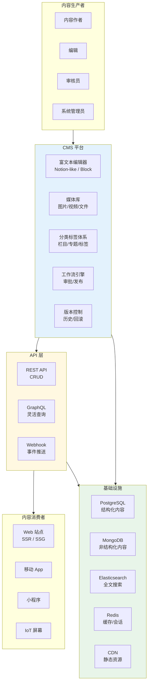
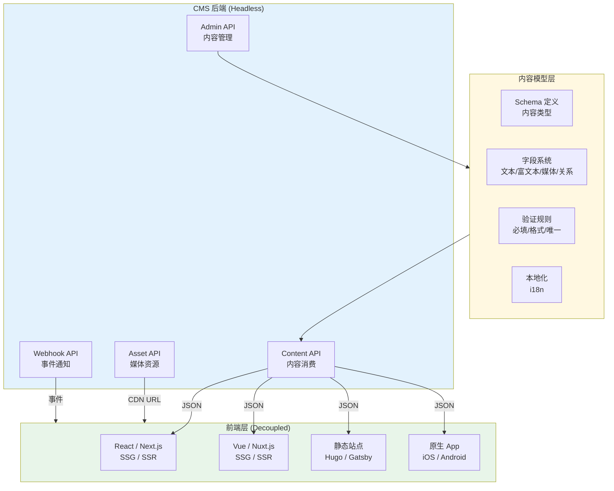
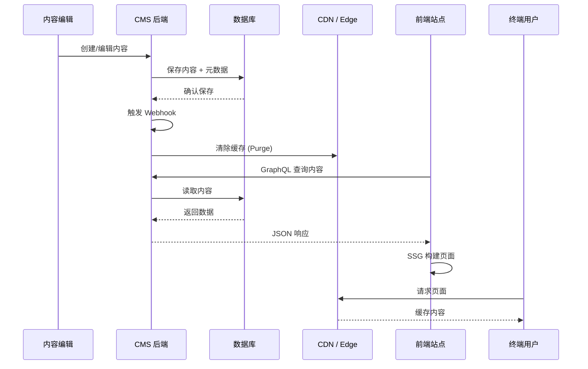
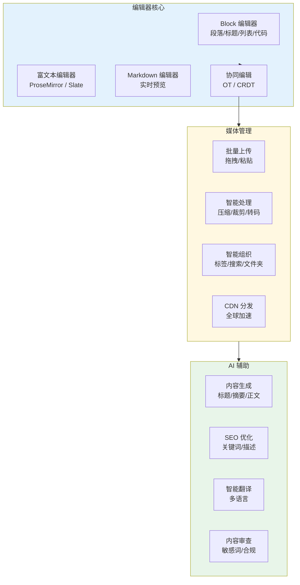
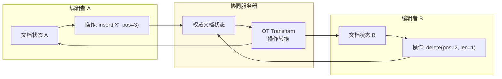
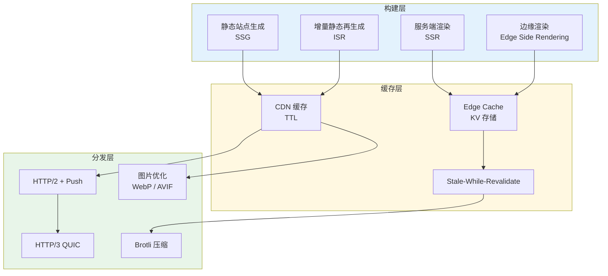
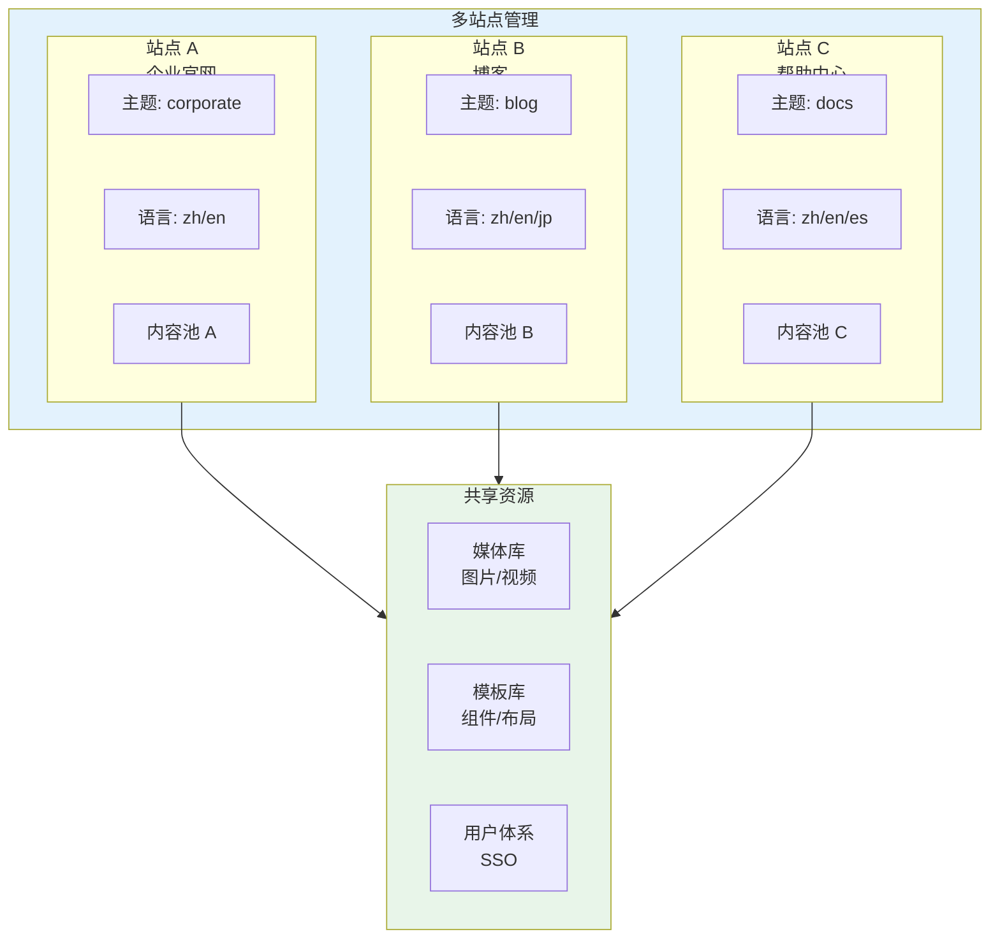
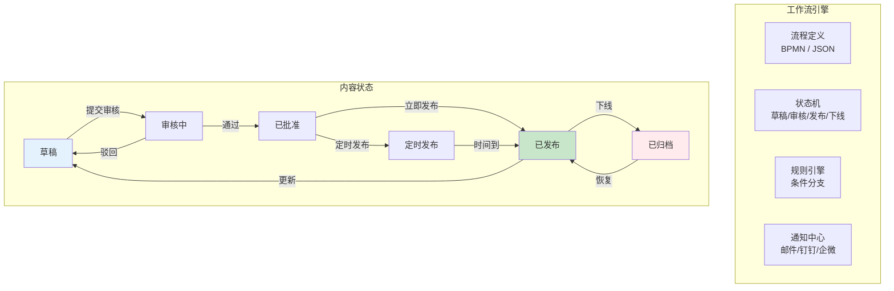
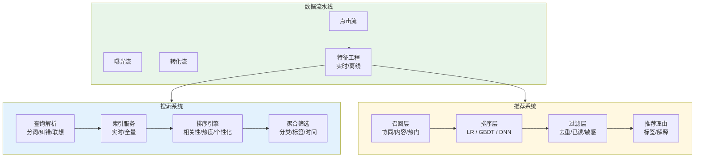
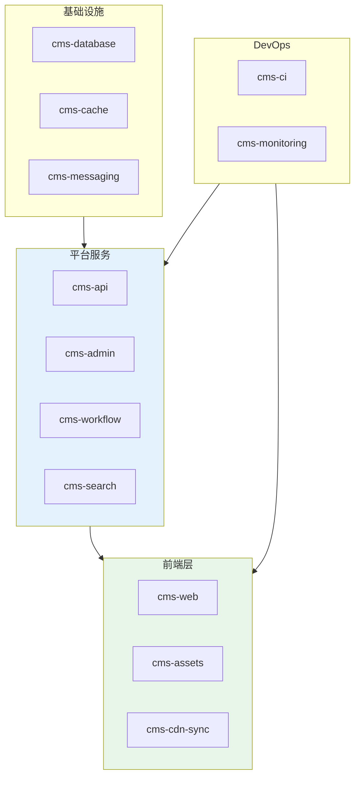

---title: 内容管理系统 (CMS) Kubernetes 生产架构设计
description: 'title: 内容管理系统 CMS 架构设计'
summary: 'title: 内容管理系统 CMS 架构设计'
category: general
tags:
- architecture
- best-practice
- scheduler
- redis
- postgresql
- elasticsearch
- hpa
- statefulset
- job
- cronjob
tier: core
created: '2026-05-23'
last_updated: 2026-05
difficulty: intermediate
reading_level: intermediate
audience:
- 所有工程师
estimated_read_time: 15min
intent_queries:
- 内容管理系统 (CMS) Kubernetes 生产架构设计 是什么
- 如何 内容管理系统 (CMS) Kubernetes 生产架构设计
- Kubernetes 20 application patterns 最佳实践
trigger_keywords:
- 内容管理系统
- CMS
- Kubernetes
- 生产架构设计
- application
- patterns
prerequisites:
- kubectl-basics
- prometheus-basics
- redis-basics
authors:
- name: Dillan Teagle
  role: contributor

---

> **生产环境安全提示**
>
> 本文档包含可直接执行的运维命令。执行前请确认：当前目标集群与 Namespace 是否正确；是否具备足够的 RBAC 权限；是否已在非生产环境验证。命令风险等级标注：🔴 高风险（可能造成数据丢失或服务中断）、🟡 中风险（会修改集群状态，但通常可回滚）、🟢 低风险/只读（信息收集，无副作用）。


title: 内容管理系统 CMS 架构设计
description: '# 内容管理系统 (CMS) [[Kubernetes|Kubernetes]] 生产架构设计'
category: application-architecture
tags:
- k8s
- architecture
- industry
- scheduler
- redis
- postgresql
- elasticsearch
- hpa
- [[StatefulSet|statefulset]]
- job
last_updated: 2026-05-18
difficulty: intermediate
reading_level: intermediate
audience:
- CMS架构师
- 全栈工程师
- 内容运营专家
estimated_read_time: 5min
intent_queries:
- Headless CMS Kubernetes 部署架构
- 内容协同编辑 OT 算法
- 多语言多站点管理
- 静态站点生成 SSG ISR
- 阿里云 OSS CDN 内容分发
trigger_keywords:
- CMS内容管理
- Headless CMS
- 协同编辑
- 多语言
- 多站点
- SSG静态生成
- ISR增量再生成
- GraphQL
- 内容工作流
- 审批发布
related_domains:
- domain-03-networking-traffic
- domain-10-troubleshooting-diagnostics
related_topics:
- topic-cms-architecture
- topic-content-platform-architecture
k8s_versions:
- '1.28'
- '1.29'
- '1.30'
- '1.31'
- '1.32'
---

# 内容管理系统 (CMS) Kubernetes 生产架构设计

> **适用场景**: 企业官网 / 新闻门户 / 知识库 / 文档中心 / 营销落地页 / 多站点管理  
> **适用版本**: Kubernetes v1.29 - v1.33  
> **最后更新**: 2026-04-24  
> **目标读者**: CMS 架构师、全栈工程师、内容运营

---

<!-- chunk: 📋 目录 -->## 📋 目录

- [一、整体架构全景](#一整体架构全景)
- [二、Headless CMS 架构](#二headless-cms-架构)
- [三、内容生产与编辑架构](#三内容生产与编辑架构)
- [四、内容分发与渲染架构](#四内容分发与渲染架构)
- [五、多站点与多语言架构](#五多站点与多语言架构)
- [六、工作流与审批架构](#六工作流与审批架构)
- [七、搜索与推荐架构](#七搜索与推荐架构)
- [八、K8s 部署架构](#八k8s-部署架构)

---

<!-- chunk: 一、整体架构全景 -->## 一、整体架构全景



---

<!-- chunk: 二、Headless CMS 架构 -->## 二、Headless CMS 架构



## Headless CMS 数据流



---

<!-- chunk: 三、内容生产与编辑架构 -->## 三、内容生产与编辑架构



## 协同编辑 OT 算法



---

<!-- chunk: 四、内容分发与渲染架构 -->## 四、内容分发与渲染架构



## Next.js SSG/ISR K8s 部署

```yaml
apiVersion: apps/v1
kind: Deployment
metadata:
  name: cms-frontend
  namespace: cms
spec:
  replicas: 3
  selector:
    matchLabels:
      app: cms-frontend
  template:
    metadata:
      labels:
        app: cms-frontend
    spec:
      containers:
        - name: nextjs
          image: cms/frontend:v2.0
          ports:
            - containerPort: 3000
          env:
            - name: CMS_API_URL
              value: "https://cms-api.internal"
            - name: NEXT_PUBLIC_CDN_URL
              value: "https://cdn.example.com"
            - name: REVALIDATE_TOKEN
              valueFrom:
                secretKeyRef:
                  name: cms-secrets
                  key: revalidate-token
          resources:
            requests:
              cpu: "500m"
              memory: "512Mi"
            limits:
              cpu: "2"
              memory: "2Gi"
---
apiVersion: networking.k8s.io/v1
kind: Ingress
metadata:
  name: cms-frontend
  namespace: cms
  annotations:
    nginx.ingress.kubernetes.io/ssl-redirect: "true"
    nginx.ingress.kubernetes.io/proxy-body-size: "10m"
    nginx.ingress.kubernetes.io/server-snippet: |
      location /_next/static {
        expires 365d;
        add_header Cache-Control "public, immutable";
      }
spec:
  rules:
    - host: www.example.com
      http:
        paths:
          - path: /
            pathType: Prefix
            backend:
              service:
                name: cms-frontend
                port:
                  number: 3000
```

---

<!-- chunk: 五、多站点与多语言架构 -->## 五、多站点与多语言架构



## 多语言内容模型

```yaml
# Strapi / Contentful 风格的多语言内容模型
apiVersion: cms.example.com/v1
kind: ContentType
metadata:
  name: article
spec:
  fields:
    - name: title
      type: string
      required: true
      localized: true  # 多语言字段

    - name: slug
      type: uid
      required: true
      localized: false  # 非多语言

    - name: content
      type: richtext
      required: true
      localized: true

    - name: cover_image
      type: media
      multiple: false
      localized: false

    - name: seo_meta
      type: component
      component: seo.meta
      localized: true

  locales:
    - zh-CN
    - en-US
    - ja-JP
    - es-ES

  defaultLocale: zh-CN
```

---

<!-- chunk: 六、工作流与审批架构 -->## 六、工作流与审批架构



## K8s CronJob 定时发布

```yaml
apiVersion: batch/v1
kind: CronJob
metadata:
  name: cms-scheduled-publish
  namespace: cms
spec:
  schedule: "*/5 * * * *"  # 每 5 分钟检查一次
  jobTemplate:
    spec:
      template:
        spec:
          containers:
            - name: publisher
              image: cms/scheduler:v1.0
              env:
                - name: CMS_API_URL
                  value: "http://cms-api:8080"
              command:
                - /bin/sh
                - -c
                - |
                  curl -X POST \
                    -H "Authorization: Bearer ${SCHEDULER_TOKEN}" \
                    ${CMS_API_URL}/v1/tasks/publish-scheduled
          restartPolicy: OnFailure
---
# 工作流审批服务
apiVersion: apps/v1
kind: Deployment
metadata:
  name: cms-workflow
  namespace: cms
spec:
  replicas: 2
  selector:
    matchLabels:
      app: cms-workflow
  template:
    metadata:
      labels:
        app: cms-workflow
    spec:
      containers:
        - name: workflow
          image: cms/workflow-engine:v1.0
          ports:
            - containerPort: 8080
          env:
            - name: DB_URL
              valueFrom:
                secretKeyRef:
                  name: cms-db-secret
                  key: url
            - name: REDIS_URL
              value: "redis://redis-cluster:6379"
```

---

<!-- chunk: 七、搜索与推荐架构 -->## 七、搜索与推荐架构



---

<!-- chunk: 八、K8s 部署架构 -->## 八、K8s 部署架构

## Namespace 组织



## 高可用架构

```yaml
apiVersion: apps/v1
kind: StatefulSet
metadata:
  name: cms-postgresql
  namespace: cms-database
spec:
  serviceName: cms-postgresql
  replicas: 3
  selector:
    matchLabels:
      app: cms-postgresql
  template:
    metadata:
      labels:
        app: cms-postgresql
    spec:
      affinity:
        podAntiAffinity:
          requiredDuringSchedulingIgnoredDuringExecution:
            - labelSelector:
                matchExpressions:
                  - key: app
                    operator: In
                    values:
                      - cms-postgresql
              topologyKey: kubernetes.io/hostname
      containers:
        - name: postgres
          image: ghcr.io/cloudnative-pg/postgresql:16
          ports:
            - containerPort: 5432
          env:
            - name: POSTGRES_DB
              value: cms_production
            - name: POSTGRES_USER
              valueFrom:
                secretKeyRef:
                  name: cms-db-credentials
                  key: username
            - name: POSTGRES_PASSWORD
              valueFrom:
                secretKeyRef:
                  name: cms-db-credentials
                  key: password
          volumeMounts:
            - name: postgres-data
              mountPath: /var/lib/postgresql/data
  volumeClaimTemplates:
    - metadata:
        name: postgres-data
      spec:
        storageClassName: fast-ssd
        accessModes: ["ReadWriteOnce"]
        resources:
          requests:
            storage: 100Gi
---
# CMS API HPA
apiVersion: autoscaling/v2
kind: HorizontalPodAutoscaler
metadata:
  name: cms-api-hpa
  namespace: cms-api
spec:
  scaleTargetRef:
    apiVersion: apps/v1
    kind: Deployment
    name: cms-api
  minReplicas: 3
  maxReplicas: 20
  metrics:
    - type: Resource
      resource:
        name: cpu
        target:
          type: Utilization
          averageUtilization: 70
    - type: Pods
      pods:
        metric:
          name: http_requests_per_second
        target:
          type: AverageValue
          averageValue: "1000"
```

---

<!-- chunk: 参考链接 -->## 参考链接

- [Strapi 架构文档](https://docs.strapi.io/dev-docs/deployment)
- [Contentful 架构](https://www.contentful.com/developers/docs/)
- [Next.js ISR 文档](https://nextjs.org/docs/pages/building-your-application/data-fetching/incremental-static-regeneration)

---

<!-- chunk: Obsidian 相关文档 -->## Obsidian 相关文档

- topic-application-architecture MOC
- [[domain-20-application-patterns/topic-application-architecture/README.md|Topic 应用层架构设计最佳实践]]
- [[domain-20-application-patterns/topic-application-architecture/01-ecommerce-architecture.md|电商系统 Kubernetes 生产架构设计]]
- [[domain-20-application-patterns/topic-application-architecture/02-mini-program-architecture.md|小程序平台架构设计]]
- [[domain-20-application-patterns/topic-application-architecture/04-im-rtc-architecture.md|实时通信 IM/RTC 架构设计]]
- [[domain-20-application-patterns/topic-application-architecture/05-online-education-architecture.md|在线教育平台 Kubernetes 生产架构设计]]
- [[domain-20-application-patterns/topic-application-architecture/06-fintech-architecture.md|金融科技FinTech Kubernetes生产架构设计]]
- [[domain-20-application-patterns/topic-application-architecture/07-iot-platform-architecture.md|物联网 IoT 平台架构设计]]
- [[domain-20-application-patterns/topic-application-architecture/08-ai-ml-inference-architecture.md|AI/ML 推理服务 Kubernetes 生产架构设计]]
- [[domain-20-application-patterns/topic-application-architecture/09-gaming-backend-architecture.md|游戏后端 Kubernetes 生产架构设计]]
- [[domain-20-application-patterns/topic-application-architecture/10-social-media-architecture.md|社交媒体平台Kubernetes生产架构设计]]
- [[domain-20-application-patterns/topic-application-architecture/11-smart-retail-architecture.md|智慧零售与新零售Kubernetes生产架构设计]]

## See Also

- 01-ecommerce-architecture
- 02-mini-program-architecture
- 04-im-rtc-architecture
- 05-online-education-architecture


<!-- risk-assessed -->
