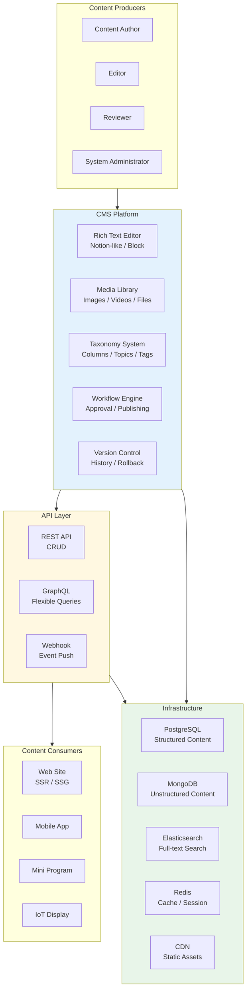
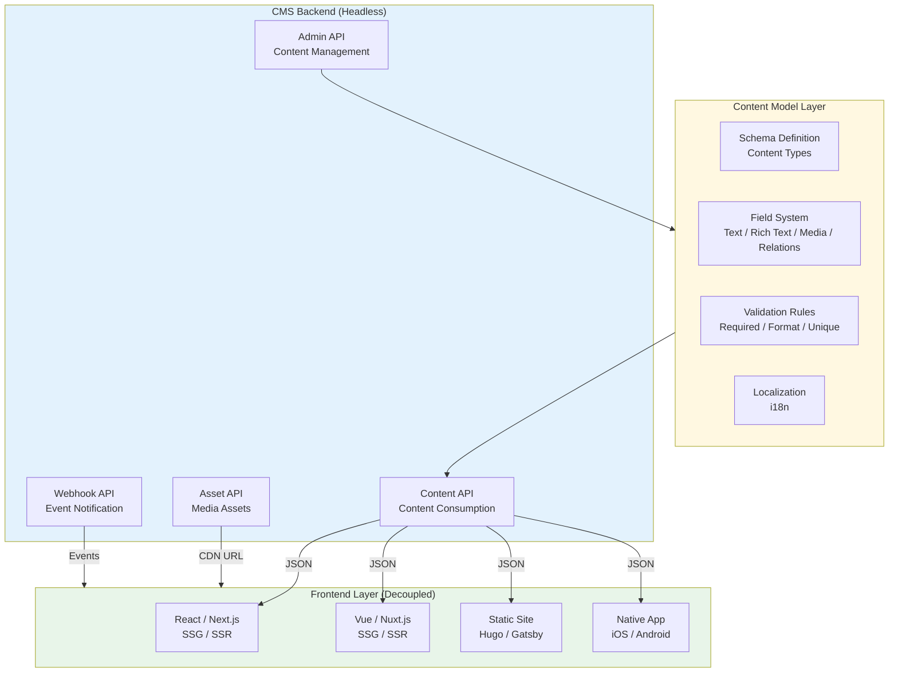
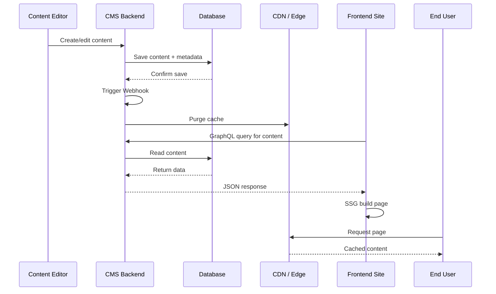
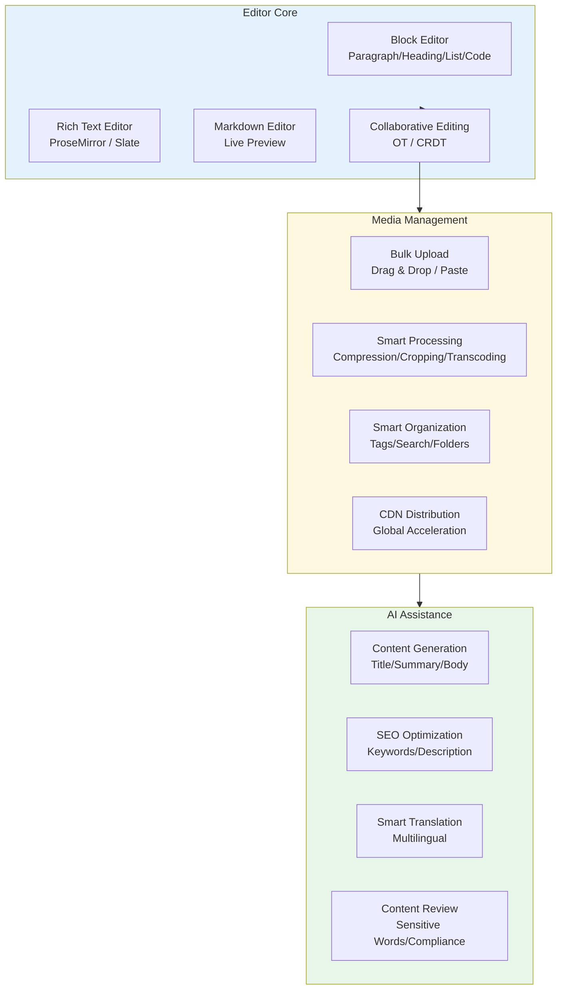
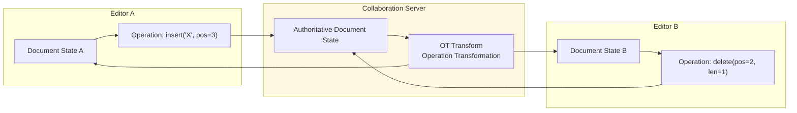
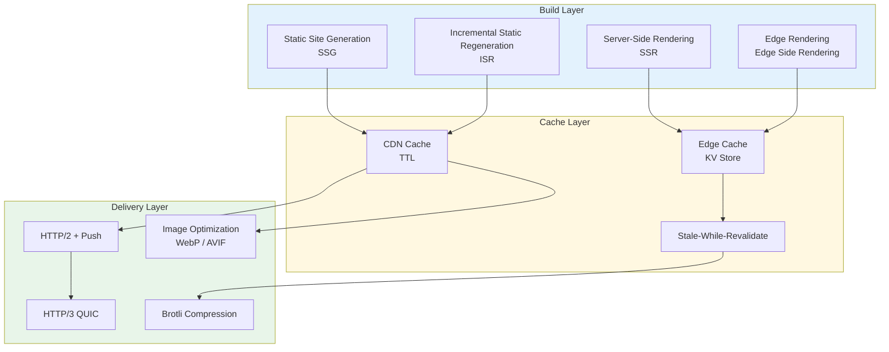
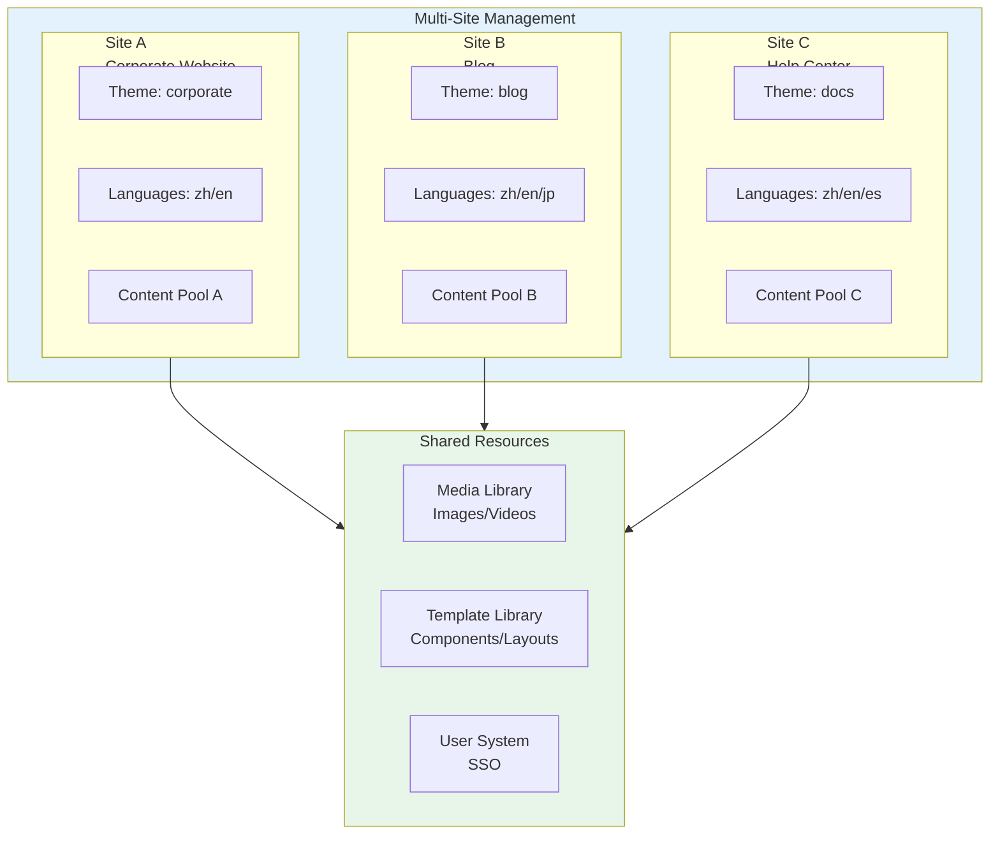
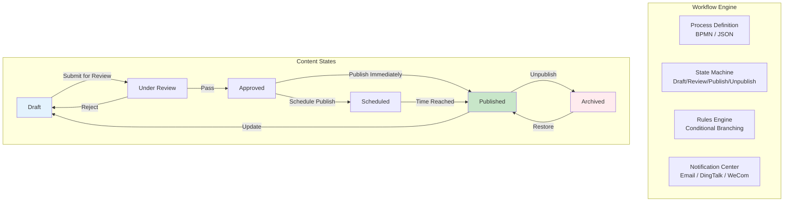
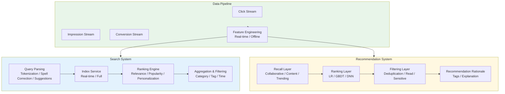
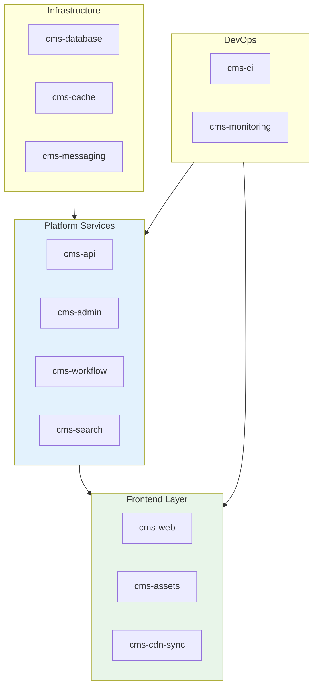

---title: Content Management System (CMS) Kubernetes Production Architecture Design
description: 'title: Content Management System CMS Architecture Design'
summary: 'title: Content Management System CMS Architecture Design'
category: general
tags:
- architecture
- best-practice
- scheduler
- redis
- postgresql
- elasticsearch
- hpa
- statefulset
- job
- cronjob
tier: core
created: '2026-05-23'
last_updated: 2026-05
difficulty: intermediate
reading_level: intermediate
audience:
- All Engineers
estimated_read_time: 15min
intent_queries:
- What is Content Management System (CMS) Kubernetes Production Architecture Design
- How to Content Management System (CMS) Kubernetes Production Architecture Design
- Kubernetes 20 application patterns best practices
trigger_keywords:
- Content Management System
- CMS
- Kubernetes
- Production Architecture Design
- application
- patterns
prerequisites:
- kubectl-basics
- prometheus-basics
- redis-basics
authors:
- name: Dillan Teagle
  role: contributor

---

> **Production Environment Safety Notice**
>
> This document contains operational commands that can be executed directly. Before executing, please confirm: whether the current target cluster and Namespace are correct; whether you have sufficient RBAC permissions; whether validation has been performed in a non-production environment. Command risk levels are marked as: 🔴 High Risk (may cause data loss or service interruption), 🟡 Medium Risk (modifies cluster state, but is generally reversible), 🟢 Low Risk/Read-Only (information gathering, no side effects).


title: Content Management System CMS Architecture Design
description: '# Content Management System (CMS) [[Kubernetes|Kubernetes]] Production Architecture Design'
category: application-architecture
tags:
- k8s
- architecture
- industry
- scheduler
- redis
- postgresql
- elasticsearch
- hpa
- [[StatefulSet|statefulset]]
- job
last_updated: 2026-05-18
difficulty: intermediate
reading_level: intermediate
audience:
- CMS Architects
- Full-Stack Engineers
- Content Operations Specialists
estimated_read_time: 5min
intent_queries:
- Headless CMS Kubernetes deployment architecture
- Collaborative content editing OT algorithm
- Multi-language multi-site management
- Static site generation SSG ISR
- Alibaba Cloud OSS CDN content delivery
trigger_keywords:
- CMS Content Management
- Headless CMS
- Collaborative Editing
- Multi-language
- Multi-site
- SSG Static Generation
- ISR Incremental Static Regeneration
- GraphQL
- Content Workflow
- Approval Publishing
related_domains:
- domain-03-networking-traffic
- domain-10-troubleshooting-diagnostics
related_topics:
- topic-cms-architecture
- topic-content-platform-architecture
k8s_versions:
- '1.28'
- '1.29'
- '1.30'
- '1.31'
- '1.32'
---
# Content Management System (CMS) Kubernetes Production Architecture Design

> **Applicable Scenarios**: Enterprise websites / News portals / Knowledge bases / Documentation centers / Marketing landing pages / Multi-site management
> **Applicable Versions**: Kubernetes v1.29 - v1.33
> **Last Updated**: 2026-04-24
> **Target Audience**: CMS Architects, Full-stack Engineers, Content Operations

---

## 📋 Table of Contents

- [I. Overall Architecture Overview](#i-overall-architecture-overview)
- [II. Headless CMS Architecture](#ii-headless-cms-architecture)
- [III. Content Production and Editing Architecture](#iii-content-production-and-editing-architecture)
- [IV. Content Distribution and Rendering Architecture](#iv-content-delivery-and-rendering-architecture)
- [V. Multi-site and Multi-language Architecture](#5-multi-site-and-multi-language-architecture)
- [VI. Workflow and Approval Architecture](#vi-workflow-and-approval-architecture)
- [VII. Search and Recommendation Architecture](#vii-search-and-recommendation-architecture)
- [VIII. K8s Deployment Architecture](#viii-k8s-deployment-architecture)

---

## I. Overall Architecture Overview


```mermaid
flowchart TB
    subgraph Editors["Content Producers"]
        AUTHOR["Content Author"]
        EDITOR["Editor"]
        REVIEWER["Reviewer"]
        ADMIN["System Administrator"]
    end

    subgraph CMSPlatform["CMS Platform"]
        EDITOR_UI["Rich Text Editor<br/>Notion-like / Block"]
        MEDIA["Media Library<br/>Images / Videos / Files"]
        TAXONOMY["Taxonomy System<br/>Columns / Topics / Tags"]
        WORKFLOW["Workflow Engine<br/>Approval / Publishing"]
        VERSION["Version Control<br/>History / Rollback"]
    end

    subgraph API["API Layer"]
        REST["REST API<br/>CRUD"]
        GRAPHQL["GraphQL<br/>Flexible Queries"]
        WEBHOOK["Webhook<br/>Event Push"]
    end

    subgraph Consumers["Content Consumers"]
        WEB["Web Site<br/>SSR / SSG"]
        MOBILE["Mobile App"]
        MINI["Mini Program"]
        IOT["IoT Display"]
    end

    subgraph Infra["Infrastructure"]
        DB["PostgreSQL<br/>Structured Content"]
        MONGO["MongoDB<br/>Unstructured Content"]
        ES["Elasticsearch<br/>Full-text Search"]
        REDIS["Redis<br/>Cache / Session"]
        CDN["CDN<br/>Static Assets"]
    end

    Editors --> CMSPlatform --> API --> Consumers
    CMSPlatform --> Infra
    API --> Infra

    style CMSPlatform fill:#e3f2fd
    style API fill:#fff8e1
    style Infra fill:#e8f5e9
```

---

## II. Headless CMS Architecture


```mermaid
flowchart TB
    subgraph Backend["CMS Backend (Headless)"]
        ADMIN_API["Admin API<br/>Content Management"]
        CONTENT_API["Content API<br/>Content Consumption"]
        ASSET_API["Asset API<br/>Media Assets"]
        WEBHOOK_API["Webhook API<br/>Event Notification"]
    end

    subgraph ContentModel["Content Model Layer"]
        SCHEMA["Schema Definition<br/>Content Types"]
        FIELD["Field System<br/>Text / Rich Text / Media / Relations"]
        VALIDATE["Validation Rules<br/>Required / Format / Unique"]
        LOCALIZE["Localization<br/>i18n"]
    end

    subgraph Frontend["Frontend Layer (Decoupled)"]
        REACT["React / Next.js<br/>SSG / SSR"]
        VUE["Vue / Nuxt.js<br/>SSG / SSR"]
        STATIC["Static Site<br/>Hugo / Gatsby"]
        NATIVE["Native App<br/>iOS / Android"]
    end

    ADMIN_API --> ContentModel --> CONTENT_API
    CONTENT_API -->|JSON| REACT & VUE & STATIC & NATIVE
    ASSET_API -->|CDN URL| Frontend
    WEBHOOK_API -->|Events| Frontend

    style Backend fill:#e3f2fd
    style ContentModel fill:#fff8e1
    style Frontend fill:#e8f5e9
```
## Headless CMS Data Flow


```mermaid
sequenceDiagram
    participant Editor as Content Editor
    participant CMS as CMS Backend
    participant DB as Database
    participant CDN as CDN / Edge
    participant Site as Frontend Site
    participant User as End User

    Editor->>CMS: Create/edit content
    CMS->>DB: Save content + metadata
    DB-->>CMS: Confirm save
    CMS->>CMS: Trigger Webhook
    CMS->>CDN: Purge cache

    Site->>CMS: GraphQL query for content
    CMS->>DB: Read content
    DB-->>CMS: Return data
    CMS-->>Site: JSON response
    Site->>Site: SSG build page

    User->>CDN: Request page
    CDN-->>User: Cached content
```

---

## III. Content Production and Editing Architecture


```mermaid
flowchart TB
    subgraph Editor["Editor Core"]
        BLOCK["Block Editor<br/>Paragraph/Heading/List/Code"]
        RICH["Rich Text Editor<br/>ProseMirror / Slate"]
        MD["Markdown Editor<br/>Live Preview"]
        COLLAB["Collaborative Editing<br/>OT / CRDT"]
    end

    subgraph Media["Media Management"]
        UPLOAD["Bulk Upload<br/>Drag & Drop / Paste"]
        PROCESS["Smart Processing<br/>Compression/Cropping/Transcoding"]
        ORG["Smart Organization<br/>Tags/Search/Folders"]
        CDN_PUSH["CDN Distribution<br/>Global Acceleration"]
    end

    subgraph AI["AI Assistance"]
        GEN["Content Generation<br/>Title/Summary/Body"]
        SEO["SEO Optimization<br/>Keywords/Description"]
        TRANS["Smart Translation<br/>Multilingual"]
        CHECK["Content Review<br/>Sensitive Words/Compliance"]
    end

    Editor --> COLLAB --> Media --> AI

    style Editor fill:#e3f2fd
    style Media fill:#fff8e1
    style AI fill:#e8f5e9
```

## Collaborative Editing OT Algorithm


```mermaid
flowchart LR
    subgraph ClientA["Editor A"]
        A_DOC["Document State A"]
        A_OP["Operation: insert('X', pos=3)"]
    end

    subgraph Server["Collaboration Server"]
        SERVER_DOC["Authoritative Document State"]
        TRANSFORM["OT Transform<br/>Operation Transformation"]
    end

    subgraph ClientB["Editor B"]
        B_DOC["Document State B"]
        B_OP["Operation: delete(pos=2, len=1)"]
    end

    A_DOC --> A_OP --> SERVER_DOC
    B_DOC --> B_OP --> SERVER_DOC
    SERVER_DOC --> TRANSFORM --> A_DOC & B_DOC

    style Server fill:#fff8e1
```

---

## IV. Content Delivery and Rendering Architecture


```mermaid
flowchart TB
    subgraph Build["Build Layer"]
        SSG["Static Site Generation<br/>SSG"]
        SSR["Server-Side Rendering<br/>SSR"]
        ISR["Incremental Static Regeneration<br/>ISR"]
        EDGE["Edge Rendering<br/>Edge Side Rendering"]
    end

    subgraph Cache["Cache Layer"]
        CDN_CACHE["CDN Cache<br/>TTL"]
        EDGE_CACHE["Edge Cache<br/>KV Store"]
        STALE["Stale-While-Revalidate"]
    end

    subgraph Delivery["Delivery Layer"]
        HTTP2["HTTP/2 + Push"]
        QUIC["HTTP/3 QUIC"]
        BROTLI["Brotli Compression"]
        IMG_OPT["Image Optimization<br/>WebP / AVIF"]
    end

    SSG --> CDN_CACHE --> HTTP2 --> QUIC
    SSR --> EDGE_CACHE --> STALE --> BROTLI
    ISR --> CDN_CACHE --> IMG_OPT
    EDGE --> EDGE_CACHE

    style Build fill:#e3f2fd
    style Cache fill:#fff8e1
    style Delivery fill:#e8f5e9
```
## Next.js SSG/ISR K8s Deployment

```yaml
apiVersion: apps/v1
kind: Deployment
metadata:
  name: cms-frontend
  namespace: cms
spec:
  replicas: 3
  selector:
    matchLabels:
      app: cms-frontend
  template:
    metadata:
      labels:
        app: cms-frontend
    spec:
      containers:
        - name: nextjs
          image: cms/frontend:v2.0
          ports:
            - containerPort: 3000
          env:
            - name: CMS_API_URL
              value: "https://cms-api.internal"
            - name: NEXT_PUBLIC_CDN_URL
              value: "https://cdn.example.com"
            - name: REVALIDATE_TOKEN
              valueFrom:
                secretKeyRef:
                  name: cms-secrets
                  key: revalidate-token
          resources:
            requests:
              cpu: "500m"
              memory: "512Mi"
            limits:
              cpu: "2"
              memory: "2Gi"
---
apiVersion: networking.k8s.io/v1
kind: Ingress
metadata:
  name: cms-frontend
  namespace: cms
  annotations:
    nginx.ingress.kubernetes.io/ssl-redirect: "true"
    nginx.ingress.kubernetes.io/proxy-body-size: "10m"
    nginx.ingress.kubernetes.io/server-snippet: |
      location /_next/static {
        expires 365d;
        add_header Cache-Control "public, immutable";
      }
spec:
  rules:
    - host: www.example.com
      http:
        paths:
          - path: /
            pathType: Prefix
            backend:
              service:
                name: cms-frontend
                port:
                  number: 3000
```

---

## 5. Multi-Site and Multi-Language Architecture


```mermaid
flowchart TB
    subgraph MultiSite["Multi-Site Management"]
        subgraph SiteA["Site A<br/>Corporate Website"]
            A_THEME["Theme: corporate"]
            A_LANG["Languages: zh/en"]
            A_CONTENT["Content Pool A"]
        end

        subgraph SiteB["Site B<br/>Blog"]
            B_THEME["Theme: blog"]
            B_LANG["Languages: zh/en/jp"]
            B_CONTENT["Content Pool B"]
        end

        subgraph SiteC["Site C<br/>Help Center"]
            C_THEME["Theme: docs"]
            C_LANG["Languages: zh/en/es"]
            C_CONTENT["Content Pool C"]
        end
    end

    subgraph Shared["Shared Resources"]
        ASSET["Media Library<br/>Images/Videos"]
        TEMPLATE["Template Library<br/>Components/Layouts"]
        USER["User System<br/>SSO"]
    end

    SiteA & SiteB & SiteC --> Shared

    style MultiSite fill:#e3f2fd
    style Shared fill:#e8f5e9
```
## Multilingual Content Model

```yaml
# Strapi / Contentful style multilingual content model
apiVersion: cms.example.com/v1
kind: ContentType
metadata:
  name: article
spec:
  fields:
    - name: title
      type: string
      required: true
      localized: true  # multilingual field

    - name: slug
      type: uid
      required: true
      localized: false  # non-multilingual

    - name: content
      type: richtext
      required: true
      localized: true

    - name: cover_image
      type: media
      multiple: false
      localized: false

    - name: seo_meta
      type: component
      component: seo.meta
      localized: true

  locales:
    - zh-CN
    - en-US
    - ja-JP
    - es-ES

  defaultLocale: zh-CN
```

---

## VI. Workflow and Approval Architecture


```mermaid
flowchart TB
    subgraph WorkflowEngine["Workflow Engine"]
        DEFINE["Process Definition<br/>BPMN / JSON"]
        STATE["State Machine<br/>Draft/Review/Publish/Unpublish"]
        RULE["Rules Engine<br/>Conditional Branching"]
        NOTIFY["Notification Center<br/>Email / DingTalk / WeCom"]
    end

    subgraph States["Content States"]
        DRAFT["Draft"]
        REVIEW["Under Review"]
        APPROVED["Approved"]
        PUBLISHED["Published"]
        SCHEDULED["Scheduled"]
        ARCHIVED["Archived"]
    end

    DRAFT -->|Submit for Review| REVIEW
    REVIEW -->|Pass| APPROVED
    REVIEW -->|Reject| DRAFT
    APPROVED -->|Publish Immediately| PUBLISHED
    APPROVED -->|Schedule Publish| SCHEDULED
    SCHEDULED -->|Time Reached| PUBLISHED
    PUBLISHED -->|Update| DRAFT
    PUBLISHED -->|Unpublish| ARCHIVED
    ARCHIVED -->|Restore| PUBLISHED

    style DRAFT fill:#e3f2fd
    style PUBLISHED fill:#c8e6c9
    style ARCHIVED fill:#ffebee
```

## K8s CronJob Scheduled Publishing

```yaml
apiVersion: batch/v1
kind: CronJob
metadata:
  name: cms-scheduled-publish
  namespace: cms
spec:
  schedule: "*/5 * * * *"  # check every 5 minutes
  jobTemplate:
    spec:
      template:
        spec:
          containers:
            - name: publisher
              image: cms/scheduler:v1.0
              env:
                - name: CMS_API_URL
                  value: "http://cms-api:8080"
              command:
                - /bin/sh
                - -c
                - |
                  curl -X POST \
                    -H "Authorization: Bearer ${SCHEDULER_TOKEN}" \
                    ${CMS_API_URL}/v1/tasks/publish-scheduled
          restartPolicy: OnFailure
---
# Workflow approval service
apiVersion: apps/v1
kind: Deployment
metadata:
  name: cms-workflow
  namespace: cms
spec:
  replicas: 2
  selector:
    matchLabels:
      app: cms-workflow
  template:
    metadata:
      labels:
        app: cms-workflow
    spec:
      containers:
        - name: workflow
          image: cms/workflow-engine:v1.0
          ports:
            - containerPort: 8080
          env:
            - name: DB_URL
              valueFrom:
                secretKeyRef:
                  name: cms-db-secret
                  key: url
            - name: REDIS_URL
              value: "redis://redis-cluster:6379"
```

---
## VII. Search and Recommendation Architecture


```mermaid
flowchart TB
    subgraph Search["Search System"]
        QUERY["Query Parsing<br/>Tokenization / Spell Correction / Suggestions"]
        INDEX["Index Service<br/>Real-time / Full"]
        RANKING["Ranking Engine<br/>Relevance / Popularity / Personalization"]
        FACET["Aggregation & Filtering<br/>Category / Tag / Time"]
    end

    subgraph Recommend["Recommendation System"]
        RECALL["Recall Layer<br/>Collaborative / Content / Trending"]
        RANK["Ranking Layer<br/>LR / GBDT / DNN"]
        FILTER["Filtering Layer<br/>Deduplication / Read / Sensitive"]
        REASON["Recommendation Rationale<br/>Tags / Explanation"]
    end

    subgraph DataPipeline["Data Pipeline"]
        CLICK["Click Stream"]
        IMPRESSION["Impression Stream"]
        CONVERT["Conversion Stream"]
        FEATURE["Feature Engineering<br/>Real-time / Offline"]
    end

    DataPipeline --> FEATURE --> Search & Recommend
    QUERY --> INDEX --> RANKING --> FACET
    RECALL --> RANK --> FILTER --> REASON

    style Search fill:#e3f2fd
    style Recommend fill:#fff8e1
    style DataPipeline fill:#e8f5e9
```

---

## VIII. K8s Deployment Architecture

## Namespace Organization


```mermaid
flowchart TB
    subgraph Infra["Infrastructure"]
        NS_DB["cms-database"]
        NS_CACHE["cms-cache"]
        NS_MQ["cms-messaging"]
    end

    subgraph Platform["Platform Services"]
        NS_API["cms-api"]
        NS_ADMIN["cms-admin"]
        NS_WORKFLOW["cms-workflow"]
        NS_SEARCH["cms-search"]
    end

    subgraph Frontend["Frontend Layer"]
        NS_WEB["cms-web"]
        NS_ASSET["cms-assets"]
        NS_CDN["cms-cdn-sync"]
    end

    subgraph DevOps["DevOps"]
        NS_CI["cms-ci"]
        NS_MONITOR["cms-monitoring"]
    end

    Infra --> Platform --> Frontend
    DevOps --> Platform & Frontend

    style Platform fill:#e3f2fd
    style Frontend fill:#e8f5e9
```

## High Availability Architecture

```yaml
apiVersion: apps/v1
kind: StatefulSet
metadata:
  name: cms-postgresql
  namespace: cms-database
spec:
  serviceName: cms-postgresql
  replicas: 3
  selector:
    matchLabels:
      app: cms-postgresql
  template:
    metadata:
      labels:
        app: cms-postgresql
    spec:
      affinity:
        podAntiAffinity:
          requiredDuringSchedulingIgnoredDuringExecution:
            - labelSelector:
                matchExpressions:
                  - key: app
                    operator: In
                    values:
                      - cms-postgresql
              topologyKey: kubernetes.io/hostname
      containers:
        - name: postgres
          image: ghcr.io/cloudnative-pg/postgresql:16
          ports:
            - containerPort: 5432
          env:
            - name: POSTGRES_DB
              value: cms_production
            - name: POSTGRES_USER
              valueFrom:
                secretKeyRef:
                  name: cms-db-credentials
                  key: username
            - name: POSTGRES_PASSWORD
              valueFrom:
                secretKeyRef:
                  name: cms-db-credentials
                  key: password
          volumeMounts:
            - name: postgres-data
              mountPath: /var/lib/postgresql/data
  volumeClaimTemplates:
    - metadata:
        name: postgres-data
      spec:
        storageClassName: fast-ssd
        accessModes: ["ReadWriteOnce"]
        resources:
          requests:
            storage: 100Gi
---
# CMS API HPA
apiVersion: autoscaling/v2
kind: HorizontalPodAutoscaler
metadata:
  name: cms-api-hpa
  namespace: cms-api
spec:
  scaleTargetRef:
    apiVersion: apps/v1
    kind: Deployment
    name: cms-api
  minReplicas: 3
  maxReplicas: 20
  metrics:
    - type: Resource
      resource:
        name: cpu
        target:
          type: Utilization
          averageUtilization: 70
    - type: Pods
      pods:
        metric:
          name: http_requests_per_second
        target:
          type: AverageValue
          averageValue: "1000"
```

---
## Reference Links

- [Strapi Architecture Documentation](https://docs.strapi.io/dev-docs/deployment)
- [Contentful Architecture](https://www.contentful.com/developers/docs/)
- [Next.js ISR Documentation](https://nextjs.org/docs/pages/building-your-application/data-fetching/incremental-static-regeneration)

---

## Obsidian Related Documents

- topic-application-architecture MOC
- [[domain-20-application-patterns/topic-application-architecture/README.md|Topic Application Layer Architecture Design Best Practices]]
- [[domain-20-application-patterns/topic-application-architecture/01-ecommerce-architecture.md|E-commerce System Kubernetes Production Architecture Design]]
- [[domain-20-application-patterns/topic-application-architecture/02-mini-program-architecture.md|Mini Program Platform Architecture Design]]
- [[domain-20-application-patterns/topic-application-architecture/04-im-rtc-architecture.md|Real-Time Communication IM/RTC Architecture Design]]
- [[domain-20-application-patterns/topic-application-architecture/05-online-education-architecture.md|Online Education Platform Kubernetes Production Architecture Design]]
- [[domain-20-application-patterns/topic-application-architecture/06-fintech-architecture.md|FinTech Kubernetes Production Architecture Design]]
- [[domain-20-application-patterns/topic-application-architecture/07-iot-platform-architecture.md|IoT Platform Architecture Design]]
- [[domain-20-application-patterns/topic-application-architecture/08-ai-ml-inference-architecture.md|AI/ML Inference Service Kubernetes Production Architecture Design]]
- [[domain-20-application-patterns/topic-application-architecture/09-gaming-backend-architecture.md|Gaming Backend Kubernetes Production Architecture Design]]
- [[domain-20-application-patterns/topic-application-architecture/10-social-media-architecture.md|Social Media Platform Kubernetes Production Architecture Design]]
- [[domain-20-application-patterns/topic-application-architecture/11-smart-retail-architecture.md|Smart Retail and New Retail Kubernetes Production Architecture Design]]

## See Also

- 01-ecommerce-architecture
- 02-mini-program-architecture
- 04-im-rtc-architecture
- 05-online-education-architecture
