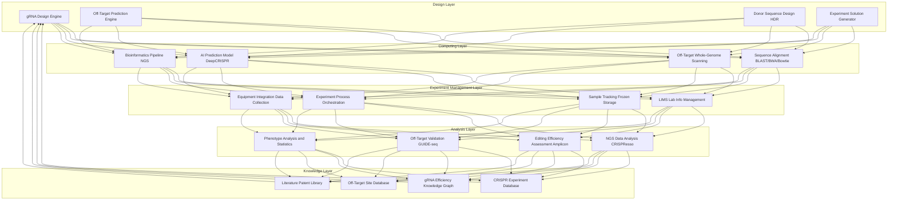

---title: CRISPR Gene Editing Architecture Design — Alibaba Cloud Perspective
description: 'CRISPR Gene Editing Architecture Design'
summary: 'CRISPR Gene Editing Architecture Design'
category: general
tags:
- architecture
- best-practice
- docker
- mysql
- job
- rbac
- networkpolicy
- gpu
tier: supporting
created: '2026-05-23'
last_updated: 2026-05
difficulty: intermediate
reading_level: intermediate
audience:
- All engineers
estimated_read_time: 15min
intent_queries:
- What is CRISPR gene editing architecture design — Alibaba Cloud perspective
- How to design CRISPR gene editing architecture — Alibaba Cloud perspective
- Kubernetes 20 application patterns best practices
trigger_keywords:
- Gene editing
- CRISPR
- Architecture design
- Alibaba Cloud perspective
- application
- patterns
prerequisites:
- kubectl-basics
- prometheus-basics
- mysql-basics
- gpu-scheduling-basics
original_language: Chinese
authors:
- name: Dillan Teagle
  role: contributor
source_path: /Users/teaglebuilt/github/teaglebuilt/knowledge/tree/application/architecture/crispr-gene-editing.md
---

> **Production Environment Security Notice**
>
> This document contains directly executable operation and maintenance commands. Before execution, please confirm: whether the current target cluster and Namespace are correct; whether you have sufficient RBAC permissions; whether you have verified in a non-production environment. Command risk levels are marked: Red (high risk), Yellow (medium risk), Green (low risk/read-only).

title: CRISPR Gene Editing Architecture Design
description: '# CRISPR Gene Editing Architecture Design — Alibaba Cloud Perspective'
category: application-architecture
tags:
- k8s
- architecture
- industry
- docker
- mysql
- job
- rbac
- [[NetworkPolicy|networkpolicy]]
- gpu
last_updated: 2026-05-18
difficulty: expert
reading_level: expert
audience:
- Biotech IT leaders
- Gene therapy researchers
- Computational biology engineers
- HPC architects
estimated_read_time: 5min
intent_queries:
- CRISPR gene editing Kubernetes architecture
- Gene editing K8s high-performance computing
- gRNA design AI platform
- Off-target detection HPC architecture
- Bioinformatics K8s
trigger_keywords:
- CRISPR
- Gene editing
- gRNA
- Off-target detection
- Gene therapy
- Bioinformatics
- CRISPR architecture
- Gene editing K8s
- NGS analysis
- Genome data
related_domains:
- domain-01-cluster-fundamentals
- domain-03-networking-traffic
related_topics:
- nanomaterials
- solid-state-battery
- smart-elderly-care
k8s_versions:
- '1.28'
- '1.29'
- '1.30'
- '1.31'
- '1.32'
---

# CRISPR Gene Editing Architecture Design — Alibaba Cloud Perspective

> **Applicable Versions**: Kubernetes v1.29 - v1.33 | **Last Updated**: 2026-04-24
> **Authors**: Alibaba Cloud Solution Architects | **Tags**: `#CRISPR` `#GeneEditing` `#gRNADesign` `#OffTargetDetection` `#AlibabCloud`

---

## Table of Contents

1. [Industry Overview](#1-industry-overview)
2. [Business Scenarios](#2-business-scenarios)
3. [Architecture Design](#3-architecture-design)
4. [Core Technology Stack](#4-core-technology-stack)
5. [K8s Deployment Solution](#5-k8s-deployment-solution)
6. [Data Architecture](#6-data-architecture)
7. [AI/ML Components](#7-aiml-components)
8. [Security and Compliance](#8-security-and-compliance)
9. [Best Practices](#9-best-practices)
10. [Anti-Patterns](#10-anti-patterns)
11. [Reference Resources](#11-reference-resources)

---

## 1. Industry Overview

## 1.1 Industry Background

CRISPR-Cas9 gene editing is the most revolutionary biotechnology breakthrough of the 21st century, with Jennifer Doudna and Emmanuelle Charpentier receiving the 2020 Nobel Prize in Chemistry. CRISPR uses guide RNA (gRNA) to direct Cas9 protein to target DNA sites, achieving double-strand breaks and precise editing. Applications span basic research (gene function dissection), drug development (target validation/cell therapy), agricultural breeding (disease-resistant/high-yield crops), and gene therapy (sickle cell disease/DMD now entering clinical trials).

CRISPR gene editing platforms require information systems across design, computing, experimentation, and analysis. gRNA design requires AI models to predict guide sequence efficiency and specificity; off-target analysis needs full-genome searching for possible off-target sites (searching billions of bases); experiment data management requires LIMS systems; results analysis requires bioinformatics pipelines processing NGS sequencing data to assess editing efficiency.

---

## 2. Business Scenarios

## 2.1 gRNA Design and Screening

gRNA design is the first and most critical CRISPR step. Workflow: input target gene region → search all NGG PAM sites → extract candidate gRNA sequences → On-target efficiency prediction (DeepCRISPR/Azimuth model scoring) → Off-target wild-genome searching → GC content/secondary structure/specificity assessment → multi-dimensional weighted ranking output top-N candidates.

## 2.2 Off-Target Analysis

Whole-genome off-target site detection and risk assessment ensures CRISPR safety. Computational prediction: align candidate gRNA sequences with reference genome (allowing 1-4 mismatches), record all potential off-target sites, comprehensively assess location, mismatch type, chromosome region to score off-target. Experimental validation: GUIDE-seq, CIRCLE-seq, DISCOVER-seq. Off-target analysis demands high-performance alignment, human genome 3-billion base alignment in CPU-intensive mode requires tens of minutes.

---

## 3. Architecture Design

## 3.1 CRISPR Platform Full-Landscape Architecture



---

## 4. Core Technology Stack

| Category | Open Source Tool | Alibaba Cloud Solution | Description |
|:---|:---|:---|:---|
| gRNA Design | CHOPCHOP, GuideScan, CRISPOR | Self-developed AI model deployment PAI-EAS | gRNA candidate search and scoring |
| Off-target Prediction | Cas-OFFinder, FlashFry, CRISPRitz | E-HPC High-performance Alignment | Full-genome off-target scanning |
| On-target Prediction | DeepCRISPR, Azimuth, CRISPRscan | PAI Model Training Inference | Editing efficiency prediction |
| Sequence Alignment | BWA, Bowtie2, BLAST+ | ACK Batch Processing Job | Full-genome alignment |
| NGS Analysis | CRISPResso2, Amplicon-seq | Argo Workflows Pipeline | Editing efficiency assessment |
| Library Analysis | MAGeCK, PinAPL-Py | MaxCompute Distributed Computing | sgRNA abundance analysis |
| Genome Browser | IGV, JBrowse | Web Version Deployment | Results visualization |
| Experiment Management | LabKey, self-developed LIMS | PolarDB + Web Frontend | Experiment data management |
| Data Format | FASTQ, BAM, VCF, BED | OSS Storage | Standard bioinformatics format |

---

## 5. K8s Deployment Solution

## 5.1 gRNA Design Service

```yaml
apiVersion: apps/v1
kind: Deployment
metadata:
  name: grna-design-service
  namespace: crispr
spec:
  replicas: 3
  selector:
    matchLabels:
      app: grna-design
  template:
    metadata:
      labels:
        app: grna-design
    spec:
      containers:
        - name: design
          image: registry.cn-hangzhou.aliyuncs.com/crispr/grna-design:v3.0.0
          ports:
            - containerPort: 8080
          env:
            - name: MODEL_PATH
              value: "/models/deepcrispr-v3"
            - name: GENOME_REF_PATH
              value: "/data/genomes"
            - name: OFFTARGET_ENGINE
              value: "cas-offinder"
          resources:
            requests:
              memory: "8Gi"
              cpu: "4000m"
            limits:
              memory: "16Gi"
              cpu: "8000m"
          volumeMounts:
            - name: models
              mountPath: /models
            - name: genomes
              mountPath: /data/genomes
              readOnly: true
      volumes:
        - name: models
          persistentVolumeClaim:
            claimName: crispr-models-pvc
        - name: genomes
          persistentVolumeClaim:
            claimName: genome-ref-pvc
```

## 5.2 Off-Target Analysis Batch Processing

```yaml
apiVersion: batch/v1
kind: Job
metadata:
  name: offtarget-analysis-{{ANALYSIS_ID}}
  namespace: crispr
  labels:
    pipeline: offtarget-analysis
spec:
  backoffLimit: 3
  ttlSecondsAfterFinished: 86400
  template:
    spec:
      containers:
        - name: analysis
          image: registry.cn-hangzhou.aliyuncs.com/crispr/off-target:v2.0.0
          command: ["python", "analyze_offtarget.py"]
          args:
            - "--grna-sequence"
            - "{{GRNA_SEQ}}"
            - "--genome-ref"
            - "hg38"
            - "--max-mismatches"
            - "4"
            - "--output"
            - "/output/offtarget_results.json"
          resources:
            requests:
              memory: "32Gi"
              cpu: "16000m"
            limits:
              memory: "64Gi"
              cpu: "32000m"
          volumeMounts:
            - name: genome-data
              mountPath: /data/genomes
              readOnly: true
            - name: output
              mountPath: /output
      volumes:
        - name: genome-data
          persistentVolumeClaim:
            claimName: genome-ref-pvc
        - name: output
          persistentVolumeClaim:
            claimName: crispr-output-pvc
      restartPolicy: Never
```

---

## 6. Data Architecture

## 6.1 Data Layering

| Data Type | Storage Solution | Format | Retention Policy | Data Volume |
|:---|:---|:---|:---|:---|
| Reference Genome | OSS Standard Storage | FASTA/FAI | Permanent | GB/species |
| gRNA Design Results | PolarDB MySQL | JSON/Relational | Permanent | MB/run |
| Off-Target Analysis Results | PolarDB + OSS | JSON/BED | Permanent | MB/run |
| NGS Sequencing Data | OSS Archive | FASTQ/BAM/VCF | Permanent | GB-TB/run |
| Experiment Records | PolarDB MySQL | Relational | 10 years | GB |
| Knowledge Base | Graph Database GDB | Triple | Permanent | TB |

---

## 7. AI/ML Components

| AI Scenario | Model/Algorithm | Input | Output | Description |
|:---|:---|:---|:---|:---|
| On-target Prediction | DeepCRISPR (CNN) | gRNA sequence + chromosome features | Editing efficiency score 0-1 | Deep learning model |
| Off-target Prediction | CRISPRnet (RNN) | gRNA + candidate off-target sequence | Off-target probability score | Sequence alignment+ML |
| gRNA Specificity | Azimuth 2.0 | 30nt sequence features | Normalized score | Random forest |
| Editing Efficiency Optimization | Transformer | Historical experiment data | Optimal gRNA recommendation | Transfer learning |

---

## 8. Security and Compliance

## 8.1 Security Framework

| Security Layer | Measures | Technical Implementation |
|:---|:---|:---|
| Gene Data Privacy | Genome data end-to-end encryption | AES-256 + KMS Key Management |
| Access Control | Role-based fine-grained permissions | RBAC + Project-level Isolation |
| Ethics Review | Mandatory approval for human gene editing | Workflow Approval + E-signature |
| Data Isolation | Different species/project data isolation | Namespace + NetworkPolicy |
| Audit Trail | All operations fully traceable | SLS Audit Logs + Immutable |
| Pathogenic Screening | Automatic gene synthesis screening | BLAST Compare Pathogenic Database |

---

## 9. Best Practices

- **gRNA Design Optimization**: Use DeepCRISPR deep learning models to predict gRNA activity, combine GC content, secondary structure and off-target scoring multi-dimensional assessment
- **Comprehensive Off-Target Analysis**: Combine computational prediction (Cas-OFFinder full-genome scanning) and experimental validation (GUIDE-seq/CIRCLE-seq), not rely on single method
- **Data Versioning**: Use DVC to manage reference genomes and experiment data, ensure analysis reproducibility
- **Bioinformatics Software Containerization**: Docker/Singularity encapsulate bioinformatics software (BWA, GATK, CRISPResso), avoid version dependency issues
- **Knowledge Base Accumulation**: Store each experiment's gRNA, editing conditions, editing efficiency structurally to knowledge base, provide reference for future designs

---

## 10. Anti-Patterns

## 10.1 Ignoring Off-Target Risk

Only rely on computational off-target prediction, not experimental verification, may miss actual off-target editing.

**Solution**: Dual approach: computational prediction and experimental verification. Use GUIDE-seq/CIRCLE-seq unbiased methods, feed experimental results back to optimize prediction models.

## 10.2 Gene Data Plaintext Storage

Genome data not encrypted stored on servers, creating data leakage risk.

**Solution**: Encrypt all genome data (AES-256 storage, KMS key management). Use TLS 1.3 for transmission. De-identify display (show only editing site nearby sequence).

## 10.3 Ignoring Ethics Approval

Skip ethics review to directly perform human gene editing experiments, violating regulations and ethics.

**Solution**: Establish mandatory electronic ethics approval process. Human gene editing experiments must submit ethics review request in system, require electronic signature from ethics committee approval before experiment execution.

---

## 11. Reference Resources

## 11.1 Alibaba Cloud Component Mapping

| Functional Domain | Alibaba Cloud Cloud-Native Solution | Description |
|:---|:---|:---|
| Container Platform | **ACK Pro** | Computing task scheduling |
| High-Performance Computing | **E-HPC** | Parallel computing for whole-genome alignment |
| AI Platform | **PAI-DSW + PAI-EAS** | Model training and inference service |
| Database | **PolarDB + Graph Database GDB** | Business data + knowledge graph |
| Object Storage | **OSS** | Genome data storage |
| Workflow | **ACK + Argo Workflows** | NGS analysis pipeline |
| Observability | **ARMS + SLS** | Full-chain monitoring |

---

**Maintainers**: Alibaba Cloud Solution Architects Team | **License**: MIT

---

<!-- risk-assessed -->
