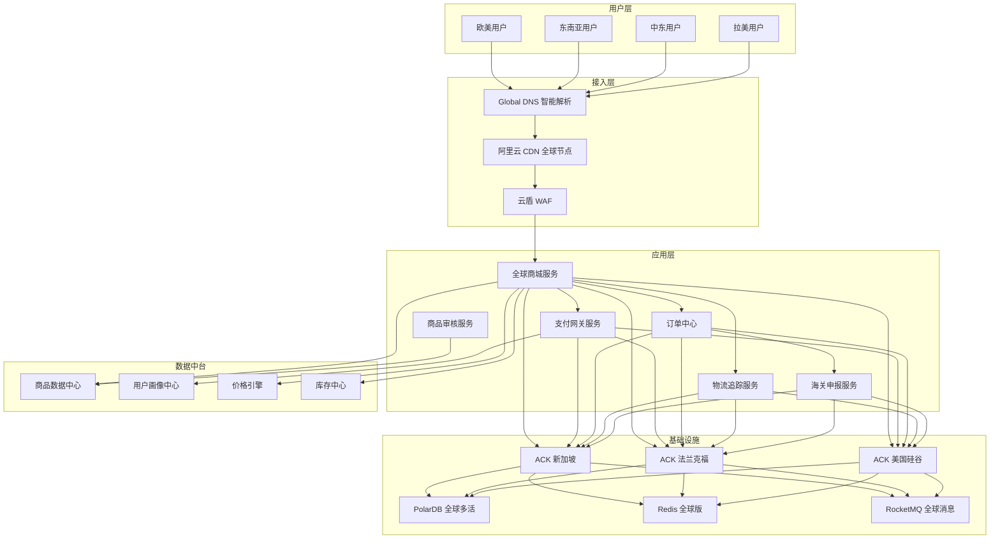
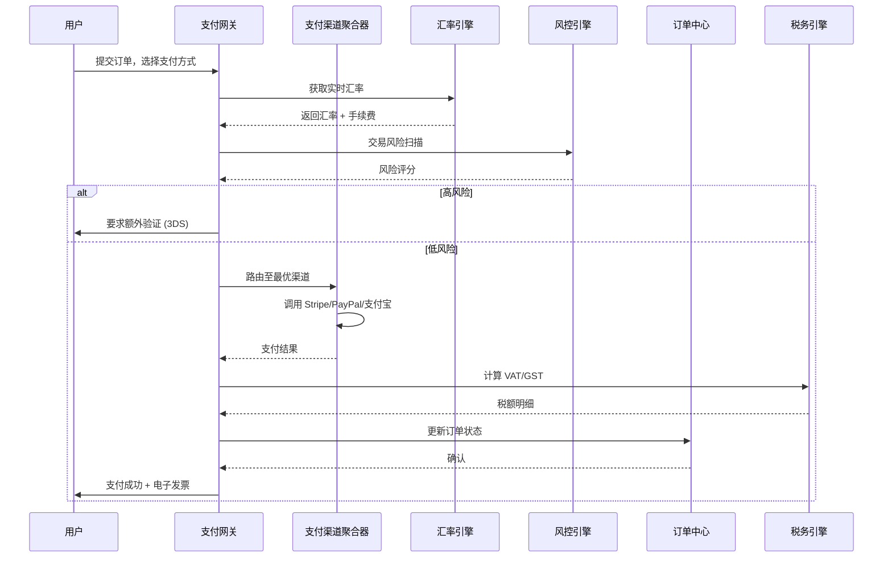
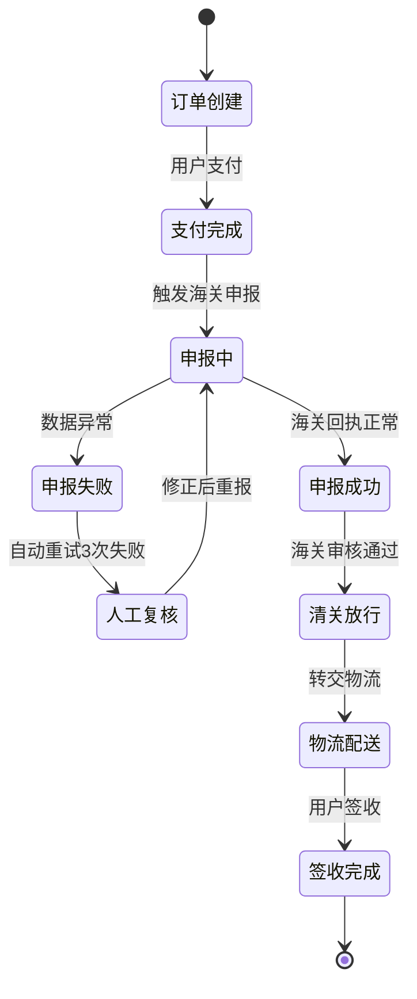
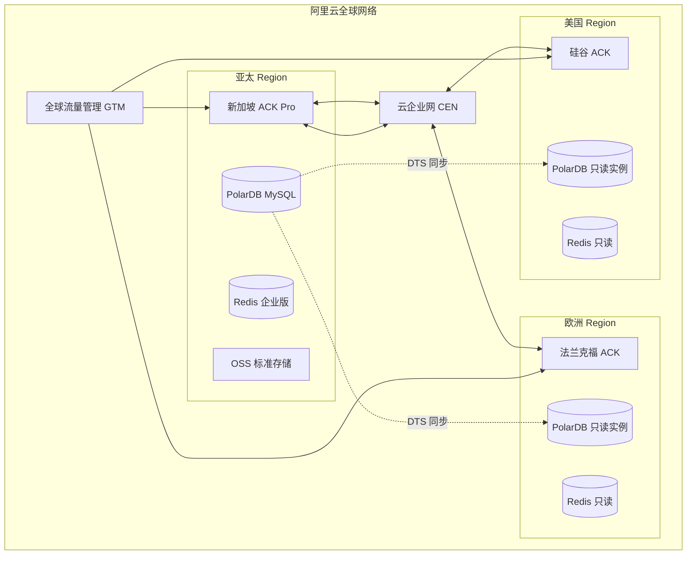
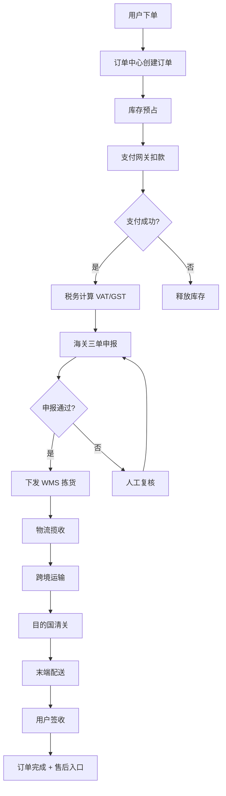
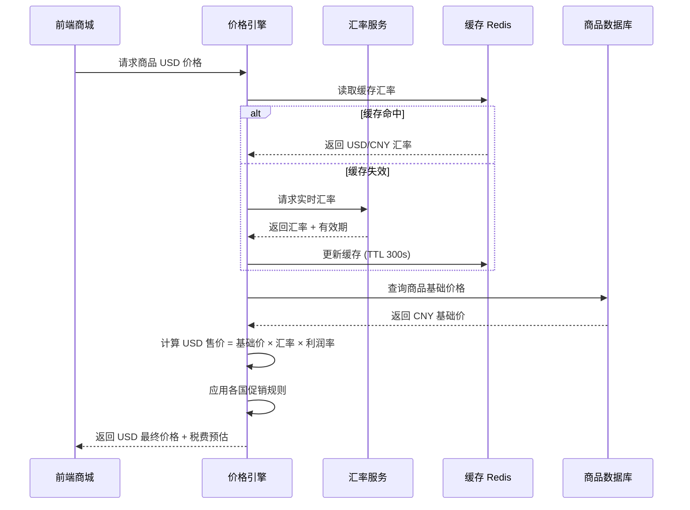
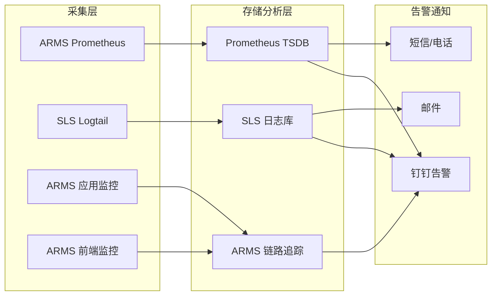

---title: 跨境电商架构设计 — 阿里云视角
description: 'title: 跨境电商架构设计'
summary: 'title: 跨境电商架构设计'
category: general
tags:
- architecture
- best-practice
- prometheus
- grafana
- falco
- minio
- redis
- mysql
- kafka
- hpa
tier: supporting
created: '2026-05-23'
last_updated: 2026-05
difficulty: intermediate
reading_level: intermediate
audience:
- 所有工程师
estimated_read_time: 15min
intent_queries:
- 跨境电商架构设计 — 阿里云视角 是什么
- 如何 跨境电商架构设计 — 阿里云视角
- Kubernetes 20 application patterns 最佳实践
trigger_keywords:
- 跨境电商架构设计
- 阿里云视角
- application
- patterns
prerequisites:
- kubectl-basics
- prometheus-basics
- monitoring-basics
- kafka-basics
- redis-basics
- mysql-basics
authors:
- name: Dillan Teagle
  role: contributor

---

> **生产环境安全提示**
>
> 本文档包含可直接执行的运维命令。执行前请确认：当前目标集群与 Namespace 是否正确；是否具备足够的 RBAC 权限；是否已在非生产环境验证。命令风险等级标注：🔴 高风险（可能造成数据丢失或服务中断）、🟡 中风险（会修改集群状态，但通常可回滚）、🟢 低风险/只读（信息收集，无副作用）。


title: 跨境电商架构设计
description: '# 跨境电商架构设计 — 阿里云视角'
category: application-architecture
tags:
- k8s
- architecture
- industry
- [[Prometheus|prometheus]]
- grafana
- [[Falco|falco]]
- minio
- redis
- mysql
- kafka
last_updated: 2026-05-18
difficulty: advanced
reading_level: advanced
audience:
- 跨境电商架构师
- 全球部署工程师
- 支付系统专家
estimated_read_time: 5min
intent_queries:
- 跨境电商全球多 Region 部署
- 多币种支付网关聚合架构
- 海关三单对碰申报系统
- 跨境物流 WMS 仓储管理
- 阿里云 PolarDB 全球多活
trigger_keywords:
- 跨境电商
- 全球部署
- 多币种支付
- 海关申报
- 三单对碰
- 跨境物流
- 海外仓
- VAT税务
- 多语言
- 合规
related_domains:
- domain-03-networking-traffic
- domain-10-troubleshooting-diagnostics
related_topics:
- topic-ecommerce-architecture
- topic-global-architecture
k8s_versions:
- '1.28'
- '1.29'
- '1.30'
- '1.31'
- '1.32'
---

# 跨境电商架构设计 — 阿里云视角

> **适用版本**: [[Kubernetes|Kubernetes]] v1.29 - v1.33 | **最后更新**: 2026-04-24
> **作者**: 阿里云解决方案架构师 | **标签**: `#跨境电商` `#全球部署` `#多币种` `#合规` `#阿里云`

---

<!-- chunk: 目录 -->## 目录

1. [行业背景](#1-行业背景)
2. [业务架构](#2-业务架构)
3. [技术架构](#3-技术架构)
4. [核心数据流](#4-核心数据流)
5. [安全与合规](#5-安全与合规)
6. [可观测性](#6-可观测性)
7. [阿里云组件映射](#7-阿里云组件映射)
8. [生产检查清单](#8-生产检查清单)

---

<!-- chunk: 1. 行业背景 -->## 1. 行业背景

## 1.1 业务特点

跨境电商面临多国家/地区运营、多币种结算、多语言支持、跨境物流、海关清关、税务合规等复杂挑战：

| 挑战 | 说明 | 架构影响 |
|:---|:---|:---|
| 全球部署 | 用户分布在欧美、东南亚、中东 | 多 Region / 多 AZ 部署 |
| 多币种支付 | 支持 30+ 币种实时汇率换算 | 支付网关聚合 + 风控 |
| 海关清关 | 三单对碰（订单/支付/物流） | 实时数据同步与合规申报 |
| 税务合规 | VAT/GST 各国税率差异 | 税率引擎 + 发票系统 |
| 跨境物流 | 海外仓 + 直邮 + 保税仓 | 物流追踪与库存同步 |
| 内容合规 | 各国商品审核标准不同 | AI 审核 + 人工复核 |

## 1.2 核心场景

- **全球商城**: 多语言/多币种商品展示与搜索
- **跨境支付**: 聚合 PayPal/Stripe/支付宝/微信支付
- **海关申报**: 三单对碰实时申报
- **海外仓储**: WMS 与库存实时同步
- **智能物流**: 跨境物流追踪与路径优化

---

<!-- chunk: 2. 业务架构 -->## 2. 业务架构

## 2.1 整体业务架构



## 2.2 跨境支付时序



## 2.3 海关三单对碰状态机



---

<!-- chunk: 3. 技术架构 -->## 3. 技术架构

## 3.1 全球多 Region 部署架构



## 3.2 K8s 部署拓扑

```yaml
# 全球商城前端 Deployment
apiVersion: apps/v1
kind: Deployment
metadata:
  name: global-mall-frontend
  namespace: crossborder
  labels:
    app: global-mall-frontend
    region: ap-southeast-1
spec:
  replicas: 6
  strategy:
    type: RollingUpdate
    rollingUpdate:
      maxSurge: 2
      maxUnavailable: 1
  selector:
    matchLabels:
      app: global-mall-frontend
  template:
    metadata:
      labels:
        app: global-mall-frontend
        version: v2.3.1
    spec:
      affinity:
        podAntiAffinity:
          preferredDuringSchedulingIgnoredDuringExecution:
            - weight: 100
              podAffinityTerm:
                labelSelector:
                  matchExpressions:
                    - key: app
                      operator: In
                      values: [global-mall-frontend]
                topologyKey: topology.kubernetes.io/zone
        nodeAffinity:
          requiredDuringSchedulingIgnoredDuringExecution:
            nodeSelectorTerms:
              - matchExpressions:
                  - key: alibabacloud.com/nodepool-type
                    operator: In
                    values: [standard]
      containers:
        - name: nextjs
          image: registry.cn-singapore.aliyuncs.com/crossborder/mall-frontend:v2.3.1
          ports:
            - containerPort: 3000
          env:
            - name: REGION
              value: "ap-southeast-1"
            - name: CDN_DOMAIN
              value: "https://cdn.crossborder-mall.com"
            - name: CURRENCY_API_URL
              value: "http://currency-service:8080"
          resources:
            requests:
              memory: "512Mi"
              cpu: "500m"
            limits:
              memory: "1Gi"
              cpu: "1000m"
          livenessProbe:
            httpGet:
              path: /api/health
              port: 3000
            initialDelaySeconds: 10
            periodSeconds: 15
          readinessProbe:
            httpGet:
              path: /api/ready
              port: 3000
            initialDelaySeconds: 5
            periodSeconds: 5
      topologySpreadConstraints:
        - maxSkew: 1
          topologyKey: topology.kubernetes.io/zone
          whenUnsatisfiable: DoNotSchedule
          labelSelector:
            matchLabels:
              app: global-mall-frontend
```

```yaml
# 支付网关 StatefulSet（会话一致性）
apiVersion: apps/v1
kind: StatefulSet
metadata:
  name: payment-gateway
  namespace: crossborder
spec:
  serviceName: payment-gateway
  replicas: 3
  selector:
    matchLabels:
      app: payment-gateway
  template:
    metadata:
      labels:
        app: payment-gateway
    spec:
      containers:
        - name: payment-api
          image: registry.cn-singapore.aliyuncs.com/crossborder/payment:v1.8.0
          ports:
            - containerPort: 8080
          env:
            - name: DB_HOST
              valueFrom:
                secretKeyRef:
                  name: payment-db-secret
                  key: host
            - name: STRIPE_KEY
              valueFrom:
                secretKeyRef:
                  name: payment-provider-keys
                  key: stripe
            - name: PAYPAL_KEY
              valueFrom:
                secretKeyRef:
                  name: payment-provider-keys
                  key: paypal
          volumeMounts:
            - name: payment-config
              mountPath: /app/config
            - name: audit-log
              mountPath: /app/logs
          resources:
            requests:
              memory: "1Gi"
              cpu: "1000m"
            limits:
              memory: "2Gi"
              cpu: "2000m"
      volumes:
        - name: payment-config
          configMap:
            name: payment-gateway-config
        - name: audit-log
          emptyDir: {}
  volumeClaimTemplates:
    - metadata:
        name: audit-log
      spec:
        accessModes: ["ReadWriteOnce"]
        storageClassName: alicloud-disk-ssd
        resources:
          requests:
            storage: 50Gi
```

```yaml
# HPA + KEDA 组合弹性伸缩
apiVersion: autoscaling/v2
kind: HorizontalPodAutoscaler
metadata:
  name: global-mall-frontend-hpa
  namespace: crossborder
spec:
  scaleTargetRef:
    apiVersion: apps/v1
    kind: Deployment
    name: global-mall-frontend
  minReplicas: 6
  maxReplicas: 100
  metrics:
    - type: Resource
      resource:
        name: cpu
        target:
          type: Utilization
          averageUtilization: 70
    - type: Resource
      resource:
        name: memory
        target:
          type: Utilization
          averageUtilization: 80
  behavior:
    scaleUp:
      stabilizationWindowSeconds: 60
      policies:
        - type: Percent
          value: 100
          periodSeconds: 60
    scaleDown:
      stabilizationWindowSeconds: 300
      policies:
        - type: Percent
          value: 10
          periodSeconds: 60
---
# KEDA 基于消息队列长度的弹性伸缩
apiVersion: keda.sh/v1alpha1
kind: ScaledObject
metadata:
  name: customs-declaration-scaler
  namespace: crossborder
spec:
  scaleTargetRef:
    name: customs-declaration-worker
  pollingInterval: 10
  cooldownPeriod: 300
  minReplicaCount: 3
  maxReplicaCount: 50
  triggers:
    - type: alibaba-cloud-rocketmq
      metadata:
        topic: customs-declaration-queue
        groupID: customs-consumer-group
        serviceEndpoint: http://rocketmq-crossborder.cn-singapore.aliyuncs.com
      authenticationRef:
        name: keda-rocketmq-trigger-auth
```

---

<!-- chunk: 4. 核心数据流 -->## 4. 核心数据流

## 4.1 跨境订单履约数据流



## 4.2 多币种价格计算流程



---

<!-- chunk: 5. 安全与合规 -->## 5. 安全与合规

## 5.1 合规要求

| 合规项 | 适用范围 | 架构措施 |
|:---|:---|:---|
| PCI-DSS | 全球支付 | 支付数据加密 + 网络隔离 + 审计日志 |
| GDPR | 欧盟用户 | 数据最小化 + 被遗忘权 + 跨境传输协议 |
| 等保三级 | 中国境内 | 云盾 + WAF + 堡垒机 + 日志审计 |
| 海关数据安全 | 跨境申报 | 数据脱敏 + 传输加密 + 访问控制 |

## 5.2 K8s 安全策略

```yaml
# NetworkPolicy: 支付服务网络隔离
apiVersion: networking.k8s.io/v1
kind: NetworkPolicy
metadata:
  name: payment-network-isolation
  namespace: crossborder
spec:
  podSelector:
    matchLabels:
      app: payment-gateway
  policyTypes:
    - Ingress
    - Egress
  ingress:
    - from:
        - podSelector:
            matchLabels:
              app: global-mall-frontend
        - podSelector:
            matchLabels:
              app: order-service
      ports:
        - protocol: TCP
          port: 8080
  egress:
    - to:
        - podSelector:
            matchLabels:
              app: payment-database
      ports:
        - protocol: TCP
          port: 3306
    - to:
        - podSelector:
            matchLabels:
              app: redis-cache
      ports:
        - protocol: TCP
          port: 6379
    - to: []
      ports:
        - protocol: TCP
          port: 443  # 只允许 HTTPS 出网调用支付渠道
```

```yaml
# Pod Security Standards (Restricted)
apiVersion: v1
kind: Namespace
metadata:
  name: crossborder
  labels:
    pod-security.kubernetes.io/enforce: restricted
    pod-security.kubernetes.io/audit: restricted
    pod-security.kubernetes.io/warn: restricted
```

---

<!-- chunk: 6. 可观测性 -->## 6. 可观测性

## 6.1 监控体系



## 6.2 关键告警规则

```yaml
# PrometheusRule 示例
apiVersion: monitoring.coreos.com/v1
kind: PrometheusRule
metadata:
  name: crossborder-alerts
  namespace: crossborder
spec:
  groups:
    - name: payment
      rules:
        - alert: PaymentSuccessRateLow
          expr: |
            (
              sum(rate(payment_requests_total{status="success"}[5m]))
              /
              sum(rate(payment_requests_total[5m]))
            ) < 0.98
          for: 2m
          labels:
            severity: critical
            team: payment
          annotations:
            summary: "支付成功率低于 98%"
            description: "当前成功率: {{ $value | humanizePercentage }}"

        - alert: CustomsDeclarationDelay
          expr: |
            customs_declaration_queue_length > 1000
          for: 5m
          labels:
            severity: warning
            team: customs
          annotations:
            summary: "海关申报队列堆积"
            description: "当前队列长度: {{ $value }}"
```

---

<!-- chunk: 7. 阿里云组件映射 -->## 7. 阿里云组件映射

| 功能域 | 自建/开源方案 | **阿里云云原生方案** | 选型理由 |
|:---|:---|:---|:---|
| 容器平台 | 自建 K8s | **ACK Pro** | 托管控制平面、多 AZ 高可用 |
| 流量入口 | Nginx Ingress | **ALB + Ingress-Nginx** | 全球 Anycast、自动证书 |
| 全球加速 | Cloudflare | **阿里云 CDN + DCDN** | 国内节点覆盖 + 海外 2800+ 节点 |
| 数据库 | MySQL 主从 | **PolarDB MySQL 全球多活** | 跨 Region 同步、读写分离 |
| 缓存 | Redis Cluster | **Redis 企业版 (全球多活)** | 多活同步、数据不丢失 |
| 消息队列 | Kafka | **RocketMQ 全球消息** | 金融级可靠、全球消息路由 |
| 对象存储 | MinIO | **OSS 标准/低频/归档** | 全球加速、图片处理 |
| 大数据 | Spark/Flink 自建 | **MaxCompute + Flink** | 跨境数据合规分析 |
| 可观测性 | Prometheus + Grafana | **ARMS + SLS** | 全链路追踪、前端监控 |
| 安全 | Vault + Falco | **云盾 + WAF + KMS** | 等保合规、DDoS 防护 |
| 全球流量 | Route53 | **Global DNS + GTM** | 智能解析、问题自动切换 |
| 网络互联 | IPSec VPN | **云企业网 CEN** | 全球私网互联、低延迟 |

---

<!-- chunk: 8. 生产检查清单 -->## 8. 生产检查清单

## 8.1 部署前检查

- [ ] 多 Region ACK 集群版本一致性校验
- [ ] PolarDB 全球多活同步延迟 < 1s
- [ ] CDN 预热：商品图片、静态资源、JS/CSS
- [ ] WAF 规则：跨境电商常见攻击特征配置
- [ ] 支付渠道沙箱环境端到端测试通过
- [ ] 海关申报接口联调通过（测试环境）
- [ ] GDPR 数据分类标记完成
- [ ] 灾备演练：单 Region 问题自动切换验证

## 8.2 日常运维

- [ ] 每日：支付成功率、订单履约时效、海关申报成功率
- [ ] 每周：跨 Region 数据同步延迟巡检
- [ ] 每月：安全漏洞扫描、合规审计日志审查
- [ ] 每季：灾备演练、容量规划复盘

---

**维护者**: 阿里云解决方案架构师团队 | **许可证**: MIT

---

<!-- chunk: Obsidian 相关文档 -->## Obsidian 相关文档

- topic-application-architecture MOC
- [[domain-20-application-patterns/topic-application-architecture/README.md|Topic 应用层架构设计最佳实践]]
- [[domain-20-application-patterns/topic-application-architecture/01-ecommerce-architecture.md|电商系统 Kubernetes 生产架构设计]]
- [[domain-20-application-patterns/topic-application-architecture/02-mini-program-architecture.md|小程序平台架构设计]]
- [[domain-20-application-patterns/topic-application-architecture/03-cms-architecture.md|内容管理系统 CMS 架构设计]]
- [[domain-20-application-patterns/topic-application-architecture/04-im-rtc-architecture.md|实时通信 IM/RTC 架构设计]]
- [[domain-20-application-patterns/topic-application-architecture/05-online-education-architecture.md|在线教育平台 Kubernetes 生产架构设计]]
- [[domain-20-application-patterns/topic-application-architecture/06-fintech-architecture.md|金融科技FinTech Kubernetes生产架构设计]]
- [[domain-20-application-patterns/topic-application-architecture/07-iot-platform-architecture.md|物联网 IoT 平台架构设计]]
- [[domain-20-application-patterns/topic-application-architecture/08-ai-ml-inference-architecture.md|AI/ML 推理服务 Kubernetes 生产架构设计]]
- [[domain-20-application-patterns/topic-application-architecture/09-gaming-backend-architecture.md|游戏后端 Kubernetes 生产架构设计]]
- [[domain-20-application-patterns/topic-application-architecture/10-social-media-architecture.md|社交媒体平台Kubernetes生产架构设计]]

## See Also

- 19-cloudnative-devops-architecture
- 20-microservice-governance-architecture
- 22-nev-connected-vehicle
- 23-xinchuang-it-innovation


<!-- risk-assessed -->
