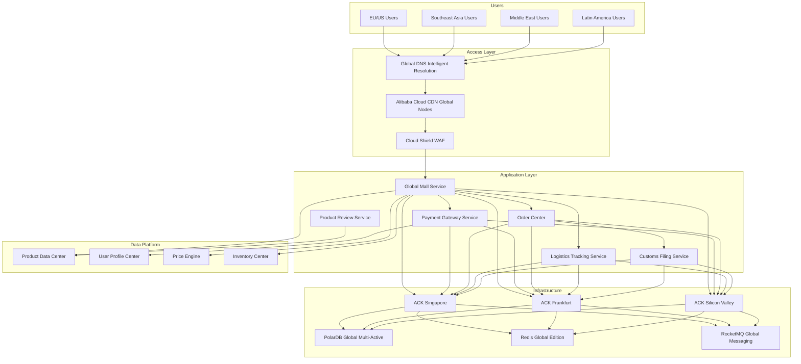
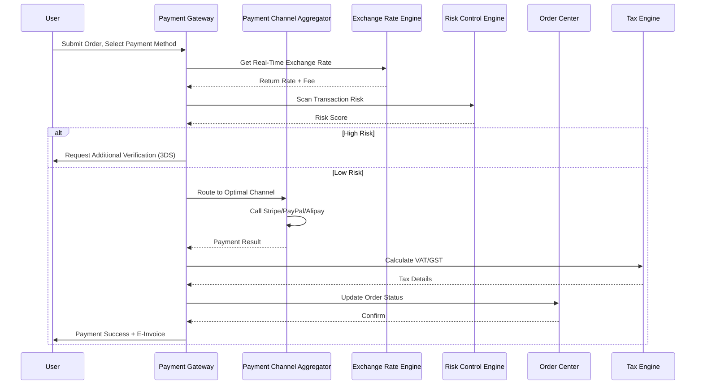
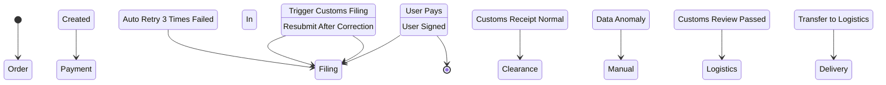
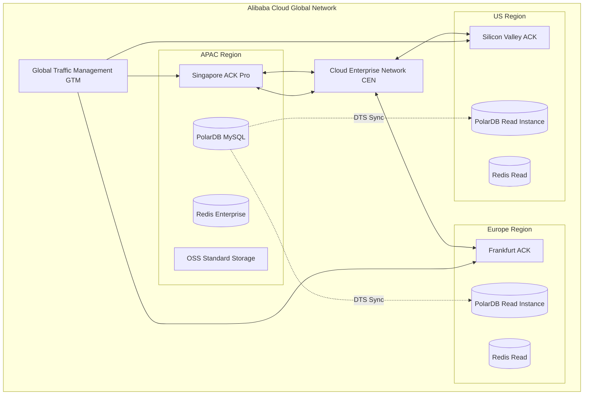
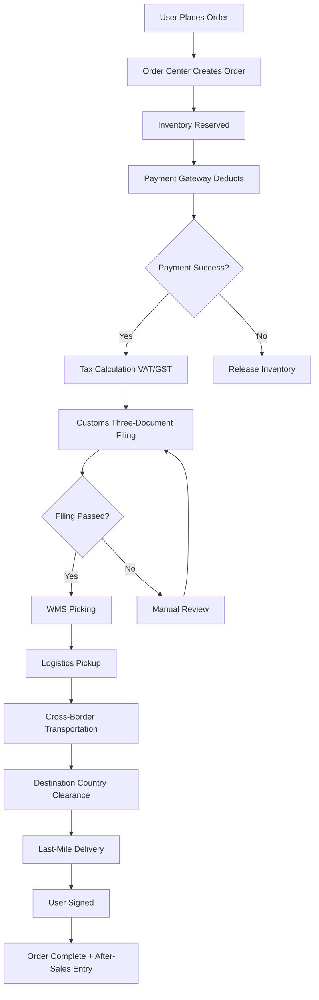
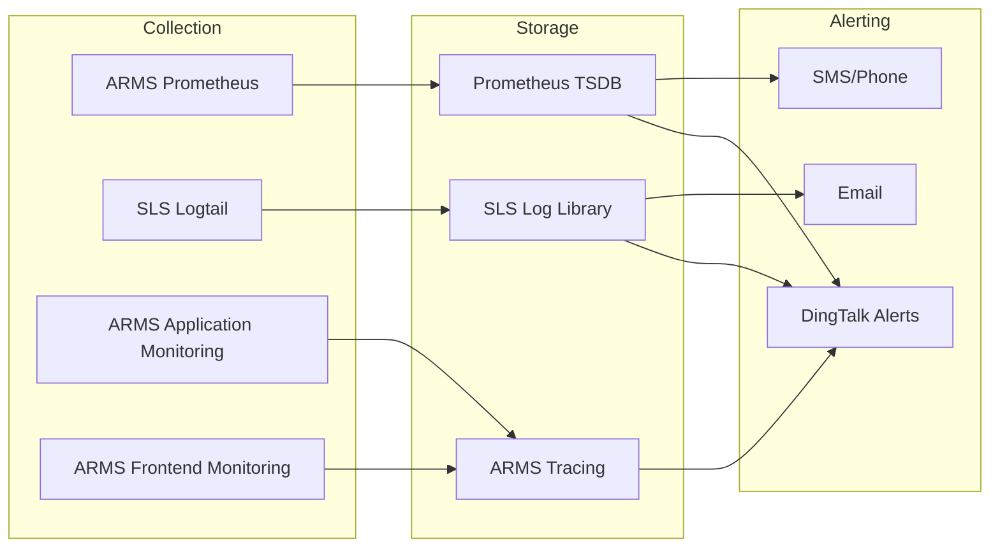

> **Production Environment Security Notice**
>
> This document contains directly executable operation and maintenance commands. Before execution, please confirm: whether the current target cluster and Namespace are correct; whether you have sufficient RBAC permissions; whether you have verified in a non-production environment. Command risk levels are marked: Red (high risk), Yellow (medium risk), Green (low risk/read-only).

# Cross-Border E-Commerce Architecture Design — Alibaba Cloud Perspective

> **Applicable Versions**: Kubernetes v1.29 - v1.33 | **Last Updated**: 2026-04-24
> **Authors**: Alibaba Cloud Solution Architects | **Tags**: `#CrossBorderEcommerce` `#GlobalDeployment` `#MultiCurrency` `#Compliance` `#AlibabCloud`

---

## Table of Contents

1. [Industry Background](#1-industry-background)
2. [Business Architecture](#2-business-architecture)
3. [Technical Architecture](#3-technical-architecture)
4. [Core Data Flows](#4-core-data-flows)
5. [Security and Compliance](#5-security-and-compliance)
6. [Observability](#6-observability)
7. [Alibaba Cloud Component Mapping](#7-alibaba-cloud-component-mapping)
8. [Production Checklist](#8-production-checklist)

---

## 1. Industry Background

## 1.1 Business Characteristics

Cross-border e-commerce faces multi-country/region operations, multi-currency settlement, multi-language support, cross-border logistics, customs clearance, tax compliance and other complex challenges:

| Challenge | Description | Architecture Impact |
|:---|:---|:---|
| Global Deployment | Users distributed in Europe, Americas, Southeast Asia, Middle East | Multi-Region / Multi-AZ deployment |
| Multi-Currency Payment | Support 30+ currencies with real-time exchange rate conversion | Payment gateway aggregation + risk control |
| Customs Clearance | Three-document matching (order/payment/logistics) | Real-time data sync and compliance filing |
| Tax Compliance | VAT/GST varies by country | Tax rate engine + invoice system |
| Cross-Border Logistics | Overseas warehouse + direct shipping + bonded warehouse | Logistics tracking and inventory sync |
| Content Compliance | Different product review standards across countries | AI review + manual review |

## 1.2 Core Scenarios

- **Global Mall**: Multi-language/multi-currency product display and search
- **Cross-Border Payment**: Aggregate PayPal/Stripe/Alipay/WeChat Pay
- **Customs Filing**: Three-document matching real-time filing
- **Overseas Warehouse**: WMS and inventory real-time sync
- **Smart Logistics**: Cross-border logistics tracking and route optimization

---

## 2. Business Architecture

## 2.1 Overall Business Architecture



## 2.2 Cross-Border Payment Timeline



## 2.3 Customs Three-Document Matching State Machine



---

## 3. Technical Architecture

## 3.1 Global Multi-Region Deployment Architecture



## 3.2 Kubernetes Deployment Topology

```yaml
# Global Mall Frontend Deployment
apiVersion: apps/v1
kind: Deployment
metadata:
  name: global-mall-frontend
  namespace: crossborder
  labels:
    app: global-mall-frontend
    region: ap-southeast-1
spec:
  replicas: 6
  strategy:
    type: RollingUpdate
    rollingUpdate:
      maxSurge: 2
      maxUnavailable: 1
  selector:
    matchLabels:
      app: global-mall-frontend
  template:
    metadata:
      labels:
        app: global-mall-frontend
        version: v2.3.1
    spec:
      affinity:
        podAntiAffinity:
          preferredDuringSchedulingIgnoredDuringExecution:
            - weight: 100
              podAffinityTerm:
                labelSelector:
                  matchExpressions:
                    - key: app
                      operator: In
                      values: [global-mall-frontend]
                topologyKey: topology.kubernetes.io/zone
        nodeAffinity:
          requiredDuringSchedulingIgnoredDuringExecution:
            nodeSelectorTerms:
              - matchExpressions:
                  - key: alibabacloud.com/nodepool-type
                    operator: In
                    values: [standard]
      containers:
        - name: nextjs
          image: registry.cn-singapore.aliyuncs.com/crossborder/mall-frontend:v2.3.1
          ports:
            - containerPort: 3000
          env:
            - name: REGION
              value: "ap-southeast-1"
            - name: CDN_DOMAIN
              value: "https://cdn.crossborder-mall.com"
            - name: CURRENCY_API_URL
              value: "http://currency-service:8080"
          resources:
            requests:
              memory: "512Mi"
              cpu: "500m"
            limits:
              memory: "1Gi"
              cpu: "1000m"
          livenessProbe:
            httpGet:
              path: /api/health
              port: 3000
            initialDelaySeconds: 10
            periodSeconds: 15
          readinessProbe:
            httpGet:
              path: /api/ready
              port: 3000
            initialDelaySeconds: 5
            periodSeconds: 5
      topologySpreadConstraints:
        - maxSkew: 1
          topologyKey: topology.kubernetes.io/zone
          whenUnsatisfiable: DoNotSchedule
          labelSelector:
            matchLabels:
              app: global-mall-frontend
```

---

## 4. Core Data Flows

## 4.1 Cross-Border Order Fulfillment Data Flow



---

## 5. Security and Compliance

## 5.1 Compliance Requirements

| Compliance Item | Applicable Scope | Architecture Measures |
|:---|:---|:---|
| PCI-DSS | Global Payment | Payment data encryption + network isolation + audit logs |
| GDPR | EU Users | Data minimization + right to be forgotten + cross-border transfer agreement |
| Level 3 Protection | Domestic | Cloud Shield + WAF + Bastion + Log Audit |
| Customs Data Security | Cross-Border Filing | Data desensitization + transmission encryption + access control |

## 5.2 Kubernetes Security Policy

```yaml
# NetworkPolicy: Payment Service Network Isolation
apiVersion: networking.k8s.io/v1
kind: NetworkPolicy
metadata:
  name: payment-network-isolation
  namespace: crossborder
spec:
  podSelector:
    matchLabels:
      app: payment-gateway
  policyTypes:
    - Ingress
    - Egress
  ingress:
    - from:
        - podSelector:
            matchLabels:
              app: global-mall-frontend
        - podSelector:
            matchLabels:
              app: order-service
      ports:
        - protocol: TCP
          port: 8080
  egress:
    - to:
        - podSelector:
            matchLabels:
              app: payment-database
      ports:
        - protocol: TCP
          port: 3306
    - to:
        - podSelector:
            matchLabels:
              app: redis-cache
      ports:
        - protocol: TCP
          port: 6379
    - to: []
      ports:
        - protocol: TCP
          port: 443  # Only HTTPS outbound calls to payment channels
```

---

## 6. Observability

## 6.1 Monitoring System



## 6.2 Key Alert Rules

```yaml
# PrometheusRule Example
apiVersion: monitoring.coreos.com/v1
kind: PrometheusRule
metadata:
  name: crossborder-alerts
  namespace: crossborder
spec:
  groups:
    - name: payment
      rules:
        - alert: PaymentSuccessRateLow
          expr: |
            (
              sum(rate(payment_requests_total{status="success"}[5m]))
              /
              sum(rate(payment_requests_total[5m]))
            ) < 0.98
          for: 2m
          labels:
            severity: critical
            team: payment
          annotations:
            summary: "Payment success rate below 98%"
            description: "Current success rate: {{ $value | humanizePercentage }}"

        - alert: CustomsDeclarationDelay
          expr: |
            customs_declaration_queue_length > 1000
          for: 5m
          labels:
            severity: warning
            team: customs
          annotations:
            summary: "Customs filing queue backlog"
            description: "Current queue length: {{ $value }}"
```

---

## 7. Alibaba Cloud Component Mapping

| Functional Domain | Self-Build/Open Source | **Alibaba Cloud Cloud-Native Solution** | Selection Rationale |
|:---|:---|:---|:---|
| Container Platform | Self-Built K8s | **ACK Pro** | Managed control plane, multi-AZ HA |
| Traffic Entry | Nginx Ingress | **ALB + Ingress-Nginx** | Global Anycast, auto certificate |
| Global Acceleration | Cloudflare | **Alibaba Cloud CDN + DCDN** | Domestic coverage + 2800+ overseas nodes |
| Database | MySQL Master-Slave | **PolarDB MySQL Global Multi-Active** | Cross-Region sync, read-write separation |
| Cache | Redis Cluster | **Redis Enterprise (Global Multi-Active)** | Multi-active sync, no data loss |
| Message Queue | Kafka | **RocketMQ Global Messaging** | Finance-grade reliability, global routing |
| Object Storage | MinIO | **OSS Standard/Infrequent/Archive** | Global acceleration, image processing |
| Big Data | Spark/Flink Self-Build | **MaxCompute + Flink** | Cross-border data compliant analysis |
| Observability | Prometheus + Grafana | **ARMS + SLS** | Full-chain tracing, frontend monitoring |
| Security | Vault + Falco | **Cloud Shield + WAF + KMS** | Level 3 Compliance, DDoS Protection |
| Global Traffic | Route53 | **Global DNS + GTM** | Intelligent resolution, auto failover |
| Network Interconnect | IPSec VPN | **Cloud Enterprise Network CEN** | Global private network, low latency |

---

## 8. Production Checklist

## 8.1 Pre-Deployment

- [ ] Multi-Region ACK cluster version consistency validation
- [ ] PolarDB global multi-active sync latency < 1s
- [ ] CDN warming: product images, static resources, JS/CSS
- [ ] WAF rules: cross-border e-commerce common attack patterns
- [ ] Payment channel sandbox end-to-end test pass
- [ ] Customs filing interface coordination pass (test environment)
- [ ] GDPR data classification marking complete
- [ ] Disaster recovery drill: single Region failure auto-switchover verification

## 8.2 Daily Operations

- [ ] Daily: payment success rate, order fulfillment timeliness, customs filing success rate
- [ ] Weekly: cross-Region data sync latency inspection
- [ ] Monthly: security vulnerability scanning, compliance audit log review
- [ ] Quarterly: disaster recovery drill, capacity planning review

---

**Maintainers**: Alibaba Cloud Solution Architects Team | **License**: MIT

---

## Obsidian Related Documents

- topic-application-architecture MOC
- [[domain-20-application-patterns/topic-application-architecture/README.md|Topic Application Layer Architecture Design Best Practices]]

## See Also

- 19-cloudnative-devops-architecture
- 20-microservice-governance-architecture
- 22-nev-connected-vehicle
- 23-xinchuang-it-innovation

<!-- risk-assessed -->
