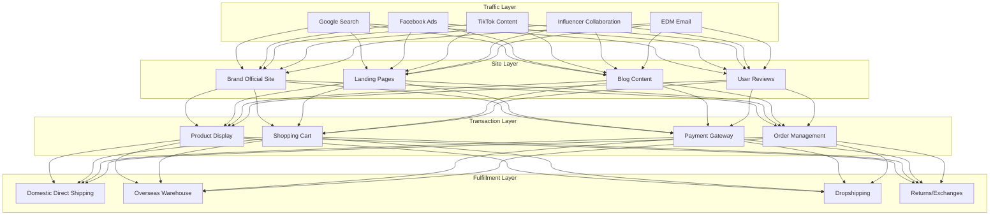
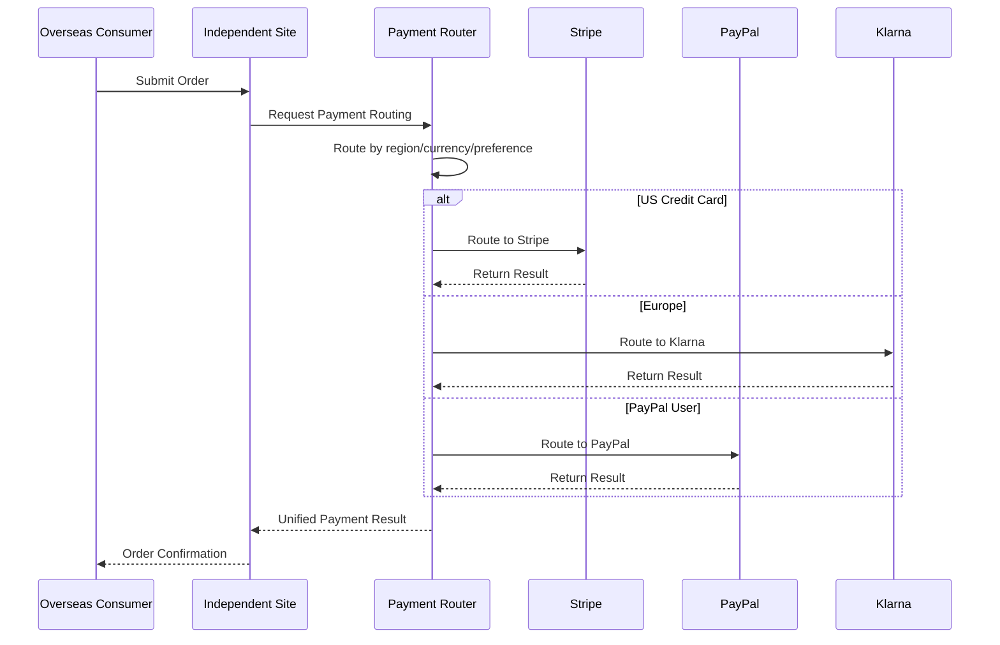

---title: Cross-Border E-commerce Independent Site Architecture Design — Alibaba Cloud Perspective
description: 'Cross-Border E-commerce Independent Site Architecture Design'
summary: 'Cross-Border E-commerce Independent Site Architecture Design'
category: general
tags:
- architecture
- best-practice
- redis
- operator
tier: supporting
created: '2026-05-23'
last_updated: 2026-05
difficulty: intermediate
reading_level: intermediate
audience:
- All engineers
estimated_read_time: 5min
intent_queries:
- What is cross-border e-commerce independent site architecture design — Alibaba Cloud perspective
- How to design cross-border e-commerce independent site architecture — Alibaba Cloud perspective
- Kubernetes 20 application patterns best practices
trigger_keywords:
- Cross-border e-commerce independent site architecture design
- Alibaba Cloud perspective
- application
- patterns
prerequisites:
- kubectl-basics
- prometheus-basics
- redis-basics
original_language: Chinese
authors:
- name: Dillan Teagle
  role: contributor
source_path: /Users/teaglebuilt/github/teaglebuilt/knowledge/tree/application/architecture/crossborder-dtc.md
---

> **Production Environment Security Notice**
>
> This document contains directly executable operation and maintenance commands. Before execution, please confirm: whether the current target cluster and Namespace are correct; whether you have sufficient RBAC permissions; whether you have verified in a non-production environment. Command risk levels are marked: Red (high risk), Yellow (medium risk), Green (low risk/read-only).

title: Cross-Border E-commerce Independent Site Architecture Design
description: '# Cross-Border E-commerce Independent Site Architecture Design — Alibaba Cloud Perspective'
category: application-architecture
tags:
- k8s
- architecture
- industry
- redis
- operator
last_updated: 2026-05-18
difficulty: intermediate
reading_level: intermediate
audience:
- E-commerce architects
- Go-global technology leaders
- SRE
estimated_read_time: 5min
intent_queries:
- Cross-border e-commerce independent site Kubernetes global deployment
- DTC brand go-global Shopify Alibaba Cloud architecture
- Cross-border payment routing multi-currency K8s
- GDPR compliance cross-border e-commerce data localization
- Global CDN acceleration cross-border e-commerce architecture
trigger_keywords:
- Cross-border e-commerce
- DTC
- Independent site
- Shopify
- Global CDN
- Multi-currency
- Payment gateway
- GDPR
- Alibaba Cloud
related_domains:
- domain-01-cluster-fundamentals
- domain-11-production-operations
related_topics:
- 33-crossborder-warehouse
- 01-ecommerce-architecture
- 53-new-retail-dtc
k8s_versions:
- '1.28'
- '1.29'
- '1.30'
- '1.31'
- '1.32'
---

# Cross-Border E-commerce Independent Site Architecture Design — Alibaba Cloud Perspective

> **Applicable Versions**: Kubernetes v1.29 - v1.33 | **Last Updated**: 2026-04-24
> **Authors**: Alibaba Cloud Solution Architects | **Tags**: `#CrossBorderEcommerce` `#DTC` `#IndependentSite` `#Shopify` `#AlibabCloud`

---

## Table of Contents

1. [Industry Background](#1-industry-background)
2. [Business Architecture](#2-business-architecture)
3. [Technical Architecture](#3-technical-architecture)
4. [Core Data Flow](#4-core-data-flow)
5. [Security and Compliance](#5-security-and-compliance)
6. [Observability](#6-observability)
7. [Alibaba Cloud Component Mapping](#7-alibaba-cloud-component-mapping)
8. [Production Checklist](#8-production-checklist)

---

## 1. Industry Background

### 1.1 Business Characteristics

Cross-border e-commerce independent sites are brand's self-owned go-global channels, freeing from platform dependence:

| Challenge | Description | Architecture Impact |
|:---|:---|:---|
| Global Access | EU/US/Southeast Asia/Middle East users | CDN + multi-region |
| Payment Diversity | Payment methods vary by country | Payment gateway aggregation |
| Compliance Complexity | GDPR/CPA/data localization | Compliance architecture |
| SEO Optimization | Search engine organic traffic | SSR/SSG |
| Logistics Tracking | Cross-border logistics visualization | Logistics API integration |

### 1.2 Core Scenarios

- **Brand Official Site**: Independent site construction and operation
- **Global Payment**: Stripe/PayPal/local payment methods
- **Multi-language Multi-currency**: Auto-detection and conversion
- **Social Media Traffic**: Facebook/TikTok/Google advertising
- **Overseas Warehouse Fulfillment**: Local delivery for faster delivery

---

## 2. Business Architecture

### 2.1 Cross-Border DTC Independent Site Full-Landscape Architecture



### 2.2 Payment Routing Timeline



---

## 3. Technical Architecture

### 3.1 K8s Deployment

```yaml
# Independent Site Frontend Deployment
apiVersion: apps/v1
kind: Deployment
metadata:
  name: dtc-website
  namespace: crossborder-dtc
spec:
  replicas: 6
  selector:
    matchLabels:
      app: dtc-website
  template:
    metadata:
      labels:
        app: dtc-website
    spec:
      containers:
        - name: nextjs
          image: registry.cn-hangzhou.aliyuncs.com/dtc/website:v2.0.0
          ports:
            - containerPort: 3000
          env:
            - name: SSR_LOCALE
              value: "auto-detect"
            - name: CDN_DOMAIN
              value: "https://cdn.brand-global.com"
          resources:
            requests:
              memory: "1Gi"
              cpu: "500m"
            limits:
              memory: "2Gi"
              cpu: "1000m"
```

---

## 4. Core Data Flow

### 4.1 Social Ad Attribution


---

## 5. Security and Compliance

- **GDPR**: EU user data protection
- **PCI-DSS**: Payment data compliance
- **Data Localization**: Some regions require local data storage

---

## 6. Observability

- **Page Load**: P99 < 2s (Worldwide)
- **Payment Success Rate**: > 95%
- **Conversion Rate**: > 2%

---

## 7. Alibaba Cloud Component Mapping

| Functional Domain | **Alibaba Cloud Cloud-Native Solution** |
|:---|:---|
| Container Platform | **ACK Pro** |
| CDN | **Alibaba Cloud Global CDN Acceleration** |
| Database | **PolarDB** |
| Cache | **Redis Enterprise Edition** |
| Object Storage | **OSS** |
| Search | **OpenSearch** |
| Observability | **ARMS + SLS** |

---

## 8. Production Checklist

- [ ] Global CDN node warming
- [ ] Multi-currency exchange rate real-time updates
- [ ] Payment gateway multi-region redundancy
- [ ] GDPR Cookie compliance
- [ ] Logistics tracking API connectivity

---

**Maintainers**: Alibaba Cloud Solution Architects Team | **License**: MIT

---

## Obsidian Related Documents

- topic-application-architecture KUDIG Database — Global MOC
- [[domain-20-application-patterns/topic-application-architecture/README.md|Topic Application Layer Architecture Design Best Practices]]

## See Also

- 53-new-retail-dtc
- 54-social-gaming-metaverse
- 56-smart-elderly-care
- 57-digital-therapeutics


<!-- risk-assessed -->
