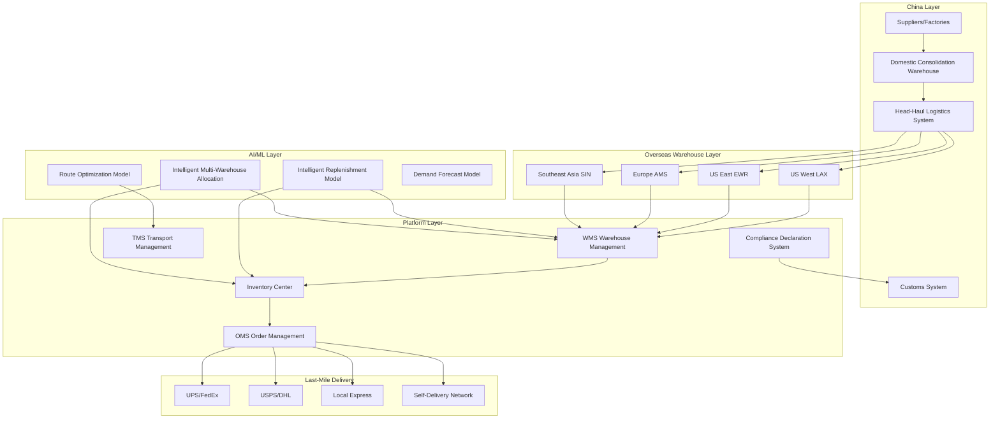
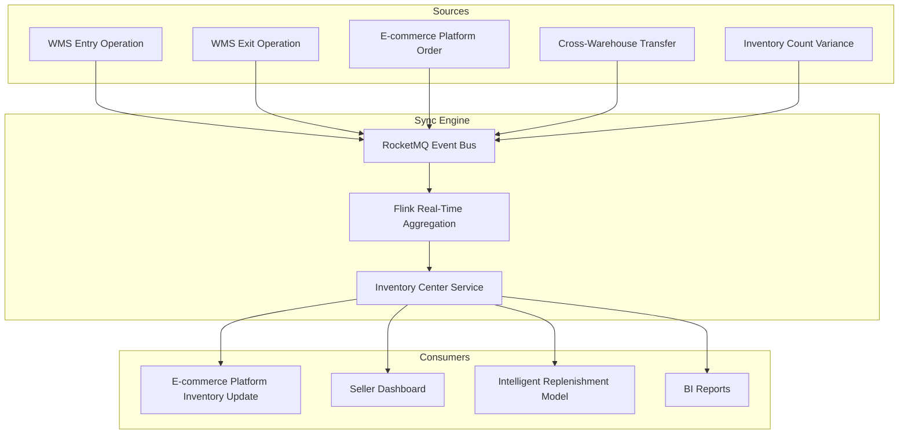

---title: Cross-Border E-commerce Overseas Warehouse Architecture Design — Alibaba Cloud Perspective
description: 'Cross-Border E-commerce Overseas Warehouse Architecture Design'
summary: 'Cross-Border E-commerce Overseas Warehouse Architecture Design'
category: general
tags:
- architecture
- best-practice
- prometheus
- grafana
- opa
- redis
- mysql
- gateway
- rag
tier: supporting
created: '2026-05-23'
last_updated: 2026-05
difficulty: intermediate
reading_level: intermediate
audience:
- All engineers
estimated_read_time: 15min
intent_queries:
- What is cross-border e-commerce overseas warehouse architecture design — Alibaba Cloud perspective
- How to design cross-border e-commerce overseas warehouse architecture — Alibaba Cloud perspective
- Kubernetes 20 application patterns best practices
trigger_keywords:
- Cross-border e-commerce overseas warehouse architecture design
- Alibaba Cloud perspective
- application
- patterns
prerequisites:
- kubectl-basics
- prometheus-basics
- monitoring-basics
- redis-basics
- mysql-basics
- policy-basics
original_language: Chinese
authors:
- name: Dillan Teagle
  role: contributor
source_path: /Users/teaglebuilt/github/teaglebuilt/knowledge/tree/application/architecture/crossborder-warehouse.md
---

> **Production Environment Security Notice**
>
> This document contains directly executable operation and maintenance commands. Before execution, please confirm: whether the current target cluster and Namespace are correct; whether you have sufficient RBAC permissions; whether you have verified in a non-production environment. Command risk levels are marked: Red (high risk), Yellow (medium risk), Green (low risk/read-only).

title: Cross-Border E-commerce Overseas Warehouse Architecture Design
description: '# Cross-Border E-commerce Overseas Warehouse Architecture Design — Alibaba Cloud Perspective'
category: application-architecture
tags:
- k8s
- architecture
- industry
- [[Prometheus|prometheus]]
- grafana
- opa
- redis
- mysql
- gateway
- rag
last_updated: 2026-05-18
difficulty: advanced
reading_level: advanced
audience:
- Cross-border e-commerce architects
- Logistics system engineers
- SRE
estimated_read_time: 5min
intent_queries:
- Cross-border e-commerce overseas warehouse Kubernetes WMS
- Multi-region warehouse Kubernetes distributed deployment
- Cross-border logistics order fulfillment K8s
- Inventory sync RocketMQ Kubernetes
- Cross-border compliance GDPR customs K8s
trigger_keywords:
- Overseas warehouse
- Cross-border logistics
- WMS
- OMS
- TMS
- Inventory sync
- GDPR
- Kubernetes
- Alibaba Cloud
related_domains:
- domain-01-cluster-fundamentals
- domain-11-production-operations
related_topics:
- 55-crossborder-dtc
- 31-instant-retail
- 12-smart-logistics-architecture
k8s_versions:
- '1.28'
- '1.29'
- '1.30'
- '1.31'
- '1.32'
---

# Cross-Border E-commerce Overseas Warehouse Architecture Design — Alibaba Cloud Perspective

> **Applicable Versions**: Kubernetes v1.29 - v1.33 | **Last Updated**: 2026-04-24
> **Authors**: Alibaba Cloud Solution Architects | **Tags**: `#OverseasWarehouse` `#CrossBorderLogistics` `#WMS` `#AlibabCloud`

---

## Table of Contents

1. [Industry Overview](#1-industry-overview)
2. [Business Scenarios](#2-business-scenarios)
3. [Architecture Design](#3-architecture-design)
4. [Core Technology Stack](#4-core-technology-stack)
5. [Kubernetes Deployment Solution](#5-kubernetes-deployment-solution)
6. [Data Architecture](#6-data-architecture)
7. [AI/ML Components](#7-aiml-components)
8. [Security and Compliance](#8-security-and-compliance)
9. [Best Practices](#9-best-practices)
10. [Anti-Patterns](#10-anti-patterns)
11. [Reference Resources](#11-reference-resources)

---

## 1. Industry Overview

## 1.1 Market Scale and Trends

Overseas warehouses are critical logistics infrastructure for cross-border e-commerce, directly affecting delivery speed, consumer experience, and operating costs. Global cross-border e-commerce market expected to grow from $6 trillion in 2024 to $15 trillion by 2030. Overseas warehouses as key cross-border logistics model with "local shipment, fast delivery" advantage replace traditional direct-mail models, market penetration continuously rising.

| Indicator | 2024 | 2026 (Forecast) | 2030 (Forecast) |
|:---|:---|:---|:---|
| Global Cross-Border E-commerce Scale | $6T | $9T | $15T |
| Overseas Warehouse Market | $80B | $150B | $400B |
| Chinese Seller Overseas Warehouses | 2000+ | 3500+ | 8000+ |
| Avg Last-Mile Delivery | 3-5 days | 2-3 days | 1-2 days |
| Return Rate | 8-12% | 6-9% | 4-6% |

## 1.2 Industry Pain Points

| Pain Point | Description | Digital Transformation Driver |
|:---|:---|:---|
| Multi-Warehouse Coordination | US East/West/Europe/SEA multi-warehouse management | Distributed WMS + real-time sync |
| Inventory Precision | Many SKUs, complex batch management, inventory discrepancies | Real-time inventory sync + AI replenishment |
| Order Fulfillment | B2C dropshipping + B2B bulk transfer mixed models | Flexible fulfillment engine |
| Customs Compliance | Import tax requirements vary by country | Automated compliance declaration |
| Return Processing | High cross-border return costs, complex processes | Local return warehouse + smart QA |
| Last-Mile Delivery | Multi-logistics price comparison and tracking | TMS integration + smart allocation |

---

## 2. Business Scenarios

## 2.1 Intelligent Warehouse Entry

Full process from domestic consolidation to overseas warehouse entry: receiving appointment, unloading acceptance, QA sampling, barcode scanning, bin allocation, shelf entry. Support ASN (Advance Shipping Notice), QA rule configuration, exception handling (shortage/damage/overstock), integrate with head-haul logistics system.

## 2.2 Precise Inventory Management

Real-time multi-warehouse inventory visibility, batch/expiry management, bin-level precision management, safety stock alerts. Support cross-warehouse allocation, inventory freezing/unfreezing, inventory counting (dynamic/blind/full). Inventory data real-time sync to e-commerce platforms, prevent overselling.

## 2.3 Efficient Order Fulfillment

Support B2C dropshipping and B2B bulk transfer modes. Real-time order extraction from e-commerce platforms, intelligent multi-warehouse allocation, wave picking, packing labeling, weighing shipping, last-mile delivery. System supports thousands of orders per minute peak capacity.

---

## 3. Architecture Design

## 3.1 Overseas Warehouse Full-Landscape Architecture



---

## 4. Core Technology Stack

| Component | Purpose | Technology | License |
|:---|:---|:---|:---|
| Container Orchestration | Multi-region deployment | ACK Pro (multi-region) | Proprietary |
| WMS Core | Warehouse management system | Self-developed WMS (Spring Boot) | Proprietary |
| Order Engine | High-throughput order processing | Self-developed OMS (Go) | Proprietary |
| Relational DB | Business data | PolarDB MySQL (multi-region) | Proprietary |
| Cache | Hot data caching | Redis Enterprise (cluster) | Proprietary |
| Message Queue | Event-driven architecture | Apache RocketMQ 5.x | Apache 2.0 |
| Object Storage | Documents & images | OSS (multi-region) | Proprietary |
| Stream Processing | Real-time inventory sync | Flink | Apache 2.0 |
| Search Engine | Product & order search | OpenSearch | Apache 2.0 |
| AI Platform | Demand forecast & optimization | PAI | Proprietary |
| CDN | Global content delivery | Aliyun DCDN | Proprietary |
| Monitoring | Observability | ARMS + SLS + Grafana | Proprietary / Apache 2.0 |

---

## 5. Kubernetes Deployment Solution

## 5.1 WMS Core Service Deployment

```yaml
apiVersion: apps/v1
kind: Deployment
metadata:
  name: wms-core
  namespace: crossborder-warehouse
  labels:
    app: wms-core
    region: us-west
spec:
  replicas: 4
  selector:
    matchLabels:
      app: wms-core
  template:
    metadata:
      labels:
        app: wms-core
        region: us-west
      annotations:
        prometheus.io/scrape: "true"
        prometheus.io/port: "9090"
    spec:
      containers:
        - name: wms
          image: registry.cn-hangzhou.aliyuncs.com/cbwms/wms-core:v4.0.0
          ports:
            - containerPort: 8080
              name: http
            - containerPort: 9090
              name: metrics
          env:
            - name: WAREHOUSE_CODE
              value: "US-WEST-LAX"
            - name: WAREHOUSE_TIMEZONE
              value: "America/Los_Angeles"
            - name: DB_HOST
              valueFrom:
                configMapKeyRef:
                  name: wms-config
                  key: db-host
            - name: REDIS_URL
              valueFrom:
                secretKeyRef:
                  name: wms-secrets
                  key: redis-url
            - name: ROCKETMQ_NAMESRV
              valueFrom:
                configMapKeyRef:
                  name: wms-config
                  key: rocketmq-namesrv
            - name: INVENTORY_SYNC_MODE
              value: "realtime"
            - name: PICKING_STRATEGY
              value: "wave-optimized"
          resources:
            requests:
              memory: "4Gi"
              cpu: "2000m"
            limits:
              memory: "8Gi"
              cpu: "4000m"
          readinessProbe:
            httpGet:
              path: /health/ready
              port: 8080
            initialDelaySeconds: 20
            periodSeconds: 5
          livenessProbe:
            httpGet:
              path: /health/live
              port: 8080
            initialDelaySeconds: 40
            periodSeconds: 10
```

---

## 6. Data Architecture

## 6.1 Real-Time Inventory Sync Data Flow



---

## 7. AI/ML Components

## 7.1 Core Models

| Model | Purpose | Input | Output | Framework |
|:---|:---|:---|:---|:---|
| Demand Forecast | Each warehouse SKU sales forecast | Historical sales/promotions/seasonality | Next 30-day sales forecast | Prophet + LSTM |
| Intelligent Replenishment | Optimal replenishment quantity and timing | Demand forecast/in-transit/safety stock | Replenishment recommendation order | OR-Tools |
| Intelligent Multi-Warehouse Allocation | Optimal shipping warehouse for order | Delivery address/inventory/shipping cost | Recommended warehouse | Greedy + ML |
| Route Optimization | Picking route optimization | Order lines/warehouse layout | Optimal picking route | TSP Solver |
| Anomaly Detection | Inventory/order anomalies | Inventory flow/order data | Anomaly flagged | Isolation Forest |

---

## 8. Security and Compliance

## 8.1 Industry Regulations and Standards

| Regulation/Standard | Applicable Scope | Architecture Requirement |
|:---|:---|:---|
| GDPR | Europe/UK data protection | Data minimization + cross-border transfer compliance |
| CCPA | California consumer privacy | Data deletion right + disclosure right |
| National Customs Laws | Import/export compliance declaration | Automated customs declaration system |
| VAT/Sales Tax | National tax compliance | Auto tax calculation + declaration |
| PCI-DSS | Payment data security | Payment info encryption + tokenization |
| Data Export Security Review | Chinese data export | Data localization + security review |

---

## 9. Best Practices

1. **Multi-Region Nearby Deployment**: Deploy independent WMS cluster in each overseas warehouse region, sync inventory data via event bus
2. **Wave Picking Optimization**: Aggregate orders into picking waves by time window, optimize picking routes, improve picking efficiency 40%
3. **Inventory Safety Level**: AI auto-calculate safety stock based on demand forecast and replenishment cycle, prevent stockouts and overstocking
4. **Unified Multi-Platform**: Unified integration Amazon/Shopify/eBay/TikTok, centralized inventory and order management
5. **Real-Time Logistics Tracking**: Real-time obtain last-mile logistics trajectories, sync to e-commerce platforms, enhance consumer experience
6. **Automated Compliance**: Auto-calculate tariffs/VAT by destination country, generate customs declarations
7. **Return Localization**: Process returns at nearby return warehouse, QA grade and re-shelf or discard, reduce return costs
8. **Elastic Scaling**: Auto scale order processing services during peak seasons (Black Friday/Double 11)
9. **Cross-Warehouse Transfer Intelligence**: AI recommend cross-warehouse transfer based on each warehouse inventory and demand forecast
10. **Barcode Full-Chain Management**: Barcode scanning throughout warehouse entry-shelf-picking-shipping process, ensure 99.9%+ accuracy

---

## 10. Anti-Patterns

1. **Single-Region Centralized Deployment**: All overseas warehouse operations centralized in domestic data center, causing high latency. Should deploy nearby
2. **Scheduled Inventory Sync**: Hourly/daily inventory sync causing overselling. Should implement real-time event-driven sync
3. **Ignore Tax Compliance**: Not auto-calculate VAT/sales tax per country, causing compliance risk. Should deploy auto tax engine
4. **Manual Customs Declaration**: Rely on manual customs form filling, low efficiency and error-prone. Should implement auto customs system
5. **Ignore Return Strategy**: Expensive cross-border returns when value exceeds product price, still return domestically. Should establish tiered return strategy

---

## 11. Reference Resources

- Cross-Border E-commerce Comprehensive Pilot Zone Policy (mofcom.gov.cn)
- GDPR Official Text (gdpr-info.eu)
- CCPA California Consumer Privacy Law (oag.ca.gov/privacy/ccpa)
- Shopify Developer Documentation (shopify.dev)
- Amazon SP-API (developer.amazonservices.com)
- Alibaba Cloud Global Infrastructure (alibabacloud.com/global-locations)
- Apache RocketMQ Documentation (rocketmq.apache.org/docs)

---

**Maintainers**: Alibaba Cloud Solution Architects Team | **License**: MIT

---

## Obsidian Related Documents

- topic-application-architecture MOC
- [[domain-20-application-patterns/topic-application-architecture/README.md|Topic Application Layer Architecture Design Best Practices]]

## See Also

- 31-instant-retail
- 32-smart-restaurant
- 34-sportstech
- 35-metaverse-digital-twin


<!-- risk-assessed -->
