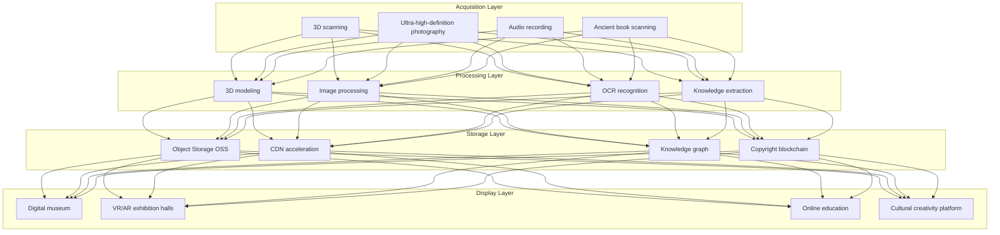

---title: Cultural Digitization Architecture Design — Alibaba Cloud Perspective
description: 'title: Cultural Digitization Architecture Design'
summary: 'title: Cultural Digitization Architecture Design'
category: general
tags:
- architecture
- best-practice
- gpu
- nvidia
tier: supporting
created: '2026-05-23'
last_updated: 2026-05
difficulty: intermediate
reading_level: intermediate
audience:
- All engineers
estimated_read_time: 5min
intent_queries:
- Cultural Digitization Architecture Design — Alibaba Cloud Perspective
- How to implement Cultural Digitization Architecture Design — Alibaba Cloud Perspective
- Kubernetes 20 application patterns best practices
trigger_keywords:
- Cultural digitization architecture design
- Alibaba Cloud perspective
- application
- patterns
prerequisites:
- kubectl-basics
- prometheus-basics
- gpu-scheduling-basics
authors:
- name: Dillan Teagle
  role: contributor
source_path: /Users/teaglebuilt/github/teaglebuilt/knowledge/tree/application/architecture/cultural-digitization.md
original_language: Chinese
---

> **Production Environment Security Notice**
>
> This document contains operations and maintenance commands that can be executed directly. Before execution, please ensure: the current target cluster and Namespace are correct; you have sufficient RBAC permissions; the commands have been verified in a non-production environment. Command risk levels: 🔴 High risk (may cause data loss or service interruption), 🟡 Medium risk (modifies cluster state but usually reversible), 🟢 Low risk/Read-only (information collection with no side effects).

title: Cultural Digitization Architecture Design
description: '# Cultural Digitization Architecture Design — Alibaba Cloud Perspective'
category: application-architecture
tags:
- k8s
- architecture
- industry
- gpu
- nvidia
last_updated: 2026-05-18
difficulty: intermediate
reading_level: intermediate
audience:
- Museum digitization directors
- Cultural heritage protection experts
- Cloud rendering engineers
estimated_read_time: 5min
intent_queries:
- Digital museum 3D cultural relic digitization
- VR virtual exhibition cloud rendering architecture
- Ancient book OCR recognition knowledge extraction
- Blockchain digital copyright notarization
- Alibaba Cloud GPU rendering cluster
trigger_keywords:
- Cultural digitization
- Digital museum
- Cultural relic digitization
- 3D scanning
- VR virtual exhibition
- Ancient book OCR
- Blockchain copyright
- Intangible cultural heritage
- IIIF protocol
- Cloud rendering
related_domains:
- domain-03-networking-traffic
- domain-10-troubleshooting-diagnostics
related_topics:
- topic-metaverse-digital-twin
- topic-blockchain-architecture
k8s_versions:
- '1.28'
- '1.29'
- '1.30'
- '1.31'
- '1.32'
---

# Cultural Digitization Architecture Design — Alibaba Cloud Perspective

> **Applicable Version**: [[Kubernetes|Kubernetes]] v1.29 - v1.33 | **Last Updated**: 2026-04-24
> **Author**: Alibaba Cloud Solution Architects | **Tags**: `#Cultural_Digitization` `#Digital_Museum` `#Intangible_Heritage` `#Cultural_Relics` `#Alibaba_Cloud`

---

## Table of Contents

1. [Overview](#1-overview)
2. [Design Principles](#2-design-principles)
3. [Architecture Patterns](#3-architecture-patterns)
4. [Implementation Examples](#4-implementation-examples)
5. [Kubernetes Deployment](#5-kubernetes-deployment)
6. [Best Practices](#6-best-practices)
7. [Anti-Patterns](#7-anti-patterns)
8. [Reference Resources](#8-reference-resources)

---

## 1. Overview

Cultural digitization is a systematic engineering effort that leverages digital technology to collect, store, protect, display, and disseminate cultural heritage. It encompasses three-dimensional digitization of cultural relics, ancient book OCR recognition, documentation of intangible cultural techniques, digital museum construction, virtual exhibitions, and cultural big data platforms. The core value of cultural digitization lies in: permanently preserving endangered cultural heritage, breaking temporal and spatial boundaries to enable public online access, and providing immersive cultural experiences through AI and XR technologies.

The technical characteristics of cultural digitization platforms include: massive multimedia data (3D models, ultra-high-definition imagery, audio-video, with individual artifacts reaching several GB), high-precision requirements (artifact 3D scanning precision reaching micrometer level), copyright protection (digital asset confirmation and copyright management), and high concurrent access (popular digital museum exhibitions reaching tens of thousands of concurrent users).

### 1.1 Industry Background

| Challenge | Description | Architecture Impact |
|:---|:---|:---|
| Massive resources | Digitization of cultural relics/ancient books/intangible heritage | OSS + CDN distribution |
| High-precision acquisition | 3D scanning/ultra-high-definition imagery | GPU rendering + large-capacity storage |
| Knowledge association | Mining relationships between cultural relics | Knowledge graph + graph database |
| Innovation in dissemination | Digital exhibitions/virtual experiences | XR + cloud rendering |
| Copyright protection | Digital asset copyright | Blockchain notarization |

### 1.2 Core Scenarios

- **Cultural Relic Digitization**: 3D laser scanning / photogrammetry / ultra-high-definition photography / digital archives
- **Digital Museums**: Online exhibitions / virtual exhibition halls / intelligent navigation
- **Intangible Cultural Heritage Preservation**: Technique video recording / motion capture / digital heritage transmission
- **Ancient Book Protection**: OCR recognition / knowledge extraction / ancient book database
- **Cultural Big Data**: Cultural resource census / analysis / open sharing

---

## 2. Design Principles

### 2.1 Non-Destructive Protection Principle

The digitization process must not cause any damage to cultural relics. Non-contact acquisition is prioritized (laser scanning, photogrammetry) to avoid physical contact. Lossless formats are used for storage, preserving original data.

### 2.2 Standards and Openness Principle

Adopt internationally recognized cultural data standards (CIDOC CRM, Dublin Core, IIIF) to ensure long-term data readability and interoperability. Provide standardized APIs to support data sharing.

### 2.3 Immersive Experience Principle

Cultural display is not merely data presentation but creation of immersive cultural experiences. Through VR/AR/XR technologies, 3D interaction, and AI-guided tours, users gain experiences that surpass physical exhibitions.

### 2.4 Copyright Protection Principle

Digitized cultural relics are important digital assets. Protect them through blockchain notarization for confirmation of rights, digital watermarks to prevent unauthorized use, and access control to manage permissions.

---

## 3. Architecture Patterns

### 3.1 Comprehensive Architecture of Cultural Digitization Platform



---

## 4. Implementation Examples

### 4.1 Cultural Relic Digital Asset Management

```go
package cultural

import (
    "time"
)

type Artifact struct {
    ID           string
    Name         string
    Dynasty      string
    Category     string
    MuseumID     string
    Model3DRef   string
    ImageRefs    []string
    Description  string
    CreatedAt    time.Time
    BlockchainTx string
}

type ArtifactService struct {
    artifacts map[string]*Artifact
}

func (s *ArtifactService) Register(a *Artifact) error {
    s.artifacts[a.ID] = a
    return nil
}
```

---

## 5. Kubernetes Deployment

```yaml
apiVersion: apps/v1
kind: Deployment
metadata:
  name: cultural-3d-render
  namespace: cultural-digitization
spec:
  replicas: 3
  selector:
    matchLabels:
      app: cultural-3d-render
  template:
    metadata:
      labels:
        app: cultural-3d-render
    spec:
      nodeSelector:
        accelerator: nvidia-a10
      runtimeClassName: nvidia
      containers:
        - name: render
          image: registry.cn-hangzhou.aliyuncs.com/culture/3d-render:v2.0.0-gpu
          env:
            - name: MODEL_FORMAT
              value: "gltf"
            - name: TEXTURE_QUALITY
              value: "4k"
          resources:
            requests:
              nvidia.com/gpu: 1
              memory: "16Gi"
              cpu: "8000m"
            limits:
              nvidia.com/gpu: 1
              memory: "32Gi"
              cpu: "16000m"
```

---

## 6. Best Practices

- **IIIF Standard**: Use IIIF protocol to provide high-resolution image services supporting zoom and cropping
- **Blockchain Notarization**: Register digitized cultural relics on blockchain to ensure traceable copyright
- **CDN Acceleration**: Accelerate distribution of 3D models and high-definition images through CDN
- **Progressive Loading**: Use LOD (Level of Detail) for progressive loading of 3D models

## 7. Anti-Patterns

- **Lossy Compression**: Using lossy compression on cultural relic images loses details. Should use lossless formats for original data storage
- **Ignoring Data Standards**: Not following international data standards makes data non-shareable. Should adopt standards like CIDOC CRM
- **Single-Point Storage**: Storing all digital assets in a single location risks data loss. Should implement multi-copy backup + cross-site disaster recovery

---

## 8. Reference Resources

### 8.1 Alibaba Cloud Component Mapping

| Functional Domain | **Alibaba Cloud Cloud-Native Solution** |
|:---|:---|
| Container Platform | **ACK Pro + GPU** |
| Object Storage | **OSS + CDN** |
| AI | **PAI + Visual Intelligence** |
| Blockchain | **Ant Chain BaaS** |
| Database | **PolarDB** |
| Observability | **ARMS + SLS** |

### 8.2 Production Checklist

- [ ] 3D scanning precision verification (micrometer level)
- [ ] Ancient book OCR accuracy > 95%
- [ ] Non-destructive detection of cultural relic digitization
- [ ] Complete blockchain notarization of copyright
- [ ] Virtual exhibition concurrent load testing

---

**Maintainer**: Alibaba Cloud Solution Architects Team | **License**: MIT

---

## Obsidian Related Documentation

- topic-application-architecture KUDIG Database — Global MOC
- [[domain-20-application-patterns/topic-application-architecture/README.md|[[Topic Application Architecture Design Best Practices|Topic Application Architecture Design Best Practices]]]]
- [[domain-20-application-patterns/topic-application-architecture/01-ecommerce-architecture.md|E-Commerce System Kubernetes Production Architecture Design]]
- [[domain-20-application-patterns/topic-application-architecture/02-mini-program-architecture.md|Mini Program Platform Architecture Design]]
- [[domain-20-application-patterns/topic-application-architecture/03-cms-architecture.md|Content Management System CMS Architecture Design]]
- [[domain-20-application-patterns/topic-application-architecture/04-im-rtc-architecture.md|Real-Time Communication IM/RTC Architecture Design]]
- [[domain-20-application-patterns/topic-application-architecture/05-online-education-architecture.md|Online Education Platform Kubernetes Production Architecture Design]]
- [[domain-20-application-patterns/topic-application-architecture/06-fintech-architecture.md|Financial Technology FinTech Kubernetes Production Architecture Design]]
- [[domain-20-application-patterns/topic-application-architecture/07-iot-platform-architecture.md|Internet of Things IoT Platform Architecture Design]]
- [[domain-20-application-patterns/topic-application-architecture/08-ai-ml-inference-architecture.md|AI/ML Inference Service Kubernetes Production Architecture Design]]
- [[domain-20-application-patterns/topic-application-architecture/09-gaming-backend-architecture.md|Game Backend Kubernetes Production Architecture Design]]
- [[domain-20-application-patterns/topic-application-architecture/10-social-media-architecture.md|Social Media Platform Kubernetes Production Architecture Design]]

## See Also

- 81-smart-customs
- 82-legaltech
- 84-national-park
- 85-hydrogen-energy

## Related

- topic-application-architecture MOC — Cross-reference


<!-- risk-assessed -->
