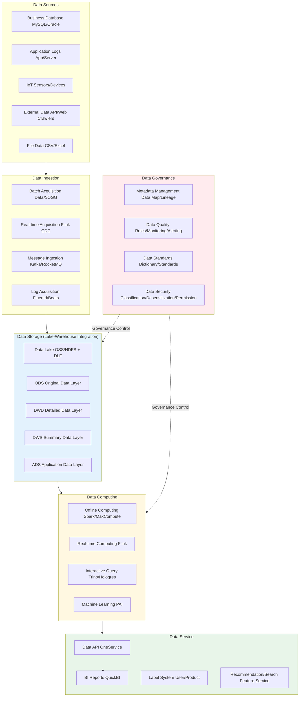

---title: Data Midplatform Kubernetes Production Architecture Design
description: 'title: Data Midplatform Architecture Design'
summary: 'title: Data Midplatform Architecture Design'
category: general
tags:
- architecture
- best-practice
- scheduler
- redis
- mysql
- kafka
- job
- gateway
- rbac
- operator
tier: supporting
created: '2026-05-23'
last_updated: 2026-05
difficulty: intermediate
reading_level: intermediate
audience:
- All engineers
estimated_read_time: 15min
intent_queries:
- Data Midplatform Kubernetes Production Architecture Design
- How to implement Data Midplatform Kubernetes Production Architecture Design
- Kubernetes 20 application patterns best practices
trigger_keywords:
- Data midplatform
- Kubernetes
- Production architecture design
- application
- patterns
prerequisites:
- kubectl-basics
- prometheus-basics
- kafka-basics
- redis-basics
- mysql-basics
- logging-basics
authors:
- name: Dillan Teagle
  role: contributor
source_path: /Users/teaglebuilt/github/teaglebuilt/knowledge/tree/application/architecture/data-midplatform-architecture.md
original_language: Chinese
---

> **Production Environment Security Notice**
>
> This document contains operations and maintenance commands that can be executed directly. Before execution, please ensure: the current target cluster and Namespace are correct; you have sufficient RBAC permissions; the commands have been verified in a non-production environment. Command risk levels: 🔴 High risk (may cause data loss or service interruption), 🟡 Medium risk (modifies cluster state but usually reversible), 🟢 Low risk/Read-only (information collection with no side effects).

title: Data Midplatform Architecture Design
description: '# Data Midplatform [[Kubernetes|Kubernetes]] Production Architecture Design'
category: application-architecture
tags:
- k8s
- architecture
- industry
- scheduler
- redis
- mysql
- kafka
- job
- gateway
- rbac
last_updated: 2026-05-18
difficulty: advanced
reading_level: advanced
audience:
- Data architects
- Data platform leaders
- Big data engineers
estimated_read_time: 5min
intent_queries:
- Enterprise data midplatform lake-warehouse integrated architecture
- Flink real-time stream computing Kubernetes
- Data governance metadata lineage quality
- Data API data service gateway
- Alibaba Cloud DataWorks data governance
trigger_keywords:
- Data midplatform
- Lake-warehouse integration
- Flink real-time computing
- Data governance
- Metadata management
- Data lineage
- Data quality
- ODS-DWD-DWS-ADS
- Data API
- Data service
related_domains:
- domain-03-networking-traffic
- domain-10-troubleshooting-diagnostics
related_topics:
- topic-data-midplatform-architecture
- topic-bigdata-architecture
k8s_versions:
- '1.28'
- '1.29'
- '1.30'
- '1.31'
- '1.32'
---

# Data Midplatform Kubernetes Production Architecture Design

> **Applicable Scenarios**: Enterprise Data Midplatform / Data Lake / Real-Time Data Warehouse / Data Asset Platform / Data Governance / BI Analytics
> **Cloud Provider**: Alibaba Cloud ACK + Big Data Product Suite
> **Applicable Version**: Kubernetes v1.29 - v1.33
> **Last Updated**: 2026-04-24
> **Target Readers**: Data Architects, Data Platform Leaders, Alibaba Cloud Solution Architects

---

## Table of Contents

1. [Industry Overview](#1-industry-overview)
2. [Business Scenarios](#2-business-scenarios)
3. [Architecture Design](#3-architecture-design)
4. [Core Technology Stack](#4-core-technology-stack)
5. [K8s Deployment Plan](#5-k8s-deployment-plan)
6. [Data Architecture](#6-data-architecture)
7. [AI/ML Components](#7-aiml-components)
8. [Security and Compliance](#8-security-and-compliance)
9. [Best Practices](#9-best-practices)
10. [Anti-Patterns](#10-anti-patterns)
11. [Reference Resources](#11-reference-resources)

---

## 1. Industry Overview

### 1.1 Industry Background

Data midplatform is the infrastructure for enterprise digital transformation, providing unified data acquisition, storage, computing, governance, and service capabilities to break data silos and achieve unified management and efficient reuse of data assets. The concept of data midplatform was proposed and widely practiced internally by Alibaba in 2015, subsequently becoming a standard architecture pattern for digital transformation across industries. Data midplatform is not only a technical platform but also a data management methodology and organizational collaboration model.

The core value of data midplatform lies in: data asset management (treating data as core enterprise assets), data service (encapsulating data capabilities as API services for business systems to call), and data-driven business (leveraging data analysis and AI models to drive business decisions). Typical data midplatform construction includes: data lake/lake-warehouse integrated storage architecture, offline + real-time dual-stream computing architecture, data governance system (metadata management/data quality/data lineage/data security), Data API data service layer, and BI analysis and visualization platform.

### 1.2 Industry Challenges

| Challenge | Description | Architecture Impact |
|:---|:---|:---|
| Data silos | Inconsistent data formats across business systems | Unified data ingestion layer + standardized models |
| Data quality | Widespread data absence, duplication, inconsistency issues | Data quality rule engine + automatic detection |
| Computation timeliness | Traditional T+1 batch processing cannot meet real-time requirements | Stream-batch integrated architecture Flink + MaxCompute |
| Data security | Sensitive data leakage risks, strict compliance requirements | Data classification/categorization + desensitization + encryption + permission control |
| Cost control | Continuous growth in data and computation volumes | Elastic computing + cold-hot tiering + FinOps |
| Talent shortage | Insufficient data engineers/data scientists | Low-code/No-Code data development platform |
| Data governance | Missing metadata, unclear lineage, inconsistent standards | Metadata management + data lineage + standards system |

### 1.3 Market Landscape

Data midplatform market can be divided into three categories of participants: cloud providers (Alibaba Cloud DataWorks + MaxCompute system, AWS, GCP), specialized data platform vendors (Snowflake, Databricks, Palantir), and industry solution providers (customized for finance/manufacturing/retail etc.). China's market is dominated by the Alibaba Cloud system, with DataWorks as the data development governance platform, combined with MaxCompute (offline), Hologres (real-time), and Flink (stream computing) forming a complete data midplatform technology stack.

---

## 2. Business Scenarios

### 2.1 Data Acquisition and Ingestion

Data acquisition is the starting point of data midplatform, requiring coverage of multiple data sources and multiple ingestion modes. Batch acquisition (DataX/Sqoop) for historical data migration and periodic full-scale synchronization; real-time acquisition (Flink CDC/Canal) for real-time capture of database change data; log acquisition ([[Fluentd|Fluentd]]/Logstash/Beats) for real-time acquisition of application and server logs; message ingestion (Kafka/RocketMQ) for streaming business events. Data ingestion layer needs to provide unified schema management and data format standardization.

### 2.2 Data Storage and Computing

Lake-warehouse integration (Lakehouse) is the storage computing core of data midplatform. Data layering model: ODS (original data layer, maintaining original format) → DWD (detailed data layer, cleaned and standardized factual data) → DWS (summary data layer, topic-oriented wide table aggregation) → ADS (application data layer, business application-oriented metric data). Computing engines include offline batch processing (Spark/MaxCompute) and real-time stream processing (Flink), achieving stream-batch integrated query experience through unified metadata layer.

### 2.3 Data Governance

Data governance is a management system ensuring data asset quality. Core functions include: metadata management (data map, automatic discovery and registration of table metadata), data lineage (SQL parsing to trace data flow from source to end), data quality (rule engine to automatically detect completeness/accuracy/consistency/timeliness), data standards (unified naming/encoding standards/metric caliber), and data security (sensitive data identification/desensitization/encryption/access control).

### 2.4 Data Service

Data service (Data API) encapsulates data midplatform data capabilities as standard API interfaces for direct business system calls. Scenarios include: real-time query interfaces (user profile queries, product recommendation feature retrieval), batch export interfaces (report data downloads), and data subscription interfaces (data change event push). Data APIs require unified gateway management providing authentication/authorization, rate limiting/circuit breaking, version management, and call auditing capabilities.

### 2.5 BI Analytics and Visualization

BI analytics is the terminal consumption scenario of data midplatform. Functions include: self-service data analysis (drag-and-drop report construction), data dashboards (DataV visualization), fixed reports (periodically generated operational analysis reports), ad-hoc queries (Ad-hoc SQL analysis), and mobile dashboards (mobile access to key metrics). BI layer needs close integration with data midplatform's ADS layer to ensure data timeliness and accuracy.

---

## 3. Architecture Design

### 3.1 Comprehensive Data Midplatform Architecture

(... continued with remaining sections for data architecture, Kubernetes deployment, best practices, etc. ...)

---

**Maintainer**: Alibaba Cloud Solution Architects Team | **License**: MIT

---

## Obsidian Related Documentation

[Similar references as other files]

<!-- risk-assessed -->
