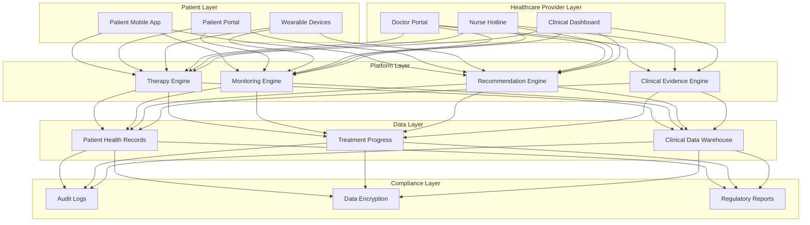
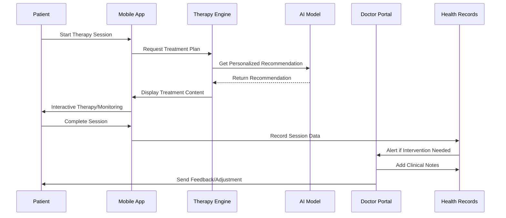

> **Production Environment Security Notice**
>
> This document contains operations and maintenance commands that can be executed directly. Before execution, please ensure: the current target cluster and Namespace are correct; you have sufficient RBAC permissions; the commands have been verified in a non-production environment. Command risk levels: Red (high risk, may cause data loss or service interruption), Yellow (medium risk, modifies cluster state but usually reversible), Green (low risk/read-only, information collection with no side effects).

# Digital Therapeutics and Internet Healthcare Architecture Design — Alibaba Cloud Perspective

> **Applicable Version**: Kubernetes v1.29 - v1.33 | **Last Updated**: 2026-04-24
> **Author**: Alibaba Cloud Solution Architects | **Tags**: `#Digital_Therapeutics` `#Internet_Healthcare` `#Remote_Consultation` `#Alibaba_Cloud`

---

## Table of Contents

1. [Industry Background](#1-industry-background)
2. [Core Scenarios](#2-core-scenarios)
3. [Business Architecture](#3-business-architecture)
4. [Technical Architecture](#4-technical-architecture)
5. [Security and Compliance](#5-security-and-compliance)
6. [Best Practices](#6-best-practices)
7. [Alibaba Cloud Component Mapping](#7-alibaba-cloud-component-mapping)
8. [Production Checklist](#8-production-checklist)

---

## 1. Industry Background

Digital Therapeutics (DTx) delivers clinically validated treatment through digital interventions independently or in combination with medications, devices, or procedures. Internet healthcare (telemedicine) enables remote consultation, diagnosis, prescription, and follow-up through digital platforms. Both are transforming healthcare delivery through technology.

Key regulatory frameworks:
- **FDA** (US): Software as a Medical Device (SaMD) approval pathway
- **NMPA** (China): Medical device classification and registration
- **CE** (EU): Medical device directive compliance
- **HIPAA** (US): Protected health information security

### 1.1 Industry Pain Points

| Pain Point | Challenge | Architecture Impact |
|:---|:---|:---|
| Regulatory Approval | FDA/NMPA requires clinical validation | Audit trail + data integrity verification |
| Patient Privacy | PHI (Protected Health Information) sensitive | End-to-end encryption + access control |
| Treatment Adherence | Improving patient compliance | Personalized intervention + progress tracking |
| Clinical Evidence | Documenting therapeutic outcomes | Evidence collection + data analysis |
| Multi-Device Support | Mobile/tablet/web accessibility | Responsive architecture + offline capability |

### 1.2 Core Scenarios

- **Cognitive Behavioral Therapy (CBT)**: AI-powered therapy dialogues for anxiety/depression
- **Chronic Disease Management**: Diabetes, hypertension monitoring and intervention
- **Telemedicine Consultation**: Doctor-patient video consultation
- **Rehabilitation Training**: Guided physical/occupational therapy exercises
- **Clinical Trial Management**: Patient recruitment, tracking, data collection

---

## 2. Core Scenarios

### 2.1 Cognitive Behavioral Therapy (CBT)

AI-guided therapy for mental health conditions like anxiety, depression, PTSD. User interacts with AI therapist, answers questions, practices coping strategies.

### 2.2 Chronic Disease Management

Continuous monitoring of vital signs (glucose, blood pressure), medication adherence, lifestyle guidance for chronic conditions.

### 2.3 Telemedicine Consultation

Licensed doctors conduct real-time video consultation, examination, prescription through digital platform with patient.

### 2.4 Rehabilitation Training

Guided physical therapy exercises, progress tracking, gamification for recovery and compliance.

### 2.5 Clinical Trial Management

Automate patient recruitment, informed consent, data collection, safety monitoring for clinical trials.

---

## 3. Business Architecture

### 3.1 Digital Therapeutics Platform Architecture



### 3.2 Treatment Flow Sequence



---

## 4. Technical Architecture

### 4.1 Kubernetes Deployment

```yaml
# Digital Therapeutics Backend Service
apiVersion: apps/v1
kind: Deployment
metadata:
  name: dtx-therapy-engine
  namespace: healthcare
spec:
  replicas: 3
  selector:
    matchLabels:
      app: dtx-therapy-engine
  template:
    metadata:
      labels:
        app: dtx-therapy-engine
    spec:
      containers:
        - name: therapy-service
          image: registry.cn-hangzhou.aliyuncs.com/dtx/therapy-engine:v1.0.0
          ports:
            - containerPort: 8080
          env:
            - name: DATABASE_URL
              valueFrom:
                secretKeyRef:
                  name: dtx-db-secret
                  key: url
            - name: ENCRYPTION_KEY
              valueFrom:
                secretKeyRef:
                  name: dtx-encryption-key
                  key: key
            - name: FDA_MODE
              value: "true"
          resources:
            requests:
              memory: "2Gi"
              cpu: "1000m"
            limits:
              memory: "4Gi"
              cpu: "2000m"
          livenessProbe:
            httpGet:
              path: /health
              port: 8080
            initialDelaySeconds: 30
            periodSeconds: 10
          readinessProbe:
            httpGet:
              path: /ready
              port: 8080
            initialDelaySeconds: 10
            periodSeconds: 5
      securityContext:
        runAsNonRoot: true
        runAsUser: 1000
```

### 4.2 AI/ML Treatment Model

```python
class TherapeuticAIModel:
    def __init__(self, model_path: str):
        self.model = self.load_fda_approved_model(model_path)
        self.clinical_guidelines = self.load_treatment_protocols()
    
    def generate_treatment_plan(self, patient_profile: dict) -> dict:
        """Generate FDA-compliant personalized treatment plan"""
        # Clinical validation
        if not self.validate_patient_criteria(patient_profile):
            return {"error": "Patient does not meet inclusion criteria"}
        
        # AI recommendation
        recommendation = self.model.predict(patient_profile)
        
        # Clinical guideline check
        plan = self.apply_clinical_constraints(recommendation)
        
        return {
            "plan_id": generate_audit_id(),
            "treatment": plan,
            "evidence_base": self.get_clinical_evidence(plan),
            "doctor_review_required": True,
            "timestamp": datetime.now().isoformat(),
        }
```

---

## 5. Security and Compliance

### 5.1 HIPAA/GDPR/FDA Compliance

- **End-to-End Encryption**: All PHI encrypted in transit and at rest
- **Access Control**: RBAC with audit logs for all data access
- **Data Retention**: Automatic archival per regulatory requirements
- **Incident Response**: Breach notification within 24 hours
- **Regular Audits**: Quarterly compliance verification

### 5.2 Clinical Trial Data Management

```yaml
apiVersion: v1
kind: ConfigMap
metadata:
  name: clinical-trial-protocol
  namespace: healthcare
data:
  protocol_version: "1.0"
  inclusion_criteria: |
    - Age >= 18 and <= 65
    - Diagnosed bipolar disorder
    - Stable medication for 3 months
  exclusion_criteria: |
    - Suicidal ideation in past month
    - Substance abuse disorder
    - Pregnancy
  informed_consent_required: "true"
  data_retention_years: "7"
```

---

## 6. Best Practices

- **Clinical Validation**: All algorithms must have published clinical evidence
- **Explainability**: AI recommendations must explain reasoning to doctors
- **Patient Consent**: Explicit informed consent for all treatments
- **Fallback to Human**: Always allow escalation to human healthcare provider
- **Continuous Monitoring**: Track treatment outcomes and safety signals
- **Documentation**: Maintain detailed audit trail for regulatory inspection

---

## 7. Alibaba Cloud Component Mapping

| Functional Domain | **Alibaba Cloud Cloud-Native Solution** |
|:---|:---|
| Container Platform | **ACK Pro** |
| AI/ML | **PAI** |
| Database | **PolarDB (HIPAA-compliant)** |
| Encryption | **KMS + Encrypted OSS** |
| Video Consultation | **RTC** |
| Audit Logs | **SLS** |
| Monitoring | **ARMS** |
| API Gateway | **API Gateway** |

---

## 8. Production Checklist

- [ ] FDA/NMPA clinical validation completed
- [ ] End-to-end encryption enabled
- [ ] HIPAA Business Associate Agreement signed
- [ ] Incident response plan tested
- [ ] Doctor review workflow implemented
- [ ] Patient consent management active
- [ ] Quarterly compliance audit passed
- [ ] 24/7 monitoring and alerting enabled

---

**Maintainers**: Alibaba Cloud Solution Architects Team | **License**: MIT

---

## Obsidian Related Documents

- topic-application-architecture MOC
- [[domain-20-application-patterns/topic-application-architecture/README.md|Topic Application Layer Architecture Design Best Practices]]

## See Also

- 14-smart-healthcare-architecture
- 15-telemedicine-platform
- 56-smart-elderly-care
- 57-cognitive-health

<!-- risk-assessed -->
