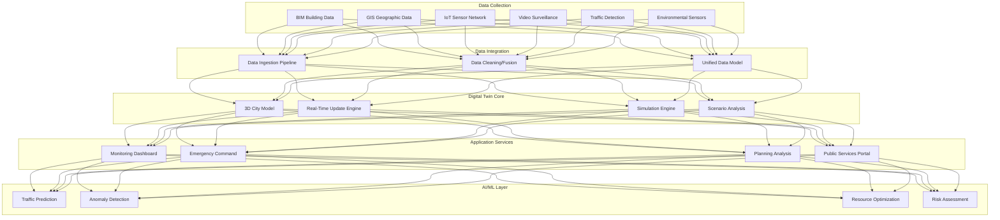

> **Production Environment Security Notice**
>
> This document contains operations and maintenance commands that can be executed directly. Before execution, please ensure: the current target cluster and Namespace are correct; you have sufficient RBAC permissions; the commands have been verified in a non-production environment. Command risk levels: Red (high risk, may cause data loss or service interruption), Yellow (medium risk, modifies cluster state but usually reversible), Green (low risk/read-only, information collection with no side effects).

# Digital Twin City Architecture Design — Alibaba Cloud Perspective

> **Applicable Version**: Kubernetes v1.29 - v1.33 | **Last Updated**: 2026-04-24
> **Author**: Alibaba Cloud Solution Architects | **Tags**: `#Digital_Twin_City` `#CIM` `#Smart_City` `#Alibaba_Cloud`

---

## Table of Contents

1. [Industry Background](#1-industry-background)
2. [Core Scenarios](#2-core-scenarios)
3. [Business Architecture](#3-business-architecture)
4. [Technical Architecture](#4-technical-architecture)
5. [AI/ML Components](#5-aiml-components)
6. [Security and Compliance](#6-security-and-compliance)
7. [Best Practices](#7-best-practices)
8. [Alibaba Cloud Component Mapping](#8-alibaba-cloud-component-mapping)

---

## 1. Industry Background

Digital Twin City integrates multi-source urban data (BIM, GIS, IoT, real-time video) to create virtual city models, enabling simulation, monitoring, analysis, and optimization of urban operations. The global digital twin city market is projected to reach $45.6 billion by 2030, growing at 23.5% CAGR.

### 1.1 Industry Pain Points

| Pain Point | Challenge | Architecture Impact |
|:---|:---|:---|
| Data Silos | Multiple government departments, no unified view | Data integration hub + API gateway |
| 3D Rendering | Real-time millions of buildings rendering | GPU cluster + spatial indexing |
| Real-Time Processing | Massive IoT stream processing | Stream computing + edge computing |
| Scalability | Supporting millions of sensors | Distributed architecture + message queue |
| Latency | Sub-second decision making for emergencies | Real-time database + edge nodes |

### 1.2 Core Scenarios

- **CIM Platform**: City Information Model integrating BIM/GIS/IoT data
- **Urban Planning Simulation**: Virtual city testing new infrastructure
- **Real-Time Monitoring**: Traffic, environment, public safety dashboards
- **Emergency Command**: Disaster response coordination and resource allocation
- **Unified Governance**: Cross-department city governance

---

## 2. Core Scenarios

### 2.1 CIM (City Information Model) Platform

Unified data model integrating:
- Building/infrastructure BIM data
- Geographic/street GIS data
- Real-time sensor IoT data
- Traffic/mobility data
- Environmental monitoring data

### 2.2 Urban Planning Simulation

Virtual testing of urban development scenarios:
- Population growth simulations
- Traffic flow optimization
- New infrastructure impact analysis
- Environmental impact assessment

### 2.3 Real-Time Emergency Response

Incident detection and resource coordination:
- Traffic accident detection
- Flood/disaster monitoring
- Public security event response
- Resource optimization during emergencies

### 2.4 Smart Governance

Cross-department collaborative management:
- Air quality monitoring
- Energy consumption optimization
- Public facility maintenance
- Citizen complaint routing

---

## 3. Business Architecture

### 3.1 Digital Twin City Platform Architecture



---

## 4. Technical Architecture

### 4.1 3D City Rendering with GPU

```yaml
# GPU-Accelerated 3D Rendering Deployment
apiVersion: apps/v1
kind: Deployment
metadata:
  name: digital-twin-renderer
  namespace: smart-city
spec:
  replicas: 3
  selector:
    matchLabels:
      app: digital-twin-renderer
  template:
    metadata:
      labels:
        app: digital-twin-renderer
    spec:
      nodeSelector:
        accelerator: nvidia-a100
      runtimeClassName: nvidia
      containers:
        - name: renderer
          image: registry.cn-hangzhou.aliyuncs.com/smart-city/twin-renderer:v1.0.0
          ports:
            - containerPort: 8080
          env:
            - name: CUDA_VISIBLE_DEVICES
              value: "0,1,2,3"
            - name: MAX_CONCURRENT_STREAMS
              value: "100"
            - name: RENDER_QUALITY
              value: "ultra"
          resources:
            requests:
              nvidia.com/gpu: 4
              memory: "32Gi"
              cpu: "8000m"
            limits:
              nvidia.com/gpu: 4
              memory: "32Gi"
              cpu: "8000m"
          volumeMounts:
            - name: bim-data
              mountPath: /data/bim
            - name: gis-data
              mountPath: /data/gis
            - name: cache
              mountPath: /cache
      volumes:
        - name: bim-data
          persistentVolumeClaim:
            claimName: bim-data-pvc
        - name: gis-data
          persistentVolumeClaim:
            claimName: gis-data-pvc
        - name: cache
          emptyDir:
            sizeLimit: 100Gi
```

### 4.2 Real-Time Data Fusion

```yaml
# CIM Data Fusion Service
apiVersion: apps/v1
kind: Deployment
metadata:
  name: cim-data-fusion
  namespace: smart-city
spec:
  replicas: 5
  selector:
    matchLabels:
      app: cim-data-fusion
  template:
    metadata:
      labels:
        app: cim-data-fusion
    spec:
      containers:
        - name: fusion-engine
          image: registry.cn-hangzhou.aliyuncs.com/smart-city/cim-fusion:v1.0.0
          ports:
            - containerPort: 8080
          env:
            - name: KAFKA_BROKERS
              value: "kafka-broker-0:9092,kafka-broker-1:9092,kafka-broker-2:9092"
            - name: TIMESERIES_DB
              value: "http://lindorm-tsdb:8080"
            - name: FUSION_WINDOW_MS
              value: "5000"
          resources:
            requests:
              memory: "8Gi"
              cpu: "4000m"
            limits:
              memory: "16Gi"
              cpu: "8000m"
          livenessProbe:
            httpGet:
              path: /health
              port: 8080
            initialDelaySeconds: 30
            periodSeconds: 10
          readinessProbe:
            httpGet:
              path: /ready
              port: 8080
            initialDelaySeconds: 10
            periodSeconds: 5
```

---

## 5. AI/ML Components

### 5.1 Traffic Flow Prediction

AI model predicting traffic congestion using historical data, weather, events, and real-time sensor data.

```python
class TrafficPredictionModel:
    def __init__(self, lookback_hours=24):
        self.lookback_hours = lookback_hours
        self.model = self.load_trained_model()
    
    def predict_congestion(self, current_state: dict) -> dict:
        features = self.extract_features(current_state)
        predictions = self.model.predict(features)
        
        return {
            "congestion_forecast_1h": predictions[0],
            "congestion_forecast_4h": predictions[1],
            "recommended_routes": self.optimize_routes(predictions),
            "confidence": self.get_confidence_score(predictions),
        }
    
    def optimize_routes(self, congestion_forecast):
        """Return optimal routes avoiding predicted congestion"""
        pass
```

### 5.2 Anomaly Detection

Detect unusual patterns indicating potential issues (pollution spike, traffic accident, infrastructure failure).

---

## 6. Security and Compliance

### 6.1 Regulations and Standards

- **GB 50007 Code for Design of Urban Rail Transit**: Engineering standards
- **GB 55011 Technical Code for Digital Platforms**: Data security standards
- **GDPR**: Personal data protection if EU citizens
- **ISO 27001**: Information security management

### 6.2 Data Protection

- Sensor data encryption in transit and at rest
- Access control by role and department
- Audit logging of all data access
- Data retention policies per regulation

---

## 7. Best Practices

- **Incremental Deployment**: Start with one district, gradually expand city-wide
- **Data Quality**: Establish data quality verification at ingestion
- **Real-Time SLA**: Monitor and maintain sub-second latency requirements
- **Scalability Testing**: Regularly test handling of 2-3x current data volume
- **Stakeholder Coordination**: Regular meetings with all government departments
- **User Training**: Comprehensive training for government operators

---

## 8. Alibaba Cloud Component Mapping

| Functional Domain | **Alibaba Cloud Cloud-Native Solution** |
|:---|:---|
| Container Platform | **ACK Pro + GPU** |
| Real-Time Computing | **Flink** |
| Time-Series Database | **Lindorm TSDB** |
| Big Data Processing | **MaxCompute** |
| 3D Rendering | **GPU Instance + NVIDIA CUDA** |
| IoT Platform | **IoT Platform** |
| Object Storage | **OSS** |
| API Gateway | **API Gateway** |
| Video Processing | **MPS (Media Processing Service)** |
| Monitoring | **ARMS** |
| Logging | **SLS** |
| Geospatial Database | **PolarDB with PostGIS** |

---

## Production Checklist

- [ ] BIM/GIS data import and validation complete
- [ ] Real-time data ingestion from all sensor networks operational
- [ ] 3D rendering performance benchmarking passed (< 1s latency)
- [ ] Data fusion accuracy > 98%
- [ ] AI/ML models validation completed
- [ ] Disaster recovery plan tested
- [ ] Multi-department access control configured
- [ ] 24/7 monitoring and alerting active

---

**Maintainers**: Alibaba Cloud Solution Architects Team | **License**: MIT

---

## Obsidian Related Documents

- topic-application-architecture MOC
- [[domain-20-application-patterns/topic-application-architecture/README.md|Topic Application Layer Architecture Design Best Practices]]

## See Also

- digital-government-architecture
- energy-power-architecture
- smart-campus
- smart-transportation

<!-- risk-assessed -->
