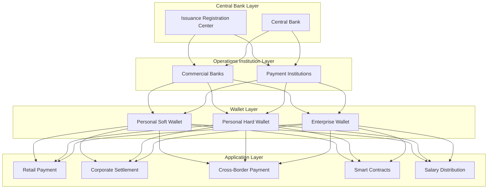
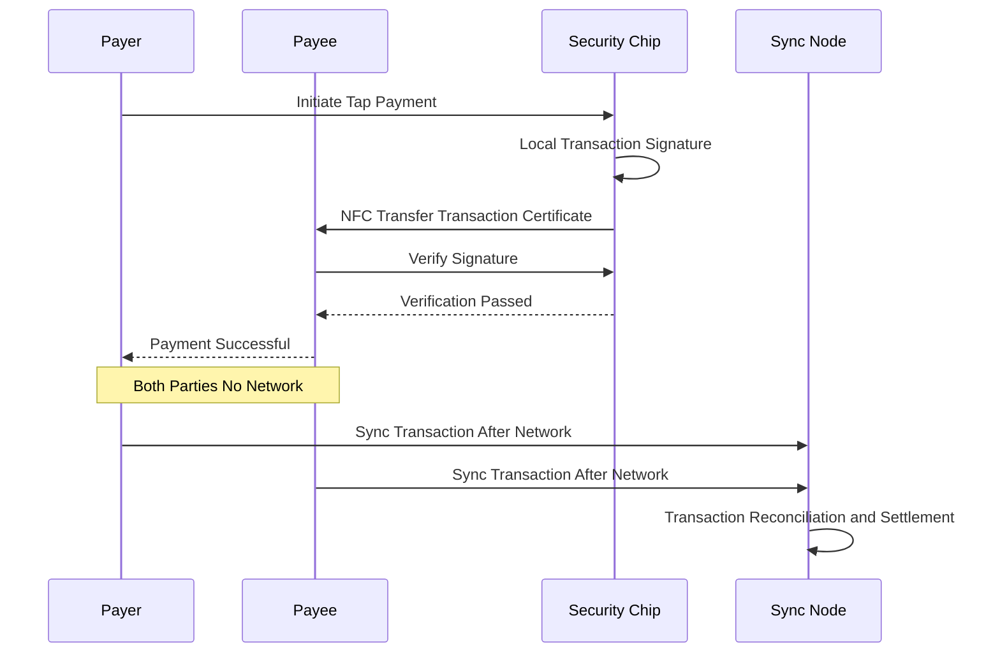
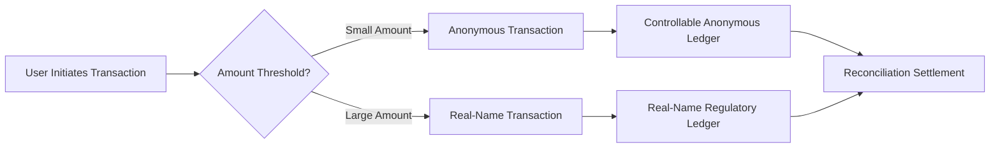

---title: Digital Yuan (e-CNY) Architecture Design — Alibaba Cloud Perspective
description: 'title: Digital Yuan Architecture Design'
summary: 'title: Digital Yuan Architecture Design'
category: general
tags:
- architecture
- best-practice
- redis
- statefulset
- operator
- wasm
tier: supporting
created: '2026-05-23'
last_updated: 2026-05
difficulty: intermediate
reading_level: intermediate
audience:
- All engineers
estimated_read_time: 15min
intent_queries:
- Digital Yuan Architecture Design — Alibaba Cloud Perspective
- How to implement Digital Yuan Architecture Design — Alibaba Cloud Perspective
- Kubernetes 20 application patterns best practices
trigger_keywords:
- Digital Yuan Architecture Design
- Alibaba Cloud Perspective
- application
- patterns
prerequisites:
- kubectl-basics
- prometheus-basics
- redis-basics
authors:
- name: Dillan Teagle
  role: contributor
source_path: /Users/teaglebuilt/github/teaglebuilt/knowledge/tree/application/architecture/ecny-cbdc.md
original_language: Chinese
---

> **Production Environment Security Notice**
>
> This document contains operations and maintenance commands that can be executed directly. Before execution, please ensure: the current target cluster and Namespace are correct; you have sufficient RBAC permissions; the commands have been verified in a non-production environment. Command risk levels: 🔴 High risk (may cause data loss or service interruption), 🟡 Medium risk (modifies cluster state but usually reversible), 🟢 Low risk/Read-only (information collection with no side effects).

title: Digital Yuan Architecture Design
description: '# Digital Yuan Architecture Design — Alibaba Cloud Perspective'
category: application-architecture
tags:
- k8s
- architecture
- industry
- redis
- [[StatefulSet|statefulset]]
- operator
- wasm
last_updated: 2026-05-18
difficulty: expert
reading_level: expert
audience:
- Financial technology architects
- Blockchain engineers
- Payment systems experts
estimated_read_time: 5min
intent_queries:
- Digital Yuan e-CNY [[Kubernetes|Kubernetes]] Architecture
- Central Bank Digital Currency CBDC Blockchain K8s
- Dual Offline Payment Trusted Hardware K8s
- Digital Yuan Smart Contracts Kubernetes
- Financial-Grade Kubernetes High Availability
trigger_keywords:
- Digital Yuan
- e-CNY
- CBDC
- Central Bank Digital Currency
- Blockchain
- Dual Offline Payment
- Smart Contracts
- National Cryptography Standards
- Alibaba Cloud
related_domains:
- domain-01-cluster-fundamentals
- domain-11-production-operations
- domain-03-networking-traffic
related_topics:
- 06-fintech-architecture
- 38-supply-chain-finance
- 25-quantitative-trading
k8s_versions:
- '1.28'
- '1.29'
- '1.30'
- '1.31'
- '1.32'
---

# Digital Yuan Architecture Design — Alibaba Cloud Perspective

> **Applicable Version**: Kubernetes v1.29 - v1.33 | **Last Updated**: 2026-04-24
> **Author**: Alibaba Cloud Solution Architects | **Tags**: `#Digital_Yuan` `#e-CNY` `#CBDC` `#Central_Bank_Digital_Currency` `#Alibaba_Cloud`

---

## Table of Contents

1. [Industry Background](#1-industry-background)
2. [Business Architecture](#2-business-architecture)
3. [Technology Architecture](#3-technology-architecture)
4. [Core Data Flow](#4-core-data-flow)
5. [Security and Compliance](#5-security-and-compliance)
6. [Observability](#6-observability)
7. [Alibaba Cloud Component Mapping](#7-alibaba-cloud-component-mapping)
8. [Production Checklist](#8-production-checklist)

---

## 1. Industry Background

### 1.1 Business Characteristics

Digital Yuan (e-CNY) is legal digital currency issued by China's central bank:

| Challenge | Description | Architecture Impact |
|:---|:---|:---|
| High-concurrent transactions | Billion-scale users high-frequency small-amount payments | Distributed architecture |
| Dual offline payment | Payment without network | Trusted hardware + local encryption |
| Controllable anonymity | Small-amount anonymous/large-amount traceable | Tiered identity |
| Smart contracts | Programmable currency | Contract security |
| Financial stability | M0 replacement without inflation | Quota control |

### 1.2 Core Scenarios

- **Personal Wallets**: Soft wallet/hard wallet management
- **Merchant Settlement**: QR code/tap-to-pay settlement
- **Corporate Business**: Enterprise wallet/salary distribution
- **Cross-Border Payments**: mBridge multi-central bank digital currency bridge
- **Smart Contracts**: Conditional payment/auto-splitting

---

## 2. Business Architecture

### 2.1 Digital Yuan Comprehensive Architecture



### 2.2 Dual Offline Payment Sequence



---

## 3. Technology Architecture

### 3.1 K8s Deployment

```yaml
# Digital Yuan Transaction Service StatefulSet
apiVersion: apps/v1
kind: StatefulSet
metadata:
  name: e-cny-transaction
  namespace: ecny
spec:
  serviceName: e-cny-transaction
  replicas: 10
  selector:
    matchLabels:
      app: e-cny-transaction
  template:
    metadata:
      labels:
        app: e-cny-transaction
    spec:
      affinity:
        podAntiAffinity:
          requiredDuringSchedulingIgnoredDuringExecution:
            - labelSelector:
                matchExpressions:
                  - key: app
                    operator: In
                    values: [e-cny-transaction]
              topologyKey: topology.kubernetes.io/zone
      containers:
        - name: transaction
          image: registry.cn-hangzhou.aliyuncs.com/ecny/transaction:v3.0.0
          ports:
            - containerPort: 8080
          env:
            - name: LEDGER_TYPE
              value: "hybrid-dlt"
            - name: MAX_TPS_PER_SHARD
              value: "100000"
            - name: OFFLINE_TX_ENABLED
              value: "true"
          resources:
            requests:
              memory: "8Gi"
              cpu: "4000m"
            limits:
              memory: "16Gi"
              cpu: "8000m"
          volumeMounts:
            - name: secure-keys
              mountPath: /etc/ecny/keys
              readOnly: true
      volumes:
        - name: secure-keys
          secret:
            secretName: ecny-master-keys
```

```yaml
# Smart Contract Engine Deployment
apiVersion: apps/v1
kind: Deployment
metadata:
  name: smart-contract-engine
  namespace: ecny
spec:
  replicas: 5
  selector:
    matchLabels:
      app: smart-contract-engine
  template:
    metadata:
      labels:
        app: smart-contract-engine
    spec:
      containers:
        - name: engine
          image: registry.cn-hangzhou.aliyuncs.com/ecny/contract-engine:v2.0.0
          ports:
            - containerPort: 8080
          env:
            - name: VM_TYPE
              value: "wasm"
            - name: GAS_LIMIT
              value: "1000000"
          resources:
            requests:
              memory: "4Gi"
              cpu: "2000m"
            limits:
              memory: "8Gi"
              cpu: "4000m"
```

---

## 4. Core Data Flow

### 4.1 Controllable Anonymous Transactions



---

## 5. Security and Compliance

- **National Cryptography Standards**: SM2/SM3/SM4 full chain
- **Controllable Anonymity**: Central bank regulatory traceability
- **Fund Safety**: 100% reserve requirement system
- **Anti-Money Laundering**: Large-transaction monitoring

---

## 6. Observability

- **Transaction TPS**: Peak 300,000+
- **Transaction Latency**: P99 < 100ms
- **System Availability**: 99.999%

---

## 7. Alibaba Cloud Component Mapping

| Functional Domain | **Alibaba Cloud Cloud-Native Solution** |
|:---|:---|
| Container Platform | **ACK Pro** |
| Database | **PolarDB + Lindorm** |
| Cache | **Redis Enterprise Edition** |
| Blockchain | **Ant Chain BaaS** |
| Security | **Cloud Shield + KMS + WAF** |
| Observability | **ARMS + SLS** |

---

## 8. Production Checklist

- [ ] National Cryptography Standards full chain verification
- [ ] Dual offline payment security testing
- [ ] Smart contract sandbox isolation
- [ ] Large-transaction monitoring rules
- [ ] Central bank regulatory interface testing
- [ ] Disaster recovery drill

---

**Maintainer**: Alibaba Cloud Solution Architects Team | **License**: MIT

---

## Obsidian Related Documentation

- topic-application-architecture KUDIG Database — Global MOC
- [[domain-20-application-patterns/topic-application-architecture/README.md|Topic Application Architecture Design Best Practices]]
- [[domain-20-application-patterns/topic-application-architecture/01-ecommerce-architecture.md|E-Commerce System Kubernetes Production Architecture Design]]
- [[domain-20-application-patterns/topic-application-architecture/02-mini-program-architecture.md|Mini Program Platform Architecture Design]]
- [[domain-20-application-patterns/topic-application-architecture/03-cms-architecture.md|Content Management System CMS Architecture Design]]
- [[domain-20-application-patterns/topic-application-architecture/04-im-rtc-architecture.md|Real-Time Communication IM/RTC Architecture Design]]
- [[domain-20-application-patterns/topic-application-architecture/05-online-education-architecture.md|Online Education Platform Kubernetes Production Architecture Design]]
- [[domain-20-application-patterns/topic-application-architecture/06-fintech-architecture.md|Financial Technology FinTech Kubernetes Production Architecture Design]]
- [[domain-20-application-patterns/topic-application-architecture/07-iot-platform-architecture.md|Internet of Things IoT Platform Architecture Design]]
- [[domain-20-application-patterns/topic-application-architecture/08-ai-ml-inference-architecture.md|AI/ML Inference Service Kubernetes Production Architecture Design]]
- [[domain-20-application-patterns/topic-application-architecture/09-gaming-backend-architecture.md|Game Backend Kubernetes Production Architecture Design]]
- [[domain-20-application-patterns/topic-application-architecture/10-social-media-architecture.md|Social Media Platform Kubernetes Production Architecture Design]]

## See Also

- 68-quantum-computing-cloud
- 69-6g-core-network
- 71-smart-tax
- 72-digital-twin-city

## Related

- topic-application-architecture MOC — Cross-reference


<!-- risk-assessed -->
