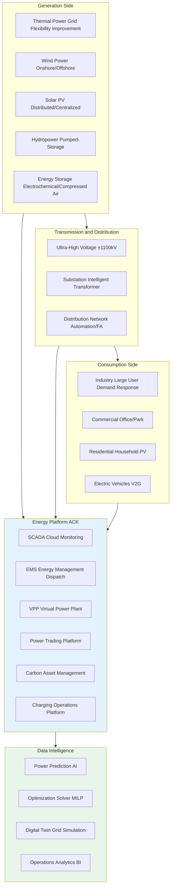
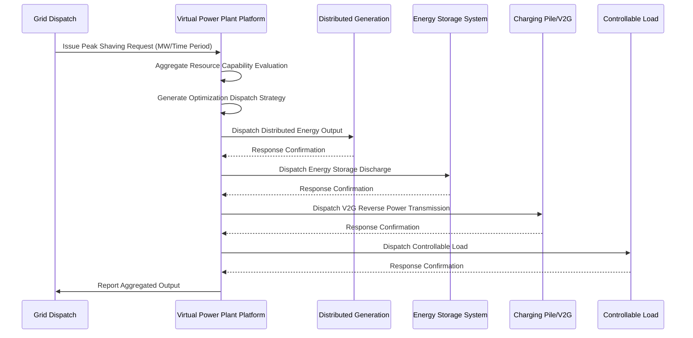
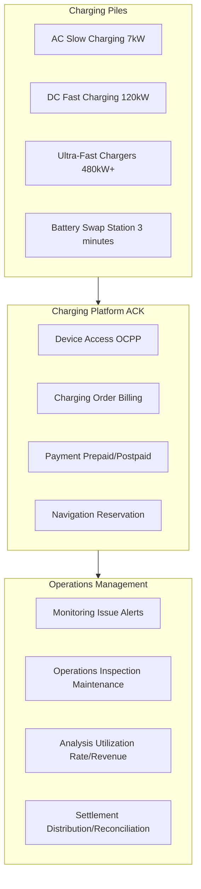
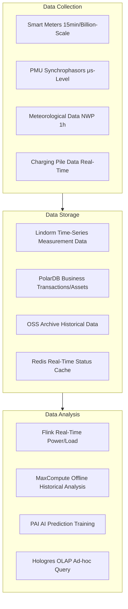

---title: Energy and Power Kubernetes Production Architecture Design (domain-20-application-patterns)
description: 'title: Energy and Power Kubernetes Production Architecture Design'
summary: 'title: Energy and Power Kubernetes Production Architecture Design'
category: general
tags:
- architecture
- best-practice
- flux
- redis
- mysql
- kafka
- hpa
- gateway
- operator
- gpu
tier: supporting
created: '2026-05-23'
last_updated: 2026-05
difficulty: intermediate
reading_level: intermediate
audience:
- All engineers
estimated_read_time: 15min
intent_queries:
- Energy and Power Kubernetes Production Architecture Design what is
- How Energy and Power Kubernetes Production Architecture Design
- Kubernetes 20 application patterns best practices
trigger_keywords:
- Energy and Power
- Kubernetes
- Production Architecture Design
- application
- patterns
prerequisites:
- kubectl-basics
- prometheus-basics
- kafka-basics
- redis-basics
- mysql-basics
- gpu-scheduling-basics
authors:
- name: Dillan Teagle
  role: contributor
source_path: /Users/teaglebuilt/github/teaglebuilt/knowledge/tree/application/architecture/energy-power-architecture.md
original_language: Chinese
---

> **Production Environment Security Reminder**
>
> This document contains operational commands that can be executed directly. Before execution, please confirm: whether the target cluster and namespace are correct; whether you have sufficient RBAC permissions; whether testing has been completed in non-production environments. Command risk levels are marked as: 🔴 High Risk (may cause data loss or service interruption), 🟡 Medium Risk (modifies cluster state but usually reversible), 🟢 Low Risk/Read-Only (information collection, no side effects).


title: Energy and Power [[Kubernetes|Kubernetes]] Production Architecture Design
description: '# Energy and Power Kubernetes Production Architecture Design'
category: application-architecture
tags:
- k8s
- architecture
- industry
- [[Flux|flux]]
- redis
- mysql
- kafka
- hpa
- gateway
- operator
last_updated: 2026-05-18
difficulty: advanced
reading_level: advanced
audience:
- Energy and Power Architects
- Electric Power System Engineers
- Charging Operations Platform Developers
- Alibaba Cloud Energy Solutions Architects
estimated_read_time: 5min
intent_queries:
- Energy and Power Kubernetes Cluster Deployment Architecture
- Virtual Power Plant VPP Scheduling Optimization System
- Renewable Energy Power Prediction AI Model
- Million-Scale Device Access for Charging Pile Operations Platform
- Electric Power Time-Series Database Lindorm Architecture
trigger_keywords:
- Energy and Power
- Smart Grid
- Virtual Power Plant
- Renewable Energy
- Charging Pile
- Carbon Assets
- Power Trading
- Dispatch Automation
- Renewable Energy Prediction
- Energy Storage
related_domains:
- domain-5-edge-computing
- domain-03-networking-traffic
- domain-9-security-compliance
- domain-12-observability-comprehensive
- domain-7-ai-ml-platform
related_topics:
- domain-20-application-patterns/topic-application-architecture/86-solid-state-battery
- domain-20-application-patterns/topic-application-architecture/52-smart-water
- domain-20-application-patterns/topic-application-architecture/72-digital-twin-city
k8s_versions:
- '1.28'
- '1.29'
- '1.30'
- '1.31'
- '1.32'
---

# Energy and Power Kubernetes Production Architecture Design

> **Applicable Scenarios**: Smart Grid / Renewable Energy Generation / Virtual Power Plant / Carbon Asset Management / Power Trading / Charging Pile Operations
> **Cloud Provider**: Alibaba Cloud ACK + Product Ecosystem (Power Monitoring System Security Protection Regulations / Grade 2 Compliance)
> **Applicable Versions**: Kubernetes v1.29 - v1.33
> **Last Updated**: 2026-05-18
> **Target Readers**: Energy Industry Architects, Electric Power System Engineers, Alibaba Cloud Solutions Architects

---

<!-- chunk: Table of Contents -->## Table of Contents

1. [Industry Overview](#1-industry-overview)
2. [Business Scenarios](#2-business-scenarios)
3. [Architecture Design](#3-architecture-design)
4. [Core Technology Stack](#4-core-technology-stack)
5. [K8s Deployment Solution](#5-k8s-deployment-solution)
6. [Data Architecture](#6-data-architecture)
7. [AI/ML Components](#7-aiml-components)
8. [Security and Compliance](#8-security-and-compliance)
9. [Best Practices](#9-best-practices)
10. [Anti-Patterns](#10-anti-patterns)
11. [Reference Resources](#11-reference-resources)

---

<!-- chunk: 1. Industry Overview -->## 1. Industry Overview

## 1.1 Industry Background

The energy and power industry is the lifeblood of the national economy, experiencing a profound transition from traditional fossil energy to clean energy. China's dual carbon goals (carbon peak by 2030, carbon neutrality by 2060) drive comprehensive upgrades in the power system: renewable energy installed capacity continues to grow (wind and solar exceed 1 billion kilowatts), ultra-high voltage transmission networks accelerate development, power market reforms deepen, and new formats such as virtual power plants, energy storage, and electric vehicles flourish. The informatization of the energy and power industry is evolving from traditional SCADA/EMS systems to cloud-native, big data, and AI-driven smart energy platforms.

Core informatization needs of energy and power platforms include: renewable energy power prediction (short-term 72 hours/ultra-short-term 4 hours), virtual power plant resource aggregation and optimization dispatch, electric power spot market trading (day-ahead/real-time dual markets), charging pile operations management (million-scale device access), carbon asset accounting and trading, distribution automation and self-healing fault response. These needs impose extreme requirements on computing resources (AI inference + optimization solvers), storage resources (billion-level electrical meter measurement points time-series data), and real-time performance (millisecond-level protection control). The energy industry faces strict regulatory compliance requirements: Power Monitoring System Security Protection Regulations (security segmentation/network dedicated/horizontal isolation/vertical authentication), Grade 2 Compliance, critical information infrastructure protection.

## 1.2 Industry Challenges

| Challenge | Description | Architecture Impact |
|:---|:---|:---|
| Renewable Energy Volatility | Wind and solar power output prediction errors large | AI prediction + energy storage dispatch + backup optimization |
| Peak-Valley Difference Expansion | Extreme weather/EV charging exacerbates peak-valley difference | Demand response + virtual power plant peak shaving |
| Massive Distributed Access | Million-scale distributed PV/energy storage grid connection | Edge computing + plug-and-play protocols |
| Power Grid Network Security | Power monitoring systems face nation-level cyber threats | Zero trust + security segmentation + defense in depth |
| Real-time Balance Requirements | Frequency stability requirement 50±0.2Hz | Millisecond-level AGC + safety automation devices |
| Power Market Liberalization | Spot market real-time clearing high complexity | High-concurrency trading engine + risk control |
| Massive Data Scale | Billion electrical meters 15-minute collection, PB-level time-series data | Lindorm time-series + data lake |
| Strict Compliance Regulations | Power monitoring safety + compliance + secret evaluation | Private cloud/physical isolation + national secret algorithms |

## 1.3 Market Structure

The Chinese energy and power industry is dominated by two central enterprises: State Grid and Southern Grid, covering 26 and 5 provinces respectively, with annual investment exceeding 500 billion yuan. Traditional power equipment enterprises like NARI, XJ Electric, and Pinggao Electric are the main forces of informatization construction. Cloud service providers like Alibaba Cloud, Huawei Cloud, and Tencent Cloud are leveraging cloud-native and AI capabilities to deepen energy industry involvement, providing smart grid solutions. Emerging enterprises are appearing in vertical segments such as virtual power plants, power trading, integrated energy services, and charging operations, including companies like Tellcharge, Star Charging, GNRL, and Longshine.

---

<!-- chunk: 2. Business Scenarios -->## 2. Business Scenarios

## 2.1 Smart Grid Dispatch

Grid dispatch is the core function of the power system, responsible for maintaining real-time balance between generation and consumption. Dispatch systems include SCADA (data acquisition and supervisory control), EMS (energy management system), DMS (distribution management system), and WAMS (wide-area measurement system). Next-generation dispatch systems need to support economic dispatch, security validation, automatic generation control (AGC), and automatic voltage control (AVC) under large-scale renewable energy integration scenarios. The real-time requirements of dispatch systems are extremely high: AGC control cycle is 4 seconds, protection action response time < 100ms. The system needs to support multi-level dispatch coordination (national dispatch-regional dispatch-provincial dispatch-district dispatch-county dispatch).

## 2.2 Renewable Energy Generation Monitoring

Remote monitoring and power prediction for centralized and distributed renewable energy stations. Core functions include: equipment status monitoring (wind turbine/inverter real-time data collection), power prediction (based on NWP numerical weather forecast + AI model), health management (equipment issue warnings and diagnostics), production management (generation volume statistics/reports/benchmarking). Renewable energy stations are typically located in remote areas and transmit data to control centers via dedicated lines or 5G networks. Edge compute nodes deployed on-site enable local monitoring and autonomous operation when network disconnected.

## 2.3 Virtual Power Plant (VPP)

Virtual power plants aggregate distributed power sources, energy storage, and controllable loads through communication technology to participate in grid dispatch and power markets as a unified entity. VPP platform core functions include: resource registration and capability evaluation, real-time status monitoring and aggregated capacity calculation, optimization dispatch strategy generation (economic optimality/response speed optimality), command delivery and execution tracking, revenue settlement and distribution. VPP coordinates tens of thousands to hundreds of thousands of distributed resources, placing extreme demands on platform concurrent processing capability and optimization solving capability.

## 2.4 Charging Pile Operations

Operations management platform for electric vehicle charging piles. China's charging pile holdings have exceeded 8 million, including AC slow charging, DC fast charging, ultra-fast chargers (480kW+), and battery swap stations. Core functions include: device access and management (OCPP/custom protocol adaptation), charging order management (start/stop/billing/payment), intelligent navigation and reservation (find charger/queue/reservation), operations monitoring (device issues/utilization rate/revenue analysis), interoperability (integration with OEMs/map platforms). Charging pile platforms need to support million-scale device concurrent connections and order floods during peak times.

## 2.5 Carbon Asset Management

Enterprise carbon emission accounting, carbon quota management, and carbon trading. Core functions include: emission accounting (Scope 1/2/3 greenhouse gas emission calculation), emission reduction project management (CCER/green electricity/green certificates), carbon inventory (annual carbon emission verification), carbon target management (carbon peak/carbon neutrality pathway planning), carbon market trading (CEA quota trading/CCER offset). Carbon asset management platforms need to integrate with enterprise energy management systems and production management systems to automatically collect energy consumption data and calculate carbon emissions.

---

<!-- chunk: 3. Architecture Design -->## 3. Architecture Design

## 3.1 Energy and Power Comprehensive Architecture



## 3.2 Virtual Power Plant Dispatch Sequence



## 3.3 Charging Pile Operations Platform



---

<!-- chunk: 4. Core Technology Stack -->## 4. Core Technology Stack

| Category | Open Source | Alibaba Cloud Solution | Description |
|:---|:---|:---|:---|
| Time-Series Database | InfluxDB, TDengine | Lindorm Time-Series Engine | Billion-scale Measurement Points High-Frequency Collection |
| Real-Time Computing | Flink, Kafka Streams | Real-Time Computing Flink Edition | Power/Load Real-Time Computation |
| Offline Computing | Spark, Hive | MaxCompute | Historical Data Analysis |
| AI Prediction | Prophet, Transformer | PAI | Power/Load Prediction |
| Optimization Solver | Pyomo, Gurobi | E-HPC | MILP Dispatch Optimization |
| Edge Computing | [[KubeEdge|KubeEdge]], [[OpenYurt|OpenYurt]] | ACK@Edge | Station/Substation Edge |
| IoT Access | EMQX, Mosquitto | Alibaba Cloud IoT Platform | Device Protocol Adaptation |
| Protocol Conversion | IEC 61850, IEC 104, Modbus | Custom Protocol Gateway | Power Equipment Communication |
| Digital Twin | Unity, Cesium | DataV + 3D Visualization | Grid Comprehensive View |
| Blockchain | Fabric, FISCO BCOS | Ant Blockchain BaaS | Carbon Trading Attestation |
| Container Platform | K8s | ACK Private Edition/Pro | Secure Compliant Deployment |

---

<!-- chunk: 5. K8s Deployment Solution -->## 5. K8s Deployment Solution

## 5.1 SCADA Data Collector

```yaml
apiVersion: apps/v1
kind: Deployment
metadata:
  name: scada-data-collector
  namespace: energy-platform
spec:
  replicas: 5
  selector:
    matchLabels:
      app: scada-collector
  template:
    metadata:
      labels:
        app: scada-collector
    spec:
      affinity:
        podAntiAffinity:
          preferredDuringSchedulingIgnoredDuringExecution:
            - weight: 100
              podAffinityTerm:
                labelSelector:
                  matchExpressions:
                    - key: app
                      operator: In
                      values:
                        - scada-collector
                topologyKey: kubernetes.io/hostname
      containers:
        - name: collector
          image: registry.cn-hangzhou.aliyuncs.com/energy/scada-collector:v1.0
          ports:
            - containerPort: 8080
            - containerPort: 2404
              name: iec104
          env:
            - name: PROTOCOL_ADAPTERS
              value: "iec104,modbus,mqtt"
            - name: LINDORM_URL
              valueFrom:
                secretKeyRef:
                  name: energy-db-secret
                  key: lindorm-url
            - name: POINTS_BATCH_SIZE
              value: "5000"
            - name: WRITE_INTERVAL_MS
              value: "1000"
          resources:
            requests:
              cpu: "2"
              memory: "4Gi"
            limits:
              cpu: "8"
              memory: "16Gi"
```

## 5.2 Power Prediction GPU Service

```yaml
apiVersion: apps/v1
kind: Deployment
metadata:
  name: power-forecast-ai
  namespace: energy-platform
spec:
  replicas: 2
  selector:
    matchLabels:
      app: power-forecast
  template:
    metadata:
      labels:
        app: power-forecast
    spec:
      nodeSelector:
        node-type: gpu
      tolerations:
        - key: nvidia.com/gpu
          operator: Exists
          effect: NoSchedule
      containers:
        - name: forecast
          image: registry.cn-hangzhou.aliyuncs.com/energy/power-forecast:v2.0
          ports:
            - containerPort: 8080
          env:
            - name: MODEL_PATH
              value: "/models/wind-power-forecast-v3"
            - name: FORECAST_HORIZON
              value: "72"
            - name: RESOLUTION
              value: "15min"
            - name: LINDORM_URL
              valueFrom:
                secretKeyRef:
                  name: energy-db-secret
                  key: lindorm-url
          resources:
            requests:
              cpu: "4"
              memory: "16Gi"
              nvidia.com/gpu: "1"
            limits:
              cpu: "16"
              memory: "64Gi"
              nvidia.com/gpu: "1"
          volumeMounts:
            - name: model-storage
              mountPath: /models
      volumes:
        - name: model-storage
          persistentVolumeClaim:
            claimName: forecast-model-pvc
```

## 5.3 Charging Pile Device Access

```yaml
apiVersion: apps/v1
kind: Deployment
metadata:
  name: charge-station-gateway
  namespace: energy-platform
spec:
  replicas: 10
  selector:
    matchLabels:
      app: charge-gateway
  template:
    metadata:
      labels:
        app: charge-gateway
    spec:
      containers:
        - name: gateway
          image: registry.cn-hangzhou.aliyuncs.com/energy/charge-gateway:v3.0.0
          ports:
            - containerPort: 8080
            - containerPort: 1883
              name: mqtt
          env:
            - name: PROTOCOL
              value: "ocpp2.0"
            - name: MAX_DEVICES
              value: "100000"
            - name: MQTT_BROKER
              value: "mqtt-broker:1883"
            - name: DB_URL
              valueFrom:
                secretKeyRef:
                  name: energy-db-secret
                  key: polardb-url
          resources:
            requests:
              cpu: "2"
              memory: "4Gi"
            limits:
              cpu: "4"
              memory: "8Gi"
```

---

<!-- chunk: 6. Data Architecture -->## 6. Data Architecture

## 6.1 Data Layering



## 6.2 Storage Strategy

| Data Type | Storage Solution | Retention Policy | Write Frequency | Data Volume |
|:---|:---|:---|:---|:---|
| Meter Collection | Lindorm Time-Series | 3 years hot + 7 years cold | 15 minutes | Billion-scale measurement points |
| PMU Phasors | Lindorm Time-Series | 1 month hot + 1 year cold | Millisecond-level | TB/day |
| Weather Forecast | PolarDB + OSS | 1 year | 1 hour | GB/day |
| Transaction Data | PolarDB MySQL | Permanent | Second-level | GB/day |
| Charging Pile Data | Lindorm Time-Series | 3 years | Second-level | TB/month |
| Carbon Emission Data | PolarDB MySQL | Permanent | Daily-level | GB Scale |

---

<!-- chunk: 7. AI/ML Components -->## 7. AI/ML Components

## 7.1 AI Application Matrix

| AI Scenario | Model/Algorithm | Input | Output | Description |
|:---|:---|:---|:---|:---|
| Wind Power Prediction | Transformer + CNN | NWP + Historical Power | 72h Power Curve | Accuracy > 85% |
| Solar Power Prediction | LSTM + Attention | Irradiance + Cloud Map | 72h Power Curve | Accuracy > 90% |
| Load Prediction | DeepAR + Prophet | Historical Load + Weather | 96 Point Load Curve | Accuracy > 95% |
| VPP Optimization Dispatch | MILP Solver | Resource State + Constraints | Dispatch Plan | Minute-Level Solving |
| Equipment Fault Prediction | LSTM Anomaly Detection | Vibration/Temperature/Current | Issue Warning | 24h Advance |
| Line Loss Analysis | XGBoost | Measurement Data | Line Loss Rate/Anomaly | Monthly Analysis |
| Carbon Emission Accounting | Rule Engine + ML | Energy Consumption Data | Carbon Emissions | Real-Time Accounting |

---

<!-- chunk: 8. Security and Compliance -->## 8. Security and Compliance

## 8.1 Security Segmentation Architecture

Power monitoring systems are divided into four security zones according to the principles of "security segmentation, dedicated network, horizontal isolation, vertical authentication":

| Security Zone | Function | Network Requirements | Deployment Solution |
|:---|:---|:---|:---|
| Zone I (Control Zone) | Real-Time Control/Protection | Physical Isolation | Private Cloud/Bare Metal |
| Zone II (Non-Control Zone) | Dispatch Management/Monitoring | Logical Isolation | Private Cloud/ACK Private Edition |
| Zone III (Management Zone) | Production Management/OA | Air Gap Isolation | ACK Pro |
| Zone IV (Information Zone) | External Services/Internet | Firewall Isolation | ACK Pro + WAF |

## 8.2 Compliance Framework

- **Power Monitoring System Security Protection Regulations**: Security segmentation/Dedicated network/Horizontal isolation/Vertical authentication
- **Grade 2 Compliance**: Critical information infrastructure protection for power systems
- **Critical Information Infrastructure Protection Regulations**: Power CII security protection
- **National Secret Algorithm Compliance**: SM2/SM3/SM4 cryptographic algorithm application
- **Data Security Law**: Power data classification and management

---

<!-- chunk: 9. Best Practices -->## 9. Best Practices

- **Prediction Accuracy Assurance**: Wind forecast accuracy > 85%, solar > 90%, improve accuracy through multi-model ensemble learning
- **Dispatch Real-Time Performance**: VPP dispatch command end-to-end latency < 100ms, use Redis cache for real-time resource state
- **Edge Autonomy**: Substation/field edge nodes operate independently for 24 hours after network disconnection, ensuring basic monitoring and control functions
- **Data Quality**: Establish measurement data quality evaluation system, automatically identify bad data (communication interruption/sensor drift/data jumps)
- **Elastic Scaling**: Compute elasticity for extreme weather and sudden events scenarios, use HPA + prewarming strategy to handle compute floods
- **Carbon Accounting Automation**: Connect to energy consumption data to automatically calculate carbon emissions, support carbon inventory and carbon trading data reporting

---

<!-- chunk: 10. Anti-Patterns -->## 10. Anti-Patterns

## 10.1 Security Zone Violation

Deploying production control zones (I/II) and management information zones (III/IV) on the same network plane.

**Solution**: Strictly enforce security segmentation principles. Deploy zones I/II in private cloud or physical machine rooms, zones III/IV in ACK Pro, with physical air gap isolation between different zones.

## 10.2 Edge Without Autonomy

Edge nodes completely depend on cloud, losing monitoring capability at substations/stations when network disconnects.

**Solution**: Deploy ACK@Edge on edge nodes. Execute critical monitoring and control logic locally. Automatically sync data to cloud when network recovers.

## 10.3 Ignoring Protocol Compatibility

Only support MQTT protocol for device access, ignoring widely-used IEC 61850/IEC 104/Modbus protocols in the power industry.

**Solution**: Deploy protocol adaptation gateway supporting IEC 61850 (substations), IEC 104 (remote communication), Modbus (devices), MQTT (IoT), and other power communication protocols.

---

<!-- chunk: 11. Reference Resources -->## 11. Reference Resources

## 11.1 Alibaba Cloud Component Mapping

| Functional Domain | Alibaba Cloud Solution | Description |
|:---|:---|:---|
| Container Platform | **ACK Private Edition / ACK Pro** | Secure Segmented Deployment |
| Edge Computing | **ACK@Edge** | Substation/Field Edge Nodes |
| Time-Series Database | **Lindorm** | Billion-Scale Measurement Time-Series Data |
| Real-Time Computing | **Flink** | Power/Load Real-Time Computation |
| Offline Computing | **MaxCompute** | Historical Data Analysis |
| AI Platform | **PAI** | Power Prediction Model Training and Inference |
| IoT Platform | **Alibaba Cloud IoT** | Device Access Protocol Adaptation |
| Digital Twin | **DataV + 3D** | Grid Comprehensive Visualization |
| Object Storage | **OSS** | Historical Data Archive |
| Blockchain | **Ant Blockchain BaaS** | Carbon Trading/Green Certificate Attestation |
| Observability | **ARMS + SLS** | Full-Link Monitoring Audit |
| Cryptography Service | **Alibaba Cloud KMS + HSM** | National Secret Algorithms/Key Management |

## 11.2 Production Checklist

- [ ] Renewable energy prediction model accuracy verification (wind > 85%, solar > 90%)
- [ ] Virtual power plant resource aggregation and dispatch end-to-end testing
- [ ] Power grid safety stability constraint verification
- [ ] Edge measurement and control real-time performance < 100ms verification
- [ ] Power monitoring system Grade 2 compliance audit
- [ ] Security zone air gap isolation verification
- [ ] Charging pile device access stress testing (100k-level concurrency)
- [ ] Carbon emission accounting accuracy verification
- [ ] Edge node network disconnection 24h autonomous operation testing
- [ ] National secret algorithm compliance verification

---

**Maintainers**: Alibaba Cloud Solutions Architecture Team | **License**: MIT

---

<!-- chunk: Obsidian Related Documents -->## Obsidian Related Documents

- topic-application-architecture MOC
- [[domain-20-application-patterns/topic-application-architecture/README.md|Topic Application Layer Architecture Design Best Practices]]
- [[domain-20-application-patterns/topic-application-architecture/01-ecommerce-architecture.md|E-Commerce System Kubernetes Production Architecture Design]]
- [[domain-20-application-patterns/topic-application-architecture/02-mini-program-architecture.md|Mini Program Platform Architecture Design]]
- [[domain-20-application-patterns/topic-application-architecture/03-cms-architecture.md|Content Management System CMS Architecture Design]]
- [[domain-20-application-patterns/topic-application-architecture/04-im-rtc-architecture.md|Real-Time Communication IM/RTC Architecture Design]]
- [[domain-20-application-patterns/topic-application-architecture/05-online-education-architecture.md|Online Education Platform Kubernetes Production Architecture Design]]
- [[domain-20-application-patterns/topic-application-architecture/06-fintech-architecture.md|FinTech Kubernetes Production Architecture Design]]
- [[domain-20-application-patterns/topic-application-architecture/07-iot-platform-architecture.md|IoT Platform Architecture Design]]
- [[domain-20-application-patterns/topic-application-architecture/08-ai-ml-inference-architecture.md|AI/ML Inference Service Kubernetes Production Architecture Design]]
- [[domain-20-application-patterns/topic-application-architecture/09-gaming-backend-architecture.md|Game Backend Kubernetes Production Architecture Design]]
- [[domain-20-application-patterns/topic-application-architecture/10-social-media-architecture.md|Social Media Platform Kubernetes Production Architecture Design]]

## See Also

- 13-digital-government-architecture
- 14-smart-healthcare-architecture
- 16-video-shortform-architecture
- 17-saas-multitenant-architecture


<!-- risk-assessed -->
