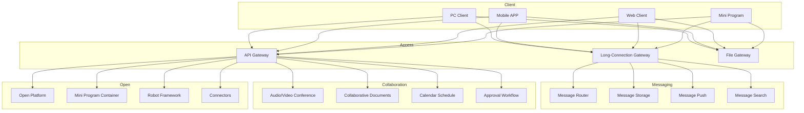
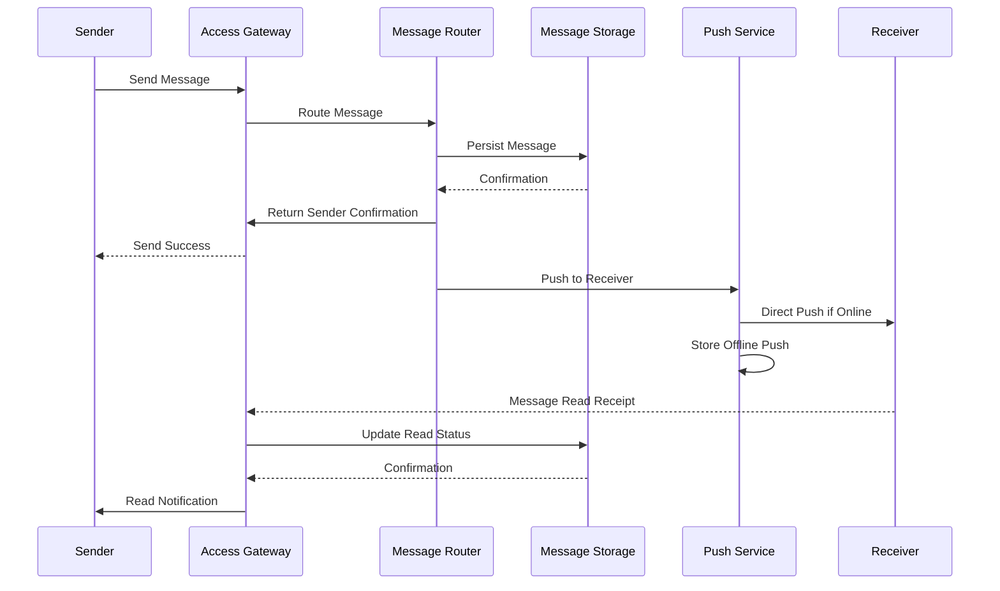
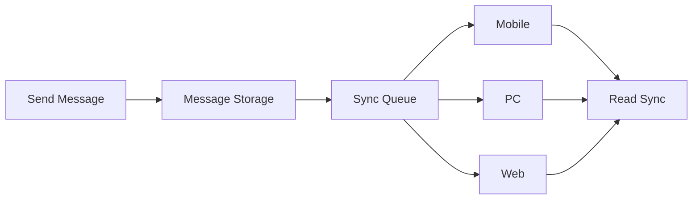

---title: Enterprise Instant Messaging Architecture Design - Alibaba Cloud Perspective
description: 'title: Enterprise Instant Messaging Architecture Design'
summary: 'title: Enterprise Instant Messaging Architecture Design'
category: general
tags:
- architecture
- best-practice
- redis
- statefulset
- gateway
- rag
tier: supporting
created: '2026-05-23'
last_updated: 2026-05
difficulty: intermediate
reading_level: intermediate
audience:
- All engineers
estimated_read_time: 15min
intent_queries:
- Enterprise Instant Messaging Architecture Design - Alibaba Cloud Perspective what is
- How Enterprise Instant Messaging Architecture Design - Alibaba Cloud Perspective
- Kubernetes 20 application patterns best practices
trigger_keywords:
- Enterprise Instant Messaging Architecture Design
- Alibaba Cloud Perspective
- application
- patterns
prerequisites:
- kubectl-basics
- prometheus-basics
- redis-basics
authors:
- name: Dillan Teagle
  role: contributor
source_path: /Users/teaglebuilt/github/teaglebuilt/knowledge/tree/application/architecture/enterprise-im.md
original_language: Chinese
---

> **Production Environment Security Reminder**
>
> This document contains operational commands that can be executed directly. Before execution, please confirm: whether the target cluster and namespace are correct; whether you have sufficient RBAC permissions; whether testing has been completed in non-production environments. Command risk levels are marked as: 🔴 High Risk (may cause data loss or service interruption), 🟡 Medium Risk (modifies cluster state but usually reversible), 🟢 Low Risk/Read-Only (information collection, no side effects).


title: Enterprise Instant Messaging Architecture Design
description: '# Enterprise Instant Messaging Architecture Design - Alibaba Cloud Perspective'
category: application-architecture
tags:
- k8s
- architecture
- industry
- redis
- [[StatefulSet|statefulset]]
- gateway
- rag
last_updated: '2026-05-18'
difficulty: advanced
reading_level: advanced
audience:
- Collaborative Office Architects
- Message System Developers
- Cloud-Native Engineers
- Enterprise Security Engineers
estimated_read_time: 5min
intent_queries:
- Enterprise IM Instant Messaging System Architecture Design
- Long-Connection Gateway Socket Cluster K8s Deployment
- Reliable Message Transmission System Design
- Enterprise IM Multi-Device Message Sync Solution
- Enterprise-Level IM Security and Compliance
trigger_keywords:
- Enterprise IM
- Instant Messaging
- Long-Connection Gateway
- Message Sync
- Collaborative Office
- DingTalk
- WebSocket
- Message Push
- Read/Unread Status
- End-to-End Encryption
related_domains:
- domain-01-cluster-fundamentals
- domain-03-networking-traffic
- domain-7-observability
- domain-8-storage
related_topics:
- domain-20-application-patterns/topic-application-architecture/17-saas-multitenant-architecture
- domain-20-application-patterns/topic-application-architecture/11-smart-retail-architecture
- domain-02-workloads-applications/topic-functions/04-high-concurrency-system
- domain-02-workloads-applications/topic-functions/10-message-queue
k8s_versions:
- '1.28'
- '1.29'
- '1.30'
- '1.31'
- '1.32'
---

# Enterprise Instant Messaging Architecture Design - Alibaba Cloud Perspective

> **Applicable Versions**: Kubernetes v1.29 - v1.33 | **Last Updated**: 2026-04-24
> **Author**: Alibaba Cloud Solutions Architect | **Tags**: `#Enterprise IM` `#Collaborative Office` `#DingTalk` `#Alibaba Cloud`

---

## Table of Contents

1. [Industry Background](#1-industry-background)
2. [Business Architecture](#2-business-architecture)
3. [Technical Architecture](#3-technical-architecture)
4. [Core Data Flow](#4-core-data-flow)
5. [Security and Compliance](#5-security-and-compliance)
6. [Observability](#6-observability)
7. [Alibaba Cloud Component Mapping](#7-alibaba-cloud-component-mapping)
8. [Production Checklist](#8-production-checklist)

---

## 1. Industry Background

### 1.1 Business Characteristics

Enterprise IM is core digital office infrastructure requiring high availability, strong security, and rich integration capabilities:

| Challenge | Description | Architecture Impact |
|:---|:---|:---|
| Massive Concurrency | Millions of simultaneous online users | Long-connection gateway + message queue |
| Message Reliability | Messages must be delivered without loss | Message persistence + retry mechanism |
| Multi-Device Sync | PC/Phone/Tablet message synchronization | Message sync protocol |
| Data Security | Enterprise sensitive information protection | End-to-end encryption + audit |
| Application Integration | Attendance/Approval/Calendar/Documents | Open platform + mini programs |

### 1.2 Core Scenarios

- **Instant Messaging**: Single chat/group chat/read/unread status
- **Audio/Video Conference**: Multi-person conference/screen sharing/recording
- **Collaborative Documents**: Multi-person real-time editing
- **Approval Workflow**: Custom approval processes
- **Open Platform**: Third-party application integration

---

## 2. Business Architecture

### 2.1 Enterprise IM Comprehensive Architecture



### 2.2 Message Send/Receive Sequence



---

## 3. Technical Architecture

### 3.1 K8s Deployment

```yaml
# Long-Connection Gateway StatefulSet
apiVersion: apps/v1
kind: StatefulSet
metadata:
  name: im-gateway
  namespace: enterprise-im
spec:
  serviceName: im-gateway
  replicas: 10
  selector:
    matchLabels:
      app: im-gateway
  template:
    metadata:
      labels:
        app: im-gateway
    spec:
      hostNetwork: true
      containers:
        - name: gateway
          image: registry.cn-hangzhou.aliyuncs.com/eim/gateway:v5.0.0
          ports:
            - containerPort: 8080
              name: http
            - containerPort: 8883
              name: websocket-tls
          env:
            - name: MAX_CONNECTIONS_PER_POD
              value: "100000"
            - name: HEARTBEAT_INTERVAL_SECONDS
              value: "30"
          resources:
            requests:
              memory: "4Gi"
              cpu: "2000m"
            limits:
              memory: "8Gi"
              cpu: "4000m"
```

```yaml
# Message Storage StatefulSet
apiVersion: apps/v1
kind: StatefulSet
metadata:
  name: message-store
  namespace: enterprise-im
spec:
  serviceName: message-store
  replicas: 5
  selector:
    matchLabels:
      app: message-store
  template:
    metadata:
      labels:
        app: message-store
    spec:
      containers:
        - name: store
          image: registry.cn-hangzhou.aliyuncs.com/eim/message-store:v4.2.0
          ports:
            - containerPort: 8080
          env:
            - name: STORAGE_BACKEND
              value: "lindorm"
            - name: RETENTION_DAYS
              value: "365"
          resources:
            requests:
              memory: "8Gi"
              cpu: "4000m"
            limits:
              memory: "16Gi"
              cpu: "8000m"
          volumeMounts:
            - name: message-data
              mountPath: /data
  volumeClaimTemplates:
    - metadata:
        name: message-data
      spec:
        accessModes: ["ReadWriteOnce"]
        storageClassName: alicloud-disk-ssd
        resources:
          requests:
            storage: 1Ti
```

---

## 4. Core Data Flow

### 4.1 Multi-Device Message Sync



---

## 5. Security and Compliance

- **End-to-End Encryption**: Message content encryption
- **Data Sovereignty**: Enterprise data local storage
- **Audit Compliance**: Message audit and compliance archive
- **Grade 2 Compliance**: Enterprise communication security

---

## 6. Observability

- **Message Delivery Rate**: > 99.99%
- **Message Latency**: P99 < 200ms
- **Online Status**: Real-Time Sync < 1s

---

## 7. Alibaba Cloud Component Mapping

| Functional Domain | **Alibaba Cloud Cloud-Native Solution** |
|:---|:---|
| Container Platform | **ACK Pro** |
| Long-Connection | **Alibaba Cloud IoT Platform / Custom Gateway** |
| Database | **PolarDB + Lindorm** |
| Cache | **Redis Enterprise Edition** |
| Message Queue | **RocketMQ** |
| RTC | **Alibaba Cloud RTC** |
| Object Storage | **OSS** |
| Observability | **ARMS + SLS** |

---

## 8. Production Checklist

- [ ] Long-connection gateway million-level concurrency stress test
- [ ] Message non-loss verification
- [ ] Multi-device message sync consistency
- [ ] End-to-end encryption performance testing
- [ ] Grade 2 compliance audit

---

**Maintainers**: Alibaba Cloud Solutions Architecture Team | **License**: MIT

---

## Obsidian Related Documents

- topic-application-architecture MOC
- [[domain-20-application-patterns/topic-application-architecture/README.md|Topic Application Layer Architecture Design Best Practices]]
- [[domain-20-application-patterns/topic-application-architecture/01-ecommerce-architecture.md|E-Commerce System Kubernetes Production Architecture Design]]
- [[domain-20-application-patterns/topic-application-architecture/02-mini-program-architecture.md|Mini Program Platform Architecture Design]]
- [[domain-20-application-patterns/topic-application-architecture/03-cms-architecture.md|Content Management System CMS Architecture Design]]
- [[domain-20-application-patterns/topic-application-architecture/04-im-rtc-architecture.md|Real-Time Communication IM/RTC Architecture Design]]
- [[domain-20-application-patterns/topic-application-architecture/05-online-education-architecture.md|Online Education Platform Kubernetes Production Architecture Design]]
- [[domain-20-application-patterns/topic-application-architecture/06-fintech-architecture.md|FinTech Kubernetes Production Architecture Design]]
- [[domain-20-application-patterns/topic-application-architecture/07-iot-platform-architecture.md|IoT Platform Architecture Design]]
- [[domain-20-application-patterns/topic-application-architecture/08-ai-ml-inference-architecture.md|AI/ML Inference Service Kubernetes Production Architecture Design]]
- [[domain-20-application-patterns/topic-application-architecture/09-gaming-backend-architecture.md|Game Backend Kubernetes Production Architecture Design]]
- [[domain-20-application-patterns/topic-application-architecture/10-social-media-architecture.md|Social Media Platform Kubernetes Production Architecture Design]]

## See Also

- 41-beauty-ecommerce
- 42-secondhand-circular
- 44-martech-adtech
- 45-smart-port-shipping


<!-- risk-assessed -->
