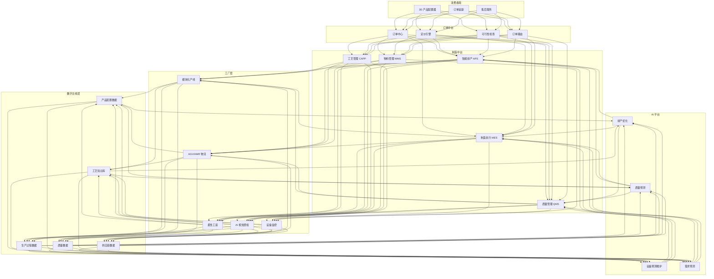
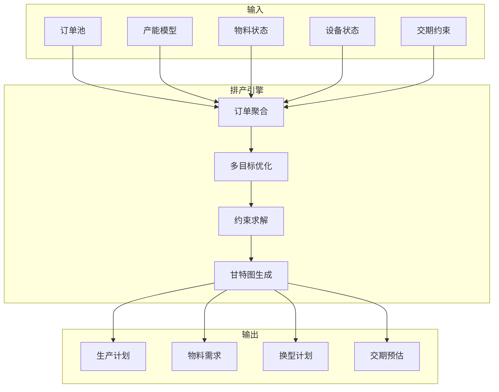

---title: 柔性制造架构设计 — 阿里云视角
description: 'title: 柔性制造架构设计'
summary: 'title: 柔性制造架构设计'
category: general
tags:
- architecture
- best-practice
- scheduler
- daemonset
- gateway
- operator
- gpu
- nvidia
tier: supporting
created: '2026-05-23'
last_updated: 2026-05
difficulty: intermediate
reading_level: intermediate
audience:
- 所有工程师
estimated_read_time: 25min
intent_queries:
- 柔性制造架构设计 — 阿里云视角 是什么
- 如何 柔性制造架构设计 — 阿里云视角
- Kubernetes 20 application patterns 最佳实践
trigger_keywords:
- 柔性制造架构设计
- 阿里云视角
- application
- patterns
prerequisites:
- kubectl-basics
- prometheus-basics
- gpu-scheduling-basics
authors:
- name: Dillan Teagle
  role: contributor

---

> **生产环境安全提示**
>
> 本文档包含可直接执行的运维命令。执行前请确认：当前目标集群与 Namespace 是否正确；是否具备足够的 RBAC 权限；是否已在非生产环境验证。命令风险等级标注：🔴 高风险（可能造成数据丢失或服务中断）、🟡 中风险（会修改集群状态，但通常可回滚）、🟢 低风险/只读（信息收集，无副作用）。


title: 柔性制造架构设计
description: '# 柔性制造架构设计 — 阿里云视角'
category: application-architecture
tags:
- k8s
- architecture
- industry
- scheduler
- [[DaemonSet|daemonset]]
- gateway
- operator
- gpu
- nvidia
last_updated: 2026-05-18
difficulty: advanced
reading_level: advanced
audience:
- 制造架构师
- 工业互联网工程师
- 智能制造负责人
estimated_read_time: 5min
intent_queries:
- 柔性制造 [[Kubernetes|Kubernetes]] C2M定制
- 智能排产 APS Kubernetes 部署
- 数字主线 Digital Thread 工厂
- AI质检 工业视觉 Kubernetes
- 柔性制造 MES WMS 集成
trigger_keywords:
- 柔性制造
- 大规模定制
- 数字主线
- C2M
- 智能排产
- APS
- 工业互联网
- AI质检
- MES
- 阿里云
related_domains:
- domain-01-cluster-fundamentals
- domain-11-ai-infra
- domain-11-production-operations
- domain-7-observability
related_topics:
- 59-industrial-internet-platform
- 93-digital-twin-factory
- 51-smart-manufacturing-mes
- 63-industrial-visual-inspection
k8s_versions:
- '1.28'
- '1.29'
- '1.30'
- '1.31'
- '1.32'
---

# 柔性制造架构设计 — 阿里云视角

> **适用版本**: Kubernetes v1.29 - v1.33 | **最后更新**: 2026-04-24
> **作者**: 阿里云解决方案架构师 | **标签**: `#柔性制造` `#大规模定制` `#数字主线` `#C2M` `#阿里云`

---

<!-- chunk: 目录 -->## 目录

1. [概述](#1-概述)
2. [设计原则](#2-设计原则)
3. [架构模式](#3-架构模式)
4. [实现示例](#4-实现示例)
5. [在 Kubernetes 上的部署](#5-在-kubernetes-上的部署)
6. [最佳实践](#6-最佳实践)
7. [反模式](#7-反模式)
8. [参考资源](#8-参考资源)

---

<!-- chunk: 1. 概述 -->## 1. 概述

柔性制造（Flexible Manufacturing）是指生产系统能够快速适应产品品种和批量变化，实现大规模个性化定制的能力。在消费需求日益个性化、产品生命周期不断缩短的趋势下，传统的大批量单一品种生产模式已经难以满足市场需求。柔性制造通过模块化产线、智能排产、数字主线（Digital Thread）等技术，在保持大规模生产效率的同时实现个性化定制。

柔性制造的核心矛盾是"多样性"与"效率"的平衡：产品品种越多，产线切换越频繁，生产效率越低。解决这一矛盾的关键是信息技术——通过智能排产算法优化订单聚合和产线调度，通过数字主线实现产品全生命周期追溯，通过 AI 质检保证定制化产品的质量一致性，通过供应链协同实现按需生产。

从云原生架构角度看，柔性制造平台是一个典型的工业互联网场景，具有以下特点：高并发（数万订单同时处理）、实时性（产线控制 ms 级响应）、数据密集（每件产品的全生命周期数据）、多系统集成（ERP/MES/PLM/WMS/SCM）。

## 1.1 行业背景

| 挑战 | 说明 | 架构影响 |
|:---|:---|:---|
| 多品种小批量 | 订单碎片化，SKU 数万级 | 智能排产 + 订单聚合 |
| 快速换型 | 产线切换 < 30min | 模块化设计 + 快速换模 |
| 质量追溯 | 每件产品全生命周期追溯 | 数字主线 + 区块链 |
| 供应链协同 | 按需采购/生产 | 数据共享 + 供应链平台 |
| 客户参与 | C2M 个性化定制 | 3D 配置器 + 设计工具 |

## 1.2 核心场景

- **C2M 定制**: 消费者通过 3D 配置器定制产品，工厂按单生产
- **智能排产**: 订单智能聚合、产能优化、多目标排产
- **产线重构**: 模块化产线快速重组，适应新产品需求
- **数字主线**: 产品从设计到报废的全生命周期数据追溯
- **AI 质检**: 定制化产品的 AI 视觉检测和质量控制

---

<!-- chunk: 2. 设计原则 -->## 2. 设计原则

## 2.1 订单驱动原则

柔性制造以订单为驱动，一切围绕订单展开。订单从客户下单到生产交付的全过程需要可视化、可追踪、可优化。系统设计需要建立以订单为核心的数据模型，将客户需求、产品设计、工艺参数、生产计划、质量数据、物流信息关联到统一订单视图。

## 2.2 模块化原则

柔性制造系统本身也需要是柔性的。系统架构采用模块化设计：产线模块化（标准化的加工单元可以自由组合）、软件模块化（微服务架构，按需组合）、数据模块化（标准数据接口，系统间松耦合）。模块化使得系统能够像搭积木一样快速适应新的生产需求。

## 2.3 数据贯穿原则

数字主线（Digital Thread）是柔性制造的灵魂。从客户需求到产品设计到工艺规划到生产执行到质量检测到物流交付，数据需要贯穿整个价值链。每个环节产生的数据自动传递到下游环节，形成完整的数据链。这不仅实现了追溯，还为持续优化提供了数据基础。

## 2.4 自适应优化原则

柔性制造系统需要具备自适应优化能力：根据历史订单数据预测未来需求趋势；根据设备状态动态调整排产计划；根据质量数据自动优化工艺参数；根据供应链状态调整采购策略。AI/ML 技术是实现自适应优化的核心手段。

---

<!-- chunk: 3. 架构模式 -->## 3. 架构模式

## 3.1 柔性制造平台全景架构



## 3.2 C2M 定制流程架构


## 3.3 智能排产算法架构



---

<!-- chunk: 4. 实现示例 -->## 4. 实现示例

## 4.1 智能排产引擎

```python
from dataclasses import dataclass
from typing import List, Dict, Optional
from datetime import datetime, timedelta
import random

@dataclass
class Order:
    order_id: str
    product_type: str
    quantity: int
    due_date: datetime
    priority: int
    config: dict

@dataclass
class WorkCenter:
    wc_id: str
    capabilities: List[str]
    capacity_per_hour: int
    setup_time_min: Dict[str, Dict[str, int]]
    current_status: str = "idle"

@dataclass
class ScheduledTask:
    order_id: str
    wc_id: str
    product_type: str
    quantity: int
    start_time: datetime
    end_time: datetime
    setup_time_min: int

class FlexibleScheduler:
    def __init__(self, work_centers: List[WorkCenter]):
        self.work_centers = {wc.wc_id: wc for wc in work_centers}

    def schedule(self, orders: List[Order],
                  start_time: datetime) -> List[ScheduledTask]:
        sorted_orders = sorted(orders,
                               key=lambda o: (-o.priority, o.due_date))

        grouped = self._group_similar_orders(sorted_orders)

        schedule = []
        wc_available = {wc_id: start_time
                        for wc_id in self.work_centers}

        for batch in grouped:
            product_type = batch[0].product_type
            best_wc = self._find_best_wc(product_type, wc_available,
                                          batch, start_time)
            if best_wc is None:
                continue

            wc = self.work_centers[best_wc]
            total_qty = sum(o.quantity for o in batch)

            prev_type = self._get_previous_product(best_wc, schedule)
            setup_time = 0
            if prev_type and prev_type != product_type:
                setup_time = wc.setup_time_min.get(prev_type, {}).get(
                    product_type, 30)

            avail = wc_available[best_wc]
            prod_time = (total_qty / wc.capacity_per_hour) * 60
            task_start = avail + timedelta(minutes=setup_time)
            task_end = task_start + timedelta(minutes=prod_time)

            for order in batch:
                schedule.append(ScheduledTask(
                    order_id=order.order_id,
                    wc_id=best_wc,
                    product_type=product_type,
                    quantity=order.quantity,
                    start_time=task_start,
                    end_time=task_end,
                    setup_time_min=setup_time if order == batch[0] else 0,
                ))

            wc_available[best_wc] = task_end

        return schedule

    def _group_similar_orders(self, orders: List[Order]) -> List[List[Order]]:
        groups: Dict[str, List[Order]] = {}
        for order in orders:
            key = order.product_type
            if key not in groups:
                groups[key] = []
            groups[key].append(order)
        return list(groups.values())

    def _find_best_wc(self, product_type: str,
                       wc_available: Dict[str, datetime],
                       batch: List[Order],
                       start_time: datetime) -> Optional[str]:
        best_wc = None
        best_time = None

        for wc_id, wc in self.work_centers.items():
            if product_type not in wc.capabilities:
                continue

            earliest = max(wc_available[wc_id], start_time)
            total_qty = sum(o.quantity for o in batch)
            prod_min = (total_qty / wc.capacity_per_hour) * 60

            if best_time is None or earliest < best_time:
                best_time = earliest
                best_wc = wc_id

        return best_wc

    def _get_previous_product(self, wc_id: str,
                               schedule: List[ScheduledTask]) -> Optional[str]:
        wc_tasks = [t for t in schedule if t.wc_id == wc_id]
        if wc_tasks:
            return wc_tasks[-1].product_type
        return None
```

## 4.2 产品配置器

```go
package configurator

import (
    "fmt"
)

type ConfigOption struct {
    Name     string
    Values   []string
    Default  string
    Price    map[string]float64
    Constraints []Constraint
}

type Constraint struct {
    If   map[string]string
    Then map[string][]string
}

type ProductConfig struct {
    BasePrice float64
    Options   []ConfigOption
}

type ConfiguredProduct struct {
    ProductType string
    Selections  map[string]string
    TotalPrice  float64
    BOM         map[string]int
    Valid       bool
    Errors      []string
}

func NewConfigurator(basePrice float64, options []ConfigOption) *ProductConfig {
    return &ProductConfig{
        BasePrice: basePrice,
        Options:   options,
    }
}

func (pc *ProductConfig) Configure(selections map[string]string) (*ConfiguredProduct, error) {
    result := &ConfiguredProduct{
        Selections: selections,
        Valid:      true,
    }

    totalPrice := pc.BasePrice
    bom := make(map[string]int)

    for _, opt := range pc.Options {
        selected, ok := selections[opt.Name]
        if !ok {
            selected = opt.Default
            result.Selections[opt.Name] = selected
        }

        if price, exists := opt.Price[selected]; exists {
            totalPrice += price
        }

        bom[fmt.Sprintf("%s_%s", opt.Name, selected)] = 1
    }

    errors := pc.validateConstraints(selections)
    if len(errors) > 0 {
        result.Valid = false
        result.Errors = errors
    }

    result.TotalPrice = totalPrice
    result.BOM = bom
    return result, nil
}

func (pc *ProductConfig) validateConstraints(selections map[string]string) []string {
    var errors []string
    for _, opt := range pc.Options {
        for _, constraint := range opt.Constraints {
            match := true
            for k, v := range constraint.If {
                if selections[k] != v {
                    match = false
                    break
                }
            }
            if match {
                for k, allowed := range constraint.Then {
                    selected := selections[k]
                    found := false
                    for _, a := range allowed {
                        if a == selected {
                            found = true
                            break
                        }
                    }
                    if !found {
                        errors = append(errors,
                            fmt.Sprintf("%s=%s not allowed with current config", k, selected))
                    }
                }
            }
        }
    }
    return errors
}
```

## 4.3 数字主线数据管理

```python
from datetime import datetime
from typing import List, Optional
from dataclasses import dataclass, field

@dataclass
class DigitalThreadEvent:
    event_id: str
    serial_number: str
    event_type: str
    station_id: str
    timestamp: datetime
    data: dict
    operator_id: str = ""
    quality_status: str = "pass"

class DigitalThread:
    def __init__(self):
        self.events: List[DigitalThreadEvent] = []
        self.index: dict = {}

    def add_event(self, event: DigitalThreadEvent):
        self.events.append(event)
        sn = event.serial_number
        if sn not in self.index:
            self.index[sn] = []
        self.index[sn].append(len(self.events) - 1)

    def get_product_history(self, serial_number: str) -> List[DigitalThreadEvent]:
        indices = self.index.get(serial_number, [])
        return [self.events[i] for i in sorted(indices)]

    def get_full_trace(self, serial_number: str) -> dict:
        history = self.get_product_history(serial_number)
        if not history:
            return {"serial_number": serial_number, "events": []}

        config_events = [e for e in history if e.event_type == "configuration"]
        production_events = [e for e in history if e.event_type == "production"]
        quality_events = [e for e in history if e.event_type == "quality_check"]
        shipping_events = [e for e in history if e.event_type == "shipping"]

        quality_pass = all(e.quality_status == "pass" for e in quality_events)

        return {
            "serial_number": serial_number,
            "total_events": len(history),
            "configuration": config_events[0].data if config_events else None,
            "production_steps": len(production_events),
            "production_time": {
                "start": production_events[0].timestamp.isoformat() if production_events else None,
                "end": production_events[-1].timestamp.isoformat() if production_events else None,
            },
            "quality": {
                "total_checks": len(quality_events),
                "passed": quality_pass,
                "details": [e.data for e in quality_events],
            },
            "shipping": shipping_events[0].data if shipping_events else None,
            "traceable": True,
        }

    def search_by_time_range(self, start: datetime,
                              end: datetime) -> List[DigitalThreadEvent]:
        return [e for e in self.events if start <= e.timestamp <= end]

    def search_by_quality_failure(self) -> List[DigitalThreadEvent]:
        return [e for e in self.events if e.quality_status == "fail"]
```

---

<!-- chunk: 5. 在 Kubernetes 上的部署 -->## 5. 在 Kubernetes 上的部署

## 5.1 智能排产引擎

```yaml
apiVersion: apps/v1
kind: Deployment
metadata:
  name: smart-scheduler
  namespace: flexible-manufacturing
  labels:
    app: smart-scheduler
    tier: core
spec:
  replicas: 3
  selector:
    matchLabels:
      app: smart-scheduler
  template:
    metadata:
      labels:
        app: smart-scheduler
    spec:
      containers:
        - name: scheduler
          image: registry.cn-hangzhou.aliyuncs.com/mfg/smart-scheduler:v2.0.0
          ports:
            - containerPort: 8080
          env:
            - name: OPTIMIZATION_GOAL
              value: "makespan-min"
            - name: MAX_ORDERS_PER_BATCH
              value: "5000"
            - name: SOLVER_TIMEOUT_S
              value: "120"
          resources:
            requests:
              memory: "4Gi"
              cpu: "2000m"
            limits:
              memory: "8Gi"
              cpu: "4000m"
          readinessProbe:
            httpGet:
              path: /ready
              port: 8080
            periodSeconds: 5
```

## 5.2 AI 质检服务

```yaml
apiVersion: apps/v1
kind: Deployment
metadata:
  name: ai-quality-inspector
  namespace: flexible-manufacturing
spec:
  replicas: 4
  selector:
    matchLabels:
      app: ai-quality-inspector
  template:
    metadata:
      labels:
        app: ai-quality-inspector
    spec:
      nodeSelector:
        accelerator: nvidia-t4
      runtimeClassName: nvidia
      containers:
        - name: inspector
          image: registry.cn-hangzhou.aliyuncs.com/mfg/quality-inspector:v2.0.0-gpu
          ports:
            - containerPort: 8080
          env:
            - name: MODEL_PATH
              value: "/models/defect-detect-v3"
            - name: CONFIDENCE_THRESHOLD
              value: "0.95"
            - name: CAMERA_COUNT
              value: "8"
          resources:
            requests:
              nvidia.com/gpu: 1
              memory: "8Gi"
              cpu: "4000m"
            limits:
              nvidia.com/gpu: 1
              memory: "16Gi"
              cpu: "8000m"
```

## 5.3 MES 边缘网关

```yaml
apiVersion: apps/v1
kind: DaemonSet
metadata:
  name: mes-edge-gateway
  namespace: flexible-manufacturing
spec:
  selector:
    matchLabels:
      app: mes-edge-gateway
  template:
    metadata:
      labels:
        app: mes-edge-gateway
    spec:
      nodeSelector:
        node-type: production-line
      hostNetwork: true
      containers:
        - name: gateway
          image: registry.cn-hangzhou.aliyuncs.com/mfg/mes-gateway:v2.0.0
          env:
            - name: PLC_ADDRESS
              valueFrom:
                fieldRef:
                  fieldPath: spec.nodeName
            - name: CLOUD_ENDPOINT
              value: "https://mfg-platform.aliyuncs.com"
            - name: BUFFER_SIZE
              value: "10000"
          resources:
            requests:
              memory: "512Mi"
              cpu: "250m"
            limits:
              memory: "1Gi"
              cpu: "500m"
```

---

<!-- chunk: 6. 最佳实践 -->## 6. 最佳实践

## 6.1 排产优化

- **订单聚合**: 将相似产品自动聚合到同一批次生产，减少换型次数
- **多目标优化**: 综合考虑交期、产能利用率、换型时间、物料库存等多个目标
- **滚动排产**: 每小时重新计算排产计划，适应订单变化和设备问题
- **What-if 分析**: 支持模拟不同排产方案的效果，辅助决策

## 6.2 质量控制

- **首件检验**: 每次换型后的第一件产品进行全尺寸检验
- **SPC 统计过程控制**: 对关键工序进行实时统计监控，及时发现过程异常
- **AI 视觉检测**: 使用深度学习模型进行外观缺陷检测，替代人工目检
- **质量闭环**: 质量数据反馈到工艺参数，自动调整减少缺陷

## 6.3 数字主线实施

- **一物一码**: 每件产品分配唯一序列号（二维码/RFID），贯穿全生命周期
- **事件驱动**: 生产线每个工位自动上报事件（加工完成、质检结果、包装完成）
- **数据关联**: 将客户配置、BOM、工艺参数、质检数据关联到统一产品视图
- **实时可视化**: 客户可通过 APP 实时查看订单生产进度

---

<!-- chunk: 7. 反模式 -->## 7. 反模式

## 7.1 单一固定产线

设计不可变更的固定产线，只能生产一种或几种产品。

**解决方案**: 采用模块化产线设计，加工单元标准化、可移动、可重组。通过快速换模（SMED）技术将换型时间压缩到 30 分钟以内。

## 7.2 手工排产

依赖人工经验和 Excel 进行排产，面对数万级 SKU 和复杂约束无法有效优化。

**解决方案**: 部署智能排产系统（APS），使用约束满足和优化算法自动生成最优排产方案。系统支持滚动排产，实时响应变化。

## 7.3 质量事后检验

产品生产完成后才进行质量检验，发现问题时已浪费大量材料和工时。

**解决方案**: 实施在线质量监控（In-line QC），在每个关键工序后进行即时检测。使用 AI 视觉系统进行 100% 全检，替代抽样检验。

## 7.4 信息孤岛

ERP、MES、PLM、WMS 等系统各自独立，数据不互通。

**解决方案**: 建立统一的数字主线平台，通过标准 API 打通各系统数据。使用事件驱动架构实现系统间的实时数据同步。

## 7.5 忽视换型成本

排产时只考虑产能和交期，忽视换型时间和成本。

**解决方案**: 排产算法中显式建模换型时间和成本。相似产品自动聚合到同一批次，减少换型次数。使用约束编程（CP）求解换型优化问题。

---

<!-- chunk: 8. 参考资源 -->## 8. 参考资源

## 8.1 阿里云组件映射

| 功能域 | **阿里云云原生方案** |
|:---|:---|
| 容器平台 | **ACK Pro + ACK Edge** |
| AI 平台 | **PAI + 视觉智能** |
| 数据库 | **PolarDB + Lindorm** |
| IoT 平台 | **阿里云 IoT** |
| 消息队列 | **RocketMQ** |
| 可观测性 | **ARMS + SLS** |
| 工作流 | **Argo Workflows** |

## 8.2 生产检查清单

- [ ] 产线换型时间 < 30min 达标验证
- [ ] 排产算法优化效果（产能利用率 > 85%）
- [ ] 定制产品质量一致性验证
- [ ] 供应链数据协同接口测试
- [ ] 工艺知识安全隔离机制
- [ ] 数字主线端到端追溯测试
- [ ] AI 质检模型准确率 > 99%
- [ ] 系统高可用性 99.9% 验证

## 8.3 外部参考

- ISA-95 — 企业与控制系统集成标准
- IEC 62264 — 制造执行系统标准
- ISO 22400 — 制造运营管理 KPI 标准
- OPC UA — 工业互联通信协议
- SMED（Single Minute Exchange of Die）— 快速换模方法

---

**维护者**: 阿里云解决方案架构师团队 | **许可证**: MIT

---

<!-- chunk: Obsidian 相关文档 -->## Obsidian 相关文档

- topic-application-architecture MOC
- [[domain-20-application-patterns/topic-application-architecture/README.md|Topic 应用层架构设计最佳实践]]
- [[domain-20-application-patterns/topic-application-architecture/01-ecommerce-architecture.md|电商系统 Kubernetes 生产架构设计]]
- [[domain-20-application-patterns/topic-application-architecture/02-mini-program-architecture.md|小程序平台架构设计]]
- [[domain-20-application-patterns/topic-application-architecture/03-cms-architecture.md|内容管理系统 CMS 架构设计]]
- [[domain-20-application-patterns/topic-application-architecture/04-im-rtc-architecture.md|实时通信 IM/RTC 架构设计]]
- [[domain-20-application-patterns/topic-application-architecture/05-online-education-architecture.md|在线教育平台 Kubernetes 生产架构设计]]
- [[domain-20-application-patterns/topic-application-architecture/06-fintech-architecture.md|金融科技FinTech Kubernetes生产架构设计]]
- [[domain-20-application-patterns/topic-application-architecture/07-iot-platform-architecture.md|物联网 IoT 平台架构设计]]
- [[domain-20-application-patterns/topic-application-architecture/08-ai-ml-inference-architecture.md|AI/ML 推理服务 Kubernetes 生产架构设计]]
- [[domain-20-application-patterns/topic-application-architecture/09-gaming-backend-architecture.md|游戏后端 Kubernetes 生产架构设计]]
- [[domain-20-application-patterns/topic-application-architecture/10-social-media-architecture.md|社交媒体平台Kubernetes生产架构设计]]

## See Also

- 85-hydrogen-energy
- 86-solid-state-battery
- 88-nanomaterials
- 89-crispr-gene-editing

## Related

- topic-application-architecture MOC — Cross-reference


<!-- risk-assessed -->
