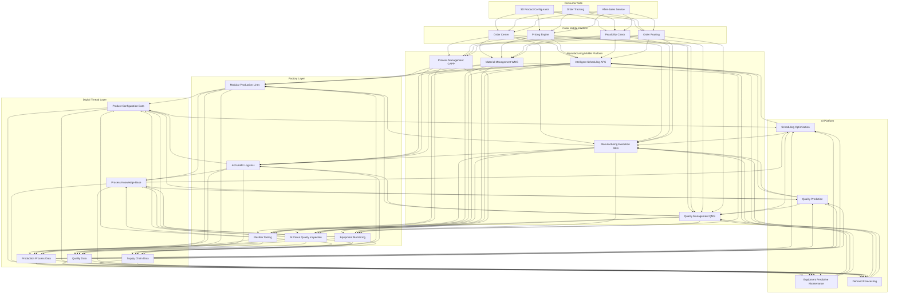
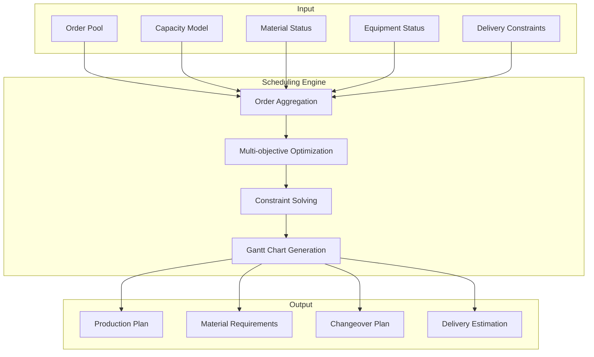

---title: Flexible Manufacturing Architecture Design — Alibaba Cloud Perspective
description: 'title: Flexible Manufacturing Architecture Design'
summary: 'title: Flexible Manufacturing Architecture Design'
category: general
tags:
- architecture
- best-practice
- scheduler
- daemonset
- gateway
- operator
- gpu
- nvidia
tier: supporting
created: '2026-05-23'
last_updated: 2026-05
difficulty: intermediate
reading_level: intermediate
audience:
- All Engineers
estimated_read_time: 25min
intent_queries:
- What is Flexible Manufacturing Architecture Design — Alibaba Cloud Perspective
- How to implement Flexible Manufacturing Architecture Design — Alibaba Cloud Perspective
- Kubernetes 20 application patterns best practices
trigger_keywords:
- Flexible Manufacturing Architecture Design
- Alibaba Cloud Perspective
- application
- patterns
prerequisites:
- kubectl-basics
- prometheus-basics
- gpu-scheduling-basics
authors:
- name: Dillan Teagle
  role: contributor

---

> **Production Environment Safety Notice**
>
> This document contains directly executable operational commands. Before executing, please confirm: whether the current target cluster and Namespace are correct; whether you have sufficient RBAC permissions; whether validation has been performed in a non-production environment. Command risk levels are labeled as: 🔴 High Risk (may cause data loss or service interruption), 🟡 Medium Risk (will modify cluster state, but is generally reversible), 🟢 Low Risk / Read-Only (information gathering, no side effects).


title: Flexible Manufacturing Architecture Design
description: '# Flexible Manufacturing Architecture Design — Alibaba Cloud Perspective'
category: application-architecture
tags:
- k8s
- architecture
- industry
- scheduler
- [[DaemonSet|daemonset]]
- gateway
- operator
- gpu
- nvidia
last_updated: 2026-05-18
difficulty: advanced
reading_level: advanced
audience:
- Manufacturing Architects
- Industrial Internet Engineers
- Smart Manufacturing Leaders
estimated_read_time: 5min
intent_queries:
- Flexible Manufacturing [[Kubernetes|Kubernetes]] C2M Customization
- Intelligent Scheduling APS Kubernetes Deployment
- Digital Thread Factory
- AI Quality Inspection Industrial Vision Kubernetes
- Flexible Manufacturing MES WMS Integration
trigger_keywords:
- Flexible Manufacturing
- Mass Customization
- Digital Thread
- C2M
- Intelligent Scheduling
- APS
- Industrial Internet
- AI Quality Inspection
- MES
- Alibaba Cloud
related_domains:
- domain-01-cluster-fundamentals
- domain-11-ai-infra
- domain-11-production-operations
- domain-7-observability
related_topics:
- 59-industrial-internet-platform
- 93-digital-twin-factory
- 51-smart-manufacturing-mes
- 63-industrial-visual-inspection
k8s_versions:
- '1.28'
- '1.29'
- '1.30'
- '1.31'
- '1.32'
---
# Flexible Manufacturing Architecture Design — Alibaba Cloud Perspective

> **Applicable Versions**: Kubernetes v1.29 - v1.33 | **Last Updated**: 2026-04-24
> **Author**: Alibaba Cloud Solution Architects | **Tags**: `#FlexibleManufacturing` `#MassCustomization` `#DigitalThread` `#C2M` `#AlibabaCloud`

---

## Table of Contents

1. [Overview](#1-overview)
2. [Design Principles](#2-design-principles)
3. [Architecture Patterns](#3-architecture-patterns)
4. [Implementation Examples](#4-implementation-examples)
5. [Deployment on Kubernetes](#5-deployment-on-kubernetes)
6. [Best Practices](#6-best-practices)
7. [Anti-Patterns](#7-anti-patterns)
8. [Reference Resources](#8-reference-resources)

---

## 1. Overview

Flexible Manufacturing refers to the ability of a production system to rapidly adapt to changes in product variety and batch size, enabling mass personalized customization. As consumer demand becomes increasingly individualized and product life cycles continue to shorten, the traditional high-volume single-variety production model can no longer satisfy market demands. Flexible Manufacturing achieves personalized customization while maintaining large-scale production efficiency through modular production lines, intelligent scheduling, and Digital Thread technologies.

The core tension in Flexible Manufacturing is balancing "variety" against "efficiency": the more product variants there are, the more frequently production lines must switch over, and the lower the production efficiency becomes. The key to resolving this tension lies in information technology — intelligent scheduling algorithms optimize order aggregation and production line dispatching, the Digital Thread enables full lifecycle traceability of every product, AI-powered quality inspection ensures quality consistency for customized products, and supply chain collaboration enables make-to-order production.

From a cloud-native architecture perspective, a Flexible Manufacturing platform is a typical Industrial Internet scenario with the following characteristics: high concurrency (tens of thousands of orders processed simultaneously), real-time responsiveness (millisecond-level response for production line control), data intensity (full lifecycle data for every product), and multi-system integration (ERP/MES/PLM/WMS/SCM).

## 1.1 Industry Background

| Challenge | Description | Architectural Impact |
|:---|:---|:---|
| High-mix, low-volume production | Fragmented orders, tens of thousands of SKUs | Intelligent scheduling + order aggregation |
| Rapid changeover | Production line switchover < 30 min | Modular design + quick die change |
| Quality traceability | Full lifecycle traceability for every product | Digital Thread + blockchain |
| Supply chain collaboration | On-demand procurement/production | Data sharing + supply chain platform |
| Customer engagement | C2M personalized customization | 3D configurator + design tools |

## 1.2 Core Scenarios

- **C2M Customization**: Consumers customize products via a 3D configurator; factory produces to order
- **Intelligent Scheduling**: Smart order aggregation, capacity optimization, multi-objective scheduling
- **Production Line Reconfiguration**: Modular production lines rapidly reorganized to accommodate new product requirements
- **Digital Thread**: Full lifecycle data traceability from design to end-of-life
- **AI Quality Inspection**: AI vision-based inspection and quality control for customized products

---

## 2. Design Principles

## 2.1 Order-Driven Principle

Flexible Manufacturing is order-driven, with everything revolving around orders. The entire process from customer order placement to production and delivery must be visualizable, trackable, and optimizable. System design must establish an order-centric data model that links customer requirements, product design, process parameters, production plans, quality data, and logistics information into a unified order view.

## 2.2 Modularity Principle

The Flexible Manufacturing system itself must also be flexible. The system architecture adopts a modular design: modular production lines (standardized processing units that can be freely combined), modular software (microservices architecture, composable on demand), and modular data (standard data interfaces, loosely coupled between systems). Modularity allows the system to rapidly adapt to new production requirements, much like assembling building blocks.

## 2.3 Data Continuity Principle

The Digital Thread is the soul of Flexible Manufacturing. Data must flow continuously throughout the entire value chain — from customer requirements, to product design, to process planning, to production execution, to quality inspection, to logistics and delivery. Data generated at each stage is automatically passed to downstream stages, forming a complete data chain. This not only enables traceability but also provides the data foundation for continuous optimization.

## 2.4 Adaptive Optimization Principle

Flexible Manufacturing systems must possess adaptive optimization capabilities: predicting future demand trends based on historical order data; dynamically adjusting scheduling plans based on equipment status; automatically optimizing process parameters based on quality data; and adjusting procurement strategies based on supply chain status. AI/ML technology is the core means of achieving adaptive optimization.

---

## 3. Architecture Patterns

## 3.1 Flexible Manufacturing Platform Panoramic Architecture


```mermaid
graph TB
    subgraph Consumer Side
        C1[3D Product Configurator]
        C2[Order Tracking]
        C3[After-Sales Service]
    end

    subgraph Order Middle Platform
        O1[Order Center]
        O2[Pricing Engine]
        O3[Feasibility Check]
        O4[Order Routing]
    end

    subgraph Manufacturing Middle Platform
        M1[Intelligent Scheduling APS]
        M2[Process Management CAPP]
        M3[Manufacturing Execution MES]
        M4[Quality Management QMS]
        M5[Material Management WMS]
    end

    subgraph Factory Layer
        F1[Modular Production Lines]
        F2[AGV/AMR Logistics]
        F3[Flexible Tooling]
        F4[AI Vision Quality Inspection]
        F5[Equipment Monitoring]
    end

    subgraph Digital Thread Layer
        D1[Product Configuration Data]
        D2[Process Knowledge Base]
        D3[Production Process Data]
        D4[Quality Data]
        D5[Supply Chain Data]
    end

    subgraph AI Platform
        A1[Scheduling Optimization]
        A2[Quality Prediction]
        A3[Equipment Predictive Maintenance]
        A4[Demand Forecasting]
    end

    C1 & C2 & C3 --> O1 & O2 & O3 & O4
    O1 & O2 & O3 & O4 --> M1 & M2 & M3 & M4 & M5
    M1 & M2 & M3 & M4 & M5 --> F1 & F2 & F3 & F4 & F5
    F1 & F2 & F3 & F4 & F5 --> D1 & D2 & D3 & D4 & D5
    D1 & D2 & D3 & D4 & D5 --> A1 & A2 & A3 & A4
    A1 & A2 & A3 & A4 --> M1 & M3 & M4
```
## 3.2 C2M Customization Process Architecture


```mermaid
flowchart LR
    A[Customer Configuration] --> B[3D Preview]
    B --> C[Price Calculation]
    C --> D[Order & Payment]
    D --> E[Feasibility Check]
    E --> F[BOM Explosion]
    F --> G[Process Generation]
    G --> H[Production Scheduling]
    H --> I[Flexible Manufacturing]
    I --> J[AI Quality Inspection]
    J --> K[Packaging & Shipping]
    K --> L[Customer Sign-off]
```

## 3.3 Intelligent Scheduling Algorithm Architecture


```mermaid
graph TB
    subgraph Input
        I1[Order Pool]
        I2[Capacity Model]
        I3[Material Status]
        I4[Equipment Status]
        I5[Delivery Constraints]
    end

    subgraph Scheduling Engine
        E1[Order Aggregation]
        E2[Multi-objective Optimization]
        E3[Constraint Solving]
        E4[Gantt Chart Generation]
    end

    subgraph Output
        O1[Production Plan]
        O2[Material Requirements]
        O3[Changeover Plan]
        O4[Delivery Estimation]
    end

    I1 & I2 & I3 & I4 & I5 --> E1
    E1 --> E2 --> E3 --> E4
    E4 --> O1 & O2 & O3 & O4
```

---

## 4. Implementation Examples

## 4.1 Intelligent Scheduling Engine

```python
from dataclasses import dataclass
from typing import List, Dict, Optional
from datetime import datetime, timedelta
import random

@dataclass
class Order:
    order_id: str
    product_type: str
    quantity: int
    due_date: datetime
    priority: int
    config: dict

@dataclass
class WorkCenter:
    wc_id: str
    capabilities: List[str]
    capacity_per_hour: int
    setup_time_min: Dict[str, Dict[str, int]]
    current_status: str = "idle"

@dataclass
class ScheduledTask:
    order_id: str
    wc_id: str
    product_type: str
    quantity: int
    start_time: datetime
    end_time: datetime
    setup_time_min: int

class FlexibleScheduler:
    def __init__(self, work_centers: List[WorkCenter]):
        self.work_centers = {wc.wc_id: wc for wc in work_centers}

    def schedule(self, orders: List[Order],
                  start_time: datetime) -> List[ScheduledTask]:
        # Sort orders by priority (descending) and due date
        sorted_orders = sorted(orders,
                               key=lambda o: (-o.priority, o.due_date))

        # Group similar orders together
        grouped = self._group_similar_orders(sorted_orders)

        schedule = []
        wc_available = {wc_id: start_time
                        for wc_id in self.work_centers}

        for batch in grouped:
            product_type = batch[0].product_type
            # Find the best work center for this batch
            best_wc = self._find_best_wc(product_type, wc_available,
                                          batch, start_time)
            if best_wc is None:
                continue

            wc = self.work_centers[best_wc]
            total_qty = sum(o.quantity for o in batch)

            # Calculate setup time based on previous product type
            prev_type = self._get_previous_product(best_wc, schedule)
            setup_time = 0
            if prev_type and prev_type != product_type:
                setup_time = wc.setup_time_min.get(prev_type, {}).get(
                    product_type, 30)

            avail = wc_available[best_wc]
            prod_time = (total_qty / wc.capacity_per_hour) * 60
            task_start = avail + timedelta(minutes=setup_time)
            task_end = task_start + timedelta(minutes=prod_time)

            for order in batch:
                schedule.append(ScheduledTask(
                    order_id=order.order_id,
                    wc_id=best_wc,
                    product_type=product_type,
                    quantity=order.quantity,
                    start_time=task_start,
                    end_time=task_end,
                    # Only the first order in the batch incurs setup time
                    setup_time_min=setup_time if order == batch[0] else 0,
                ))

            wc_available[best_wc] = task_end

        return schedule

    def _group_similar_orders(self, orders: List[Order]) -> List[List[Order]]:
        # Group orders by product type
        groups: Dict[str, List[Order]] = {}
        for order in orders:
            key = order.product_type
            if key not in groups:
                groups[key] = []
            groups[key].append(order)
        return list(groups.values())

    def _find_best_wc(self, product_type: str,
                       wc_available: Dict[str, datetime],
                       batch: List[Order],
                       start_time: datetime) -> Optional[str]:
        best_wc = None
        best_time = None

        for wc_id, wc in self.work_centers.items():
            # Skip work centers that don't support this product type
            if product_type not in wc.capabilities:
                continue

            earliest = max(wc_available[wc_id], start_time)
            total_qty = sum(o.quantity for o in batch)
            prod_min = (total_qty / wc.capacity_per_hour) * 60

            # Select the work center with the earliest available time
            if best_time is None or earliest < best_time:
                best_time = earliest
                best_wc = wc_id

        return best_wc

    def _get_previous_product(self, wc_id: str,
                               schedule: List[ScheduledTask]) -> Optional[str]:
        # Get the product type of the last scheduled task on this work center
        wc_tasks = [t for t in schedule if t.wc_id == wc_id]
        if wc_tasks:
            return wc_tasks[-1].product_type
        return None
```
## 4.2 Product Configurator

```go
package configurator

import (
    "fmt"
)

type ConfigOption struct {
    Name     string
    Values   []string
    Default  string
    Price    map[string]float64
    Constraints []Constraint
}

type Constraint struct {
    If   map[string]string
    Then map[string][]string
}

type ProductConfig struct {
    BasePrice float64
    Options   []ConfigOption
}

type ConfiguredProduct struct {
    ProductType string
    Selections  map[string]string
    TotalPrice  float64
    BOM         map[string]int
    Valid       bool
    Errors      []string
}

func NewConfigurator(basePrice float64, options []ConfigOption) *ProductConfig {
    return &ProductConfig{
        BasePrice: basePrice,
        Options:   options,
    }
}

func (pc *ProductConfig) Configure(selections map[string]string) (*ConfiguredProduct, error) {
    result := &ConfiguredProduct{
        Selections: selections,
        Valid:      true,
    }

    totalPrice := pc.BasePrice
    bom := make(map[string]int)

    for _, opt := range pc.Options {
        selected, ok := selections[opt.Name]
        if !ok {
            selected = opt.Default
            result.Selections[opt.Name] = selected
        }

        if price, exists := opt.Price[selected]; exists {
            totalPrice += price
        }

        bom[fmt.Sprintf("%s_%s", opt.Name, selected)] = 1
    }

    errors := pc.validateConstraints(selections)
    if len(errors) > 0 {
        result.Valid = false
        result.Errors = errors
    }

    result.TotalPrice = totalPrice
    result.BOM = bom
    return result, nil
}

func (pc *ProductConfig) validateConstraints(selections map[string]string) []string {
    var errors []string
    for _, opt := range pc.Options {
        for _, constraint := range opt.Constraints {
            match := true
            for k, v := range constraint.If {
                if selections[k] != v {
                    match = false
                    break
                }
            }
            if match {
                for k, allowed := range constraint.Then {
                    selected := selections[k]
                    found := false
                    for _, a := range allowed {
                        if a == selected {
                            found = true
                            break
                        }
                    }
                    if !found {
                        errors = append(errors,
                            fmt.Sprintf("%s=%s not allowed with current config", k, selected))
                    }
                }
            }
        }
    }
    return errors
}
```
## 4.3 Digital Thread Data Management

```python
from datetime import datetime
from typing import List, Optional
from dataclasses import dataclass, field

@dataclass
class DigitalThreadEvent:
    event_id: str
    serial_number: str
    event_type: str
    station_id: str
    timestamp: datetime
    data: dict
    operator_id: str = ""
    quality_status: str = "pass"

class DigitalThread:
    def __init__(self):
        self.events: List[DigitalThreadEvent] = []
        self.index: dict = {}

    def add_event(self, event: DigitalThreadEvent):
        self.events.append(event)
        sn = event.serial_number
        if sn not in self.index:
            self.index[sn] = []
        self.index[sn].append(len(self.events) - 1)

    def get_product_history(self, serial_number: str) -> List[DigitalThreadEvent]:
        indices = self.index.get(serial_number, [])
        return [self.events[i] for i in sorted(indices)]

    def get_full_trace(self, serial_number: str) -> dict:
        history = self.get_product_history(serial_number)
        if not history:
            return {"serial_number": serial_number, "events": []}

        config_events = [e for e in history if e.event_type == "configuration"]
        production_events = [e for e in history if e.event_type == "production"]
        quality_events = [e for e in history if e.event_type == "quality_check"]
        shipping_events = [e for e in history if e.event_type == "shipping"]

        quality_pass = all(e.quality_status == "pass" for e in quality_events)

        return {
            "serial_number": serial_number,
            "total_events": len(history),
            "configuration": config_events[0].data if config_events else None,
            "production_steps": len(production_events),
            "production_time": {
                "start": production_events[0].timestamp.isoformat() if production_events else None,
                "end": production_events[-1].timestamp.isoformat() if production_events else None,
            },
            "quality": {
                "total_checks": len(quality_events),
                "passed": quality_pass,
                "details": [e.data for e in quality_events],
            },
            "shipping": shipping_events[0].data if shipping_events else None,
            "traceable": True,
        }

    def search_by_time_range(self, start: datetime,
                              end: datetime) -> List[DigitalThreadEvent]:
        return [e for e in self.events if start <= e.timestamp <= end]

    def search_by_quality_failure(self) -> List[DigitalThreadEvent]:
        return [e for e in self.events if e.quality_status == "fail"]
```

---

## 5. Deployment on Kubernetes

## 5.1 Intelligent Scheduling Engine

```yaml
apiVersion: apps/v1
kind: Deployment
metadata:
  name: smart-scheduler
  namespace: flexible-manufacturing
  labels:
    app: smart-scheduler
    tier: core
spec:
  replicas: 3
  selector:
    matchLabels:
      app: smart-scheduler
  template:
    metadata:
      labels:
        app: smart-scheduler
    spec:
      containers:
        - name: scheduler
          image: registry.cn-hangzhou.aliyuncs.com/mfg/smart-scheduler:v2.0.0
          ports:
            - containerPort: 8080
          env:
            - name: OPTIMIZATION_GOAL
              value: "makespan-min"
            - name: MAX_ORDERS_PER_BATCH
              value: "5000"
            - name: SOLVER_TIMEOUT_S
              value: "120"
          resources:
            requests:
              memory: "4Gi"
              cpu: "2000m"
            limits:
              memory: "8Gi"
              cpu: "4000m"
          readinessProbe:
            httpGet:
              path: /ready
              port: 8080
            periodSeconds: 5
```
## 5.2 AI Quality Inspection Service

```yaml
apiVersion: apps/v1
kind: Deployment
metadata:
  name: ai-quality-inspector
  namespace: flexible-manufacturing
spec:
  replicas: 4
  selector:
    matchLabels:
      app: ai-quality-inspector
  template:
    metadata:
      labels:
        app: ai-quality-inspector
    spec:
      nodeSelector:
        accelerator: nvidia-t4
      runtimeClassName: nvidia
      containers:
        - name: inspector
          image: registry.cn-hangzhou.aliyuncs.com/mfg/quality-inspector:v2.0.0-gpu
          ports:
            - containerPort: 8080
          env:
            - name: MODEL_PATH
              value: "/models/defect-detect-v3"
            - name: CONFIDENCE_THRESHOLD
              value: "0.95"
            - name: CAMERA_COUNT
              value: "8"
          resources:
            requests:
              nvidia.com/gpu: 1
              memory: "8Gi"
              cpu: "4000m"
            limits:
              nvidia.com/gpu: 1
              memory: "16Gi"
              cpu: "8000m"
```

## 5.3 MES Edge Gateway

```yaml
apiVersion: apps/v1
kind: DaemonSet
metadata:
  name: mes-edge-gateway
  namespace: flexible-manufacturing
spec:
  selector:
    matchLabels:
      app: mes-edge-gateway
  template:
    metadata:
      labels:
        app: mes-edge-gateway
    spec:
      nodeSelector:
        node-type: production-line
      hostNetwork: true
      containers:
        - name: gateway
          image: registry.cn-hangzhou.aliyuncs.com/mfg/mes-gateway:v2.0.0
          env:
            - name: PLC_ADDRESS
              valueFrom:
                fieldRef:
                  fieldPath: spec.nodeName
            - name: CLOUD_ENDPOINT
              value: "https://mfg-platform.aliyuncs.com"
            - name: BUFFER_SIZE
              value: "10000"
          resources:
            requests:
              memory: "512Mi"
              cpu: "250m"
            limits:
              memory: "1Gi"
              cpu: "500m"
```

---

## 6. Best Practices

## 6.1 Production Scheduling Optimization

- **Order Aggregation**: Automatically aggregate similar products into the same production batch to reduce changeover frequency
- **Multi-objective Optimization**: Comprehensively consider multiple objectives such as delivery deadlines, capacity utilization, changeover time, and material inventory
- **Rolling Scheduling**: Recalculate the production schedule every hour to adapt to order changes and equipment issues
- **What-if Analysis**: Support simulation of different scheduling scenarios to assist decision-making

## 6.2 Quality Control

- **First Article Inspection**: Perform full-dimensional inspection on the first part produced after each changeover
- **SPC Statistical Process Control**: Perform real-time statistical monitoring of key processes to detect process anomalies promptly
- **AI Visual Inspection**: Use deep learning models for appearance defect detection, replacing manual visual inspection
- **Quality Closed-loop**: Quality data is fed back to process parameters, automatically adjusted to reduce defects
## 6.3 Digital Thread Implementation

- **One product, one code**: Each product is assigned a unique serial number (QR code/RFID) that follows it throughout its entire lifecycle
- **Event-driven**: Every workstation on the production line automatically reports events (processing complete, QC result, packaging complete)
- **Data association**: Customer configuration, BOM, process parameters, and QC data are linked to a unified product view
- **Real-time visualization**: Customers can view order production progress in real time via a mobile app

---

## 7. Anti-Patterns

## 7.1 Single Fixed Production Line

Designing an immutable fixed production line capable of producing only one or a few products.

**Solution**: Adopt a modular production line design with standardized, movable, and reconfigurable processing units. Use Single Minute Exchange of Die (SMED) techniques to compress changeover time to under 30 minutes.

## 7.2 Manual Scheduling

Relying on human experience and Excel for scheduling, which cannot effectively optimize across tens of thousands of SKUs and complex constraints.

**Solution**: Deploy an intelligent Advanced Planning and Scheduling (APS) system that uses constraint satisfaction and optimization algorithms to automatically generate optimal scheduling plans. The system supports rolling scheduling and responds to changes in real time.

## 7.3 Post-Production Quality Inspection

Quality inspection is only performed after products are fully manufactured, meaning defects are discovered only after large amounts of materials and labor have already been wasted.

**Solution**: Implement in-line quality control (In-line QC) with immediate inspection after every critical process step. Use AI vision systems for 100% full inspection, replacing sampling-based inspection.

## 7.4 Information Silos

Systems such as ERP, MES, PLM, and WMS operate independently with no data interoperability.

**Solution**: Establish a unified digital thread platform that connects data across all systems via standard APIs. Use an event-driven architecture to achieve real-time data synchronization between systems.

## 7.5 Ignoring Changeover Costs

Scheduling only considers capacity and delivery deadlines while ignoring changeover time and cost.

**Solution**: Explicitly model changeover time and cost in the scheduling algorithm. Similar products are automatically grouped into the same batch to reduce the number of changeovers. Use Constraint Programming (CP) to solve changeover optimization problems.

---

## 8. Reference Resources

## 8.1 Alibaba Cloud Component Mapping

| Functional Domain | **Alibaba Cloud Native Solution** |
|:---|:---|
| Container Platform | **ACK Pro + ACK Edge** |
| AI Platform | **PAI + Vision Intelligence** |
| Database | **PolarDB + Lindorm** |
| IoT Platform | **Alibaba Cloud IoT** |
| Message Queue | **RocketMQ** |
| Observability | **ARMS + SLS** |
| Workflow | **Argo Workflows** |

## 8.2 Production Checklist

- [ ] Production line changeover time < 30 min compliance verification
- [ ] Scheduling algorithm optimization effectiveness (capacity utilization > 85%)
- [ ] Quality consistency verification for customized products
- [ ] Supply chain data collaboration interface testing
- [ ] Process knowledge security isolation mechanism
- [ ] End-to-end digital thread traceability testing
- [ ] AI quality inspection model accuracy > 99%
- [ ] System high availability 99.9% verification

## 8.3 External References

- ISA-95 — Enterprise-Control System Integration Standard
- IEC 62264 — Manufacturing Execution Systems Standard
- ISO 22400 — Manufacturing Operations Management KPI Standard
- OPC UA — Industrial Interoperability Communication Protocol
- SMED (Single Minute Exchange of Die) — Rapid Changeover Methodology

---

**Maintainer**: Alibaba Cloud Solutions Architect Team | **License**: MIT

---

## Obsidian Related Documents

- topic-application-architecture MOC
- [[domain-20-application-patterns/topic-application-architecture/README.md|Topic Application Layer Architecture Design Best Practices]]
- [[domain-20-application-patterns/topic-application-architecture/01-ecommerce-architecture.md|E-Commerce System Kubernetes Production Architecture Design]]
- [[domain-20-application-patterns/topic-application-architecture/02-mini-program-architecture.md|Mini Program Platform Architecture Design]]
- [[domain-20-application-patterns/topic-application-architecture/03-cms-architecture.md|Content Management System CMS Architecture Design]]
- [[domain-20-application-patterns/topic-application-architecture/04-im-rtc-architecture.md|Real-Time Communication IM/RTC Architecture Design]]
- [[domain-20-application-patterns/topic-application-architecture/05-online-education-architecture.md|Online Education Platform Kubernetes Production Architecture Design]]
- [[domain-20-application-patterns/topic-application-architecture/06-fintech-architecture.md|FinTech Kubernetes Production Architecture Design]]
- [[domain-20-application-patterns/topic-application-architecture/07-iot-platform-architecture.md|IoT Platform Architecture Design]]
- [[domain-20-application-patterns/topic-application-architecture/08-ai-ml-inference-architecture.md|AI/ML Inference Service Kubernetes Production Architecture Design]]
- [[domain-20-application-patterns/topic-application-architecture/09-gaming-backend-architecture.md|Gaming Backend Kubernetes Production Architecture Design]]
- [[domain-20-application-patterns/topic-application-architecture/10-social-media-architecture.md|Social Media Platform Kubernetes Production Architecture Design]]

## See Also

- 85-hydrogen-energy
- 86-solid-state-battery
- 88-nanomaterials
- 89-crispr-gene-editing
## Related

- topic-application-architecture MOC — Cross-reference
