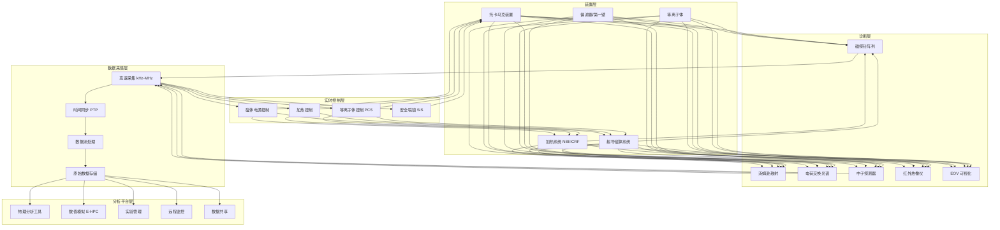
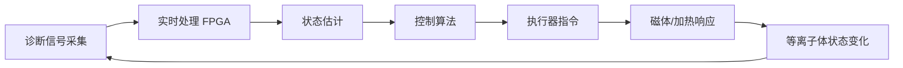

---title: 可控核聚变监控架构设计 — 阿里云视角
description: 'title: 可控核聚变监控架构设计'
summary: 'title: 可控核聚变监控架构设计'
category: general
tags:
- architecture
- best-practice
- monitoring
- flux
tier: supporting
created: '2026-05-23'
last_updated: 2026-05
difficulty: intermediate
reading_level: intermediate
audience:
- 所有工程师
estimated_read_time: 15min
intent_queries:
- 可控核聚变监控架构设计 — 阿里云视角 是什么
- 如何 可控核聚变监控架构设计 — 阿里云视角
- Kubernetes 20 application patterns 最佳实践
trigger_keywords:
- 可控核聚变监控架构设计
- 阿里云视角
- application
- patterns
prerequisites:
- kubectl-basics
- prometheus-basics
authors:
- name: Dillan Teagle
  role: contributor

---

> **生产环境安全提示**
>
> 本文档包含可直接执行的运维命令。执行前请确认：当前目标集群与 Namespace 是否正确；是否具备足够的 RBAC 权限；是否已在非生产环境验证。命令风险等级标注：🔴 高风险（可能造成数据丢失或服务中断）、🟡 中风险（会修改集群状态，但通常可回滚）、🟢 低风险/只读（信息收集，无副作用）。


title: 可控核聚变监控架构设计
description: '# 可控核聚变监控架构设计 — 阿里云视角'
category: application-architecture
tags:
- k8s
- architecture
- industry
- [[Flux|flux]]
last_updated: 2026-05-18
difficulty: expert
reading_level: expert
audience:
- 核聚变工程师
- HPC架构师
- 实时系统专家
estimated_read_time: 5min
intent_queries:
- 可控核聚变 [[Kubernetes|Kubernetes]] 实时控制
- 托卡马克 等离子体控制 K8s
- 核聚变数据采集 时序数据库
- 核聚变监控 高性能计算 K8s
- 核聚变 AI 破裂预测 Kubernetes
trigger_keywords:
- 可控核聚变
- 托卡马克
- 等离子体
- 核聚变
- 监控
- 实时控制
- FPGA
- E-HPC
- 阿里云
related_domains:
- domain-01-cluster-fundamentals
- domain-11-ai-infra
- domain-11-production-operations
related_topics:
- 78-deep-sea-exploration
- 79-polar-research
- 66-space-internet
k8s_versions:
- '1.28'
- '1.29'
- '1.30'
- '1.31'
- '1.32'
---

# 可控核聚变监控架构设计 — 阿里云视角

> **适用版本**: Kubernetes v1.29 - v1.33 | **最后更新**: 2026-04-24
> **作者**: 阿里云解决方案架构师 | **标签**: `#可控核聚变` `#托卡马克` `#等离子体` `#阿里云`

---

<!-- chunk: 目录 -->## 目录

1. [概述](#1-概述)
2. [设计原则](#2-设计原则)
3. [架构模式](#3-架构模式)
4. [实现示例](#4-实现示例)
5. [在 Kubernetes 上的部署](#5-在-kubernetes-上的部署)
6. [最佳实践](#6-最佳实践)
7. [反模式](#7-反模式)
8. [参考资源](#8-参考资源)

---

<!-- chunk: 1. 概述 -->## 1. 概述

可控核聚变被誉为人类终极能源，其燃料（氘、氚）几乎取之不尽，反应过程不产生温室气体和长寿命放射性废料。托卡马克装置是目前最主流的核聚变实验装置，通过强磁场将上亿度的等离子体约束在环形容器中，实现聚变反应。国际热核聚变实验堆（ITER）、中国东方超环（EAST）、紧凑型聚变能装置（CFERC）等项目正在推动核聚变从科学实验走向工程应用。

核聚变监控系统的核心挑战在于极端物理环境下的精确控制：等离子体温度超过 1 亿度（太阳核心温度的 6 倍），需要在毫秒级时间尺度上进行反馈控制；诊断系统需要测量数十个物理参数（电子温度、离子温度、电子密度、磁场分布、中子通量等），采样率从 kHz 到 MHz 不等；控制算法需要综合考虑电磁、流体、热传导等多物理场耦合效应。

从信息系统角度看，核聚变监控是一个典型的高性能实时控制 + 大数据分析场景。放电控制需要微秒级实时响应，必须使用边缘计算（FPGA/实时 Linux）；实验数据管理和物理分析需要云计算平台；AI 技术正在应用于等离子体控制、异常检测、实验优化等方向。

## 1.1 行业背景

| 挑战 | 说明 | 架构影响 |
|:---|:---|:---|
| 极端环境 | 上亿度等离子体 | 耐辐射传感器 + 远程诊断 |
| 实时控制 | 毫秒级反馈控制周期 | FPGA + 实时操作系统 |
| 多物理场 | 电磁/流体/热耦合 | 高性能模拟 E-HPC |
| 安全第一 | 中子辐射 + 活化材料 | 多重冗余 + 安全联锁 |
| 长脉冲运行 | 持续放电数百秒到小时 | 高可用系统 + 数据流 |

## 1.2 核心场景

- **等离子体控制**: 等离子体电流/位置/形状实时反馈控制
- **加热系统管理**: 中性束注入（NBI）/射频加热（ICRF/ECRH）控制
- **偏滤器监测**: 热负荷/粒子流实时监测
- **诊断数据采集**: 数十种诊断系统同步采集与存储
- **实验管理**: 实验计划/数据管理/物理分析平台

---

<!-- chunk: 2. 设计原则 -->## 2. 设计原则

## 2.1 实时性优先原则

等离子体控制是核聚变装置最核心的控制回路，控制周期通常为 0.1-1ms。这一实时性要求远超常规工业控制系统。架构设计需要将实时控制功能部署在专用硬件上（FPGA/实时 DSP），与监控系统物理隔离。控制指令通过硬接线或专用光纤传递，不经过通用网络。

## 2.2 安全联锁独立原则

核聚变装置的安全联锁系统（SIS）必须独立于基本控制系统（BCS）。安全联锁通过硬接线实现紧急停机——当检测到超导磁体失超、等离子体破裂、冷却异常等危险工况时，直接切断加热功率并触发保护动作，不依赖软件判断。

## 2.3 数据完整性原则

核聚变实验每次放电的成本极高（数十万到数百万美元），实验数据是不可复现的珍贵资产。数据采集系统需要保证：所有通道同步采集（时间精度 < 1μs）、数据无损存储（零丢失）、长期可追溯（原始数据永久保存）。

## 2.4 可扩展原则

核聚变装置的物理实验需求不断演进，诊断系统和控制算法需要持续迭代。架构设计需要支持：新诊断系统的快速接入、控制算法的在线更新、计算资源的弹性扩展、与外部研究机构的协作共享。

---

<!-- chunk: 3. 架构模式 -->## 3. 架构模式

## 3.1 核聚变监控系统全景架构



## 3.2 等离子体控制闭环



## 3.3 实验数据管理架构


---

<!-- chunk: 4. 实现示例 -->## 4. 实现示例

## 4.1 等离子体控制参数估计

```python
import numpy as np
from scipy.signal import butter, filtfilt

class PlasmaStateEstimator:
    def __init__(self, n_magnetic_probes: int = 40,
                 control_period_us: int = 100):
        self.n_probes = n_magnetic_probes
        self.period_us = control_period_us
        self.fs = 1e6 / control_period_us

    def estimate_position(self, bp_signals: np.ndarray,
                           flux_signals: np.ndarray) -> dict:
        r_position = np.mean(bp_signals[:self.n_probes//2]) / \
                     np.mean(bp_signals[self.n_probes//2:])
        z_position = np.mean(bp_signals[1::2]) / \
                     np.mean(bp_signals[0::2])

        plasma_current = np.sum(flux_signals) * 1e6

        return {
            'r_position_m': float(r_position),
            'z_position_m': float(z_position),
            'plasma_current_MA': float(plasma_current),
            'timestamp_us': 0,
        }

    def detect_disruption(self, history: list,
                           current_state: dict) -> dict:
        if len(history) < 100:
            return {'risk': 'unknown', 'probability': 0.0}

        recent_currents = [h['plasma_current_MA'] for h in history[-100:]]
        recent_r = [h['r_position_m'] for h in history[-100:]]

        current_var = np.var(recent_currents)
        position_var = np.var(recent_r)

        risk_score = 0.0
        if current_var > 0.1:
            risk_score += 0.4
        if position_var > 0.05:
            risk_score += 0.3
        if abs(current_state['z_position_m']) > 0.1:
            risk_score += 0.3

        risk_level = 'low'
        if risk_score > 0.7:
            risk_level = 'high'
        elif risk_score > 0.4:
            risk_level = 'medium'

        return {
            'risk': risk_level,
            'probability': min(risk_score, 1.0),
            'current_instability': current_var,
            'position_instability': position_var,
        }
```

## 4.2 放电实验数据管理

```go
package fusion

import (
    "fmt"
    "sync"
    "time"
)

type ShotData struct {
    ShotNumber   int
    StartTime    time.Time
    Duration     time.Duration
    PlasmaCurrent float64
    InputPower    float64
    Diagnostics   map[string][]float64
    Tags          []string
    Status        string
}

type ExperimentManager struct {
    shots    map[int]*ShotData
    mu       sync.RWMutex
    nextShot int
}

func NewExperimentManager() *ExperimentManager {
    return &ExperimentManager{
        shots:    make(map[int]*ShotData),
        nextShot: 100000,
    }
}

func (em *ExperimentManager) BeginShot(tags []string) *ShotData {
    em.mu.Lock()
    defer em.mu.Unlock()

    shot := &ShotData{
        ShotNumber: em.nextShot,
        StartTime:  time.Now(),
        Tags:       tags,
        Status:     "running",
        Diagnostics: make(map[string][]float64),
    }
    em.shots[shot.ShotNumber] = shot
    em.nextShot++
    return shot
}

func (em *ExperimentManager) EndShot(shotNumber int,
    plasmaCurrent, inputPower float64) error {
    em.mu.Lock()
    defer em.mu.Unlock()

    shot, ok := em.shots[shotNumber]
    if !ok {
        return fmt.Errorf("shot %d not found", shotNumber)
    }

    shot.Duration = time.Since(shot.StartTime)
    shot.PlasmaCurrent = plasmaCurrent
    shot.InputPower = inputPower
    shot.Status = "completed"
    return nil
}

func (em *ExperimentManager) RecordDiagnostic(shotNumber int,
    name string, data []float64) error {
    em.mu.Lock()
    defer em.mu.Unlock()

    shot, ok := em.shots[shotNumber]
    if !ok {
        return fmt.Errorf("shot %d not found", shotNumber)
    }
    shot.Diagnostics[name] = data
    return nil
}

func (em *ExperimentManager) GetShot(shotNumber int) (*ShotData, error) {
    em.mu.RLock()
    defer em.mu.RUnlock()
    shot, ok := em.shots[shotNumber]
    if !ok {
        return nil, fmt.Errorf("shot %d not found", shotNumber)
    }
    return shot, nil
}
```

---

<!-- chunk: 5. 在 Kubernetes 上的部署 -->## 5. 在 Kubernetes 上的部署

## 5.1 实验数据管理服务

```yaml
apiVersion: apps/v1
kind: Deployment
metadata:
  name: experiment-manager
  namespace: fusion-energy
spec:
  replicas: 3
  selector:
    matchLabels:
      app: experiment-manager
  template:
    metadata:
      labels:
        app: experiment-manager
    spec:
      containers:
        - name: manager
          image: registry.cn-hangzhou.aliyuncs.com/fusion/experiment-mgr:v2.0.0
          ports:
            - containerPort: 8080
          env:
            - name: OSS_BUCKET
              value: "fusion-shot-data"
            - name: DB_HOST
              valueFrom:
                configMapKeyRef:
                  name: fusion-config
                  key: db-host
          resources:
            requests:
              memory: "4Gi"
              cpu: "2000m"
            limits:
              memory: "8Gi"
              cpu: "4000m"
```

## 5.2 物理分析平台

```yaml
apiVersion: apps/v1
kind: Deployment
metadata:
  name: physics-analysis
  namespace: fusion-energy
spec:
  replicas: 2
  selector:
    matchLabels:
      app: physics-analysis
  template:
    metadata:
      labels:
        app: physics-analysis
    spec:
      containers:
        - name: analysis
          image: registry.cn-hangzhou.aliyuncs.com/fusion/physics-analysis:v2.0.0
          ports:
            - containerPort: 8080
          env:
            - name: E_HPC_CLUSTER
              value: "fusion-hpc"
            - name: SHOT_DATA_BUCKET
              value: "fusion-shot-data"
          resources:
            requests:
              memory: "8Gi"
              cpu: "4000m"
            limits:
              memory: "16Gi"
              cpu: "8000m"
```

---

<!-- chunk: 6. 最佳实践 -->## 6. 最佳实践

- **时间同步**: 所有诊断系统使用 PTP（精确时间协议）同步，精度 < 1μs
- **数据冗余**: 关键诊断数据实时写入本地 SSD 和远程存储
- **安全联锁独立**: 紧急停机系统通过硬接线独立于软件系统
- **放电自动调度**: 根据装置状态和实验计划自动安排放电序列
- **AI 破裂预测**: 训练机器学习模型预测等离子体破裂，提前触发保护动作

<!-- chunk: 7. 反模式 -->## 7. 反模式

## 7.1 软件安全联锁

将安全联锁完全依赖软件实现，软件问题可能导致安全功能失效。

**解决方案**: 关键安全联锁（超导失超保护、真空泄漏保护）采用硬接线实现，响应时间 < 10ms。

## 7.2 忽视辐射环境

将标准服务器直接部署在聚变装置附近，忽视中子辐射对电子设备的影响。

**解决方案**: 电子设备远离装置放置，使用光纤连接。必须靠近部署的设备采用辐射容忍设计。

## 7.3 单点数据采集

所有诊断数据通过单一采集系统，该系统问题导致整次放电数据丢失。

**解决方案**: 关键诊断系统独立采集通道冗余部署，数据同时写入本地和远程存储。

---

<!-- chunk: 8. 参考资源 -->## 8. 参考资源

## 8.1 阿里云组件映射

| 功能域 | **阿里云云原生方案** |
|:---|:---|
| 容器平台 | **ACK Pro** |
| 高性能计算 | **E-HPC** |
| 时序数据库 | **Lindorm** |
| 对象存储 | **OSS** |
| AI 平台 | **PAI** |
| 可观测性 | **ARMS + SLS** |

## 8.2 生产检查清单

- [ ] 等离子体控制实时性 < 1ms
- [ ] 安全联锁系统响应 < 10ms
- [ ] 诊断数据时间同步 < 1μs
- [ ] 放电数据完整性 100%
- [ ] 核安全合规审计通过
- [ ] 辐射监测系统校准

---

**维护者**: 阿里云解决方案架构师团队 | **许可证**: MIT

---

<!-- chunk: Obsidian 相关文档 -->## Obsidian 相关文档

- topic-application-architecture MOC
- [[domain-20-application-patterns/topic-application-architecture/README.md|Topic 应用层架构设计最佳实践]]
- [[domain-20-application-patterns/topic-application-architecture/01-ecommerce-architecture.md|电商系统 Kubernetes 生产架构设计]]
- [[domain-20-application-patterns/topic-application-architecture/02-mini-program-architecture.md|小程序平台架构设计]]
- [[domain-20-application-patterns/topic-application-architecture/03-cms-architecture.md|内容管理系统 CMS 架构设计]]
- [[domain-20-application-patterns/topic-application-architecture/04-im-rtc-architecture.md|实时通信 IM/RTC 架构设计]]
- [[domain-20-application-patterns/topic-application-architecture/05-online-education-architecture.md|在线教育平台 Kubernetes 生产架构设计]]
- [[domain-20-application-patterns/topic-application-architecture/06-fintech-architecture.md|金融科技FinTech Kubernetes生产架构设计]]
- [[domain-20-application-patterns/topic-application-architecture/07-iot-platform-architecture.md|物联网 IoT 平台架构设计]]
- [[domain-20-application-patterns/topic-application-architecture/08-ai-ml-inference-architecture.md|AI/ML 推理服务 Kubernetes 生产架构设计]]
- [[domain-20-application-patterns/topic-application-architecture/09-gaming-backend-architecture.md|游戏后端 Kubernetes 生产架构设计]]
- [[domain-20-application-patterns/topic-application-architecture/10-social-media-architecture.md|社交媒体平台Kubernetes生产架构设计]]

## See Also

- 75-affective-computing
- 76-synthetic-biology
- 78-deep-sea-exploration
- 79-polar-research

## Related

- topic-application-architecture MOC — Cross-reference


<!-- risk-assessed -->
