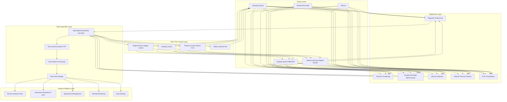
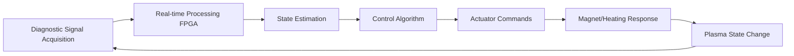
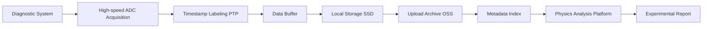

---title: Controlled Nuclear Fusion Monitoring Architecture Design — Alibaba Cloud Perspective
description: 'title: Controlled Nuclear Fusion Monitoring Architecture Design'
summary: 'title: Controlled Nuclear Fusion Monitoring Architecture Design'
category: general
tags:
- architecture
- best-practice
- monitoring
- flux
tier: supporting
created: '2026-05-23'
last_updated: 2026-05
difficulty: intermediate
reading_level: intermediate
audience:
- All Engineers
estimated_read_time: 15min
intent_queries:
- What is Controlled Nuclear Fusion Monitoring Architecture Design — Alibaba Cloud Perspective
- How to Controlled Nuclear Fusion Monitoring Architecture Design — Alibaba Cloud Perspective
- Kubernetes 20 application patterns best practices
trigger_keywords:
- Controlled Nuclear Fusion Monitoring Architecture Design
- Alibaba Cloud Perspective
- application
- patterns
prerequisites:
- kubectl-basics
- prometheus-basics
authors:
- name: Dillan Teagle
  role: contributor

---

> **Production Environment Safety Notice**
>
> This document contains directly executable operations commands. Before executing, please confirm: whether the current target cluster and Namespace are correct; whether you have sufficient RBAC permissions; whether validation has been performed in a non-production environment. Command risk levels are marked as: 🔴 High Risk (may cause data loss or service interruption), 🟡 Medium Risk (will modify cluster state, but is generally reversible), 🟢 Low Risk / Read-Only (information gathering, no side effects).


title: Controlled Nuclear Fusion Monitoring Architecture Design
description: '# Controlled Nuclear Fusion Monitoring Architecture Design — Alibaba Cloud Perspective'
category: application-architecture
tags:
- k8s
- architecture
- industry
- [[Flux|flux]]
last_updated: 2026-05-18
difficulty: expert
reading_level: expert
audience:
- Fusion Engineers
- HPC Architects
- Real-Time Systems Experts
estimated_read_time: 5min
intent_queries:
- Controlled nuclear fusion [[Kubernetes|Kubernetes]] real-time control
- Tokamak plasma control K8s
- Nuclear fusion data acquisition time-series database
- Nuclear fusion monitoring high-performance computing K8s
- Nuclear fusion AI disruption prediction Kubernetes
trigger_keywords:
- Controlled nuclear fusion
- Tokamak
- Plasma
- Nuclear fusion
- Monitoring
- Real-time control
- FPGA
- E-HPC
- Alibaba Cloud
related_domains:
- domain-01-cluster-fundamentals
- domain-11-ai-infra
- domain-11-production-operations
related_topics:
- 78-deep-sea-exploration
- 79-polar-research
- 66-space-internet
k8s_versions:
- '1.28'
- '1.29'
- '1.30'
- '1.31'
- '1.32'
---

# Controlled Nuclear Fusion Monitoring Architecture Design — Alibaba Cloud Perspective

> **Applicable Versions**: Kubernetes v1.29 - v1.33 | **Last Updated**: 2026-04-24
> **Author**: Alibaba Cloud Solutions Architect | **Tags**: `#ControlledNuclearFusion` `#Tokamak` `#Plasma` `#AlibabaCloud`

---

## Table of Contents

1. [Overview](#1-overview)
2. [Design Principles](#2-design-principles)
3. [Architecture Patterns](#3-architectural-patterns)
4. [Implementation Examples](#4-implementation-examples)
5. [Deployment on Kubernetes](#5-deployment-on-kubernetes)
6. [Best Practices](#6-best-practices)
7. [Anti-Patterns](#7-anti-patterns)
8. [Reference Resources](#8-reference-resources)

---
## 1. Overview

Controlled nuclear fusion is hailed as humanity's ultimate energy source: its fuel (deuterium and tritium) is virtually inexhaustible, and the reaction process produces neither greenhouse gases nor long-lived radioactive waste. The tokamak is currently the most mainstream nuclear fusion experimental device, confining plasma at temperatures exceeding 100 million degrees in a toroidal vessel using powerful magnetic fields to sustain fusion reactions. Projects such as the International Thermonuclear Experimental Reactor (ITER), China's Experimental Advanced Superconducting Tokamak (EAST), and the Compact Fusion Energy Research Center (CFERC) are driving nuclear fusion from scientific experimentation toward engineering application.

The core challenge of fusion monitoring systems lies in precise control under extreme physical conditions: plasma temperatures exceed 100 million degrees (six times the temperature of the solar core), requiring feedback control on millisecond timescales; diagnostic systems must measure dozens of physical parameters (electron temperature, ion temperature, electron density, magnetic field distribution, neutron flux, etc.) with sampling rates ranging from kHz to MHz; and control algorithms must account for coupled multi-physics effects spanning electromagnetics, fluid dynamics, and heat conduction.

From an information systems perspective, fusion monitoring is a classic high-performance real-time control + big data analytics scenario. Discharge control demands microsecond-level real-time response, necessitating edge computing (FPGA/real-time Linux); experimental data management and physics analysis require a cloud computing platform; and AI technology is increasingly being applied to plasma control, anomaly detection, and experimental optimization.

## 1.1 Industry Background

| Challenge | Description | Architectural Impact |
|:---|:---|:---|
| Extreme Environment | Plasma at 100+ million degrees | Radiation-hardened sensors + remote diagnostics |
| Real-Time Control | Millisecond-level feedback control cycle | FPGA + real-time operating system |
| Multi-Physics | Electromagnetic/fluid/thermal coupling | High-performance simulation E-HPC |
| Safety First | Neutron radiation + activated materials | Multiple redundancy + safety interlocks |
| Long-Pulse Operation | Sustained discharge from hundreds of seconds to hours | High-availability system + data streaming |

## 1.2 Core Scenarios

- **Plasma Control**: Real-time feedback control of plasma current/position/shape
- **Heating System Management**: Neutral beam injection (NBI) / radio-frequency heating (ICRF/ECRH) control
- **Divertor Monitoring**: Real-time monitoring of heat load and particle flux
- **Diagnostic Data Acquisition**: Synchronized acquisition and storage from dozens of diagnostic systems
- **Experiment Management**: Experimental planning / data management / physics analysis platform

---

## 2. Design Principles

## 2.1 Real-Time Priority Principle

Plasma control is the most critical control loop in a fusion device, with control cycles typically in the range of 0.1–1 ms. This real-time requirement far exceeds that of conventional industrial control systems. The architectural design must deploy real-time control functions on dedicated hardware (FPGA/real-time DSP), physically isolated from the monitoring system. Control commands are transmitted via hardwiring or dedicated fiber optics, bypassing general-purpose networks.

## 2.2 Safety Interlock Independence Principle

The safety interlock system (SIS) of a fusion device must be independent of the basic control system (BCS). Safety interlocks implement emergency shutdown via hardwiring — when hazardous conditions such as superconducting magnet quench, plasma disruption, or cooling anomalies are detected, heating power is cut directly and protective actions are triggered without relying on software-based decision-making.

## 2.3 Data Integrity Principle

Each discharge of a fusion device is extremely costly (hundreds of thousands to millions of dollars), and the experimental data represents an irreproducible and invaluable asset. The data acquisition system must guarantee: synchronous acquisition across all channels (time accuracy < 1 μs), lossless data storage (zero loss), and long-term traceability (permanent retention of raw data).

## 2.4 Scalability Principle

The physics experimental requirements of fusion devices continuously evolve, and diagnostic systems and control algorithms require ongoing iteration. The architectural design must support: rapid integration of new diagnostic systems, online updates to control algorithms, elastic expansion of computing resources, and collaborative sharing with external research institutions.

---

## 3. Architectural Patterns

## 3.1 Fusion Monitoring System Panoramic Architecture


```mermaid
graph TB
    subgraph Device Layer
        T1[Tokamak Device]
        T2[Plasma]
        T3[Superconducting Magnet System]
        T4[Heating System NBI/ICRF]
        T5[Divertor/First Wall]
    end

    subgraph Diagnostics Layer
        D1[Magnetic Probe Array]
        D2[Thomson Scattering]
        D3[Charge Exchange Spectroscopy]
        D4[Neutron Detector]
        D5[Infrared Thermal Camera]
        D6[EOV Visualization]
    end

    subgraph Real-Time Control Layer
        C1[Plasma Control System PCS]
        C2[Heating Control]
        C3[Magnet Power Supply Control]
        C4[Safety Interlock SIS]
    end

    subgraph Data Acquisition Layer
        DA1[High-Speed Acquisition kHz-MHz]
        DA2[Time Synchronization PTP]
        DA3[Data Stream Processing]
        DA4[Raw Data Storage]
    end

    subgraph Analysis Platform Layer
        P1[Physics Analysis Tools]
        P2[Numerical Simulation E-HPC]
        P3[Experiment Management]
        P4[Remote Monitoring]
        P5[Data Sharing]
    end

    T1 & T2 & T3 & T4 & T5 --> D1 & D2 & D3 & D4 & D5 & D6
    D1 & D2 & D3 & D4 --> DA1
    DA1 --> DA2 --> DA3 --> DA4
    DA1 --> C1 & C2 & C3 & C4
    C1 & C2 & C3 --> T1 & T3 & T4
    C4 --> T1
    DA4 --> P1 & P2 & P3 & P4 & P5
```
## 3.2 Plasma Control Closed Loop


```mermaid
flowchart LR
    A[Diagnostic Signal Acquisition] --> B[Real-time Processing FPGA]
    B --> C[State Estimation]
    C --> D[Control Algorithm]
    D --> E[Actuator Commands]
    E --> F[Magnet/Heating Response]
    F --> G[Plasma State Change]
    G --> A
```

## 3.3 Experimental Data Management Architecture


```mermaid
flowchart LR
    A[Diagnostic System] --> B[High-speed ADC Acquisition]
    B --> C[Timestamp Labeling PTP]
    C --> D[Data Buffer]
    D --> E[Local Storage SSD]
    E --> F[Upload Archive OSS]
    F --> G[Metadata Index]
    G --> H[Physics Analysis Platform]
    H --> I[Experimental Report]
```

---

## 4. Implementation Examples

## 4.1 Plasma Control Parameter Estimation

```python
import numpy as np
from scipy.signal import butter, filtfilt

class PlasmaStateEstimator:
    def __init__(self, n_magnetic_probes: int = 40,
                 control_period_us: int = 100):
        self.n_probes = n_magnetic_probes
        self.period_us = control_period_us
        self.fs = 1e6 / control_period_us

    def estimate_position(self, bp_signals: np.ndarray,
                           flux_signals: np.ndarray) -> dict:
        r_position = np.mean(bp_signals[:self.n_probes//2]) / \
                     np.mean(bp_signals[self.n_probes//2:])
        z_position = np.mean(bp_signals[1::2]) / \
                     np.mean(bp_signals[0::2])

        plasma_current = np.sum(flux_signals) * 1e6

        return {
            'r_position_m': float(r_position),
            'z_position_m': float(z_position),
            'plasma_current_MA': float(plasma_current),
            'timestamp_us': 0,
        }

    def detect_disruption(self, history: list,
                           current_state: dict) -> dict:
        if len(history) < 100:
            return {'risk': 'unknown', 'probability': 0.0}

        recent_currents = [h['plasma_current_MA'] for h in history[-100:]]
        recent_r = [h['r_position_m'] for h in history[-100:]]

        current_var = np.var(recent_currents)
        position_var = np.var(recent_r)

        risk_score = 0.0
        if current_var > 0.1:
            risk_score += 0.4
        if position_var > 0.05:
            risk_score += 0.3
        if abs(current_state['z_position_m']) > 0.1:
            risk_score += 0.3

        risk_level = 'low'
        if risk_score > 0.7:
            risk_level = 'high'
        elif risk_score > 0.4:
            risk_level = 'medium'

        return {
            'risk': risk_level,
            'probability': min(risk_score, 1.0),
            'current_instability': current_var,
            'position_instability': position_var,
        }
```

## 4.2 Discharge Experiment Data Management

```go
package fusion

import (
    "fmt"
    "sync"
    "time"
)

type ShotData struct {
    ShotNumber   int
    StartTime    time.Time
    Duration     time.Duration
    PlasmaCurrent float64
    InputPower    float64
    Diagnostics   map[string][]float64
    Tags          []string
    Status        string
}

type ExperimentManager struct {
    shots    map[int]*ShotData
    mu       sync.RWMutex
    nextShot int
}

func NewExperimentManager() *ExperimentManager {
    return &ExperimentManager{
        shots:    make(map[int]*ShotData),
        nextShot: 100000,
    }
}

func (em *ExperimentManager) BeginShot(tags []string) *ShotData {
    em.mu.Lock()
    defer em.mu.Unlock()

    shot := &ShotData{
        ShotNumber: em.nextShot,
        StartTime:  time.Now(),
        Tags:       tags,
        Status:     "running",
        Diagnostics: make(map[string][]float64),
    }
    em.shots[shot.ShotNumber] = shot
    em.nextShot++
    return shot
}

func (em *ExperimentManager) EndShot(shotNumber int,
    plasmaCurrent, inputPower float64) error {
    em.mu.Lock()
    defer em.mu.Unlock()

    shot, ok := em.shots[shotNumber]
    if !ok {
        return fmt.Errorf("shot %d not found", shotNumber)
    }

    shot.Duration = time.Since(shot.StartTime)
    shot.PlasmaCurrent = plasmaCurrent
    shot.InputPower = inputPower
    shot.Status = "completed"
    return nil
}

func (em *ExperimentManager) RecordDiagnostic(shotNumber int,
    name string, data []float64) error {
    em.mu.Lock()
    defer em.mu.Unlock()

    shot, ok := em.shots[shotNumber]
    if !ok {
        return fmt.Errorf("shot %d not found", shotNumber)
    }
    shot.Diagnostics[name] = data
    return nil
}

func (em *ExperimentManager) GetShot(shotNumber int) (*ShotData, error) {
    em.mu.RLock()
    defer em.mu.RUnlock()
    shot, ok := em.shots[shotNumber]
    if !ok {
        return nil, fmt.Errorf("shot %d not found", shotNumber)
    }
    return shot, nil
}
```

---
## 5. Deployment on Kubernetes

## 5.1 Experiment Data Management Service

```yaml
apiVersion: apps/v1
kind: Deployment
metadata:
  name: experiment-manager
  namespace: fusion-energy
spec:
  replicas: 3
  selector:
    matchLabels:
      app: experiment-manager
  template:
    metadata:
      labels:
        app: experiment-manager
    spec:
      containers:
        - name: manager
          image: registry.cn-hangzhou.aliyuncs.com/fusion/experiment-mgr:v2.0.0
          ports:
            - containerPort: 8080
          env:
            - name: OSS_BUCKET
              value: "fusion-shot-data"
            - name: DB_HOST
              valueFrom:
                configMapKeyRef:
                  name: fusion-config
                  key: db-host
          resources:
            requests:
              memory: "4Gi"
              cpu: "2000m"
            limits:
              memory: "8Gi"
              cpu: "4000m"
```

## 5.2 Physics Analysis Platform

```yaml
apiVersion: apps/v1
kind: Deployment
metadata:
  name: physics-analysis
  namespace: fusion-energy
spec:
  replicas: 2
  selector:
    matchLabels:
      app: physics-analysis
  template:
    metadata:
      labels:
        app: physics-analysis
    spec:
      containers:
        - name: analysis
          image: registry.cn-hangzhou.aliyuncs.com/fusion/physics-analysis:v2.0.0
          ports:
            - containerPort: 8080
          env:
            - name: E_HPC_CLUSTER
              value: "fusion-hpc"
            - name: SHOT_DATA_BUCKET
              value: "fusion-shot-data"
          resources:
            requests:
              memory: "8Gi"
              cpu: "4000m"
            limits:
              memory: "16Gi"
              cpu: "8000m"
```

---

## 6. Best Practices

- **Time Synchronization**: All diagnostic systems use PTP (Precision Time Protocol) for synchronization, with accuracy < 1μs
- **Data Redundancy**: Critical diagnostic data is written in real time to both local SSDs and remote storage
- **Independent Safety Interlocks**: Emergency shutdown systems are hardwired and independent from software systems
- **Automated Shot Scheduling**: Shot sequences are automatically scheduled based on device status and experimental plans
- **AI Disruption Prediction**: Machine learning models are trained to predict plasma disruptions and trigger protective actions in advance

## 7. Anti-Patterns

## 7.1 Software-Only Safety Interlocks

Relying entirely on software for safety interlock implementation, where software issues may cause safety functions to fail.

**Solution**: Critical safety interlocks (superconducting quench protection, vacuum leak protection) are implemented in hardwired form, with response time < 10ms.

## 7.2 Ignoring the Radiation Environment

Deploying standard servers directly near fusion devices while ignoring the effects of neutron radiation on electronic equipment.

**Solution**: Electronic equipment is placed away from the device, connected via fiber optics. Equipment that must be deployed in close proximity uses radiation-tolerant designs.
## 7.3 Single-Point Data Acquisition

All diagnostic data passes through a single acquisition system, and a failure in that system results in the loss of data for an entire discharge.

**Solution**: Deploy redundant independent acquisition channels for critical diagnostic systems, with data written simultaneously to both local and remote storage.

---

## 8. Reference Resources

## 8.1 Alibaba Cloud Component Mapping

| Functional Domain | **Alibaba Cloud Native Solution** |
|:---|:---|
| Container Platform | **ACK Pro** |
| High-Performance Computing | **E-HPC** |
| Time-Series Database | **Lindorm** |
| Object Storage | **OSS** |
| AI Platform | **PAI** |
| Observability | **ARMS + SLS** |

## 8.2 Production Checklist

- [ ] Plasma control real-time latency < 1ms
- [ ] Safety interlock system response < 10ms
- [ ] Diagnostic data time synchronization < 1μs
- [ ] Discharge data integrity 100%
- [ ] Nuclear safety compliance audit passed
- [ ] Radiation monitoring system calibrated

---

**Maintainer**: Alibaba Cloud Solutions Architecture Team | **License**: MIT

---

## Obsidian Related Documents

- topic-application-architecture MOC
- [[domain-20-application-patterns/topic-application-architecture/README.md|Topic Application Layer Architecture Design Best Practices]]
- [[domain-20-application-patterns/topic-application-architecture/01-ecommerce-architecture.md|E-Commerce System Kubernetes Production Architecture Design]]
- [[domain-20-application-patterns/topic-application-architecture/02-mini-program-architecture.md|Mini Program Platform Architecture Design]]
- [[domain-20-application-patterns/topic-application-architecture/03-cms-architecture.md|Content Management System CMS Architecture Design]]
- [[domain-20-application-patterns/topic-application-architecture/04-im-rtc-architecture.md|Real-Time Communication IM/RTC Architecture Design]]
- [[domain-20-application-patterns/topic-application-architecture/05-online-education-architecture.md|Online Education Platform Kubernetes Production Architecture Design]]
- [[domain-20-application-patterns/topic-application-architecture/06-fintech-architecture.md|FinTech Kubernetes Production Architecture Design]]
- [[domain-20-application-patterns/topic-application-architecture/07-iot-platform-architecture.md|IoT Platform Architecture Design]]
- [[domain-20-application-patterns/topic-application-architecture/08-ai-ml-inference-architecture.md|AI/ML Inference Service Kubernetes Production Architecture Design]]
- [[domain-20-application-patterns/topic-application-architecture/09-gaming-backend-architecture.md|Gaming Backend Kubernetes Production Architecture Design]]
- [[domain-20-application-patterns/topic-application-architecture/10-social-media-architecture.md|Social Media Platform Kubernetes Production Architecture Design]]

## See Also

- 75-affective-computing
- 76-synthetic-biology
- 78-deep-sea-exploration
- 79-polar-research

## Related

- topic-application-architecture MOC — Cross-reference
