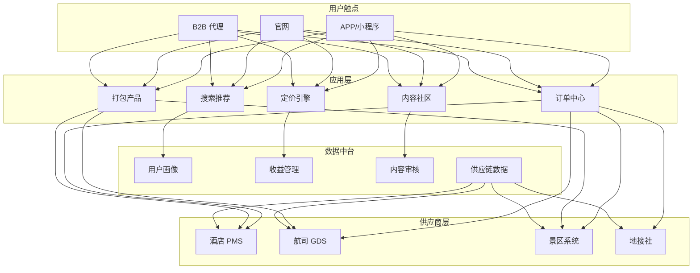
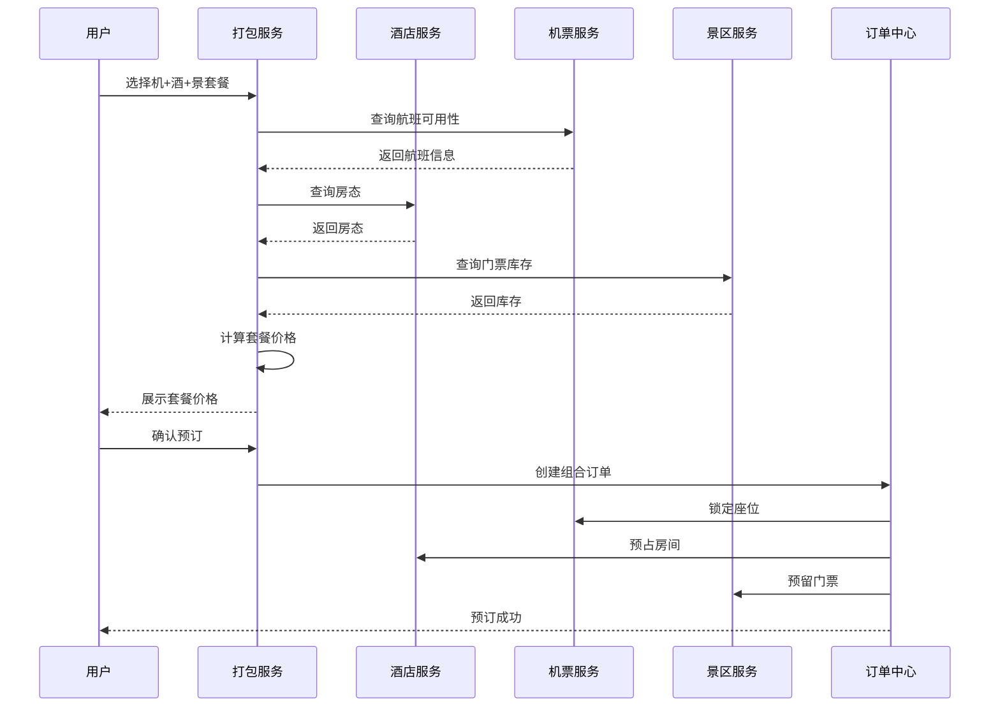
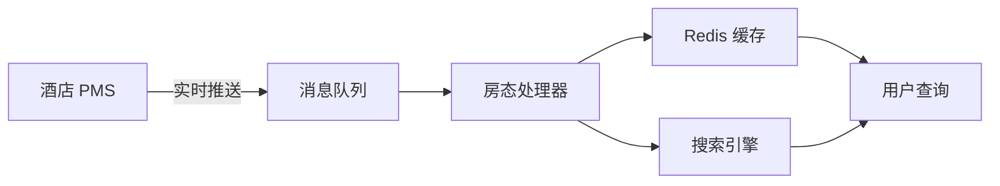

---title: 酒店旅游架构设计 — 阿里云视角
description: 'title: 酒店旅游架构设计'
summary: 'title: 酒店旅游架构设计'
category: general
tags:
- architecture
- best-practice
- redis
- mysql
- elasticsearch
tier: supporting
created: '2026-05-23'
last_updated: 2026-05
difficulty: intermediate
reading_level: intermediate
audience:
- 所有工程师
estimated_read_time: 5min
intent_queries:
- 酒店旅游架构设计 — 阿里云视角 是什么
- 如何 酒店旅游架构设计 — 阿里云视角
- Kubernetes 20 application patterns 最佳实践
trigger_keywords:
- 酒店旅游架构设计
- 阿里云视角
- application
- patterns
prerequisites:
- kubectl-basics
- prometheus-basics
- redis-basics
- mysql-basics
authors:
- name: Dillan Teagle
  role: contributor

---

> **生产环境安全提示**
>
> 本文档包含可直接执行的运维命令。执行前请确认：当前目标集群与 Namespace 是否正确；是否具备足够的 RBAC 权限；是否已在非生产环境验证。命令风险等级标注：🔴 高风险（可能造成数据丢失或服务中断）、🟡 中风险（会修改集群状态，但通常可回滚）、🟢 低风险/只读（信息收集，无副作用）。


title: 酒店旅游架构设计
description: '# 酒店旅游架构设计 — 阿里云视角'
category: application-architecture
tags:
- k8s
- architecture
- industry
- redis
- mysql
- elasticsearch
last_updated: 2026-05-18
difficulty: intermediate
reading_level: intermediate
audience:
- 旅游科技架构师
- 酒店技术负责人
- SRE
estimated_read_time: 5min
intent_queries:
- 酒店旅游 [[Kubernetes|Kubernetes]] 收益管理
- OTA平台 Kubernetes 大促弹性
- 酒店PMS GDS 阿里云架构
- 动态定价收益管理 K8s
- 打包产品订单 K8s 分布式事务
trigger_keywords:
- 酒店
- 旅游
- OTA
- 收益管理
- 动态定价
- 打包产品
- PMS
- GDS
- 阿里云
related_domains:
- domain-01-cluster-fundamentals
- domain-11-production-operations
related_topics:
- 26-aviation-travel
- 32-smart-restaurant
- 01-ecommerce-architecture
k8s_versions:
- '1.28'
- '1.29'
- '1.30'
- '1.31'
- '1.32'
---

# 酒店旅游架构设计 — 阿里云视角

> **适用版本**: Kubernetes v1.29 - v1.33 | **最后更新**: 2026-04-24
> **作者**: 阿里云解决方案架构师 | **标签**: `#酒店` `#旅游` `#OTA` `#收益管理` `#阿里云`

---

## 目录

1. [行业背景](#1-行业背景)
2. [业务架构](#2-业务架构)
3. [技术架构](#3-技术架构)
4. [核心数据流](#4-核心数据流)
5. [安全与合规](#5-安全与合规)
6. [可观测性](#6-可观测性)
7. [阿里云组件映射](#7-阿里云组件映射)
8. [生产检查清单](#8-生产检查清单)

---

## 1. 行业背景

### 1.1 业务特点

酒店旅游行业淡旺季差异大、库存时效性强、价格动态变化：

| 挑战 | 说明 | 架构影响 |
|:---|:---|:---|
| 库存实时性 | 房态/机票库存秒级变化 | 缓存 + 消息同步 |
| 价格动态化 | 收益管理驱动实时变价 | 规则引擎 + 预热 |
| 内容丰富度 | 图片/视频/UGC 海量内容 | CDN + 对象存储 |
| 订单组合 | 机+酒+景打包 | 编排服务 + 事务 |
| 退改灵活 | 多供应商退改规则各异 | 工作流引擎 |

### 1.2 核心场景

- **酒店搜索**: 多维度筛选与智能推荐
- **动态定价**: 基于供需的价格优化
- **打包产品**: 机票+酒店+景点组合
- **订单履约**: 多供应商确认与出单
- **内容社区**: 游记/攻略/点评 UGC

---

## 2. 业务架构

### 2.1 酒店旅游全景架构



### 2.2 打包产品预订时序



---

## 3. 技术架构

### 3.1 K8s 部署

```yaml
# 酒店搜索服务
apiVersion: apps/v1
kind: Deployment
metadata:
  name: hotel-search
  namespace: travel
spec:
  replicas: 8
  selector:
    matchLabels:
      app: hotel-search
  template:
    metadata:
      labels:
        app: hotel-search
    spec:
      containers:
        - name: search
          image: registry.cn-hangzhou.aliyuncs.com/travel/hotel-search:v2.8.0
          ports:
            - containerPort: 8080
          env:
            - name: ELASTICSEARCH_URL
              value: "http://elasticsearch-cluster:9200"
            - name: CACHE_TTL_MINUTES
              value: "5"
          resources:
            requests:
              memory: "2Gi"
              cpu: "1000m"
            limits:
              memory: "4Gi"
              cpu: "2000m"
```

---

## 4. 核心数据流

### 4.1 房态同步流水线



---

## 5. 安全与合规

- **PCI-DSS**: 支付合规
- **个人信息保护**: 旅客信息加密
- **内容审核**: UGC 内容 AI 审核

---

## 6. 可观测性

- **搜索响应**: P99 < 150ms
- **订单成功率**: > 99.5%
- **缓存命中率**: > 85%

---

## 7. 阿里云组件映射

| 功能域 | **阿里云云原生方案** |
|:---|:---|
| 容器平台 | **ACK Pro** |
| 缓存 | **Redis 企业版** |
| 搜索 | **OpenSearch** |
| 对象存储 | **OSS + CDN** |
| 数据库 | **PolarDB MySQL** |
| 消息队列 | **RocketMQ** |
| 可观测性 | **ARMS + SLS** |
| AI 审核 | **阿里云内容安全** |

---

## 8. 生产检查清单

- [ ] 供应商接口连通性验证
- [ ] 房态缓存一致性校验
- [ ] 打包产品价格准确性测试
- [ ] 退改签规则覆盖验证
- [ ] UGC 内容审核准确率 > 99%

---

**维护者**: 阿里云解决方案架构师团队 | **许可证**: MIT

---

## Obsidian 相关文档

- topic-application-architecture KUDIG Database — Global MOC
- [[domain-20-application-patterns/topic-application-architecture/README.md|[[Topic 应用层架构设计最佳实践|Topic 应用层架构设计最佳实践]]]]
- [[domain-20-application-patterns/topic-application-architecture/01-ecommerce-architecture.md|电商系统 Kubernetes 生产架构设计]]
- [[domain-20-application-patterns/topic-application-architecture/02-mini-program-architecture.md|小程序平台架构设计]]
- [[domain-20-application-patterns/topic-application-architecture/03-cms-architecture.md|内容管理系统 CMS 架构设计]]
- [[domain-20-application-patterns/topic-application-architecture/04-im-rtc-architecture.md|实时通信 IM/RTC 架构设计]]
- [[domain-20-application-patterns/topic-application-architecture/05-online-education-architecture.md|在线教育平台 Kubernetes 生产架构设计]]
- [[domain-20-application-patterns/topic-application-architecture/06-fintech-architecture.md|金融科技FinTech Kubernetes生产架构设计]]
- [[domain-20-application-patterns/topic-application-architecture/07-iot-platform-architecture.md|物联网 IoT 平台架构设计]]
- [[domain-20-application-patterns/topic-application-architecture/08-ai-ml-inference-architecture.md|AI/ML 推理服务 Kubernetes 生产架构设计]]
- [[domain-20-application-patterns/topic-application-architecture/09-gaming-backend-architecture.md|游戏后端 Kubernetes 生产架构设计]]
- [[domain-20-application-patterns/topic-application-architecture/10-social-media-architecture.md|社交媒体平台Kubernetes生产架构设计]]

## See Also

- 25-quantitative-trading
- 26-aviation-travel
- 28-proptech
- 29-agritech-iot


<!-- risk-assessed -->
