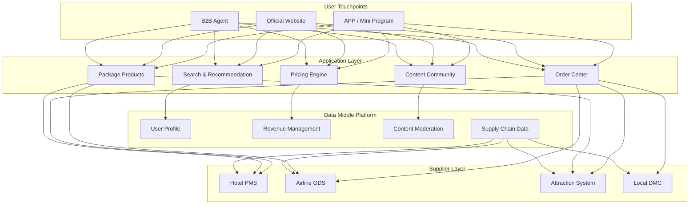
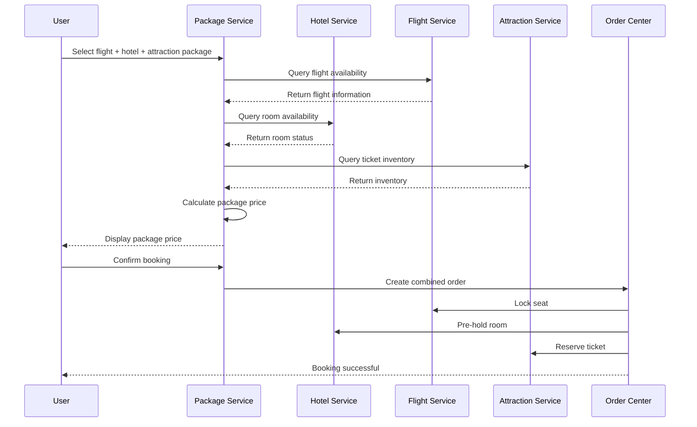
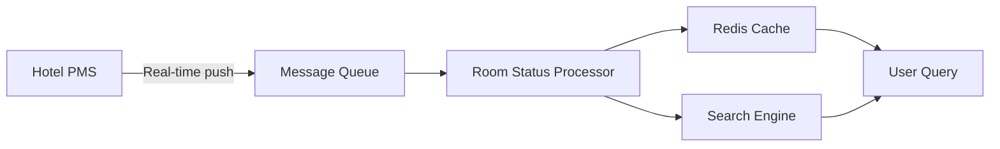

---title: Hotel & Tourism Architecture Design — Alibaba Cloud Perspective
description: 'title: Hotel & Tourism Architecture Design'
summary: 'title: Hotel & Tourism Architecture Design'
category: general
tags:
- architecture
- best-practice
- redis
- mysql
- elasticsearch
tier: supporting
created: '2026-05-23'
last_updated: 2026-05
difficulty: intermediate
reading_level: intermediate
audience:
- All Engineers
estimated_read_time: 5min
intent_queries:
- What is Hotel & Tourism Architecture Design — Alibaba Cloud Perspective
- How to Hotel & Tourism Architecture Design — Alibaba Cloud Perspective
- Kubernetes 20 application patterns best practices
trigger_keywords:
- Hotel & Tourism Architecture Design
- Alibaba Cloud Perspective
- application
- patterns
prerequisites:
- kubectl-basics
- prometheus-basics
- redis-basics
- mysql-basics
authors:
- name: Dillan Teagle
  role: contributor

---

> **Production Environment Safety Notice**
>
> This document contains operational commands that can be executed directly. Before executing, please confirm: whether the current target cluster and Namespace are correct; whether you have sufficient RBAC permissions; whether you have validated in a non-production environment. Command risk levels are marked as: 🔴 High Risk (may cause data loss or service interruption), 🟡 Medium Risk (modifies cluster state, but generally reversible), 🟢 Low Risk / Read-Only (information gathering, no side effects).


title: Hotel & Tourism Architecture Design
description: '# Hotel & Tourism Architecture Design — Alibaba Cloud Perspective'
category: application-architecture
tags:
- k8s
- architecture
- industry
- redis
- mysql
- elasticsearch
last_updated: 2026-05-18
difficulty: intermediate
reading_level: intermediate
audience:
- Travel Tech Architects
- Hotel Technology Leads
- SRE
estimated_read_time: 5min
intent_queries:
- Hotel & Tourism [[Kubernetes|Kubernetes]] Revenue Management
- OTA Platform Kubernetes Promotional Elasticity
- Hotel PMS GDS Alibaba Cloud Architecture
- Dynamic Pricing Revenue Management K8s
- Package Product Orders K8s Distributed Transactions
trigger_keywords:
- Hotel
- Tourism
- OTA
- Revenue Management
- Dynamic Pricing
- Package Products
- PMS
- GDS
- Alibaba Cloud
related_domains:
- domain-01-cluster-fundamentals
- domain-11-production-operations
related_topics:
- 26-aviation-travel
- 32-smart-restaurant
- 01-ecommerce-architecture
k8s_versions:
- '1.28'
- '1.29'
- '1.30'
- '1.31'
- '1.32'
---

# Hotel & Tourism Architecture Design — Alibaba Cloud Perspective

> **Applicable Versions**: Kubernetes v1.29 - v1.33 | **Last Updated**: 2026-04-24
> **Author**: Alibaba Cloud Solutions Architect | **Tags**: `#Hotel` `#Tourism` `#OTA` `#RevenueManagement` `#AlibabaCloud`

---

## Table of Contents

1. [Industry Background](#1-industry-background)
2. [Business Architecture](#2-business-architecture)
3. [Technical Architecture](#3-technical-architecture)
4. [Core Data Flows](#4-core-data-flow)
5. [Security & Compliance](#5-security-compliance)
6. [Observability](#6-observability)
7. [Alibaba Cloud Component Mapping](#7-alibaba-cloud-component-mapping)
8. [Production Checklist](#8-production-checklist)

---

## 1. Industry Background

### 1.1 Business Characteristics

The hotel and tourism industry features significant seasonal variation, strong inventory time-sensitivity, and dynamic price changes:

| Challenge | Description | Architectural Impact |
|:---|:---|:---|
| Inventory Real-Time Updates | Room status / flight inventory changes at the second level | Cache + message synchronization |
| Dynamic Pricing | Revenue management drives real-time price changes | Rules engine + pre-warming |
| Content Richness | Massive images / videos / UGC content | CDN + object storage |
| Order Bundling | Flight + hotel + attraction packages | Orchestration service + transactions |
| Flexible Refund/Change | Multi-supplier refund/change rules vary | Workflow engine |

### 1.2 Core Scenarios

- **Hotel Search**: Multi-dimensional filtering and intelligent recommendations
- **Dynamic Pricing**: Price optimization based on supply and demand
- **Package Products**: Flight + hotel + attraction combinations
- **Order Fulfillment**: Multi-supplier confirmation and ticket issuance
- **Content Community**: Travel notes / guides / reviews UGC

---

## 2. Business Architecture

### 2.1 Hotel & Tourism Full Landscape Architecture


```mermaid
graph TB
    subgraph User Touchpoints
        U1[APP / Mini Program]
        U2[Official Website]
        U3[B2B Agent]
    end

    subgraph Application Layer
        A1[Search & Recommendation]
        A2[Pricing Engine]
        A3[Order Center]
        A4[Package Products]
        A5[Content Community]
    end

    subgraph Supplier Layer
        S1[Hotel PMS]
        S2[Airline GDS]
        S3[Attraction System]
        S4[Local DMC]
    end

    subgraph Data Middle Platform
        D1[User Profile]
        D2[Revenue Management]
        D3[Content Moderation]
        D4[Supply Chain Data]
    end

    U1 & U2 & U3 --> A1 & A2 & A3 & A4 & A5
    A1 --> D1
    A2 --> D2
    A3 --> S1 & S2 & S3 & S4
    A4 --> S1 & S2 & S3
    A5 --> D3
    D4 --> S1 & S2 & S3 & S4
```

### 2.2 Package Product Booking Sequence


```mermaid
sequenceDiagram
    participant USER as User
    participant PKG as Package Service
    participant HOTEL as Hotel Service
    participant FLIGHT as Flight Service
    participant SCENE as Attraction Service
    participant ORDER as Order Center

    USER->>PKG: Select flight + hotel + attraction package
    PKG->>FLIGHT: Query flight availability
    FLIGHT-->>PKG: Return flight information
    PKG->>HOTEL: Query room availability
    HOTEL-->>PKG: Return room status
    PKG->>SCENE: Query ticket inventory
    SCENE-->>PKG: Return inventory
    PKG->>PKG: Calculate package price
    PKG-->>USER: Display package price
    USER->>PKG: Confirm booking
    PKG->>ORDER: Create combined order
    ORDER->>FLIGHT: Lock seat
    ORDER->>HOTEL: Pre-hold room
    ORDER->>SCENE: Reserve ticket
    ORDER-->>USER: Booking successful
```

---
## 3. Technical Architecture

### 3.1 K8s Deployment

```yaml
# Hotel search service
apiVersion: apps/v1
kind: Deployment
metadata:
  name: hotel-search
  namespace: travel
spec:
  replicas: 8
  selector:
    matchLabels:
      app: hotel-search
  template:
    metadata:
      labels:
        app: hotel-search
    spec:
      containers:
        - name: search
          image: registry.cn-hangzhou.aliyuncs.com/travel/hotel-search:v2.8.0
          ports:
            - containerPort: 8080
          env:
            - name: ELASTICSEARCH_URL
              value: "http://elasticsearch-cluster:9200"
            - name: CACHE_TTL_MINUTES
              value: "5"
          resources:
            requests:
              memory: "2Gi"
              cpu: "1000m"
            limits:
              memory: "4Gi"
              cpu: "2000m"
```

---

## 4. Core Data Flow

### 4.1 Room Availability Sync Pipeline


```mermaid
flowchart LR
    A[Hotel PMS] -->|Real-time push| B[Message Queue]
    B --> C[Room Status Processor]
    C --> D[Redis Cache]
    C --> E[Search Engine]
    D --> F[User Query]
    E --> F
```

---

## 5. Security & Compliance

- **PCI-DSS**: Payment compliance
- **Personal Information Protection**: Traveler information encryption
- **Content Moderation**: AI moderation for UGC content

---

## 6. Observability

- **Search Response**: P99 < 150ms
- **Order Success Rate**: > 99.5%
- **Cache Hit Rate**: > 85%

---

## 7. Alibaba Cloud Component Mapping

| Functional Domain | **Alibaba Cloud Native Solution** |
|:---|:---|
| Container Platform | **ACK Pro** |
| Cache | **Redis Enterprise Edition** |
| Search | **OpenSearch** |
| Object Storage | **OSS + CDN** |
| Database | **PolarDB MySQL** |
| Message Queue | **RocketMQ** |
| Observability | **ARMS + SLS** |
| AI Moderation | **Alibaba Cloud Content Safety** |

---

## 8. Production Checklist

- [ ] Supplier interface connectivity verification
- [ ] Room availability cache consistency validation
- [ ] Package product pricing accuracy testing
- [ ] Cancellation and modification policy coverage verification
- [ ] UGC content moderation accuracy > 99%

---

**Maintainer**: Alibaba Cloud Solutions Architect Team | **License**: MIT

---

## Obsidian Related Documents

- topic-application-architecture KUDIG Database — Global MOC
- [[domain-20-application-patterns/topic-application-architecture/README.md|[[Topic Application Layer Architecture Design Best Practices|Topic Application Layer Architecture Design Best Practices]]]]
- [[domain-20-application-patterns/topic-application-architecture/01-ecommerce-architecture.md|E-commerce System Kubernetes Production Architecture Design]]
- [[domain-20-application-patterns/topic-application-architecture/02-mini-program-architecture.md|Mini Program Platform Architecture Design]]
- [[domain-20-application-patterns/topic-application-architecture/03-cms-architecture.md|Content Management System CMS Architecture Design]]
- [[domain-20-application-patterns/topic-application-architecture/04-im-rtc-architecture.md|Real-time Communication IM/RTC Architecture Design]]
- [[domain-20-application-patterns/topic-application-architecture/05-online-education-architecture.md|Online Education Platform Kubernetes Production Architecture Design]]
- [[domain-20-application-patterns/topic-application-architecture/06-fintech-architecture.md|FinTech Kubernetes Production Architecture Design]]
- [[domain-20-application-patterns/topic-application-architecture/07-iot-platform-architecture.md|IoT Platform Architecture Design]]
- [[domain-20-application-patterns/topic-application-architecture/08-ai-ml-inference-architecture.md|AI/ML Inference Service Kubernetes Production Architecture Design]]
- [[domain-20-application-patterns/topic-application-architecture/09-gaming-backend-architecture.md|Gaming Backend Kubernetes Production Architecture Design]]
- [[domain-20-application-patterns/topic-application-architecture/10-social-media-architecture.md|Social Media Platform Kubernetes Production Architecture Design]]

## See Also

- 25-quantitative-trading
- 26-aviation-travel
- 28-proptech
- 29-agritech-iot


<!-- risk-assessed -->
