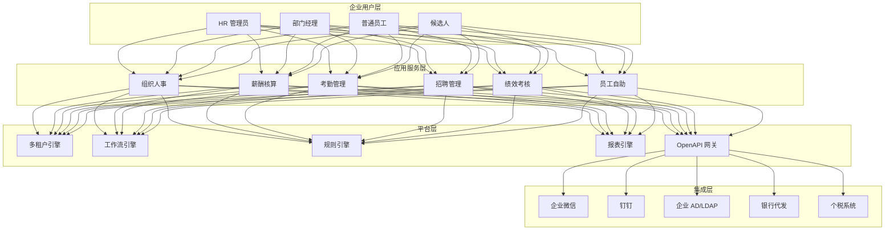
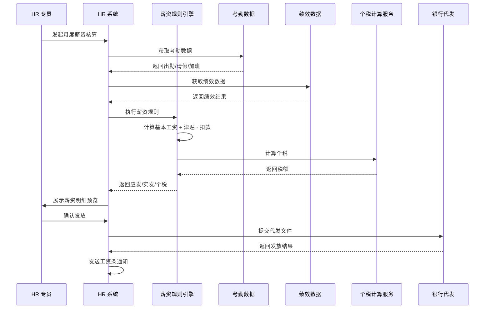
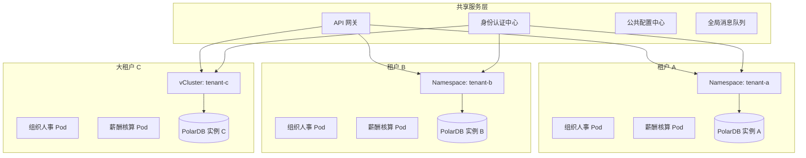
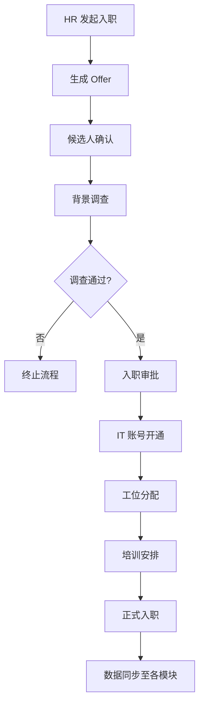
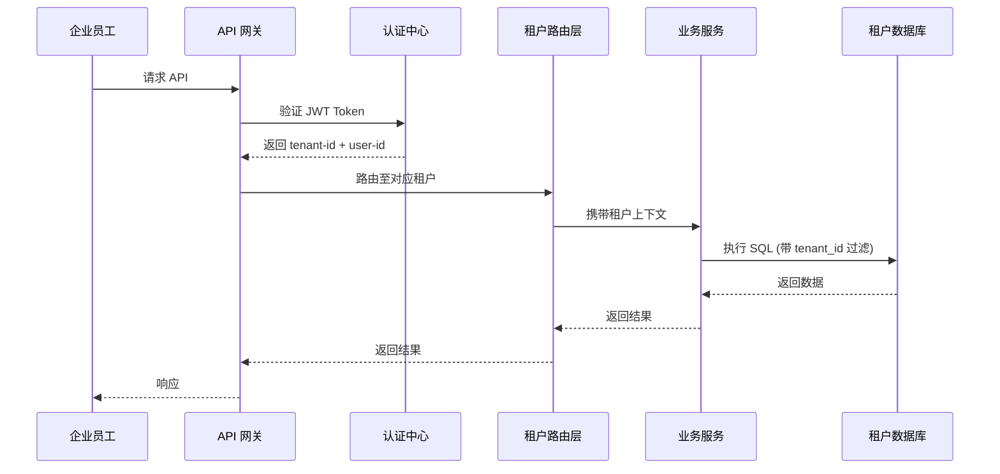

---title: 人力资源 SaaS 架构设计 — 阿里云视角
description: 'title: 人力资源 SaaS 架构设计'
summary: 'title: 人力资源 SaaS 架构设计'
category: general
tags:
- architecture
- best-practice
- redis
- mysql
- hpa
- job
- cronjob
- ingress
- networkpolicy
- webhook
tier: supporting
created: '2026-05-23'
last_updated: 2026-05
difficulty: intermediate
reading_level: intermediate
audience:
- 所有工程师
estimated_read_time: 15min
intent_queries:
- 人力资源 SaaS 架构设计 — 阿里云视角 是什么
- 如何 人力资源 SaaS 架构设计 — 阿里云视角
- Kubernetes 20 application patterns 最佳实践
trigger_keywords:
- 人力资源
- SaaS
- 架构设计
- 阿里云视角
- application
- patterns
prerequisites:
- kubectl-basics
- prometheus-basics
- redis-basics
- mysql-basics
authors:
- name: Dillan Teagle
  role: contributor

---

> **生产环境安全提示**
>
> 本文档包含可直接执行的运维命令。执行前请确认：当前目标集群与 Namespace 是否正确；是否具备足够的 RBAC 权限；是否已在非生产环境验证。命令风险等级标注：🔴 高风险（可能造成数据丢失或服务中断）、🟡 中风险（会修改集群状态，但通常可回滚）、🟢 低风险/只读（信息收集，无副作用）。


title: 人力资源 SaaS 架构设计
description: '# 人力资源 SaaS 架构设计 — 阿里云视角'
category: application-architecture
tags:
- k8s
- architecture
- industry
- redis
- mysql
- hpa
- job
- [[CronJob|cronjob]]
- [[Ingress|ingress]]
- [[NetworkPolicy|networkpolicy]]
last_updated: 2026-05-18
difficulty: advanced
reading_level: advanced
audience:
- HR SaaS架构师
- 多租户平台工程师
- 企业数字化转型负责人
estimated_read_time: 5min
intent_queries:
- HR SaaS 多租户 Kubernetes 隔离架构
- 薪资计算 CronJob 定时任务
- 多租户数据安全与脱敏
- 工作流引擎审批流程
- 阿里云 ACK vCluster
trigger_keywords:
- HRTech
- 人力资源SaaS
- 多租户隔离
- 薪资计算
- 考勤管理
- 招聘管理
- 绩效考核
- vCluster
- 薪资保密
- 数据脱敏
related_domains:
- domain-03-networking-traffic
- domain-10-troubleshooting-diagnostics
related_topics:
- topic-saas-architecture
- topic-platform-architecture
k8s_versions:
- '1.28'
- '1.29'
- '1.30'
- '1.31'
- '1.32'
---

# 人力资源 SaaS 架构设计 — 阿里云视角

> **适用版本**: Kubernetes v1.29 - v1.33 | **最后更新**: 2026-04-24
> **作者**: 阿里云解决方案架构师 | **标签**: `#HRTech` `#SaaS` `#多租户` `#人力资源` `#阿里云`

---

## 目录

1. [行业背景](#1-行业背景)
2. [业务架构](#2-业务架构)
3. [技术架构](#3-技术架构)
4. [核心数据流](#4-核心数据流)
5. [安全与合规](#5-安全与合规)
6. [可观测性](#6-可观测性)
7. [阿里云组件映射](#7-阿里云组件映射)
8. [生产检查清单](#8-生产检查清单)

---

## 1. 行业背景

### 1.1 业务特点

人力资源 SaaS 面临多租户隔离、数据敏感、流程复杂等挑战：

| 挑战 | 说明 | 架构影响 |
|:---|:---|:---|
| 多租户隔离 | 企业数据严格隔离 | vCluster/Namespace 隔离 |
| 数据敏感 | 薪资/绩效/个人隐私 | 加密 + 脱敏 + 审计 |
| 流程复杂 | 入职/离职/调岗审批流 | 工作流引擎 |
| 集成需求 | 对接企业微信/钉钉/AD | OpenAPI + Webhook |
| 合规要求 | 劳动法/个税/社保 | 规则引擎 + 计算引擎 |

### 1.2 核心场景

- **组织人事**: 员工生命周期管理
- **薪酬核算**: 复杂薪资规则计算
- **考勤管理**: 多班次/多地点打卡
- **招聘管理**: 从简历到 Offer 全流程
- **绩效考核**: OKR/KPI 多维度评估
- **员工服务**: 自助查询/证明开具

---

## 2. 业务架构

### 2.1 HR SaaS 全景架构



### 2.2 薪资核算时序



---

## 3. 技术架构

### 3.1 多租户 K8s 架构



### 3.2 K8s YAML 配置

```yaml
# 多租户 Namespace 隔离
apiVersion: v1
kind: Namespace
metadata:
  name: tenant-example-corp
  labels:
    tenant-id: "T10086"
    tenant-tier: "enterprise"
    pod-security.kubernetes.io/enforce: restricted
---
# 租户 ResourceQuota
apiVersion: v1
kind: ResourceQuota
metadata:
  name: tenant-example-quota
  namespace: tenant-example-corp
spec:
  hard:
    requests.cpu: "20"
    requests.memory: 40Gi
    limits.cpu: "40"
    limits.memory: 80Gi
    pods: "50"
    services: "20"
    persistentvolumeclaims: "10"
---
# 租户 NetworkPolicy
apiVersion: networking.k8s.io/v1
kind: NetworkPolicy
metadata:
  name: tenant-example-isolation
  namespace: tenant-example-corp
spec:
  podSelector: {}
  policyTypes:
    - Ingress
    - Egress
  ingress:
    - from:
        - namespaceSelector:
            matchLabels:
              name: hr-platform-shared
      ports:
        - protocol: TCP
          port: 8080
  egress:
    - to:
        - podSelector:
            matchLabels:
              tenant-db: "T10086"
      ports:
        - protocol: TCP
          port: 3306
    - to:
        - namespaceSelector:
            matchLabels:
              name: hr-platform-shared
      ports:
        - protocol: TCP
          port: 9092
```

```yaml
# 薪酬计算 CronJob
apiVersion: batch/v1
kind: CronJob
metadata:
  name: payroll-calculation
  namespace: tenant-example-corp
spec:
  schedule: "0 2 1 * *"  # 每月 1 日凌晨 2 点
  concurrencyPolicy: Forbid
  jobTemplate:
    spec:
      template:
        spec:
          containers:
            - name: payroll
              image: registry.cn-hangzhou.aliyuncs.com/hrtech/payroll:v3.2.0
              env:
                - name: TENANT_ID
                  value: "T10086"
                - name: PAYROLL_MONTH
                  value: "2026-04"
                - name: DB_HOST
                  valueFrom:
                    secretKeyRef:
                      name: tenant-db-secret
                      key: host
              resources:
                requests:
                  memory: "4Gi"
                  cpu: "2000m"
                limits:
                  memory: "8Gi"
                  cpu: "4000m"
              volumeMounts:
                - name: payroll-config
                  mountPath: /app/config
          volumes:
            - name: payroll-config
              configMap:
                name: tenant-payroll-rules
          restartPolicy: OnFailure
```

```yaml
# HPA for 工作日高峰期
apiVersion: autoscaling/v2
kind: HorizontalPodAutoscaler
metadata:
  name: hr-self-service-hpa
  namespace: tenant-example-corp
spec:
  scaleTargetRef:
    apiVersion: apps/v1
    kind: Deployment
    name: hr-self-service
  minReplicas: 2
  maxReplicas: 20
  metrics:
    - type: Resource
      resource:
        name: cpu
        target:
          type: Utilization
          averageUtilization: 70
  behavior:
    scaleUp:
      stabilizationWindowSeconds: 60
      policies:
        - type: Percent
          value: 100
          periodSeconds: 60
    scaleDown:
      stabilizationWindowSeconds: 300
      policies:
        - type: Percent
          value: 10
          periodSeconds: 60
```

---

## 4. 核心数据流

### 4.1 员工入职流程



### 4.2 多租户数据隔离



---

## 5. 安全与合规

### 5.1 数据安全策略

```yaml
apiVersion: v1
kind: ConfigMap
metadata:
  name: data-masking-rules
  namespace: hr-platform
data:
  rules.yaml: |
    masking_rules:
      - field: "id_card"
        pattern: "(\d{6})\d{8}(\d{4})"
        replacement: "$1********$2"
      - field: "phone"
        pattern: "(\d{3})\d{4}(\d{4})"
        replacement: "$1****$2"
      - field: "salary"
        role_mask:
          employee: "****"
          manager: "show"
          hr: "show"
      - field: "bank_account"
        pattern: "\d{4}(\d+)\d{4}"
        replacement: "****$1****"
```

---

## 6. 可观测性

- **薪资计算**: 1000人企业 < 5 分钟
- **系统可用性**: 99.99%（发薪日保障）
- **多租户隔离**: 跨租户数据零泄露

---

## 7. 阿里云组件映射

| 功能域 | **阿里云云原生方案** |
|:---|:---|
| 容器平台 | **ACK Pro** |
| 多租户 | **ACK + vCluster** |
| 数据库 | **PolarDB MySQL** |
| 缓存 | **Redis 企业版** |
| 消息队列 | **RocketMQ** |
| 对象存储 | **OSS** |
| 可观测性 | **ARMS + SLS** |
| 身份认证 | **阿里云 RAM / IDaaS** |
| 安全 | **云盾 + KMS + WAF** |

---

## 8. 生产检查清单

- [ ] 多租户数据隔离验证
- [ ] 薪资计算准确性 100% 校验
- [ ] 个税计算与税务局系统比对
- [ ] 银行代发文件格式验证
- [ ] 数据脱敏规则全覆盖
- [ ] 等保三级/个人信息保护法合规

---

**维护者**: 阿里云解决方案架构师团队 | **许可证**: MIT

---

## Obsidian 相关文档

- topic-application-architecture MOC
- [[domain-20-application-patterns/topic-application-architecture/README.md|Topic 应用层架构设计最佳实践]]
- [[domain-20-application-patterns/topic-application-architecture/01-ecommerce-architecture.md|电商系统 Kubernetes 生产架构设计]]
- [[domain-20-application-patterns/topic-application-architecture/02-mini-program-architecture.md|小程序平台架构设计]]
- [[domain-20-application-patterns/topic-application-architecture/03-cms-architecture.md|内容管理系统 CMS 架构设计]]
- [[domain-20-application-patterns/topic-application-architecture/04-im-rtc-architecture.md|实时通信 IM/RTC 架构设计]]
- [[domain-20-application-patterns/topic-application-architecture/05-online-education-architecture.md|在线教育平台 Kubernetes 生产架构设计]]
- [[domain-20-application-patterns/topic-application-architecture/06-fintech-architecture.md|金融科技FinTech Kubernetes生产架构设计]]
- [[domain-20-application-patterns/topic-application-architecture/07-iot-platform-architecture.md|物联网 IoT 平台架构设计]]
- [[domain-20-application-patterns/topic-application-architecture/08-ai-ml-inference-architecture.md|AI/ML 推理服务 Kubernetes 生产架构设计]]
- [[domain-20-application-patterns/topic-application-architecture/09-gaming-backend-architecture.md|游戏后端 Kubernetes 生产架构设计]]
- [[domain-20-application-patterns/topic-application-architecture/10-social-media-architecture.md|社交媒体平台Kubernetes生产架构设计]]

## See Also

- 28-proptech
- 29-agritech-iot
- 31-instant-retail
- 32-smart-restaurant


<!-- risk-assessed -->
