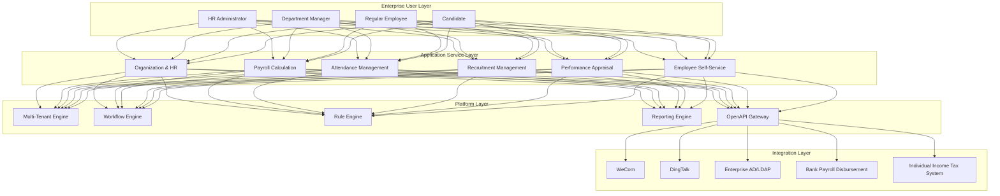
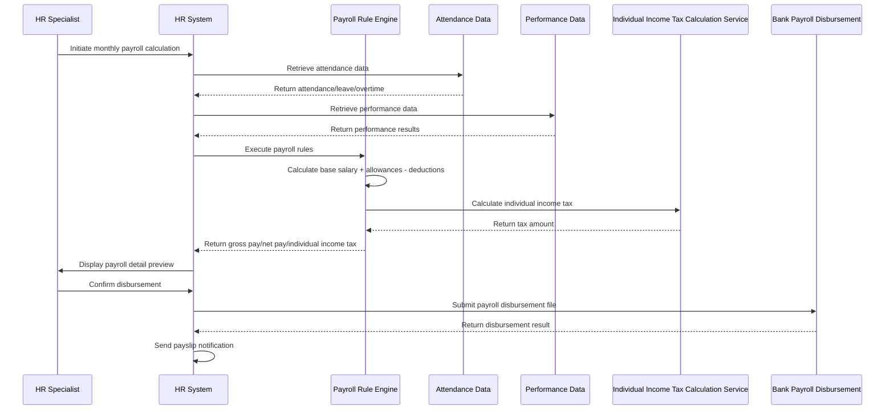
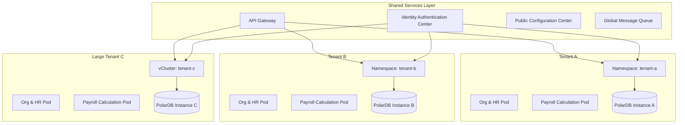
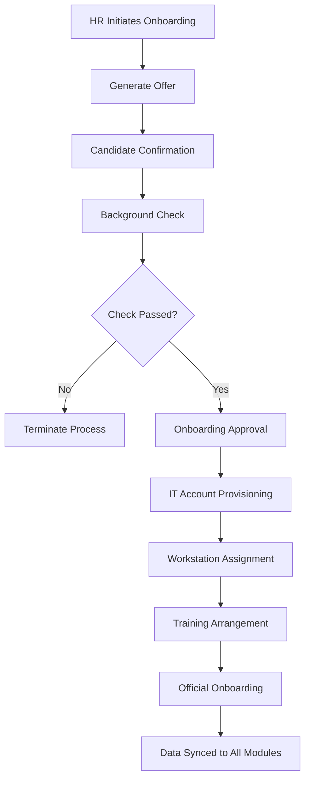
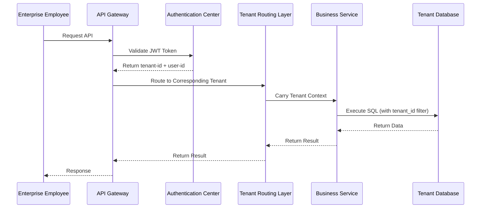

---title: HR SaaS Architecture Design — Alibaba Cloud Perspective
description: 'title: HR SaaS Architecture Design'
summary: 'title: HR SaaS Architecture Design'
category: general
tags:
- architecture
- best-practice
- redis
- mysql
- hpa
- job
- cronjob
- ingress
- networkpolicy
- webhook
tier: supporting
created: '2026-05-23'
last_updated: 2026-05
difficulty: intermediate
reading_level: intermediate
audience:
- All Engineers
estimated_read_time: 15min
intent_queries:
- What is HR SaaS Architecture Design — Alibaba Cloud Perspective
- How to HR SaaS Architecture Design — Alibaba Cloud Perspective
- Kubernetes 20 application patterns best practices
trigger_keywords:
- Human Resources
- SaaS
- Architecture Design
- Alibaba Cloud Perspective
- application
- patterns
prerequisites:
- kubectl-basics
- prometheus-basics
- redis-basics
- mysql-basics
authors:
- name: Dillan Teagle
  role: contributor

---

> **Production Environment Safety Notice**
>
> This document contains operational commands that can be executed directly. Before executing, please confirm: whether the current target cluster and Namespace are correct; whether you have sufficient RBAC permissions; whether validation has been performed in a non-production environment. Command risk levels are marked as: 🔴 High Risk (may cause data loss or service interruption), 🟡 Medium Risk (will modify cluster state, but generally reversible), 🟢 Low Risk / Read-Only (information gathering, no side effects).


title: HR SaaS Architecture Design
description: '# HR SaaS Architecture Design — Alibaba Cloud Perspective'
category: application-architecture
tags:
- k8s
- architecture
- industry
- redis
- mysql
- hpa
- job
- [[CronJob|cronjob]]
- [[Ingress|ingress]]
- [[NetworkPolicy|networkpolicy]]
last_updated: 2026-05-18
difficulty: advanced
reading_level: advanced
audience:
- HR SaaS Architects
- Multi-tenant Platform Engineers
- Enterprise Digital Transformation Leads
estimated_read_time: 5min
intent_queries:
- HR SaaS multi-tenant Kubernetes isolation architecture
- Payroll calculation CronJob scheduled tasks
- Multi-tenant data security and desensitization
- Workflow engine approval processes
- Alibaba Cloud ACK vCluster
trigger_keywords:
- HRTech
- HR SaaS
- Multi-tenant isolation
- Payroll calculation
- Attendance management
- Recruitment management
- Performance appraisal
- vCluster
- Payroll confidentiality
- Data desensitization
related_domains:
- domain-03-networking-traffic
- domain-10-troubleshooting-diagnostics
related_topics:
- topic-saas-architecture
- topic-platform-architecture
k8s_versions:
- '1.28'
- '1.29'
- '1.30'
- '1.31'
- '1.32'
---
# Human Resources SaaS Architecture Design — Alibaba Cloud Perspective

> **Applicable Version**: Kubernetes v1.29 - v1.33 | **Last Updated**: 2026-04-24
> **Author**: Alibaba Cloud Solutions Architect | **Tags**: `#HRTech` `#SaaS` `#MultiTenant` `#HumanResources` `#AlibabaCloud`

---

## Table of Contents

1. [Industry Background](#1-industry-background)
2. [Business Architecture](#2-business-architecture)
3. [Technical Architecture](#3-technical-architecture)
4. [Core Data Flow](#4-core-data-flows)
5. [Security and Compliance](#5-security-and-compliance)
6. [Observability](#6-observability)
7. [Alibaba Cloud Component Mapping](#7-alibaba-cloud-component-mapping)
8. [Production Checklist](#8-production-checklist)

---

## 1. Industry Background

### 1.1 Business Characteristics

HR SaaS faces challenges such as multi-tenant isolation, data sensitivity, and complex processes:

| Challenge | Description | Architectural Impact |
|:---|:---|:---|
| Multi-tenant Isolation | Strict enterprise data isolation | vCluster/Namespace isolation |
| Data Sensitivity | Payroll/performance/personal privacy | Encryption + Desensitization + Audit |
| Process Complexity | Onboarding/offboarding/transfer approval workflows | Workflow engine |
| Integration Requirements | Integration with WeCom/DingTalk/AD | OpenAPI + Webhook |
| Compliance Requirements | Labor law/individual income tax/social insurance | Rule engine + Calculation engine |

### 1.2 Core Scenarios

- **Organization & HR**: Employee lifecycle management
- **Payroll Calculation**: Complex payroll rule computation
- **Attendance Management**: Multi-shift/multi-location check-in
- **Recruitment Management**: Full process from resume to offer
- **Performance Appraisal**: Multi-dimensional OKR/KPI evaluation
- **Employee Self-Service**: Self-service inquiries/certificate issuance

---

## 2. Business Architecture

### 2.1 HR SaaS Overview Architecture


```mermaid
graph TB
    subgraph Enterprise User Layer
        U1[HR Administrator]
        U2[Department Manager]
        U3[Regular Employee]
        U4[Candidate]
    end

    subgraph Application Service Layer
        A1[Organization & HR]
        A2[Payroll Calculation]
        A3[Attendance Management]
        A4[Recruitment Management]
        A5[Performance Appraisal]
        A6[Employee Self-Service]
    end

    subgraph Platform Layer
        P1[Multi-Tenant Engine]
        P2[Workflow Engine]
        P3[Rule Engine]
        P4[Reporting Engine]
        P5[OpenAPI Gateway]
    end

    subgraph Integration Layer
        I1[WeCom]
        I2[DingTalk]
        I3[Enterprise AD/LDAP]
        I4[Bank Payroll Disbursement]
        I5[Individual Income Tax System]
    end

    U1 & U2 & U3 & U4 --> A1 & A2 & A3 & A4 & A5 & A6
    A1 & A2 & A3 & A4 & A5 & A6 --> P1 & P2 & P3 & P4 & P5
    P5 --> I1 & I2 & I3 & I4 & I5
```

### 2.2 Payroll Calculation Sequence


```mermaid
sequenceDiagram
    participant HR as HR Specialist
    participant SYS as HR System
    participant RULE as Payroll Rule Engine
    participant ATT as Attendance Data
    participant PERF as Performance Data
    participant TAX as Individual Income Tax Calculation Service
    participant BANK as Bank Payroll Disbursement

    HR->>SYS: Initiate monthly payroll calculation
    SYS->>ATT: Retrieve attendance data
    ATT-->>SYS: Return attendance/leave/overtime
    SYS->>PERF: Retrieve performance data
    PERF-->>SYS: Return performance results
    SYS->>RULE: Execute payroll rules
    RULE->>RULE: Calculate base salary + allowances - deductions
    RULE->>TAX: Calculate individual income tax
    TAX-->>RULE: Return tax amount
    RULE-->>SYS: Return gross pay/net pay/individual income tax
    SYS->>HR: Display payroll detail preview
    HR->>SYS: Confirm disbursement
    SYS->>BANK: Submit payroll disbursement file
    BANK-->>SYS: Return disbursement result
    SYS->>SYS: Send payslip notification
```

---
## 3. Technical Architecture

### 3.1 Multi-Tenant K8s Architecture


```mermaid
graph TB
    subgraph Shared Services Layer
        S1[API Gateway]
        S2[Identity Authentication Center]
        S3[Public Configuration Center]
        S4[Global Message Queue]
    end

    subgraph Tenant A
        A_NS[Namespace: tenant-a]
        A_APP1[Org & HR Pod]
        A_APP2[Payroll Calculation Pod]
        A_DB[(PolarDB Instance A)]
    end

    subgraph Tenant B
        B_NS[Namespace: tenant-b]
        B_APP1[Org & HR Pod]
        B_APP2[Payroll Calculation Pod]
        B_DB[(PolarDB Instance B)]
    end

    subgraph Large Tenant C
        C_VC[vCluster: tenant-c]
        C_APP1[Org & HR Pod]
        C_APP2[Payroll Calculation Pod]
        C_DB[(PolarDB Instance C)]
    end

    S1 --> A_NS & B_NS & C_VC
    S2 --> A_NS & B_NS & C_VC
    A_NS --> A_DB
    B_NS --> B_DB
    C_VC --> C_DB
```

### 3.2 K8s YAML Configuration

```yaml
# Multi-tenant Namespace isolation
apiVersion: v1
kind: Namespace
metadata:
  name: tenant-example-corp
  labels:
    tenant-id: "T10086"
    tenant-tier: "enterprise"
    pod-security.kubernetes.io/enforce: restricted
---
# Tenant ResourceQuota
apiVersion: v1
kind: ResourceQuota
metadata:
  name: tenant-example-quota
  namespace: tenant-example-corp
spec:
  hard:
    requests.cpu: "20"
    requests.memory: 40Gi
    limits.cpu: "40"
    limits.memory: 80Gi
    pods: "50"
    services: "20"
    persistentvolumeclaims: "10"
---
# Tenant NetworkPolicy
apiVersion: networking.k8s.io/v1
kind: NetworkPolicy
metadata:
  name: tenant-example-isolation
  namespace: tenant-example-corp
spec:
  podSelector: {}
  policyTypes:
    - Ingress
    - Egress
  ingress:
    - from:
        - namespaceSelector:
            matchLabels:
              name: hr-platform-shared
      ports:
        - protocol: TCP
          port: 8080
  egress:
    - to:
        - podSelector:
            matchLabels:
              tenant-db: "T10086"
      ports:
        - protocol: TCP
          port: 3306
    - to:
        - namespaceSelector:
            matchLabels:
              name: hr-platform-shared
      ports:
        - protocol: TCP
          port: 9092
```

```yaml
# Payroll Calculation CronJob
apiVersion: batch/v1
kind: CronJob
metadata:
  name: payroll-calculation
  namespace: tenant-example-corp
spec:
  schedule: "0 2 1 * *"  # 2:00 AM on the 1st of every month
  concurrencyPolicy: Forbid
  jobTemplate:
    spec:
      template:
        spec:
          containers:
            - name: payroll
              image: registry.cn-hangzhou.aliyuncs.com/hrtech/payroll:v3.2.0
              env:
                - name: TENANT_ID
                  value: "T10086"
                - name: PAYROLL_MONTH
                  value: "2026-04"
                - name: DB_HOST
                  valueFrom:
                    secretKeyRef:
                      name: tenant-db-secret
                      key: host
              resources:
                requests:
                  memory: "4Gi"
                  cpu: "2000m"
                limits:
                  memory: "8Gi"
                  cpu: "4000m"
              volumeMounts:
                - name: payroll-config
                  mountPath: /app/config
          volumes:
            - name: payroll-config
              configMap:
                name: tenant-payroll-rules
          restartPolicy: OnFailure
```

```yaml
# HPA for weekday peak hours
apiVersion: autoscaling/v2
kind: HorizontalPodAutoscaler
metadata:
  name: hr-self-service-hpa
  namespace: tenant-example-corp
spec:
  scaleTargetRef:
    apiVersion: apps/v1
    kind: Deployment
    name: hr-self-service
  minReplicas: 2
  maxReplicas: 20
  metrics:
    - type: Resource
      resource:
        name: cpu
        target:
          type: Utilization
          averageUtilization: 70
  behavior:
    scaleUp:
      stabilizationWindowSeconds: 60
      policies:
        - type: Percent
          value: 100
          periodSeconds: 60
    scaleDown:
      stabilizationWindowSeconds: 300
      policies:
        - type: Percent
          value: 10
          periodSeconds: 60
```

---
## 4. Core Data Flows

### 4.1 Employee Onboarding Process


```mermaid
flowchart TD
    A[HR Initiates Onboarding] --> B[Generate Offer]
    B --> C[Candidate Confirmation]
    C --> D[Background Check]
    D --> E{Check Passed?}
    E -->|No| F[Terminate Process]
    E -->|Yes| G[Onboarding Approval]
    G --> H[IT Account Provisioning]
    H --> I[Workstation Assignment]
    I --> J[Training Arrangement]
    J --> K[Official Onboarding]
    K --> L[Data Synced to All Modules]
```

### 4.2 Multi-Tenant Data Isolation


```mermaid
sequenceDiagram
    participant USER as Enterprise Employee
    participant GW as API Gateway
    participant AUTH as Authentication Center
    participant TENANT as Tenant Routing Layer
    participant APP as Business Service
    participant DB as Tenant Database

    USER->>GW: Request API
    GW->>AUTH: Validate JWT Token
    AUTH-->>GW: Return tenant-id + user-id
    GW->>TENANT: Route to Corresponding Tenant
    TENANT->>APP: Carry Tenant Context
    APP->>DB: Execute SQL (with tenant_id filter)
    DB-->>APP: Return Data
    APP-->>TENANT: Return Result
    TENANT-->>GW: Return Result
    GW-->>USER: Response
```

---

## 5. Security and Compliance

### 5.1 Data Security Policy

```yaml
apiVersion: v1
kind: ConfigMap
metadata:
  name: data-masking-rules
  namespace: hr-platform
data:
  rules.yaml: |
    masking_rules:
      - field: "id_card"
        pattern: "(\d{6})\d{8}(\d{4})"
        replacement: "$1********$2"
      - field: "phone"
        pattern: "(\d{3})\d{4}(\d{4})"
        replacement: "$1****$2"
      - field: "salary"
        role_mask:
          employee: "****"
          manager: "show"
          hr: "show"
      - field: "bank_account"
        pattern: "\d{4}(\d+)\d{4}"
        replacement: "****$1****"
```

---

## 6. Observability

- **Payroll Calculation**: Enterprise of 1,000 employees < 5 minutes
- **System Availability**: 99.99% (guaranteed on payroll days)
- **Multi-Tenant Isolation**: Zero cross-tenant data leakage

---

## 7. Alibaba Cloud Component Mapping

| Functional Domain | **Alibaba Cloud Native Solution** |
|:---|:---|
| Container Platform | **ACK Pro** |
| Multi-Tenancy | **ACK + vCluster** |
| Database | **PolarDB MySQL** |
| Cache | **Redis Enterprise Edition** |
| Message Queue | **RocketMQ** |
| Object Storage | **OSS** |
| Observability | **ARMS + SLS** |
| Identity Authentication | **Alibaba Cloud RAM / IDaaS** |
| Security | **Cloud Shield + KMS + WAF** |

---

## 8. Production Checklist

- [ ] Multi-tenant data isolation validation
- [ ] Payroll calculation accuracy 100% verification
- [ ] Individual income tax calculation compared against tax authority system
- [ ] Bank batch payment file format validation
- [ ] Full coverage of data masking rules
- [ ] MLPS Level 3 / Personal Information Protection Law compliance

---

**Maintainer**: Alibaba Cloud Solution Architect Team | **License**: MIT

---
## Obsidian Related Documents

- topic-application-architecture MOC
- [[domain-20-application-patterns/topic-application-architecture/README.md|Topic Application Layer Architecture Design Best Practices]]
- [[domain-20-application-patterns/topic-application-architecture/01-ecommerce-architecture.md|E-commerce System Kubernetes Production Architecture Design]]
- [[domain-20-application-patterns/topic-application-architecture/02-mini-program-architecture.md|Mini Program Platform Architecture Design]]
- [[domain-20-application-patterns/topic-application-architecture/03-cms-architecture.md|Content Management System CMS Architecture Design]]
- [[domain-20-application-patterns/topic-application-architecture/04-im-rtc-architecture.md|Real-time Communication IM/RTC Architecture Design]]
- [[domain-20-application-patterns/topic-application-architecture/05-online-education-architecture.md|Online Education Platform Kubernetes Production Architecture Design]]
- [[domain-20-application-patterns/topic-application-architecture/06-fintech-architecture.md|FinTech Kubernetes Production Architecture Design]]
- [[domain-20-application-patterns/topic-application-architecture/07-iot-platform-architecture.md|IoT Platform Architecture Design]]
- [[domain-20-application-patterns/topic-application-architecture/08-ai-ml-inference-architecture.md|AI/ML Inference Service Kubernetes Production Architecture Design]]
- [[domain-20-application-patterns/topic-application-architecture/09-gaming-backend-architecture.md|Gaming Backend Kubernetes Production Architecture Design]]
- [[domain-20-application-patterns/topic-application-architecture/10-social-media-architecture.md|Social Media Platform Kubernetes Production Architecture Design]]

## See Also

- 28-proptech
- 29-agritech-iot
- 31-instant-retail
- 32-smart-restaurant


<!-- risk-assessed -->
