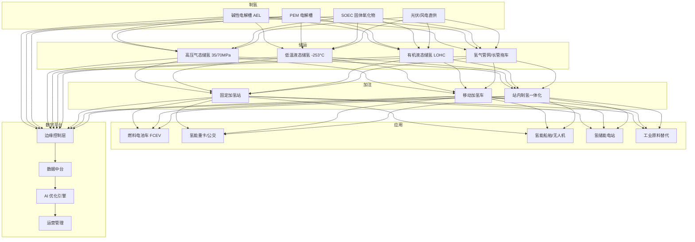
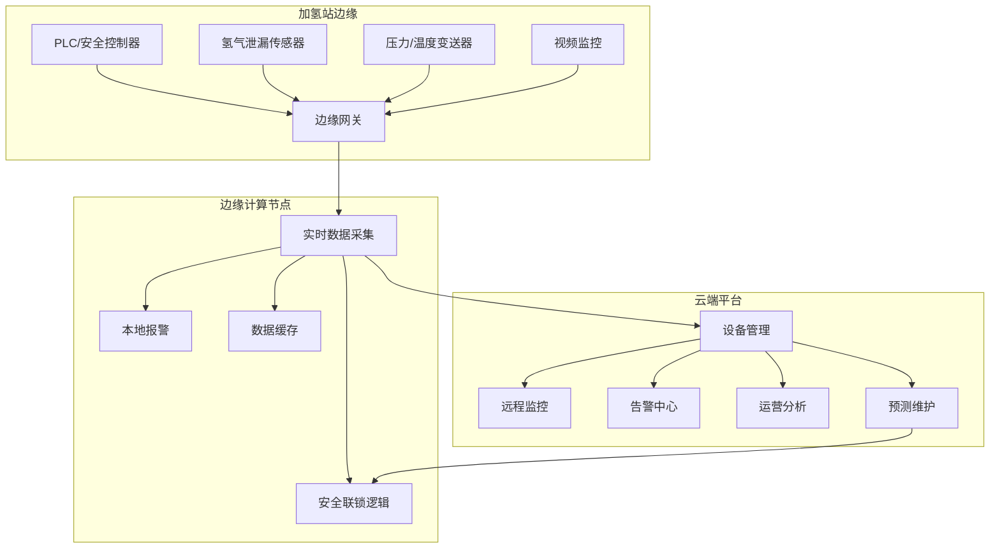
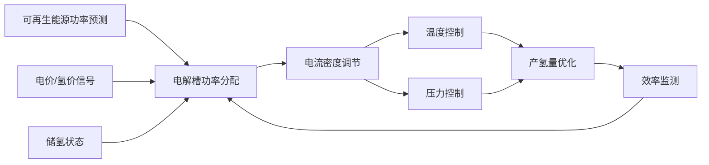

---title: 氢能源架构设计 — 阿里云视角
description: 'title: 氢能源架构设计'
summary: 'title: 氢能源架构设计'
category: general
tags:
- architecture
- best-practice
- scheduler
- prometheus
- grafana
- mysql
- daemonset
- operator
- webhook
- gpu
tier: supporting
created: '2026-05-23'
last_updated: 2026-05
difficulty: intermediate
reading_level: intermediate
audience:
- 所有工程师
estimated_read_time: 25min
intent_queries:
- 氢能源架构设计 — 阿里云视角 是什么
- 如何 氢能源架构设计 — 阿里云视角
- Kubernetes 20 application patterns 最佳实践
trigger_keywords:
- 氢能源架构设计
- 阿里云视角
- application
- patterns
prerequisites:
- kubectl-basics
- prometheus-basics
- monitoring-basics
- mysql-basics
- gpu-scheduling-basics
authors:
- name: Dillan Teagle
  role: contributor

---

> **生产环境安全提示**
>
> 本文档包含可直接执行的运维命令。执行前请确认：当前目标集群与 Namespace 是否正确；是否具备足够的 RBAC 权限；是否已在非生产环境验证。命令风险等级标注：🔴 高风险（可能造成数据丢失或服务中断）、🟡 中风险（会修改集群状态，但通常可回滚）、🟢 低风险/只读（信息收集，无副作用）。


title: 氢能源架构设计
description: '# 氢能源架构设计 — 阿里云视角'
category: application-architecture
tags:
- k8s
- architecture
- industry
- scheduler
- [[Prometheus|prometheus]]
- grafana
- mysql
- [[DaemonSet|daemonset]]
- operator
- webhook
last_updated: 2026-05-18
difficulty: advanced
reading_level: advanced
audience:
- 氢能源系统架构师
- 工业自动化工程师
- IoT平台专家
estimated_read_time: 5min
intent_queries:
- 氢能源工业 IoT 云边协同架构
- 加氢站安全监控联锁系统
- 电解槽数字孪生效率优化
- 氢气泄漏传感器监测
- 阿里云 Lindorm 时序数据库
trigger_keywords:
- 氢能源
- 制氢储氢
- 燃料电池
- 加氢站
- 电解槽
- 氢气泄漏
- 安全联锁
- 数字孪生
- 边缘计算
- 预测性维护
related_domains:
- domain-03-networking-traffic
- domain-10-troubleshooting-diagnostics
related_topics:
- topic-iot-platform-architecture
- topic-industrial-iot-architecture
k8s_versions:
- '1.28'
- '1.29'
- '1.30'
- '1.31'
- '1.32'
---

# 氢能源架构设计 — 阿里云视角

> **适用版本**: [[Kubernetes|Kubernetes]] v1.29 - v1.33 | **最后更新**: 2026-04-24
> **作者**: 阿里云解决方案架构师 | **标签**: `#氢能源` `#制氢` `#储氢` `#燃料电池` `#阿里云`

---

<!-- chunk: 目录 -->## 目录

1. [概述](#1-概述)
2. [设计原则](#2-设计原则)
3. [架构模式](#3-架构模式)
4. [实现示例](#4-实现示例)
5. [在 Kubernetes 上的部署](#5-在-kubernetes-上的部署)
6. [最佳实践](#6-最佳实践)
7. [反模式](#7-反模式)
8. [参考资源](#8-参考资源)

---

<!-- chunk: 1. 概述 -->## 1. 概述

氢能源被视为 21 世纪最具发展潜力的清洁能源载体。在全球碳中和目标的驱动下，氢能产业链正从实验室走向规模化商用。氢能源覆盖"制储运用"四大环节：制氢（电解水制绿氢、化石燃料制灰氢/蓝氢）、储运（高压气态、低温液态、有机液态、固态储氢）、加注（加氢站网络建设与运营）、应用（燃料电池汽车、分布式发电、工业原料替代）。

从信息技术角度看，氢能源系统是一个典型的工业物联网（IIoT）场景，具有以下特点：设备分散且数量多（电解槽、储罐、压缩机、加氢机、燃料电池等）；安全要求极高（氢气易燃易爆，泄漏浓度下限仅 4%）；实时性要求高（泄漏检测需要在秒级响应）；数据维度丰富（温度、压力、流量、浓度、电压、电流等多维时序数据）。

云原生架构为氢能源系统提供了统一的数字化底座。通过边缘计算实现现场设备的实时控制和安全联锁，通过云端平台实现全局监控、优化调度和数据分析，通过 AI 模型实现制氢效率优化、储氢安全预测、加氢站智能调度等高级功能。

## 1.1 行业背景

| 挑战 | 说明 | 架构影响 |
|:---|:---|:---|
| 安全风险 | 氢气易燃易爆（4%-75%可燃范围） | 泄漏监测 + 安全联锁 + 多重冗余 |
| 效率优化 | 电解水制氢能耗 4-5 kWh/Nm³ | AI 优化控制 + 实时调节 |
| 储运困难 | 氢气密度极低（0.0899 g/L） | 多方式储运 + 智能调度 |
| 基础设施 | 加氢站建设成本 1500-2000 万元/站 | 无人值守 + 远程运维 |
| 产业链协同 | 制储运用全链条协同 | 数据共享平台 + 标准接口 |

## 1.2 核心场景

- **绿氢制备**: 利用光伏/风电等可再生能源电解水制取绿氢，P2G（Power to Gas）模式
- **氢储运**: 高压气态（35/70MPa）、低温液态（-253°C）、有机液态（LOHC）、固态储氢
- **加氢站运营**: 智能加氢、安全监控、无人值守、远程运维
- **燃料电池管理**: 电堆状态监控、寿命预测、性能优化
- **氢能车辆**: 重卡、公交、叉车、船舶等氢能化运营管理

---

<!-- chunk: 2. 设计原则 -->## 2. 设计原则

## 2.1 安全第一原则

氢能源系统的安全是生命线。架构设计必须贯彻"安全第一"原则，从传感器层到应用层建立多层次安全防护体系。关键安全措施包括：氢气泄漏传感器冗余部署（每个危险区域至少 2 个独立传感器）；安全联锁系统独立于主控制系统（采用 SIL2/SIL3 等级的安全 PLC）；紧急停车系统（ESD）硬接线优先于软件控制。

## 2.2 云边协同原则

氢能源系统的设备（电解槽、加氢机等）分布在广泛的地理位置，需要云边协同架构。边缘侧负责实时控制和安全联锁（毫秒级响应），云端负责全局优化和数据分析（分钟级/小时级调度）。边缘节点需要支持离线自治，在云边通信中断时仍能维持设备安全运行。

## 2.3 数据驱动原则

氢能源系统的优化需要依赖大量运行数据。通过收集电解槽电压-电流曲线、储罐压力-温度变化、加氢站流量-压力波动等时序数据，建立数字孪生模型，实现设备性能退化预测、维护计划优化、调度策略改进。AI 模型在云端训练，推理模型下发到边缘执行。

## 2.4 标准开放原则

氢能源产业链涉及设备制造商、系统集成商、运营服务商、终端用户等多个角色。架构设计需要基于开放标准（如 OPC UA、MQTT、Modbus），建立统一的设备接入协议和数据模型。通过 API 网关对外提供标准化服务接口，支撑产业链上下游的数据互通和业务协同。

---

<!-- chunk: 3. 架构模式 -->## 3. 架构模式

## 3.1 氢能源全景架构



## 3.2 加氢站云边协同架构



## 3.3 电解槽智能控制架构



---

<!-- chunk: 4. 实现示例 -->## 4. 实现示例

## 4.1 氢气泄漏检测与安全联锁

```python
import time
from enum import Enum
from dataclasses import dataclass
from typing import List

class AlertLevel(Enum):
    NORMAL = 0
    WARNING = 1       # 25% LEL
    ALARM = 2         # 50% LEL
    EMERGENCY = 3     # 100% LEL

@dataclass
class SensorReading:
    sensor_id: str
    concentration_ppm: float
    timestamp: float
    location: str

class HydrogenSafetyController:
    LEL_PPM = 40000  # 氢气爆炸下限约 4% = 40000 ppm
    WARNING_THRESHOLD = 0.25  # 25% LEL = 10000 ppm
    ALARM_THRESHOLD = 0.50    # 50% LEL = 20000 ppm
    EMERGENCY_THRESHOLD = 1.0 # 100% LEL

    def __init__(self):
        self.interlock_active = False
        self.ventilation_on = False
        self.alarm_active = False

    def evaluate(self, readings: List[SensorReading]) -> AlertLevel:
        max_ratio = 0.0
        for r in readings:
            ratio = r.concentration_ppm / self.LEL_PPM
            max_ratio = max(max_ratio, ratio)

        if max_ratio >= self.EMERGENCY_THRESHOLD:
            self._emergency_response()
            return AlertLevel.EMERGENCY
        elif max_ratio >= self.ALARM_THRESHOLD:
            self._alarm_response()
            return AlertLevel.ALARM
        elif max_ratio >= self.WARNING_THRESHOLD:
            self._warning_response()
            return AlertLevel.WARNING
        else:
            self._normal_state()
            return AlertLevel.NORMAL

    def _emergency_response(self):
        self.interlock_active = True
        self.ventilation_on = True
        self.alarm_active = True
        self._cut_hydrogen_source()
        self._activate_spray_system()

    def _alarm_response(self):
        self.ventilation_on = True
        self.alarm_active = True
        self._reduce_pressure()

    def _warning_response(self):
        self.ventilation_on = True

    def _normal_state(self):
        self.interlock_active = False
        self.ventilation_on = False
        self.alarm_active = False

    def _cut_hydrogen_source(self):
        pass

    def _activate_spray_system(self):
        pass

    def _reduce_pressure(self):
        pass
```

## 4.2 电解槽数字孪生效率优化

```python
import numpy as np
from sklearn.ensemble import GradientBoostingRegressor

class ElectrolyzerDigitalTwin:
    def __init__(self, nominal_power_kw: float = 1000):
        self.nominal_power = nominal_power_kw
        self.model = GradientBoostingRegressor(
            n_estimators=200,
            max_depth=6,
            learning_rate=0.05
        )
        self.trained = False

    def train(self, historical_data):
        X = historical_data'current_density', 'temperature',
                             'pressure', 'electrolyte_conc', 'input_power'
        y = historical_data['h2_production_rate']
        self.model.fit(X, y)
        self.trained = True

    def predict_production(self, current_density, temperature,
                          pressure, electrolyte_conc, input_power):
        if not self.trained:
            return self._empirical_model(current_density, temperature,
                                         pressure, input_power)
        features = np.array(current_density, temperature,
                              pressure, electrolyte_conc, input_power)
        return max(0, self.model.predict(features)[0])

    def optimize_power_allocation(self, available_power_kw,
                                  num_stacks: int = 10):
        best_rate = 0
        best_allocation = None

        for strategy in ['uniform', 'cascading', 'adaptive']:
            allocation = self._allocate(available_power_kw,
                                        num_stacks, strategy)
            total_rate = sum(
                self.predict_production(a['current_density'],
                                        a['temperature'],
                                        a['pressure'],
                                        a['electrolyte_conc'],
                                        a['power'])
                for a in allocation
            )
            if total_rate > best_rate:
                best_rate = total_rate
                best_allocation = allocation

        return best_allocation, best_rate

    def _empirical_model(self, cd, temp, pressure, power):
        base_efficiency = 0.65
        temp_factor = 1.0 - 0.001 * abs(temp - 80)
        pressure_factor = 1.0 - 0.0005 * pressure
        return power * base_efficiency * temp_factor * pressure_factor / 33.3

    def _allocate(self, power, stacks, strategy):
        per_stack = power / stacks
        if strategy == 'uniform':
            return [{'power': per_stack, 'current_density': 0.4,
                     'temperature': 80, 'pressure': 30,
                     'electrolyte_conc': 30} for _ in range(stacks)]
        elif strategy == 'cascading':
            active = int(power / (self.nominal_power / stacks))
            active = min(active, stacks)
            return [{'power': self.nominal_power / stacks,
                     'current_density': 0.6, 'temperature': 80,
                     'pressure': 30, 'electrolyte_conc': 30}
                    if i < active else
                    {'power': 0, 'current_density': 0,
                     'temperature': 80, 'pressure': 30,
                     'electrolyte_conc': 30}
                    for i in range(stacks)]
        else:
            return [{'power': per_stack, 'current_density': 0.5,
                     'temperature': 80, 'pressure': 30,
                     'electrolyte_conc': 30} for _ in range(stacks)]
```

## 4.3 加氢站智能调度

```go
package scheduler

import (
    "sort"
    "time"
)

type Vehicle struct {
    ID           string
    TankCapacity float64
    CurrentLevel float64
    Priority     int
    ETA          time.Time
}

type Dispenser struct {
    ID        string
    Pressure  int
    Available bool
}

type StationScheduler struct {
    dispensers []Dispenser
    hydrogenStock float64
}

func (s *StationScheduler) Schedule(vehicles []Vehicle) []Assignment {
    sort.Slice(vehicles, func(i, j int) bool {
        if vehicles[i].Priority != vehicles[j].Priority {
            return vehicles[i].Priority > vehicles[j].Priority
        }
        urgency_i := vehicles[i].TankCapacity - vehicles[i].CurrentLevel
        urgency_j := vehicles[j].TankCapacity - vehicles[j].CurrentLevel
        return urgency_i > urgency_j
    })

    var assignments []Assignment
    availableDispensers := s.getAvailableDispensers()

    for i, v := range vehicles {
        if i >= len(availableDispensers) {
            break
        }
        needed := (v.TankCapacity - v.CurrentLevel) * 0.9
        if needed > s.hydrogenStock {
            break
        }

        assignments = append(assignments, Assignment{
            VehicleID:    v.ID,
            DispenserID:  availableDispensers[i].ID,
            TargetAmount: needed,
            Pressure:     availableDispensers[i].Pressure,
        })
        s.hydrogenStock -= needed
    }

    return assignments
}

func (s *StationScheduler) getAvailableDispensers() []Dispenser {
    var available []Dispenser
    for _, d := range s.dispensers {
        if d.Available {
            available = append(available, d)
        }
    }
    return available
}

type Assignment struct {
    VehicleID    string
    DispenserID  string
    TargetAmount float64
    Pressure     int
}
```

---

<!-- chunk: 5. 在 Kubernetes 上的部署 -->## 5. 在 Kubernetes 上的部署

## 5.1 电解槽控制边缘 DaemonSet

```yaml
apiVersion: apps/v1
kind: DaemonSet
metadata:
  name: electrolyzer-controller
  namespace: hydrogen-energy
  labels:
    app: electrolyzer-controller
    tier: edge
spec:
  selector:
    matchLabels:
      app: electrolyzer-controller
  updateStrategy:
    type: RollingUpdate
    rollingUpdate:
      maxUnavailable: 1
  template:
    metadata:
      labels:
        app: electrolyzer-controller
        tier: edge
    spec:
      hostNetwork: true
      nodeSelector:
        node-type: hydrogen-station
      tolerations:
        - key: "industrial"
          operator: "Equal"
          value: "hydrogen"
          effect: "NoSchedule"
      containers:
        - name: controller
          image: registry.cn-hangzhou.aliyuncs.com/h2/electrolyzer-ctrl:v2.0.0
          env:
            - name: H2_LEAK_THRESHOLD_PPM
              value: "10000"
            - name: SAFETY_INTERLOCK
              value: "enabled"
            - name: PLANT_ID
              valueFrom:
                fieldRef:
                  fieldPath: spec.nodeName
            - name: CLOUD_ENDPOINT
              value: "https://h2-platform.cn-hangzhou.aliyuncs.com"
          resources:
            requests:
              memory: "1Gi"
              cpu: "1000m"
            limits:
              memory: "2Gi"
              cpu: "2000m"
          volumeMounts:
            - name: serial-dev
              mountPath: /dev/ttyUSB0
            - name: config
              mountPath: /etc/h2-controller
          livenessProbe:
            exec:
              command: ["/bin/grpc_health_probe", "-addr=:50051"]
            initialDelaySeconds: 15
            periodSeconds: 10
      volumes:
        - name: serial-dev
          hostPath:
            path: /dev/ttyUSB0
        - name: config
          configMap:
            name: h2-controller-config
```

## 5.2 安全监控告警服务

```yaml
apiVersion: apps/v1
kind: Deployment
metadata:
  name: safety-monitor
  namespace: hydrogen-energy
spec:
  replicas: 3
  selector:
    matchLabels:
      app: safety-monitor
  template:
    metadata:
      labels:
        app: safety-monitor
      annotations:
        prometheus.io/scrape: "true"
        prometheus.io/port: "9090"
    spec:
      affinity:
        podAntiAffinity:
          requiredDuringSchedulingIgnoredDuringExecution:
            - labelSelector:
                matchLabels:
                  app: safety-monitor
              topologyKey: kubernetes.io/hostname
      containers:
        - name: monitor
          image: registry.cn-hangzhou.aliyuncs.com/h2/safety-monitor:v2.0.0
          ports:
            - containerPort: 8080
            - containerPort: 9090
          env:
            - name: ALERT_WEBHOOK
              valueFrom:
                secretKeyRef:
                  name: h2-alert-secrets
                  key: webhook-url
            - name: LINDORM_ENDPOINT
              value: "ld-xxxx-proxy.lindorm.rds.aliyuncs.com"
          resources:
            requests:
              memory: "2Gi"
              cpu: "1000m"
            limits:
              memory: "4Gi"
              cpu: "2000m"
          readinessProbe:
            httpGet:
              path: /ready
              port: 8080
            periodSeconds: 5
```

## 5.3 AI 优化引擎部署

```yaml
apiVersion: apps/v1
kind: Deployment
metadata:
  name: h2-ai-optimizer
  namespace: hydrogen-energy
spec:
  replicas: 2
  selector:
    matchLabels:
      app: h2-ai-optimizer
  template:
    metadata:
      labels:
        app: h2-ai-optimizer
    spec:
      nodeSelector:
        accelerator: nvidia-t4
      runtimeClassName: nvidia
      containers:
        - name: optimizer
          image: registry.cn-hangzhou.aliyuncs.com/h2/ai-optimizer:v2.0.0-gpu
          ports:
            - containerPort: 8080
          env:
            - name: MODEL_PATH
              value: "/models/h2-efficiency-v3"
            - name: RETRAIN_INTERVAL_HOURS
              value: "24"
          resources:
            requests:
              nvidia.com/gpu: 1
              memory: "8Gi"
              cpu: "4000m"
            limits:
              nvidia.com/gpu: 1
              memory: "16Gi"
              cpu: "8000m"
```

---

<!-- chunk: 6. 最佳实践 -->## 6. 最佳实践

## 6.1 安全体系建设

- **冗余传感器部署**: 每个危险区域至少部署 2 个独立氢气泄漏传感器，采用投票机制避免误报
- **安全联锁独立**: 安全联锁系统（SIS）独立于基本过程控制系统（BPCS），采用 SIL2 以上等级
- **紧急停车（ESD）**: 设置多级紧急停车策略——单设备停车、区域停车、全站停车
- **防爆设计**: 加氢区域所有电气设备采用防爆型（Ex d IIC T4），电缆采用本安型或隔爆型
- **定期安全演练**: 每季度进行泄漏应急演练，每半年进行全站综合应急演练

## 6.2 运维管理优化

- **预测性维护**: 基于设备运行数据（压缩机振动、电解槽电压、储罐压力等）建立预测模型，提前发现设备劣化趋势
- **远程运维**: 通过安全VPN隧道实现远程诊断和参数调整，减少现场运维人员需求
- **标准化作业流程**: 将加氢站日常操作流程数字化，通过移动端指导操作人员执行标准化作业

## 6.3 数据管理

- **时序数据高效存储**: 使用 Lindorm 时序引擎存储高频传感器数据，支持千万级时间线
- **数据分级存储**: 实时数据（1s 精度保留 7 天）、历史数据（1min 精度保留 1 年）、统计数据（1h 精度永久保留）
- **数据质量监控**: 建立传感器数据质量评估机制，自动标记异常数据（跳变、漂移、缺失）

---

<!-- chunk: 7. 反模式 -->## 7. 反模式

## 7.1 安全联锁依赖软件

将安全联锁功能完全依赖软件实现，一旦软件问题可能导致安全功能失效。

**解决方案**: 关键安全联锁采用硬接线（hardwired）方式实现，包括紧急停车按钮、氢气泄漏联锁切断阀等。软件安全层作为补充，而非替代。

## 7.2 边缘节点无离线能力

边缘计算节点完全依赖云端连接，通信中断时设备失控。

**解决方案**: 边缘节点必须具备离线自治能力，在通信中断时按照预设的安全策略运行，并在通信恢复后自动同步数据。

## 7.3 忽视氢脆效应监测

氢气在高压条件下会渗入金属材料导致"氢脆"，使材料强度下降甚至开裂。忽视氢脆监测可能导致设备失效。

**解决方案**: 对高压储氢容器定期进行无损检测，在数字孪生模型中加入氢脆劣化预测模块，根据运行历史预测剩余安全寿命。

## 7.4 单一数据来源决策

仅依赖单一传感器数据做出关键决策，一旦传感器问题可能导致误判。

**解决方案**: 关键决策采用多传感器数据融合，通过交叉验证提高可靠性。设置传感器健康监测，自动标记异常传感器并降级使用。

## 7.5 忽视全链条碳排放

只关注制氢环节的碳排放，忽视储运和加注环节的能耗和碳排放。

**解决方案**: 建立全生命周期碳排放追踪体系，从"摇篮到坟墓"计算每公斤氢气的碳足迹，并与碳交易市场对接。

---

<!-- chunk: 8. 参考资源 -->## 8. 参考资源

## 8.1 阿里云组件映射

| 功能域 | **阿里云云原生方案** |
|:---|:---|
| 容器平台 | **ACK Edge + ACK Pro** |
| IoT 平台 | **阿里云 IoT 企业实例** |
| AI 平台 | **PAI + 数据科学笔记本** |
| 时序数据库 | **Lindorm TSDB** |
| 关系数据库 | **PolarDB MySQL** |
| 消息队列 | **RocketMQ** |
| 可观测性 | **ARMS + SLS + Grafana** |
| 视频监控 | **阿里云视频监控** |

## 8.2 生产检查清单

- [ ] 氢气泄漏检测灵敏度校准（< 1000ppm 检出）
- [ ] 安全联锁系统 SIL 等级验证
- [ ] 加氢枪对接安全联锁测试
- [ ] 储氢容器定期检验记录
- [ ] 防爆区域电气设备合规检查
- [ ] 紧急停车系统功能测试
- [ ] 边缘节点离线自治能力验证
- [ ] 全链条碳排放数据上链存证
- [ ] 消防系统联动测试

## 8.3 外部参考

- ISO 19880-1:2020 — 氢燃料车辆加氢站标准
- IEC 62282-3-100 — 燃料电池安全标准
- GB/T 34542 — 氢气储存和运输安全标准
- CGA H-3 — 氢气管道系统标准
- SAE J2601 — 氢燃料车辆加注协议

---

**维护者**: 阿里云解决方案架构师团队 | **许可证**: MIT

---

<!-- chunk: Obsidian 相关文档 -->## Obsidian 相关文档

- topic-application-architecture MOC
- [[domain-20-application-patterns/topic-application-architecture/README.md|Topic 应用层架构设计最佳实践]]
- [[domain-20-application-patterns/topic-application-architecture/01-ecommerce-architecture.md|电商系统 Kubernetes 生产架构设计]]
- [[domain-20-application-patterns/topic-application-architecture/02-mini-program-architecture.md|小程序平台架构设计]]
- [[domain-20-application-patterns/topic-application-architecture/03-cms-architecture.md|内容管理系统 CMS 架构设计]]
- [[domain-20-application-patterns/topic-application-architecture/04-im-rtc-architecture.md|实时通信 IM/RTC 架构设计]]
- [[domain-20-application-patterns/topic-application-architecture/05-online-education-architecture.md|在线教育平台 Kubernetes 生产架构设计]]
- [[domain-20-application-patterns/topic-application-architecture/06-fintech-architecture.md|金融科技FinTech Kubernetes生产架构设计]]
- [[domain-20-application-patterns/topic-application-architecture/07-iot-platform-architecture.md|物联网 IoT 平台架构设计]]
- [[domain-20-application-patterns/topic-application-architecture/08-ai-ml-inference-architecture.md|AI/ML 推理服务 Kubernetes 生产架构设计]]
- [[domain-20-application-patterns/topic-application-architecture/09-gaming-backend-architecture.md|游戏后端 Kubernetes 生产架构设计]]
- [[domain-20-application-patterns/topic-application-architecture/10-social-media-architecture.md|社交媒体平台Kubernetes生产架构设计]]

## See Also

- 83-cultural-digitization
- 84-national-park
- 86-solid-state-battery
- 87-flexible-manufacturing

## Related

- topic-application-architecture MOC — Cross-reference


<!-- risk-assessed -->
