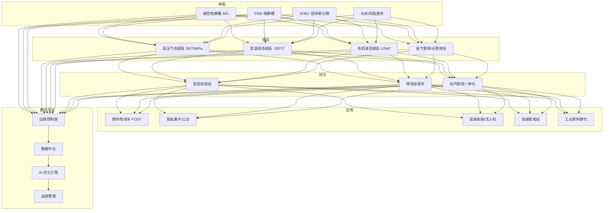
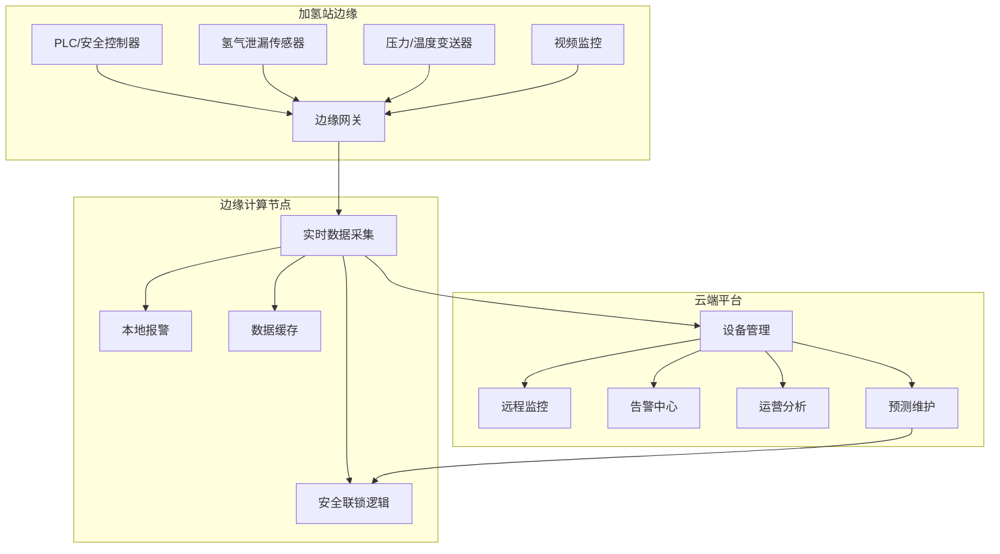
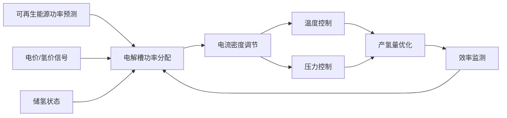

# Hydrogen Energy Architecture Design — From Alibaba Cloud Perspective

## Table of Contents

1. [Overview](#1-overview)
2. [Design Principles](#2-design-principles)
3. [Architecture Patterns](#3-architecture-patterns)
4. [Example Implementation](#4-implementation-examples)
5. [Deployment on Kubernetes](#5-deployment-on-kubernetes)
6. [Best Practices](#6-best-practices)
7. [Anti-patterns](#7-anti-patterns)
8. [Reference Resources](#8-references)

---

## 1. Overview

Hydrogen energy is seen as the most promising clean energy carrier for the 21st century. Driven by the global goal of carbon neutrality, the hydrogen industry chain is moving from laboratories to large-scale commercialization. Hydrogen energy covers the "production storage utilization" four links: production (electrolysis water to green hydrogen, fossil fuels to gray hydrogen/blue hydrogen), storage transportation (high-pressure gas, low-temperature liquid, organic liquid, solid-state hydrogen storage), refueling (construction and operation of hydrogen refueling stations), and application (fuel cell vehicles, distributed power generation, industrial raw material substitution).

From an information technology perspective, the hydrogen energy system is a typical Industrial Internet of Things (IIoT) scenario, featuring the following characteristics: dispersed and numerous devices (electrolysers, storage tanks, compressors, refueling machines, fuel cells, etc.); extremely high safety requirements (hydrogen is flammable and explosive, with a lower explosive limit of only 4%); high real-time requirements (leakage detection needs to respond within seconds); rich data dimensions (multi-dimensional time series data including temperature, pressure, flow rate, concentration, voltage, current, etc.).

Cloud-native architecture provides a unified digital foundation for the hydrogen energy system. Through edge computing to achieve real-time control and safety interlocks at the site, through cloud platforms to achieve global monitoring, optimization scheduling, and data analysis, and through AI models to achieve optimized efficiency of green hydrogen production, predictive safety of hydrogen storage, and intelligent scheduling of hydrogen refueling stations, among other advanced functions.

## 1.1 Industry Background

| Challenge | Explanation | Impact on Architecture |
|:---|:---|:---|
| Safety Risks | Flammable and explosive (4%-75% flammable range) | Leak detection + Safety interlocks + Multiple redundancies |
| Efficiency Optimization | Electrolysis water hydrogen production energy consumption 4-5 kWh/Nm³ | AI optimized control + Real-time regulation |
| Storage Transportation Difficulties | Extremely low hydrogen density (0.0899 g/L) | Multi-mode storage + Intelligent scheduling |
| Infrastructure | Construction cost of hydrogen refueling stations 15-20 million yuan/station | Unattended + Remote maintenance |
| Industry Chain Collaboration | Full-chain collaboration of production storage utilization | Data sharing platform + Standard interfaces |

## 1.2 Core Scenarios

- **Green Hydrogen Production**: Utilizing renewable energy such as photovoltaics/wind power to electrolyze water to produce green hydrogen, P2G (Power to Gas) mode
- **Hydrogen Storage and Transportation**: High-pressure gas (35/70MPa), low-temperature liquid (-253°C), organic liquid (LOHC), solid-state hydrogen storage
- **Hydrogen Refueling Station Operations**: Intelligent refueling, safety monitoring, unattended operations, remote maintenance
- **Fuel Cell Management**: Monitoring of stack status, life prediction, performance optimization
- **Hydrogen Vehicles**: Operation management of heavy trucks, buses, forklifts, ships, etc.

---

## 2. Design Principles

## 2.1 Safety First Principle

Hydrogen energy system's safety is a lifeline. The architecture design must adhere to the "safety first" principle, establishing a multi-layered security protection system from the sensor layer to the application layer. Key safety measures include redundant deployment of hydrogen gas leakage sensors (at least 2 independent sensors in each hazardous area); an independent safety interlock system that operates at a higher level than the main control system (using safety PLCs at SIL2/SIL3 levels); and an emergency shutdown system (ESD) with hard-wired priority over software control.

## 2.2 Cloud-to-Edge Coordinating Principle

Hydrogen energy systems' equipment (such as electrolysis cells and hydrogen refueling stations) are distributed across various geographical locations, necessitating a cloud-to-edge architecture. Edge nodes handle real-time control and safety interlocks (with millisecond response times), while the cloud handles global optimization and data analysis (with minute/hourly scheduling). Edge nodes need to support offline autonomy, ensuring device safety operation even when cloud-to-edge communication is interrupted.

## 2.3 Data-Driven Principle

The optimization of hydrogen energy systems requires extensive operational data. By collecting time-series data such as electrolysis cell voltage-current curves, changes in storage tank pressure-temperature, and fluctuations in hydrogen station flow-pressure, digital twins can be established to predict equipment performance degradation, optimize maintenance plans, and improve dispatch strategies. AI models are trained in the cloud, while inference models are deployed to edge execution.

## 2.4 Standard Open Principle

The hydrogen energy supply chain involves multiple roles including equipment manufacturers, system integrators, service providers, and end users. The architecture design should be based on open standards (such as OPC UA, MQTT, Modbus), establishing unified device access protocols and data models. APIs are provided through an API gateway to support data interoperability and business collaboration across the supply chain.

---

## 3. Architecture Patterns

## 3.1 Panoramic Hydrogen Energy Architecture


```mermaid
graph TB
    subgraph 制氢
        G1[碱性电解槽 AEL]
        G2[PEM 电解槽]
        G3[SOEC 固体氧化物]
        G4[光伏/风电直供]
    end

    subgraph 储运
        S1[高压气态储氢 35/70MPa]
        S2[低温液态储氢 -253°C]
        S3[有机液态储氢 LOHC]
        S4[氢气管网/长管拖车]
    end

    subgraph 加注
        F1[固定加氢站]
        F2[移动加氢车]
        F3[站内制氢一体化]
    end

    subgraph 应用
        A1[燃料电池车 FCEV]
        A2[氢能重卡/公交]
        A3[氢能船舶/无人机]
        A4[氢储能电站]
        A5[工业原料替代]
    end

    subgraph 数字平台
        P1[边缘控制层]
        P2[数据中台]
        P3[AI 优化引擎]
        P4[运营管理]
    end

    G1 & G2 & G3 & G4 --> S1 & S2 & S3 & S4
    S1 & S2 & S3 & S4 --> F1 & F2 & F3
    F1 & F2 & F3 --> A1 & A2 & A3 & A4 & A5
    G1 & G2 & G3 --> P1
    S1 & S2 & S3 & S4 --> P1
    F1 & F2 & F3 --> P1
    P1 --> P2 --> P3 --> P4
```

## 3.2 Cloud-to-Edge Coordinating Hydrogen Station Architecture


```mermaid
graph TB
    subgraph 加氢站边缘
        E1[PLC/安全控制器]
        E2[氢气泄漏传感器]
        E3[压力/温度变送器]
        E4[边缘网关]
        E5[视频监控]
    end

    subgraph 边缘计算节点
        N1[实时数据采集]
        N2[安全联锁逻辑]
        N3[本地报警]
        N4[数据缓存]
    end

    subgraph 云端平台
        C1[设备管理]
        C2[远程监控]
        C3[告警中心]
        C4[运营分析]
        C5[预测维护]
    end

    E1 & E2 & E3 & E5 --> E4
    E4 --> N1
    N1 --> N2 & N3 & N4
    N1 --> C1
    C1 --> C2 & C3 & C4 & C5
    C5 --> N2
```

## 3.3 Intelligent Control Architecture for Electrolysis Cells


```mermaid
flowchart LR
    A[可再生能源功率预测] --> B[电解槽功率分配]
    C[电价/氢价信号] --> B
    D[储氢状态] --> B
    B --> E[电流密度调节]
    E --> F[温度控制]
    E --> G[压力控制]
    F & G --> H[产氢量优化]
    H --> I[效率监测]
    I --> B
```

---

## 4. Implementation Examples

## 4.1 Hydrogen Leakage Detection and Safety Interlock

```python
import time
from enum import Enum
from dataclasses import dataclass
from typing import List

class AlertLevel(Enum):
    NORMAL = 0
    WARNING = 1       # 25% LEL
    ALARM = 2         # 50% LEL
    EMERGENCY = 3     # 100% LEL

@dataclass
class SensorReading:
    sensor_id: str
    concentration_ppm: float
    timestamp: float
    location: str

class HydrogenSafetyController:
    LEL_PPM = 40000  # 氢气爆炸下限约 4% = 40000 ppm
    WARNING_THRESHOLD = 0.25  # 25% LEL = 10000 ppm
    ALARM_THRESHOLD = 0.50    # 50% LEL = 20000 ppm
    EMERGENCY_THRESHOLD = 1.0 # 100% LEL

    def __init__(self):
        self.interlock_active = False
        self.ventilation_on = False
        self.alarm_active = False

    def evaluate(self, readings: List[SensorReading]) -> AlertLevel:
        max_ratio = 0.0
        for r in readings:
            ratio = r.concentration_ppm / self.LEL_PPM
            max_ratio = max(max_ratio, ratio)

        if max_ratio >= self.EMERGENCY_THRESHOLD:
            self._emergency_response()
            return AlertLevel.EMERGENCY
        elif max_ratio >= self.ALARM_THRESHOLD:
            self._alarm_response()
            return AlertLevel.ALARM
        elif max_ratio >= self.WARNING_THRESHOLD:
            self._warning_response()
            return AlertLevel.WARNING
        else:
            self._normal_state()
            return AlertLevel.NORMAL

    def _emergency_response(self):
        self.interlock_active = True
        self.ventilation_on = True
        self.alarm_active = True
        self._cut_hydrogen_source()
        self._activate_spray_system()

    def _alarm_response(self):
        self.ventilation_on = True
        self.alarm_active = True
        self._reduce_pressure()

    def _warning_response(self):
        self.ventilation_on = True

    def _normal_state(self):
        self.interlock_active = False
        self.ventilation_on = False
        self.alarm_active = False

    def _cut_hydrogen_source(self):
        pass

    def _activate_spray_system(self):
        pass

    def _reduce_pressure(self):
        pass
```

## 4.2 Digital Twin Efficiency Optimization for Electrolysis Cells

```python
import numpy as np
from sklearn.ensemble import GradientBoostingRegressor

class ElectrolyzerDigitalTwin:
    def __init__(self, nominal_power_kw: float = 1000):
        self.nominal_power = nominal_power_kw
        self.model = GradientBoostingRegressor(
            n_estimators=200,
            max_depth=6,
            learning_rate=0.05
        )
        self.trained = False

    def train(self, historical_data):
        X = historical_data'current_density', 'temperature',
                             'pressure', 'electrolyte_conc', 'input_power'
        y = historical_data['h2_production_rate']
        self.model.fit(X, y)
        self.trained = True

    def predict_production(self, current_density, temperature,
                          pressure, electrolyte_conc, input_power):
        if not self.trained:
            return self._empirical_model(current_density, temperature,
                                         pressure, input_power)
        features = np.array(current_density, temperature,
                              pressure, electrolyte_conc, input_power)
        return max(0, self.model.predict(features)[0])

    def optimize_power_allocation(self, available_power_kw,
                                  num_stacks: int = 10):
        best_rate = 0
        best_allocation = None

        for strategy in ['uniform', 'cascading', 'adaptive']:
            allocation = self._allocate(available_power_kw,
                                        num_stacks, strategy)
            total_rate = sum(
                self.predict_production(a['current_density'],
                                        a['temperature'],
                                        a['pressure'],
                                        a['electrolyte_conc'],
                                        a['power'])
                for a in allocation
            )
            if total_rate > best_rate:
                best_rate = total_rate
                best_allocation = allocation

        return best_allocation, best_rate

    def _empirical_model(self, cd, temp, pressure, power):
        base_efficiency = 0.65
        temp_factor = 1.0 - 0.001 * abs(temp - 80)
        pressure_factor = 1.0 - 0.0005 * pressure
        return power * base_efficiency * temp_factor * pressure_factor / 33.3

    def _allocate(self, power, stacks, strategy):
        per_stack = power / stacks
        if strategy == 'uniform':
            return [{'power': per_stack, 'current_density': 0.4,
                     'temperature': 80, 'pressure': 30,
                     'electrolyte_conc': 30} for _ in range(stacks)]
        elif strategy == 'cascading':
            active = int(power / (self.nominal_power / stacks))
            active = min(active, stacks)
            return [{'power': self.nominal_power / stacks,
                     'current_density': 0.6, 'temperature': 80,
                     'pressure': 30, 'electrolyte_conc': 30}
                    if i < active else
                    {'power': 0, 'current_density': 0,
                     'temperature': 80, 'pressure': 30,
                     'electrolyte_conc': 30}
                    for i in range(stacks)]
        else:
            return [{'power': per_stack, 'current_density': 0.5,
                     'temperature': 80, 'pressure': 30,
                     'electrolyte_conc': 30} for _ in range(stacks)]
```

## 4.3 Intelligent Dispatching for Hydrogen Stations

```go
package scheduler

import (
    "sort"
    "time"
)

type Vehicle struct {
    ID           string
    TankCapacity float64
    CurrentLevel float64
    Priority     int
    ETA          time.Time
}

type Dispenser struct {
    ID        string
    Pressure  int
    Available bool
}

type StationScheduler struct {
    dispensers []Dispenser
    hydrogenStock float64
}

func (s *StationScheduler) Schedule(vehicles []Vehicle) []Assignment {
    sort.Slice(vehicles, func(i, j int) bool {
        if vehicles[i].Priority != vehicles[j].Priority {
            return vehicles[i].Priority > vehicles[j].Priority
        }
        urgency_i := vehicles[i].TankCapacity - vehicles[i].CurrentLevel
        urgency_j := vehicles[j].TankCapacity - vehicles[j].CurrentLevel
        return urgency_i > urgency_j
    })

    var assignments []Assignment
    availableDispensers := s.getAvailableDispensers()

    for i, v := range vehicles {
        if i >= len(availableDispensers) {
            break
        }
        needed := (v.TankCapacity - v.CurrentLevel) * 0.9
        if needed > s.hydrogenStock {
            break
        }

        assignments = append(assignments, Assignment{
            VehicleID:    v.ID,
            DispenserID:  availableDispensers[i].ID,
            TargetAmount: needed,
            Pressure:     availableDispensers[i].Pressure,
        })
        s.hydrogenStock -= needed
    }

    return assignments
}

func (s *StationScheduler) getAvailableDispensers() []Dispenser {
    var available []Dispenser
    for _, d := range s.dispensers {
        if d.Available {
            available = append(available, d)
        }
    }
    return available
}

type Assignment struct {
    VehicleID    string
    DispenserID  string
    TargetAmount float64
    Pressure     int
}
```

---

## 5. Deployment on Kubernetes

## 5.1 Electrolysis Cell Control Edge DaemonSet

```yaml
apiVersion: apps/v1
kind: DaemonSet
metadata:
  name: electrolyzer-controller
  namespace: hydrogen-energy
  labels:
    app: electrolyzer-controller
    tier: edge
spec:
  selector:
    matchLabels:
      app: electrolyzer-controller
  updateStrategy:
    type: RollingUpdate
    rollingUpdate:
      maxUnavailable: 1
  template:
    metadata:
      labels:
        app: electrolyzer-controller
        tier: edge
    spec:
      hostNetwork: true
      nodeSelector:
        node-type: hydrogen-station
      tolerations:
        - key: "industrial"
          operator: "Equal"
          value: "hydrogen"
          effect: "NoSchedule"
      containers:
        - name: controller
          image: registry.cn-hangzhou.aliyuncs.com/h2/electrolyzer-ctrl:v2.0.0
          env:
            - name: H2_LEAK_THRESHOLD_PPM
              value: "10000"
            - name: SAFETY_INTERLOCK
              value: "enabled"
            - name: PLANT_ID
              valueFrom:
                fieldRef:
                  fieldPath: spec.nodeName
            - name: CLOUD_ENDPOINT
              value: "https://h2-platform.cn-hangzhou.aliyuncs.com"
          resources:
            requests:
              memory: "1Gi"
              cpu: "1000m"
            limits:
              memory: "2Gi"
              cpu: "2000m"
          volumeMounts:
            - name: serial-dev
              mountPath: /dev/ttyUSB0
            - name: config
              mountPath: /etc/h2-controller
          livenessProbe:
            exec:
              command: ["/bin/grpc_health_probe", "-addr=:50051"]
            initialDelaySeconds: 15
            periodSeconds: 10
      volumes:
        - name: serial-dev
          hostPath:
            path: /dev/ttyUSB0
        - name: config
          configMap:
            name: h2-controller-config
```

## 5.2 Security Monitoring Alarm Service

```yaml
apiVersion: apps/v1
kind: Deployment
metadata:
  name: safety-monitor
  namespace: hydrogen-energy
spec:
  replicas: 3
  selector:
    matchLabels:
      app: safety-monitor
  template:
    metadata:
      labels:
        app: safety-monitor
      annotations:
        prometheus.io/scrape: "true"
        prometheus.io/port: "9090"
    spec:
      affinity:
        podAntiAffinity:
          requiredDuringSchedulingIgnoredDuringExecution:
            - labelSelector:
                matchLabels:
                  app: safety-monitor
              topologyKey: kubernetes.io/hostname
      containers:
        - name: monitor
          image: registry.cn-hangzhou.aliyuncs.com/h2/safety-monitor:v2.0.0
          ports:
            - containerPort: 8080
            - containerPort: 9090
          env:
            - name: ALERT_WEBHOOK
              valueFrom:
                secretKeyRef:
                  name: h2-alert-secrets
                  key: webhook-url
            - name: LINDORM_ENDPOINT
              value: "ld-xxxx-proxy.lindorm.rds.aliyuncs.com"
          resources:
            requests:
              memory: "2Gi"
              cpu: "1000m"
            limits:
              memory: "4Gi"
              cpu: "2000m"
          readinessProbe:
            httpGet:
              path: /ready
              port: 8080
            periodSeconds: 5
```

## 5.3 AI Optimization Engine Deployment

```yaml
apiVersion: apps/v1
kind: Deployment
metadata:
  name: h2-ai-optimizer
  namespace: hydrogen-energy
spec:
  replicas: 2
  selector:
    matchLabels:
      app: h2-ai-optimizer
  template:
    metadata:
      labels:
        app: h2-ai-optimizer
    spec:
      nodeSelector:
        accelerator: nvidia-t4
      runtimeClassName: nvidia
      containers:
        - name: optimizer
          image: registry.cn-hangzhou.aliyuncs.com/h2/ai-optimizer:v2.0.0-gpu
          ports:
            - containerPort: 8080
          env:
            - name: MODEL_PATH
              value: "/models/h2-efficiency-v3"
            - name: RETRAIN_INTERVAL_HOURS
              value: "24"
          resources:
            requests:
              nvidia.com/gpu: 1
              memory: "8Gi"
              cpu: "4000m"
            limits:
              nvidia.com/gpu: 1
              memory: "16Gi"
              cpu: "8000m"
```

---

## 6. Best Practices

## 6.1 Security System Construction

- **Redundant Sensor Deployment**: At least deploy 2 independent hydrogen leak sensors in each hazardous area using a voting mechanism to avoid false alarms
- **Independent Safety Interlock**: The safety interlock system (SIS) is independent of the basic process control system (BPCS), using a SIL2 or higher level
- **Emergency Shutdown (ESD)**: Set up multi-level emergency shutdown strategies — single device shutdown, regional shutdown, full station shutdown
- **Explosion-proof Design**: All electrical equipment in the hydrogen filling area uses explosion-proof type (Ex d IIC T4), and cables use intrinsically safe or explosion-proof types
- **Regular Safety Drills**: Conduct quarterly leak emergency drills and semi-annual comprehensive station-wide emergency drills

## 6.2 Maintenance Management Optimization

- **Predictive Maintenance**: Establish predictive models based on equipment operation data (compressor vibration, electrolysis cell voltage, storage tank pressure, etc.) to detect early signs of equipment deterioration
- **Remote Maintenance**: Use a secure VPN tunnel for remote diagnosis and parameter adjustments, reducing the need for on-site maintenance personnel
- **Standardized Work Procedures**: Digitize the daily operating procedures at the hydrogen filling station and guide operators through standardized work procedures via mobile devices

## 6.3 Data Management

- **Efficient Storage of Time Series Data**: Store high-frequency sensor data using the Lindorm time series engine, supporting millions of timelines
- **Hierarchical Storage of Data**: Real-time data (retaining 7 days at 1s precision), historical data (retaining 1 year at 1min precision), statistical data (permanently retaining at 1h precision)
- **Data Quality Monitoring**: Establish a mechanism for evaluating sensor data quality, automatically marking abnormal data (jumps, drifts, missing values)

---

## 7. Anti-patterns

## 7.1 Software Dependency for Safety Interlocks

Depend completely on software implementation for safety interlock functions, which can lead to failure if there are software issues.

**Solution**: Implement critical safety interlocks using hardwired (hardwired) methods, including emergency shutdown buttons and hydrogen leak interlock shut-off valves. The software security layer serves as an enhancement rather than a replacement.

## 7.2 Edge Node No Offline Capability

Edge computing nodes completely rely on cloud connectivity, and when communication is interrupted, the device becomes uncontrollable.

**Solution**: The edge node must have offline autonomous capability, running according to preset security policies when communication is interrupted, and automatically synchronizing data upon recovery.

## 7.3 Ignoring Hydrogen Embrittlement Monitoring

Hydrogen under high pressure can infiltrate metal materials causing "hydrogen embrittlement," reducing material strength and even cracking. Ignoring hydrogen embrittlement monitoring may lead to equipment failure.

**Solution**: Regularly perform non-destructive testing on high-pressure hydrogen storage containers, and add a hydrogen embrittlement degradation prediction module in the digital twin model based on operational history to predict remaining safe life.

## 7.4 Single Data Source Decision Making

Make critical decisions solely based on data from a single sensor, which could result in misjudgment if the sensor fails.

**Solution**: Use multi-sensor data fusion for critical decision-making, enhancing reliability through cross-validation. Set up sensor health monitoring to automatically mark abnormal sensors and downgrade their usage.

## 7.5 Ignoring Full Supply Chain Carbon Emissions

Concentrate only on carbon emissions from the hydrogen production phase, ignoring the energy consumption and carbon emissions from storage, transportation, and refueling.

**Solution**: Establish a lifecycle carbon emission tracking system, calculating the carbon footprint of each kilogram of hydrogen from cradle to grave, and connect it to the carbon trading market.

---

## 8. References

## 8.1 AliCloud Component Mapping

| Function Domain | **AliCloud Native Solutions** |
|:---|:---|
| Container Platform | **ACK Edge + ACK Pro** |
| IoT Platform | **AliCloud IoT Enterprise Instance** |
| AI Platform | **PAI + Data Science Notebook** |
| Time Series Database | **Lindorm TSDB** |
| Relational Database | **PolarDB MySQL** |
| Message Queue | **RocketMQ** |
| Observability | **ARMS + SLS + Grafana** |
| Video Monitoring | **Aliyun Video Monitoring** |

## 8.2 Production Checklist

- [ ] Hydrogen leak detection calibration (< 1000ppm detection)
- [ ] Validation of Safety Interlock System SIL grade
- [ ] Safety interlock test for hydrogen refueling gun
- [ ] Regular inspection records for storage cylinders
- [ ] Compliance check for explosion-proof electrical equipment in hazardous areas
- [ ] Emergency shutdown system function test
- [ ] Verification of edge node offline autonomous capability
- [ ] Chain-of-custody recording of carbon emissions data
- [ ] Fire system interlock test

## 8.3 External References

- ISO 19880-1:2020 — Hydrogen Fuel Vehicle Hydrogen Refueling Station Standard
- IEC 62282-3-100 — Fuel Cell Safety Standard
- GB/T 34542 — Hydrogen Storage and Transportation Safety Standard
- CGA H-3 — Hydrogen Pipeline System Standard
- SAE J2601 — Hydrogen Fuel Vehicle Refueling Protocol

---

**Maintainer**: Alibaba Cloud Solution Architects Team | **License**: MIT

---

## Obsidian Related Documentation

- topic-application-architecture MOC
- [[domain-20-application-patterns/topic-application-architecture/README.md|Topic Application Architecture Best Practices]]
- [[domain-20-application-patterns/topic-application-architecture/01-ecommerce-architecture.md|E-commerce System Kubernetes Production Architecture Design]]
- [[domain-20-application-patterns/topic-application-architecture/02-mini-program-architecture.md|Mini Program Platform Architecture Design]]
- [[domain-20-application-patterns/topic-application-architecture/03-cms-architecture.md|Content Management System CMS Architecture Design]]
- [[domain-20-application-patterns/topic-application-architecture/04-im-rtc-architecture.md|Real-Time Communication IM/RTC Architecture Design]]
- [[domain-20-application-patterns/topic-application-architecture/05-online-education-architecture.md|Online Education Platform Kubernetes Production Architecture Design]]
- [[domain-20-application-patterns/topic-application-architecture/06-fintech-architecture.md|Financial Technology FinTech Kubernetes Production Architecture Design]]
- [[domain-20-application-patterns/topic-application-architecture/07-iot-platform-architecture.md|Internet of Things IoT Platform Architecture Design]]
- [[domain-20-application-patterns/topic-application-architecture/08-ai-ml-inference-architecture.md|AI/ML Inference Service Kubernetes Production Architecture Design]]
- [[domain-20-application-patterns/topic-application-architecture/09-gaming-backend-architecture.md|Game Backend Kubernetes Production Architecture Design]]
- [[domain-20-application-patterns/topic-application-architecture/10-social-media-architecture.md|Social Media Platform Kubernetes Production Architecture Design]]

## See Also

- 83-cultural-digitization
- 84-national-park
- 86-solid-state-battery
- 87-flexible-manufacturing

## Related

- topic-application-architecture MOC — Cross-reference


<!-- risk-assessed -->
