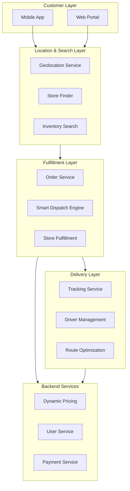
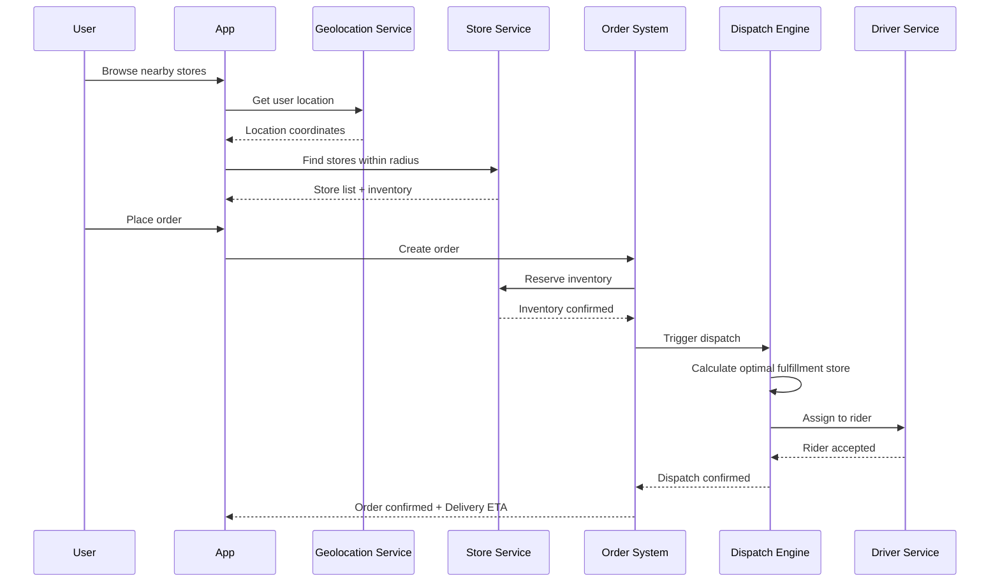
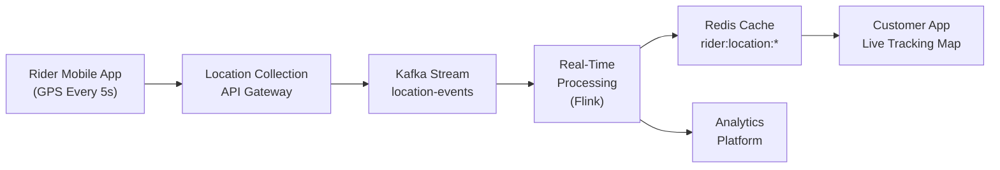
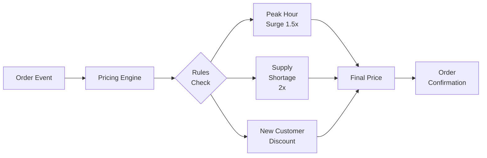

> **Production Environment Security Reminder**
>
> This document contains operational commands that can be executed directly. Before execution, please confirm: whether the target cluster and namespace are correct; whether you have sufficient RBAC permissions; whether testing has been completed in non-production environments. Command risk levels are marked as: 🔴 High Risk (may cause data loss or service interruption), 🟡 Medium Risk (modifies cluster state but usually reversible), 🟢 Low Risk/Read-Only (information collection, no side effects).

# Instant Retail Architecture Design - Alibaba Cloud Perspective

> **Applicable Scenarios**: 30-minute delivery O2O e-commerce, last-mile logistics, hyperlocal retail
> **Applicable Versions**: Kubernetes v1.29 - v1.33
> **Last Updated**: 2026-05-23
> **Target Readers**: Platform Engineers, Delivery Systems Architects, O2O Infrastructure Teams

---

## Table of Contents

1. [Industry Background](#1-industry-background)
2. [Business Architecture](#2-business-architecture)
3. [Technical Architecture](#3-technical-architecture)
4. [Core Data Flows](#4-core-data-flows)
5. [Security & Compliance](#5-security--compliance)
6. [Observability](#6-observability)
7. [Kubernetes Deployment](#7-kubernetes-deployment)
8. [Alibaba Cloud Component Mapping](#8-alibaba-cloud-component-mapping)
9. [Production Checklist](#9-production-checklist)

---

## 1. Industry Background

### 1.1 Business Characteristics

Instant retail (also known as "30-minute delivery" or "ultra-fast commerce") combines online shopping with rapid physical delivery:

| Challenge | Description | Architecture Impact |
|:---|:---|:---|
| Ultra-Fast Fulfillment | 30-minute delivery window | Store location-based selection, pre-positioning |
| Real-Time Inventory | Inventory sync across thousands of stores | Distributed cache + event streaming |
| Dynamic Pricing | Location-based and time-based pricing adjustments | Rules engine + cache consistency |
| Surge Dispatch | Peak-hour driver shortage management | Demand forecasting + surge pricing |
| Last-Mile Optimization | Multiple delivery modes (bike/scooter/car) | Route optimization + capacity planning |

### 1.2 Core Scenarios

- **Store Selection**: Find optimal fulfillment store based on location and inventory
- **Smart Dispatch**: Assign orders to riders considering current location and load
- **Real-Time Tracking**: Customer views live rider location and delivery status
- **Inventory Pre-positioning**: Stock high-demand items closer to customers
- **Pickup Services**: Customer self-pickup option to reduce delivery costs

---

## 2. Business Architecture

### 2.1 Instant Retail Full Landscape Architecture



### 2.2 Order Fulfillment Sequence



---

## 3. Technical Architecture

### 3.1 Location-Based Service (LBS) Deployment

```yaml
apiVersion: apps/v1
kind: Deployment
metadata:
  name: lbs-service
  namespace: instant-retail
spec:
  replicas: 10
  selector:
    matchLabels:
      app: lbs-service
  template:
    metadata:
      labels:
        app: lbs-service
    spec:
      containers:
        - name: lbs
          image: registry.cn-hangzhou.aliyuncs.com/retail/lbs-service:v3.0.0
          ports:
            - containerPort: 8080
              name: http
          env:
            - name: REDIS_CLUSTER
              value: "redis-cluster.instant-retail.svc.cluster.local:6379"
            - name: STORE_CACHE_TTL
              value: "300"
            - name: GEOHASH_PRECISION
              value: "9"
          resources:
            requests:
              cpu: "1000m"
              memory: "2Gi"
            limits:
              cpu: "2000m"
              memory: "4Gi"
          livenessProbe:
            httpGet:
              path: /health
              port: 8080
            initialDelaySeconds: 30
            periodSeconds: 10
```

### 3.2 Smart Dispatch Engine StatefulSet

```yaml
apiVersion: apps/v1
kind: StatefulSet
metadata:
  name: dispatch-engine
  namespace: instant-retail
spec:
  serviceName: dispatch-engine
  replicas: 3
  selector:
    matchLabels:
      app: dispatch-engine
  template:
    metadata:
      labels:
        app: dispatch-engine
    spec:
      affinity:
        podAntiAffinity:
          preferredDuringSchedulingIgnoredDuringExecution:
            - weight: 100
              podAffinityTerm:
                labelSelector:
                  matchExpressions:
                    - key: app
                      operator: In
                      values:
                        - dispatch-engine
                topologyKey: kubernetes.io/hostname
      containers:
        - name: engine
          image: registry.cn-hangzhou.aliyuncs.com/retail/dispatch-engine:v2.5.0
          ports:
            - containerPort: 8080
              name: http
            - containerPort: 9090
              name: metrics
          env:
            - name: MYSQL_HOST
              value: "mysql.instant-retail.svc.cluster.local"
            - name: REDIS_CLUSTER
              value: "redis-cluster.instant-retail.svc.cluster.local:6379"
            - name: KAFKA_BROKERS
              value: "kafka-0.kafka-headless.instant-retail.svc.cluster.local:9092"
            - name: MAX_DISPATCH_LATENCY_MS
              value: "5000"
          resources:
            requests:
              cpu: "2000m"
              memory: "4Gi"
            limits:
              cpu: "4000m"
              memory: "8Gi"
          volumeMounts:
            - name: dispatch-data
              mountPath: /data/dispatch
  volumeClaimTemplates:
    - metadata:
        name: dispatch-data
      spec:
        accessModes: ["ReadWriteOnce"]
        storageClassName: fast-ssd
        resources:
          requests:
            storage: 100Gi
```

### 3.3 KEDA Auto-scaling Configuration

```yaml
apiVersion: keda.sh/v1alpha1
kind: ScaledObject
metadata:
  name: seckill-scaler
  namespace: instant-retail
spec:
  scaleTargetRef:
    name: dispatch-engine
  minReplicaCount: 3
  maxReplicaCount: 50
  triggers:
    - type: kafka
      metadata:
        bootstrapServers: kafka-0.kafka-headless.instant-retail.svc.cluster.local:9092
        consumerGroup: dispatch-consumer
        topic: order-events
        lagThreshold: "1000"
        offsetResetPolicy: "latest"
    - type: cron
      metadata:
        timezone: Asia/Shanghai
        start: 0 11 * * * # 11:00 AM peak
        end: 0 14 * * *   # 2:00 PM end
        desiredReplicas: "30"
```

---

## 4. Core Data Flows

### 4.1 Rider Location Real-Time Sync



### 4.2 Dynamic Pricing Pipeline



---

## 5. Security & Compliance

### 5.1 Food Safety

- **Temperature Monitoring**: Temperature sensors track food quality during delivery
- **Freshness Verification**: Delivery time SLA ensures food freshness
- **Certification**: Store certifications and hygiene ratings displayed to customers

### 5.2 Privacy Protection

- **Address Masking**: Residential addresses partially masked for security
- **Driver Privacy**: Rider personal information not shared with customers
- **Data Retention**: Order data retention policy per GDPR/local regulations

---

## 6. Observability

### 6.1 Key Metrics

- **Fulfillment SLA**: P50/P95/P99 fulfillment times by location
- **Dispatch Accuracy**: Order assigned to closest/optimal store percentage
- **Delivery Timeliness**: % of orders delivered within promised window
- **Driver Utilization**: Active orders per driver ratio
- **Inventory Accuracy**: Discrepancy rate between system and physical stock

### 6.2 Alerting Rules

```yaml
apiVersion: monitoring.coreos.com/v1
kind: PrometheusRule
metadata:
  name: instant-retail-alerts
  namespace: instant-retail
spec:
  groups:
    - name: instant-retail
      interval: 30s
      rules:
        - alert: FulfillmentSLABreach
          expr: histogram_quantile(0.95, fulfillment_time_seconds_bucket) > 900
          for: 5m
          annotations:
            summary: "Fulfillment SLA breached (> 15 minutes)"

        - alert: DispatchEngineLatency
          expr: dispatch_latency_ms{quantile="0.99"} > 5000
          for: 2m
          annotations:
            summary: "Dispatch latency exceeds 5 seconds"

        - alert: RiderUtilizationLow
          expr: rider_active_orders < 2 and on(instance) rider_status == "online"
          for: 10m
          annotations:
            summary: "Driver underutilized - potential service degradation"
```

---

## 7. Kubernetes Deployment

### 7.1 Namespace and Network Policy

```yaml
apiVersion: v1
kind: Namespace
metadata:
  name: instant-retail
  labels:
    app: instant-retail

---
apiVersion: networking.k8s.io/v1
kind: NetworkPolicy
metadata:
  name: instant-retail-network
  namespace: instant-retail
spec:
  podSelector: {}
  policyTypes:
    - Ingress
    - Egress
  ingress:
    - from:
        - namespaceSelector:
            matchLabels:
              name: ingress-nginx
    - from:
        - namespaceSelector:
            matchLabels:
              name: instant-retail
  egress:
    - to:
        - namespaceSelector:
            matchLabels:
              name: instant-retail
    - to:
        - podSelector: {}
      ports:
        - protocol: TCP
          port: 53
        - protocol: UDP
          port: 53
```

---

## 8. Alibaba Cloud Component Mapping

| Functional Domain | **Alibaba Cloud Cloud-Native Solution** |
|:---|:---|
| Container Platform | **ACK Pro** |
| Location Services | **Location Services (LBS)** |
| Real-Time Computing | **Realtime Compute for Apache Flink** |
| Message Queue | **Apache Kafka on Alibaba Cloud** |
| Database | **RDS MySQL + PolarDB** |
| Cache | **Redis Enterprise Edition** |
| Observability | **ARMS + SLS** |
| CDN | **Alibaba Cloud CDN** |

---

## 9. Production Checklist

- [ ] Peak period elastic scaling validation (stress test 10x normal load)
- [ ] Multi-region deployment failover testing
- [ ] Dispatch engine latency < 5 seconds (P99)
- [ ] Fulfillment SLA < 30 minutes for 95% orders
- [ ] Rider location tracking accuracy validation
- [ ] Dynamic pricing rule consistency verification
- [ ] Inventory sync frequency audit (max 5s latency)
- [ ] Security audit: customer address masking
- [ ] Disaster recovery plan: data backup verification
- [ ] Load testing: concurrent order processing capacity

---

**Maintainers**: Alibaba Cloud Solutions Architecture Team | **License**: MIT

---

## Obsidian Related Documents

- [[domain-20-application-patterns/topic-application-architecture/README.md|Topic Application Architecture Design Best Practices]]
- [[domain-20-application-patterns/topic-application-architecture/01-ecommerce-architecture.md|E-Commerce System Kubernetes Production Architecture Design]]
- [[domain-20-application-patterns/topic-application-architecture/10-social-media-architecture.md|Social Media Platform Kubernetes Production Architecture Design]]
- [[domain-20-application-patterns/topic-application-architecture/44-martech-adtech.md|Digital Marketing & AdTech Architecture Design]]

## See Also

- 01-ecommerce-architecture
- 10-social-media-architecture
- 11-smart-retail-architecture

<!-- risk-assessed -->
