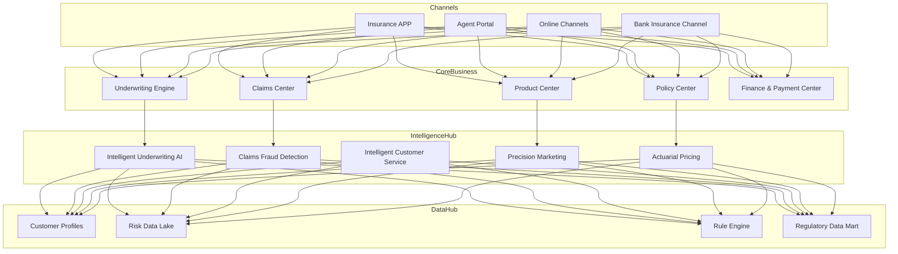
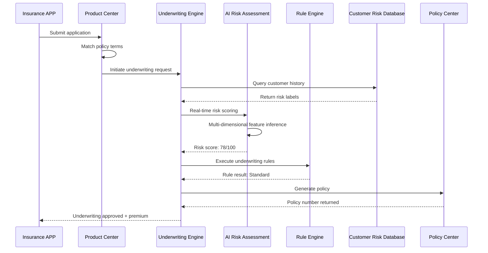
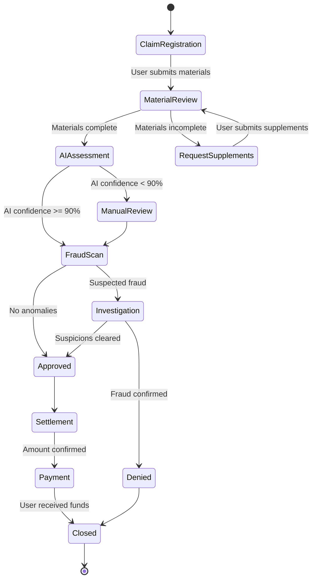
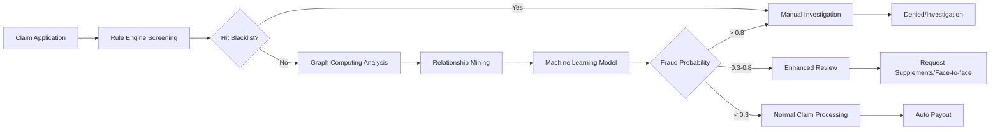

---title: InsurTech Architecture Design - Alibaba Cloud Perspective
description: 'title: InsurTech Architecture Design'
summary: 'title: InsurTech Architecture Design'
category: general
tags:
- architecture
- best-practice
- mysql
- hpa
- operator
- gpu
- nvidia
- rag
tier: supporting
created: '2026-05-23'
last_updated: 2026-05
difficulty: intermediate
reading_level: intermediate
audience:
- All Engineers
estimated_read_time: 15min
intent_queries:
- What is InsurTech Architecture Design - Alibaba Cloud Perspective
- How to implement InsurTech Architecture Design - Alibaba Cloud Perspective
- Kubernetes 20 application patterns best practices
trigger_keywords:
- InsurTech Architecture Design
- Alibaba Cloud Perspective
- application
- patterns
prerequisites:
- kubectl-basics
- prometheus-basics
- mysql-basics
- gpu-scheduling-basics
authors:
- name: Dillan Teagle
  role: contributor
source_path: /Users/teaglebuilt/github/teaglebuilt/knowledge/tree/application/architecture/insurtech.md
original_language: Chinese
---

> **Production Environment Safety Notice**
>
> This document contains operational commands that can be executed directly. Before executing, confirm: the target cluster and namespace are correct; you have sufficient RBAC permissions; the command has been tested in a non-production environment. Risk levels for commands: 🔴 High risk (may cause data loss or service interruption), 🟡 Medium risk (modifies cluster state but usually reversible), 🟢 Low risk/read-only (information gathering, no side effects).

title: InsurTech Architecture Design
description: '# InsurTech Architecture Design - Alibaba Cloud Perspective'
category: application-architecture
tags:
- k8s
- architecture
- industry
- mysql
- hpa
- operator
- gpu
- nvidia
- rag
last_updated: 2026-05-18
difficulty: advanced
reading_level: advanced
audience:
- InsurTech Architects
- Insurance System Developers
- Alibaba Cloud Solution Architects
- FinTech Engineers
estimated_read_time: 5min
intent_queries:
- Insurance Technology System [[Kubernetes|Kubernetes]] Deployment Architecture
- Intelligent Underwriting Engine AI Model Design
- Insurance Fraud Detection Graph Computing Architecture
- Claims Automation RPA AI Loss Assessment
- Solvency II / IFRS17 Compliance Architecture
trigger_keywords:
- InsurTech
- Intelligent Underwriting
- AI Claims
- Fraud Prevention
- Graph Computing
- Rule Engine
- Actuarial Pricing
- Solvency II
- IFRS17
- Claims Automation
related_domains:
- domain-03-networking-traffic
- domain-12-observability-comprehensive
- domain-9-security-compliance
- domain-7-ai-ml-platform
related_topics:
- domain-20-application-patterns/topic-application-architecture/06-fintech-architecture
- domain-20-application-patterns/topic-application-architecture/82-legaltech
k8s_versions:
- '1.28'
- '1.29'
- '1.30'
- '1.31'
- '1.32'
---

# InsurTech Architecture Design - Alibaba Cloud Perspective

> **Applicable Versions**: Kubernetes v1.29 - v1.33 | **Last Updated**: 2026-05-18
> **Authors**: Alibaba Cloud Solution Architects | **Tags**: `#InsurTech` `#IntelligentUnderwriting` `#Claims` `#Actuarial` `#AlibabaCloud`

---

## Table of Contents

1. [Industry Background](#1-industry-background)
2. [Business Architecture](#2-business-architecture)
3. [Technical Architecture](#3-technical-architecture)
4. [Core Data Flows](#4-core-data-flows)
5. [Security & Compliance](#5-security--compliance)
6. [Observability](#6-observability)
7. [Alibaba Cloud Component Mapping](#7-alibaba-cloud-component-mapping)
8. [Production Checklist](#8-production-checklist)

---

## 1. Industry Background

### 1.1 Business Characteristics

InsurTech is reshaping the traditional insurance value chain:

| Challenge | Description | Architecture Impact |
|:---|:---|:---|
| Rapid Product Iteration | Scenario-based insurance (return shipping, flight delay) | Low-code product configuration + rule engine |
| Intelligent Underwriting | Personalized risk assessment at scale | Real-time AI model inference |
| Fraud Detection | Identifying fraud claims (health/auto insurance) | Graph computing + machine learning |
| Regulatory Compliance | Solvency II / IFRS17 reporting | Data lineage + audit trails |
| Claims Speed | Customer expectation for minute-level claims | RPA + AI loss assessment |

### 1.2 Core Scenarios

- **Intelligent Underwriting**: Real-time risk assessment based on big data
- **AI Claims**: Image recognition for loss assessment, medical document OCR
- **Precision Marketing**: User profile-driven insurance product recommendations
- **Actuarial Pricing**: Big data-driven dynamic premium calculation
- **Regulatory Reporting**: Automated Solvency II / IFRS17 reporting

---

## 2. Business Architecture

### 2.1 InsurTech Full Landscape Architecture



### 2.2 Intelligent Underwriting Sequence



### 2.3 Claims Processing State Machine



---

## 3. Technical Architecture

### 3.1 K8s Deployment Architecture

```yaml
# Underwriting Engine Deployment
apiVersion: apps/v1
kind: Deployment
metadata:
  name: underwriting-engine
  namespace: insurtech
spec:
  replicas: 5
  selector:
    matchLabels:
      app: underwriting-engine
  template:
    metadata:
      labels:
        app: underwriting-engine
    spec:
      affinity:
        podAntiAffinity:
          requiredDuringSchedulingIgnoredDuringExecution:
            - labelSelector:
                matchExpressions:
                  - key: app
                    operator: In
                    values: [underwriting-engine]
              topologyKey: topology.kubernetes.io/zone
      containers:
        - name: engine
          image: registry.cn-hangzhou.aliyuncs.com/insurtech/uw-engine:v4.1.0
          ports:
            - containerPort: 8080
          env:
            - name: RULE_ENGINE_URL
              value: "http://rule-engine:8080"
            - name: AI_MODEL_ENDPOINT
              value: "http://ai-risk-service:8501"
            - name: DB_POOL_MAX
              value: "50"
          resources:
            requests:
              memory: "2Gi"
              cpu: "1000m"
            limits:
              memory: "4Gi"
              cpu: "2000m"
          livenessProbe:
            httpGet:
              path: /health
              port: 8080
            initialDelaySeconds: 30
            periodSeconds: 15
```

```yaml
# AI Inference Service GPU Deployment
apiVersion: apps/v1
kind: Deployment
metadata:
  name: ai-claim-service
  namespace: insurtech
spec:
  replicas: 2
  selector:
    matchLabels:
      app: ai-claim-service
  template:
    metadata:
      labels:
        app: ai-claim-service
    spec:
      nodeSelector:
        accelerator: nvidia-t4
      runtimeClassName: nvidia
      containers:
        - name: tf-serving
          image: registry.cn-hangzhou.aliyuncs.com/insurtech/ai-claim:v2.3.0-gpu
          ports:
            - containerPort: 8501
              name: rest-api
          resources:
            requests:
              nvidia.com/gpu: 1
              memory: "8Gi"
              cpu: "4000m"
            limits:
              nvidia.com/gpu: 1
              memory: "16Gi"
              cpu: "8000m"
          volumeMounts:
            - name: model-volume
              mountPath: /models
      volumes:
        - name: model-volume
          persistentVolumeClaim:
            claimName: ai-model-pvc
```

```yaml
# HPA for Claims Peak Period
apiVersion: autoscaling/v2
kind: HorizontalPodAutoscaler
metadata:
  name: claim-processor-hpa
  namespace: insurtech
spec:
  scaleTargetRef:
    apiVersion: apps/v1
    kind: Deployment
    name: claim-processor
  minReplicas: 5
  maxReplicas: 50
  metrics:
    - type: Pods
      pods:
        metric:
          name: claim_queue_length
        target:
          type: AverageValue
          averageValue: "10"
    - type: Resource
      resource:
        name: cpu
        target:
          type: Utilization
          averageUtilization: 70
```

---

## 4. Core Data Flows

### 4.1 Fraud Detection Data Flow



---

## 5. Security & Compliance

- **Solvency II Compliance**: Data classification, 10-year audit log retention
- **Personal Information Protection**: Insurance data encryption, minimal collection
- **Anti-Money Laundering**: Large transaction monitoring, suspicious transaction reporting

---

## 6. Observability

- **Underwriting Latency**: P99 < 3s
- **Claims Latency**: Simple cases < 10 minutes
- **Fraud Detection Accuracy**: > 95%
- **System Availability**: 99.99%

---

## 7. Alibaba Cloud Component Mapping

| Functional Domain | **Alibaba Cloud Cloud-Native Solution** |
|:---|:---|
| Container Platform | **ACK Pro** |
| Database | **PolarDB MySQL** |
| Big Data | **MaxCompute + Flink** |
| AI Inference | **PAI-EAS** |
| Object Storage | **OSS** |
| Message Queue | **RocketMQ** |
| Observability | **ARMS + SLS** |
| Security | **Cloud Shield + WAF + KMS** |
| OCR | **Alibaba Cloud Vision Intelligence** |
| Graph Computing | **GraphCompute** |

---

## 8. Production Checklist

- [ ] Underwriting rule engine version consistency
- [ ] AI model A/B testing verification
- [ ] Fraud detection rule threshold tuning
- [ ] Regulatory reporting data accuracy validation
- [ ] Level 3 Information Security / Solvency II Compliance Audit

---

**Maintainers**: Alibaba Cloud Solution Architecture Team | **License**: MIT

---

## Obsidian Related Documents

- topic-application-architecture KUDIG Database — Global MOC
- [[domain-20-application-patterns/topic-application-architecture/README.md|[[Topic Application Architecture Design Best Practices|Topic Application Architecture Design Best Practices]]]]
- [[domain-20-application-patterns/topic-application-architecture/01-ecommerce-architecture.md|E-Commerce System Kubernetes Production Architecture Design]]
- [[domain-20-application-patterns/topic-application-architecture/02-mini-program-architecture.md|Mini Program Platform Architecture Design]]
- [[domain-20-application-patterns/topic-application-architecture/03-cms-architecture.md|CMS Content Management System Architecture Design]]
- [[domain-20-application-patterns/topic-application-architecture/04-im-rtc-architecture.md|Real-Time Communication IM/RTC Architecture Design]]
- [[domain-20-application-patterns/topic-application-architecture/05-online-education-architecture.md|Online Education Platform Kubernetes Production Architecture Design]]
- [[domain-20-application-patterns/topic-application-architecture/06-fintech-architecture.md|FinTech Financial Technology Kubernetes Production Architecture Design]]
- [[domain-20-application-patterns/topic-application-architecture/07-iot-platform-architecture.md|IoT Internet of Things Platform Architecture Design]]
- [[domain-20-application-patterns/topic-application-architecture/08-ai-ml-inference-architecture.md|AI/ML Inference Service Kubernetes Production Architecture Design]]
- [[domain-20-application-patterns/topic-application-architecture/09-gaming-backend-architecture.md|Gaming Backend Kubernetes Production Architecture Design]]
- [[domain-20-application-patterns/topic-application-architecture/10-social-media-architecture.md|Social Media Platform Kubernetes Production Architecture Design]]

## See Also

- 22-nev-connected-vehicle
- 23-xinchuang-it-innovation
- 25-quantitative-trading
- 26-aviation-travel


<!-- risk-assessed -->
