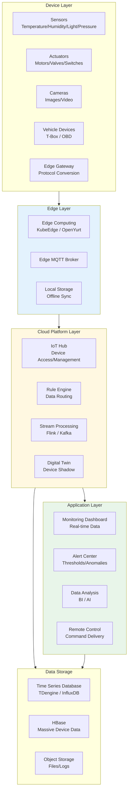
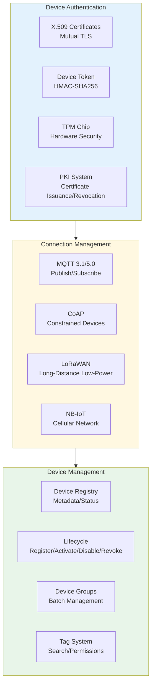
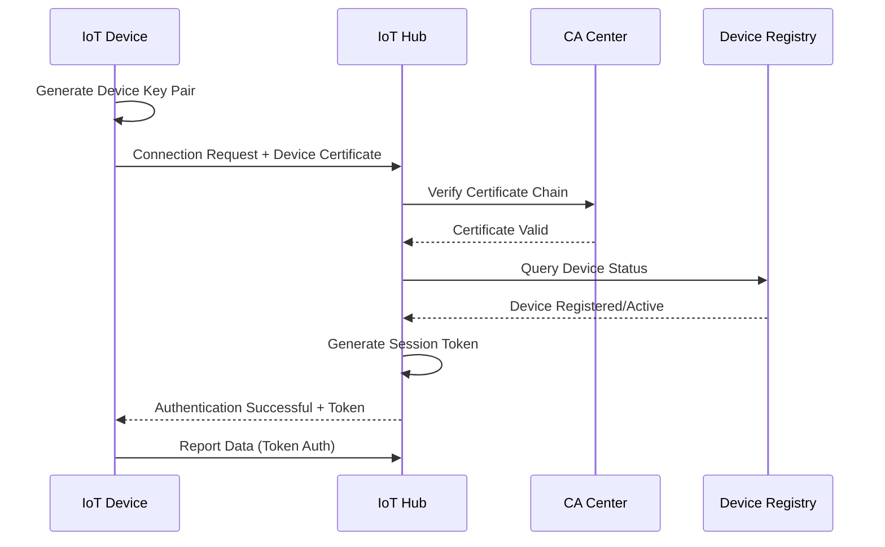
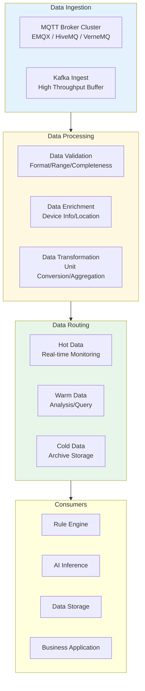
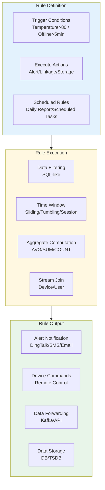
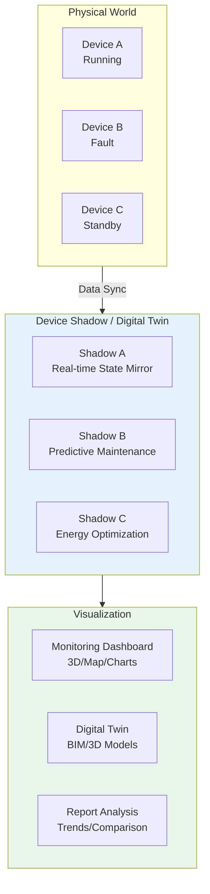
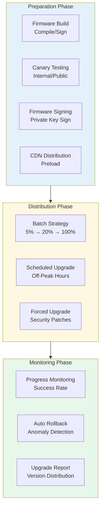
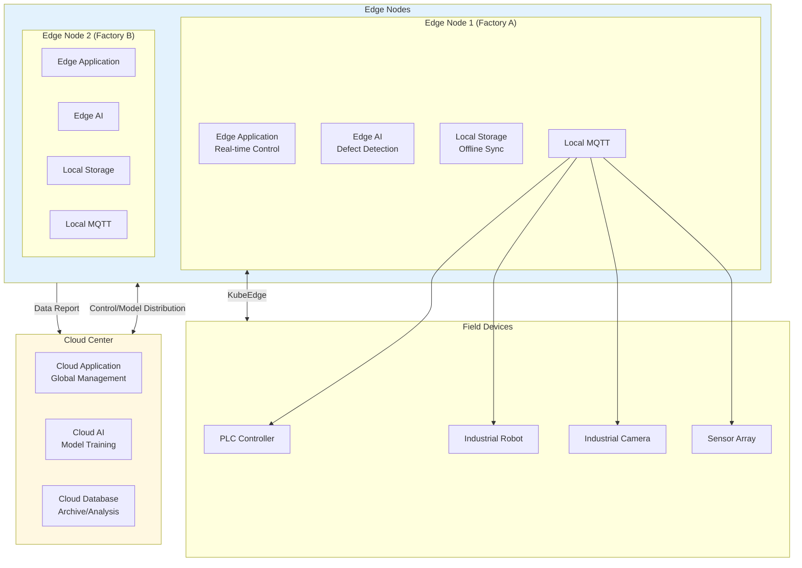

---title: IoT Platform Kubernetes Production Architecture Design
description: 'title: IoT Platform Architecture Design'
summary: 'title: IoT Platform Architecture Design'
category: general
tags:
- architecture
- best-practice
- flux
- kafka
- statefulset
- gateway
- operator
- rag
tier: core
created: '2026-05-23'
last_updated: 2026-05
difficulty: intermediate
reading_level: intermediate
audience:
- All Engineers
estimated_read_time: 15min
intent_queries:
- What is IoT Platform Kubernetes Production Architecture Design
- How to implement IoT Platform Kubernetes Production Architecture Design
- Kubernetes 20 application patterns best practices
trigger_keywords:
- IoT Platform
- Internet of Things
- Platform
- Kubernetes
- Production Architecture Design
- application
- patterns
prerequisites:
- kubectl-basics
- prometheus-basics
- kafka-basics
authors:
- name: Dillan Teagle
  role: contributor
source_path: /Users/teaglebuilt/github/teaglebuilt/knowledge/tree/application/architecture/iot-platform-architecture.md
original_language: Chinese
---

> **Production Environment Safety Notice**
>
> This document contains operational commands that can be executed directly. Before executing, confirm: the target cluster and namespace are correct; you have sufficient RBAC permissions; the command has been tested in a non-production environment. Risk levels for commands: 🔴 High risk (may cause data loss or service interruption), 🟡 Medium risk (modifies cluster state but usually reversible), 🟢 Low risk/read-only (information gathering, no side effects).

title: IoT Platform Architecture Design
description: '# IoT Platform [[Kubernetes|Kubernetes]] Production Architecture Design'
category: application-architecture
tags:
- k8s
- architecture
- industry
- [[Flux|flux]]
- kafka
- [[StatefulSet|statefulset]]
- gateway
- operator
- rag
last_updated: 2026-05-18
difficulty: advanced
reading_level: advanced
audience:
- IoT Architects
- Embedded Engineers
- Platform Engineers
estimated_read_time: 5min
intent_queries:
- IoT Platform Kubernetes Device Access Architecture
- MQTT Broker EMQX Cluster Deployment
- Edge Computing KubeEdge Device Management
- Time Series Database TDengine IoT Data
- Digital Twin IoT Platform
trigger_keywords:
- IoT Platform
- Internet of Things
- MQTT
- EMQX
- Device Access
- Edge Computing
- KubeEdge
- OpenYurt
- Time Series Database
- OTA Upgrade
- Device Shadow
related_domains:
- domain-03-networking-traffic
- domain-10-troubleshooting-diagnostics
related_topics:
- topic-iot-platform-architecture
- topic-edge-computing
k8s_versions:
- '1.28'
- '1.29'
- '1.30'
- '1.31'
- '1.32'
---

# IoT Platform Kubernetes Production Architecture Design

> **Applicable Scenarios**: Smart Home / Industrial IoT / Connected Vehicles / Smart Cities / Agricultural Monitoring / Energy Management
> **Applicable Versions**: Kubernetes v1.29 - v1.33
> **Last Updated**: 2026-04-24
> **Target Readers**: IoT Architects, Embedded Engineers, Platform Engineers

---

## Table of Contents

- [1. Overall Architecture Overview](#1-overall-architecture-overview)
- [2. Device Access and Authentication Architecture](#2-device-access-and-authentication-architecture)
- [3. Message Bus and Data Flow Architecture](#3-message-bus-and-data-flow-architecture)
- [4. Rule Engine and Real-Time Processing Architecture](#4-rule-engine-and-real-time-processing-architecture)
- [5. Digital Twin and Visualization Architecture](#5-digital-twin-and-visualization-architecture)
- [6. OTA Upgrade Architecture](#6-ota-upgrade-architecture)
- [7. Edge Computing Architecture](#7-edge-computing-architecture)
- [8. K8s Deployment Architecture](#8-k8s-deployment-architecture)

---

## 1. Overall Architecture Overview



---

## 2. Device Access and Authentication Architecture



## Device Authentication Flow



---

## 3. Message Bus and Data Flow Architecture



## EMQX MQTT Broker K8s Deployment

```yaml
apiVersion: apps/v1
kind: StatefulSet
metadata:
  name: emqx
  namespace: iot-platform
spec:
  serviceName: emqx-headless
  replicas: 3
  selector:
    matchLabels:
      app: emqx
  template:
    metadata:
      labels:
        app: emqx
    spec:
      affinity:
        podAntiAffinity:
          requiredDuringSchedulingIgnoredDuringExecution:
            - labelSelector:
                matchExpressions:
                  - key: app
                    operator: In
                    values:
                      - emqx
              topologyKey: kubernetes.io/hostname
      containers:
        - name: emqx
          image: emqx/emqx:5.5
          ports:
            - containerPort: 1883
              name: mqtt
            - containerPort: 8883
              name: mqtts
            - containerPort: 8083
              name: ws
            - containerPort: 8084
              name: wss
            - containerPort: 18083
              name: dashboard
          env:
            - name: EMQX_NODE_NAME
              value: "emqx@$(POD_NAME).emqx-headless.iot-platform.svc.cluster.local"
            - name: EMQX_CLUSTER__DISCOVERY_STRATEGY
              value: "dns"
            - name: EMQX_CLUSTER__DNS__NAME
              value: "emqx-headless.iot-platform.svc.cluster.local"
            - name: EMQX_LISTENERS__SSL__DEFAULT__ENABLE
              value: "true"
            - name: EMQX_LISTENERS__SSL__DEFAULT__SSL_OPTIONS__CERTFILE
              value: "/etc/emqx/certs/server.crt"
            - name: EMQX_LISTENERS__SSL__DEFAULT__SSL_OPTIONS__KEYFILE
              value: "/etc/emqx/certs/server.key"
          resources:
            requests:
              cpu: "1"
              memory: "2Gi"
            limits:
              cpu: "4"
              memory: "8Gi"
          volumeMounts:
            - name: emqx-data
              mountPath: /opt/emqx/data
            - name: emqx-certs
              mountPath: /etc/emqx/certs
              readOnly: true
  volumeClaimTemplates:
    - metadata:
        name: emqx-data
      spec:
        storageClassName: fast-ssd
        accessModes: ["ReadWriteOnce"]
        resources:
          requests:
            storage: 50Gi
```

---

## 4. Rule Engine and Real-Time Processing Architecture



---

## 5. Digital Twin and Visualization Architecture



---

## 6. OTA Upgrade Architecture



---

## 7. Edge Computing Architecture



## KubeEdge Edge Node Deployment

```yaml
apiVersion: apps/v1
kind: Deployment
metadata:
  name: edge-app-controller
  namespace: iot-edge
spec:
  replicas: 1
  selector:
    matchLabels:
      app: edge-app-controller
  template:
    metadata:
      labels:
        app: edge-app-controller
    spec:
      nodeName: edge-node-factory-a
      containers:
        - name: controller
          image: iot/edge-controller:v1.0
          env:
            - name: EDGE_NODE_ID
              value: "factory-a-line-1"
            - name: CLOUD_SYNC_INTERVAL
              value: "30"
            - name: LOCAL_MQTT_BROKER
              value: "tcp://localhost:1883"
          resources:
            requests:
              cpu: "500m"
              memory: "512Mi"
            limits:
              cpu: "2"
              memory: "2Gi"
          volumeMounts:
            - name: local-buffer
              mountPath: /data/buffer
      volumes:
        - name: local-buffer
          hostPath:
            path: /opt/edge/buffer
            type: DirectoryOrCreate
```

---

## 8. K8s Deployment Architecture

## Time Series Database TDengine Deployment

```yaml
apiVersion: apps/v1
kind: StatefulSet
metadata:
  name: tdengine-dnode
  namespace: iot-platform
spec:
  serviceName: tdengine-dnode
  replicas: 3
  selector:
    matchLabels:
      app: tdengine-dnode
  template:
    metadata:
      labels:
        app: tdengine-dnode
    spec:
      affinity:
        podAntiAffinity:
          requiredDuringSchedulingIgnoredDuringExecution:
            - labelSelector:
                matchExpressions:
                  - key: app
                    operator: In
                    values:
                      - tdengine-dnode
              topologyKey: kubernetes.io/hostname
      containers:
        - name: tdengine
          image: tdengine/tdengine:3.2
          ports:
            - containerPort: 6030
              name: taosd
            - containerPort: 6041
              name: rest
          env:
            - name: TAOS_FQDN
              valueFrom:
                fieldRef:
                  fieldPath: metadata.name
            - name: TAOS_FIRST_EP
              value: "tdengine-dnode-0.tdengine-dnode.iot-platform.svc.cluster.local:6030"
          resources:
            requests:
              cpu: "2"
              memory: "8Gi"
            limits:
              cpu: "8"
              memory: "32Gi"
          volumeMounts:
            - name: taos-data
              mountPath: /var/lib/taos
  volumeClaimTemplates:
    - metadata:
        name: taos-data
      spec:
        storageClassName: fast-ssd
        accessModes: ["ReadWriteOnce"]
        resources:
          requests:
            storage: 1Ti
```

---

## Reference Links

- [EMQX Documentation](https://www.emqx.io/docs/)
- [KubeEdge Documentation](https://kubeedge.io/docs/)
- [TDengine Documentation](https://docs.tdengine.com/)
- [IoT MQTT Protocol](https://mqtt.org/)

---

## Obsidian Related Documents

- topic-application-architecture MOC
- [[domain-20-application-patterns/topic-application-architecture/README.md|Topic Application Architecture Design Best Practices]]
- [[domain-20-application-patterns/topic-application-architecture/01-ecommerce-architecture.md|E-Commerce System Kubernetes Production Architecture Design]]
- [[domain-20-application-patterns/topic-application-architecture/02-mini-program-architecture.md|Mini Program Platform Architecture Design]]
- [[domain-20-application-patterns/topic-application-architecture/03-cms-architecture.md|CMS Content Management System Architecture Design]]
- [[domain-20-application-patterns/topic-application-architecture/04-im-rtc-architecture.md|Real-Time Communication IM/RTC Architecture Design]]
- [[domain-20-application-patterns/topic-application-architecture/05-online-education-architecture.md|Online Education Platform Kubernetes Production Architecture Design]]
- [[domain-20-application-patterns/topic-application-architecture/06-fintech-architecture.md|FinTech Financial Technology Kubernetes Production Architecture Design]]
- [[domain-20-application-patterns/topic-application-architecture/08-ai-ml-inference-architecture.md|AI/ML Inference Service Kubernetes Production Architecture Design]]
- [[domain-20-application-patterns/topic-application-architecture/09-gaming-backend-architecture.md|Gaming Backend Kubernetes Production Architecture Design]]
- [[domain-20-application-patterns/topic-application-architecture/10-social-media-architecture.md|Social Media Platform Kubernetes Production Architecture Design]]
- [[domain-20-application-patterns/topic-application-architecture/11-smart-retail-architecture.md|Smart Retail & New Retail Kubernetes Production Architecture Design]]

## See Also

- 05-online-education-architecture
- 06-fintech-architecture
- 08-ai-ml-inference-architecture
- 09-gaming-backend-architecture


<!-- risk-assessed -->
