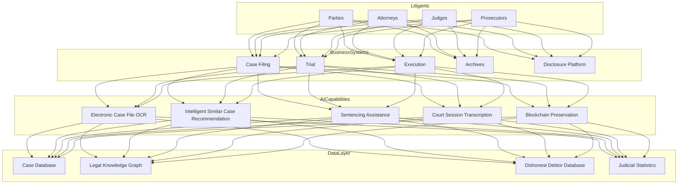

---title: LegalTech Architecture Design - Alibaba Cloud Perspective
description: 'title: LegalTech Architecture Design'
summary: 'title: LegalTech Architecture Design'
category: general
tags:
- architecture
- best-practice
tier: supporting
created: '2026-05-23'
last_updated: 2026-05
difficulty: intermediate
reading_level: intermediate
audience:
- All Engineers
estimated_read_time: 15min
intent_queries:
- What is LegalTech Architecture Design - Alibaba Cloud Perspective
- How to implement LegalTech Architecture Design - Alibaba Cloud Perspective
- Kubernetes 20 application patterns best practices
trigger_keywords:
- LegalTech Architecture Design
- Alibaba Cloud Perspective
- application
- patterns
prerequisites:
- kubectl-basics
- prometheus-basics
authors:
- name: Dillan Teagle
  role: contributor
source_path: /Users/teaglebuilt/github/teaglebuilt/knowledge/tree/application/architecture/legaltech.md
original_language: Chinese
---

> **Production Environment Safety Notice**
>
> This document contains operational commands that can be executed directly. Before executing, confirm: the target cluster and namespace are correct; you have sufficient RBAC permissions; the command has been tested in a non-production environment. Risk levels for commands: 🔴 High risk (may cause data loss or service interruption), 🟡 Medium risk (modifies cluster state but usually reversible), 🟢 Low risk/read-only (information gathering, no side effects).

title: LegalTech Architecture Design
description: '# LegalTech Architecture Design - Alibaba Cloud Perspective'
category: application-architecture
tags:
- k8s
- architecture
- industry
last_updated: 2026-05-18
difficulty: advanced
reading_level: advanced
audience:
- LegalTech Architects
- Smart Court System Developers
- Government Cloud Solution Engineers
- Alibaba Cloud Government Solution Architects
estimated_read_time: 5min
intent_queries:
- LegalTech Smart Court [[Kubernetes|Kubernetes]] Deployment
- Similar Case Recommendation NLP Knowledge Graph Architecture
- Electronic Case File OCR Structured Extraction
- Blockchain Electronic Evidence Preservation
- Legal AI Assisted Trial System
trigger_keywords:
- LegalTech
- Smart Court
- Intelligent Trial
- Similar Case Recommendation
- Electronic Case Files
- Blockchain Preservation
- Legal Knowledge Graph
- Sentencing Assistance
- Online Mediation
related_domains:
- domain-9-security-compliance
- domain-03-networking-traffic
- domain-7-ai-ml-platform
related_topics:
- domain-20-application-patterns/topic-application-architecture/13-digital-government-architecture
- domain-20-application-patterns/topic-application-architecture/24-insurtech
k8s_versions:
- '1.28'
- '1.29'
- '1.30'
- '1.31'
- '1.32'
---

# LegalTech Architecture Design - Alibaba Cloud Perspective

> **Applicable Versions**: Kubernetes v1.29 - v1.33 | **Last Updated**: 2026-05-18
> **Authors**: Alibaba Cloud Solution Architects | **Tags**: `#LegalTech` `#SmartCourt` `#IntelligentTrial` `#AlibabaCloud`

---

## Table of Contents

1. [Overview](#1-overview)
2. [Design Principles](#2-design-principles)
3. [Architecture Patterns](#3-architecture-patterns)
4. [Implementation Examples](#4-implementation-examples)
5. [Kubernetes Deployment](#5-kubernetes-deployment)
6. [Best Practices](#6-best-practices)
7. [Anti-Patterns](#7-anti-patterns)
8. [Reference Resources](#8-reference-resources)

---

## 1. Overview

LegalTech improves the justice system's fairness, efficiency, and transparency through digitalization. Against the backdrop of "smart court" construction, China's court system is comprehensively advancing electronic case files, intelligent court sessions, similar case recommendations, online mediation, blockchain preservation, and other technological applications. The core objectives of LegalTech are to automate cumbersome manual processes, make implicit legal knowledge explicit, and centralize scattered judicial data.

The core challenge for LegalTech systems is **security and compliance** combined with **accuracy**. Judicial data (case information, case files, judgment documents) is highly sensitive and requires strict access control and encryption protection. AI-assisted functions (similar case recommendations, sentencing suggestions) directly impact judicial fairness and require rigorous validation.

### 1.1 Industry Background

| Challenge | Description | Architecture Impact |
|:---|:---|:---|
| Case File Digitalization | Massive paper case file digitization | OCR + Structured Extraction |
| Trial Automation | Similar case recommendations / sentencing assistance | NLP + Knowledge Graph |
| Execution Difficulties | Asset location for judgment debtors | Big Data Analytics |
| Cross-Domain Case Filing | Cross-jurisdictional litigation convenience | Collaboration Platform |
| Data Security | Judicial data highly sensitive | Encryption + Isolation + Audit |

### 1.2 Core Scenarios

- **Smart Trial**: Electronic case file co-generation, court session transcription, intelligent similar case recommendation
- **Smart Execution**: Network asset inquiry (bank/property/vehicles), credit punishment, asset disposal
- **Smart Service**: Cross-domain case filing, online mediation, judicial disclosure
- **Smart Management**: Trial management, quality assessment, data-driven decisions
- **Blockchain Preservation**: Electronic evidence timestamp preservation, judgment document tamper-proofing

---

## 2. Design Principles

### 2.1 Security and Compliance Principle

Judicial systems must meet Level 3 Information Security and Cryptography Application Security Assessment requirements. All data transmission uses SM2/SM3/SM4 national cryptography algorithms. Core systems are deployed on government clouds or proprietary clouds. Data access follows the principle of least privilege, with all operations recorded in audit logs.

### 2.2 AI Assistance Not Replacement Principle

In LegalTech, AI functions are "assistive" not "replacive"—AI provides similar case references and sentencing suggestions, while final judgment authority remains with judges. System design must clearly mark AI outputs as "reference suggestions" and preserve judges' full discretion.

### 2.3 Data Standardization Principle

Standardization of judicial data is the foundation for cross-system collaboration. Case information, judgment documents, and electronic case files must follow the Supreme Court's data standards (such as "Court Information Technology Standards") to support data sharing among courts nationwide.

### 2.4 Zero Trust Principle

The judicial system adopts zero trust security architecture—do not trust any internal or external access requests; all access requires authentication, permission validation, and behavior audit. Sensitive operations (case file access, judgment issuance) require dual approvals.

---

## 3. Architecture Patterns

### 3.1 Smart Court Full Landscape Architecture



---

## 4. Implementation Examples

### 4.1 Similar Case Retrieval Service

```python
from dataclasses import dataclass
from typing import List

@dataclass
class SimilarCase:
    case_id: str
    title: str
    court: str
    date: str
    similarity: float
    key_factors: List[str]
    verdict: str

class CaseSimilarityEngine:
    def search(self, query_factors: List[str],
               case_type: str = None,
               top_k: int = 10) -> List[SimilarCase]:
        query_embedding = self._encode_factors(query_factors)
        candidates = self._retrieve_candidates(case_type)
        scored = []
        for case in candidates:
            case_embedding = self._encode_factors(case['factors'])
            sim = self._cosine_similarity(query_embedding, case_embedding)
            scored.append((sim, case))

        scored.sort(key=lambda x: x[0], reverse=True)
        results = []
        for sim, case in scored[:top_k]:
            results.append(SimilarCase(
                case_id=case['id'],
                title=case['title'],
                court=case['court'],
                date=case['date'],
                similarity=sim,
                key_factors=case['factors'],
                verdict=case['verdict'],
            ))
        return results

    def _encode_factors(self, factors: List[str]):
        return [hash(f) % 1000 / 1000.0 for f in factors]

    def _retrieve_candidates(self, case_type: str):
        return []

    def _cosine_similarity(self, a, b):
        import numpy as np
        a, b = np.array(a), np.array(b)
        if len(a) != len(b):
            return 0.0
        norm = np.linalg.norm(a) * np.linalg.norm(b)
        if norm == 0:
            return 0.0
        return float(np.dot(a, b) / norm)
```

---

## 5. Kubernetes Deployment

```yaml
apiVersion: apps/v1
kind: Deployment
metadata:
  name: intelligent-trial
  namespace: legaltech
spec:
  replicas: 3
  selector:
    matchLabels:
      app: intelligent-trial
  template:
    metadata:
      labels:
        app: intelligent-trial
    spec:
      containers:
        - name: trial
          image: registry.cn-hangzhou.aliyuncs.com/legal/intelligent-trial:v2.0.0
          env:
            - name: KNOWLEDGE_GRAPH_URL
              value: "http://legal-kg:8080"
            - name: CASE_SIMILARITY_THRESHOLD
              value: "0.85"
          resources:
            requests:
              memory: "4Gi"
              cpu: "2000m"
            limits:
              memory: "8Gi"
              cpu: "4000m"
```

---

## 6. Best Practices

- **National Cryptography**: Use SM2/SM3/SM4 national cryptography algorithms for encryption and signing
- **Dual Approval**: Sensitive operations (case file access, judgment issuance) require dual approvals
- **AI Annotation**: Clearly mark AI recommendation results as "reference suggestions"
- **Blockchain Preservation**: Use blockchain for electronic evidence preservation ensuring immutability

## 7. Anti-Patterns

- **AI Replaces Judges**: AI directly makes judgment decisions, infringing on judicial discretion. AI should only provide reference suggestions
- **Unencrypted Data**: Judicial data transmitted in plaintext. Should use national cryptography algorithms for end-to-end encryption
- **Ignoring Security Standards**: Systems not passing Level 3 Information Security assessment. Should incorporate compliance requirements from design phase

---

## 8. Reference Resources

### 8.1 Alibaba Cloud Component Mapping

| Functional Domain | **Alibaba Cloud Cloud-Native Solution** |
|:---|:---|
| Container Platform | **ACK Pro** |
| AI | **PAI + NLP** |
| Blockchain | **Ant Chain BaaS** |
| Database | **PolarDB** |
| Object Storage | **OSS** |
| Observability | **ARMS + SLS** |

### 8.2 Production Checklist

- [ ] Electronic Case File OCR accuracy > 98%
- [ ] Similar case recommendation relevance verification
- [ ] Blockchain preservation immutability verification
- [ ] Judicial data encryption in transmission
- [ ] Level 3 Information Security / Cryptography Assessment Compliance

---

**Maintainers**: Alibaba Cloud Solution Architecture Team | **License**: MIT

---

## Obsidian Related Documents

- topic-application-architecture KUDIG Database — Global MOC
- [[domain-20-application-patterns/topic-application-architecture/README.md|Topic Application Architecture Design Best Practices]]
- [[domain-20-application-patterns/topic-application-architecture/01-ecommerce-architecture.md|E-Commerce System Kubernetes Production Architecture Design]]
- [[domain-20-application-patterns/topic-application-architecture/02-mini-program-architecture.md|Mini Program Platform Architecture Design]]
- [[domain-20-application-patterns/topic-application-architecture/03-cms-architecture.md|CMS Content Management System Architecture Design]]
- [[domain-20-application-patterns/topic-application-architecture/04-im-rtc-architecture.md|Real-Time Communication IM/RTC Architecture Design]]
- [[domain-20-application-patterns/topic-application-architecture/05-online-education-architecture.md|Online Education Platform Kubernetes Production Architecture Design]]
- [[domain-20-application-patterns/topic-application-architecture/06-fintech-architecture.md|FinTech Financial Technology Kubernetes Production Architecture Design]]
- [[domain-20-application-patterns/topic-application-architecture/07-iot-platform-architecture.md|IoT Internet of Things Platform Architecture Design]]
- [[domain-20-application-patterns/topic-application-architecture/08-ai-ml-inference-architecture.md|AI/ML Inference Service Kubernetes Production Architecture Design]]
- [[domain-20-application-patterns/topic-application-architecture/09-gaming-backend-architecture.md|Gaming Backend Kubernetes Production Architecture Design]]
- [[domain-20-application-patterns/topic-application-architecture/10-social-media-architecture.md|Social Media Platform Kubernetes Production Architecture Design]]

## See Also

- 80-tsn-network
- 81-smart-customs
- 83-cultural-digitization
- 84-national-park

## Related

- topic-application-architecture MOC — Cross-reference


<!-- risk-assessed -->
