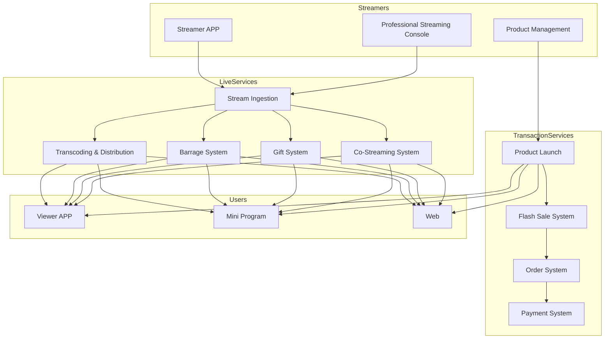
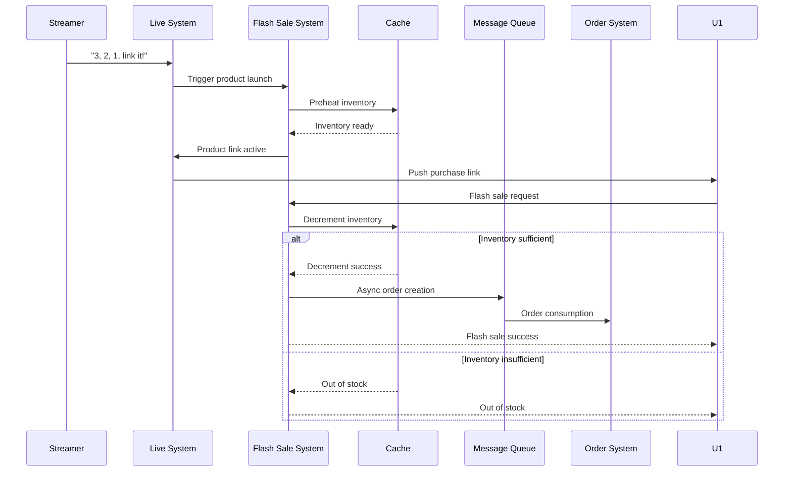
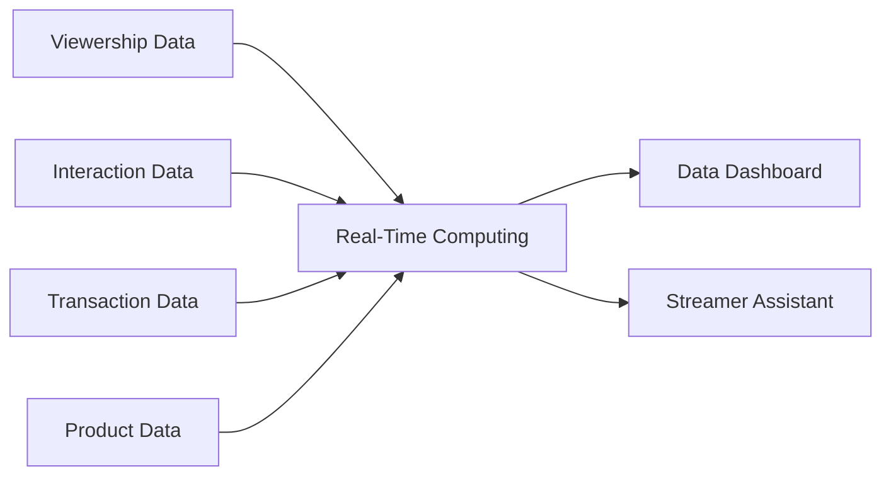

---title: Live Streaming E-Commerce Architecture Design - Alibaba Cloud Perspective
description: 'title: Live Streaming E-Commerce Architecture Design'
summary: 'title: Live Streaming E-Commerce Architecture Design'
category: general
tags:
- architecture
- best-practice
- redis
- hpa
- rag
tier: supporting
created: '2026-05-23'
last_updated: 2026-05
difficulty: intermediate
reading_level: intermediate
audience:
- All Engineers
estimated_read_time: 5min
intent_queries:
- What is Live Streaming E-Commerce Architecture Design - Alibaba Cloud Perspective
- How to implement Live Streaming E-Commerce Architecture Design - Alibaba Cloud Perspective
- Kubernetes 20 application patterns best practices
trigger_keywords:
- Live Streaming E-Commerce
- Alibaba Cloud Perspective
- application
- patterns
prerequisites:
- kubectl-basics
- prometheus-basics
- redis-basics
authors:
- name: Dillan Teagle
  role: contributor
source_path: /Users/teaglebuilt/github/teaglebuilt/knowledge/tree/application/architecture/livestream-ecommerce.md
original_language: Chinese
---

> **Production Environment Safety Notice**
>
> This document contains operational commands that can be executed directly. Before executing, confirm: the target cluster and namespace are correct; you have sufficient RBAC permissions; the command has been tested in a non-production environment. Risk levels for commands: 🔴 High risk (may cause data loss or service interruption), 🟡 Medium risk (modifies cluster state but usually reversible), 🟢 Low risk/read-only (information gathering, no side effects).

title: Live Streaming E-Commerce Architecture Design
description: '# Live Streaming E-Commerce Architecture Design - Alibaba Cloud Perspective'
category: application-architecture
tags:
- k8s
- architecture
- industry
- redis
- hpa
- rag
last_updated: 2026-05-18
difficulty: intermediate
reading_level: intermediate
audience:
- Live Streaming E-Commerce Architects
- E-Commerce Platform Developers
- CDN Solution Engineers
- Alibaba Cloud Video Live Solution Architects
estimated_read_time: 5min
intent_queries:
- Live Streaming E-Commerce Platform [[Kubernetes|Kubernetes]] Deployment Architecture
- Live Streaming Barrage Real-Time System
- Flash Sale High Concurrency Processing
- Live Streaming CDN Acceleration & Content Audit
- Live Streaming E-Commerce Real-Time Data Dashboard
trigger_keywords:
- Live Streaming E-Commerce
- Live Streaming Sales
- Flash Sale
- Barrage System
- Content Audit
- Real-Time Computing
- CDN Acceleration
- GMV
- Livestreamer
- E-Commerce Live Streaming
related_domains:
- domain-03-networking-traffic
- domain-12-observability-comprehensive
- domain-7-ai-ml-platform
related_topics:
- domain-20-application-patterns/topic-application-architecture/44-martech-adtech
- domain-20-application-patterns/topic-application-architecture/37-pet-economy
- domain-20-application-patterns/topic-application-architecture/10-social-media-architecture
k8s_versions:
- '1.28'
- '1.29'
- '1.30'
- '1.31'
- '1.32'
---

# Live Streaming E-Commerce Architecture Design - Alibaba Cloud Perspective

> **Applicable Versions**: Kubernetes v1.29 - v1.33 | **Last Updated**: 2026-05-18
> **Authors**: Alibaba Cloud Solution Architects | **Tags**: `#LiveStreamingECommerce` `#Sales` `#FlashSale` `#AlibabaCloud`

---

## Table of Contents

1. [Industry Background](#1-industry-background)
2. [Business Architecture](#2-business-architecture)
3. [Technical Architecture](#3-technical-architecture)
4. [Core Data Flows](#4-core-data-flows)
5. [Security & Compliance](#5-security--compliance)
6. [Observability](#6-observability)
7. [Alibaba Cloud Component Mapping](#7-alibaba-cloud-component-mapping)
8. [Production Checklist](#8-production-checklist)

---

## 1. Industry Background

### 1.1 Business Characteristics

Live streaming e-commerce merges entertainment with shopping, with extreme traffic peaks:

| Challenge | Description | Architecture Impact |
|:---|:---|:---|
| Ultra-High Concurrency | Top livestreamers with 10+ million concurrent viewers | CDN + Elastic Scaling |
| Flash Sale Peaks | 100,000+ orders/second at launch | Inventory Preheating + Queue |
| Low-Latency Interaction | Barrage/likes/co-streaming < 1s | Real-time Message System |
| Content Compliance | Real-time live content audit | AI Review + Manual Verification |
| Streamer Scheduling | Resource allocation across multiple streams | Intelligent Scheduling |

### 1.2 Core Scenarios

- **Live Room**: Push/pull/barrage/gifts
- **Product Launch**: Flash sales during streams
- **Interactive Gameplay**: Raffles/red packets/co-streaming/battles
- **Real-Time Data Dashboard**: Live GMV/viewership/conversion rate
- **Stream Replay**: Highlight clips and replay

---

## 2. Business Architecture

### 2.1 Live Streaming E-Commerce Full Landscape Architecture



### 2.2 Live Streaming Flash Sale Sequence



---

## 3. Technical Architecture

### 3.1 K8s Deployment

```yaml
# Barrage Service Deployment
apiVersion: apps/v1
kind: Deployment
metadata:
  name: danmaku-service
  namespace: livestream-ecommerce
spec:
  replicas: 20
  selector:
    matchLabels:
      app: danmaku-service
  template:
    metadata:
      labels:
        app: danmaku-service
    spec:
      hostNetwork: true
      containers:
        - name: danmaku
          image: registry.cn-hangzhou.aliyuncs.com/live/danmaku:v4.0.0
          ports:
            - containerPort: 8080
            - containerPort: 9999
              name: websocket
          env:
            - name: MAX_CONNECTIONS
              value: "1000000"
            - name: MESSAGE_FANOUT
              value: "broadcast"
          resources:
            requests:
              memory: "4Gi"
              cpu: "2000m"
            limits:
              memory: "8Gi"
              cpu: "4000m"
```

```yaml
# Flash Sale Service HPA
apiVersion: autoscaling/v2
kind: HorizontalPodAutoscaler
metadata:
  name: seckill-hpa
  namespace: livestream-ecommerce
spec:
  scaleTargetRef:
    apiVersion: apps/v1
    kind: Deployment
    name: seckill-service
  minReplicas: 10
  maxReplicas: 500
  metrics:
    - type: Resource
      resource:
        name: cpu
        target:
          type: Utilization
          averageUtilization: 60
  behavior:
    scaleUp:
      stabilizationWindowSeconds: 0
      policies:
        - type: Percent
          value: 200
          periodSeconds: 15
```

---

## 4. Core Data Flows

### 4.1 Real-Time Data Dashboard



---

## 5. Security & Compliance

- **Content Audit**: Real-time AI audit of live stream content
- **False Advertising**: Product description compliance checking
- **Price Compliance**: Minimum price monitoring

---

## 6. Observability

- **Live Streaming Latency**: < 3s
- **Barrage Delivery**: P99 < 100ms
- **Flash Sale Success Rate**: > 99%

---

## 7. Alibaba Cloud Component Mapping

| Functional Domain | **Alibaba Cloud Cloud-Native Solution** |
|:---|:---|
| Container Platform | **ACK Pro** |
| Live Streaming | **Video Live + CDN** |
| RTC | **Alibaba Cloud RTC** |
| Database | **PolarDB** |
| Cache | **Redis Enterprise** |
| Message Queue | **RocketMQ** |
| AI | **Vision Intelligence / Content Safety** |
| Observability | **ARMS + SLS** |

---

## 8. Production Checklist

- [ ] Live Streaming CDN Preheating
- [ ] Flash Sale System Concurrent Stress Testing
- [ ] Barrage System Million-Level Concurrency
- [ ] AI Content Audit Real-Time Performance
- [ ] Streamer Stream Stability

---

**Maintainers**: Alibaba Cloud Solution Architecture Team | **License**: MIT

---

## Obsidian Related Documents

- topic-application-architecture KUDIG Database — Global MOC
- [[domain-20-application-patterns/topic-application-architecture/README.md|Topic Application Architecture Design Best Practices]]
- [[domain-20-application-patterns/topic-application-architecture/01-ecommerce-architecture.md|E-Commerce System Kubernetes Production Architecture Design]]
- [[domain-20-application-patterns/topic-application-architecture/02-mini-program-architecture.md|Mini Program Platform Architecture Design]]
- [[domain-20-application-patterns/topic-application-architecture/03-cms-architecture.md|CMS Content Management System Architecture Design]]
- [[domain-20-application-patterns/topic-application-architecture/04-im-rtc-architecture.md|Real-Time Communication IM/RTC Architecture Design]]
- [[domain-20-application-patterns/topic-application-architecture/05-online-education-architecture.md|Online Education Platform Kubernetes Production Architecture Design]]
- [[domain-20-application-patterns/topic-application-architecture/06-fintech-architecture.md|FinTech Financial Technology Kubernetes Production Architecture Design]]
- [[domain-20-application-patterns/topic-application-architecture/07-iot-platform-architecture.md|IoT Internet of Things Platform Architecture Design]]
- [[domain-20-application-patterns/topic-application-architecture/08-ai-ml-inference-architecture.md|AI/ML Inference Service Kubernetes Production Architecture Design]]
- [[domain-20-application-patterns/topic-application-architecture/09-gaming-backend-architecture.md|Gaming Backend Kubernetes Production Architecture Design]]
- [[domain-20-application-patterns/topic-application-architecture/10-social-media-architecture.md|Social Media Platform Kubernetes Production Architecture Design]]

## See Also

- 47-smart-mining
- 48-vocational-edtech
- 50-unmanned-retail
- 51-smart-manufacturing-mes


<!-- risk-assessed -->
