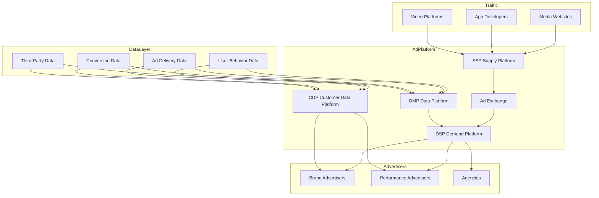
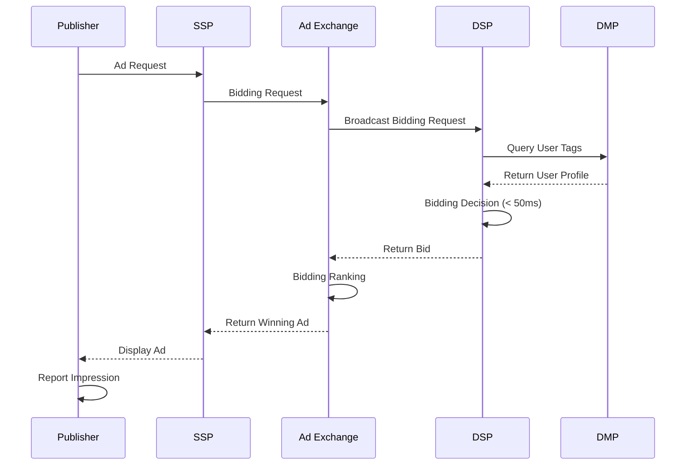
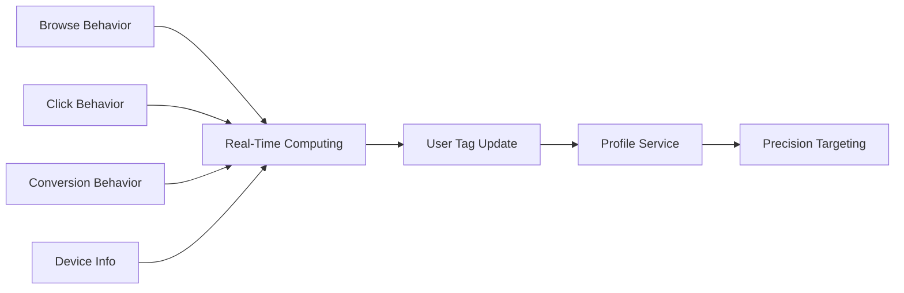

---title: Digital Marketing & AdTech Architecture Design - Alibaba Cloud Perspective
description: 'title: Digital Marketing & AdTech Architecture Design'
summary: 'title: Digital Marketing & AdTech Architecture Design'
category: general
tags:
- architecture
- best-practice
- redis
tier: supporting
created: '2026-05-23'
last_updated: 2026-05
difficulty: intermediate
reading_level: intermediate
audience:
- All Engineers
estimated_read_time: 5min
intent_queries:
- What is Digital Marketing & AdTech Architecture Design - Alibaba Cloud Perspective
- How to implement Digital Marketing & AdTech Architecture Design - Alibaba Cloud Perspective
- Kubernetes 20 application patterns best practices
trigger_keywords:
- Digital Marketing & AdTech
- Alibaba Cloud Perspective
- application
- patterns
prerequisites:
- kubectl-basics
- prometheus-basics
- redis-basics
authors:
- name: Dillan Teagle
  role: contributor
source_path: /Users/teaglebuilt/github/teaglebuilt/knowledge/tree/application/architecture/martech-adtech.md
original_language: Chinese
---

> **Production Environment Safety Notice**
>
> This document contains operational commands that can be executed directly. Before executing, confirm: the target cluster and namespace are correct; you have sufficient RBAC permissions; the command has been tested in a non-production environment. Risk levels for commands: 🔴 High risk (may cause data loss or service interruption), 🟡 Medium risk (modifies cluster state but usually reversible), 🟢 Low risk/read-only (information gathering, no side effects).

title: Digital Marketing & AdTech Architecture Design
description: '# Digital Marketing & AdTech Architecture Design - Alibaba Cloud Perspective'
category: application-architecture
tags:
- k8s
- architecture
- industry
- redis
last_updated: 2026-05-18
difficulty: advanced
reading_level: advanced
audience:
- AdTech Architects
- DSP/SSP Developers
- Digital Marketing Engineers
- Ad Platform Tech Leads
estimated_read_time: 5min
intent_queries:
- martech adtech [[Kubernetes|kubernetes]] architecture
- Programmatic Advertising K8s Deployment
- DSP SSP Ad Platform
- RTB Real-Time Bidding System
- Advertising Big Data Platform
trigger_keywords:
- Digital Marketing
- AdTech
- Programmatic Advertising
- DSP
- SSP
- RTB
- Ad Technology
- MarTech
- DMP
- Advertising K8s
related_domains:
- domain-01-cluster-fundamentals
- domain-10-troubleshooting-diagnostics
- domain-03-networking-traffic
related_topics:
- social-media-architecture
- livestream-ecommerce
- fintech-architecture
k8s_versions:
- '1.28'
- '1.29'
- '1.30'
- '1.31'
- '1.32'
---

# Digital Marketing & AdTech Architecture Design - Alibaba Cloud Perspective

> **Applicable Versions**: Kubernetes v1.29 - v1.33 | **Last Updated**: 2026-04-24
> **Authors**: Alibaba Cloud Solution Architects | **Tags**: `#DigitalMarketing` `#AdTech` `#ProgrammaticAdvertising` `#AlibabaCloud`

---

## Table of Contents

1. [Industry Background](#1-industry-background)
2. [Business Architecture](#2-business-architecture)
3. [Technical Architecture](#3-technical-architecture)
4. [Core Data Flows](#4-core-data-flows)
5. [Security & Compliance](#5-security--compliance)
6. [Observability](#6-observability)
7. [Alibaba Cloud Component Mapping](#7-alibaba-cloud-component-mapping)
8. [Production Checklist](#8-production-checklist)

---

## 1. Industry Background

### 1.1 Business Characteristics

Digital Marketing & AdTech (MarTech/AdTech) is data-driven precision marketing:

| Challenge | Description | Architecture Impact |
|:---|:---|:---|
| Real-Time Bidding | RTB decision within 100ms | Low-latency Computing |
| Data Scale | PB-level user behavior data | Big Data + Real-Time Computing |
| Privacy Compliance | GDPR / Personal Information Protection Law | Data Anonymization + Federated Learning |
| Ad Fraud Detection | Identifying fake traffic | AI Model + Rule Engine |
| Attribution Modeling | Multi-touch conversion attribution | Attribution Model + Data Fusion |

### 1.2 Core Scenarios

- **Programmatic Advertising**: DSP/SSP/Ad Exchange real-time bidding
- **User Profiles**: Cross-domain user tag system
- **Precision Targeting**: Lookalike / Retargeting / Interest Targeting
- **Effect Attribution**: Multi-touch attribution models
- **Anti-Fraud**: Traffic quality identification and filtering

---

## 2. Business Architecture

### 2.1 AdTech Full Landscape Architecture



### 2.2 RTB Real-Time Bidding Sequence



---

## 3. Technical Architecture

### 3.1 K8s Deployment

```yaml
# RTB Bidding Engine Deployment
apiVersion: apps/v1
kind: Deployment
metadata:
  name: rtb-engine
  namespace: adtech
spec:
  replicas: 20
  selector:
    matchLabels:
      app: rtb-engine
  template:
    metadata:
      labels:
        app: rtb-engine
    spec:
      nodeSelector:
        latency: ultra-low
      containers:
        - name: rtb
          image: registry.cn-hangzhou.aliyuncs.com/adtech/rtb-engine:v6.0.0
          ports:
            - containerPort: 8080
          env:
            - name: MAX_BID_LATENCY_MS
              value: "50"
            - name: MODEL_CACHE_SIZE
              value: "1000000"
          resources:
            requests:
              memory: "8Gi"
              cpu: "4000m"
            limits:
              memory: "16Gi"
              cpu: "8000m"
```

---

## 4. Core Data Flows

### 4.1 User Tag Real-Time Computing



---

## 5. Security & Compliance

- **Privacy Compliance**: GDPR / Personal Information Protection Law
- **Data Anonymization**: User ID anonymization
- **Anti-Fraud**: Real-time traffic quality monitoring

---

## 6. Observability

- **Bidding Latency**: P99 < 50ms
- **Ad Fill Rate**: > 80%
- **Anti-Fraud Accuracy**: > 95%

---

## 7. Alibaba Cloud Component Mapping

| Functional Domain | **Alibaba Cloud Cloud-Native Solution** |
|:---|:---|
| Container Platform | **ACK Pro** |
| Real-Time Computing | **Flink** |
| Big Data | **MaxCompute** |
| Cache | **Redis Enterprise** |
| Database | **PolarDB + Hologres** |
| AI | **PAI** |
| Observability | **ARMS + SLS** |

---

## 8. Production Checklist

- [ ] RTB Bidding Latency < 50ms
- [ ] User Tag Real-Time Update < 1min
- [ ] Anti-Fraud Model Accuracy Verification
- [ ] Privacy Compliance Data Anonymization Verification
- [ ] Ad Effect Attribution Accuracy

---

**Maintainers**: Alibaba Cloud Solution Architecture Team | **License**: MIT

---

## Obsidian Related Documents

- topic-application-architecture KUDIG Database — Global MOC
- [[domain-20-application-patterns/topic-application-architecture/README.md|Topic Application Architecture Design Best Practices]]
- [[domain-20-application-patterns/topic-application-architecture/01-ecommerce-architecture.md|E-Commerce System Kubernetes Production Architecture Design]]
- [[domain-20-application-patterns/topic-application-architecture/02-mini-program-architecture.md|Mini Program Platform Architecture Design]]
- [[domain-20-application-patterns/topic-application-architecture/03-cms-architecture.md|CMS Content Management System Architecture Design]]
- [[domain-20-application-patterns/topic-application-architecture/04-im-rtc-architecture.md|Real-Time Communication IM/RTC Architecture Design]]
- [[domain-20-application-patterns/topic-application-architecture/05-online-education-architecture.md|Online Education Platform Kubernetes Production Architecture Design]]
- [[domain-20-application-patterns/topic-application-architecture/06-fintech-architecture.md|FinTech Financial Technology Kubernetes Production Architecture Design]]
- [[domain-20-application-patterns/topic-application-architecture/07-iot-platform-architecture.md|IoT Internet of Things Platform Architecture Design]]
- [[domain-20-application-patterns/topic-application-architecture/08-ai-ml-inference-architecture.md|AI/ML Inference Service Kubernetes Production Architecture Design]]
- [[domain-20-application-patterns/topic-application-architecture/09-gaming-backend-architecture.md|Gaming Backend Kubernetes Production Architecture Design]]
- [[domain-20-application-patterns/topic-application-architecture/10-social-media-architecture.md|Social Media Platform Kubernetes Production Architecture Design]]

## See Also

- 42-secondhand-circular
- 43-enterprise-im
- 45-smart-port-shipping
- 46-satellite-internet


<!-- risk-assessed -->
