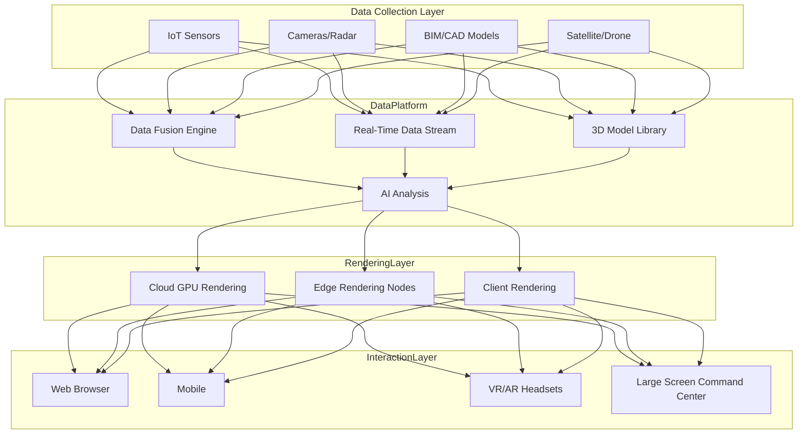
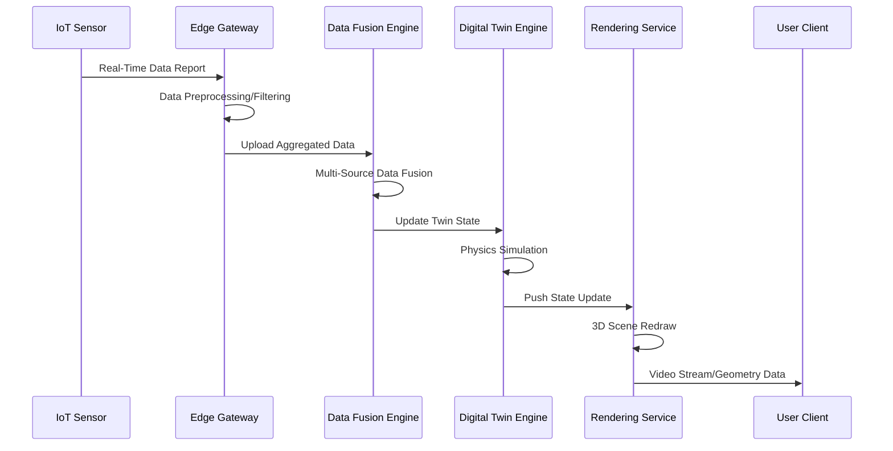
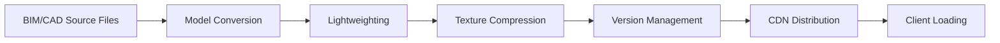

---title: Metaverse Digital Twin Architecture Design - Alibaba Cloud Perspective
description: 'title: Metaverse Digital Twin Architecture Design'
summary: 'title: Metaverse Digital Twin Architecture Design'
category: general
tags:
- architecture
- best-practice
- gpu
- nvidia
tier: supporting
created: '2026-05-23'
last_updated: 2026-05
difficulty: intermediate
reading_level: intermediate
audience:
- All Engineers
estimated_read_time: 5min
intent_queries:
- What is Metaverse Digital Twin Architecture Design - Alibaba Cloud Perspective
- How to implement Metaverse Digital Twin Architecture Design - Alibaba Cloud Perspective
- Kubernetes 20 application patterns best practices
trigger_keywords:
- Metaverse Digital Twin
- Alibaba Cloud Perspective
- application
- patterns
prerequisites:
- kubectl-basics
- prometheus-basics
- gpu-scheduling-basics
authors:
- name: Dillan Teagle
  role: contributor
source_path: /Users/teaglebuilt/github/teaglebuilt/knowledge/tree/application/architecture/metaverse-digital-twin.md
original_language: Chinese
---

> **Production Environment Safety Notice**
>
> This document contains operational commands that can be executed directly. Before executing, confirm: the target cluster and namespace are correct; you have sufficient RBAC permissions; the command has been tested in a non-production environment. Risk levels for commands: 🔴 High risk (may cause data loss or service interruption), 🟡 Medium risk (modifies cluster state but usually reversible), 🟢 Low risk/read-only (information gathering, no side effects).

title: Metaverse Digital Twin Architecture Design
description: '# Metaverse Digital Twin Architecture Design - Alibaba Cloud Perspective'
category: application-architecture
tags:
- k8s
- architecture
- industry
- gpu
- nvidia
last_updated: 2026-05-18
difficulty: advanced
reading_level: advanced
audience:
- Metaverse Platform Architects
- 3D Rendering Engineers
- VR/AR Development Engineers
estimated_read_time: 5min
intent_queries:
- Metaverse 3D Cloud Rendering GPU Cluster
- Digital Twin City Visualization Platform
- IoT Real-Time Data 3D Sync Rendering
- VR AR Immersive Experience Architecture
- Alibaba Cloud GPU Cloud Rendering Service
trigger_keywords:
- Metaverse
- Digital Twin
- 3D Rendering
- Cloud Rendering
- VR Virtual Reality
- AR Augmented Reality
- Real-Time Sync
- GPU Cluster
- Digital Human
- BIM
related_domains:
- domain-03-networking-traffic
- domain-10-troubleshooting-diagnostics
related_topics:
- topic-metaverse-digital-twin
- topic-streaming-architecture
k8s_versions:
- '1.28'
- '1.29'
- '1.30'
- '1.31'
- '1.32'
---

# Metaverse Digital Twin Architecture Design - Alibaba Cloud Perspective

> **Applicable Versions**: [[Kubernetes|Kubernetes]] v1.29 - v1.33 | **Last Updated**: 2026-04-24
> **Authors**: Alibaba Cloud Solution Architects | **Tags**: `#Metaverse` `#DigitalTwin` `#3DRendering` `#AlibabaCloud`

---

## Table of Contents

1. [Industry Background](#1-industry-background)
2. [Business Architecture](#2-business-architecture)
3. [Technical Architecture](#3-technical-architecture)
4. [Core Data Flows](#4-core-data-flows)
5. [Security & Compliance](#5-security--compliance)
6. [Observability](#6-observability)
7. [Alibaba Cloud Component Mapping](#7-alibaba-cloud-component-mapping)
8. [Production Checklist](#8-production-checklist)

---

## 1. Industry Background

### 1.1 Business Characteristics

Metaverse Digital Twin merges 3D rendering, IoT data, real-time interaction:

| Challenge | Description | Architecture Impact |
|:---|:---|:---|
| 3D Rendering Load | Real-time high-fidelity model rendering | GPU Cluster + Cloud Rendering |
| Real-Time Sync | Physical to digital world data sync | Streaming Data + Edge Computing |
| Concurrent Interaction | 10,000+ concurrent users on-screen | Distributed State Sync |
| Model Assets | BIM/CAD/Point Cloud Data | Object Storage + Version Management |
| Low-Latency Interaction | User Operations < 100ms | Edge Nodes + WebRTC |

### 1.2 Core Scenarios

- **Digital Twin Cities**: City-level 3D visualization operations
- **Industrial Twin**: Real-time factory/equipment monitoring and prediction
- **Virtual Showroom**: 3D immersive product display
- **Virtual Meetings**: Metaverse conference spaces
- **Digital Humans**: AI-driven virtual customer service / livestreamers

---

## 2. Business Architecture

### 2.1 Metaverse Digital Twin Full Landscape Architecture



### 2.2 Digital Twin Data Sync Sequence



---

## 3. Technical Architecture

### 3.1 K8s GPU Rendering Cluster

```yaml
# Cloud Rendering Service GPU Deployment
apiVersion: apps/v1
kind: Deployment
metadata:
  name: cloud-render-service
  namespace: metaverse
spec:
  replicas: 5
  selector:
    matchLabels:
      app: cloud-render-service
  template:
    metadata:
      labels:
        app: cloud-render-service
    spec:
      nodeSelector:
        accelerator: nvidia-a10
      runtimeClassName: nvidia
      containers:
        - name: render
          image: registry.cn-hangzhou.aliyuncs.com/metaverse/cloud-render:v1.0.0-gpu
          ports:
            - containerPort: 8080
            - containerPort: 1935
              name: rtmp
          env:
            - name: RENDER_MODE
              value: "realtime-streaming"
            - name: MAX_CONCURRENT_SESSIONS
              value: "8"
          resources:
            requests:
              nvidia.com/gpu: 1
              memory: "16Gi"
              cpu: "8000m"
            limits:
              nvidia.com/gpu: 1
              memory: "32Gi"
              cpu: "16000m"
          volumeMounts:
            - name: model-volume
              mountPath: /models
      volumes:
        - name: model-volume
          persistentVolumeClaim:
            claimName: 3d-model-pvc
```

---

## 4. Core Data Flows

### 4.1 3D Model Pipeline



---

## 5. Security & Compliance

- **Model Assets**: 3D Model Copyright Protection
- **User Privacy**: VR Behavior Data Protection
- **Content Compliance**: UGC Content Audit

---

## 6. Observability

- **Rendering Latency**: P99 < 50ms
- **Concurrent Sessions**: 8 per GPU
- **Model Loading**: P99 < 5s

---

## 7. Alibaba Cloud Component Mapping

| Functional Domain | **Alibaba Cloud Cloud-Native Solution** |
|:---|:---|
| Container Platform | **ACK Pro + GPU Node Pool** |
| GPU Rendering | **GN7/GN10 Instances** |
| 3D Model Storage | **OSS + CDN** |
| Real-Time Computing | **Flink** |
| IoT | **IoT Platform** |
| Database | **PolarDB + Lindorm** |
| AI | **PAI** |
| Observability | **ARMS + SLS** |

---

## 8. Production Checklist

- [ ] GPU Rendering Node Load Balancing
- [ ] 3D Model CDN Preheating
- [ ] Real-Time Data Sync Latency < 100ms
- [ ] VR Framerate Stable at 90FPS
- [ ] Model Asset Version Management Verification

---

**Maintainers**: Alibaba Cloud Solution Architecture Team | **License**: MIT

---

## Obsidian Related Documents

- topic-application-architecture KUDIG Database — Global MOC
- [[domain-20-application-patterns/topic-application-architecture/README.md|Topic Application Architecture Design Best Practices]]
- [[domain-20-application-patterns/topic-application-architecture/01-ecommerce-architecture.md|E-Commerce System Kubernetes Production Architecture Design]]
- [[domain-20-application-patterns/topic-application-architecture/02-mini-program-architecture.md|Mini Program Platform Architecture Design]]
- [[domain-20-application-patterns/topic-application-architecture/03-cms-architecture.md|CMS Content Management System Architecture Design]]
- [[domain-20-application-patterns/topic-application-architecture/04-im-rtc-architecture.md|Real-Time Communication IM/RTC Architecture Design]]
- [[domain-20-application-patterns/topic-application-architecture/05-online-education-architecture.md|Online Education Platform Kubernetes Production Architecture Design]]
- [[domain-20-application-patterns/topic-application-architecture/06-fintech-architecture.md|FinTech Financial Technology Kubernetes Production Architecture Design]]
- [[domain-20-application-patterns/topic-application-architecture/07-iot-platform-architecture.md|IoT Internet of Things Platform Architecture Design]]
- [[domain-20-application-patterns/topic-application-architecture/08-ai-ml-inference-architecture.md|AI/ML Inference Service Kubernetes Production Architecture Design]]
- [[domain-20-application-patterns/topic-application-architecture/09-gaming-backend-architecture.md|Gaming Backend Kubernetes Production Architecture Design]]
- [[domain-20-application-patterns/topic-application-architecture/10-social-media-architecture.md|Social Media Platform Kubernetes Production Architecture Design]]

## See Also

- 33-crossborder-warehouse
- 34-sportstech
- 36-carbon-esg-management
- 37-pet-economy


<!-- risk-assessed -->
